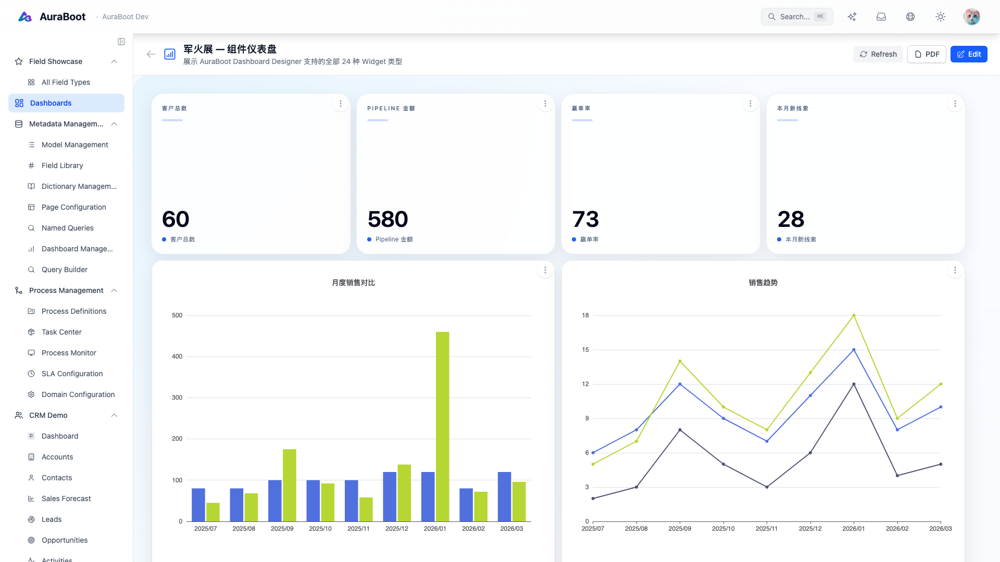
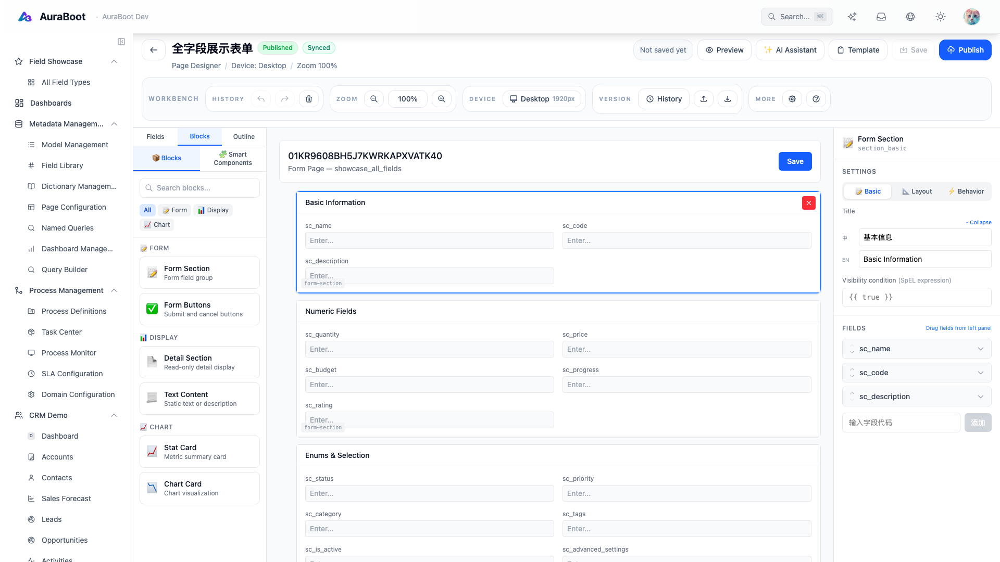
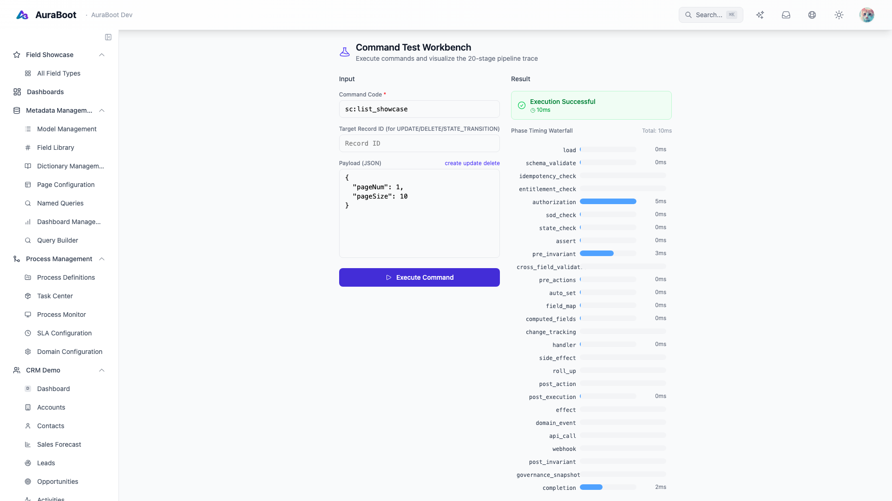
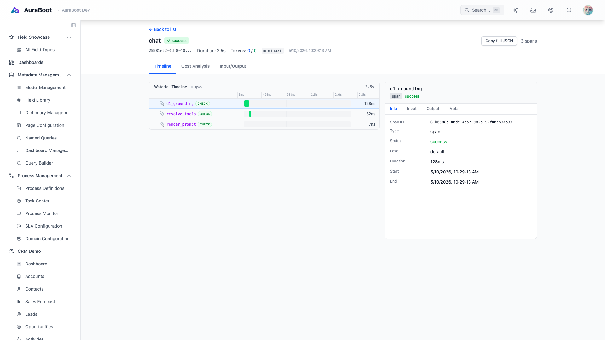

<p align="center">
  <h1 align="center">AuraBoot</h1>
  <p align="center"><strong>Self-hosted low-code for business apps — source-available, beta</strong></p>
</p>

<p align="center">
  <a href="LICENSE.txt"></a>
  <a href="https://github.com/AuraBootTeam/auraboot/actions/workflows/backend.yml"></a>
  <a href="https://github.com/AuraBootTeam/auraboot/actions/workflows/frontend.yml"></a>
  <a href="#"></a>
  <a href="#"></a>
  <a href="#"></a>
  <a href="#"></a>
  <a href="https://github.com/AuraBootTeam/auraboot/stargazers"></a>
  <a href="https://discord.gg/p2fW5A2MW6"></a>
</p>

<p align="center">
  <a href="#quick-start">Quick Start</a> •
  <a href="#key-features">Features</a> •
  <a href="#architecture">Architecture</a> •
  <a href="https://docs.auraboot.com">Docs</a> •
  <a href="https://www.auraboot.com/demo">Demo</a> •
  <a href="https://www.auraboot.com/trust">Trust</a> •
  <a href="https://www.auraboot.com/contact?interest=feedback">Feedback</a> •
  <a href="#community">Community</a>
</p>

---

## What is AuraBoot?

AuraBoot is a source-available, self-hosted platform for building business applications using a declarative DSL (Domain-Specific Language) instead of writing the same CRUD, permission, workflow, and audit plumbing again. Define your data models, pages, commands, and workflows in JSON — the platform generates the database schema, REST APIs, and UI automatically. AI-assisted features such as AuraBot, ChatBI, agents, and RAG run on the same application model when you need them.

## Product Preview

| Dashboard | Page Designer |
|---|---|
|  |  |

| Command Pipeline | AuraBot Trace |
|---|---|
|  |  |

## Public Demo Path

- **Website walkthrough:** [auraboot.com/demo](https://www.auraboot.com/demo) shows the core model -> page -> command loop.
- **PCBA Pilot package:** the PCBA manufacturing package is available for scoped design-partner pilots. It is not GA and should not be described as a full ERP replacement.
- **Trust posture:** [auraboot.com/trust](https://www.auraboot.com/trust) documents the current source-available license posture, security contact, and SOC 2 readiness position. AuraBoot does not claim SOC 2 Type I or Type II certification today.

## Key Features

### DSL Engine
Define models, fields, commands, pages, and formulas in declarative JSON. A single model definition creates the database table, REST endpoints, form validation, and list/detail pages with no code generation step.

### 20+ Stage Command Pipeline
Every data operation flows through a unified pipeline: schema validation → permission check → state machine → field mapping → handler → side effects → webhooks → audit. Fully configurable per command through DSL.

### 3 Visual Designers
- **Page Designer** — Drag-and-drop page builder with 20+ block types (forms, tables, charts, dashboards)
- **BPMN Designer** — Visual workflow editor with human tasks, SLA monitoring, and approval routing
- **Automation Designer** — Event-driven automation rules with triggers, conditions, and actions

### AI-Assisted Workflows
- **AuraBot** — In-app AI assistant for natural language queries, data operations, and guided workflows
- **Agent Control Plane (ACP)** — Orchestrate AI agents with skills, tools, and memory
- **ChatBI** — Ask questions about your data in natural language, get charts and tables back
- **RAG Knowledge Base** — Upload documents (PDF, DOCX, MD, CSV), vector-indexed for AI retrieval
- **Multi-LLM** — OpenAI, Anthropic, Zhipu GLM, MiniMax, and more through a unified provider interface

### BPM Workflow Engine
SmartEngine-based BPMN 2.0 engine with visual process design, human task assignment, approval inbox, escalation rules, and SLA tracking.

### Plugin System
PF4J-based plugin architecture. The OSS repo ships ~20 first-party plugins covering CRM, HR, BPM, asset management, AI / agent control plane, dashboards, and more. Plugins are declarative JSON packages that add models, fields, commands, pages, and menus. Install from a marketplace or build your own with the CLI.

### Multi-Tenant RBAC
Row-level tenant isolation, role-based access control at resource/operation/data levels, and a complete permission system with menus, routes, and API-level enforcement.

### Notifications & Integration
Multi-channel notifications (email, in-app, webhook), event bus for cross-module communication, and webhook dispatch for external integrations.

## Quick Start

### Docker (recommended)

```bash
git clone https://github.com/AuraBootTeam/auraboot.git
cd auraboot
docker compose --profile full up --build -d
```

The `full` profile builds and starts PostgreSQL + the Spring Boot backend + the Node BFF/SSR frontend. Cold start takes 2–4 minutes (the backend health check has a 120s start period). Open [http://localhost:3000](http://localhost:3000) and log in:

If local PostgreSQL is already using port 5432, keep your local service running and start AuraBoot with a different host port:

```bash
POSTGRES_PORT=15432 docker compose --profile full up --build -d
```

| | |
|---|---|
| **Email** | `admin@auraboot.com` |
| **Password** | `Test2026x` (change immediately on first login) |

### Manual Setup

**Prerequisites:** Java 21+, Node.js 20+, PostgreSQL 15+ (Docker stack ships 16), Redis 7+, pnpm 9+

**Start local services first** — `oss-reset-and-init.sh` connects to local PostgreSQL and Redis. Brew/apt-installed services do **not** auto-start:

| OS | Command |
|---|---|
| macOS (Homebrew) | `brew services start postgresql@16 redis` |
| Linux (systemd) | `sudo systemctl start postgresql redis` |
| Windows | See [docs/getting-started/installation.md](docs/getting-started/installation.md) |

The script preflights both endpoints and aborts with a clear message if either is unreachable.

#### Recommended: one-shot script

The `oss-reset-and-init.sh` script handles **everything**: DB reset, backend startup, `/api/bootstrap/setup`, frontend startup, plugin import, and storage state generation. Use this for a clean, working environment.

```bash
git clone https://github.com/AuraBootTeam/auraboot.git
cd auraboot
./scripts/oss-reset-and-init.sh
```

When the script exits successfully, the system is fully bootstrapped and both backend (`http://localhost:6443`) and frontend (`http://localhost:5173`) are running in the background (logs at `/tmp/aura-backend.log`, `/tmp/aura-web.log`, `/tmp/aura-bff.log`).

#### Advanced: stepwise (for debugging individual layers)

Use this when you need to inspect a single layer in isolation — e.g. to attach a debugger to the backend or rebuild plugins without restarting the dev session.

```bash
# 1. Reset DB only — backend + frontend stay stopped, /setup wizard handles bootstrap
./scripts/oss-reset-and-init.sh --no-bootstrap

# 2. Start the backend (Spring Boot, port 6443) in a dedicated terminal
cd platform
./gradlew bootRun

# 3. Start the frontend (Vite + BFF, port 5173) in another terminal
cd web-admin
pnpm install
pnpm dev:full

# 4. Open http://localhost:5173/setup in a browser to drive the bootstrap wizard
```

`pnpm dev:full` is the default foreground developer entrypoint. If you need the frontend in background mode, run `pnpm sync-plugins` once and then start `pnpm dev:web` and `pnpm dev:bff` separately.

### Verify Your Setup

```bash
# Backend baseline tests
cd platform
./gradlew test

# AI runtime regression tests (AuraBot / Agent / RAG / Intent)
./gradlew testAi

# Frontend E2E smoke
cd ../web-admin
NO_PROXY=localhost npx playwright test
```

If you are working on AI features, run both `test` and `testAi`. The AI stack lives in core, but its regression suite is split into a dedicated Gradle task so it can run with a heavier test profile without slowing every default backend run.

## Tech Stack

| Layer | Technology |
|---|---|
| Language | Java 21, TypeScript |
| Backend | Spring Boot 3.5, MyBatis-Plus, PF4J |
| Frontend | React 19, Tailwind CSS 4, React Router 7, Vite 6 |
| Database | PostgreSQL 15+ (with pgvector) |
| Cache | Redis 7+ |
| BPM | SmartEngine 3.7 (BPMN 2.0) |
| AI | Multi-provider LLM integration (OpenAI, Anthropic, Zhipu, etc.) |
| Testing | JUnit 5, Playwright, JaCoCo |
| Observability | OpenTelemetry, Sentry, structured logging |
| Deployment | Docker, Docker Compose |

## Architecture

```
┌─────────────────────────────────────────────────────────────────┐
│                        Frontend (React)                         │
│  Page Designer │ BPMN Designer │ Automation Designer │ AuraBot  │
└──────────────────────────┬──────────────────────────────────────┘
                           │ BFF (Express)
┌──────────────────────────▼──────────────────────────────────────┐
│                     Spring Boot Backend                         │
│                                                                 │
│  ┌─────────────┐  ┌──────────────┐  ┌────────────────────────┐ │
│  │  DSL Engine  │  │  AI Core     │  │  BPM Engine            │ │
│  │  Model       │  │  AuraBot     │  │  SmartEngine (BPMN)    │ │
│  │  Field       │  │  ACP         │  │  Human Tasks           │ │
│  │  Command     │  │  ChatBI      │  │  SLA Monitoring        │ │
│  │  Page        │  │  RAG / KB    │  │  Approval Inbox        │ │
│  │  Formula     │  │  Multi-LLM   │  │                        │ │
│  └──────┬──────┘  └──────────────┘  └────────────────────────┘ │
│         │                                                       │
│  ┌──────▼──────────────────────────────────────────────────┐   │
│  │              20+ Stage Command Pipeline                  │   │
│  │  LOAD → VALIDATE → PERMISSION → STATE → LOCK → HANDLER │   │
│  │  → EFFECT → SIDE_EFFECT → WEBHOOK → AUDIT → COMPLETED  │   │
│  └─────────────────────────────────────────────────────────┘   │
│         │                                                       │
│  ┌──────▼──────┐  ┌──────────────┐  ┌────────────────────────┐ │
│  │  Plugin FW  │  │  RBAC        │  │  Notification          │ │
│  │  (PF4J)     │  │  Multi-Tenant│  │  Email/Webhook/In-App  │ │
│  └─────────────┘  └──────────────┘  └────────────────────────┘ │
└──────────────────────────┬──────────────────────────────────────┘
                           │
              ┌────────────▼────────────┐
              │  PostgreSQL  │  Redis   │
              └─────────────────────────┘
```

## Project Structure

```
auraboot/
├── platform/                 # Spring Boot backend
│   └── src/
│       ├── main/java/        #   Application source
│       └── test/java/        #   Integration tests
├── web-admin/                # React frontend + BFF
│   ├── app/                  #   Application source
│   └── tests/                #   E2E and API tests
├── plugins/                  # Plugin packages (~20 first-party in OSS repo)
│   ├── crm/                  #   CRM plugin
│   ├── sales/                #   Sales management
│   ├── procurement/          #   Procurement
│   └── ...
├── docs/                     # Documentation (54 files)
│   ├── getting-started/      #   Quick start and tutorials
│   ├── core-concepts/        #   DSL, models, commands, pages, permissions
│   ├── guides/               #   Feature how-to guides
│   ├── use-cases/            #   15 industry solution walkthroughs
│   ├── plugin-development/   #   Plugin development guides
│   ├── api-reference/        #   REST API documentation
│   ├── deployment/           #   Docker, K8s, configuration
│   └── architecture/         #   System design and data model
├── scripts/                  # Build, seed, and CI scripts
├── docker/                   # Docker configuration
└── docker-compose.yml        # One-command infrastructure
```

## Documentation

**[Full Documentation →](docs/README.md)**

### Getting Started
- [Introduction](docs/getting-started/introduction.md) — What is AuraBoot, who it's for
- [OSS Onboarding](docs/community/getting-started.md) — Clone, bootstrap, and smoke-test the community edition
- [Open-Source Scope](docs/community/oss-scope.md) — What is and isn't OSS, how to verify, how to adjust scope
- [Quick Start](docs/getting-started/quick-start.md) — Docker Compose setup in 5 minutes
- [Installation](docs/getting-started/installation.md) — Detailed installation guide
- [Build Your First App](docs/getting-started/first-app.md) — 30-minute tutorial

### Core Concepts
- [DSL Engine](docs/core-concepts/dsl-engine.md) — Declarative configuration philosophy
- [Models & Fields](docs/core-concepts/models-and-fields.md) — 22 field types, relations, formulas
- [Commands](docs/core-concepts/commands.md) — 20+ stage pipeline reference
- [Pages & Layouts](docs/core-concepts/pages-and-layouts.md) — Page kinds, blocks, designers
- [Permissions](docs/core-concepts/permissions.md) — RBAC, multi-tenant, data-level security
- [State Machines](docs/core-concepts/state-machines.md) — Status flows and transitions

### Use Cases & Industry Solutions
- [CRM](docs/use-cases/crm.md) — Customer relationship management
- [Project Management](docs/use-cases/project-management.md) — Projects, tasks, Gantt charts
- [Sales](docs/use-cases/sales.md) — Pipeline, quoting, orders
- [Procurement](docs/use-cases/procurement.md) — Purchase orders, supplier management
- [Manufacturing](docs/use-cases/manufacturing.md) — Production planning, BOM, MRP
- [Warehouse](docs/use-cases/warehouse.md) — Inventory, WMS, stock management
- [Finance](docs/use-cases/finance.md) — Invoicing, AP/AR, tax compliance
- [And 8 more →](docs/use-cases/README.md)

### Extend & Deploy
- [Plugin Development](docs/plugin-development/overview.md) — Build plugins with JSON, Java, or React
- [API Reference](docs/api-reference/rest-api.md) — REST APIs, commands, data sources, webhooks
- [Deployment](docs/deployment/docker.md) — Docker, Kubernetes, configuration
- [Architecture](docs/architecture/overview.md) — System design and tech stack

## Community & Enterprise

| Capability | Community (Free) | Enterprise |
|---|:---:|:---:|
| DSL Engine + Page Designer | ✓ | ✓ |
| 20+ Stage Command Pipeline | ✓ | ✓ |
| AI Copilot (AuraBot) | ✓ | ✓ |
| BPM Workflow Engine | ✓ | ✓ |
| Plugin System + CLI | ✓ | ✓ |
| Multi-Tenant RBAC | ✓ | ✓ |
| Agent Orchestration (ACP) | — | ✓ |
| IM (Real-time Messaging) | — | ✓ |
| CRM / ERP Plugin Suite | — | ✓ |
| Mobile Apps (iOS + Android) | — | ✓ |
| Priority Support + SLA | — | ✓ |

For enterprise licensing, use the [AuraBoot contact form](https://www.auraboot.com/contact).

## Community

- [Website feedback form](https://www.auraboot.com/contact?interest=feedback) — Product feedback, beta issues, licensing questions, and private notes
- [GitHub Discussions](https://github.com/AuraBootTeam/auraboot/discussions) — Ask questions and share ideas
- [GitHub Issues](https://github.com/AuraBootTeam/auraboot/issues) — Report bugs or request features
- [Discord](https://discord.gg/p2fW5A2MW6) — Community chat only; use the website form for feedback that needs follow-up

## Contributing

We welcome contributions of all kinds — bug fixes, features, documentation, and plugin development. See [CONTRIBUTING.md](CONTRIBUTING.md) for the development setup, coding standards, and PR process.

## Security

To report a security vulnerability, please email [security@auraboot.com](mailto:security@auraboot.com). Do not open a public issue. See [SECURITY.md](SECURITY.md) for our full security policy.

## License

AuraBoot is released under the [AuraBoot License v1.3](LICENSE.txt), a source-available license based on Apache 2.0 with supplementary terms:

- **Free for internal use** — Use, modify, and deploy for your own business applications. No obligation to open-source your modifications.
- **Free for ISV / project delivery** — Build and deliver business applications (ERP, CRM, vertical SaaS) to customers, with your changes kept private.
- **Attribution required** — Retain copyright notices, license notices, and AuraBoot brand information.
- **Platform restriction** — You may not offer AuraBoot itself as a hosted low-code / no-code / AI platform service without a commercial license.

📖 **See the [License FAQ (中文)](LICENSE-FAQ.md) / [License FAQ (English)](LICENSE-FAQ-en.md)** for common questions about commercial use, modification, redistribution, and SaaS boundaries.

For commercial licensing (multi-tenant low-code SaaS, white-labeling, or removing branding), use the [AuraBoot contact form](https://www.auraboot.com/contact).

---

<p align="center">Built with care by the <a href="https://github.com/AuraBootTeam">AuraBoot Team</a></p>
