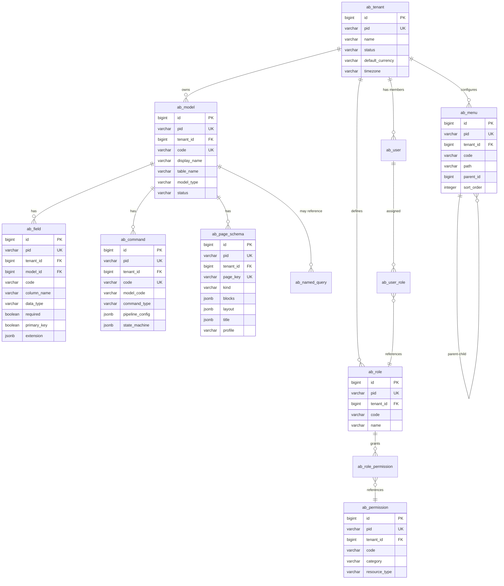

# Data Model

AuraBoot uses PostgreSQL 16 with two categories of tables: **metadata tables** (`ab_*` prefix) that store DSL definitions and platform configuration, and **dynamic tables** (`mt_*` prefix) that store business data created at runtime.

## Core Tables Overview



---

## Metadata Tables (`ab_*`)

### Identity and Access

| Table | Purpose |
|-------|---------|
| `ab_user` | User accounts (email, password hash, profile) |
| `ab_tenant` | Tenant organizations (name, currency, timezone) |
| `ab_tenant_member` | User-tenant membership |
| `ab_role` | Role definitions per tenant |
| `ab_permission` | Permission definitions (code + resource type) |
| `ab_role_permission` | Role-permission bindings |
| `ab_user_role` | User-role assignments |
| `ab_menu` | Navigation menu tree (hierarchical) |
| `ab_user_session` | Active sessions for multi-device management |
| `ab_password_history` | Password reuse prevention |

### DSL Engine

| Table | Purpose |
|-------|---------|
| `ab_model` | Model definitions (code, table name, model type) |
| `ab_field` | Field definitions (data type, validation, extension) |
| `ab_command` | Command definitions (pipeline config, state machine) |
| `ab_command_binding_rule` | Command binding rules (validation expressions) |
| `ab_page_schema` | Page layouts (kind, blocks, layout, title) |
| `ab_named_query` | Named SQL queries for data sources |
| `ab_named_query_field` | Named query column definitions |
| `ab_formula` | Formula definitions for computed fields |
| `ab_dict` | Dictionary definitions (enums, cascading options) |
| `ab_automation_rule` | Automation rules (trigger, condition, action) |

### File Storage

| Table | Purpose |
|-------|---------|
| `ab_file` | File metadata (name, size, MIME type, storage path) |
| `ab_file_relation` | File-entity associations (attach files to records) |

### Infrastructure

| Table | Purpose |
|-------|---------|
| `ab_distributed_lock` | Database-backed distributed locks |
| `ab_query_operator` | SQL operator templates for filter conditions |
| `ab_administrative_division` | Geographic regions (country/state/city hierarchy) |

### Webhook and Audit

| Table | Purpose |
|-------|---------|
| `ab_webhook_subscription` | Webhook endpoint configurations |
| `ab_webhook_delivery_log` | Webhook delivery history |
| `ab_command_audit_log` | Command execution audit trail |

### BPM

| Table | Purpose |
|-------|---------|
| `ab_process_definition` | BPMN process definitions |
| `ab_process_instance` | Running process instances |
| `ab_task` | Human task assignments |
| `ab_task_form_binding` | Form-task bindings |

### Plugin Management

| Table | Purpose |
|-------|---------|
| `ab_plugin` | Installed plugins (code, version, status) |
| `ab_plugin_resource` | Plugin-managed resources (tracks origin) |

---

## Dynamic Tables (`mt_*`)

When a model is published, AuraBoot creates a physical table with the `mt_` prefix:

```
Model code: sc_showcase  →  Table name: mt_sc_showcase
```

### Standard Columns

Every dynamic table includes these system columns:

| Column | Type | Description |
|--------|------|-------------|
| `id` | BIGINT | Primary key (snowflake ID) |
| `pid` | VARCHAR(26) | Public identifier (ULID) |
| `tenant_id` | BIGINT | Tenant isolation |
| `created_at` | TIMESTAMPTZ | Creation timestamp |
| `updated_at` | TIMESTAMPTZ | Last update timestamp |
| `created_by` | BIGINT | Creator user ID |
| `updated_by` | BIGINT | Last updater user ID |

Business columns are added based on the model's field definitions. Column names match field codes (e.g., field `sc_name` creates column `sc_name`).

### No Soft Delete on Dynamic Tables

Dynamic tables (`mt_*`) do **not** have a `deleted_flag` column. Deletion is a hard delete. This is different from metadata tables (`ab_*`) which use soft delete.

---

## Multi-Tenant Design

### Tenant Isolation

Every data table includes a `tenant_id` column. MyBatis-Plus `TenantLineInterceptor` automatically appends `WHERE tenant_id = ?` to every query.

```sql
-- Developer writes:
SELECT * FROM mt_sc_showcase WHERE sc_status = 'active'

-- MyBatis-Plus executes:
SELECT * FROM mt_sc_showcase WHERE sc_status = 'active' AND tenant_id = 1
```

**Important:** Do not manually add `tenant_id` to SQL conditions -- the interceptor handles it automatically. Adding it manually results in duplicate conditions.

### Tenant Context

The current tenant is extracted from the JWT token and stored in `MetaContext` (ThreadLocal):

```java
Long tenantId = MetaContext.getCurrentTenantId();
Long userId = MetaContext.getCurrentUserId();
```

### Cross-Tenant Data

A few tables are tenant-independent:

- `ab_user` -- Users can belong to multiple tenants
- `ab_administrative_division` -- Shared reference data
- `ab_query_operator` -- SQL operator definitions

---

## Indexing Strategy

### Metadata Tables

Metadata tables use standard B-tree indexes:

```sql
-- Unique business keys
CREATE UNIQUE INDEX idx_ab_model_code ON ab_model (code, tenant_id) WHERE deleted_flag = FALSE;

-- Soft-delete partial indexes
CREATE INDEX idx_ab_model_pid ON ab_model (pid) WHERE deleted_flag = FALSE;

-- Foreign key lookups
CREATE INDEX idx_ab_field_model_id ON ab_field (model_id) WHERE deleted_flag = FALSE;
```

**Partial index pattern:** Most indexes include `WHERE deleted_flag = FALSE` to exclude soft-deleted records from index scans.

### Dynamic Tables

Dynamic tables are indexed based on field definitions:

```sql
-- Primary key
CREATE INDEX idx_mt_sc_showcase_pid ON mt_sc_showcase (pid);

-- Tenant isolation (always present)
CREATE INDEX idx_mt_sc_showcase_tenant ON mt_sc_showcase (tenant_id);

-- Searchable fields (based on field definition)
CREATE INDEX idx_mt_sc_showcase_status ON mt_sc_showcase (sc_status, tenant_id);

-- Full-text search (pg_trgm)
CREATE INDEX idx_mt_sc_showcase_name_trgm ON mt_sc_showcase USING gin (sc_name gin_trgm_ops);
```

### AI / Vector Indexes

```sql
-- pgvector IVFFlat index for embedding similarity search
CREATE INDEX idx_embeddings_vector ON ab_embedding USING ivfflat (embedding vector_cosine_ops)
    WITH (lists = 100);
```

---

## Data Lifecycle

### Record States

Records in dynamic tables often follow a state machine defined in the model's command configuration:

```
draft → active → completed → archived
         ↓
      suspended → active
```

State transitions are enforced by the Command Pipeline's STATE stage. Invalid transitions are rejected.

### Audit Trail

Every command execution (create, update, delete, state change) is logged in `ab_command_audit_log`:

| Column | Description |
|--------|-------------|
| `command_code` | Which command was executed |
| `record_id` | Which record was affected |
| `user_id` | Who executed it |
| `payload` | Input data (JSONB) |
| `result` | Output data (JSONB) |
| `success` | Whether execution succeeded |
| `duration_ms` | Execution time |
| `created_at` | Timestamp |

### Soft Delete vs Hard Delete

| Table Category | Delete Strategy |
|----------------|----------------|
| `ab_*` (metadata) | Soft delete (`deleted_flag = TRUE`) |
| `mt_*` (dynamic) | Hard delete (`DELETE FROM`) |

For metadata tables, soft-deleted records are excluded by MyBatis-Plus `LogicDeleteInterceptor`. The `deleted_flag` column and partial indexes ensure soft-deleted records do not impact query performance.

---

## Key Column Conventions

| Convention | Description |
|------------|-------------|
| `id` | Internal numeric ID (snowflake, BIGINT) -- never exposed in APIs |
| `pid` | Public ID (ULID, VARCHAR(26)) -- used in API paths and responses |
| `tenant_id` | Tenant isolation column |
| `created_at` / `updated_at` | Timestamps (TIMESTAMPTZ, UTC) |
| `created_by` / `updated_by` | User ID who performed the operation |
| `deleted_flag` | Soft delete marker (only on `ab_*` tables) |
| `status` | Record status (lowercase string: `draft`, `active`, etc.) |
| `code` | Business identifier (unique within tenant, lowercase) |
| `sort_order` | Display ordering (INTEGER) |
| `extension` | JSONB blob for custom/plugin data |

---

## PostgreSQL Extensions

| Extension | Purpose |
|-----------|---------|
| `pg_trgm` | Trigram-based fuzzy text search indexes |
| `pgcrypto` | Cryptographic functions (token generation, hashing) |
| `vector` (pgvector) | Vector similarity search for AI embeddings |

These extensions are created in `schema.sql` on database initialization.

---

## Entity Relationship Notes

- **Model-Field**: One model has many fields. Field order is determined by `sort_order`.
- **Model-Command**: One model has many commands. Commands reference models by `model_code`.
- **Model-Page**: One model can have multiple page schemas (list, form, detail, dashboard). Pages are identified by `page_key`.
- **Role-Permission**: Many-to-many via `ab_role_permission`. Permissions are checked against the current user's effective role set.
- **User-Tenant**: Many-to-many via `ab_tenant_member`. A user can belong to multiple tenants and switches between them.
- **Menu Tree**: Self-referential via `parent_id`. Menus are filtered by role permissions and platform (web/mobile).
