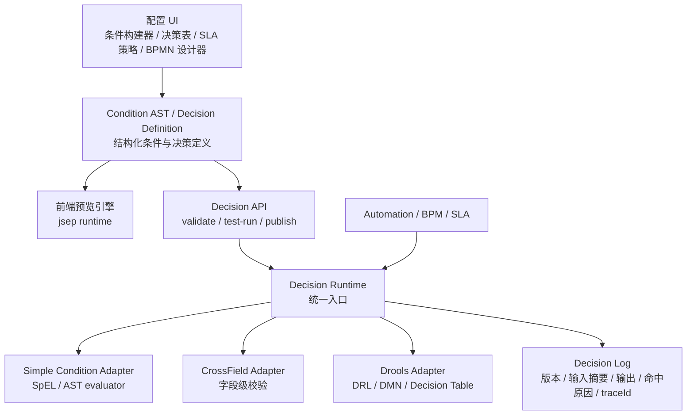

# Decision Runtime 与表达式体系收敛方案

> Review draft。本文用于评审 AuraBoot 后续规则引擎、前端表达式、Automation、BPM、SLA 的统一方案。核心结论是:用户不应手写 Drools；业务规则应通过页面 UI / 决策表 / 条件构建器配置；后端通过统一 Decision Runtime 执行；Drools/DMN 作为复杂规则与决策表能力，不替代所有简单表达式。

## 1. 背景

后续 AuraBoot 会进一步打通 Automation、BPM 和 SLA:

- Automation:什么事件会触发自动化、触发前是否满足条件、控制节点如何分支、动作参数如何映射，都需要高度可配置。
- BPM:金额、等级、优先级、部门、风险等级等都可能影响流程路由、审批人、候选组、节点前置校验、节点后置动作。
- SLA:SLA 的适用条件、deadline 计算、warning、breach、升级、转派、通知动作，也需要与 BPM 和 Automation 集成。

这些能力都会用到“条件 / 表达式 / 规则”。如果各模块继续各自维护表达式语法，会出现语义漂移、审计困难、前后端判断不一致、复杂规则不可治理等问题。

## 2. 当前落地情况

### 2.1 后端已有多种规则能力

当前平台已有以下能力:

| 能力 | 当前位置 | 用途 | 主要问题 |
|---|---|---|---|
| Drools | `DroolsEngineService` / `DroolsRuleService` / `ab_bpm_rule` | BPM rule-task、审批路由、复杂规则 | 目前偏 BPM 局部能力，尚未成为平台级统一决策服务 |
| SpEL 条件 | Automation trigger / control-condition / BPM hook script | 简单条件、自动化触发、轻量脚本 | 分散在各服务中，输入上下文和输出结果不统一 |
| CrossFieldRuleEngine | meta validation | 跨字段校验、表单/元数据约束 | 更像 validation engine，尚未纳入通用决策结果模型 |
| SLA config | `ab_sla_config` / `ab_sla_record` / scheduler | SLA 记录、监控、预警、超时处理 | `warningRules` 格式与 demo/import 配置存在不一致，规则能力较硬编码 |
| BPM event bridge | `BpmEventAutomationBridge` | BPM 事件触发 Automation | 事件可达，但规则判断仍依赖 Automation 自己的条件体系 |

当前 Drools 相关主链路:

- `BpmRunRuleHandler`:命令 `bpm:run-rule`，输入 `ruleCode` 和 `facts`，返回 `_ruleResult`。
- `DroolsServiceTaskDelegate`:BPM `rule-task` 节点调用 Drools，并把结果写回流程变量。
- `AssigneeResolverService`:审批人规则支持 `rule` 类型，调用 Drools 返回 `assigneeUserId` 或 `candidateUserIds`。

这说明平台已经有 Drools 能力，但它现在更像“BPM 内的一个规则执行器”，还不是 Automation、BPM、SLA 共用的 Decision Runtime。

### 2.2 前端表达式是自研且存在多套实现

前端当前不是 Drools，也不是后端 SpEL。它主要是自研表达式体系:

| 实现 | 位置 | 特点 |
|---|---|---|
| meta runtime expression | `web-admin/app/framework/meta/runtime/expression/parser.ts` | 使用 `jsep` 解析类 JavaScript 表达式，支持 `${...}`、函数白名单、危险全局对象拦截 |
| expression context | `web-admin/app/framework/meta/runtime/expression/context.ts` | 定义 `global`、`state`、`form`、`row`、`dict`、`fn` 等前端表达式上下文 |
| studio runtime expression | `web-admin/app/plugins/core-designer/components/studio/services/runtime/expression/expression-parser.ts` | 旧实现，使用 `new Function` 执行表达式，安全边界弱于 `jsep` 版本 |
| BPM condition editor | `web-admin/app/plugins/core-designer/components/bpmn-designer/components/property-editors/ConditionExpressionEditor.tsx` | 页面 UI 把字段、操作符、值序列化成 `${amount > 1000 && status == 'approved'}` |
| shared condition builder | `web-admin/app/shared/designer/expression/serializer.ts` | 简单条件序列化 / 反序列化，支持比较和 includes |

这带来几个风险:

- 同样的表达式字符串，在不同前端模块里可能解析方式不同。
- 前端表达式与后端 SpEL / SmartEngine MVEL / Drools 语义不一致。
- UI-only 表达式和业务决策表达式混在一起，容易误把前端判断当成业务权威。
- 旧 `new Function` 实现存在安全和可治理风险。

## 3. 业界通常怎么做

业界主流不是“一个规则引擎包打天下”，而是分层:

```text
UI 表达式 / 页面联动
        |
简单条件 / 触发条件
        |
决策表 / 业务规则
        |
流程编排 / SLA / 自动化
```

典型模式:

- BPM 用 BPMN，业务决策用 DMN decision table，BPMN 的 Business Rule Task 调用决策表。Camunda 就是 BPMN + DMN 的典型组合。
- Drools 既可以执行 DRL，也支持 DMN 和 decision table。业务用户通常维护决策表或页面 UI，技术人员才维护复杂 DRL。
- Power Automate 一类自动化平台会有自己的轻量表达式体系，用于 trigger condition、action 参数映射、if/else、模板替换。
- ServiceNow 一类平台的 SLA 通常由“适用条件 + 时间策略 + milestone/action plan/flow”组成，SLA 到达节点后触发流程或自动化动作。

参考:

- [Camunda DMN](https://camunda.com/dmn/)
- [Camunda 8 DMN Decision Tables](https://docs.camunda.io/docs/guides/create-decision-tables-using-dmn/)
- [Drools DMN Documentation](https://docs.drools.org/latest/drools-docs/drools/DMN/index.html)
- [Power Automate expressions in conditions](https://learn.microsoft.com/en-us/power-automate/use-expressions-in-conditions)
- [ServiceNow SLA Task trigger](https://www.servicenow.com/docs/r/build-workflows/workflow-studio/create-sla-task-flow.html)

可借鉴的原则:

- 面向业务用户暴露 UI、条件构建器、决策表，不直接暴露底层规则语言。
- 流程、自动化、SLA 不各自实现规则语义，而是调用统一决策服务。
- 简单条件不要强行复杂化，复杂规则不要用简单表达式硬撑。
- 前端可做预览和交互反馈，但业务最终判断必须在后端执行和审计。

## 4. 核心决策

### 4.1 不让用户手写 Drools

用户不应在前台直接写 Drools DRL。原因:

- DRL 面向技术人员，业务用户学习和排错成本高。
- DRL 太灵活，不适合作为低代码平台的直接配置面。
- 直接暴露 DRL 会放大安全、性能、版本治理和多租户隔离风险。
- 大量简单条件写成 DRL 会降低配置效率。

推荐做法:

```text
用户页面 UI / 决策表 / 条件构建器
        |
        v
结构化 Condition AST / Decision Table
        |
        v
后端编译 / 适配
        |
        +-- 简单条件执行
        +-- CrossField 校验
        +-- Drools DRL
        +-- Drools DMN / Decision Table
```

也就是说，Drools 可以作为底层执行能力，但不是用户直接编辑的语言。

### 4.2 不把所有后端条件都强制替换成 Drools

后端可以统一入口，但不建议统一成单一底层引擎。

不建议“所有 `==` 都 Drools 化”的原因:

- `amount > 10000`、`priority == 'HIGH'` 这类简单条件，用 Drools 表达和维护都偏重。
- Drools 有编译、缓存、KieBase/KieSession 生命周期、规则版本和性能治理成本。
- UI 联动和页面状态判断不能每次请求后端 Drools，否则交互体验差。
- 跨字段校验需要字段级错误、warning、message、severity，Drools 可以实现但不是最轻形态。

建议做法是:

```text
统一入口:DecisionRuntime.evaluate(...)

底层多适配器:
  SIMPLE_CONDITION  -> 结构化条件 / 安全 SpEL
  CROSS_FIELD       -> CrossFieldRuleEngine
  DROOLS_DRL        -> Drools DRL
  DROOLS_DMN        -> Drools DMN / decision table
```

这能同时满足两点:

- 对 Automation、BPM、SLA 来说，调用方式统一。
- 对具体规则来说，简单规则保持简单，复杂规则有 Drools/DMN 承载。

### 4.3 前端表达式不再作为业务权威

前端表达式应被分成两类:

| 类型 | 示例 | 是否可前端执行 | 是否业务权威 |
|---|---|---:|---:|
| UI-only 表达式 | `visibleWhen`、`enableWhen`、`readOnlyWhen`、`optionsWhen` | 是 | 否 |
| 业务决策表达式 | Automation trigger、BPM 路由、审批人、SLA deadline/warning/escalation | 可预览 | 否，必须后端执行 |

前端可以做:

- 条件配置 UI。
- 实时预览。
- 静态校验。
- 示例数据 test-run。
- 将结构化条件提交给后端。

前端不应做:

- 直接决定 Automation 是否触发。
- 直接决定 BPM 路由。
- 直接决定 SLA 是否升级。
- 直接保存只有某个前端 runtime 才理解的业务表达式字符串。

## 5. 推荐架构

### 5.1 总体结构



### 5.2 标准输入上下文

Decision Runtime 应统一输入上下文，避免各模块各造变量名:

```json
{
  "event": {},
  "record": {},
  "before": {},
  "after": {},
  "process": {},
  "task": {},
  "sla": {},
  "actor": {},
  "tenant": {},
  "env": {}
}
```

示例:

- Automation record update:使用 `event`、`record`、`before`、`after`、`actor`。
- BPM gateway:使用 `process`、`task`、`record`、`actor`。
- SLA warning:使用 `sla`、`process`、`task`、`record`。

### 5.3 标准输出结果

所有规则引擎适配器都应返回统一结果:

```json
{
  "matched": true,
  "decision": "manager_approval",
  "outputs": {
    "assigneeType": "role",
    "roleCode": "dept_manager",
    "priority": "HIGH"
  },
  "violations": [],
  "actions": [
    {
      "type": "notify",
      "target": "assignee"
    }
  ],
  "reason": "amount > 10000 and priority == HIGH",
  "traceId": "decision-20260607-001"
}
```

不同场景使用不同字段:

- BPM gateway 读取 `decision` 或 `outputs.route`。
- BPM assignee 读取 `outputs.assigneeUserId` / `outputs.candidateUserIds` / `outputs.roleCode`。
- CrossField 校验读取 `violations`。
- SLA 读取 `outputs.deadline`、`actions`。
- Automation 读取 `matched`、`actions` 或 action 参数映射输出。

## 6. Condition AST 与决策表

### 6.1 简单条件统一保存为 AST

不要直接保存前端表达式字符串作为业务事实源。建议保存结构化条件:

```json
{
  "type": "condition_group",
  "op": "and",
  "conditions": [
    {
      "field": "amount",
      "operator": ">",
      "value": 10000
    },
    {
      "field": "priority",
      "operator": "==",
      "value": "HIGH"
    }
  ]
}
```

优点:

- 前端 UI 可稳定编辑和反显。
- 后端可编译为 SpEL、MVEL、Drools DRL、DMN input entry。
- 可做字段存在性校验、类型校验、权限校验。
- 可做影响分析:哪个规则引用了哪个字段。
- 可做国际化展示:把规则解释成人能读的文案。

### 6.2 决策表适合业务用户

对金额、level、priority、部门、客户等级、风险等级这类多条件输出，建议暴露决策表 UI:

| amount | level | priority | 输出 route | 输出 SLA |
|---:|---|---|---|---|
| `<= 10000` | `L1` | `NORMAL` | `manager` | `P2D` |
| `> 10000` | `L2` | `HIGH` | `director` | `P1D` |
| `> 100000` | `L3` | `URGENT` | `vp` | `PT4H` |

底层可以:

- 编译为 Drools DMN。
- 编译为 Drools DRL decision table。
- 或先由平台自有 evaluator 执行，后续再迁移 Drools DMN。

推荐长期方向是 Drools DMN / decision table，因为它更接近业界 BPMN + DMN 模式，也比让用户写 DRL 更适合业务配置。

## 7. 与 Automation / BPM / SLA 的集成

### 7.1 Automation

Automation 应接入 Decision Runtime 的位置:

- trigger condition:事件发生后，调用规则判断是否触发。
- control-condition node:控制节点不直接执行分散 SpEL，而是引用 `conditionRef` 或内联 Condition AST。
- action 参数映射:简单模板可前端预览，真正执行时后端统一解析。
- BPM event trigger:接收 BPM 事件后，使用标准 `event/process/task/record` 上下文判断是否命中。

推荐配置形态:

```json
{
  "triggerType": "on_bpm_event",
  "eventTypes": ["task_assigned"],
  "conditionRef": "complaint_high_priority_task",
  "actions": []
}
```

### 7.2 BPM

BPM 应接入 Decision Runtime 的位置:

- exclusive gateway:简单条件或决策表输出路由。
- rule-task:统一调用 Decision Runtime，不直接绑定 Drools。
- assignee resolver:审批人规则由 Decision Runtime 返回候选人或候选组。
- node pre-check:节点进入前校验 `violations`。
- node post-action:节点完成后根据规则输出动作。

推荐 BPMN 设计器中提供两类 UI:

- 简单条件:字段 + 操作符 + 值。
- 决策引用:选择一个已发布的 `decisionCode`，并展示输入/输出 schema。

### 7.3 SLA

SLA 应接入 Decision Runtime 的位置:

- 适用条件:当前 record/process/task 是否适用某 SLA。
- deadline 计算:固定时长、字段取值、表达式、决策表。
- warning rules:预警阈值、动作、接收人通过结构化规则统一。
- escalation:超时后输出升级动作，如 notify、transfer、start_process、execute_automation。

推荐配置形态:

```json
{
  "name": "高优先级投诉 SLA",
  "targetType": "NODE",
  "targetKey": "handle_complaint",
  "deadlineMode": "RULE",
  "deadlineDecisionRef": "complaint_sla_deadline",
  "warningRules": [
    {
      "when": {
        "type": "condition_group",
        "op": "and",
        "conditions": [
          {
            "field": "sla.progress",
            "operator": ">=",
            "value": 80
          }
        ]
      },
      "actions": [
        {
          "type": "notify",
          "target": "assignee"
        }
      ]
    }
  ]
}
```

## 8. Drools 的定位

### 8.1 Drools 应该做什么

Drools 适合做:

- 复杂流程路由。
- 多条件、多输出的业务决策。
- 审批人 / 候选组 / 风险等级决策。
- SLA deadline / escalation 策略。
- 可由决策表管理的规则集。
- 需要版本、命中解释、审计的核心业务规则。

### 8.2 Drools 不应该做什么

Drools 不适合直接承担:

- 页面 `visibleWhen` 这类 UI-only 表达式。
- 每个简单 `==`、`>`、`contains` 条件。
- 高频前端交互判断。
- 无需审计、无需跨端一致的局部展示逻辑。

### 8.3 如果希望后端最终更多使用 Drools

可以采用“用户配置简单条件，系统生成 Drools”的路线:

```text
Condition AST / Decision Table
        |
        v
Drools DMN / generated DRL
        |
        v
Drools runtime
```

但这应该是后端实现细节，不应改变用户配置体验。用户仍然面对:

- 条件构建器。
- 决策表。
- 字段选择器。
- 输出映射 UI。
- test-run 面板。

不是面对 DRL 编辑器。

## 9. 前端表达式收敛方案

### 9.1 目标

- 前端只保留一套安全 runtime，用于 UI-only 表达式和预览。
- 废弃或隔离 `new Function` 旧实现。
- 业务决策不再保存前端私有表达式字符串。
- 所有可影响业务结果的条件，保存为 Condition AST 或 `decisionRef`。

### 9.2 分层

| 层 | 用途 | 推荐执行位置 |
|---|---|---|
| UI expression | `visibleWhen`、`enableWhen`、`readOnlyWhen` | 前端 `jsep` runtime |
| Condition AST | 简单业务条件、BPM edge、Automation control node | 前端预览 + 后端权威执行 |
| Decision table | 多输入多输出业务决策 | 后端 Decision Runtime |
| Drools/DMN | 复杂规则执行 | 后端 Drools adapter |

### 9.3 迁移策略

1. 建立 `Condition AST` schema 和 operator 白名单。
2. 让 BPM condition editor 和 shared ConditionBuilder 输出 AST，同时保留 legacy expression 字段用于兼容。
3. 前端预览由 AST 编译到当前 `jsep` runtime。
4. 后端新增 `/decision/validate` 和 `/decision/test-run`，用于设计器校验和试运行。
5. 逐步把 Automation trigger condition、control-condition、BPM gateway、SLA warningRules 从字符串迁移为 AST / decisionRef。
6. 标记 `new Function` runtime 为 legacy，仅允许在旧配置兼容路径使用，禁止新功能依赖。

## 10. 数据模型建议

### 10.1 Decision Definition

建议新增或扩展平台级规则定义:

```json
{
  "decisionCode": "complaint_sla_deadline",
  "decisionName": "投诉 SLA 时限规则",
  "engineType": "DROOLS_DMN",
  "scopeType": "SLA",
  "scopeRef": "complaint",
  "inputSchema": {},
  "outputSchema": {},
  "content": {},
  "version": 3,
  "status": "PUBLISHED",
  "enabled": true
}
```

`engineType` 建议枚举:

- `SIMPLE_CONDITION`
- `CROSS_FIELD`
- `DROOLS_DRL`
- `DROOLS_DMN`
- `DECISION_TABLE`

### 10.2 Decision Log

建议新增统一审计日志:

```json
{
  "traceId": "decision-20260607-001",
  "decisionCode": "complaint_sla_deadline",
  "version": 3,
  "engineType": "DROOLS_DMN",
  "tenantId": "t1",
  "callerType": "SLA",
  "callerRef": "sla-record-001",
  "inputDigest": "...",
  "result": {},
  "matched": true,
  "durationMs": 12,
  "error": null,
  "createdAt": "2026-06-07T10:00:00+08:00"
}
```

日志不应默认保存完整敏感输入，应至少支持:

- 输入摘要。
- 可配置脱敏字段。
- debug 模式下短期保留完整输入。
- traceId 贯穿 Automation / BPM / SLA。

## 11. 里程碑

### M1:规则入口统一

- 新增 `DecisionRuntime` 接口。
- 把现有 Drools 调用包装成 `DroolsDecisionAdapter`。
- 把简单条件 / SpEL 包装成 `SimpleConditionAdapter`。
- 把 CrossFieldRuleEngine 包装成 `CrossFieldDecisionAdapter`。
- 定义标准 `DecisionContext` 和 `DecisionResult`。
- 新增 Decision test-run API。

### M2:前端表达式收敛

- 建立 Condition AST schema。
- ConditionBuilder / BPM condition editor 输出 AST。
- UI-only 表达式统一到 `jsep` runtime。
- 旧 `new Function` runtime 标记 legacy 并限制新使用。
- 前端接入后端 validate/test-run。

### M3:Automation / BPM 接入

- Automation trigger condition 支持 `conditionRef` / Condition AST。
- Automation control-condition 通过 Decision Runtime 执行。
- BPM rule-task 从直接 Drools 改为 Decision Runtime。
- BPM gateway 支持 Condition AST / decisionRef。
- AssigneeResolver 改为通过 Decision Runtime 解析规则型审批人。

### M4:SLA 接入

- 统一 SLA `warningRules` 格式。
- 支持 `deadlineMode=RULE`。
- SLA warning / breach actions 通过标准 actions 输出。
- SLA milestone 可触发 Automation 或 BPM。

### M5:治理与运营

- 决策版本发布 / 回滚。
- 决策影响分析。
- 命中解释和审计查询。
- 性能指标和缓存管理。
- 多租户隔离、安全白名单、超时控制。

## 12. 关键风险与控制

| 风险 | 说明 | 控制措施 |
|---|---|---|
| 语法继续漂移 | 前端、Automation、BPM、SLA 继续各自存字符串 | 新增业务条件必须存 AST 或 decisionRef |
| Drools 过度使用 | 简单条件也进入 Drools，复杂度上升 | 保留 SIMPLE_CONDITION adapter，Drools 用于复杂规则 |
| 用户误用 DRL | 业务用户直接编辑 DRL | 前台只提供 UI / 决策表；DRL 仅后台高级能力 |
| 前端预览与后端结果不一致 | jsep 和后端语义不同 | 前端预览只作辅助，发布前必须后端 test-run |
| SLA 格式不一致 | 当前 demo/import/scheduler 对 warningRules 约定不一 | M4 统一 SLA schema，并提供 migration |
| 审计缺失 | 规则命中后无法解释 | Decision Log 强制记录 traceId、版本、结果、耗时 |

## 13. 推荐结论

推荐采用:

```text
统一 Decision Runtime
    +
结构化 Condition AST
    +
业务友好的决策表 UI
    +
Drools/DMN 作为复杂规则底层能力
    +
前端 jsep runtime 仅用于 UI-only 表达式和预览
```

不推荐:

- 用户在前台手写 Drools。
- 所有简单条件都强制 Drools 化。
- 前端表达式直接作为业务权威。
- Automation、BPM、SLA 各自维护规则语义。

最终形态应该是:

- 用户在页面 UI 配条件和决策表。
- 前端负责编辑体验和预览。
- 后端 Decision Runtime 负责权威执行。
- Drools/DMN 负责复杂规则和决策表。
- Automation、BPM、SLA 都消费同一套决策结果。

