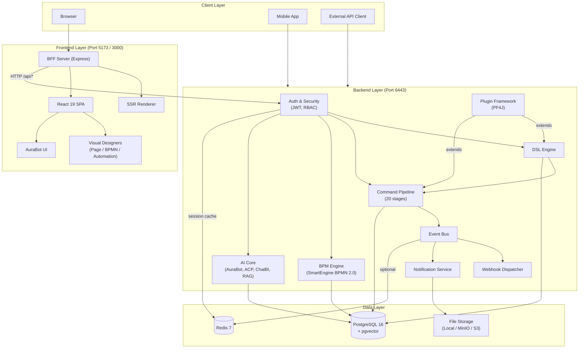
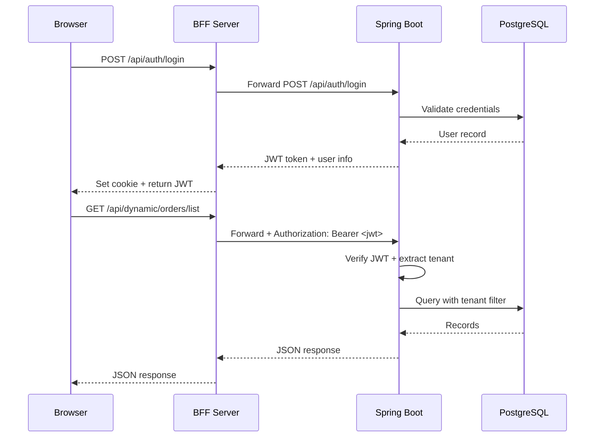
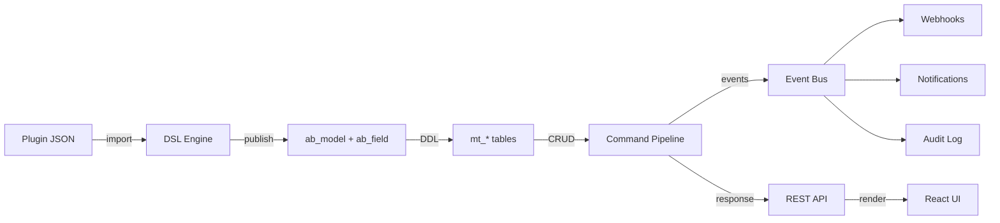

# Architecture Overview

AuraBoot is a full-stack platform for building business applications through declarative DSL configuration. This document describes the system architecture, request flow, and extension points.

## System Architecture



## Request Flow

A typical request flows through these layers:

```
Browser
  → BFF (Express, port 5173)
    → Spring Boot Backend (port 6443)
      → JWT Authentication
        → Permission Check (RBAC)
          → Controller (Dynamic / Command / DataSource / etc.)
            → Service Layer
              → Command Pipeline (20 stages, for write operations)
                → MyBatis-Plus / PostgreSQL
              → Event Bus → Webhooks / Notifications
    ← JSON Response
  ← HTML (SSR) or JSON (API)
← Rendered Page
```

### BFF Layer

The Backend-For-Frontend (BFF) server is an Express.js process that:

1. Serves the React application (SSR for initial page loads, CSR for navigation)
2. Proxies `/api/*` requests to the Spring Boot backend
3. Handles authentication cookies and token refresh
4. Provides server-side rendering with user/tenant context

### Authentication Flow



---

## Key Subsystems

### DSL Engine

The core of AuraBoot. Parses declarative JSON definitions to create:

- **Models** -- Data structure definitions that auto-generate database tables
- **Fields** -- Typed field definitions with validation, defaults, and display rules
- **Commands** -- Data operations that flow through the 20-stage pipeline
- **Pages** -- UI layouts defined as blocks (table, form, chart, etc.)
- **Formulas** -- Computed fields and cross-record calculations

Models and fields are stored in `ab_model` and `ab_field` tables. Dynamic data is stored in `mt_*` prefixed tables, created at runtime.

### Command Pipeline

Every write operation (create, update, delete, state transition) flows through a 20-stage pipeline:

```
LOAD → VALIDATE → PERMISSION → STATE → LOCK → PRE_HANDLER
→ FORMULA → FIELD_MAPPING → HANDLER → POST_HANDLER
→ EFFECT → SIDE_EFFECT → NOTIFICATION → WEBHOOK
→ AUDIT → CACHE → INDEX → SYNC → CALLBACK → COMPLETED
```

Each stage is configurable per command. Stages can be skipped, have custom handlers, or define conditional execution. This unified pipeline ensures consistent behavior for validation, permissions, audit logging, and webhook dispatch across all operations.

### Plugin System

Built on PF4J. Plugins are declarative JSON packages that can add:

- Models and fields
- Commands and command handlers
- Pages and page blocks
- Menus and permissions
- Named queries and data sources
- i18n translations

Plugins are imported via the CLI (`aura plugin publish plugins/crm --yes`) or the Plugin API. The platform ships with 27+ community plugins covering CRM, sales, procurement, HR, and more.

### AI Core

Multi-LLM abstraction layer supporting:

- **AuraBot** -- In-app conversational assistant
- **Agent Control Plane (ACP)** -- Orchestration of AI agents with tools and memory
- **ChatBI** -- Natural language to SQL/charts
- **RAG Knowledge Base** -- Document ingestion, vector embedding (pgvector), and retrieval

Provider interface supports OpenAI, Anthropic, Zhipu GLM, MiniMax, and custom providers.

### BPM Engine

SmartEngine-based BPMN 2.0 engine:

- Visual process designer (BPMN diagram editor)
- Human task assignment and approval inbox
- SLA monitoring and escalation
- Form binding for human tasks
- Integration with the Command Pipeline for task completion

### Multi-Tenant RBAC

Row-level tenant isolation using `tenant_id` columns and MyBatis `TenantLineInterceptor`:

- Every query automatically includes `WHERE tenant_id = ?`
- Roles define permission sets (resource + operation + data scope)
- Permissions are checked at API, command, and page levels
- Menus are filtered by user role and platform (web/mobile)

### Event Bus

Decoupled event system for cross-module communication:

- **Local** transport for single-instance deployments
- **Redis** transport for multi-instance
- Events trigger webhooks, notifications, automation rules, and audit logs

---

## Module Organization

```
platform/src/main/java/com/auraboot/framework/
├── auth/               # Authentication, JWT, password management
├── application/        # Application context, tenant context
├── common/             # Shared DTOs, constants, utilities
├── exception/          # Global exception handling
├── meta/               # DSL Engine (models, fields, commands, pages)
│   ├── controller/     #   REST API controllers
│   ├── dto/            #   Data transfer objects
│   ├── entity/         #   Database entities
│   ├── mapper/         #   MyBatis mappers
│   └── service/        #   Business logic
├── permission/         # RBAC, role/permission management
├── plugin/             # PF4J plugin framework
├── tenant/             # Multi-tenant management
├── user/               # User management
├── webhook/            # Webhook dispatch and delivery
├── notification/       # Multi-channel notifications
├── bpm/                # BPM/workflow engine
├── ai/                 # AI core (AuraBot, ACP, ChatBI, RAG)
├── currency/           # Multi-currency support
├── saas/               # SaaS mode configuration
└── smart/              # SmartEngine integration
```

Frontend:

```
web-admin/app/
├── components/         # Shared React components
├── features/           # Feature modules
│   ├── dynamic/        #   Dynamic page renderer
│   ├── studio/         #   Page Designer / Studio
│   ├── bpm/            #   BPM designer and inbox
│   ├── automation/     #   Automation designer
│   └── ai/             #   AuraBot UI
├── layouts/            # App shell, sidebar, header
├── routes/             # React Router route definitions
├── services/           # API client services
└── i18n/               # Internationalization
```

---

## Extension Points

AuraBoot provides several extension points for customization:

| Extension Point | Mechanism | Use Case |
|-----------------|-----------|----------|
| Custom Commands | DSL command + handler class | Business logic beyond CRUD |
| Command Pipeline Stages | Stage handler registration | Cross-cutting concerns |
| Field Types | Field type registry | Custom data types |
| Page Block Types | Block renderer registration | Custom UI components |
| Data Sources | Named Query + DataSource API | Custom data providers |
| LLM Providers | Provider interface + config | Additional AI models |
| Storage Providers | StorageSpi interface | Custom file storage |
| MQ Providers | MQProvider interface | Custom message queue |
| Plugins | PF4J plugin package | Full-featured extensions |
| Webhooks | Webhook API | External system integration |
| Automation Rules | Automation designer | Event-driven workflows |

---

## Data Flow Summary



1. Plugins define models, fields, commands, and pages in JSON
2. The DSL Engine parses and stores definitions in metadata tables
3. Model publishing creates/updates dynamic `mt_*` tables
4. Data operations flow through the Command Pipeline
5. Events trigger webhooks, notifications, and audit logging
6. The React frontend renders pages based on DSL page schemas
