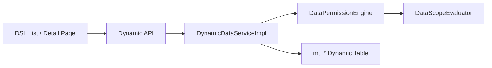

# RBAC Data Scope Runtime and E2E Strategy

本文沉淀 RBAC 数据范围在 AuraBoot Dynamic/DSL 场景下的一期落地方案，以及面向未来角色和组织范围扩展的 E2E 验证策略。

一期目标收敛为两条业务语义：

1. 普通角色只能看到自己创建的数据。
2. 管理员角色可以看到当前租户内全部数据。

同时保留后续扩展能力，例如“小组长查看本小组数据”“报价员只看自己创建的数据”“BOM 转换员只看自己创建的数据”。

## 核心结论

当前平台已经具备一期所需的核心能力，但必须按统一口径使用：

| 问题 | 一期结论 |
|---|---|
| 是否能基于 Dynamic 查询实现 | 可以。标准 Dynamic 模型的 list/detail/update/delete 主路径可以接入统一数据范围判断。 |
| RBAC 是否支持 scope 概念 | 支持，但要区分 role scope、data scope、legacy data permission policy。 |
| 管理员是否应该写特殊绕过分支 | 不应该。管理员也通过授权策略计算得到 `all`，业务查询不写 `if admin` 分支。 |
| 普通用户看自己怎么表达 | 角色默认数据范围为 `self`，一期全模型统一转成 `created_by = currentUserId`。 |
| 管理员看全部怎么表达 | 管理员角色默认数据范围为 `all`，运行时不追加行级过滤条件，但只限当前租户。 |
| 测试方案是否通用 | 应该做成角色 + 模型 + scope 的矩阵，不绑定 `operator`/`viewer`，未来可直接换成报价员、BOM 转换员、组长等角色。 |

## 概念边界

RBAC 一期落地时最容易混淆三类 scope。

| 概念 | 作用 | 一期是否用于行级数据可见性 |
|---|---|---|
| Role scope | 角色本身适用范围，例如租户级、部门级角色管理边界。 | 否。它回答“这个角色在哪里可被使用”。 |
| Data scope | 某个角色拿到某个资源动作后，可以访问哪些记录。 | 是。一期核心只用 `self` 和 `all`。 |
| Legacy data permission policy | 旧的数据权限策略，通常是额外 policy/filter。 | 兼容保留，但不作为新方案主入口。 |

推荐长期模型：

```text
Role answers: who has which permission
DataScope answers: which rows this permission can access
Dynamic runtime answers: how to translate the scope into list/detail/write checks
```

不要把“是否管理员”散落在业务代码里判断。业务代码只问统一授权结果：

```text
tenant member + role grants + permission action + data scope -> row visibility
```

## 当前运行时链路

标准 Dynamic/DSL 页面请求大致经过以下链路：



关键代码位置：

| 能力 | 位置 |
|---|---|
| Dynamic list/detail/update/delete 主服务 | `platform/src/main/java/com/auraboot/framework/meta/service/impl/DynamicDataServiceImpl.java` |
| 行级权限过滤与单记录判断 | `platform/src/main/java/com/auraboot/framework/meta/service/impl/DataPermissionEngineImpl.java` |
| Data scope 解析 | `platform/src/main/java/com/auraboot/framework/permission/service/impl/DataScopeServiceImpl.java` |
| Data scope 条件与 record verdict | `platform/src/main/java/com/auraboot/framework/permission/engine/evaluator/DataScopeEvaluator.java` |
| 角色默认数据范围继承 | `platform/src/main/java/com/auraboot/framework/permission/service/impl/RolePermissionServiceImpl.java` |
| 插件角色导入 | `platform/src/main/java/com/auraboot/framework/plugin/service/impl/PluginResourceImporterImpl.java` |

一期按以下语义执行：

| 操作 | 要求 |
|---|---|
| list | 在 tenant 条件之后叠加数据范围 SQL 条件。 |
| count | 与 list 使用同一组过滤条件，避免分页总数泄漏。 |
| detail/getById | 查到记录后再用 data scope 做单记录判断，不允许绕过 list 访问他人记录。 |
| update/delete | 先经过 detail/getById 判断，只有可见记录才能继续写入。 |
| batchUpdate | 逐条走 update 路径，继承单记录权限判断。 |
| batchDelete | 逐条走 delete/getById 路径，继承单记录权限判断，不按 id 集合直删。 |
| relation | 先校验源记录可见性，再对目标模型叠加 row/domain filter。 |
| export/options | 需要逐项确认是否已经统一接入 row filter，不能只验证 list。 |
| Dynamic aggregate/chart | 动态模型聚合查询叠加 row/domain filter；NamedQuery 聚合仍按二期边界处理。 |
| custom action | `count` 叠加 row/domain filter；`truncate` 不作为 DataScope-safe 动态动作开放。 |

已知边界：

| 边界 | 一期处理 |
|---|---|
| NamedQuery `nq:*` 是独立查询引擎，不会天然继承 Dynamic row filter。 | 一期不把 NamedQuery 当作已自动支持；二期按显式 `resourceCode` + `actionCode` 接入，不靠 SQL 或字段推断。 |
| 自定义 Controller/PF4J Handler 不会自动继承 Dynamic scope。 | 需要显式调用统一授权服务或只调用已经受控的 Dynamic 服务。 |
| action code 不一致会导致 scope 解析不到。 | Dynamic 读权限统一使用 `read`，不要只配置 `view`。 |

## 一期授权配置口径

### 角色配置

角色只配置默认数据范围，不写业务绕过逻辑。

推荐在插件 `config/roles.json` 中表达：

```json
[
  {
    "code": "business_user",
    "name:zh-CN": "业务用户",
    "name:en": "Business User",
    "description": "Can read own business records",
    "defaultDataScopeType": "self",
    "permissions": [
      "model.example_order.read"
    ]
  },
  {
    "code": "tenant_admin",
    "name:zh-CN": "租户管理员",
    "name:en": "Tenant Administrator",
    "description": "Can read all records in the tenant",
    "defaultDataScopeType": "all",
    "permissions": [
      "model.example_order.read"
    ]
  }
]
```

实际 permission code 以模型发布后生成的权限码为准，必须符合平台权限命名规范。Dynamic 读权限的 action 必须是 `read`。

### Scope 类型

一期只承诺两类：

| scope | 语义 | SQL/record 判断方向 |
|---|---|---|
| `self` | 当前用户创建的数据 | 一期全模型统一使用 `created_by = currentUserId`。 |
| `all` | 当前租户内全部数据 | 不追加行级过滤条件，但仍保留 tenant 隔离；不表示跨租户。 |

暂不在一期实现复杂组织范围，但数据结构和测试矩阵要为后续预留：

| 未来 scope | 语义 |
|---|---|
| `dept` | 当前用户所属部门数据。 |
| `dept_and_sub` | 当前部门及下级部门数据。 |
| `group`/`team` | 当前小组数据，适用于小组长。 |
| `assigned` | 分派给当前用户的数据，适用于客服、报价、处理人等场景；报价员和 BOM 转换员一期暂不使用。 |
| `custom` | 通过表达式或策略定义复杂范围。 |

## DSL 与 Dynamic 使用约束

一期只把标准 Dynamic 模型作为自动数据范围的主承载。

推荐 DSL 页面满足以下约束：

1. 页面基于 Dynamic model 的标准 list/detail/form/workbench 组合。
2. 菜单和页面入口仍由功能权限控制可见性。
3. list/detail 数据请求必须走 Dynamic API，不绕到自定义查询接口。
4. Dynamic model 的读权限使用 `read` action。
5. 记录创建时必须可靠写入 `created_by`，用于 `self` 判断。

如果页面中混用 NamedQuery dataSource、自定义 block API 或 PF4J 自定义接口，必须在页面块级覆盖矩阵中单独列出，并明确它是否已经执行数据范围过滤。

## 判断管理员角色的最佳实践

不要在业务层写：

```text
if user has role admin:
    return all
else:
    return own
```

推荐写法是：

```text
resolve member roles
resolve granted permission for resource/action
resolve role data scopes
merge scopes by strategy
evaluate final scope
apply final condition or verdict
```

也就是说，“管理员”不是业务代码分支，而是一个拥有 `all` data scope 的角色。

这样做的收益：

| 收益 | 说明 |
|---|---|
| 可扩展 | 后续加小组长、报价主管、区域经理，不需要改每个业务查询。 |
| 可测试 | E2E 只需要替换 role matrix，不需要按角色复制测试代码。 |
| 可审计 | 数据范围来自角色授权配置，能在权限 UI 和数据库里追踪。 |
| 防绕过 | list、detail、update、delete 统一走同一个授权计算。 |

## 通用 E2E 验证方案

E2E 不要写死“普通用户”和“管理员”两个账号，而应抽象成数据范围矩阵。

推荐矩阵：

```typescript
type DataScopeRuntimeCase = {
  roleCode: string;
  userKey: string;
  storageState: string;
  modelCode: string;
  pageKey: string;
  permissionAction: 'read';
  scopeType: 'self' | 'all' | 'dept' | 'dept_and_sub' | 'group' | 'assigned';
  ownRecordLabel: string;
  otherRecordLabel: string;
  expectedList: {
    ownVisible: boolean;
    otherVisible: boolean;
  };
  expectedDetail: {
    ownAllowed: boolean;
    otherAllowed: boolean;
  };
};
```

一期用例可以落成：

| case | 角色 | scope | 自己创建 | 他人创建 | detail 访问他人 |
|---|---|---|---|---|---|
| normal self list | 普通业务角色 | `self` | 可见 | 不可见 | 禁止或无权 |
| admin all list | 管理员角色 | `all` | 可见 | 可见 | 允许 |
| action scope guard | 任意角色 | `self`/`all` | 取决于 scope | 取决于 scope | 验证 action 必须是 `read` |

未来增加报价员和 BOM 转换员时，只扩展矩阵，不改断言框架：

| roleCode | modelCode | scopeType | 业务语义 |
|---|---|---|---|
| `quoter` | `quote_request` | `self` | 报价员一期按角色授权，数据范围按创建人过滤。 |
| `bom_converter` | `bom_conversion_task` | `self` | BOM 转换员一期按角色授权，数据范围按创建人过滤。 |
| `tenant_admin` | `quote_request` / `bom_conversion_task` | `all` | 管理员看当前租户内全部。 |
| `team_lead` | 任意业务模型 | `group` | 小组长看本小组数据。 |

### E2E 目录建议

推荐新增或复用以下位置：

```text
web-admin/tests/e2e/permission/dynamic-data-scope-runtime.spec.ts
web-admin/tests/e2e/permission/helpers/data-scope-matrix.ts
web-admin/tests/api/setup/01-multi-role-users.spec.ts
web-admin/tests/helpers/test-accounts.ts
```

已有项目能力：

| 能力 | 位置 |
|---|---|
| 多角色 storage state | `web-admin/playwright.config.ts` |
| admin/operator/viewer 登录状态 | `web-admin/tests/auth.setup.ts` |
| operator/viewer 测试用户准备 | `web-admin/tests/api/setup/01-multi-role-users.spec.ts` |
| 权限 UI 默认 scope 黄金测试 | `web-admin/tests/e2e/permission/role-default-scope-golden.spec.ts` |

一期可以先复用 admin/operator/viewer；如果要验证业务角色名称，例如报价员、BOM 转换员，再把账号准备和 storage state 扩展为可配置。

### E2E 准备流程

```text
beforeAll:
  ensure test users
  ensure test roles
  grant dynamic read permission with scope
  assign users to roles
  create record as owner user
  create record as another user
```

数据准备建议优先走 API，避免 UI 创建数据导致测试变慢和脆弱。但断言必须通过真实 UI 页面完成：

```text
open sidebar/menu
navigate to DSL list page
assert own row visibility
assert other row hidden or visible
open detail by row/action
assert allowed or denied state
reload page
assert result remains stable
```

不要用 mock 数据、不要 mock 权限接口、不要只用 API 断言替代 UI。API 可作为 setup 和 backend evidence，但最终可见性必须通过浏览器 E2E 验证。

### E2E 断言要求

每个模型至少覆盖：

| 维度 | 断言 |
|---|---|
| list | 普通用户看得到自己记录，看不到他人记录。 |
| count/pagination | 普通用户分页总数不包含他人记录。 |
| detail | 普通用户不能通过 URL 或行操作打开他人记录详情。 |
| admin list | 管理员看得到自己和他人记录。 |
| admin detail | 管理员可以打开任意记录详情。 |
| reload | 刷新后权限结果不漂移。 |
| menu | 角色有 read 权限时可见入口，没有 read 权限时不可见入口。 |

如果页面包含 DSL blocks，还必须维护块级覆盖矩阵：

| pageKey | blockId | blockType | data mode | scope evidence |
|---|---|---|---|---|
| `example_order_list` | `main_table` | `record-list` | Dynamic model | list row filter 生效 |
| `example_order_detail` | `basic_info` | `form-section` | Dynamic detail | detail verdict 生效 |
| `example_order_detail` | `related_items` | `sub-table` | dataSource/NamedQuery | 需要单独证明或标为未自动支持 |

## 实施切片

### M1: 普通看自己、管理员看全部

目标：

1. 角色导入支持 `defaultDataScopeType`。
2. 授权角色权限时继承角色默认 data scope。
3. Dynamic list/count/detail/write、batchDelete、relation、Dynamic aggregate/chart、custom count 主链路统一执行 data scope。
4. E2E 使用矩阵验证 `self` 和 `all`。
5. 文档明确 NamedQuery、自定义 API、batchDelete 等边界。

验收标准：

| 验收项 | 标准 |
|---|---|
| backend tests | `DataScopeEvaluator`、`DataScopeService`、`DataPermissionEngine`、角色导入、权限继承、Dynamic runtime hardening、Dynamic aggregate scope 测试通过。 |
| UI E2E | 普通用户和管理员对同一模型同一批记录的 list/detail 结果符合矩阵。 |
| no admin bypass | 业务查询代码不出现散落的管理员特殊分支。 |
| action consistency | Dynamic read 权限和 data scope 使用同一个 `read` action。 |

### M1.5: 业务角色矩阵化

把 E2E 从 `operator`/`viewer` 推广到业务角色：

| 角色 | 模型 | scope |
|---|---|---|
| 报价员 | 报价模型 | `self`，一期按创建人过滤 |
| BOM 转换员 | BOM 转换任务模型 | `self`，一期按创建人过滤 |
| 管理员 | 上述所有模型 | `all`，仅当前租户内全部 |

此阶段不应复制测试代码，而是只新增矩阵项和测试数据工厂。

### M2: 小组长和组织范围

新增小组长时，不改业务查询入口，只扩展 DataScope：

1. 增加 `group` 或 `team` scope type。
2. 明确组成员关系来源，例如组织架构、项目组、业务分派表。
3. 扩展 `DataScopeService` 的 scope 解析。
4. 扩展 `DataScopeEvaluator` 的 SQL 条件和 record verdict。
5. 在同一 E2E 矩阵中加入 `team_lead` case。

### M3: NamedQuery 与自定义 API 收敛

NamedQuery 和自定义 API 需要单独补齐统一行级授权接口，不能默认认为已经受 Dynamic scope 保护。

推荐方向：

1. NamedQuery metadata 显式声明受保护的 `resourceCode` 和 `actionCode`。
2. NamedQuery 执行时调用统一 `DataPermissionEngine` 或等价 DataScope API。
3. PF4J 自定义 handler 提供标准授权 helper。
4. E2E 块级矩阵把 Dynamic、NamedQuery、自定义 API 分开验收。

二期设计决策：

| 决策 | 说明 |
|---|---|
| NamedQuery 不靠 SQL、字段名或主表自动推导授权资源。 | 自动推导在多表查询、聚合查询、跨模型看板里容易误判，后期会返工。 |
| NamedQuery 必须显式声明 `resourceCode` 和 `actionCode`。 | model-backed 查询通常声明为对应 Dynamic model 的 `read` 权限；跨模型查询必须选择一个主授权资源。 |
| 缺少声明的 NamedQuery 不能被标记为已受 DataScope 保护。 | 一期允许作为边界存在；二期对受保护页面逐步加 validator 或 import warning。 |
| E2E 必须把 NamedQuery block 单独列出来。 | 不允许用 Dynamic list 通过来证明 NamedQuery 已安全。 |

## 最小落地清单

一期实现前后，至少检查以下文件或能力点：

| 类别 | 检查项 |
|---|---|
| schema | `plugins/schemas/plugin-manifest.schema.json` 支持 `defaultDataScopeType`。 |
| role import | `RoleDefinitionDTO` 和 `PluginResourceImporterImpl` 能导入默认 scope。 |
| role grant | `RolePermissionService` 能对已有 role-permission 继承缺失的 data scope。 |
| dynamic runtime | `DataPermissionEngineImpl` 同时覆盖 SQL row filter 和单记录 verdict。 |
| action | Dynamic read 使用 `read`，不只配置 `view`。 |
| batch delete | 逐条复用 delete/getById，确认不会绕过 row scope。 |
| relation | 源记录先走 getById，可见后才查询关联目标。 |
| aggregate/chart | Dynamic aggregate 查询叠加 row/domain filter，并在权限引擎异常时 fail-closed。 |
| custom action | `count` 叠加 row/domain filter；`truncate` 返回 unsupported。 |
| named query | 文档和测试明确未自动继承 Dynamic scope。 |
| e2e matrix | 用 role/model/scope 配置驱动测试，不把角色写死在断言里。 |

## 本次落地经验与避坑清单

以下经验来自 M1 实现和 targeted E2E 验证，后续做报价员、BOM 转换员、小组长或 NamedQuery DataScope 时应直接复用。

### 权限设计经验

| 经验 | 固化口径 |
|---|---|
| 管理员不能作为业务绕过分支。 | 管理员只是拿到 `all` data scope 的角色；list/detail/write 都走统一授权计算。 |
| `all` 不等于跨租户。 | `all` 只表示当前租户内全部记录，tenant 隔离仍由运行时保留。 |
| `self` 不从角色名推导。 | 报价员、BOM 转换员一期都只是角色；是否看自己由 data scope 决定，创建人字段统一为 `created_by`。 |
| list 通过不代表 detail 安全。 | list/count 需要 SQL row filter；detail/getById/update/delete 需要单记录 verdict，防止通过 id 绕过列表。 |
| 默认 scope 要在授权绑定上落地。 | role import 只更新角色默认值不够；角色权限绑定缺失 data scope 时要继承默认 scope，但不能覆盖已有显式 scope。 |
| action code 必须一致。 | Dynamic 读权限统一使用 `read`，scope 解析、测试授权和页面请求不能混用 `view`。 |

### Dynamic 与查询边界

| 场景 | 避坑结论 |
|---|---|
| 标准 Dynamic list/detail/form | 可以作为 M1 自动 DataScope 的主路径。 |
| NamedQuery block | 不会天然继承 Dynamic row filter；M2 必须显式声明 `resourceCode` 和 `actionCode`。 |
| 自定义 Controller/PF4J handler | 不会自动获得 Dynamic scope；必须调用统一授权 helper 或复用受控 Dynamic 服务。 |
| Dynamic aggregate/chart | M1 已对动态模型聚合叠加 row/domain filter；NamedQuery aggregate 仍按 M2 显式声明接入。 |
| 导出、relation、options | 不能用 list E2E 结果推断已经安全；需要逐项补 block/API 级覆盖矩阵。 |
| batch delete | 不能只按 id 集合直接删除；M1 已改为逐条执行授权检查。 |
| custom action | 只保留已受控语义；`count` 必须带 scope，`truncate` 这类批量破坏动作不开放。 |

### E2E 验证经验

| 经验 | 固化口径 |
|---|---|
| 用矩阵验证，不用角色名写死断言。 | case 维度是 `roleCode + modelCode + actionCode + scopeType + expectedVisibility`。 |
| setup 可以用 API，最终断言必须过真实 UI。 | API 适合建角色、授权、造数据；可见性和入口必须通过浏览器页面验证。 |
| 需要真实用户和真实租户上下文。 | 不 mock 权限接口；新用户登录要使用隔离 context，避免 admin cookie 污染。 |
| detail 访问要覆盖直接 URL/API。 | 普通用户看不到列表行还不够，必须证明无法通过 id 打开他人记录。 |
| hybrid E2E 不能声明成完整 UI 覆盖。 | API setup + UI assertion 是 targeted runtime coverage；不要把请求密集型验证包装成全 UI 覆盖。 |
| 每次宣称 E2E 结论前做 truth 自检。 | 检查 `.only`、`skip/fixme`、`waitForTimeout`、阈值放宽、直接 `/p` 跳转和 API 兜底断言。 |

### Runtime 与本地环境避坑

| 坑 | 处理方式 |
|---|---|
| `dev.sh run` 启动的端口不会自动同步到 Playwright 环境。 | targeted E2E 明确导出 `BE_PORT`、`BACKEND_URL`、`BFF_URL`、`PG_HOST`、`PG_PORT`、`PG_DB`、`PG_USER`、`PG_PASSWORD`。 |
| host 环境使用 `PW_PROFILE=full` 可能走 `/app/plugins` 默认路径。 | OSS targeted E2E 使用 `PW_PROFILE=oss`，并显式设置 `OSS_PLUGIN_ROOT`。 |
| 全量 setup dependency 可能被无关插件或 page schema 阻塞。 | RBAC targeted 验证可先完成 bootstrap/test-fixtures/auth，再用 `--no-deps` 跑目标 spec；报告时必须说明不是全量套件通过。 |
| runtime destroy 不等于清空所有数据面资源。 | 销毁 runtime 后仍要确认端口、进程、数据库、Redis prefix、Kafka topic 是否残留。 |
| fixture 插件路径错误会导致 `/api/plugins/test-fixtures/**` 404。 | 本地 host 跑 OSS profile 时，插件根目录必须指向仓库 `plugins`，不要沿用容器路径。 |

## 推荐验证命令

后端 targeted 验证：

```bash
cd platform
./gradlew :test \
  --tests 'com.auraboot.framework.permission.engine.evaluator.DataScopeEvaluatorTest' \
  --tests 'com.auraboot.framework.permission.service.impl.DataScopeServiceImplTest' \
  --tests 'com.auraboot.framework.meta.service.impl.DataPermissionEngineImplDataScopeTest' \
  --tests 'com.auraboot.framework.plugin.service.impl.PluginResourceImporterImplApplyTest' \
  --tests 'com.auraboot.framework.permission.service.impl.RolePermissionServiceImplTest' \
  --tests 'com.auraboot.framework.meta.service.impl.DynamicDataServiceImplDataScopeRuntimeCoverageTest' \
  --tests 'com.auraboot.framework.meta.service.impl.AggregateQueryServiceImplDataScopeTest'
```

前端 E2E targeted 验证：

```bash
cd web-admin
PW_ROLE_PROJECTS=1 NO_PROXY=localhost \
  npx playwright test tests/e2e/permission/dynamic-data-scope-runtime.spec.ts --project=chromium
```

如果使用 operator/viewer role projects：

```bash
cd web-admin
PW_ROLE_PROJECTS=1 NO_PROXY=localhost \
  npx playwright test tests/e2e/permission/dynamic-data-scope-runtime.spec.ts --project=operator --project=viewer
```

## 不做的事

一期不做以下扩展，避免把简单需求复杂化：

| 不做 | 原因 |
|---|---|
| 完整 ABAC 表达式编辑器 | 当前只需要 `self` 和 `all`。 |
| 小组/部门组织关系建模 | 小组长是未来扩展，不是一期开销。 |
| 所有自定义 API 自动接管 | 边界太大，需要按接口类型设计统一授权 helper。 |
| NamedQuery 自动注入所有 row filter | NamedQuery 有自己的字段、where、参数和 dataSource 语义，需要单独收敛。 |
| 在业务代码中写管理员判断 | 会破坏长期演进和测试通用性。 |

## 已确认决策

以下口径作为 M1/M2 的固定输入，不再由实现阶段反向推导：

| 决策 | 口径 |
|---|---|
| `self` 创建人字段 | 一期全模型统一使用 `created_by`。后续如需 owner field 可配置，作为独立增强，不影响 M1。 |
| 报价员、BOM 转换员 | 它们首先是角色；一期数据语义按创建人过滤，即 `self`。 |
| 小组长数据来源 | 暂缓到后续阶段，不在 M1/M1.5 中建组织或项目组范围。 |
| NamedQuery DataScope 接入 | 二期采用显式 `resourceCode` + `actionCode` 声明，避免靠查询结构推断导致返工。 |
| `all` scope | 只表示当前租户内全部数据。跨租户平台管理员另走 platform admin 语义，不混入租户业务数据范围。 |

## 暂缓决策

以下内容留到对应阶段再定：

1. 小组长的范围来自组织架构、项目组，还是业务对象上的 `group`/`team` 字段。
2. 报价员、BOM 转换员未来是否从 `self` 扩展到 `assigned`。
3. NamedQuery 缺少 `resourceCode`/`actionCode` 时，是 import warning、validator error，还是仅对受保护页面强制。
