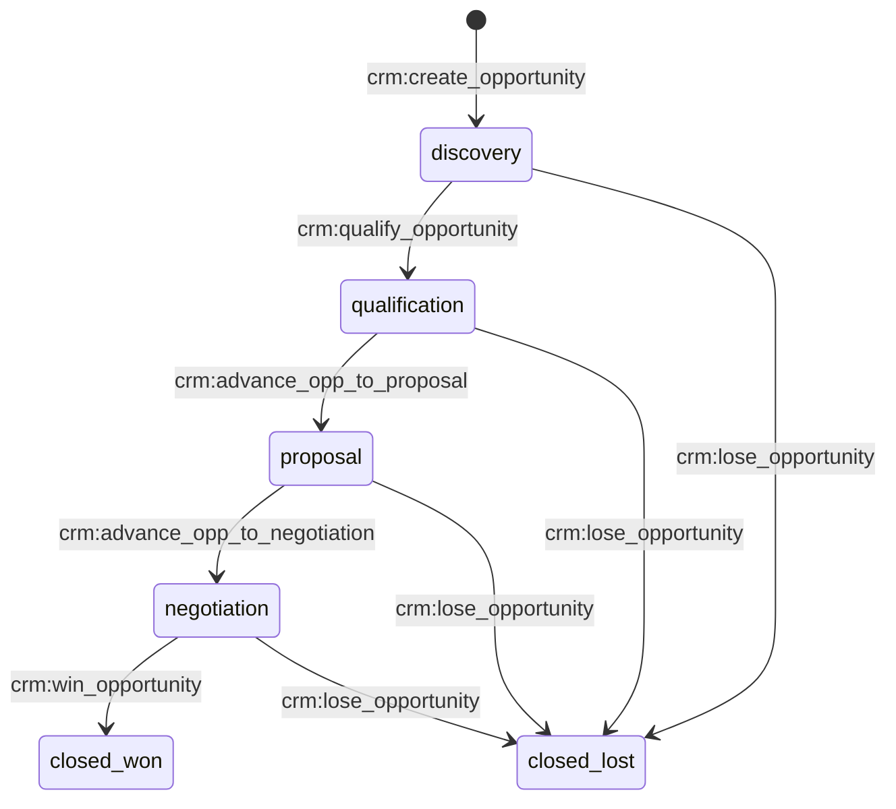

# The Command System

Commands are the **verbs** of the AuraBoot platform. Every data mutation -- create, update, delete, status transition, and custom business operation -- flows through the command system. Rather than writing raw SQL or bespoke API endpoints, you declare commands as JSON configurations, and the platform executes them through a multi-stage pipeline that handles validation, permissions, state machines, side effects, audit trails, and more.

## What is a Command?

A command is a **declared operation on a model**. It describes *what* should happen (create a record, transition a status, calculate a field) and *under what conditions* (permissions, preconditions, validation rules). The platform's command engine takes care of *how* it happens.

Every command belongs to a model and has a namespaced code:

```
{namespace}:{command_name}

# Examples:
sc:create_showcase       # Create a showcase record
crm:qualify_lead         # Transition a lead to "qualified" status
crm:win_opportunity      # Mark an opportunity as won
```

### Command Types

| Type | Purpose | Example |
|------|---------|---------|
| `create` | Insert a new record | `sc:create_showcase` |
| `update` | Modify an existing record | `crm:update_opportunity` |
| `delete` | Remove a record (with preconditions) | `crm:delete_lead` |
| `state_transition` | Move a record through a state machine | `crm:convert_lead` |
| `query` | Read-only data retrieval | `crm:list_leads` |

### Commands vs. Raw API Calls

| Aspect | Raw API Call | Command |
|--------|-------------|---------|
| Validation | You write it yourself | Declarative rules, auto-enforced |
| Permissions | Manual checks in each handler | Declared per command, checked in pipeline |
| State machine | Build your own guards | `fromStates` / `toState` -- one line of config |
| Audit trail | DIY logging | Automatic, every execution recorded |
| Side effects | Scattered across codebase | Declared in config, executed after commit |
| Extensibility | Fork the code | Add a `CommandHandlerExtension` plugin |
| AI-ready | Not discoverable | `agent_hint` + risk level enable AI tool calling |

---

## The Execution Pipeline

The command engine processes every command through a **multi-stage pipeline**. Each stage has a specific responsibility, and stages execute in strict order. The pipeline currently contains **22+ stages** (expanded from the original 20-stage design).

### Pipeline Overview

```mermaid
flowchart TD
    A["1. INIT<br/>Initialize execution context"] --> B["2. LOAD<br/>Load CommandDefinition"]
    B --> C["3. SCHEMA_VALIDATE<br/>Validate payload structure"]
    C --> C1["3.1 TEMPORAL_NORM<br/>Normalize date/time fields"]
    C1 --> D["4. IDEMPOTENCY_CHECK<br/>Dedup + concurrency lock"]
    D --> D1["4.5 ENTITLEMENT_CHECK<br/>License verification"]
    D1 --> E["5. SOD_CHECK<br/>Separation of Duties"]
    E --> F["6. STATE_CHECK<br/>State machine guard"]
    F --> G["7. ASSERT<br/>Preconditions + validation rules"]
    G --> H["8. PRE_INVARIANT<br/>Business invariant checks"]
    H --> H1["8.1 CROSS_FIELD<br/>Cross-field validation"]
    H1 --> I["9. AUTO_SET<br/>Auto-fill fields"]
    I --> I1["9.1 CMD_FIELD_VALID<br/>Field-level type checks"]
    I1 --> J["10. FIELD_MAP<br/>Data write + cascade delete"]
    J --> K["11. COMPUTED_FIELDS<br/>SpEL calculated fields"]
    K --> K1["11.1 CHANGE_TRACKING<br/>Field-level change diff"]
    K1 --> L["12. HANDLER<br/>Custom handler execution"]
    L --> M["13. API_CALL<br/>External API invocation"]
    M --> N["14. SIDE_EFFECT<br/>Side effect execution"]
    N --> N1["14.1 ROLL_UP<br/>Aggregate field recalc"]
    N1 --> N2["14.2 GOVERNANCE_SNAP<br/>Version snapshot"]
    N2 --> O["15. POST_ACTION<br/>Post-actions (e.g., create children)"]
    O --> P["16. EFFECT<br/>Write to EventStore/Outbox"]
    P --> Q["17. DOMAIN_EVENT<br/>Publish to AuraEventBus"]
    Q --> R["18. WEBHOOK<br/>Webhook dispatch (after commit)"]
    R --> S["19. POST_INVARIANT<br/>Post-execution invariant check"]
    S --> T["20. COMPLETED<br/>Build response + audit log"]

    style A fill:#e1f5fe
    style J fill:#fff3e0
    style L fill:#fff3e0
    style T fill:#e8f5e9
```



### Stage-by-Stage Reference

#### 1. INIT -- Initialize Execution Context

Sets up the `CommandExecutionContext` with tenant, user, trace ID, and default phase tracking. This stage always runs.

#### 2. LOAD -- Load Command Definition

Loads the `CommandDefinition` from the database and verifies the command is in `published` status. If the command is not found or is still in `draft`, execution fails immediately.

#### 3. SCHEMA_VALIDATE -- Validate Payload Structure

Validates the incoming payload against the command's `inputSchema`. Immediately after, the **TEMPORAL_NORM** sub-stage runs `PayloadTemporalNormalizer` to convert date/time strings into typed Java objects based on the model's field `dataType` (DATE or DATETIME), preventing type mismatches in later stages.

#### 4. IDEMPOTENCY_CHECK -- Deduplication + Concurrency Lock

If the command is configured as idempotent, checks whether the `clientRequestId` has already been processed. If so, returns the cached result. Also acquires the concurrency lock if `concurrencyKey` is configured.

```java
if (idempotencyService.exists(clientRequestId)) {
    return idempotencyService.getCachedResult(clientRequestId);
}
```

**Skipped when:** Command is not configured as idempotent.

#### 4.5 ENTITLEMENT_CHECK -- License Verification

Checks whether the plugin's license is active for the current tenant. If the command defines a `requiredFeature`, performs fine-grained feature authorization.

**Skipped when:** `EntitlementChecker` is not enabled (open-source deployments).

#### 5. SOD_CHECK -- Separation of Duties

Prevents the same user from performing conflicting operations (e.g., creating *and* approving a purchase order). Supports three scopes (`SAME_RECORD`, `SAME_MODEL`, `GLOBAL`) and three enforcement levels (`HARD` blocks execution, `SOFT` returns a warning, `AUDIT_ONLY` logs only).

**Skipped when:** No SoD rules are configured, or `SodService` is not injected.

#### 6. STATE_CHECK -- State Machine Guard

For `state_transition` commands, validates that the target record's current state is in the allowed `fromStates` list. If the record is in an invalid state, execution fails with a clear error.

**Skipped when:** Command type is not `state_transition`.

#### 7. ASSERT -- Preconditions + Validation Rules

Executes all ASSERT-type `BindingRule` entries, plus `preconditions` and `validation` rules from the `executionConfig`. Preconditions check the *current state* of the target record (e.g., "only draft records can be edited"). Validation rules check *input data* (e.g., unique composite checks).

#### 8. PRE_INVARIANT -- Business Invariant Checks

Evaluates pre-execution invariants through the `InvariantEngine`. These are business constraints like "inventory cannot go negative" or "credit limit must not be exceeded." ERROR-level violations throw `ValidationException` and halt the pipeline.

**Sub-stage 8.1 CROSS_FIELD:** Evaluates cross-field validation rules that depend on multiple field values together.

#### 9. AUTO_SET -- Auto-Fill Fields

Populates fields configured in `autoSetFields`. Five strategies are available:

| Strategy | Output | Example |
|----------|--------|---------|
| `auto_generate` | Sequential code | `SC-20260411-001` |
| `current_user` | Current user's ID | `42` |
| `current_date` | Today's date (tenant timezone) | `2026-04-11` |
| `current_datetime` | UTC timestamp | `2026-04-11T08:30:00Z` |
| `fixed_value` | Static value | `"draft"` |

**Sub-stage 9.1 CMD_FIELD_VALID:** When `inputFields` is configured, validates each field in the payload against its type constraints (required, maxLength, minValue, format regex, etc.). For CREATE commands, missing required fields are rejected. For UPDATE commands, only fields present in the payload are validated.

#### 10. FIELD_MAP -- Data Write

The core data mutation stage. For **ExecutionConfig DSL** mode, this is where CREATE inserts, UPDATE modifies, and DELETE removes records. For **BindingRule** mode, FIELD_MAP rules map payload fields to target models and persist them. Cascade deletes also execute here. A before-snapshot is captured for change tracking.

#### 11. COMPUTED_FIELDS -- SpEL Calculated Fields

Evaluates SpEL expressions configured in `computedFields` and writes results to the database. Runs after the main data write, so computed fields can reference the just-written values.

```json
{
  "computedFields": {
    "qo_avg_price": "qo_sales_qty > 0 ? qo_sales_amount / qo_sales_qty : 0"
  }
}
```

**Sub-stage 11.1 CHANGE_TRACKING:** Computes a field-level diff between the before-snapshot and the current record, producing a structured change log for audit purposes.

#### 12. HANDLER -- Custom Handler Execution

Invokes custom `CommandHandler` (platform built-in) or `CommandHandlerExtension` (plugin-provided) implementations. This is where you place business logic that cannot be expressed through configuration alone.

| Interface | Registration | Use Case |
|-----------|-------------|----------|
| `CommandHandler` | Spring `@Component` | Platform-level handlers |
| `CommandHandlerExtension` | PF4J `@Extension` | Plugin handlers |

**Skipped when:** No handler is registered for this command.

#### 13. API_CALL -- External API Invocation

Calls external APIs through `ApiConnectorService`, driven by API_CALL-type BindingRules. Supports API_KEY, BEARER, and BASIC authentication. Includes SSRF protection. The actual HTTP call executes in an `afterCommit` callback to avoid blocking the database transaction.

**Skipped when:** No API_CALL binding rules are configured.

#### 14. SIDE_EFFECT -- Side Effect Execution

Executes declared side effects like creating related records, updating parent records, or running aggregate calculations. Three action types are supported:

- **CREATE_RECORD** -- Insert a record in another model
- **UPDATE_RECORD** -- Update a record in another model
- **AGGREGATE** -- Recalculate a summary field (SUM, COUNT, AVG, MAX, MIN)

**Sub-stage 14.1 ROLL_UP:** Automatically recalculates parent model aggregate fields when the current model is a child in a roll-up relationship. No manual configuration needed -- the `RollUpFieldRegistry` handles it.

**Sub-stage 14.2 GOVERNANCE_SNAP:** Captures a version snapshot for governance-enabled models.

#### 15. POST_ACTION -- Post-Actions

Executes post-actions like `CREATE_CHILDREN`, which batch-creates child records after the main record is committed. For example, creating 12 monthly budget rows when an annual plan is created.

#### 16. EFFECT -- EventStore/Outbox Write

Writes a structured event to the EventStore or transactional outbox, driven by EFFECT-type BindingRules.

#### 17. DOMAIN_EVENT -- Publish to AuraEventBus

Publishes a `CommandCompletedEvent` to the `AuraEventBus`. This runs inside the transaction boundary, so listeners share the same database transaction. For post-commit work, listeners should use `@TransactionalEventListener(phase = AFTER_COMMIT)`.

#### 18. WEBHOOK -- Webhook Dispatch

Dispatches HTTP callbacks to registered webhook subscribers, driven by WEBHOOK-type BindingRules. Like API_CALL, the actual HTTP dispatch runs in an `afterCommit` callback.

#### 19. POST_INVARIANT -- Post-Execution Check

Evaluates post-execution invariants. Unlike pre-invariants, violations here create **alerts** but do not roll back the transaction. This is for soft constraints and monitoring.

#### 20. COMPLETED -- Build Response + Audit

Assembles the response payload, writes the audit trail entry, and caches the result for idempotency.

---

## Command Configuration

### Complete JSON Structure

A command definition in a plugin's `config/commands/` directory is a JSON array of command objects:

```json
[
  {
    "code": "ns:command_name",
    "displayName:zh-CN": "Display name (Chinese)",
    "displayName:en": "Display name (English)",
    "type": "create | update | delete | state_transition | query",
    "modelCode": "target_model_code",

    "inputFields": ["field_a", "field_b"],

    "autoSetFields": {
      "field_code": {
        "strategy": "auto_generate",
        "pattern": "PREFIX-{yyyyMMdd}-{seq}"
      }
    },

    "computedFields": {
      "calculated_field": "SpEL expression"
    },

    "validation": {
      "rules": [
        {
          "type": "unique_composite",
          "fields": ["field_a", "field_b"],
          "message:en": "This combination already exists"
        }
      ]
    },

    "preconditions": [
      {
        "field": "status_field",
        "operator": "IN",
        "value": ["draft", "rejected"],
        "message:en": "Only draft or rejected records can be modified"
      }
    ],

    "stateField": "status_field",
    "fromStates": ["current_state"],
    "toState": "target_state",

    "sideEffects": [],
    "postActions": [],
    "cascadeDelete": [],

    "permissions": ["namespace.model.action"],

    "extension": {
      "confirmMessage:en": "Are you sure?"
    },

    "agent_hint": "Human-readable description for AI tool calling",
    "cmd_risk_level": "L0 | L1 | L2 | L3 | L4"
  }
]
```

### Real Example: Showcase Plugin (CRUD + State Machine)

This is the complete command set from the `showcase` plugin, demonstrating all four mutation types:

**Create Command:**
```json
{
  "code": "sc:create_showcase",
  "displayName:en": "Create Showcase",
  "type": "create",
  "modelCode": "showcase_all_fields",
  "inputFields": [
    "sc_name", "sc_description", "sc_quantity", "sc_price",
    "sc_start_date", "sc_end_date", "sc_priority", "sc_category",
    "sc_tags", "sc_progress", "sc_rating", "sc_color",
    "sc_website", "sc_email", "sc_phone",
    "sc_richtext_content", "sc_attachment", "sc_remark"
  ],
  "autoSetFields": {
    "sc_code": {
      "strategy": "auto_generate",
      "pattern": "SC-{yyyyMMdd}-{seq}"
    },
    "sc_created_at": { "strategy": "current_datetime" },
    "sc_is_active": { "strategy": "fixed_value", "value": true },
    "sc_status": { "strategy": "fixed_value", "value": "draft" }
  },
  "validation": {
    "rules": [
      {
        "type": "unique_composite",
        "fields": ["sc_name"],
        "message:en": "Showcase name must be unique"
      }
    ]
  },
  "permissions": ["sc.showcase.manage"],
  "agent_hint": "Create a new showcase record demonstrating all field types.",
  "cmd_risk_level": "L1"
}
```

**Delete Command (with preconditions):**
```json
{
  "code": "sc:delete_showcase",
  "displayName:en": "Delete Showcase",
  "type": "delete",
  "modelCode": "showcase_all_fields",
  "preconditions": [
    {
      "field": "sc_status",
      "operator": "IN",
      "value": ["draft", "archived"]
    }
  ],
  "extension": {
    "confirmMessage:en": "Confirm delete this showcase record?"
  },
  "permissions": ["sc.showcase.manage"],
  "cmd_risk_level": "L4"
}
```

**State Transition Command:**
```json
{
  "code": "sc:activate_showcase",
  "displayName:en": "Activate",
  "type": "state_transition",
  "modelCode": "showcase_all_fields",
  "stateField": "sc_status",
  "fromStates": ["draft"],
  "toState": "active",
  "permissions": ["sc.showcase.manage"],
  "cmd_risk_level": "L1"
}
```

### Real Example: CRM Opportunity (Sales Pipeline)

The CRM opportunity demonstrates a multi-step sales pipeline with branching transitions:



**"Lose Opportunity" -- transition from multiple source states with required input:**
```json
{
  "code": "crm:lose_opportunity",
  "displayName:en": "Lose Opportunity",
  "type": "state_transition",
  "modelCode": "crm_opportunity",
  "stateField": "crm_opp_stage",
  "fromStates": ["discovery", "qualification", "proposal", "negotiation"],
  "toState": "closed_lost",
  "inputFields": ["crm_opp_lost_reason"],
  "extension": {
    "confirmMessage:en": "Confirm mark this opportunity as lost?"
  },
  "permissions": ["CRM.opportunity.manage"],
  "cmd_risk_level": "L1"
}
```

### Command Binding: Field-Level Permissions

Bindings define which fields are visible, editable, and required for each command. They live in `config/bindings/{model_code}.json`:

```json
[
  {
    "modelCode": "showcase_all_fields",
    "fieldCode": "sc_name",
    "sequence": 1,
    "required": true,
    "visible": true,
    "editable": true
  },
  {
    "modelCode": "showcase_all_fields",
    "fieldCode": "sc_code",
    "sequence": 2,
    "required": true,
    "visible": true,
    "editable": false
  }
]
```

The `editable: false` setting on `sc_code` means the field is displayed but cannot be modified by the user -- it is auto-generated by the pipeline.

---

## Built-in Command Types

### CREATE

A create command inserts a new record into the model's table.

**Key behaviors:**
- `inputFields` defines the whitelist of fields the user can submit. Omitted fields are ignored.
- `autoSetFields` populates system-managed fields (codes, timestamps, default status).
- `validation.rules` run before the insert (e.g., unique composite checks).
- Missing required fields (even if not in the payload) trigger validation errors.

**Auto-generate patterns:**
- `{yyyyMMdd}` -- date portion (e.g., `20260411`)
- `{seq}` -- daily sequence number, zero-padded to 3 digits (e.g., `001`)
- Sequence uses `MAX(sequence)` so numbers never go backward, even if records are deleted.

### UPDATE

An update command modifies an existing record.

**Key behaviors:**
- `targetRecordId` is required in the request payload.
- Only fields present in the payload are validated and updated (partial update semantics).
- If a required field is explicitly set to null/empty in the payload, validation fails. This prevents users from clearing mandatory fields through edits.
- `preconditions` can restrict which records are editable (e.g., only `draft` status).

### DELETE

A delete command removes a record, with optional cascading.

**Key behaviors:**
- `preconditions` control which records can be deleted (e.g., only `draft` or `archived`).
- `cascadeDelete` handles related child records automatically.
- Cascade delete supports nested configurations for multi-level hierarchies (depth-first deletion).
- The `extension.confirmMessage` field triggers a confirmation dialog in the UI.

**Cascade delete example (3-level hierarchy):**
```json
{
  "cascadeDelete": [
    {
      "childModel": "ap_investment_item",
      "parentField": "ap_annual_plan_id",
      "cascadeDelete": [
        {
          "childModel": "ap_monthly_amount",
          "parentField": "ap_investment_item_id"
        }
      ]
    }
  ]
}
```

Execution order: `ap_monthly_amount` (deepest) -> `ap_investment_item` -> main record.

### STATE_TRANSITION

A state transition command moves a record through a defined state machine.

**Key behaviors:**
- `stateField` identifies which field holds the state value.
- `fromStates` lists the states from which this transition is allowed.
- `toState` is the target state (simple transitions).
- `stateTransitionRules` enables conditional branching with SpEL guard expressions.
- `inputFields` can require additional data during the transition (e.g., a "lost reason" when losing a deal).
- The pipeline automatically checks the record's current state at stage 6 (STATE_CHECK).

**Conditional branching example:**
```json
{
  "stateTransitionRules": [
    {
      "guard": "#approvalResult == 'approved'",
      "toState": "approved"
    },
    {
      "guard": "#approvalResult == 'rejected'",
      "toState": "rejected"
    }
  ]
}
```

---

## Two Execution Modes

AuraBoot commands support two complementary execution modes that can be used independently or combined:

### ExecutionConfig DSL Mode (No Code)

Covers **80%+ of common scenarios** through pure JSON configuration. Supports CRUD operations, auto-fill fields, computed fields, validation rules, state transitions, side effects, cascade deletes, and post-actions.

```
You need...
|-- Simple CRUD + auto-fill + state transitions?  --> ExecutionConfig DSL
|-- Computed fields?                               --> computedFields (SpEL)
|-- Validation rules?                              --> validation.rules
|-- Preconditions?                                 --> preconditions
|-- Side effects (cross-model updates)?            --> sideEffects
|-- Cascade deletes?                               --> cascadeDelete
```

### BindingRule Mode (Extensible)

For advanced scenarios requiring custom Java logic, external API calls, webhooks, or complex invariant checks. Each rule targets a specific pipeline stage.

```
You need...
|-- Custom Java business logic?    --> BindingRule type=HANDLER
|-- External API integration?      --> BindingRule type=API_CALL
|-- Webhook notifications?         --> BindingRule type=WEBHOOK
|-- Custom assertions?             --> BindingRule type=ASSERT
|-- Pre/post invariants?           --> BindingRule type=PRE_INVARIANT / POST_INVARIANT
```

### Combining Both Modes

You can use both modes on a single command. ExecutionConfig defines the standard CRUD behavior (runs at stage 10, FIELD_MAP), while BindingRules inject additional logic at specific stages (e.g., a HANDLER at stage 12 for post-processing, or an ASSERT at stage 7 for custom validation).

---

## Custom Commands with Java Handlers

When declarative configuration is not enough, you can write a custom handler in Java.

### Platform Handler (`CommandHandler`)

Register as a Spring component for platform-level logic:

```java
@Component
public class OrderCalculationHandler implements CommandHandler {

    @Override
    public String getHandlerName() {
        return "orderCalculationHandler";
    }

    @Override
    public Map<String, Object> handle(CommandHandlerContext context) {
        Map<String, Object> payload = context.getPayload();
        BigDecimal quantity = new BigDecimal(payload.get("quantity").toString());
        BigDecimal unitPrice = new BigDecimal(payload.get("unit_price").toString());
        BigDecimal total = quantity.multiply(unitPrice);

        // Update the record
        context.getDynamicRecordService().updateField(
            context.getTargetRecordId(), "total_amount", total
        );

        return Map.of("calculatedTotal", total);
    }
}
```

Reference it in a BindingRule:
```json
{
  "ruleType": "HANDLER",
  "handlerClass": "orderCalculationHandler",
  "sequence": 5
}
```

### Plugin Handler (`CommandHandlerExtension`)

For plugin-provided logic, use the PF4J extension interface:

```java
@Extension
public class ApprovalHandler implements CommandHandlerExtension {

    @Override
    public String getCommandType() {
        return "myns:approve_request";
    }

    @Override
    public Object execute(CommandContext context) {
        // Custom approval logic
        String recordId = context.getTargetRecordId();
        // ... business logic ...
        return Map.of("approved", true);
    }

    @Override
    public int getPriority() {
        return 100;
    }
}
```

Plugin handlers are discovered through the `ExtensionRegistry`. Platform handlers take priority; plugin handlers execute when no platform handler matches.

---

## Command Execution

### REST API

Execute a command via the standard API endpoint:

```
POST /api/meta/commands/execute/{commandCode}
Content-Type: application/json
Authorization: Bearer {jwt_token}

{
  "operationType": "CREATE",
  "data": {
    "sc_name": "My Showcase",
    "sc_quantity": 100,
    "sc_price": 29.99
  }
}
```

For UPDATE and DELETE, include the target record:
```
POST /api/meta/commands/execute/sc:update_showcase

{
  "operationType": "UPDATE",
  "targetRecordId": "rec_abc123",
  "data": {
    "sc_name": "Updated Name"
  }
}
```

**Frontend-backend contract:**
- `operationType` must be explicitly provided by the frontend -- the backend does not guess.
- `operationType=UPDATE` or `DELETE` requires `targetRecordId`.
- `operationType=CREATE` must not include `targetRecordId`.
- Mismatched combinations (e.g., UPDATE + empty targetRecordId) return 4xx immediately.

### CLI

The `aura exec` command provides a convenient way to execute commands from the terminal:

```bash
# Create a record
aura exec sc:create_showcase \
  --set sc_name="Test Record" \
  --set sc_quantity:int=100 \
  --set sc_price:decimal=29.99

# Execute a state transition
aura exec sc:activate_showcase --target rec_abc123

# Batch execution from a JSON file
aura exec sc:create_showcase --from batch.json
```

The CLI handles authentication automatically (using cached tokens from `aura login`).

### Batch Execution

For bulk operations, prepare a JSON file with an array of payloads:

```json
[
  { "sc_name": "Record 1", "sc_quantity": 10 },
  { "sc_name": "Record 2", "sc_quantity": 20 },
  { "sc_name": "Record 3", "sc_quantity": 30 }
]
```

Then execute:
```bash
aura exec sc:create_showcase --from batch.json
```

Each record is processed independently through the full pipeline.

---

## Side Effects and Post-Processing

### Side Effects (`sideEffects`)

Side effects execute after the main data write (stage 14) and perform cross-model operations:

**CREATE_RECORD** -- Create a record in another model:
```json
{
  "action": "CREATE_RECORD",
  "targetModel": "dp_rectification",
  "fieldMapping": {
    "dp_rect_issue_id": "${recordId}",
    "dp_rect_title": "${dp_issue_title}",
    "dp_rect_status": "initiated"
  }
}
```

**UPDATE_RECORD** -- Update a related record:
```json
{
  "action": "UPDATE_RECORD",
  "targetModel": "dp_issue",
  "targetIdField": "dp_rect_issue_id",
  "fieldMapping": {
    "dp_issue_status": "rectified"
  }
}
```

**AGGREGATE** -- Recalculate a summary field:
```json
{
  "type": "AGGREGATE",
  "modelCode": "cc_contract",
  "childModel": "cc_payment_receipt",
  "childField": "cc_pr_amount",
  "parentField": "cc_paid_amount",
  "parentFk": "cc_pr_contract_id",
  "function": "SUM",
  "childFilter": "cc_pr_type = 'PAYMENT'"
}
```

Supported aggregate functions: `SUM`, `COUNT`, `AVG`, `MAX`, `MIN`.

### Post-Actions (`postActions`)

Post-actions (stage 15) support batch creation of child records:

```json
{
  "type": "CREATE_CHILDREN",
  "childModel": "ap_monthly_amount",
  "parentField": "ap_work_package_id",
  "records": [
    { "ap_month": 1, "ap_plan_amount": 0, "ap_actual_amount": 0 },
    { "ap_month": 2, "ap_plan_amount": 0, "ap_actual_amount": 0 },
    { "ap_month": 12, "ap_plan_amount": 0, "ap_actual_amount": 0 }
  ]
}
```

### Roll-Up Fields (Automatic)

When a model has roll-up field definitions, stage 14.1 automatically recalculates parent aggregates whenever child records are created, updated, or deleted. No manual configuration in sideEffects is needed.

### Domain Events

Every completed command publishes a `CommandCompletedEvent` to the `AuraEventBus` (stage 17). The event payload includes:

- `commandCode`, `operationType`, `modelCode`
- `recordId`, `payload`
- `userId`, `actorName`
- `beforeSnapshot` (for change auditing)

Listeners can react synchronously (within the same transaction) or asynchronously (using `@TransactionalEventListener(phase = AFTER_COMMIT)`).

### Webhooks

Webhook-type BindingRules trigger HTTP callbacks to external systems. The actual HTTP dispatch runs after the transaction commits, ensuring the webhook only fires if the data change is durable.

### Audit Trail

Every command execution is automatically logged with the full context: who executed it, when, what changed, and the before/after snapshots. This happens in the final COMPLETED stage and requires no configuration.

---

## AI Agent Semantics

Commands are the primary tool-calling interface for AI agents (AuraBot). Each command can carry semantic metadata that helps AI understand and use it correctly:

| Field | Purpose | Example |
|-------|---------|---------|
| `agent_hint` | Natural-language description of what the command does | `"Create a new lead record. Key inputs: company, contact_name."` |
| `cmd_risk_level` | Risk classification for AI safety guardrails | `L0` (read), `L1` (write), `L4` (irreversible) |
| `precondition_description` | Human-readable preconditions | `"Record must be in draft status"` |
| `side_effect_description` | What else happens when this runs | `"Sends email notification to manager"` |
| `idempotent` | Whether re-execution is safe | `true` / `false` |
| `reversible` | Whether the operation can be undone | `true` / `false` |
| `example_input` | Sample payload for the AI to reference | `{"sc_name": "Demo", "sc_quantity": 5}` |

Risk levels:
- **L0** -- Read-only (queries)
- **L1** -- Standard write (create, update)
- **L2** -- Cross-object mutation (side effects that modify other models)
- **L3** -- External system call (API_CALL, webhook)
- **L4** -- Irreversible (delete, archive)

---

## Validation Reference

### Precondition Operators

Commands support 12 precondition operators for checking the target record's current state:

| Operator | Description |
|----------|-------------|
| `EQ` | Equal to |
| `NEQ` | Not equal to |
| `IN` | Value is in the given list |
| `NOT_IN` | Value is not in the given list |
| `GT` | Greater than |
| `GE` | Greater than or equal to |
| `LT` | Less than |
| `LE` | Less than or equal to |
| `NOT_NULL` | Field is not null |
| `NULL` | Field is null |
| `CONTAINS` | Contains substring |
| `NOT_CONTAINS` | Does not contain substring |

### Validation Rule Types

| Type | Fields | Purpose |
|------|--------|---------|
| `UNIQUE_COMPOSITE` | `fields[]`, `message` | Check that a combination of field values is unique across all records |
| `HAS_CHILDREN` | `childModel`, `parentField`, `minCount`, `message` | Require a minimum number of child records before allowing the operation |

### Field-Level Validation (Automatic)

When `inputFields` is configured, the pipeline automatically validates:
- **required** -- Non-null, non-empty
- **dataType** -- Matches field definition (integer, decimal, date, boolean, etc.)
- **maxLength / minLength** -- String length constraints
- **minValue / maxValue** -- Numeric range
- **format** -- Regex pattern match

---

## Best Practices

### Naming Conventions

Follow the `{namespace}:{verb}_{model}` pattern:

```
sc:create_showcase        # verb = create
sc:update_showcase        # verb = update
sc:delete_showcase        # verb = delete
sc:activate_showcase      # verb = business action
crm:qualify_lead          # verb = business action
crm:convert_lead          # verb = business action
crm:lose_opportunity      # verb = business action
```

- Use lowercase with underscores.
- The namespace matches the plugin's namespace (e.g., `sc` for showcase, `crm` for CRM).
- Verbs should describe the business action, not the technical operation.

### When to Use STATE_TRANSITION vs. CUSTOM

Use `state_transition` when:
- The operation moves a record through a well-defined lifecycle.
- The allowed transitions depend on the current state.
- The UI should show/hide action buttons based on state.

Use a custom handler when:
- The operation involves complex calculations or external service calls.
- Multiple models need to be updated atomically.
- The logic cannot be expressed as a simple state change + field mapping.

You can combine both: a `state_transition` command with a HANDLER BindingRule that runs custom logic during the transition.

### Error Handling

- **Preconditions** fail fast at stage 7, before any data is written. Use them to prevent invalid operations.
- **Validation rules** also fail at stage 7-8. They check input data integrity.
- **Post-invariants** (stage 19) create alerts but do not roll back. Use them for soft constraints.
- **Handler exceptions** propagate naturally and roll back the transaction. Do not catch exceptions inside handlers unless converting to a business-specific error.

### Transaction Boundaries

The entire pipeline runs in a single database transaction (stages 1-19). External calls (API_CALL, WEBHOOK) execute after the transaction commits, ensuring:
- Data is durable before external systems are notified.
- External call failures do not roll back the database changes.
- The system remains consistent even if webhooks fail.

---

## Related Documentation

- [Models](./models.md) -- How models define the data structure that commands operate on
- [Pages](./pages.md) -- How pages render forms and trigger commands from the UI
- [Plugin Development Guide](../guides/plugin-development.md) -- How to create plugins with custom commands
