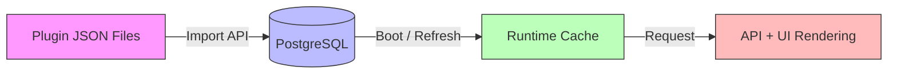
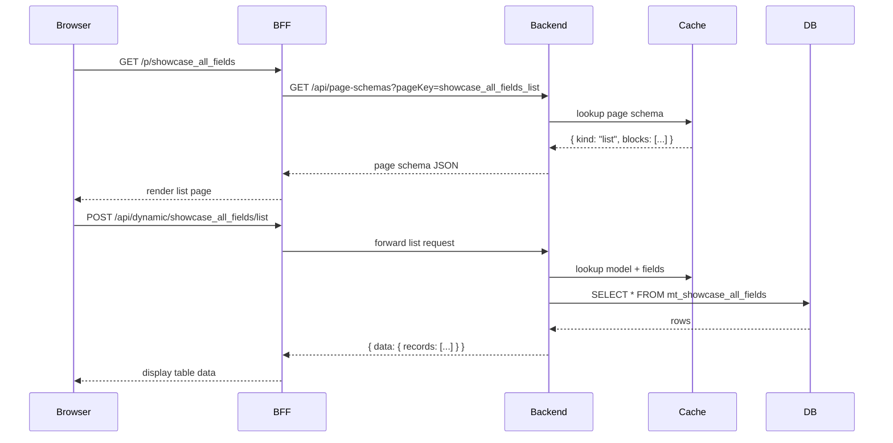
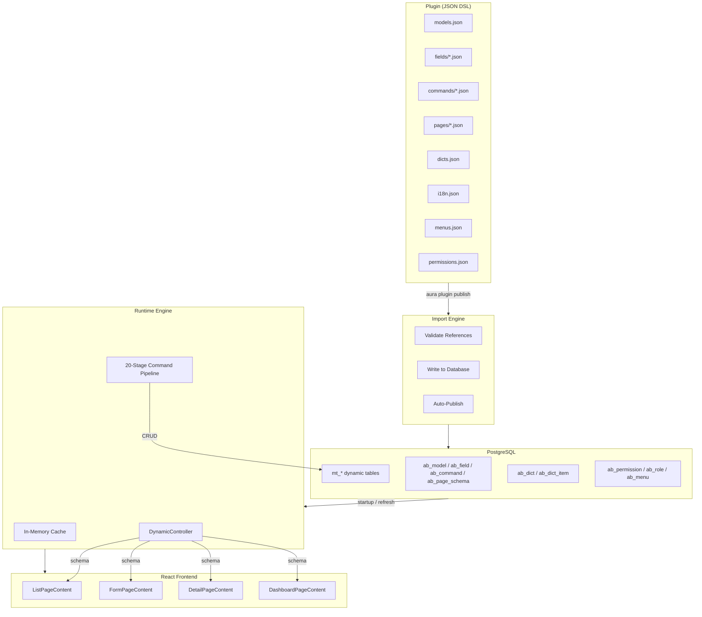

# The DSL Engine

AuraBoot's DSL Engine is the core of the platform. Instead of writing boilerplate Java controllers, database migrations, and React pages, you define your application in declarative JSON. The engine reads those definitions and generates everything at runtime -- database tables, REST APIs, form validation, list pages, and detail views.

## Philosophy: Define, Don't Code

Traditional business application development follows a repetitive pattern: design a database table, write a migration, create an ORM entity, build a service layer, expose a REST controller, then wire up React components for list/form/detail pages. For each new entity, you repeat this entire cycle.

AuraBoot inverts this. You write a JSON definition of your data model, and the platform handles everything downstream:

```
JSON Model Definition
    |
    +---> Database table (auto-created, auto-migrated)
    +---> REST API endpoints (CRUD + custom commands)
    +---> Form validation (from field constraints)
    +---> List page (with filters, sorting, pagination)
    +---> Detail page (with tabs, sub-tables, actions)
    +---> Permission checks (resource + operation level)
    +---> Audit trail (field-level change tracking)
    +---> i18n labels (auto-derived from model/field hierarchy)
```

This approach -- called **meta-driven development** -- means that a single model definition is the source of truth for the entire vertical slice of your application. Change the model, and the database, API, and UI all update accordingly.

## DSL Resource Types

Every business application in AuraBoot is assembled from these resource types:

| Resource Type | File Location | Purpose |
|---|---|---|
| **Models** | `config/models.json` | Define business entities (e.g., Contract, Employee). Each model maps to a database table. |
| **Fields** | `config/fields/*.json` | Define the columns of a model -- data type, constraints, display behavior. |
| **Bindings** | `config/bindings/*.json` | Bind fields to models with sequence, visibility, and editability settings. |
| **Commands** | `config/commands/*.json` | Define data operations -- create, update, delete, state transitions. Each command flows through a [20-stage pipeline](./commands.md). |
| **Pages** | `config/pages/*.json` | Define UI layouts -- list pages, forms, detail views, dashboards. Built from composable [blocks](./pages-and-layouts.md). |
| **Dicts** | `config/dicts.json` | Define enumeration dictionaries -- dropdown options, status values, category trees. |
| **Formulas** | `config/formulas/*.json` | Define computed fields and aggregation rules (sum, count, average across related records). |
| **Menus** | `config/menus.json` | Define sidebar navigation entries with icons, ordering, and permission gates. |
| **Permissions** | `config/permissions.json` | Define permission codes for resource-level and operation-level access control. |
| **Roles** | `config/roles.json` | Define roles and bind them to permission sets. |
| **i18n** | `config/i18n.json` | Define multilingual labels for models, fields, menus, pages, and UI elements. |
| **Bootstrap** | `config/default-bootstrap.json` | Define tenant initialization data -- role-permission bindings applied on first setup. |

## How DSL Resolution Works

DSL resources follow a three-phase lifecycle: **Import**, **Store**, and **Resolve**.



### Phase 1: Import

When you install a plugin (via `aura plugin publish` or the import API), the platform reads every JSON file declared in `plugin.json` and writes them to the database. Each resource type has a dedicated table:

- Models go to `ab_model`
- Fields go to `ab_field`
- Commands go to `ab_command`
- Pages go to `ab_page_schema`
- Dicts go to `ab_dict` + `ab_dict_item`
- Menus go to `ab_menu`
- Permissions go to `ab_permission`
- i18n entries go to `ab_i18n_entry`

The import process validates references (e.g., a field's `dictCode` must match an existing dict), detects conflicts, and optionally overwrites existing resources.

### Phase 2: Store

The database is the single source of truth. All resources are stored as structured rows with JSONB extension columns for flexible configuration. This means you can also create and modify resources through the admin UI or REST API -- not just through plugin JSON files.

Key tables:

| Table | Stores |
|---|---|
| `ab_model` | Model metadata (code, type, category, extension) |
| `ab_field` | Field definitions (data type, constraints, extension) |
| `ab_command` | Command definitions (type, input fields, execution config) |
| `ab_page_schema` | Page layouts (kind, blocks, layout, profile) |
| `mt_{model_code}` | Actual business data (auto-created dynamic tables) |

### Phase 3: Resolve

On application startup (and after any DSL change), the platform builds an in-memory cache of all models, fields, commands, and pages. When a request arrives:

1. The **DynamicController** looks up the model and page schema from the cache
2. The **Command Pipeline** loads the command definition and executes it through 20 stages
3. The **frontend runtime** fetches the page schema via API and renders the appropriate blocks



## Namespace Conventions

AuraBoot uses consistent naming conventions to avoid collisions across plugins:

### Models

Models use a plugin-specific prefix:

```
{plugin_prefix}_{entity_name}
```

Examples:
- `crm_opportunity` -- CRM plugin, opportunity entity
- `pm_task` -- Project Management plugin, task entity
- `sc_showcase_all_fields` -- Showcase plugin (prefix `sc`)

### Fields

Fields are prefixed with the model's namespace:

```
{ns}_{field_name}
```

Examples:
- `crm_opp_name` -- CRM opportunity name
- `pm_task_status` -- PM task status
- `sc_price` -- Showcase price

### Commands

Commands use a colon-separated namespace:

```
{ns}:{action}_{entity}
```

Examples:
- `sc:create_showcase` -- Create a showcase record
- `sc:activate_showcase` -- Transition showcase to active state
- `crm:convert_lead` -- Convert a CRM lead to an opportunity

### Pages

Page keys follow a model-plus-kind pattern:

```
{model_code}_{kind}
```

Examples:
- `showcase_all_fields_list` -- List page for the showcase model
- `showcase_all_fields_form` -- Create/edit form
- `showcase_all_fields_detail` -- Detail view

### Dicts

Dictionary codes use the namespace prefix:

```
{ns}_{dict_name}_dict
```

Examples:
- `sc_status_dict` -- Showcase status values
- `sc_priority_dict` -- Showcase priority levels

## Plugin as DSL Container

A **plugin** is a directory that packages DSL resources into an installable unit. Every plugin has a `plugin.json` manifest that declares metadata and resource locations:

```json
{
  "pluginId": "com.auraboot.showcase",
  "namespace": "sc",
  "version": "1.0.0",
  "dslVersion": 1,
  "pluginType": "config",
  "displayName": "Showcase - All Field Types",
  "description": "Demonstrates all 20+ field types.",
  "author": "AuraBoot",
  "minPlatformVersion": "1.0.0",
  "dependencies": [],
  "provides": [
    { "type": "model", "code": "showcase_all_fields" },
    { "type": "command", "code": "sc:create_showcase" }
  ],
  "resourceDirs": {
    "models": "config/models.json",
    "fields": "config/fields",
    "bindings": "config/bindings",
    "commands": "config/commands",
    "pages": "config/pages",
    "dicts": "config/dicts.json",
    "permissions": "config/permissions.json",
    "menus": "config/menus.json",
    "i18n": "config/i18n.json",
    "roles": "config/roles.json"
  },
  "importOptions": {
    "conflictStrategy": "overwrite",
    "autoPublishModels": true,
    "autoPublishFields": true,
    "autoPublishCommands": true,
    "autoPublishPages": true,
    "createResourcePermissions": true
  }
}
```

### Plugin directory structure

```
plugins/showcase/
  plugin.json                          # Manifest
  config/
    models.json                        # Model definitions
    fields/
      showcase_all_fields.json         # Field definitions
    bindings/
      showcase_all_fields.json         # Field-model bindings
    commands/
      showcase_all_fields.json         # Command definitions
    pages/
      showcase_all_fields_list.json    # List page
      showcase_all_fields_form.json    # Form page
      showcase_all_fields_detail.json  # Detail page
    dicts.json                         # Dictionaries
    permissions.json                   # Permission codes
    roles.json                         # Role definitions
    menus.json                         # Menu entries
    i18n.json                          # Translations
    default-bootstrap.json             # Tenant init data
```

### Installing a plugin

```bash
# Using the CLI (recommended)
aura plugin publish plugins/showcase --yes

# The platform will:
# 1. Validate plugin.json and all referenced resources
# 2. Import all resources to the database
# 3. Auto-publish models (create mt_* tables)
# 4. Auto-publish fields, commands, pages
# 5. Create resource-level permissions
# 6. Register menus
```

## DSL vs Code: When to Extend

The DSL covers 80%+ of typical business application needs. For the remaining cases, you extend with Java (backend) or TypeScript (frontend).

### Use DSL only (no code) when:

- Defining CRUD models with standard field types
- Building list/form/detail pages with filters, sorting, and pagination
- Configuring state machines (draft -> active -> archived)
- Setting up permissions and menu navigation
- Creating dashboards with charts and data tables
- Defining validation rules (required, unique, min/max)
- Auto-generating field values (sequence numbers, timestamps, current user)

### Write Java extensions when:

- Implementing complex business logic that cannot be expressed as DSL side effects
- Integrating with external APIs (payment gateways, shipping providers)
- Building custom command handlers with multi-step orchestration
- Adding custom validation that requires database lookups or cross-entity checks
- Creating scheduled jobs or event-driven automation

### Write TypeScript extensions when:

- Building visual designers (Page Designer, BPMN Designer)
- Creating custom Smart components (charts, widgets)
- Implementing platform management pages (model manager, field editor)
- Adding real-time features (WebSocket, live collaboration)
- Building login/authentication flows

### Extension points

| Layer | Extension Mechanism | Example |
|---|---|---|
| Backend commands | `BindingRule` with custom `ActionType` | Complex approval workflow |
| Backend services | Spring `@Service` implementing a provider interface | Custom PDF generation |
| Frontend blocks | `blockType: "custom"` + `ComponentLoader` | Gantt chart viewer |
| Frontend fields | `extension.renderComponent` pointing to a registered component | Custom date range picker |

## Architecture Diagram



## Next Steps

- [Models & Fields](./models-and-fields.md) -- Define your data structures
- [Commands](./commands.md) -- Configure data operations and state machines
- [Pages & Layouts](./pages-and-layouts.md) -- Build UI from composable blocks
