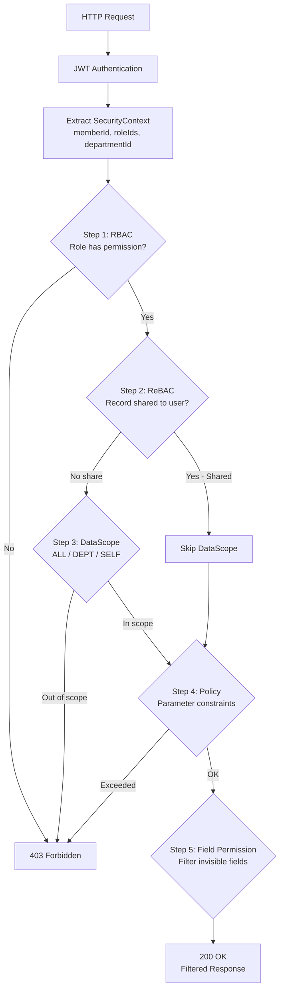

# Permissions & Access Control

AuraBoot uses a five-layer permission model combining RBAC (role-based), ReBAC (relationship-based), and ABAC (attribute-based) access control. Every API request passes through a unified permission evaluation pipeline that checks functional permissions, data scope, policy constraints, and field-level visibility -- enforced by the framework for standard business models.

> **Related docs:** [Models & Fields](./models-and-fields.md) for the data layer, [Pages & Layouts](./pages-and-layouts.md) for menu/permission binding, [Commands](./commands.md) for permission-gated operations.

## Three-Layer Permission Model

Permissions in AuraBoot operate at three levels:

| Level | What It Controls | Example |
|---|---|---|
| **Resource** (Module) | Which modules a user can access | `module.crm` -- can access CRM module |
| **Operation** (Action) | What operations a user can perform | `model.crm_lead.create` -- can create leads |
| **Data** (Scope) | Which records a user can see | Data scope = `DEPARTMENT` -- can only see own department's leads |

```
module.crm                          <-- Level 1: Module
  |-- model.crm_lead                <-- Level 2: Resource (model)
  |     |-- model.crm_lead.read     <-- Level 3: Action
  |     |-- model.crm_lead.create
  |     |-- model.crm_lead.update
  |     |-- model.crm_lead.delete
  |     |-- model.crm_lead.qualify  <-- Custom action from state transition
  |-- model.crm_opportunity
        |-- model.crm_opportunity.read
        |-- model.crm_opportunity.create
        ...
```

## Permission Types

### STATIC Permissions

Manually defined permissions for platform features (models, pages, roles, etc.) that exist regardless of business data. Generated by `SystemPermissionInitializer` at startup.

| Module | Resources | Example Permissions |
|---|---|---|
| `module.platform` | model, page, field, component, dict, query, command, form, datasource, category, view, state_graph | `model.page.create`, `model.command.execute` |
| `module.rbac` | role, user_role, permission | `model.role.create`, `model.permission.read` |
| `module.tenant` | tenant, menu | `model.tenant.admin`, `model.menu.update` |
| `module.devops` | repo, release, event_store | `model.event_store.read` |
| `module.automation` | automation, workflow | `model.workflow.execute` |
| `module.analytics` | report, dashboard | `model.report.generate` |

### DYNAMIC Permissions

Auto-generated when a business model is published. The system inspects the model's commands and derives the appropriate action set.

**Standard actions:**

| Action | Meaning | Generated When |
|---|---|---|
| `read` | View list/detail | Always (for all published models) |
| `create` | Create records | Model has a `type: "create"` command |
| `update` | Edit records | Model has a `type: "update"` command |
| `delete` | Delete records | Model has a `type: "delete"` command |
| `import` | Bulk import | DynamicController import endpoint |
| `export` | Bulk export | DynamicController export endpoint |
| Custom (e.g., `approve`, `qualify`) | Domain-specific | Derived from `state_transition` / `custom` commands |

**Generation trigger:** Model creation, model publish, or plugin import.

**Idempotent:** If a permission already exists, it is not recreated.

## Role Definitions

Roles group permissions and are assigned to tenant members (not directly to users).

### Built-in Roles

| Role Code | Name | Permission Scope |
|---|---|---|
| `tenant_admin` | Tenant Administrator | Wildcard `*` -- all permissions |
| `operator` | Business Operator | Business CRUD operations |
| `viewer` | Read-Only Viewer | Only `*.read` permissions |
| `platform_admin` | Platform Admin | System tenant only, global scope |

### Custom Roles via Plugin

Define roles in `config/roles.json`:

```json
[
  {
    "code": "sc_admin",
    "name:zh-CN": "Showcase Administrator",
    "name:en": "Showcase Administrator",
    "description": "Full access to all Showcase modules",
    "permissions": [
      "sc.showcase.manage",
      "sc.showcase.read"
    ]
  }
]
```

| Property | Type | Required | Description |
|---|---|---|---|
| `code` | string | Yes | Unique role identifier |
| `name:zh-CN` | string | Yes | Chinese display name |
| `name:en` | string | Yes | English display name |
| `description` | string | No | Role description |
| `permissions` | array | Yes | List of permission codes to bind |

### Automatic Role-Permission Binding

When DYNAMIC permissions are generated, they are automatically bound to roles using templates:

| Role | Template | Behavior |
|---|---|---|
| `tenant_admin` | TENANT_ADMIN | Receives all generated permissions |
| `developer` | DEVELOPER | Receives all generated permissions |
| `viewer` | VIEWER | Receives only `*.read` permissions |

Custom roles (like `sc_admin`) are not in the template -- they must be explicitly configured in `roles.json` or through the admin UI.

### Wildcard Permission

The `tenant_admin` role receives `"*"` during tenant bootstrap, which grants all current and future permissions. This is set in `default-bootstrap.json` and processed by `TenantBootstrapServiceImpl`.

## Multi-Tenant Isolation

Every record in AuraBoot is scoped to a tenant via the `tenant_id` column.

### How It Works

1. **Automatic injection:** `TenantLineInterceptor` (MyBatis plugin) automatically appends `WHERE tenant_id = ?` to all SQL queries. You never write `tenant_id` conditions in code.

2. **Context propagation:** `MetaContext` holds the current tenant ID, user ID, and member ID, extracted from the JWT token on each request.

3. **Cross-tenant admin:** The `platform_admin` role in the system tenant can operate across tenants for platform management.

### Permission Subject

Permissions are bound to **tenant members** (`ab_tenant_member`), not users. A single user can be a member of multiple tenants with different roles in each:

```
ab_user (Identity -- who can log in)
  +-- ab_tenant_member (Access -- permission subject)
        +-- ab_user_role (member_id -> role_id)
        |     +-- ab_role -> ab_role_permission -> ab_permission
        |                  -> ab_role_data_scope
        +-- mt_org_employee (HR -- organizational position)
              +-- department
              +-- position
```

### Data Scope Types

| Scope | Records Visible |
|---|---|
| `ALL` | All records in the tenant |
| `DEPARTMENT` | Records belonging to the user's department |
| `DEPARTMENT_AND_CHILD` | Records belonging to the user's department and all child departments |
| `SELF` | Only records created by the user |
| `CUSTOM` | Custom SpEL expression |

Data scopes are configured per role per resource in `ab_role_data_scope`. When a user has multiple roles, scopes are merged using a configurable strategy (MAX or MIN).

## Menu System

Menus control the sidebar navigation and are permission-gated.

### menus.json Structure

Define menus in `config/menus.json`:

```json
[
  {
    "code": "sc_root",
    "parentCode": null,
    "name:zh-CN": "Showcase",
    "name:en": "Showcase",
    "path": null,
    "icon": "IconStar",
    "type": 0,
    "permissionCode": null,
    "orderNo": 1,
    "visible": true
  },
  {
    "code": "sc_all_fields",
    "parentCode": "sc_root",
    "name:zh-CN": "All Field Types",
    "name:en": "All Field Types",
    "path": "/p/showcase_all_fields",
    "icon": "IconLayoutGrid",
    "type": 1,
    "permissionCode": "sc.showcase.read",
    "orderNo": 1,
    "visible": true,
    "pageKey": "showcase_all_fields_list"
  }
]
```

| Property | Type | Description |
|---|---|---|
| `code` | string | Unique menu identifier (used for deduplication) |
| `parentCode` | string / null | Parent menu code. `null` for top-level directories. |
| `name:zh-CN` | string | Chinese display name |
| `name:en` | string | English display name |
| `path` | string / null | Route path. `null` for directories. Use `/p/{pageKey}` for DSL pages. |
| `icon` | string | Icon identifier |
| `type` | number | `0` = directory (has children), `1` = leaf menu |
| `permissionCode` | string / null | Required permission to see this menu item. `null` = visible to everyone. |
| `orderNo` | number | Sort order within the parent |
| `visible` | boolean | Whether to show in the sidebar |
| `pageKey` | string | Associated page key (for leaf menus) |

### Menu Types

| Type | Value | Behavior |
|---|---|---|
| Directory | `0` | Container for child menus. No route path. |
| Menu (Leaf) | `1` | Clickable item that navigates to a page. |

### Platform Visibility

Menus can be restricted to specific platforms:

```json
{
  "code": "admin_settings",
  "extension": {
    "platforms": ["web"]
  }
}
```

| Value | Meaning |
|---|---|
| `["web"]` | Web only |
| `["mobile"]` | Mobile only |
| `["web", "mobile"]` | Both platforms |
| `null` (or omitted) | All platforms (default) |

### Permission-Based Menu Filtering

When the frontend fetches the menu tree, the backend automatically filters out items the current user cannot access:

1. Load all menus for the tenant
2. Get the user's permission set (from all assigned roles)
3. Filter: keep menus where `permissionCode` is null OR the user has that permission
4. Return the filtered tree

## Bootstrap Template

Initial roles, permissions, and menus are seeded from `default-bootstrap.json` when a new tenant is created.

The template defines:
- **Permissions**: Static permission definitions with codes, names, modules, and resource types
- **Roles**: Built-in roles (`tenant_admin`, `operator`, `viewer`) with their permission bindings
- **Menus**: Initial menu tree structure

The bootstrap process is executed by `TenantBootstrapServiceImpl.bootstrapTenant()` and runs once per tenant creation. The `tenant_admin` role receives wildcard `"*"` permission during this process.

## Permission Checking Flow



**Five evaluation steps:**

| Step | Evaluator | What It Checks | Failure |
|---|---|---|---|
| 1. RBAC | `RolePermissionEvaluator` | Does the user's role include the required permission? | 403 |
| 2. ReBAC | `RecordShareEvaluator` | Is this record explicitly shared with the user? (Bypasses DataScope) | Continue to step 3 |
| 3. DataScope | `DataScopeEvaluator` | Is the record within the user's data scope (SELF/DEPT/ALL)? | 403 |
| 4. Policy | `PolicyEvaluator` | Does the operation satisfy parameter constraints (e.g., max amount)? | 403 |
| 5. FieldPerm | `FieldPermEval` | Which fields can the user see/edit? (Does not block access) | Fields filtered |

## Field-Level Permissions

Control visibility and editability of individual fields:

```
FIELD.{modelCode}.{fieldCode}.view    -- Can see this field
FIELD.{modelCode}.{fieldCode}.edit    -- Can edit this field
```

**Example:** `FIELD.customer.phone.view` -- allows viewing the customer phone field.

Field permissions support **data masking** for sensitive fields:

```json
{
  "fieldPermissions": {
    "phone": {
      "viewPermission": "FIELD.customer.phone.view",
      "editPermission": "FIELD.customer.phone.edit",
      "maskPattern": "***-****-{last4}"
    }
  }
}
```

## Permission Configuration in Plugins

A typical plugin defines permissions in `config/permissions.json`:

```json
[
  {
    "code": "sc.showcase.manage",
    "name:zh-CN": "Manage Showcase",
    "name:en": "Manage Showcase",
    "resourceType": "operation",
    "module": "sc"
  },
  {
    "code": "sc.showcase.read",
    "name:zh-CN": "View Showcase",
    "name:en": "View Showcase",
    "resourceType": "data",
    "module": "sc"
  }
]
```

| Property | Type | Description |
|---|---|---|
| `code` | string | Unique permission code |
| `name:zh-CN` | string | Chinese display name |
| `name:en` | string | English display name |
| `resourceType` | string | `operation` (action permission) or `data` (read permission) |
| `module` | string | Module code (matches plugin prefix) |

## @RequirePermission Annotation

Backend controllers use `@RequirePermission` to enforce access:

```java
@PostMapping
@RequirePermission(MetaPermission.MODEL_MANAGE)
public ApiResponse<ModelDTO> create(@RequestBody ModelCreateRequest request) {
    // Only users with MODEL_MANAGE permission can reach this
}

// Multiple permissions (require ALL)
@RequirePermission({ MetaPermission.MODEL_MANAGE, MetaPermission.FIELD_MANAGE })

// Multiple permissions (require ANY)
@RequirePermission(
    value = { MetaPermission.MODEL_MANAGE, MetaPermission.MODEL_READ },
    mode = PermissionMode.ANY
)
```

## Frontend Permission Check

```typescript
const { hasPermission, hasAnyPermission } = usePermission();

if (hasPermission('model.crm_lead.create')) {
  // Show create button
}

if (hasAnyPermission(['model.crm_lead.update', 'model.crm_lead.create'])) {
  // Show form
}
```

In page JSON, buttons reference permissions via `permissionCode`:

```json
{
  "code": "create",
  "permissionCode": "sc.showcase.manage",
  "label": { "en": "Create" },
  "action": { "type": "navigate", "to": "showcase_all_fields_form" }
}
```

Buttons with a `permissionCode` are automatically hidden if the current user lacks that permission.

## Best Practices

1. **One module permission per plugin.** Define a top-level `module.{plugin_code}` permission. All model-level permissions are children.

2. **Use `manage` + `read` for simple plugins.** Two permissions cover most use cases: `manage` for CRUD and `read` for view-only access.

3. **Name permissions consistently.** Follow the pattern `{module}.{entity}.{action}`. Examples: `crm.lead.qualify`, `pm.task.assign`, `thr.leave.approve`.

4. **Always set `permissionCode` on leaf menus.** Otherwise, the menu is visible to all users regardless of role.

5. **Test with a non-admin role.** The `tenant_admin` wildcard `*` bypasses all checks. Create a `viewer` role test to verify permission gating works.

6. **Never hardcode permission checks.** Use `@RequirePermission` on the backend and `permissionCode` in page JSON. The framework handles the rest.

7. **Data scope for row-level security.** Use `SELF` scope for personal data, `DEPARTMENT` for team data, and `ALL` for managers. Configure in `ab_role_data_scope`.
