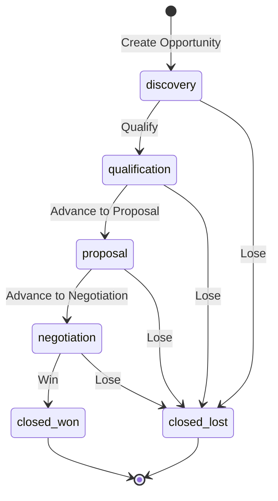
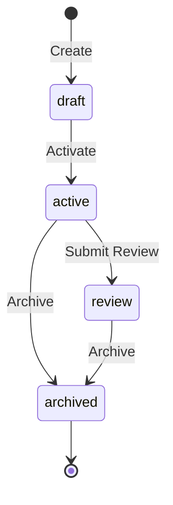

# State Machines

Most business entities have a lifecycle: an order goes from draft to confirmed to shipped to delivered. A support ticket moves from open to in-progress to resolved. AuraBoot models these lifecycles as state machines -- a status field combined with transition commands that enforce valid state changes and trigger side effects.

State machines in AuraBoot are not a separate configuration file. They emerge from three existing concepts working together: an **enum field** for status values, **state transition commands** for valid moves, and **page configuration** for UI rendering.

> **Related docs:** [Models & Fields](./models-and-fields.md) for status field definitions, [Commands](./commands.md) for the execution pipeline, [Pages & Layouts](./pages-and-layouts.md) for status-based UI, [Permissions](./permissions.md) for transition authorization.

## What Is a State Machine

A state machine consists of:

1. **A status field** -- An enum field on the model that holds the current state (e.g., `sc_status`, `crm_opp_stage`)
2. **Transition commands** -- Commands of type `state_transition` that define which state changes are legal
3. **Guard conditions** -- Preconditions that must be true before a transition can execute
4. **Side effects** -- Actions that happen automatically when a transition completes (notifications, field updates, related record creation)

The platform enforces that records can only move between states via defined transitions. There is no way to arbitrarily set a status field -- the command pipeline validates the current state against `fromStates` before allowing the change.

## Defining States

States are defined as dictionary values (enum entries) for the status field. Each state has a code, label, color, and display order.

Define the dictionary in `config/dictionaries.json`:

```json
{
  "code": "crm_opp_stage_dict",
  "name:en": "Opportunity Stage",
  "entries": [
    { "value": "discovery",      "label:en": "Discovery",      "color": "blue",   "orderNo": 1 },
    { "value": "qualification",  "label:en": "Qualification",  "color": "cyan",   "orderNo": 2 },
    { "value": "proposal",       "label:en": "Proposal",       "color": "orange", "orderNo": 3 },
    { "value": "negotiation",    "label:en": "Negotiation",    "color": "purple", "orderNo": 4 },
    { "value": "closed_won",     "label:en": "Won",            "color": "green",  "orderNo": 5 },
    { "value": "closed_lost",    "label:en": "Lost",           "color": "red",    "orderNo": 6 }
  ]
}
```

The model field references this dictionary:

```json
{
  "code": "crm_opp_stage",
  "displayName:en": "Stage",
  "dataType": "ENUM",
  "dictCode": "crm_opp_stage_dict",
  "required": true
}
```

### State Display Properties

| Property | Purpose | Example |
|---|---|---|
| `color` | Badge/tag color in the UI | `"green"` for active states, `"red"` for terminal failures |
| `label:en` | Human-readable name | `"Won"` instead of `"closed_won"` |
| `orderNo` | Sort order in dropdowns and tabs | Lower numbers appear first |

## Transitions

Each legal state change is defined as a command of type `state_transition`. The command specifies which states it can transition **from** and which state it transitions **to**.

### Simple Transition

A transition from a single source state to a single target state:

```json
{
  "code": "crm:qualify_opportunity",
  "displayName:en": "Qualify Opportunity",
  "type": "state_transition",
  "modelCode": "crm_opportunity",
  "stateField": "crm_opp_stage",
  "fromStates": ["discovery"],
  "toState": "qualification",
  "permissions": ["CRM.opportunity.manage"],
  "agent_hint": "Transition opportunity stage from discovery to qualification.",
  "cmd_risk_level": "L1"
}
```

| Property | Type | Required | Description |
|---|---|---|---|
| `type` | string | Yes | Must be `"state_transition"` |
| `stateField` | string | Yes | The field code that holds the state value |
| `fromStates` | array | Yes | List of valid source states. The current record must be in one of these. |
| `toState` | string | Yes* | Target state after the transition |
| `permissions` | array | No | Permission codes required to execute |
| `inputFields` | array | No | Additional fields the user must provide during transition |
| `extension.confirmMessage:en` | string | No | Confirmation dialog text for dangerous transitions |

### Multi-Source Transition

A transition that can be triggered from multiple source states. For example, "Lose Opportunity" can happen from any active stage:

```json
{
  "code": "crm:lose_opportunity",
  "displayName:en": "Lose Opportunity",
  "type": "state_transition",
  "modelCode": "crm_opportunity",
  "stateField": "crm_opp_stage",
  "fromStates": ["discovery", "qualification", "proposal", "negotiation"],
  "toState": "closed_lost",
  "inputFields": ["crm_opp_lost_reason"],
  "extension": {
    "confirmMessage:en": "Confirm mark this opportunity as lost?"
  },
  "permissions": ["CRM.opportunity.manage"],
  "cmd_risk_level": "L1"
}
```

Note the `inputFields` -- when losing an opportunity, the user must provide a lost reason. The command pipeline validates this input.

### Conditional Transition (State Transition Rules)

For complex scenarios where the target state depends on runtime conditions, use `stateTransitionRules` instead of `toState`:

```json
{
  "code": "review:complete_review",
  "type": "state_transition",
  "stateField": "review_status",
  "fromStates": ["in_review"],
  "stateTransitionRules": [
    {
      "guard": "#score >= 80",
      "toState": "approved"
    },
    {
      "guard": "#score < 80 AND #score >= 60",
      "toState": "conditional_approval"
    },
    {
      "guard": "#score < 60",
      "toState": "rejected"
    }
  ]
}
```

Guards are SpEL expressions evaluated against the command payload and current record fields. The first matching rule determines the target state.

> `guard` is the standard field. `condition` is a deprecated alias that still works at runtime as a fallback.

## Guard Conditions

Guards prevent transitions when business rules are not satisfied. They are defined as `preconditions` on the command.

### Field-Based Guards

```json
{
  "preconditions": [
    {
      "field": "crm_opp_stage",
      "operator": "IN",
      "value": ["discovery", "qualification"],
      "message:en": "Can only delete opportunities in early stages"
    }
  ]
}
```

### Supported Operators

| Operator | Meaning | Example |
|---|---|---|
| `EQ` | Equals | `"field": "status", "value": "draft"` |
| `NEQ` | Not equals | `"field": "status", "value": "archived"` |
| `IN` | In list | `"field": "status", "value": ["draft", "rejected"]` |
| `NOT_IN` | Not in list | `"field": "status", "value": ["closed_won", "closed_lost"]` |
| `GT` | Greater than | `"field": "amount", "value": 0` |
| `GE` | Greater or equal | `"field": "progress", "value": 100` |
| `LT` | Less than | `"field": "quantity", "value": 1000` |
| `LE` | Less or equal | `"field": "discount", "value": 50` |
| `NOT_NULL` | Field is not null | `"field": "approver_id"` |
| `NULL` | Field is null | `"field": "rejection_reason"` |
| `CONTAINS` | Contains substring | `"field": "tags", "value": "urgent"` |
| `NOT_CONTAINS` | Does not contain | `"field": "notes", "value": "cancelled"` |

### Role-Based Guards

Transitions can require specific permissions. If the user lacks the permission, the transition button is hidden and the API returns 403:

```json
{
  "permissions": ["CRM.opportunity.manage"]
}
```

### SpEL Expression Guards

For `stateTransitionRules`, guards use SpEL expressions that can reference payload fields and current record values:

```
#score >= 80                                  -- numeric comparison
#category == 'high_value'                     -- string comparison
#amount > 10000 AND #region == 'APAC'         -- compound conditions
#approvals.size() >= 2                        -- collection checks
```

## Side Effects on Transition

When a transition completes, the command pipeline can trigger automatic actions via `sideEffects` and `postActions`:

### Field Updates

Automatically set fields when transitioning:

```json
{
  "autoSetFields": {
    "closed_at": { "strategy": "current_datetime" },
    "closed_by": { "strategy": "current_user" }
  }
}
```

### Computed Fields

Calculate values based on the transition:

```json
{
  "computedFields": {
    "days_in_pipeline": "T(java.time.temporal.ChronoUnit).DAYS.between(created_at, T(java.time.Instant).now())"
  }
}
```

### Side Effect Actions

Create or update related records:

```json
{
  "sideEffects": {
    "actions": [
      {
        "type": "CREATE_RECORD",
        "targetModel": "activity_log",
        "fields": {
          "log_type": "state_change",
          "object_id": "${recordId}",
          "description": "Opportunity moved to closed_won"
        }
      }
    ]
  }
}
```

### Domain Events

Every command completion publishes a `CommandCompletedEvent` to the event bus. Subscribers can trigger:
- **Webhook notifications** to external systems
- **Email/SMS alerts** via event listeners
- **Automation workflows** via the automation engine

## UI Integration

State machines affect the UI in three ways:

### Status Badges

In list and detail pages, status fields render as colored tags using the dictionary colors:

```json
{
  "field": "crm_opp_stage",
  "width": 120,
  "renderType": "tag",
  "dictCode": "crm_opp_stage_dict"
}
```

### Transition Buttons

On detail pages, toolbar buttons with `type: "state_transition"` are automatically shown/hidden based on the current record's state. If the record's current state is not in the command's `fromStates`, the button is invisible:

```json
{
  "code": "qualify",
  "label": "execute",
  "action": {
    "type": "state_transition",
    "command": "crm:qualify_opportunity"
  }
}
```

This button only appears when `crm_opp_stage` is `"discovery"` (the sole entry in `fromStates`).

### Filtered Tabs

List pages use tabs to filter by status, giving users quick access to records in each state:

```json
{
  "id": "list_tabs",
  "blockType": "tabs",
  "tabs": [
    { "key": "all", "label": { "en": "All" }, "filter": null },
    { "key": "discovery", "label": { "en": "Discovery" }, "filter": { "field": "crm_opp_stage", "value": "discovery", "operator": "EQ" } },
    { "key": "closed_won", "label": { "en": "Won" }, "filter": { "field": "crm_opp_stage", "value": "closed_won", "operator": "EQ" } }
  ]
}
```

### Confirmation Dialogs

Dangerous or irreversible transitions show a confirmation dialog:

```json
{
  "extension": {
    "confirmMessage:en": "Confirm mark this opportunity as won?"
  }
}
```

This is also supported on toolbar buttons via the `confirm` property.

## Complete Example: CRM Opportunity Pipeline

This example shows the full state machine for a CRM opportunity, from discovery through to won/lost.

### State Diagram



### States (Dictionary)

```json
{
  "code": "crm_opp_stage_dict",
  "entries": [
    { "value": "discovery",      "label:en": "Discovery",      "color": "blue",   "orderNo": 1 },
    { "value": "qualification",  "label:en": "Qualification",  "color": "cyan",   "orderNo": 2 },
    { "value": "proposal",       "label:en": "Proposal",       "color": "orange", "orderNo": 3 },
    { "value": "negotiation",    "label:en": "Negotiation",    "color": "purple", "orderNo": 4 },
    { "value": "closed_won",     "label:en": "Won",            "color": "green",  "orderNo": 5 },
    { "value": "closed_lost",    "label:en": "Lost",           "color": "red",    "orderNo": 6 }
  ]
}
```

### Transition Commands

```json
[
  {
    "code": "crm:create_opportunity",
    "type": "create",
    "modelCode": "crm_opportunity",
    "autoSetFields": {
      "crm_opp_code": { "strategy": "auto_generate", "pattern": "OPP-{yyyyMMdd}-{seq}" },
      "crm_opp_stage": { "strategy": "fixed_value", "value": "discovery" }
    }
  },
  {
    "code": "crm:qualify_opportunity",
    "type": "state_transition",
    "stateField": "crm_opp_stage",
    "fromStates": ["discovery"],
    "toState": "qualification"
  },
  {
    "code": "crm:advance_opp_to_proposal",
    "type": "state_transition",
    "stateField": "crm_opp_stage",
    "fromStates": ["qualification"],
    "toState": "proposal"
  },
  {
    "code": "crm:advance_opp_to_negotiation",
    "type": "state_transition",
    "stateField": "crm_opp_stage",
    "fromStates": ["proposal"],
    "toState": "negotiation"
  },
  {
    "code": "crm:win_opportunity",
    "type": "state_transition",
    "stateField": "crm_opp_stage",
    "fromStates": ["negotiation"],
    "toState": "closed_won",
    "extension": {
      "confirmMessage:en": "Confirm mark this opportunity as won?"
    }
  },
  {
    "code": "crm:lose_opportunity",
    "type": "state_transition",
    "stateField": "crm_opp_stage",
    "fromStates": ["discovery", "qualification", "proposal", "negotiation"],
    "toState": "closed_lost",
    "inputFields": ["crm_opp_lost_reason"],
    "extension": {
      "confirmMessage:en": "Confirm mark this opportunity as lost?"
    }
  },
  {
    "code": "crm:delete_opportunity",
    "type": "delete",
    "preconditions": [
      {
        "field": "crm_opp_stage",
        "operator": "IN",
        "value": ["discovery", "qualification"]
      }
    ]
  }
]
```

### Key Design Decisions in This Example

1. **Initial state is set on create.** The `create` command uses `autoSetFields` to set `crm_opp_stage` to `"discovery"`. Records always start in a known state.

2. **Linear forward progression.** Discovery -> Qualification -> Proposal -> Negotiation -> Won. Each stage requires the previous one.

3. **Lose from any active stage.** The `lose_opportunity` command accepts `fromStates` of all active stages. This is a common pattern for cancellation/failure.

4. **Delete only in early stages.** The `delete` command has a precondition requiring the stage to be `discovery` or `qualification`. Once past proposal, records cannot be deleted.

5. **Lost reason required.** When losing, `inputFields: ["crm_opp_lost_reason"]` forces the user to explain why.

6. **Terminal states are final.** `closed_won` and `closed_lost` have no outgoing transitions. Once closed, the opportunity's stage cannot change.

## Another Example: Showcase Lifecycle

A simpler state machine showing a four-state lifecycle with archive:



```json
[
  {
    "code": "sc:activate_showcase",
    "type": "state_transition",
    "stateField": "sc_status",
    "fromStates": ["draft"],
    "toState": "active"
  },
  {
    "code": "sc:submit_review_showcase",
    "type": "state_transition",
    "stateField": "sc_status",
    "fromStates": ["active"],
    "toState": "review"
  },
  {
    "code": "sc:archive_showcase",
    "type": "state_transition",
    "stateField": "sc_status",
    "fromStates": ["active", "review"],
    "toState": "archived",
    "extension": {
      "confirmMessage:en": "Confirm archiving this record? It will become read-only."
    }
  }
]
```

## Command Pipeline for State Transitions

When a state transition command executes, it goes through the full 22-stage command pipeline. The key stages for state machines are:

| Stage | What Happens |
|---|---|
| **STATE_CHECK** (6) | Validates the record's current state is in `fromStates`. Rejects if not. |
| **ASSERT** (7) | Evaluates preconditions and validation rules. |
| **PRE_INVARIANT** (8) | Checks business invariants (e.g., "order must have line items"). |
| **AUTO_SET** (9) | Fills auto-set fields (e.g., `closed_at` timestamp). |
| **FIELD_MAP** (10) | Writes the new state to the database. |
| **COMPUTED_FIELDS** (11) | Calculates derived values (e.g., days in pipeline). |
| **SIDE_EFFECT** (14) | Executes side effects (create related records, update aggregates). |
| **DOMAIN_EVENT** (17) | Publishes `CommandCompletedEvent` for subscribers. |

If any stage fails, the entire transaction rolls back. The record stays in its original state.

## Best Practices

1. **Always start from a known state.** Use `autoSetFields` with `strategy: "fixed_value"` in the create command to set the initial status. Never let records exist without a state.

2. **Name states as lowercase.** All values stored in the database must be lowercase: `draft`, `active`, `closed_won`. This is a platform-wide convention.

3. **Use `archived` as the terminal state.** For records that should be retained but not active, use an `archived` state rather than deleting. This preserves audit history.

4. **Handle cancellation explicitly.** Add a `cancel` or `lose` transition from all active states. Do not rely on delete for cancellation -- deleted records lose their audit trail.

5. **Require reasons for terminal transitions.** Add `inputFields` to capture why a record was cancelled, rejected, or lost. This data is valuable for reporting.

6. **Use confirmation for irreversible transitions.** Add `extension.confirmMessage` for state changes that cannot be undone (archive, close, cancel).

7. **Restrict deletion by state.** Use `preconditions` on delete commands to only allow deletion in early/draft states. Once a record has progressed, it should be archived rather than deleted.

8. **Add status tabs on list pages.** Every model with a state machine should have a tab for each status value on its list page. This gives users instant visibility into the distribution of records.

9. **Keep the state graph simple.** Avoid complex branching where multiple paths lead to the same intermediate state. Linear forward progression with a single "escape hatch" (cancel/lose) is easiest to understand and test.

10. **Test every transition.** Each `state_transition` command should have a corresponding E2E test that verifies the button appears in the correct state, executes successfully, and the UI reflects the new state.
