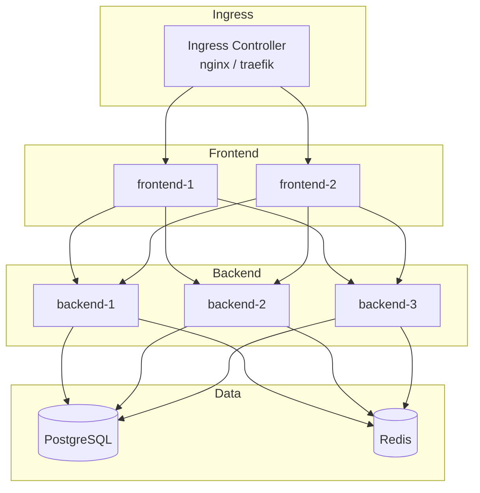

# Kubernetes Deployment

This guide describes how to deploy AuraBoot on Kubernetes. AuraBoot does not currently ship a Helm chart, but the architecture maps cleanly to standard Kubernetes resources. This document provides the conceptual structure and example manifests.

## Architecture Overview



## Namespace

```yaml
apiVersion: v1
kind: Namespace
metadata:
  name: auraboot
```

---

## ConfigMap

Shared configuration for all backend pods:

```yaml
apiVersion: v1
kind: ConfigMap
metadata:
  name: auraboot-config
  namespace: auraboot
data:
  SPRING_PROFILES_ACTIVE: "community"
  AURABOOT_BOOTSTRAP_ENABLED: "true"
  FRONTEND_BASE_URL: "https://app.example.com"
  REDIS_HOST: "redis-svc"
  SERVER_PORT: "6443"
```

## Secrets

Sensitive values stored as Kubernetes Secrets:

```yaml
apiVersion: v1
kind: Secret
metadata:
  name: auraboot-secrets
  namespace: auraboot
type: Opaque
stringData:
  DATABASE_URL: "jdbc:postgresql://postgres-svc:5432/aura_boot?charSet=UTF8"
  DATABASE_USERNAME: "auraboot"
  DATABASE_PASSWORD: "<strong-password>"
  JWT_SECRET: "<openssl rand -hex 32>"
  FIELD_ENCRYPTION_KEY: "<openssl rand -base64 32>"
  ANTHROPIC_API_KEY: "<your-key>"  # Optional: for AI features
```

---

## PostgreSQL

For production, use a managed PostgreSQL service (Amazon RDS, Google Cloud SQL, Azure Database for PostgreSQL). If self-hosting:

```yaml
apiVersion: apps/v1
kind: StatefulSet
metadata:
  name: postgres
  namespace: auraboot
spec:
  serviceName: postgres-svc
  replicas: 1
  selector:
    matchLabels:
      app: postgres
  template:
    metadata:
      labels:
        app: postgres
    spec:
      containers:
        - name: postgres
          image: pgvector/pgvector:pg16
          ports:
            - containerPort: 5432
          env:
            - name: POSTGRES_DB
              value: "aura_boot"
            - name: POSTGRES_USER
              valueFrom:
                secretKeyRef:
                  name: auraboot-secrets
                  key: DATABASE_USERNAME
            - name: POSTGRES_PASSWORD
              valueFrom:
                secretKeyRef:
                  name: auraboot-secrets
                  key: DATABASE_PASSWORD
          volumeMounts:
            - name: pg-data
              mountPath: /var/lib/postgresql/data
          readinessProbe:
            exec:
              command: ["pg_isready", "-U", "auraboot", "-d", "aura_boot"]
            initialDelaySeconds: 10
            periodSeconds: 5
          resources:
            requests:
              cpu: 500m
              memory: 1Gi
            limits:
              cpu: 2000m
              memory: 4Gi
  volumeClaimTemplates:
    - metadata:
        name: pg-data
      spec:
        accessModes: ["ReadWriteOnce"]
        resources:
          requests:
            storage: 50Gi
---
apiVersion: v1
kind: Service
metadata:
  name: postgres-svc
  namespace: auraboot
spec:
  selector:
    app: postgres
  ports:
    - port: 5432
  clusterIP: None  # Headless for StatefulSet
```

### Required Extensions

The schema initialization script enables these PostgreSQL extensions:

- `pg_trgm` -- Trigram indexes for fuzzy text search
- `pgcrypto` -- Cryptographic functions
- `vector` -- pgvector for AI embeddings

Ensure your PostgreSQL instance has these extensions available.

---

## Redis

```yaml
apiVersion: apps/v1
kind: Deployment
metadata:
  name: redis
  namespace: auraboot
spec:
  replicas: 1
  selector:
    matchLabels:
      app: redis
  template:
    metadata:
      labels:
        app: redis
    spec:
      containers:
        - name: redis
          image: redis:7-alpine
          ports:
            - containerPort: 6379
          readinessProbe:
            exec:
              command: ["redis-cli", "ping"]
            periodSeconds: 5
          resources:
            requests:
              cpu: 100m
              memory: 256Mi
            limits:
              cpu: 500m
              memory: 1Gi
---
apiVersion: v1
kind: Service
metadata:
  name: redis-svc
  namespace: auraboot
spec:
  selector:
    app: redis
  ports:
    - port: 6379
```

---

## Backend Deployment

```yaml
apiVersion: apps/v1
kind: Deployment
metadata:
  name: backend
  namespace: auraboot
spec:
  replicas: 3
  selector:
    matchLabels:
      app: backend
  template:
    metadata:
      labels:
        app: backend
    spec:
      containers:
        - name: backend
          image: ghcr.io/aurabootteam/auraboot-backend:latest
          ports:
            - containerPort: 6443
          envFrom:
            - configMapRef:
                name: auraboot-config
            - secretRef:
                name: auraboot-secrets
          readinessProbe:
            httpGet:
              path: /actuator/health
              port: 6443
            initialDelaySeconds: 60
            periodSeconds: 15
            timeoutSeconds: 10
          livenessProbe:
            httpGet:
              path: /actuator/health
              port: 6443
            initialDelaySeconds: 120
            periodSeconds: 30
            timeoutSeconds: 10
          resources:
            requests:
              cpu: 500m
              memory: 1Gi
            limits:
              cpu: 2000m
              memory: 4Gi
          volumeMounts:
            - name: data
              mountPath: /app/data
      volumes:
        - name: data
          emptyDir: {}  # Use PVC for persistent file storage
---
apiVersion: v1
kind: Service
metadata:
  name: backend-svc
  namespace: auraboot
spec:
  selector:
    app: backend
  ports:
    - port: 6443
```

### Startup Time

The Spring Boot backend takes 60-120 seconds to start. The readiness probe `initialDelaySeconds` should be at least 60. Do not route traffic until the pod is ready.

---

## Frontend Deployment

```yaml
apiVersion: apps/v1
kind: Deployment
metadata:
  name: frontend
  namespace: auraboot
spec:
  replicas: 2
  selector:
    matchLabels:
      app: frontend
  template:
    metadata:
      labels:
        app: frontend
    spec:
      containers:
        - name: frontend
          image: ghcr.io/aurabootteam/auraboot-frontend:latest
          ports:
            - containerPort: 3000
          env:
            - name: NODE_ENV
              value: "production"
            - name: BFF_PORT
              value: "3000"
            - name: SPRING_BOOT_URL
              value: "http://backend-svc:6443"
            - name: CORS_ALLOWED_ORIGINS
              value: "https://app.example.com"
          readinessProbe:
            httpGet:
              path: /
              port: 3000
            initialDelaySeconds: 10
            periodSeconds: 5
          resources:
            requests:
              cpu: 200m
              memory: 512Mi
            limits:
              cpu: 1000m
              memory: 1Gi
---
apiVersion: v1
kind: Service
metadata:
  name: frontend-svc
  namespace: auraboot
spec:
  selector:
    app: frontend
  ports:
    - port: 3000
```

---

## Ingress

```yaml
apiVersion: networking.k8s.io/v1
kind: Ingress
metadata:
  name: auraboot-ingress
  namespace: auraboot
  annotations:
    nginx.ingress.kubernetes.io/proxy-body-size: "100m"
    cert-manager.io/cluster-issuer: "letsencrypt-prod"
spec:
  ingressClassName: nginx
  tls:
    - hosts:
        - app.example.com
      secretName: auraboot-tls
  rules:
    - host: app.example.com
      http:
        paths:
          - path: /
            pathType: Prefix
            backend:
              service:
                name: frontend-svc
                port:
                  number: 3000
```

---

## Horizontal Pod Autoscaling

```yaml
apiVersion: autoscaling/v2
kind: HorizontalPodAutoscaler
metadata:
  name: backend-hpa
  namespace: auraboot
spec:
  scaleTargetRef:
    apiVersion: apps/v1
    kind: Deployment
    name: backend
  minReplicas: 2
  maxReplicas: 10
  metrics:
    - type: Resource
      resource:
        name: cpu
        target:
          type: Utilization
          averageUtilization: 70
    - type: Resource
      resource:
        name: memory
        target:
          type: Utilization
          averageUtilization: 80
---
apiVersion: autoscaling/v2
kind: HorizontalPodAutoscaler
metadata:
  name: frontend-hpa
  namespace: auraboot
spec:
  scaleTargetRef:
    apiVersion: apps/v1
    kind: Deployment
    name: frontend
  minReplicas: 2
  maxReplicas: 5
  metrics:
    - type: Resource
      resource:
        name: cpu
        target:
          type: Utilization
          averageUtilization: 70
```

---

## Resource Recommendations

| Service | CPU Request | CPU Limit | Memory Request | Memory Limit |
|---------|------------|-----------|----------------|-------------|
| PostgreSQL | 500m | 2000m | 1Gi | 4Gi |
| Redis | 100m | 500m | 256Mi | 1Gi |
| Backend | 500m | 2000m | 1Gi | 4Gi |
| Frontend | 200m | 1000m | 512Mi | 1Gi |

Adjust based on your workload. The backend is the most resource-intensive component -- increase limits for heavy API traffic or AI features.

---

## Multi-Instance Requirements

When running multiple backend replicas, Redis is **required** for:

- **Distributed locks** -- Prevents concurrent command execution on the same record
- **Real-time data sync** -- SSE events are broadcast across instances via Redis pub/sub
- **Event bus** -- Cross-instance event propagation
- **Message queue** -- Webhook delivery and background task coordination

Set `REDIS_HOST=redis-svc` in the backend ConfigMap.

---

## Persistent Storage

For file uploads and exports, the backend writes to `/app/data`. Options:

1. **ReadWriteMany PVC** (NFS, EFS, etc.) -- Shared across all backend pods
2. **S3/MinIO** -- Configure `aura.storage.type=minio` or `s3` in application config
3. **emptyDir** -- Only for evaluation (data lost on pod restart)

For production, use object storage (S3/MinIO) to avoid shared filesystem complexity.

---

## Monitoring

The backend exposes Prometheus metrics at `/actuator/prometheus`. Configure a ServiceMonitor (if using Prometheus Operator):

```yaml
apiVersion: monitoring.coreos.com/v1
kind: ServiceMonitor
metadata:
  name: auraboot-backend
  namespace: auraboot
spec:
  selector:
    matchLabels:
      app: backend
  endpoints:
    - port: http
      path: /actuator/prometheus
      interval: 15s
```
