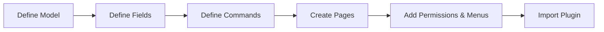
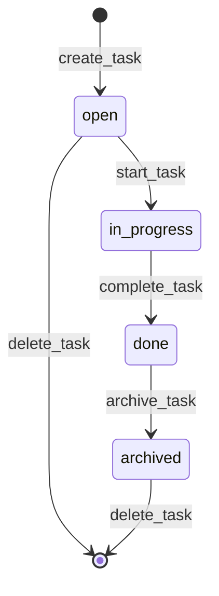

# Build Your First App: Task Tracker (30 Minutes)

In this tutorial, you build a complete Task Tracker application from scratch using AuraBoot's plugin system. By the end, you will have:

- A data model with 8 fields
- CRUD commands + state machine transitions
- A list page with filters, tabs, and search
- A form page for creating and editing tasks
- A detail page with tabs
- A dashboard with stat cards
- Permissions and menus

Everything is defined in JSON. No backend or frontend code to write.



## Prerequisites

- AuraBoot running locally (see [Quick Start](quick-start.md))
- A terminal with access to the project directory
- The AuraBoot CLI installed (`aura` command available)

## Step 1: Create the Plugin Directory

Create a new plugin directory under `plugins/`:

```bash
mkdir -p plugins/task-tracker/config/{fields,commands,pages,bindings}
```

Your directory structure will look like this:

```
plugins/task-tracker/
├── plugin.json
└── config/
    ├── models.json
    ├── dicts.json
    ├── fields/
    │   └── tt_task.json
    ├── bindings/
    │   └── tt_task.json
    ├── commands/
    │   └── tt_task.json
    ├── pages/
    │   ├── tt_task_list.json
    │   ├── tt_task_form.json
    │   ├── tt_task_detail.json
    │   └── tt_task_dashboard.json
    ├── permissions.json
    ├── roles.json
    ├── menus.json
    ├── i18n.json
    └── default-bootstrap.json
```

## Step 2: Create the Plugin Manifest

Create `plugins/task-tracker/plugin.json`:

```json
{
  "pluginId": "com.auraboot.task-tracker",
  "namespace": "tt",
  "version": "1.0.0",
  "dslVersion": 1,
  "pluginType": "config",
  "displayName": "Task Tracker",
  "displayName:zh-CN": "任务追踪器",
  "displayName:en": "Task Tracker",
  "description": "A simple task tracking application with status workflow, priority management, and dashboard.",
  "author": "AuraBoot Tutorial",
  "minPlatformVersion": "1.0.0",
  "dependencies": [],
  "provides": [
    {"type": "model", "code": "tt_task"},
    {"type": "command", "code": "tt:create_task"},
    {"type": "command", "code": "tt:update_task"},
    {"type": "command", "code": "tt:delete_task"},
    {"type": "command", "code": "tt:start_task"},
    {"type": "command", "code": "tt:complete_task"},
    {"type": "command", "code": "tt:archive_task"}
  ],
  "requires": [],
  "resourceDirs": {
    "models": "config/models.json",
    "fields": "config/fields",
    "modelFieldBindings": "config/bindings",
    "commands": "config/commands",
    "pages": "config/pages",
    "dicts": "config/dicts.json",
    "permissions": "config/permissions.json",
    "menus": "config/menus.json",
    "i18n": "config/i18n.json",
    "roles": "config/roles.json"
  },
  "importOptions": {
    "conflictStrategy": "overwrite",
    "validateReferences": true,
    "autoPublishModels": true,
    "autoPublishFields": true,
    "autoPublishCommands": true,
    "autoPublishPages": true,
    "createResourcePermissions": true
  }
}
```

Key points:
- `namespace` is `tt` -- all command codes are prefixed with `tt:`.
- `pluginType` is `config` -- this is a pure JSON configuration plugin (no Java code).
- `importOptions.conflictStrategy` is `overwrite` -- re-importing replaces existing resources.

Validate the manifest:

```bash
aura plugin validate plugins/task-tracker
```

## Step 3: Define the Model

Create `plugins/task-tracker/config/models.json`:

```json
[
  {
    "code": "tt_task",
    "displayName:zh-CN": "任务",
    "displayName:en": "Task",
    "description": "Task Tracker - task entity with priority and status workflow",
    "modelType": "entity",
    "modelCategory": "entity",
    "extension": {
      "icon": "CheckSquare",
      "category": "task-tracker",
      "titleField": "tt_title",
      "subtitleField": "tt_status"
    }
  }
]
```

A model definition tells AuraBoot to create a database table (`mt_tt_task`), register REST API endpoints, and make the model available for commands and pages.

- `code` -- Unique identifier. Convention: `{namespace}_{entity}`.
- `modelType` -- `entity` for standard business objects.
- `extension.titleField` -- The field displayed as the record title in lists and detail pages.

## Step 4: Define Fields

Create `plugins/task-tracker/config/fields/tt_task.json`:

```json
[
  {
    "code": "tt_title",
    "displayName:zh-CN": "任务标题",
    "displayName:en": "Title",
    "dataType": "string",
    "constraints": { "required": true, "maxLength": 200 },
    "feature": { "searchable": true, "sortable": true }
  },
  {
    "code": "tt_description",
    "displayName:zh-CN": "描述",
    "displayName:en": "Description",
    "dataType": "text",
    "constraints": {},
    "feature": { "searchable": true }
  },
  {
    "code": "tt_priority",
    "displayName:zh-CN": "优先级",
    "displayName:en": "Priority",
    "dataType": "enum",
    "dictCode": "tt_priority",
    "defaultValue": "medium",
    "feature": { "searchable": true, "sortable": true }
  },
  {
    "code": "tt_assignee",
    "displayName:zh-CN": "负责人",
    "displayName:en": "Assignee",
    "dataType": "string",
    "constraints": { "maxLength": 100 },
    "feature": { "searchable": true }
  },
  {
    "code": "tt_due_date",
    "displayName:zh-CN": "截止日期",
    "displayName:en": "Due Date",
    "dataType": "date",
    "feature": { "sortable": true }
  },
  {
    "code": "tt_status",
    "displayName:zh-CN": "状态",
    "displayName:en": "Status",
    "dataType": "enum",
    "dictCode": "tt_status",
    "defaultValue": "open",
    "feature": { "searchable": true, "sortable": true }
  },
  {
    "code": "tt_progress",
    "displayName:zh-CN": "进度",
    "displayName:en": "Progress",
    "dataType": "integer",
    "defaultValue": "0",
    "constraints": { "min": 0, "max": 100 }
  },
  {
    "code": "tt_tags",
    "displayName:zh-CN": "标签",
    "displayName:en": "Tags",
    "dataType": "string",
    "constraints": { "maxLength": 500 },
    "feature": { "searchable": true }
  }
]
```

Each field definition maps to a database column. AuraBoot supports 22+ data types including `string`, `text`, `integer`, `decimal`, `date`, `datetime`, `boolean`, `enum`, `reference`, and more.

Now create the field-to-model binding. Create `plugins/task-tracker/config/bindings/tt_task.json`:

```json
[
  { "modelCode": "tt_task", "fieldCode": "tt_title", "sortNo": 10 },
  { "modelCode": "tt_task", "fieldCode": "tt_description", "sortNo": 20 },
  { "modelCode": "tt_task", "fieldCode": "tt_priority", "sortNo": 30 },
  { "modelCode": "tt_task", "fieldCode": "tt_assignee", "sortNo": 40 },
  { "modelCode": "tt_task", "fieldCode": "tt_due_date", "sortNo": 50 },
  { "modelCode": "tt_task", "fieldCode": "tt_status", "sortNo": 60 },
  { "modelCode": "tt_task", "fieldCode": "tt_progress", "sortNo": 70 },
  { "modelCode": "tt_task", "fieldCode": "tt_tags", "sortNo": 80 }
]
```

## Step 5: Define Dictionaries (Enums)

Create `plugins/task-tracker/config/dicts.json`:

```json
[
  {
    "code": "tt_priority",
    "name": "Task Priority",
    "name:zh-CN": "任务优先级",
    "dictType": "static",
    "items": [
      {
        "value": "low",
        "label": "Low",
        "label:zh-CN": "低",
        "sortNo": 10,
        "status": "enabled",
        "extension": { "color": "gray" }
      },
      {
        "value": "medium",
        "label": "Medium",
        "label:zh-CN": "中",
        "sortNo": 20,
        "status": "enabled",
        "extension": { "color": "blue" }
      },
      {
        "value": "high",
        "label": "High",
        "label:zh-CN": "高",
        "sortNo": 30,
        "status": "enabled",
        "extension": { "color": "orange" }
      },
      {
        "value": "urgent",
        "label": "Urgent",
        "label:zh-CN": "紧急",
        "sortNo": 40,
        "status": "enabled",
        "extension": { "color": "red" }
      }
    ]
  },
  {
    "code": "tt_status",
    "name": "Task Status",
    "name:zh-CN": "任务状态",
    "dictType": "static",
    "items": [
      {
        "value": "open",
        "label": "Open",
        "label:zh-CN": "待处理",
        "sortNo": 10,
        "status": "enabled",
        "extension": { "color": "blue" }
      },
      {
        "value": "in_progress",
        "label": "In Progress",
        "label:zh-CN": "进行中",
        "sortNo": 20,
        "status": "enabled",
        "extension": { "color": "orange" }
      },
      {
        "value": "done",
        "label": "Done",
        "label:zh-CN": "已完成",
        "sortNo": 30,
        "status": "enabled",
        "extension": { "color": "green" }
      },
      {
        "value": "archived",
        "label": "Archived",
        "label:zh-CN": "已归档",
        "sortNo": 40,
        "status": "enabled",
        "extension": { "color": "gray" }
      }
    ]
  }
]
```

Dictionaries define the allowed values for `enum` fields. The `extension.color` property controls how tags are rendered in the UI.

## Step 6: Define Commands

Create `plugins/task-tracker/config/commands/tt_task.json`:

```json
[
  {
    "code": "tt:create_task",
    "displayName:zh-CN": "新建任务",
    "displayName:en": "Create Task",
    "type": "create",
    "modelCode": "tt_task",
    "inputFields": [
      "tt_title",
      "tt_description",
      "tt_priority",
      "tt_assignee",
      "tt_due_date",
      "tt_tags"
    ],
    "autoSetFields": {
      "tt_status": {
        "strategy": "fixed_value",
        "value": "open"
      },
      "tt_progress": {
        "strategy": "fixed_value",
        "value": "0"
      }
    },
    "permissions": ["TT.task.manage"],
    "agent_hint": "Create a new task. Requires title. Auto-sets status=open, progress=0.",
    "cmd_risk_level": "L1"
  },
  {
    "code": "tt:update_task",
    "displayName:zh-CN": "编辑任务",
    "displayName:en": "Update Task",
    "type": "update",
    "modelCode": "tt_task",
    "inputFields": [
      "tt_title",
      "tt_description",
      "tt_priority",
      "tt_assignee",
      "tt_due_date",
      "tt_progress",
      "tt_tags"
    ],
    "permissions": ["TT.task.manage"],
    "agent_hint": "Update an existing task.",
    "cmd_risk_level": "L1"
  },
  {
    "code": "tt:delete_task",
    "displayName:zh-CN": "删除任务",
    "displayName:en": "Delete Task",
    "type": "delete",
    "modelCode": "tt_task",
    "preconditions": [
      {
        "field": "tt_status",
        "operator": "IN",
        "value": ["open", "archived"]
      }
    ],
    "extension": {
      "confirmMessage:zh-CN": "确认删除此任务？",
      "confirmMessage:en": "Confirm delete this task?"
    },
    "permissions": ["TT.task.manage"],
    "agent_hint": "Delete a task. Only allowed when status is open or archived.",
    "cmd_risk_level": "L4"
  },
  {
    "code": "tt:start_task",
    "displayName:zh-CN": "开始任务",
    "displayName:en": "Start Task",
    "type": "state_transition",
    "modelCode": "tt_task",
    "stateField": "tt_status",
    "fromStates": ["open"],
    "toState": "in_progress",
    "permissions": ["TT.task.manage"],
    "agent_hint": "Transition task from open to in_progress.",
    "cmd_risk_level": "L1"
  },
  {
    "code": "tt:complete_task",
    "displayName:zh-CN": "完成任务",
    "displayName:en": "Complete Task",
    "type": "state_transition",
    "modelCode": "tt_task",
    "stateField": "tt_status",
    "fromStates": ["in_progress"],
    "toState": "done",
    "autoSetFields": {
      "tt_progress": {
        "strategy": "fixed_value",
        "value": "100"
      }
    },
    "permissions": ["TT.task.manage"],
    "agent_hint": "Transition task from in_progress to done. Auto-sets progress=100.",
    "cmd_risk_level": "L1"
  },
  {
    "code": "tt:archive_task",
    "displayName:zh-CN": "归档任务",
    "displayName:en": "Archive Task",
    "type": "state_transition",
    "modelCode": "tt_task",
    "stateField": "tt_status",
    "fromStates": ["done"],
    "toState": "archived",
    "extension": {
      "confirmMessage:zh-CN": "确认归档此任务？归档后无法恢复。",
      "confirmMessage:en": "Confirm archiving this task? This cannot be undone."
    },
    "permissions": ["TT.task.manage"],
    "agent_hint": "Transition task from done to archived.",
    "cmd_risk_level": "L2"
  },
  {
    "code": "tt:detail_task",
    "displayName:zh-CN": "查看任务",
    "displayName:en": "View Task",
    "type": "query",
    "modelCode": "tt_task",
    "permissions": ["TT.task.read"],
    "agent_hint": "Query task details.",
    "cmd_risk_level": "L0"
  },
  {
    "code": "tt:list_tasks",
    "displayName:zh-CN": "任务列表",
    "displayName:en": "List Tasks",
    "type": "query",
    "modelCode": "tt_task",
    "permissions": ["TT.task.read"],
    "agent_hint": "Query task list.",
    "cmd_risk_level": "L0"
  }
]
```

The state machine is defined implicitly through `state_transition` commands:



Key concepts:
- `type: "create"` -- Inserts a new record. `autoSetFields` sets default values automatically.
- `type: "update"` -- Updates an existing record. Only `inputFields` are editable.
- `type: "delete"` -- Deletes a record. `preconditions` restrict which records can be deleted.
- `type: "state_transition"` -- Changes the `stateField` from one of `fromStates` to `toState`. The platform validates the transition is legal before executing.
- `type: "query"` -- Read-only. Used for list and detail pages.

## Step 7: Create the List Page

Create `plugins/task-tracker/config/pages/tt_task_list.json`:

```json
{
  "pageKey": "tt_task_list",
  "name:zh-CN": "任务列表",
  "name:en": "Tasks",
  "pageType": "list",
  "modelCode": "tt_task",
  "dslSchema": {
    "id": "list.tt_task",
    "kind": "List",
    "areas": {
      "toolbar": {
        "blocks": [
          {
            "id": "tt_task_toolbar",
            "blockType": "toolbar",
            "buttons": [
              {
                "code": "create",
                "primary": true,
                "permissionCode": "TT.task.manage",
                "label": "create",
                "action": {
                  "type": "navigate",
                  "to": "tt_task_form",
                  "command": "tt:create_task"
                }
              }
            ]
          }
        ]
      },
      "list-tabs": {
        "blocks": [
          {
            "id": "tt_task_tabs",
            "blockType": "list-tabs",
            "tabs": [
              {
                "key": "all",
                "label": { "en": "All", "zh-CN": "全部" },
                "filter": null
              },
              {
                "key": "open",
                "label": { "en": "Open", "zh-CN": "待处理" },
                "filter": { "field": "tt_status", "value": "open", "operator": "EQ" }
              },
              {
                "key": "in_progress",
                "label": { "en": "In Progress", "zh-CN": "进行中" },
                "filter": { "field": "tt_status", "value": "in_progress", "operator": "EQ" }
              },
              {
                "key": "done",
                "label": { "en": "Done", "zh-CN": "已完成" },
                "filter": { "field": "tt_status", "value": "done", "operator": "EQ" }
              },
              {
                "key": "archived",
                "label": { "en": "Archived", "zh-CN": "已归档" },
                "filter": { "field": "tt_status", "value": "archived", "operator": "EQ" }
              }
            ]
          }
        ]
      },
      "main": {
        "blocks": [
          {
            "id": "tt_task_table",
            "blockType": "data-table",
            "columns": [
              { "field": "tt_title", "width": 250, "sortable": true },
              { "field": "tt_priority", "width": 100, "renderType": "tag", "dictCode": "tt_priority" },
              { "field": "tt_status", "width": 120, "renderType": "tag", "dictCode": "tt_status" },
              { "field": "tt_assignee", "width": 120 },
              { "field": "tt_due_date", "width": 120, "sortable": true },
              { "field": "tt_progress", "width": 100 },
              {
                "field": "actions",
                "isActionColumn": true,
                "buttons": [
                  {
                    "code": "view",
                    "label": "detail",
                    "action": { "type": "navigate", "to": "tt_task_detail" }
                  },
                  {
                    "code": "edit",
                    "permissionCode": "TT.task.manage",
                    "label": "edit",
                    "action": { "type": "navigate", "to": "tt_task_form" }
                  },
                  {
                    "code": "delete",
                    "danger": true,
                    "permissionCode": "TT.task.manage",
                    "label": "delete",
                    "confirm": "delete.confirm",
                    "action": { "type": "command", "command": "tt:delete_task" }
                  }
                ]
              }
            ],
            "searchFields": ["tt_title", "tt_assignee", "tt_tags"],
            "defaultSort": { "field": "created_at", "order": "desc" }
          }
        ]
      }
    },
    "layout": {
      "areas": ["list-tabs", "toolbar", "main"],
      "areasConfig": {
        "list-tabs": { "type": "flex", "direction": "row" },
        "toolbar": { "type": "flex", "direction": "row", "justify": "space-between", "align": "center" },
        "main": { "type": "grid", "cols": 12, "rowGap": 0, "colGap": 0 }
      }
    }
  }
}
```

This gives you:
- **Status tabs** at the top (All, Open, In Progress, Done, Archived)
- **Create button** in the toolbar
- **Data table** with sortable columns, priority/status tags, and action buttons (view, edit, delete)
- **Keyword search** across title, assignee, and tags

## Step 8: Create the Form Page

Create `plugins/task-tracker/config/pages/tt_task_form.json`:

```json
{
  "pageKey": "tt_task_form",
  "name:zh-CN": "任务表单",
  "name:en": "Task Form",
  "pageType": "form",
  "modelCode": "tt_task",
  "dslSchema": {
    "id": "form.tt_task",
    "kind": "Form",
    "modelCode": "tt_task",
    "layout": {
      "areas": ["main", "footer"],
      "areasConfig": {
        "main": { "type": "grid", "cols": 12, "rowGap": 16, "colGap": 16 },
        "footer": { "type": "flex", "direction": "row" }
      }
    },
    "areas": {
      "main": {
        "blocks": [
          {
            "id": "basic_info",
            "blockType": "form-section",
            "title": { "en": "Task Information", "zh-CN": "任务信息" },
            "fields": [
              { "field": "tt_title", "colSpan": 12 },
              { "field": "tt_priority", "colSpan": 6 },
              { "field": "tt_assignee", "colSpan": 6 },
              { "field": "tt_due_date", "colSpan": 6 },
              { "field": "tt_progress", "colSpan": 6 },
              { "field": "tt_tags", "colSpan": 12 },
              { "field": "tt_description", "colSpan": 12 }
            ]
          }
        ]
      },
      "footer": {
        "blocks": [
          {
            "id": "buttons",
            "blockType": "form-buttons",
            "buttons": [
              {
                "code": "submit",
                "primary": true,
                "label": "save",
                "action": { "type": "command", "command": "tt:update_task" }
              },
              {
                "code": "cancel",
                "label": "cancel"
              }
            ]
          }
        ]
      }
    }
  }
}
```

The form uses a 12-column grid layout:
- Title spans the full width (`colSpan: 12`)
- Priority and assignee sit side-by-side (`colSpan: 6` each)
- Description takes the full width at the bottom

## Step 9: Create the Detail Page

Create `plugins/task-tracker/config/pages/tt_task_detail.json`:

```json
{
  "pageKey": "tt_task_detail",
  "name:zh-CN": "任务详情",
  "name:en": "Task Detail",
  "pageType": "detail",
  "modelCode": "tt_task",
  "dslSchema": {
    "id": "detail.tt_task",
    "kind": "Detail",
    "modelCode": "tt_task",
    "layout": {
      "areas": ["header", "main"],
      "areasConfig": {
        "header": { "type": "flex", "direction": "row", "justify": "space-between" },
        "main": { "type": "grid", "cols": 12, "rowGap": 16, "colGap": 16 }
      }
    },
    "areas": {
      "header": {
        "blocks": [
          {
            "id": "tt_task_actions",
            "blockType": "toolbar",
            "buttons": [
              {
                "code": "edit",
                "permissionCode": "TT.task.manage",
                "label": "edit",
                "action": { "type": "navigate", "to": "tt_task_form" }
              },
              {
                "code": "start",
                "permissionCode": "TT.task.manage",
                "label": { "en": "Start", "zh-CN": "开始" },
                "action": { "type": "command", "command": "tt:start_task" }
              },
              {
                "code": "complete",
                "permissionCode": "TT.task.manage",
                "label": { "en": "Complete", "zh-CN": "完成" },
                "primary": true,
                "action": { "type": "command", "command": "tt:complete_task" }
              },
              {
                "code": "archive",
                "permissionCode": "TT.task.manage",
                "label": { "en": "Archive", "zh-CN": "归档" },
                "action": { "type": "command", "command": "tt:archive_task" }
              },
              {
                "code": "delete",
                "danger": true,
                "permissionCode": "TT.task.manage",
                "label": "delete",
                "confirm": "delete.confirm",
                "action": { "type": "command", "command": "tt:delete_task" }
              }
            ]
          }
        ]
      },
      "main": {
        "blocks": [
          {
            "id": "tt_task_tabs",
            "blockType": "tabs",
            "tabs": [
              {
                "key": "overview",
                "label": { "en": "Overview", "zh-CN": "概览" },
                "blocks": [
                  {
                    "id": "tt_task_overview",
                    "blockType": "form-section",
                    "readonly": true,
                    "fields": [
                      { "field": "tt_title", "colSpan": 12 },
                      { "field": "tt_priority", "colSpan": 6 },
                      { "field": "tt_status", "colSpan": 6 },
                      { "field": "tt_assignee", "colSpan": 6 },
                      { "field": "tt_due_date", "colSpan": 6 },
                      { "field": "tt_progress", "colSpan": 6 },
                      { "field": "tt_tags", "colSpan": 6 },
                      { "field": "tt_description", "colSpan": 12 }
                    ]
                  }
                ]
              },
              {
                "key": "activity",
                "label": { "en": "Activity Log", "zh-CN": "操作记录" },
                "blocks": [
                  {
                    "id": "tt_task_activity",
                    "blockType": "activity-log"
                  }
                ]
              }
            ]
          }
        ]
      }
    }
  }
}
```

The detail page has:
- **Action buttons** in the header -- Edit, Start, Complete, Archive, Delete. The platform automatically shows/hides buttons based on the current record status and command preconditions.
- **Tabs** -- Overview (read-only field display) and Activity Log (audit trail).

## Step 10: Create a Dashboard

Create `plugins/task-tracker/config/pages/tt_task_dashboard.json`:

```json
{
  "pageKey": "tt_task_dashboard",
  "name:zh-CN": "任务仪表盘",
  "name:en": "Task Dashboard",
  "pageType": "dashboard",
  "modelCode": "tt_task",
  "dslSchema": {
    "id": "dashboard.tt_task",
    "kind": "Dashboard",
    "modelCode": "tt_task",
    "layout": {
      "areas": ["main"],
      "areasConfig": {
        "main": { "type": "grid", "cols": 12, "rowGap": 16, "colGap": 16 }
      }
    },
    "areas": {
      "main": {
        "blocks": [
          {
            "id": "stat_total",
            "blockType": "stat-card",
            "colSpan": 3,
            "title": { "en": "Total Tasks", "zh-CN": "总任务数" },
            "dataSource": {
              "type": "count",
              "modelCode": "tt_task"
            }
          },
          {
            "id": "stat_open",
            "blockType": "stat-card",
            "colSpan": 3,
            "title": { "en": "Open", "zh-CN": "待处理" },
            "color": "blue",
            "dataSource": {
              "type": "count",
              "modelCode": "tt_task",
              "filters": [
                { "field": "tt_status", "operator": "EQ", "value": "open" }
              ]
            }
          },
          {
            "id": "stat_in_progress",
            "blockType": "stat-card",
            "colSpan": 3,
            "title": { "en": "In Progress", "zh-CN": "进行中" },
            "color": "orange",
            "dataSource": {
              "type": "count",
              "modelCode": "tt_task",
              "filters": [
                { "field": "tt_status", "operator": "EQ", "value": "in_progress" }
              ]
            }
          },
          {
            "id": "stat_done",
            "blockType": "stat-card",
            "colSpan": 3,
            "title": { "en": "Done", "zh-CN": "已完成" },
            "color": "green",
            "dataSource": {
              "type": "count",
              "modelCode": "tt_task",
              "filters": [
                { "field": "tt_status", "operator": "EQ", "value": "done" }
              ]
            }
          }
        ]
      }
    }
  }
}
```

The dashboard displays four stat cards in a row, each showing a count filtered by status.

## Step 11: Configure Permissions

Create `plugins/task-tracker/config/permissions.json`:

```json
[
  {
    "code": "tt.task.manage",
    "name:zh-CN": "任务管理",
    "name:en": "Task Management",
    "resourceType": "operation",
    "module": "tt"
  },
  {
    "code": "tt.task.read",
    "name:zh-CN": "查看任务",
    "name:en": "View Tasks",
    "resourceType": "data",
    "module": "tt"
  }
]
```

Create `plugins/task-tracker/config/roles.json`:

```json
[
  {
    "code": "tt_admin",
    "name:zh-CN": "Task Tracker 管理员",
    "name:en": "Task Tracker Administrator",
    "description": "Full access to Task Tracker",
    "permissions": [
      "tt.task.manage",
      "tt.task.read"
    ]
  }
]
```

Create `plugins/task-tracker/config/default-bootstrap.json` to grant the tenant admin full access:

```json
{
  "rolePermissionBindings": [
    {
      "roleCode": "tenant_admin",
      "permissionCodes": ["*"]
    }
  ]
}
```

## Step 12: Configure Menus

Create `plugins/task-tracker/config/menus.json`:

```json
[
  {
    "code": "tt_root",
    "parentCode": null,
    "name:zh-CN": "任务追踪",
    "name:en": "Task Tracker",
    "path": null,
    "component": null,
    "icon": "IconCheckSquare",
    "type": 0,
    "permissionCode": null,
    "orderNo": 300,
    "visible": true
  },
  {
    "code": "tt_dashboard",
    "parentCode": "tt_root",
    "name:zh-CN": "仪表盘",
    "name:en": "Dashboard",
    "path": "/p/tt_task_dashboard",
    "component": null,
    "icon": "IconDashboard",
    "type": 1,
    "permissionCode": "tt.task.read",
    "orderNo": 1,
    "visible": true
  },
  {
    "code": "tt_tasks",
    "parentCode": "tt_root",
    "name:zh-CN": "任务",
    "name:en": "Tasks",
    "path": "/p/tt_task",
    "component": null,
    "icon": "IconCheckSquare",
    "type": 1,
    "permissionCode": "tt.task.read",
    "orderNo": 2,
    "visible": true
  }
]
```

Menu `type`:
- `0` -- Directory (parent node, no link)
- `1` -- Page link

The `path` uses the `/p/{pageKey}` convention. AuraBoot routes `/p/tt_task` to the list page for the `tt_task` model.

## Step 13: Add i18n Labels

Create `plugins/task-tracker/config/i18n.json`:

```json
{
  "en": {
    "model.tt_task.label": "Task",
    "model.tt_task.label.plural": "Tasks",
    "field.tt_title.label": "Title",
    "field.tt_description.label": "Description",
    "field.tt_priority.label": "Priority",
    "field.tt_assignee.label": "Assignee",
    "field.tt_due_date.label": "Due Date",
    "field.tt_status.label": "Status",
    "field.tt_progress.label": "Progress",
    "field.tt_tags.label": "Tags"
  },
  "zh-CN": {
    "model.tt_task.label": "任务",
    "model.tt_task.label.plural": "任务",
    "field.tt_title.label": "任务标题",
    "field.tt_description.label": "描述",
    "field.tt_priority.label": "优先级",
    "field.tt_assignee.label": "负责人",
    "field.tt_due_date.label": "截止日期",
    "field.tt_status.label": "状态",
    "field.tt_progress.label": "进度",
    "field.tt_tags.label": "标签"
  }
}
```

## Step 14: Import the Plugin

With the backend running, import your plugin:

```bash
aura plugin publish plugins/task-tracker --yes
```

Expected output:

```
Publishing plugin: com.auraboot.task-tracker v1.0.0
  Importing models... 1 model(s)
  Importing fields... 8 field(s)
  Importing bindings... 8 binding(s)
  Importing dicts... 2 dict(s)
  Importing commands... 8 command(s)
  Importing pages... 4 page(s)
  Importing permissions... 2 permission(s)
  Importing roles... 1 role(s)
  Importing menus... 3 menu(s)
  Publishing models... done
  Publishing fields... done
  Publishing commands... done
  Publishing pages... done
Plugin published successfully.
```

If you see validation errors, fix the JSON and run again. The `overwrite` conflict strategy means re-importing is safe.

## Step 15: Test Your App

1. **Refresh the browser** at [http://localhost:5173](http://localhost:5173).

2. **Find the Task Tracker menu** in the sidebar. Click "Tasks" to open the list page.

3. **Create a task**: Click the "Create" button, fill in the form, and save.

4. **Verify the list**: The new task appears in the table with status "Open" and priority tag.

5. **Start the task**: Click on the task to open the detail page, then click "Start".

6. **Complete the task**: Click "Complete". The status changes to "Done" and progress auto-sets to 100%.

7. **Check the dashboard**: Click "Dashboard" in the sidebar. The stat cards show your task counts.

You can also verify with the CLI:

```bash
# List all tasks
aura query tt_task

# Create a task via CLI
aura exec tt:create_task --set tt_title="CLI Task" --set tt_priority="high" --set tt_assignee="admin"

# Transition to in_progress
aura exec tt:start_task --target <record_pid>
```

## What You Built

In 30 minutes and ~300 lines of JSON, you created a complete task tracking application with:

- 1 data model with 8 custom fields
- 8 commands (CRUD + 3 state transitions + 2 queries)
- 4 pages (list, form, detail, dashboard)
- A state machine (open -> in_progress -> done -> archived)
- 2 permissions, 1 role, 3 menu entries
- Full i18n support (English + Chinese)

The platform handles everything else: database schema, REST APIs, form validation, permission checks, audit trails, search, pagination, and more.

## Next Steps

- Add more fields (try `reference` type to link tasks to a project model)
- Create a BPMN workflow for task approval
- Add automation rules (e.g., auto-assign tasks based on tags)
- Build a second model (e.g., `tt_project`) and link it to tasks
- Explore the [CRM Starter plugin](../../plugins/crm-starter/) for a more complex example with 6 models

For the full DSL reference, see the [DSL Capability Map](../../docs/system-reference/core/09-DSL能力边界完整参考.md).
