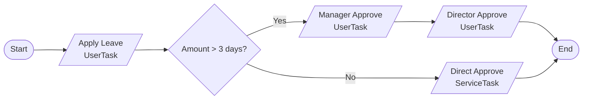

# BPMN 2.0 Workflows

Design, deploy, and manage business process workflows with AuraBoot's built-in BPM engine. Based on SmartEngine 3.7.0, the workflow system supports both human approval flows and automated orchestration pipelines.

## Goal

By the end of this guide you will be able to create a multi-level leave approval workflow with exclusive gateways, deploy it, and process tasks through the Task Center.

## Prerequisites

- AuraBoot running with the BPM module enabled
- Admin account access
- At least one model with a status field (e.g., a leave request model)

## Architecture Overview

AuraBoot's BPM system provides two parallel APIs:

```
+---------------------------+    +-------------------------------+
|    Approval API           |    |    Orchestration API          |
|    (Human workflows)      |    |    (Automated pipelines)      |
|                           |    |                               |
|  - TaskService            |    |  - ProcessOrchestrationService|
|  - AssigneeResolver       |    |  - ExecutionLogService        |
|  - SLA monitoring         |    |  - TriggerService             |
+-------------+-------------+    +---------------+---------------+
              |                                  |
              v                                  v
+-------------------------------------------------------------+
|              SmartEngine 3.7.0 (BPMN 2.0 Core)              |
|              PostgreSQL storage (DATABASE mode)               |
+-------------------------------------------------------------+
```

| API | Use Case | Examples |
|-----|----------|---------|
| **Approval** | Human decision workflows | Leave requests, expense reports, contract approvals |
| **Orchestration** | Automated process execution | Data pipelines, integration flows, scheduled jobs |

## Key Concepts

| Concept | Description |
|---------|-------------|
| **Process Definition** | A BPMN 2.0 template (XML + designer JSON) |
| **Process Instance** | A running execution of a definition |
| **Task** | A work item assigned to a user (UserTask) or system (ServiceTask) |
| **Gateway** | Decision point: Exclusive (XOR), Parallel (AND), Inclusive (OR) |
| **SLA Config** | Deadline monitoring with warning levels and escalation |

## BPMN Node Types

The BPMN Designer supports 9 node types:

| Node | Icon | Description |
|------|------|-------------|
| **StartEvent** | Circle | Entry point of every process |
| **EndEvent** | Bold circle | Terminal point |
| **UserTask** | Person icon | Requires human action (approval, form submission) |
| **ServiceTask** | Gear icon | Automated action (API call, data update) |
| **ReceiveTask** | Envelope | Waits for external callback |
| **CallActivity** | Subprocess | Calls another process definition |
| **ExclusiveGateway** | Diamond (X) | Routes to exactly one branch based on condition |
| **ParallelGateway** | Diamond (+) | Splits into parallel branches, joins when all complete |
| **InclusiveGateway** | Diamond (O) | Routes to one or more branches based on conditions |

## Step-by-Step: Create a Leave Approval Workflow

### 1. Open the BPMN Designer

Navigate to **BPM > Process Management** in the sidebar (`/bpm/process-management`).

Click **Create Process** to open the BPMN Designer.

### 2. Design the Process

Build the following flow:



**Drag nodes from the palette:**

1. Add a **StartEvent**
2. Add a **UserTask** named "Apply Leave"
3. Add an **ExclusiveGateway**
4. Add a **UserTask** named "Manager Approve" on the Yes branch
5. Add a **ServiceTask** named "Direct Approve" on the No branch
6. Add a **UserTask** named "Director Approve" after Manager Approve
7. Add an **EndEvent**
8. Connect the nodes with edges

### 3. Configure Gateway Conditions

Click the edge from the ExclusiveGateway to "Manager Approve" and set the condition:

```
${days > 3}
```

Click the edge to "Direct Approve" and set it as the **default** branch.

### 4. Configure User Task Assignees

Click each UserTask and configure the assignee in the Property Panel:

**Apply Leave:**

```json
{
  "assigneeRules": [
    { "ruleType": "STARTER", "description": "Process initiator" }
  ]
}
```

**Manager Approve:**

```json
{
  "assigneeRules": [
    { "ruleType": "STARTER_MANAGER", "description": "Initiator's direct manager" }
  ]
}
```

**Director Approve:**

```json
{
  "assigneeRules": [
    { "ruleType": "ROLE", "roleCode": "director", "description": "Any user with Director role" }
  ]
}
```

#### Assignee Resolution Rules

| Rule Type | Description |
|-----------|-------------|
| `SPECIFIC_USER` | Hardcoded user ID list |
| `ROLE` | All users with a specific role |
| `DEPARTMENT` | All users in a department |
| `STARTER` | The person who started the process |
| `STARTER_MANAGER` | The starter's direct manager |
| `PREVIOUS_HANDLER` | The person who completed the previous task |
| `EXPRESSION` | SpEL expression (e.g., `${record.owner}`) |

### 5. Configure Form Bindings

Bind DSL forms to each UserTask so users see the right form when processing tasks:

```json
{
  "formBindings": {
    "apply_leave": {
      "formId": "thr_leave_request_form",
      "mode": "edit"
    },
    "manager_approve": {
      "formId": "thr_leave_request_form",
      "mode": "readonly"
    },
    "director_approve": {
      "formId": "thr_leave_request_form",
      "mode": "readonly"
    }
  }
}
```

Form modes:
- `edit` -- User can modify fields
- `readonly` -- User can only view fields
- `hidden` -- Form is not shown

### 6. Save and Deploy

1. Click **Save** to save the process definition (status: `draft`)
2. Click **Deploy** to deploy it to SmartEngine (status: `deployed`)

```
POST /api/bpm/process-definitions/{pid}/deploy
```

The deploy action automatically converts the designer JSON to BPMN 2.0 XML.

**Process Definition Lifecycle:**

```
draft --> deployed --> suspended --> deployed
  |          |                         |
  |          +-----> archived <--------+
  +-> (delete)
```

### 7. Start a Process Instance

Start the process programmatically or from the workbench:

```json
POST /api/bpm/process-instances
{
  "processDefinitionKey": "leave_approval",
  "businessKey": "LV-20260411-001",
  "variables": {
    "applicant": "john@example.com",
    "days": 5,
    "reason": "Annual leave",
    "leaveType": "annual"
  }
}
```

Or integrate with a DSL Command to start the process when a record status changes:

```json
{
  "commandCode": "thr:submit_leave_request",
  "handlers": [
    {
      "type": "StartApprovalFlowHandler",
      "config": {
        "processKey": "leave_approval",
        "amountField": "thr_days"
      }
    }
  ]
}
```

### 8. Process Tasks

Users see their pending tasks in the **Task Center** (`/bpm/task-center`).

**Task Actions:**

| Action | API | Description |
|--------|-----|-------------|
| Approve | `POST /api/bpm/tasks/{taskId}/approve` | Approve with optional comment |
| Reject | `POST /api/bpm/tasks/{taskId}/reject` | Reject with reason |
| Transfer | `POST /api/bpm/tasks/{taskId}/transfer` | Reassign to another user |
| Delegate | `POST /api/bpm/tasks/{taskId}/delegate` | Delegate while retaining ownership |
| Rollback | `POST /api/bpm/tasks/{taskId}/rollback` | Return to a previous node |
| Claim | `POST /api/bpm/tasks/{taskId}/claim` | Claim a group task |
| Add Sign | `POST /api/bpm/tasks/{taskId}/add-sign` | Add co-approver (countersign) |

**Approve a task:**

```json
POST /api/bpm/tasks/{taskId}/approve
{
  "comment": "Approved. Enjoy your vacation.",
  "variables": { "approved": true }
}
```

### 9. Monitor with SLA

Configure SLA monitoring to track deadlines and escalate overdue tasks:

```json
{
  "targetType": "TASK",
  "targetKey": "manager_approve",
  "deadlineMode": "FIXED",
  "deadlineValue": "PT24H",
  "warningRules": [
    { "level": 1, "beforeDeadline": "PT4H", "action": "NOTIFY" },
    { "level": 2, "beforeDeadline": "PT1H", "action": "ESCALATE" }
  ],
  "suspendPolicy": "PAUSE"
}
```

Access the SLA Monitor at `/bpm/sla-monitor`.

## Complete Example: Leave Approval Process Definition

```json
{
  "processKey": "leave_approval",
  "processName": "Leave Approval",
  "description": "Multi-level leave approval with gateway routing",
  "category": "HR",
  "formBindings": {
    "apply_leave": { "formId": "thr_leave_request_form", "mode": "edit" },
    "manager_approve": { "formId": "thr_leave_request_form", "mode": "readonly" },
    "director_approve": { "formId": "thr_leave_request_form", "mode": "readonly" }
  },
  "extension": {
    "executionMode": "DATABASE",
    "designerJson": "..."
  }
}
```

## Process Variables and Expressions

Process variables are key-value pairs passed when starting a process or completing a task. They drive gateway conditions and task assignment.

**Setting variables at start:**

```json
{
  "variables": {
    "applicant": "john@example.com",
    "days": 5,
    "amount": 15000,
    "department": "Engineering"
  }
}
```

**Using variables in gateway conditions:**

```
${days > 3}
${amount > 10000 && department == 'Finance'}
${applicant != 'admin@example.com'}
```

**Using variables in assignee expressions:**

```
${record.owner}
${variables.reviewer}
```

## Workbench API

The BPM Workbench provides a unified view of all workflow activity:

```json
GET /api/bpm/workbench
```

Response:

```json
{
  "todoTasks": [...],
  "completedTasks": [...],
  "startedProcesses": [...],
  "todoCount": 5,
  "completedCount": 23,
  "startedCount": 8
}
```

## Orchestration (Automated Processes)

For automated pipelines without human tasks, use the Orchestration API:

```json
POST /api/bpm/orchestration/executions
{
  "processKey": "data_pipeline",
  "businessKey": "batch_20260411",
  "payload": {
    "source": "s3://data/input.csv",
    "target": "postgres://warehouse/sales"
  }
}
```

Monitor execution with the timeline endpoint:

```
GET /api/bpm/orchestration/executions/{id}/timeline
```

Orchestration supports node-level retry and skip for failure recovery:

```
POST /api/bpm/orchestration/executions/{id}/retry/{nodeId}
POST /api/bpm/orchestration/executions/{id}/skip/{nodeId}
```

## Troubleshooting

| Problem | Cause | Fix |
|---------|-------|-----|
| Deploy fails | BPMN XML validation error | Check designer JSON for disconnected nodes |
| Task not assigned | Missing assignee rule | Configure `assigneeRules` on the UserTask node |
| Gateway always takes default | Condition expression error | Verify variable names match (`${days}` not `${day}`) |
| Process stuck at ServiceTask | External callback not received | Check ReceiveTask callback endpoint or use retry |
| SLA not triggering | SLA config not enabled | Verify `enabled: true` and deadline mode is correct |
| 403 on task endpoint | Missing BPM permission | Ensure user has `bpm.task.complete` permission |

## Next Steps

- [Automation Rules](automation-rules.md) -- For lightweight event-driven automation without BPMN
- [Page Designer](page-designer.md) -- Build approval forms and task list pages
- [AI Copilot](ai-copilot.md) -- Use AuraBot to query workflow status
