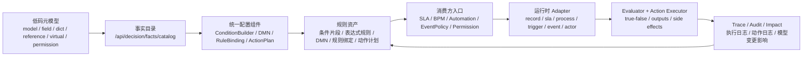

# Rule Center 与低码元模型打通现状和 Gap

> **2026-07-24 对照代码校准（只改可证伪的事实错误，不改历史结论、gap 状态与设计意图）**
>
> 本轮把本文引用的**类名 / 组件名 / 测试 FQCN / 前端路径 / API 路径 / `ab_*` 表名与列名**逐条与 OSS `platform`、`web-admin`、`plugins` 及 Flyway snapshot 对照，结论是**绝大多数仍然成立**（两篇合计 136 个类/组件名、本文 42 条前端路径、本文 54 个后端测试 FQCN、19 个 `ab_*` 表名、全部 `/api/decision/*` 端点均实测存在）。已修正的事实错误与仍需注意的点：
>
> - `FactCatalogAdapter` 仓内没有同名 class，真源是模块 `web-admin/app/shared/decision/ui/factCatalogAdapter.ts`（导出 `factCatalogToFieldOptions` 等函数）；已在 §「前端规则绑定字段 picker」定义处标注，本文其余处沿用旧称。
> - `ab_bpm_execution_log.node_failure` 写法会被误读成列名；`node_failure` 实际是 `event_type` 列的取值（`BpmExecutionLogMapper` `.eq("event_type","node_failure")`），已就地更正。
> - `scripts/check-schema-sql.sh` 在 2026-07-19 那轮真实存在，但**已于 2026-07-23 随手写 `schema.sql` 镜像一起退役**（OSS commit `6f9a3410a`）。历史行保留；今天复跑等价检查请用 `scripts/db/flyway-migrate.sh` / `flyway-validate.sh` / `check-schema-drift.sh` / `check-db-matches-snapshot.sh`。
> - **截图证据可用性**：本文引用 `assets/` 下 **93** 个截图，其中 **67 个在仓库里不存在**（全部是 `.png`）。这些行只能当作「当时确实看过截图」的叙述，**不能当作可回看的证据**；要把某行推进为 `DONE` 必须重新产出并提交截图。
>   **根因不是谁忘了提交，是 `.gitignore` 的 `*.png` 把它们静默吞了**：`git add` 不报错、不提示，引用就此悬空。证据是两篇合计 147 个悬空引用**全部是 `.png`、一个 `.jpg` 都没有**——因为 `.jpg` 从来不在忽略规则里。已于 2026-07-24 加 `!docs/**/assets/*.png` 反忽略修掉；此后新截图正常入库，历史丢失的无法找回。
> - **截图证据可用性**：本文引用 `docs/system-reference/assets/` 下 93 个截图，其中 **67 个从未提交进仓库**（`git log --all -- <path>` 无记录，目录当前只有 54 个文件）；`live-scan-20260707/**` 同样从未入库。这些行只能当作「当时看过」的叙述，**不是可回看的证据**；要把对应 gap 行推进为 `DONE`，必须重新产出并提交截图。
> - 平台 SmartEngine 依赖当前为 **4.0.2**（`platform/build.gradle:317,321`）。
> - 本文 Gap 1-15 全部处于 `PARTIAL` / `PARTIAL+`，本轮逐条抽查未发现「标为缺口但其实已实现」的条目；`/api/decision/facts/catalog` 返回的 `dictCode / allowedValues / reference / sourceType / sourceRef / operators / visible / editable / masked / permission` 字段集与 Gap 1 描述一致（`DecisionFactDTO` / `DecisionFactEntityDTO`）。

## 文档定位

这份文档是规则中心后续开发的单一 gap tracker，覆盖本会话连续暴露的所有问题：中文环境下页面不像产品、菜单和入口混乱、旧 mockup 与当前实现脱节、规则条件配置入口不清楚、条件片段复用不明显、SLA / BPM / Automation / EventPolicy / Permission 与规则中心联动不完整、动作类型扩展后体验仍不统一，以及低码元模型 `model / field / dict / virtual model` 与规则运行时的事实目录尚未完全闭环。

本文是可独立阅读的完整需求和 gap 文档，不要求读者再回溯本会话、旧 session、旧 mockup 或其它临时计划才能理解后续要做什么。后续如果发现本文与旧 mockup、旧页面截图、旧 handover 或旧测试断言冲突，以本文为当前权威口径；若代码或产品真实状态继续演进，必须同步更新本文，而不是新增另一份同名 gap 文档。

本文不再只讨论“字段 picker 是否能显示低码字段”。规则中心的终局必须同时回答四个问题：

- 业务用户从 SLA、BPM、Automation、权限、事件策略进入时，在哪里配置规则条件和动作。
- 这些条件如何复用为共享片段、DMN 决策表、规则绑定和动作输出。
- 每个字段、字典值、虚拟模型值、引用字段、权限字段是否来自低码元模型事实目录，并能被运行时真实取值。
- 每次保存、发布、测试运行、执行日志、影响分析是否能证明“UI 选到的东西就是后端实际执行的东西”。

## 2026-07-19 Endgame 合并矩阵收口

本轮关闭的是当前分支的 Rule Center / Strategy Studio / SLA / BPM / Automation / Permission 合并验证目标：规则条件、条件片段、DMN 字典值、低码申请人引用字段、SLA timeout actions、BPM/Automation 设计器绑定、Permission ABAC 审计和 DecisionOps Trace 能在同一 fresh runtime 中并发跑通。范围不扩大到真实外部 provider live matrix、未来所有权限失败态或所有历史页面的全量视觉重做。

代码修复：

- `StrategyStudioWorkbench` 在保存 DMN 草稿前把编辑器 table 规范化为 runtime `expr` 结构，保留 output contract；保存条件片段时支持已有 draft fallback，不再因重复 draft 直接 422。
- Strategy Studio 五个消费场景统一暴露 `record.data.wd_req_applicant` 和 `record.data.wd_req_type`，并让规则条件、DMN 输入、条件片段和测试上下文都使用低码事实目录语义。
- 修复两个真实竞态：自动加载的历史条件片段不能覆盖当前场景的默认 `decisionCode`；用户开始编辑 DMN 后，晚返回的 `listVersions` restore 不能覆盖本地草稿。
- `DecisionTableEditor` 与后端 `DecisionTableJson` 均保证手动选择字段时 editor 字段优先于 stale runtime `expr`。
- 条件片段库使用 live decision definition metadata 展示动态决策标签；v2 impact-ack 用动态创建的 SLA consumer 取证，避免依赖含糊 seed 文案。
- SLA 与 Permission 之间新增 field-permission 文件锁和模型缓存刷新，避免一个 E2E 改了 `wd_leave_request` 字段权限后污染另一个 E2E 的请假单创建链路。
- Permission audit 只展示 public record pid 和脱敏 trace id；Rule Center 失败 evidence 从嵌套 `ruleCenterFailures[]` 提取统一 Trace、字段引用和 DMN 输出。

最终验证证据：

| 层级 | 命令 / 矩阵 | 结果 |
|---|---|---|
| Playwright focused 修复集 | `strategy-studio-dmn-value-labels.spec.ts` 两个失败用例分别重跑；`condition-fragment-library-golden.spec.ts`、`sla-rule-center-binding.spec.ts` focused 组合重跑 | focused 全绿 |
| Playwright 合并矩阵 | `playwright.gt5.config.ts` 下 11 个 spec：`rule-center-main-entry-ux-smoke`、`strategy-studio-dmn-value-labels`、`condition-fragment-library-golden`、`dmn-export-artifact`、`decisionops-virtual-source-trace`、`decisionops-field-impact-preflight`、`decisionops-full-golden`、Automation/BPM rule-binding designer、SLA rule-center binding、Permission ABAC | `57 passed (3.0m)` |
| Vitest | `DecisionOpsConsole`、`DecisionTableEditor`、`DecisionRuleBindingBlock`、`ConditionFragmentLibraryBlock`、`PermissionAuditTab` | `5 files / 105 tests passed` |
| TypeScript | `web-admin && pnpm exec tsc --noEmit --pretty false --incremental false` | passed |
| 后端 | `./gradlew -p platform :test --tests com.auraboot.framework.decision.service.impl.DecisionTableDmnXmlServiceImplTest` | BUILD SUCCESSFUL，6/6 passed |
| e2e-truth / feature coverage | 扫描 touched E2E 的 `skip/fixme/.only/waitForTimeout/retries/PUT/PATCH/page.goto/threshold` | 未命中 skip/fixme/.only/waitForTimeout/retries/PUT/PATCH 兜底；命中的阈值为像素容差或真实影响数量下限；权限页 `goto('/enterprise/permissions')` 是被测权限模块自身入口，后续仍通过页面交互打开审计 Tab |

本轮试错归因：

- `Strategy Studio reuses user reference conditions...` 首轮红灯不是 seed 丢失，而是自动加载旧片段后用 `decisionRefs[0]` 覆盖场景决策，导致测试等错决策版本响应；产品修复后同一用例 17/17 passed。
- `Strategy Studio DMN round-trip preserves fact catalog valueLabels` 红灯不是 fact catalog 缺字段，而是用户点击字段后晚到的 `listVersions` restore 把 DMN 表格恢复成旧 `Leave days`；产品新增 dirty guard 后单用例 17/17 passed，合并矩阵 57/57 passed。
- 第二轮矩阵中 `SLA` 尾部动作套件持续通过，证明 fieldPermission 锁和模型缓存刷新没有再污染 SLA 创建链路。
- 扩展矩阵没有用直接 API PUT/PATCH 去替代 UI 保存；API 只用于 fixture、后端取证或命令式业务数据准备。

本轮范围内结论：规则中心主入口、Strategy Studio、条件片段库、DMN valueLabels、SLA/BPM/Automation/Permission 原生消费方和统一 Trace 的回归网已经在同一 fresh runtime 通过。后续产品增强仍按 backlog 继续推进，但不能再把本轮已经修复的两个竞态、field-permission 污染、动态决策标签或 draft fallback 作为未关闭问题重复打开。

## 2026-07-19 Reference / DecisionOps Trace 收口更新

本轮关闭的是“低码业务引用字段作为规则事实”这一条纵深链路，以及 DecisionOps 静态入口的执行日志 UX 断点。它把 `model / field / refTarget / dynamic record / decision evaluator / traceSnapshot.factMetadata / DecisionOps Trace UI` 串成一条可测试链路。随后继续补上 `wd_leave_request.wd_req_applicant` 在 Strategy Studio 五入口 fact catalog 一致性、SLA 原生配置页 runtime Trace，以及 Automation 原生测试运行 runtime Trace 的 focused evidence：新发布申请人规则能在 SLA 配置页被选择、映射、测试运行、保存和从 DecisionOps Trace 回链；Automation 能把 `modelCode=wd_leave_request` 和 `wd_req_applicant` 输入传入统一 Rule Binding / Decision Runtime，执行日志展示申请人 fact metadata 和 Automation 设计器回链。

本轮追加关闭 BPM 真实运行态中的申请人引用字段规则分派 focused slice：BPM userTask 通过 Rule Binding 调用 Decision Table，输入来自 `record.data.wd_req_applicant`，输出 `candidateUserIds=<当前 BPM actor pid>` 后能创建当前用户可见待办；流程状态页的 Rule Trace 可打开统一 DecisionOps 执行日志，DecisionOps Trace 抽屉能反向打开 `/bpm/process-status?processInstanceId=...`。试错中确认 BPM assignee 契约使用用户 PID，而部分 action target 仍使用 numeric user id，因此测试夹具显式拆分 `currentBpmActorId` 与 `currentUserId`。同时补齐 `traceSnapshot.outputMetadata` per-run 快照，使执行日志输出列显示“候选审批人”等业务标签，而不是只显示 raw `candidateUserIds`。该切片不把规则中心所有历史 `PARTIAL` 项改成全量完成。

2026-07-19 继续补 Permission replay 到统一 Trace 的 focused 链路：模型发布治理执行 `PERMISSION_POLICY` replay 后，后端从 `PermissionResult.steps[].details.ruleTraceId` 提取统一执行日志 trace id，写入 replay `result.traceId` 和 outputs.`ruleTraceId`；模型详情发布治理报告在权限 replay 结果卡片上显示“打开统一 Trace”，链接到 `/p/decisionops_execution_logs?traceId=<ruleTraceId>&callerType=PERMISSION&callerRef=<permissionCode>`。这关闭的是“模型发布复核报告能直接进入 DecisionOps 统一 Trace”的断点，不等价于更广权限失败态、跨消费方 replay 或三处 Trace 全矩阵全部完成。

2026-07-19 追加 Permission replay Trace 点击级闭环：之前 `RC-MODEL-01` 只断言报告里的 href 正确，未真正点击进入 DecisionOps。fresh runtime `rc-model-perm-trace-click-109` 本轮把权限拒绝 replay 的“打开统一 Trace”中键打开为新页，断言 URL 参数 `traceId/callerType=PERMISSION/callerRef=<permissionCode>`、执行日志行、Trace 抽屉、调用方和“打开权限审计”反链全部指向同一运行记录；截图 `docs/system-reference/assets/model-publish-permission-trace-click-decisionops-20260719.png`。试错暴露两点：一是 replay 报告区只保留最近一次消费方结果，Permission 链接验证必须紧跟 Permission replay，不能等 SLA/BPM replay 覆盖报告后再找链接；二是中键新页会先触发 `about:blank`，测试必须等 URL 进入 `/p/decisionops_execution_logs` 后再断言。产品修复同步补上 `ExecutionLogTraceBlock.permissionResourceCode` 对 `model.<resource>.<action>` / `function.<resource>.<action>` 命名空间权限码的解析，否则权限审计反链会误带 `resourceCode=model.<resource>`。

2026-07-19 追加 `RC-UX-01` 主入口 focused UX 矩阵：fresh runtime `rc-main-entry-ux-110` (`Backend=6510`, `Vite=5210`, `BFF=6210`, `DB=auraboot_110`) 下新增 `rule-center-main-entry-ux-smoke.spec.ts`，覆盖 `/decision-ops`、`/p/decisionops_definitions`、`/p/decisionops_tables`、`/p/decisionops_condition_fragments`、`/p/decisionops_event_policies`、`/p/decisionops_execution_logs`、`/p/sla_config`、`/bpm/sla-monitor`、`/p/bpm_process_management` 九个规则中心主入口和消费方入口，在 1280px desktop 与 632px compact 两档视口下断言侧边栏入口存在、关键 block/表格可见、中文环境无 fatal/Oops/raw i18n key、无全页横向滚动，并截图归档 `rule-center-main-entry-*-20260719.png` 共 18 张。首跑暴露的是测试预期绑错实现版本：`/p/decisionops_definitions` 当前是产品化 DSL 列表页而不是旧 `DecisionDefinitionListPage` block；截图显示页面中文、无错误，修正测试为标题/表格/列名断言。该切片是主入口 loadability/UX smoke，关闭“主入口是否可打开、compact 是否不可用、明显 fatal/raw fallback 是否复发”的 focused 回归网，不等价于业务配置流程、全局 shell 所有页面、所有浮层或所有就地编辑任务 UX 已全量清零。

2026-07-19 追加 `RC-UX-01` compact shell 侧栏 focused 证据：fresh runtime `rc-shell-sidebar-ux-111` (`Backend=6511`, `Vite=5211`, `BFF=6211`, `DB=auraboot_111`) 下把 `rule-center-main-entry-ux-smoke.spec.ts` 扩展为两条 chromium 用例，新增 632px 打开全局侧栏、断言 hamburger `aria-expanded`、移动端遮罩、侧栏进入视口、规则中心 9 个入口逐个可见/可滚动、点击“策略工作台”真实进入 `/decision-ops`，并断言页面无横向滚动；截图 `rule-center-shell-sidebar-compact-20260719.png`。产品代码同步补 `Header` 的 `aria-controls/aria-expanded/aria-label/data-testid`、`LeftSidebar#app-sidebar` 和移动遮罩 `data-testid`，让 shell 侧栏有稳定可测的 accessibility contract。该切片关闭“compact 下全局侧栏能否打开并发现规则中心入口”的 focused gap；仍不等价于所有浮层、所有就地编辑任务或所有宽度档 shell 回归清零。

2026-07-19 追加 fresh main 核心浏览器矩阵补测：用户恢复测试后，在最新 `main@dc5babd29` 上新起 `rc-endgame-main-112` fresh runtime（`Backend=6512`, `Vite=5212`, `BFF=6212`, `DB=auraboot_112`, demo plugin import OK, warm OK），一次性串行跑规则中心核心矩阵 9 个 spec / 54 条 chromium 用例。首轮结果 `53 passed / 1 failed`，唯一红灯是 `automation/rule-binding-designer-host.spec.ts` 的 Automation 菜单入口 helper：页面里 `/automations` 菜单链接真实存在，但 helper 使用 `a[href="/automations"].or(getByRole("自动化")).first()`，DOM 顺序/滚动状态变化时可能没有点击精确 href 链接，导致 URL 停在 `/home`。本轮修复为只定位 `nav a[href="/automations"]`，显式 `scrollIntoViewIfNeeded()`，并用 `page.waitForURL(/\/automations/)` 包住真实菜单点击；没有用 `page.goto('/automations')` 兜底。随后 targeted 用例 1/1 passed、Automation full 4/4 passed，最后同一 fresh runtime 上核心矩阵重跑 `54 passed (5.9m)`。e2e-truth 静态扫描未命中 skip/fixme/only、waitForTimeout、retries 或业务页面直达；唯一 PUT 命中是 `model-publish-governance.spec.ts` 的 `putApi` setup helper，用于准备真实 RolePermission policy 夹具，不替代模型发布治理 UI、replay 报告或 Trace 链路。试图删除该 helper 时，`tsc` 和 model governance 立即红灯，复原后 `tsc` passed、model governance 3/3 passed。本轮刷新截图 `event-policy-applicant-reference-trace-fact-metadata-20260719.png` 与 `permission-applicant-reference-trace-fact-metadata-20260719.png`，均显示中文 Trace 抽屉里的申请人 fact metadata。该结果证明当前核心浏览器矩阵在 fresh runtime 上是绿的，但仍不把规则资产/消费方详情/执行日志三处 Trace 全矩阵、真实外部 provider live matrix、Permission 更广失败态或全部 UX 浮层/就地编辑矩阵伪装成完成。

2026-07-19 同一 fresh runtime 继续补跑 54 条核心矩阵之外的 DecisionOps 扩展 focused specs：`condition-fragment-library-golden.spec.ts`、`dmn-export-artifact.spec.ts`、`decisionops-virtual-source-trace.spec.ts`、`decisionops-field-impact-preflight.spec.ts`、`decisionops-full-golden.spec.ts`。首轮 `3 passed / 2 failed`：Field Impact 红灯不是产品 preflight 失败，而是测试把 `process.nodeId` 当前类型和影响数量写死为旧 seed 的 `string / 1 个决策版本`；同一 DB 被前序规则测试扩展后，真实页面显示 `currentType=object` 且影响 `6 个决策版本`。修复为从页面实际 hydrated `currentDataType` 和风险摘要读取合同，并把同一值用于后续 preflight request 和阻断/确认文案断言。`decisionops-full-golden` 首轮把当前 canonical `/decision-ops` 策略工作台菜单误判为 legacy link，又在新 worktree `--no-deps` 单跑时依赖不存在的 `tests/storage/admin.json`，随后还暴露 UI Trace 已按 `traceSnapshot.outputMetadata` 显示 `Deadline minutes / 严重程度 / Notification template`，旧断言仍要求 raw `deadlineMinutes / severity / notificationTemplate`。本轮修复为允许 canonical `/decision-ops`，让 spec 自带空 storageState 后走真实 UI 登录，并把执行日志 UI 断言改为 label/value，同时保留 API `outputSnapshot` raw key 断言。复跑两个失败 spec 后 `field-impact-preflight` 1/1 passed、`decisionops-full-golden` 1/1 passed；最终扩展 5 spec 组合 `5 passed (35.1s)`，`pnpm exec tsc --noEmit --pretty false --incremental false` passed。e2e-truth 边界：当时扩展 5 spec 静态扫描未命中 skip/fixme/only、waitForTimeout、retries 或 PUT/PATCH 兜底，但 `decisionops-full-golden.spec.ts` 仍有 4 个历史直达 `/p/...`/`/decision-ops` 跳转，因此这一次只能作为扩展诊断矩阵转绿；这些直达跳转已在后续切片继续收敛。

同日继续收敛 `decisionops-full-golden.spec.ts` 的测试入口真实性：把事件策略列表、决策表工作台、策略工作台和 390px mobile 决策表入口从直接 `page.goto('/p/...')` 改成统一 sidebar helper，helper 会从 `/home` 开始、清理 collapsed 状态、在 compact 视口下真实点击 `header-sidebar-toggle`，用 `sidebar` 坐标确认侧栏进入视口后再点击菜单链接。首轮 mobile 红灯暴露 helper 误用了旧 testid `app-sidebar-toggle/app-sidebar`，实际产品合同是 `header-sidebar-toggle/sidebar`；修正后 `decisionops-full-golden` 1/1 passed，扩展 5 spec 组合 `5 passed (39.1s)`，`pnpm exec tsc --noEmit --pretty false --incremental false` passed。e2e-truth 当时保留边界：该 spec 还有动态详情页、执行日志 deep link、Field Impact deep link、连接器/Webhook/rollout deep link；后续切片继续关闭这些主流程绕过，本轮只关闭用户可直接从菜单进入的静态主入口绕过问题。

最终在 canonical `main@fde0313e9` 上复跑核心 + 扩展合并矩阵：同一 `rc-endgame-main-112` fresh runtime（`Backend=6512`, `Vite=5212`, `BFF=6212`, `DB=auraboot_112`）串行运行 14 个 Rule Center / DecisionOps / SLA / BPM / Automation / Permission / Model specs，共 `59 passed (6.6m)`。矩阵包含原核心 54 条以及条件片段库、DMN 导出、虚拟源 Trace、Field Impact preflight、DecisionOps full-golden 扩展 5 条，验证当前 main 的测试文件与 runtime 组合一致可跑通。该证据把“当前核心 + 扩展 focused 回归网”推进到绿色，但不改变下方 `PARTIAL/PARTIAL+` 状态边界：动态详情 deep link 的严格菜单化、规则资产/消费方详情/执行日志三处 Trace 全矩阵、真实外部 provider live matrix、Permission 更广失败态、BPM 更多节点/输出/失败态、以及所有 UX 浮层/就地编辑宽度矩阵仍需后续切片继续关闭。

2026-07-19 继续补 `RC-FRAG-01` 条件片段跨消费方影响面浏览器证据：同一 `rc-endgame-main-112` fresh runtime 下，`condition-fragment-library-golden.spec.ts` 新增从真实侧边栏进入“规则中心 → 条件片段库”，搜索 `shared_leave_approval_guard`，并用页面 + `/api/decision/condition-fragments/shared_leave_approval_guard/impact` 成对断言该 workflow-demo 共享片段被 SLA、BPM、Automation、EventPolicy、Permission 五类消费方复用。API 证据覆盖 `SLA_RULE / RULE_BINDING`（主管审批 SLA、HR 审批 SLA）、`BPM_PROCESS / DESIGNER_NODE`（请假审批）、`AUTOMATION / RULE_BINDING`（长假申请提醒）、`EVENT_POLICY / VERSION_RULES`（请假事件动作策略）、`PERMISSION_POLICY / ROLE_PERMISSION_CONDITION`（审批请假申请）；UI 证据覆盖“被哪些链路复用”面板的五类中文 badge 和对应链接 href。截图归档 `docs/system-reference/assets/condition-fragment-shared-guard-cross-consumer-impact-20260719.png`。验证：focused 1/1 passed、条件片段库 full 2/2 passed、DecisionOps 扩展矩阵 5 specs / 6 tests passed、`pnpm exec tsc --noEmit --pretty false --incremental false` passed；静态 e2e-truth 扫描未命中 `skip/fixme/only`、`waitForTimeout`、`retries`、PUT/PATCH、阈值或业务 `/p/*` 直达。该切片关闭的是“共享条件片段影响面在浏览器中能看见并能指向五类消费方”的 focused gap；仍不等价于跨消费方真实运行黄金、规则资产/消费方详情/执行日志三处 Trace 点击矩阵或动态详情 deep link 全部完成。

同日 PR #1381 合入后，在 canonical `main@ac5492b1d` 上继续复跑核心 + 扩展合并矩阵：同一 `rc-endgame-main-112` fresh runtime 串行运行 14 个 Rule Center / DecisionOps / SLA / BPM / Automation / Permission / Model specs，共 `60 passed (6.8m)`。相比上一次 `59/59`，新增的一条是条件片段库 `shared_leave_approval_guard` 跨 SLA/BPM/Automation/EventPolicy/Permission 五类消费方影响面浏览器用例。这个结果证明当前 main 的核心 + 扩展 focused 回归网仍然整体为绿，但状态边界不变：真实外部 provider live matrix、动态详情 deep link 严格菜单化、跨消费方运行黄金、三处 Trace 点击矩阵、Permission 更广失败态、BPM 更多节点/输出/失败态和全量 UX 浮层/就地编辑矩阵仍继续保留在 `PARTIAL/PARTIAL+`。

2026-07-19 继续收敛 `decisionops-full-golden.spec.ts` 的动态入口真实性：决策定义详情页不再直接 `page.goto('/p/decisionops_definitions/view/...')`，而是从侧边栏进入“决策定义”列表，定位刚创建的 `decisionCode` 行，点击真实 `row-action-detail` 进入详情；灰度 rollout 页也不再直接打开 `/p/decisionops_rollouts?decisionCode=...`，改为回到同一决策定义列表后点击该行真实 `row-action-rollout`；事件策略 copy 从执行日志返回设计器前也从直接 goto 改为浏览器历史 `goBack()` 回到刚才的策略详情。验证：`decisionops-full-golden` focused 1/1 passed、DecisionOps 扩展矩阵 5 specs / 6 tests passed、`pnpm exec tsc --noEmit --pretty false --incremental false` passed；静态扫描显示该 spec 已无 skip/fixme/only、waitForTimeout、retry、PUT/PATCH、阈值或新增业务 `/p/*` 兜底。当时剩余直达路由收敛到 4 个受控深链：执行日志 `traceId`、Field Impact、Connector impact、Webhook impact；这些已由下一段继续关闭。

同日继续关闭 `decisionops-full-golden.spec.ts` 最后 4 个业务深链：`DecisionDefinitionActionsBlock` 在决策定义详情页新增“执行日志”按钮，按 `decisionCode` 进入 `/p/decisionops_execution_logs`，用户不再需要知道某次评估的 `traceId` URL；执行日志、字段影响、连接器详情、Webhook 治理详情均改为真实产品入口：侧边栏进入对应菜单，列表中定位刚创建或命中的行，再点击 `row-action-detail/impact` 进入目标页。390px mobile 决策表入口同时修正 helper：compact shell 可能同时存在离屏导航实例和视口内导航实例，测试必须按 link bounding box 选择真正进入视口的菜单项，而不是取 DOM 顺序第一个。验证在当前 worktree 独立前端 `Vite=5215/BFF=6215`、复用 `rc-endgame-main-112` 后端 `6512` 和 DB `auraboot_112` 下完成：`DecisionDefinitionActionsBlock.test.tsx` 8/8 passed，`decisionops-full-golden` focused `--project=chromium --no-deps` 1/1 passed，DecisionOps 扩展矩阵 5 specs / 6 chromium tests + setup/auth 共 `22 passed (34.3s)`，`pnpm exec tsc --noEmit --pretty false --incremental false` passed，`git diff --check` passed。静态 e2e-truth 扫描 touched spec 未命中 `skip/fixme/only`、`waitForTimeout`、`retries`、PUT/PATCH、阈值；主流程只保留 `/home` 作为真实菜单起点，匿名鉴权负例仍直接请求受保护页验证 login redirect。该切片关闭的是 `decisionops-full-golden` 主流程最后的业务 deep link 绕过问题；不代表真实外部 provider live matrix、三处 Trace 点击全矩阵、Permission 更广失败态、BPM 更多节点/输出/失败态或全量 UX 浮层/就地编辑矩阵已经完成。

| 项目 | 本轮结论 | 证据 |
|---|---|---|
| 低码 reference 字段元数据 | `FieldDefinition.RefTarget` 补齐 `targetTable / valueField / targetField`，`MetaModelServiceImpl` 回传 canonical refTarget；`DynamicDataServiceImpl.getFieldOptions` 优先读取 canonical refTarget，兼容 `extraProps/extension.refTarget`，业务引用字段的下拉 option 来自真实目标模型和目标表 | 后端集成 `DecisionRuntimeIntegrationTest.evaluate_persistsFactMetadataSnapshotForBusinessReferenceModelFields` passed；浏览器 golden 会先创建 supplier/ticket 两个低码模型并调用 `/api/dynamic/<ticket>/field-options/<supplierRef>` 验证 option label/value |
| 规则运行时 reference 类型 | AST `DataType` 新增 `REFERENCE("reference")`，按 raw pid/value 做 `EQ/IN` 判断；DMN XML service 将 reference 作为 string-like literal，避免导入导出或 evaluator 把业务 label 当值 | `ConditionAstEvaluatorTest.referenceEqualityAndSetMatchRawIds` passed；`DecisionRuntimeIntegrationTest` 的 business reference 决策使用 raw supplier pid 命中 |
| Trace factMetadata value label | 决策执行后 `traceSnapshot.factMetadata` 能记录业务 reference 字段 label、modelCode、dataType、refTarget 和 `valueLabels[rawPid]=业务名称`；DecisionOps Trace 的“事实快照”展示 raw pid + 业务名称，而不是只显示 `-` 或泄漏内部字段 | Playwright `decisionops-fact-metadata-trace.spec.ts` 3/3 passed；截图 `docs/system-reference/assets/decisionops-business-reference-fact-metadata-trace-20260719.png`、`decisionops-user-reference-fact-metadata-trace-20260719.png`、`decisionops-dict-fact-metadata-trace-20260719.png` |
| 动态模型权限基线 | API 创建/发布的模型即使没有命令定义，也会派生 `read/create/update/delete/export/import` 动态 API 基线权限，避免测试或真实用户只有 `read` 导致低码 record create/update 403 | `CommandActionDeriverIntegrationTest.deriveActions_withNoCommands_returnsDynamicApiBaselineActions` passed；`AutoPermissionHierarchyIntegrationTest` passed；business reference browser golden 中 admin role 自动授权后可创建 supplier/ticket 记录 |
| DecisionOps 执行日志入口 | `/decision-ops` 的“执行日志”tab 改为复用 `ExecutionLogTraceBlock`，不再使用旧 `ExecutionLogQueryPage`；tab 使用 `?tab=logs` deep link fallback，SSR hydration 前点击也能进入日志页，解决无菜单/无 DSL page schema 时的真实 UX 断点 | `DecisionOpsConsole.test.tsx` + `ExecutionLogTraceBlock.test.tsx` + `DecisionOpsConsolePage.test.tsx` 57/57 passed；探针验证 `/decision-ops?tab=logs` 直接显示 `execution-log-trace-block`；Playwright full spec 3/3 passed |
| Decision output metadata snapshot | `DecisionEvaluationServiceImpl` 从当次发布版本 `contentJson.outputs[]` 固化 `traceSnapshot.outputMetadata`，执行日志抽屉用 per-run schema 展示输出列 label / valueLabels，避免历史日志依赖当前版本或前端硬编码 | `DecisionTableIntegrationTest.decisionTable_fullLifecycle_routesByHitPolicyOverRealStack` 断言 `outputMetadata.route.label=Route`；`ExecutionLogTraceBlock.test.tsx` 断言 DMN 输出显示“处理时限 / 风险等级 / 预警”并隐藏 raw key/value |
| Schema / JSONB 纪律 | baseline schema 和 schema mirror 补齐 `ab_permission_audit_log.record_pid`，并保留 JSONB TypeHandler 路径；本轮没有引入 `JdbcTemplate` 手写 JSONB；2026-07-19 又把 `ab_role_permission.conditions / condition_ast / data_scope_ast` 收敛到实体 `JsonbObjectTypeHandler + updateById/selectById/custom @ResultMap` 合同 | `scripts/check-schema-sql.sh` passed，316 tables created；`scripts/check-jsonb-typehandler.sh` passed，40 String→jsonb fields protected；Permission policy JSONB focused targeted Gradle 组合 passed |

### 本轮功能覆盖矩阵

| 链路 | UI evidence | Backend evidence | 状态 |
|---|---|---|---|
| dict field `wd_req_type` → fact catalog → decision evaluate → Trace label | `decisionops-dict-fact-metadata-trace-20260719.png`，Trace 展示“请假类型 / 年假 / 字典 wd_leave_type” | `DecisionRuntimeIntegrationTest.evaluate_persistsFactMetadataSnapshotForDictBackedModelFields` | `DONE focused` |
| user reference `wd_req_applicant` → fact catalog → decision evaluate → Trace label | `decisionops-user-reference-fact-metadata-trace-20260719.png`，Trace 展示“申请人 / 用户显示名” | `DecisionRuntimeIntegrationTest.evaluate_persistsFactMetadataSnapshotForUserReferenceModelFields` | `DONE focused` |
| business reference supplier → dynamic field-options → ticket record raw save/reload → decision evaluate → Trace label | `decisionops-business-reference-fact-metadata-trace-20260719.png`，Trace 展示“供应商 / supplier pid / supplier name” | `DecisionRuntimeIntegrationTest.evaluate_persistsFactMetadataSnapshotForBusinessReferenceModelFields` + `DynamicDataService.getFieldOptions` | `DONE focused` |
| `wd_leave_request.wd_req_applicant` → API fact catalog → Strategy Studio SLA/BPM/Automation/EventPolicy/Permission 五入口事实目录 + 规则字段 selector | `strategy-studio-fact-catalog-cross-consumer-applicant-20260719.png`；五个消费场景均断言同一 `record.data.wd_req_applicant`、`modelCode=wd_leave_request`、`dataType=user`，且规则配置下拉可选择“申请人” | `/api/decision/facts/catalog?modelCode=wd_leave_request` API 取证 + `DecisionOpsConsole.test.tsx` 41/41 passed；前端为事实目录项补稳定 `strategy-fact-*` test anchor，避免文字猜测，并补同版本 stale query draft / locally published fragment 合并用例 | `DONE focused` |
| `wd_leave_request.wd_req_applicant` → SLA 原生配置页 Rule Binding → decision evaluate → DecisionOps Trace → SLA 配置回链 | `sla-applicant-reference-trace-fact-metadata-20260719.png`；SLA 配置页选择新发布 `sla_applicant_reference_*`，映射 `wd_req_applicant -> record.data.wd_req_applicant`，测试运行命中，执行日志 Trace 展示 `SLA / <配置 pid>` 与“申请人 / record.data.wd_req_applicant / 模型 wd_leave_request / 类型 reference / 用户 pid+label”，并回到 `/p/sla_config/view/<pid>` | Playwright `sla-rule-center-binding.spec.ts --grep "applicant user reference"` 1/1 passed；`DecisionRuleBindingBlock.test.tsx` 验证 live `listDefinitions` 进入 DSL-hosted picker；`ExecutionLogTraceBlock.test.tsx` 验证 Trace 抽屉 caller context；保存后 API 反查 `ruleBinding` | `DONE focused` |
| `wd_leave_request.wd_req_applicant` → Automation 原生测试运行 → Rule Binding → DecisionOps Trace → Automation 设计器回链 | `automation-applicant-reference-trace-fact-metadata-20260719.png`；临时 Automation 使用真实用户 pid 作为 `wd_req_applicant`，映射 `leaveDays` 和 `wd_req_applicant`，测试运行命中 `leave_request_automation`，执行日志 Trace 展示 `自动化 / <automation pid>` 与“申请人 / record.data.wd_req_applicant / 模型 wd_leave_request / 类型 reference / 用户 pid+label”，并回到 `/automation/<pid>` | 后端 targeted Gradle 4 组 passed；`pnpm exec tsc --noEmit --pretty false --incremental false` passed；Playwright `automation/rule-binding-designer-host.spec.ts` full 4/4 passed；DB `ab_drt_log.trace_snapshot.factMetadata` 反查含 `record.data.wd_req_applicant`、`modelCode=wd_leave_request`、`valueLabels[adminPid]=Admin` | `DONE focused` |
| `wd_leave_request.wd_req_applicant` → BPM userTask Rule Binding → candidateUserIds → 待办 → ProcessStatus ↔ DecisionOps Trace | Playwright `bpm-rule-binding-fail-closed.spec.ts` full 5/5 passed；截图 `docs/system-reference/assets/bpm-applicant-rule-assignment-process-status-20260719-r2.png` 与 `docs/system-reference/assets/bpm-applicant-rule-assignment-decisionops-trace-20260719-r2.png`；流程状态页显示申请人规则 Trace、候选审批人输出、统一 Trace 链接，DecisionOps Trace 抽屉显示 `BPM / <processKey>`、申请人 fact metadata、候选审批人输出并能打开流程状态 | `TaskService` 对 SmartEngine native pending query 漏掉的候选表任务增加 MyBatis Mapper 补偿，二次校验使用已验证的 `TaskAssigneeQueryService.findList(taskInstanceId, tenantId)`；`TaskServiceTest` 覆盖 native miss + task detail 不带 assignee 的回补；`DecisionEvaluationServiceImpl` 持久化 `outputMetadata`；`DecisionTableIntegrationTest` 覆盖输出 schema 快照 | `DONE focused` |
| `wd_leave_request.wd_req_applicant` → EventPolicy 规则条件 → NOTIFY 动作 → DecisionOps linked Trace | Playwright `event-policy-complex-condition.spec.ts --grep "applicant user reference"` 1/1 passed；截图 `docs/system-reference/assets/event-policy-applicant-reference-configured-20260719-r2.png` 与 `docs/system-reference/assets/event-policy-applicant-reference-trace-fact-metadata-20260719-r2.png`；事件策略设计器保存申请人引用字段条件，运行后执行站内通知动作，DecisionOps Trace 展示动作证据、申请人 fact metadata 和事件策略反链 | 真实 EventPolicy runtime 执行同一 `policyCode/correlationId`，DecisionOps Trace 通过 linked action evidence 展示 `NOTIFY` 结果；本轮同时补 `EventPolicyActionsBlock` / `EventPolicyListPage` 稳定输入锚点，修复列表内联编辑只靠 label/placeholder 导致黄金测试漂移的问题 | `DONE focused` |
| DecisionOps static logs tab → unified Trace Block | `/decision-ops?tab=logs` browser probe + Playwright 3/3 | `ExecutionLogTraceBlock` API client uses `/decision/logs/recent` and `/decision/logs` | `DONE focused` |
| Model publish Permission replay → DecisionOps unified Trace | 模型发布治理权限 replay 报告新增“打开统一 Trace”，链接携带 `traceId`、`callerType=PERMISSION` 和 `callerRef=<permissionCode>`；fresh `rc-perm-trace-108` 浏览器回归已证明 allow/deny 报告都能生成 Trace 链接，首跑暴露 DENY `traceId=null` 后已修复；fresh `rc-model-perm-trace-click-109` 追加真实点击进入 DecisionOps、打开 Trace 抽屉并验证权限审计反链，截图 `model-publish-permission-trace-click-decisionops-20260719.png` | 后端 `PolicyEvaluatorTest` + `MetaModelServiceImplSearchTest` 覆盖 allow/deny 两类 `PermissionResult` 都把 `ruleTraceId` 投影到 `result.traceId` 和 outputs.`ruleTraceId`；`ExecutionLogTraceBlock.test.tsx` 覆盖 `model.<resource>.<action>` 权限码反链到低码资源；Playwright `RC-MODEL-01:` 21 passed / 1 skipped；前端 TypeScript 已通过 | `DONE focused` |

### 本轮 e2e-truth 结论

目标 spec `web-admin/tests/e2e/decisionops/decisionops-fact-metadata-trace.spec.ts`、`web-admin/tests/e2e/decisionops/strategy-studio-dmn-value-labels.spec.ts`、`web-admin/tests/e2e/bpm/sla-rule-center-binding.spec.ts`、`web-admin/tests/e2e/automation/rule-binding-designer-host.spec.ts`、`web-admin/tests/e2e/permission/permission-abac-rule-center.spec.ts`、`web-admin/tests/e2e/decisionops/event-policy-complex-condition.spec.ts` 和本轮追加的 `web-admin/tests/e2e/bpm/bpm-rule-binding-fail-closed.spec.ts` focused/full 回归静态扫描未命中 `test.skip/fixme/only`、`waitForTimeout`、`retries`、`page.request.put/patch` 或业务 `/p/*` 直达兜底。唯一 threshold 类命中是 EventPolicy 既有 `clientItemId.length <= 128` 两处业务长度契约，不是 baseline/视觉容忍阈值。DecisionOps fact metadata spec 有较多 API 调用用于创建低码模型、字段、记录、决策和后端取证；SLA applicant spec 的 API 调用用于发布测试决策、创建 SLA 配置、保存后反查 ruleBinding 和读取 execution log，浏览器路径负责从 SLA 原生配置页进行规则选择/映射/测试运行/保存，再进入 DecisionOps Trace 抽屉并截图验证 fact metadata。Automation applicant spec 的 API 调用只用于创建/清理临时 automation 和解析真实用户，核心路径仍从 Automation 设计器点击测试运行、跳转统一 Trace、验证 fact metadata 和回链。BPM applicant spec 的 API 调用用于部署真实 BPMN、发布真实决策、启动 SmartEngine 流程、读取 todo/timeline 并验证 ProcessStatus / DecisionOps 双向 Trace；Permission applicant spec 的 API 调用用于准备低权限策略和审计证据，浏览器路径负责打开权限矩阵、审计页和统一 Trace；EventPolicy applicant spec 的 API 调用用于发布测试决策、运行事件策略和读取 linked action evidence，浏览器路径负责配置策略、保存规则、运行、打开统一 Trace 和截图。因此它们是“前后端成对 focused evidence”，不是通用 CRUD 全 UI 覆盖。

本轮真实失败与修复：`event-policy-complex-condition.spec.ts --grep "applicant user reference"` 首次失败在新建事件策略内联编辑器的 `policy-target-type` 定位，截图显示输入框已渲染但测试锚点依赖 `getByLabel`，在当前 DSL-hosted custom block 渲染路径下不够稳定。修复为 `EventPolicyActionsBlock` 和 `EventPolicyListPage` 给 `policyCode / policyName / eventType / targetType / targetKey` 增加稳定 `data-testid`，失败用例改为点击真实页面后使用 `epa-policy-*` 锚点填写。重跑 EventPolicy focused E2E 1/1 passed，并补跑 `EventPolicyActionsBlock.test.tsx` + `EventPolicyListPage.test.tsx` 9/9 passed。

最终 post-rebase 复测又暴露 Strategy Studio 条件片段 lifecycle 的真实状态合并缺陷：当服务端查询列表里仍有同 `fragmentCode/version/pid` 的 `DRAFT`，而本地发布接口已返回同版本 `PUBLISHED` 时，`latestConditionFragments` 过去只按 `version` 取第一条，导致 UI 仍把已发布版本当可编辑 draft，再次保存会调用 `/condition-fragment-versions/{pid}/draft` 并被后端 422 拒绝。修复为同版本按 lifecycle 状态顺序、更新时间和本地后入顺序选择最新状态，发布后的再次编辑会创建下一版草稿；`DecisionOpsConsole.test.tsx` 新增 stale query draft 回归用例，focused Playwright `dict IN and NOT_IN` 1/1 passed，随后 DecisionOps/Strategy Studio 全组 8/8 passed。

### 本轮验证补跑矩阵

| 层级 | 命令 / 范围 | 结果 |
|---|---|---|
| 后端 targeted | `../gradlew :test --tests com.auraboot.framework.bpm.service.TaskServiceTest --tests com.auraboot.framework.decision.DecisionTableIntegrationTest` | 8/8 passed；覆盖 BPM 待办候选表补偿、任务 assignee 回补、Decision output metadata snapshot |
| 前端组件 | `vitest BpmRuleTraceSection.test.tsx ExecutionLogTraceBlock.test.tsx EventPolicyActionsBlock.test.tsx EventPolicyListPage.test.tsx DecisionOpsConsole.test.tsx` | 5 files / 73 tests passed；覆盖 BPM ↔ DecisionOps Trace、DMN 输出 label/valueLabels、EventPolicy 稳定锚点，以及 Strategy Studio 已发布条件片段再次编辑创建下一版草稿 |
| 前端组件 | `pnpm exec vitest run app/ui/smart/decision/__tests__/ExecutionLogTraceBlock.test.tsx` | 17/17 passed；新增覆盖 `model.<resource>.<action>` 权限码反链到低码资源码，避免 DecisionOps “打开权限审计”带错 `resourceCode` |
| TypeScript | `pnpm exec tsc --noEmit --pretty false --incremental false` | passed |
| Browser E2E | `bpm-rule-binding-fail-closed.spec.ts` full | 5/5 passed |
| Browser E2E | `model-publish-governance.spec.ts --grep "RC-MODEL-01:"` on fresh `rc-model-perm-trace-click-109` | 21/21 passed + 1 skipped setup-dependent；新增 Permission replay “打开统一 Trace”真实中键点击、DecisionOps 日志行、Trace 抽屉和权限审计反链证据 |
| Browser E2E | `decisionops/rule-center-main-entry-ux-smoke.spec.ts` on fresh `rc-main-entry-ux-110` | 21/21 passed + 1 skipped setup-dependent；覆盖 9 个规则中心/消费方主入口在 1280px 与 632px 下可打开、无 fatal/raw i18n key、无全页横向滚动，并归档 18 张截图 |
| Browser E2E | `decisionops/rule-center-main-entry-ux-smoke.spec.ts` on fresh `rc-shell-sidebar-ux-111` | 22/22 passed + 1 skipped setup-dependent；新增 632px shell 侧栏打开态、遮罩、`aria-expanded`、9 个规则中心入口可滚动可见、侧栏点击进入 `/decision-ops` 和无横向滚动证据 |
| Browser E2E | `decisionops-fact-metadata-trace.spec.ts` + `strategy-studio-dmn-value-labels.spec.ts` | 8/8 passed |
| Browser E2E | `automation/rule-binding-designer-host.spec.ts` full | 4/4 passed |
| Browser E2E | `sla-rule-center-binding.spec.ts --grep "applicant user reference"` | 1/1 passed |
| Browser E2E | `permission-abac-rule-center.spec.ts --grep "applicant reference deny"` | 1/1 passed |
| Browser E2E | `event-policy-complex-condition.spec.ts --grep "applicant user reference"` | 1/1 passed |
| e2e-truth static | 7 个相关 spec 扫描 `skip/fixme/only`、`waitForTimeout/retries`、`PUT/PATCH`、threshold、直达路由 | 无 skip/fixme/only、无 waitForTimeout/retries、无 PUT/PATCH；2 个 `<=128` 为 inbox `clientItemId` 数据库列长度业务契约；直达路由均为登录落点、规则中心菜单入口、Trace deep link 或状态/审计页验证 |

### 2026-07-19 Core Matrix / Automation Designer 补测收口

本轮按用户“现在可以测试了”的要求补齐前面暂停的浏览器全矩阵，并把红灯按真实根因分类。结论不是“seed 数据问题”或“代码没后入”这一个答案：本轮同时存在 E2E 断言过窄、tab hydration 点击不稳定、宿主初始决策选择错误、Automation 测试夹具未导入、后端 SSRF allowlist 缺失，以及 Automation 运行日志 deep link 不匹配 numeric id 的真实产品缺陷。

| 红灯 | 真实根因 | 修复 / 处理 | 复测结论 |
|---|---|---|---|
| SLA `provider-unavailable / RETRY_ASYNC / DEAD_LETTER` 三条用例失败 | 后端错误信息已从纯 `No real SMS sender available` 变成 `SEND_SMS failed: No real SMS sender available`；产品语义仍正确，旧断言过窄 | E2E 保留 `policyCode/ruleCode/actionType/status` 精确断言，错误信息改为匹配 provider-unavailable 业务原因 | focused 26 passed / 1 skipped；core matrix full 71 passed / 1 skipped |
| Strategy Studio DMN tab reload 后偶发未激活 | 首次点击可能被 reload/hydration 吞掉，面板内容和 tab 均存在，不是业务数据缺失 | 新增 `activateStrategyWorkspace` helper，反复点击目标 tab 直到对应 panel `data-active=true`；没有用 sleep 或放宽功能断言 | focused 26 passed / 1 skipped；Strategy/DecisionOps 属于 core matrix 71 passed / 1 skipped |
| Permission ABAC 输出映射 picker 选错决策 | `PolicyConfigDialog` 传了 `decisions` 但没有传 `initialDecisionCode`，`DecisionRuleBindingBlock` 合并默认决策后先选到“请假审批分派”，输出 schema 退回 `output1`，导致权限策略页面不可用 | `PolicyConfigDialog` 将 `fieldSchema.decisions[0].code` 作为默认 `initialDecisionCode`，并补组件回归 | focused 26 passed / 1 skipped；`PolicyConfigDialog.test.tsx` 纳入 172 tests passed |
| Automation H1 模型 picker 搜不到“测试订单” | 当前 fresh DB 没有 `e2et_order` 测试模型；这是运行夹具未导入，不是 UI 搜索问题 | 按测试契约执行 `03-import-test-fixtures.spec.ts` 且设置 `IMPORT_TEST_FIXTURES=true`，验证 `/api/meta/models/code/e2et_order` 和命令列表存在 | fixture setup 1 passed；H1 focused 22 passed |
| Automation `N-CALL-API` 因 loopback URL 被拦截 | 后端启动时缺 `AURA_SSRF_ALLOWED_PRIVATE_HOSTS=127.0.0.1,localhost`，host-mode E2E 的本机 outbound 被 SSRF 防护拦截 | 用明确 env 重启后端；保留防护，只允许本地测试 host | `N-CALL-API` focused 1 passed；Automation full 继续推进 |
| Automation `N-SEND-WEBHOOK-OUTBOUND` action result 面板打不开 | `/automation/:pid?logId=<numeric id>` 用 numeric log id 做路由参数，但 `AutomationEditPageImpl` 只用 `row.pid` 匹配运行日志；节点状态已完成、webhook 也收到 payload，但右侧 action result panel 不会打开，这是产品 UX 缺陷 | 新增 `findRuntimeLogByRouteParam`，同时支持 numeric `id` 和 `pid`；补 `AutomationEditPageImpl.test.ts` 与 `AutomationEditor.test.tsx`，证明初始运行日志异步到达后仍能打开 action evidence | Webhook focused 1 passed；Automation Designer full 41 passed |
| PR Frontend CI 全量 Vitest 红四条 | `DecisionOpsConsole` 执行日志用例只等 API 被调用就取行，`DecisionRuleBindingBlock` fact catalog 用例点击新增条件后立即取字段；第二轮 CI 又暴露测试运行用例只等 `evaluate` 被调用就取 Trace 链接；第三轮 CI 暴露 `EventPolicyDesignerWorkflow` 只等 `runAndExecutePolicy` 被调用就取 action execution results。本地单跑和组合跑通过，但 CI 慢环境暴露等待 DOM 证据不够严 | 改为等待 `elta-row-log-1`、`field-0`、`decision-test-result`、`decision-test-open-trace`、`epd-action-execution-results` 和 `epd-action-result-payload-0` 真正出现在 DOM 后再断言；没有新增 skip/retry/timeout，也没有放宽业务语义 | 本地复刻 `pnpm test:unit` 全量 533 files / 5481 tests passed；targeted `EventPolicyDesignerWorkflow.test.tsx` 18/18 passed；targeted 两文件 73/73 passed；`DecisionRuleBindingBlock.test.tsx` 32/32 passed；等待 PR CI 复跑 |

最终补测矩阵：

| 层级 | 命令 / 范围 | 结果 |
|---|---|---|
| Backend targeted | `../gradlew :test --tests DecisionRuntimeIntegrationTest --tests DecisionTableIntegrationTest --tests DecisionActionCatalogServiceImplTest --tests TaskServiceTest --tests PolicyExecutorTest --tests EventPolicyRuntimeIntegrationTest --tests PermissionPolicyServiceImplTest --no-daemon` | BUILD SUCCESSFUL；覆盖规则运行、DMN、动作目录、BPM task、事件策略和权限策略核心后端切片 |
| Frontend targeted unit | `pnpm exec vitest run ...AutomationEditPageImpl.test.ts ...AutomationEditor.test.tsx ...PolicyConfigDialog.test.tsx ...DecisionOpsConsole.test.tsx ...DecisionRuleBindingBlock.test.tsx ...BpmRuleTraceSection.test.tsx` | 11 files / 172 tests passed |
| Frontend CI local mirror | `pnpm lint`、`pnpm typecheck`、`pnpm test:unit` | lint 0 errors（既有 warning）；typecheck passed；unit 533 files / 5481 tests passed |
| TypeScript | `pnpm exec tsc --noEmit --pretty false --incremental false` | passed |
| Public record id gate | `scripts/check-public-record-id-contracts.sh` | passed；Automation log numeric id deep link 改用显式 `automationLogNumericId`，不再触发 public record identity legacy gate |
| Core browser matrix | `decisionops-fact-metadata-trace.spec.ts`、`strategy-studio-dmn-value-labels.spec.ts`、`condition-fragment-library-golden.spec.ts`、`dmn-export-artifact.spec.ts`、`sla-rule-center-binding.spec.ts`、`bpm-rule-binding-fail-closed.spec.ts`、`automation/rule-binding-designer-host.spec.ts`、`permission-abac-rule-center.spec.ts`、`event-policy-complex-condition.spec.ts` | 71 passed / 1 skipped |
| Automation Designer browser golden | `automation-designer-golden.spec.ts` full，`IMPORT_TEST_FIXTURES=true`、`E2E_OUTBOUND_HOST=127.0.0.1`、后端带 `AURA_SSRF_ALLOWED_PRIVATE_HOSTS=127.0.0.1,localhost` | 41 passed；覆盖 H1/H2/H3、校验、危险表达式、启用后编辑、create/update/field/state/webhook/BPM/schedule/inactivity trigger、Call API/Webhook happy/sad、通知、SMS provider-unavailable、IM、审计、评论、任务、抄送、记录动作失败、execute-command happy/sad、loop、LLM stub、delay、concurrent、CJK/emoji 等当前设计器矩阵 |
| Post-doc browser focused | `automation-designer-golden.spec.ts --grep "N-SEND-WEBHOOK-OUTBOUND"`、`sla-rule-center-binding.spec.ts --grep "provider-unavailable"`、`strategy-studio-dmn-value-labels.spec.ts --grep "dict IN and NOT_IN"`、`permission-abac-rule-center.spec.ts --grep "Permission matrix hosts rule-center ABAC"` | 4 focused / 4 passed；覆盖本轮四处浏览器侧改动的当前进程回归 |

状态边界：这次把当前 core matrix 和 Automation Designer 当前黄金套件重新跑绿，并修掉两个真实产品 UX 缺陷（Permission 初始决策、Automation runtime log deep link）。它不代表短信 live provider、真实外部 provider failure 注入全矩阵、BPM 更多动作/provider/失败态广度、Permission 更广失败态矩阵或规则资产/消费方/执行日志三处 Trace 互跳全矩阵已经全部清零；这些仍按下方 Gap 表保持 `PARTIAL`。

### 本文使用方式

后续开发、review 和验收统一按下面顺序使用本文：

1. 先读“完整需求边界”和“完整业务场景”，确认当前任务属于哪条业务链路。
2. 再读“当前核心 Gap”和“Gap 状态总账”，确认该链路现在是 `DONE`、`PARTIAL` 还是 `NOT_STARTED`。
3. 实施时按“推荐实施方案”和“Goal + Endgame 开发切片”推进，不按单个页面零散修补。
4. 验收时只看“全量验收矩阵”和对应 gap 的完成证据；组件测试、接口返回、页面不报错都不能单独关闭产品 gap。
5. 如果用户在浏览器看到旧页面，先按“交付与环境纪律”和 Gap 13 排查 runtime/artifact，再判断是否真有业务功能缺口。

### 完整性核对清单

本清单用于检查“上述 gap 是否已经整理完整”。后续新增、关闭或拆分任务时，不能只改局部段落；必须同步核对下面每一类是否仍准确。

| 覆盖面 | 本文必须回答的问题 | 主要落点 | 当前口径 |
|---|---|---|---|
| 用户可见 UX | 为什么用户会觉得页面丑、像 demo、入口混乱、菜单像两套、配置条件入口找不到 | 本会话问题追踪矩阵、统一入口信息架构、当前产品化现状、Gap 10、Gap 13 | 已整理为产品入口和信息架构 gap；2026-07-17 已补 BPMN Designer 632px compact overlay drawer focused 浏览器截图与单测证据，内部组件栏/属性栏不再把画布压成三栏；2026-07-19 追加 9 个规则中心/消费方主入口在 1280px 与 632px 下的 focused UX smoke 和截图矩阵，证明主入口可打开、无 fatal/raw i18n key、无全页横向滚动；同日追加 632px 全局 shell 侧栏打开态、遮罩、规则中心入口可滚动可见和侧栏点击进入策略工作台 focused 证据；本轮又把 `decisionops-full-golden` 中执行日志、字段影响、连接器详情、Webhook 治理详情改为真实菜单/列表/行操作入口，并修正 compact shell 双导航实例下必须点击视口内菜单项的 helper；整体仍是 `PARTIAL+`，因为所有浮层、所有就地编辑任务和更多宽度档 shell 回归还未全量覆盖 |
| 规则配置核心任务 | 如何配置条件表达式、嵌套组、字典值、空值、范围、引用字段、虚拟字段和权限字段 | 完整产品需求规格、必须支持的条件能力、规则条件配置链路、Gap 2/3/4/7/14 | 元数据和组件主干已通；2026-07-18 已补用户引用字段 `refTarget` 持久化/回读、后端 Trace label focused 证据和 Strategy Studio 场景字段；2026-07-19 已在 fresh runtime `rc-reference-browser-104` 补通 Strategy Studio BPM 用户引用条件片段保存/reload/发布/evaluator browser golden、用户引用字段执行日志 Trace UI label，以及 SLA/Automation/EventPolicy/Permission 跨场景 authoring + draft save focused path；同日 full Strategy Studio spec 4/4、Trace spec 2/2、组件 40/40、tsc 均通过；本轮又在 fresh runtime `rc-field-trace-matrix-106` 补通 Strategy Studio 五入口 fact catalog 一致性、SLA 原生配置页申请人规则 runtime Trace 和 Automation 原生测试运行申请人字段 runtime Trace，Automation rule-binding full Playwright 4/4、后端 targeted Gradle、tsc 均通过；最终 post-rebase 修复同版本 stale query draft / locally published fragment 状态合并，`DecisionOpsConsole.test.tsx` 更新到 41/41，DecisionOps/Strategy Studio 浏览器全组 8/8 passed；本轮追加 BPM userTask 申请人引用字段真实运行态 Rule Binding、待办可见性和 ProcessStatus ↔ DecisionOps Trace focused 证据；EventPolicy/Permission/BPMN 更广 runtime/action/Trace lifecycle 仍未全通 |
| 规则资产复用 | 条件片段如何共享、版本化、发布、影响确认，并被 SLA/BPM/Automation/EventPolicy/Permission 复用 | 规则资产复用模型、场景 F、Gap 12、Slice 2、RC-FRAG-01 | 条件片段 v1/v2 真实浏览器新建、决策绑定、校验、发布、影响确认、评估和 SLA 复用方证据已补；2026-07-15 已补 `conditionFragmentRefs` 正式合同、usage-index `CONDITION_FRAGMENT` 目标类型、ConditionFragment impact direct refs、workflow-demo 共享片段 seed 到 SLA/BPM/Automation/EventPolicy、Permission 后端索引/impact/组件跳转证据；Permission role-policy seed 导入合同已补；2026-07-19 已补条件片段库浏览器从真实菜单进入并展示 `shared_leave_approval_guard` 被 SLA/BPM/Automation/EventPolicy/Permission 五类消费方复用的影响面和链接证据，截图 `condition-fragment-shared-guard-cross-consumer-impact-20260719.png`，DecisionOps 扩展矩阵 6/6 passed；仍缺跨全消费方真实运行黄金和三处 Trace 互跳全矩阵 |
| DMN | DMN 输入如何来自 fact catalog，输出 schema 如何被 BPM/SLA/Automation/Permission 消费 | 场景 B/F、Gap 12、Slice 3、RC-DMN-01/02 | 输入 picker 局部已通；2026-07-15 已补 DMN output schema 驱动 Rule Binding 输出映射 picker、Action Plan `${decision.outputs.*}` 插入和 Strategy Studio `outputSchemaJson.outputs` 保存；BPM userTask、SLA config、Automation send-notification、Permission policy dialog 已补 focused browser picker / persistence 证据；BPM/SLA/Automation/Permission 后端 runtime output 消费已有 focused IT 证据：BPM 流程变量/任务候选人/执行日志、SLA `deadlineMinutes`、Automation `decision.outputs.*` 模板、Permission `PERMISSION_CONTEXT` 和 audit details；本轮补 `traceSnapshot.outputMetadata` per-run 输出 schema 快照，DecisionOps Trace 不再只展示 raw output id；剩余是浏览器回看、规则资产/消费方详情/执行日志三处 Trace UI 全矩阵和更广消费方失败态 |
| SLA | SLA 超时后如何按规则执行通知、短信、IM、任务、Webhook、审计等动作并回看 Trace | 场景 A、Gap 11、Gap 15、全量验收矩阵 SLA 行、RC-SLA-01/02 | Rule Binding、actionPolicy 浏览器保存/reload/detail 摘要、NOTIFY 后端执行、SEND_SMS provider-unavailable、CREATE_TASK success/inbox、CC_TASK success/mention、SEND_IM success/bot-message、WEBHOOK tracked delivery、WRITE_AUDIT audit row、ADD_COMMENT record comment、FAIL_FAST failureStrategy 和下游 `NOT_EXECUTED` Trace 证据已通；`RETRY_ASYNC` retry-pending 与 `DEAD_LETTER` dead-letter 状态证据已通；retry worker/backoff/exhaustion/backend dead-letter row handling 已补后端切片；retry timeline read-only API、手工重放 API + SLA Monitor / DecisionOps 组件操作证据已补；SLA Monitor retry timeline/replay 浏览器黄金已补；SLA action log → DecisionOps linked action evidence focused Trace 已补；2026-07-17 已补 SLA Rule Binding 测试运行结果 → DecisionOps execution log 资产侧 Trace link focused 浏览器证据，并修复宿主传入决策列表缺 outputs 时输出映射 picker 退化为 `output1` 的真实 UX bug；同日又补 `consumerCodeField=pid` 动态调用方合同，使测试运行写入 `callerRef=<SLA 配置 pid>`，DecisionOps Trace 抽屉可反向打开 `/p/sla_config/view/<pid>` 配置详情；2026-07-19 又补 SLA 原生配置页申请人规则 runtime Trace，修复 DSL-hosted `DecisionRuleBindingBlock` 只展示默认决策导致新发布规则无法选择的 UX gap，并让 Trace 抽屉链路显示 `SLA / callerRef`；2026-07-16 Action Catalog 已补 `availabilityStatus/availabilityReason/consumerTypes`，SLA Action Plan 组件和 focused browser golden 均能在下拉、动作卡片和只读详情显示 provider 不可用原因；2026-07-17 又补 `consumerAvailability` per-consumer matrix，SLA Action Plan 按 `consumerType=SLA` 优先读取可用性，SLA 页面 DSL 编辑/详情 block 均显式配置 `consumerType=SLA`；同日补 Action Catalog `providerDependencies` 全动作 provider type matrix，已注册动作覆盖 `NOTIFICATION/SMS/IM/INBOX/BPM/WEBHOOK/COMMENT/LOWCODE_MODEL/AUDIT` 等依赖，并同步到每个 consumerAvailability 行；重试/幂等广度、BPM 更多动作/provider/失败态广度、真实外部 provider availability/failure 注入矩阵和规则资产/消费方/执行日志三处全量 Trace 矩阵未清零 |
| BPM/BPMN | BPMN 节点如何绑定规则/DMN，规则输出如何影响网关、候选人、候选组、审批 payload 和 Trace | 场景 B、G-21、RC-BPM-01/02/03、试错路径复盘 | G-21 已关闭；RC-BPM-02 workflow-demo approve/reject paths 已补浏览器 payload、UI 推进、流程状态 Rule Trace 和审计证据；模型发布治理中的 BPM userTask assignment 与 fail-closed focused replay 已补；流程状态页已补中文化和 fail-closed Rule Trace 业务化展示，后端 timeline payload 有 focused 断言；真实 SmartEngine 运行态 fail-closed 已补后端阻断和浏览器流程状态 focused 证据，证明不会回退静态审批人，且 UI 显示失败关闭并隐藏 raw error；BPMN Designer 窄视口内部三栏压缩已补 compact overlay drawer focused 证据；2026-07-17 已补 BPM ServiceTask action runtime provider failure focused backend slice，`ActionExecutionException.resultPayload` 会写入 `resultVar`、`_action_<node>_result`、`_action_<node>_success=false` 并在真实 SmartEngine serviceTask 中失败关闭；同日又补 BPM ServiceTask action success ProcessStatus trace focused slice，serviceTask 成功动作会写入 `action_executed` execution log，真实 SmartEngine ProcessStatus 显示绿色“动作成功”卡片、IM 发送证据和截图 `docs/system-reference/assets/bpm-service-task-action-success-process-status-20260717.png`；同日补 BPM ServiceTask modern action failure ProcessStatus browser golden，`CREATE_TASK target_invalid` 在真实页面显示“创建任务 / 目标格式无效 / 投递方式=待办 / 接收类型=未识别 / 字段=动作目标”，截图 `docs/system-reference/assets/bpm-service-task-modern-action-failure-process-status-20260717.png`，focused Playwright modern failure 1/1 passed；本轮补 BPM userTask 申请人引用字段真实规则分派，`candidateUserIds` 用 BPM actor pid 创建当前用户待办，并从流程状态页打开统一 Trace、再从 Trace 反链流程状态；BPM 全矩阵仍缺更多节点、更多输出变量/失败态和完整 Trace 互跳 |
| Automation | Automation 如何复用规则输出驱动作节点，并展示 actionResults 和运行追踪 | 场景 C、Gap 11、Gap 15、Automation 验收矩阵、Slice 4/5 | Automation Designer 当前 golden 套件已在本轮补测为 41/41 通过，覆盖大量 trigger/action/control/sad/edge/corner；2026-07-16 已补 SEND_SMS provider-unavailable 与 SEND_IM success focused browser/runtime slice；同日 Action Catalog API 已补统一 provider availability 元数据，Automation Designer 也已在组件库、画布节点和属性面板消费 SEND_SMS availability 并显示“不可用 / 动作可用性 / 当前环境未配置真实短信 provider”；2026-07-17 又补 Automation node mapping 优先读取 `consumerAvailability[AUTOMATION]`，避免只按 action 顶层状态误判跨消费方可用性；同日补 Action Catalog `providerDependencies` 全动作 provider type matrix，Automation 可直接读取 provider type/code/status/reason，而不是解析 reason 字符串；同日又补 Automation test run → DecisionOps unified Trace → Automation designer 反向入口 focused 浏览器证据，并修复 DSL custom block runtime fallback 与 `@auraboot/runtime-kernel` stale symlink 导致的“Custom block loader not registered”真实运行态问题；2026-07-19 补通 Automation Rule Binding 把 automation `modelCode` 传入 Decision Runtime、`wd_req_applicant` 输入映射进入 `traceSnapshot.factMetadata`，浏览器 full spec 4/4 证明申请人字段 Trace 和 Automation 回链；本轮再修复 `/automation/:pid?logId=<numeric id>` 无法打开 action result panel 的运行日志回链缺陷，Automation Designer full golden 41/41 证明 Call API/Webhook/动作结果面板和节点 overlay 当前矩阵可用；短信 live provider、真实外部 provider availability/failure 注入全矩阵、BPM 更多动作/provider/失败态广度和更多权限/provider 失败态仍不足 |
| EventPolicy | 事件策略如何执行多动作、记录 webhook delivery、支持 replay/idempotency 和 Trace | 场景 D、Gap 11、Gap 15、RC-EVENT-01 | 2026-07-16 已补 focused 浏览器 golden：从菜单进入事件策略，配置 AND/OR/NOT 条件和 NOTIFY 动作，保存/校验/发布，点击测试运行，打开统一 Trace，并用 `policyCode/correlationId` 查到动作执行证据；后端 DB 反查 `ab_drt_policy_exec_log` 持久化 `correlationId/actionPayload/resultPayload/attemptCount/maxAttempts`。同日又补 SEND_SMS provider-unavailable → `RETRY_ASYNC` retry-pending → 统一 Trace 手工重放 → `attemptCount 1→2→3` 并进入 `DEAD_LETTER` focused 浏览器/DB 证据；再补多动作 `NOTIFY+WEBHOOK`、Webhook delivery log、统一 Trace linked evidence 和二次运行 `SKIPPED` 幂等跳过 focused 浏览器/DB 证据；并补 Webhook `payload._eventId` 超长友好校验、失败 action log 与统一 Trace 证据；再补发布 v2 自动废弃 v1、唯一 active `PUBLISHED` 与 runtime 使用最新版本 focused 浏览器/DB/后端证据；再补 `SEND_IM` success provider slice，证明 action catalog 可配置 IM、运行后写入系统 bot message、IM API 可查、统一 Trace 展示 `SEND_IM` action evidence，并修复 EventPolicy 长幂等键超过 `ab_im_message.client_msg_id varchar(64)` 的真实 bug；再补 `CREATE_TASK` success provider slice，证明 action catalog 可配置创建任务、运行后写入 `ab_inbox_item` task、Inbox API 可查、统一 Trace 展示产品化中文 action evidence，并修复 EventPolicy 长幂等键超过 `ab_inbox_item.client_item_id varchar(128)` 的真实 bug，同时补齐 `delivery=inbox` resultPayload 合同；本轮再补 `CC_TASK` success provider slice，证明 action catalog 可配置抄送任务、运行后写入 `ab_inbox_item` mention、Inbox API 可查、统一 Trace 展示产品化中文 action evidence，并修复 `mention` / `ruleCode` raw 展示；再补 `ROLE:empty_role` target-resolution failure browser golden / DB / Trace evidence，证明目标解析为空会显示“目标未匹配到用户”并保留结构化 payload；Action Catalog availability metadata 已被 EventPolicy Designer 下拉、动作卡片和 focused browser golden 消费，能显示 `SEND_SMS` 等 provider 不可用原因；2026-07-17 又补 EventPolicy unified Trace / direct linked action evidence → 事件策略详情与设计器反向入口 focused 浏览器证据，执行日志 Trace 抽屉和无 decision log row 的 linked evidence 头部都能打开 `/p/decisionops_event_policies/view/<policyCode>` 与 `/p/decisionops_event_policy_designer?policyCode=<policyCode>`；同日追加 EventPolicy Designer 优先读取 `consumerAvailability[EVENT_POLICY]`，避免复用 action catalog 时把 SLA/Automation/BPM 的可用性误套到事件策略。仍缺更多 provider failure、BPM 更多动作/provider/失败态广度、外部 provider matrix 和三处 Trace 全矩阵 |
| Permission/ABAC | 权限规则如何复用条件，字段无权限/脱敏如何贯穿 UI、保存、运行和 Trace | 场景 E、Gap 4、RC-PERM-01/02/03 | 后端 Rule Center ABAC guard、权限策略弹窗 fact catalog 字段选择、策略弹窗 initial policy load、Permission smoke、matrix API 带 conditions grant 回显、浏览器 policy save/reload/impact golden、service 层 out-of-catalog payload 保存拒绝、controller/API 恶意字段保存拒绝、管理员浏览器篡改 PUT 保存拒绝、masked 字段目录传递、输入映射禁选、保存/API 拒绝、历史策略 runtime DENY、低权限 fact catalog 后端字段投影、低权限历史策略 runtime 二次拒绝、低权限浏览器 picker golden、后端 policy DENY 审计解释不泄漏 record 原值、审计查询页 JSONB trace 回读和 masked UI、低权限真实动态详情访问 DENY 自动产生 audit row 并在审计页回看 trace、Permission DMN outputMappings 后端 runtime/Trace details、字段治理失败 `fieldGovernance` 审计结构化展示、字段权限过滤 runtime audit focused slice、Permission audit ↔ DecisionOps execution log 同 traceId 双向互跳 focused slice、Permission audit nested `ruleCenterFailures[].ruleTraceId` JSONB 查询兼容 focused slice、Permission policy `conditions` JSONB TypeHandler 读写和插件导入合同 focused slice、模型发布 Permission replay → DecisionOps unified Trace link focused slice 已推进到 `PARTIAL+`；仍缺更广权限失败态矩阵、跨消费方 replay 广度和全量三处 Trace 互跳 |
| 低码元模型 | `model / field / dict / reference / virtual model / permission` 是否成为唯一 schema authority | 低码元模型事实契约、低码模型与规则条件专项闭环、Gap 1-6/14 | 元数据层已通，配置层部分通，运行层部分通，治理层未全通 |
| 动作目录和外部 provider | 消息、短信、IM、任务、抄送、Webhook、流程、记录、评论、审计是否通过统一 action catalog 扩展 | 必须支持的动作能力、Gap 11、Gap 20、Slice 4 | 动作扩展已开始；SLA 与 EventPolicy 已有多条 focused success/failure 证据，EventPolicy `SEND_IM` success 已证明 action catalog → handler → IM bot message → Trace，EventPolicy `CREATE_TASK` success 已证明 action catalog → handler → inbox task → Trace，EventPolicy `CC_TASK` success 已证明 action catalog → handler → inbox mention → Trace；2026-07-16 已补 action catalog `availabilityStatus/availabilityReason/consumerTypes` API 合同、SLA/EventPolicy 组件消费和 focused browser golden；Automation Designer focused browser 也已消费 SEND_SMS availability，覆盖组件库状态、画布 badge、属性面板 warning 和中文 fallback；2026-07-17 又补 `consumerAvailability` per-consumer matrix 合同，SLA Action Plan、EventPolicy Designer、Automation node mapping 和 BPM ServiceTask 属性面板都按各自 consumer 优先读取，SLA 页面 DSL 显式传入 `consumerType=SLA`；同日补 `providerDependencies` 结构化合同和全动作 provider type matrix，`SEND_SMS` 从 `SmsSenderRouter.realSenderAvailability()` 返回真实短信 provider 的 providerCodes/status/reason，`NOTIFY/SEND_IM/CREATE_TASK/CC_TASK/WEBHOOK/START_PROCESS/ADD_COMMENT/UPDATE_RECORD/PATCH_RECORD/WRITE_AUDIT` 也声明各自 `NOTIFICATION/IM/INBOX/BPM/WEBHOOK/COMMENT/LOWCODE_MODEL/AUDIT` 依赖，并随 action 顶层和每个 consumerAvailability 行输出；前端共享 `resolveDecisionActionAvailability` 后，SLA Action Plan、EventPolicy Designer、Automation FlowPropertyPanel 和 BPM ServiceTask 均可读取 provider 依赖短明细；同日再补 BPM serviceTask 运行态 provider failure focused slice，结构化 result payload 不再只停留在 EventPolicy Trace，而能被 BPM 流程变量和 `_action_*` 结果变量保留；同日又补 BPM serviceTask action success trace，成功动作不再只存 `_action_*` 流程变量，而会写入 `action_executed` execution log 并在 ProcessStatus 展示动作成功与 IM payload 证据。短信 live provider、真实外部 provider availability/failure 注入全矩阵、更多 BPM action runtime failure、失败策略、幂等和 Trace 仍未统一完成 |
| Trace / Audit / Impact | 如何证明 UI 配置真的被后端执行，并能从规则资产、消费方、执行日志互跳 | 端到端链路总图、Trace / Audit / Impact、Gap 15/16、RC-TRACE-01 | SLA action-log → DecisionOps linked action evidence focused slice 已有浏览器证据；SLA Rule Binding 测试运行结果 → DecisionOps execution log 资产侧 Trace link focused slice 已有真实 SLA 配置页浏览器证据；2026-07-17 又补 SLA Rule Binding test-run `callerRef=<配置 pid>` 与 DecisionOps Trace 抽屉“打开 SLA 配置”反向入口，证明同一执行日志能回到消费方详情页；2026-07-19 又补 SLA 申请人规则从原生配置页选择/保存/测试运行到 DecisionOps Trace fact metadata 的完整 focused browser 证据，抽屉链路可见 `SLA / callerRef` 且能回到 SLA 配置详情；Automation test run → DecisionOps unified Trace → Automation designer 反向入口 focused slice 已有浏览器证据，证明规则绑定测试结果可从 Automation 结果面板进入统一执行日志，再从 Trace 抽屉回到 `/automation/<pid>`；EventPolicy run → DecisionOps linked action evidence focused slice 已有浏览器/DB 证据；2026-07-17 又补 EventPolicy execution log / direct linked action evidence “打开事件策略 / 打开策略设计器”反向入口，证明同一 policyCode/correlationId 的动作证据能回到事件策略详情和设计器；EventPolicy retry/replay/dead-letter → DecisionOps linked action evidence focused slice 已有浏览器/DB 证据；EventPolicy multi-action Webhook → DecisionOps linked action evidence focused slice 已有浏览器/DB/Webhook delivery 证据；EventPolicy Webhook eventId validation → DecisionOps linked action evidence focused slice 已有浏览器/DB 证据；EventPolicy `SEND_IM` → IM bot message → DecisionOps linked action evidence focused slice 已有浏览器/DB/IM API 证据；EventPolicy `CREATE_TASK` → inbox task → DecisionOps linked action evidence focused slice 已有浏览器/DB/Inbox API 证据；EventPolicy `CC_TASK` → inbox mention → DecisionOps linked action evidence focused slice 已有浏览器/DB/Inbox API 证据，并完成 Trace action payload 中文标签产品化；EventPolicy `ROLE:empty_role` target-resolution failure → DecisionOps linked action evidence focused slice 已有浏览器/DB/Trace 证据；DecisionOps execution-log → DMN `outputSnapshot` Trace drawer focused slice 已有浏览器/DB 证据，本轮追加 `traceSnapshot.outputMetadata` 后输出列可显示 per-run label/valueLabels；本轮又补决策定义详情页“执行日志”入口，`decisionops-full-golden` 主流程从决策详情 action bar 进入执行日志、从数据模型列表行进入字段影响、从连接器/Webhook 治理列表行进入 impact 详情，不再靠隐藏 URL 参数直达；DecisionOps execution-log → virtual-source `traceSnapshot` focused slice 已有后端持久化、API 映射、shared viewer、DecisionOps console 和 smart block Trace UI 证据；Permission audit → 字段治理 `fieldGovernance` focused slice 已有后端 DENY details、组件证据和浏览器截图；Permission audit ↔ DecisionOps execution log 同 traceId 双向互跳 focused slice 已有组件、后端 trace 查询和浏览器证据；Permission audit 后端 trace 查询已兼容历史 nested `ruleCenterFailures[].ruleTraceId`，避免旧 DENY 审计无法从 traceId 回查；模型发布 Permission replay 报告已能把后端权限规则执行产生的 `ruleTraceId` 作为统一 Trace 链接打开 DecisionOps execution log；BPM 流程状态页 Rule Trace 已补 fail-closed 中文业务化展示和 raw error 隐藏的组件证据，后端 execution timeline payload 已补 focused 断言，真实运行态浏览器 focused spec 已证明 fail-closed 不回退静态审批人且流程状态页可截图回看；2026-07-17 又补 BPM serviceTask action success ProcessStatus trace，显示“发送 IM 消息 / 动作成功 / 流程已继续推进 / 通道=IM / 发送数量=1”，并隐藏 raw `SEND_IM`、`SUCCESS`、`provider_unavailable`；本轮追加 BPM userTask applicant Rule Trace 从流程状态页打开 DecisionOps，再从 Trace 反链流程状态；其它规则资产、消费方详情、执行日志三处全量 Trace 矩阵和模型变更 impact 未清零 |
| 模型变更治理 | 字段删除、改型、删字典、权限变化、虚拟源变化前如何影响分析、迁移或阻断 | Gap 8/15、Slice 6、RC-MODEL-01 | `PARTIAL+`：DecisionOps field-impact preflight 已有删字典值、数据类型变化、权限变化、虚拟源变化的 API/UI/ack 浏览器证据；模型详情发布治理弹窗、强制确认、迁移计划、历史版本策略展示、结构化发布后复核计划和 replay report API/UI 已有 service/API + browser golden；`DECISION_VERSION` 已能在 `sampleContext` 下调用真实 `DecisionEvaluationService.evaluate`，`EVENT_POLICY` 已能基于 usage metadata + `sampleContext` 调用真实 EventPolicy runtime，`AUTOMATION` 已能基于 `sampleContext.record.pid` 调用真实 Automation 手动触发服务；`SLA_RULE` RECORD-level 已能基于 `sampleContext.record.pid` 激活真实 SLA record，BPM NODE 已能基于 `sampleContext.bpm.processInstanceId/tenantId/taskId` 走真实 `SlaActivationListener.onBpmEvent` 后端 replay；SLA BPM NODE replay 浏览器 report、无效样本 inline 校验和 timeout action policy 摘要已补 focused 证据；`BPM_PROCESS` 已能基于 BPM designer 连线 `conditionSpec`、`sampleContext.bpm.processInstanceId/processKey` 和 record data 执行发布后 replay，浏览器报告显示 BPM 规则复核命中/条件满足；BPM userTask assignment 已能基于 node `ruleBinding` 和 Decision outputs 解析候选审批人/审批组，浏览器报告显示 `candidateUserIds/candidateGroupIds` 的中文化结果；BPM userTask decision error 已能 fail-closed，报告中文显示“已失败关闭、未使用静态审批人兜底”且隐藏 raw error code；`PERMISSION_POLICY` 已能基于 `sampleContext.permission.memberId` 和 record data 调真实 `PermissionEvaluator.canOperate`，并已有 Permission replay sampleContext allow/deny live browser 证据；本轮又补 Permission replay 字段 masked/字段权限变化 metadata/resultMap/API/UI report focused 证据，并追加 Permission replay `ruleTraceId` → DecisionOps unified Trace focused link；BPM 更多节点/统一 Trace、Permission replay 更广权限失败态/跨消费方回放矩阵、Automation/EventPolicy 浏览器/live/provider failure 广度和完整模型生命周期治理未闭环 |
| 测试和交付纪律 | 为什么之前测试会误判，如何防止旧端口/旧 artifact/组件测试假完成 | 交付与环境纪律、本轮试错路径复盘、Gap 9/13/19、RC-RUNTIME-01 | 已建立文档纪律，后续每个 DONE 仍需五层证据；2026-07-19 在 fresh `rc-endgame-main-112` 上先跑出核心浏览器矩阵 `53 passed / 1 failed`，定位唯一红灯为 Automation 菜单入口 helper 命中不稳定，不是 seed 或产品链路整体失败；收紧为精确 `/automations` href 菜单点击后 targeted 1/1、Automation 4/4、核心矩阵 54/54 passed；本轮为避免旧 main Vite 误判，使用 worktree 独立前端 `5215/6215` 验证新增页面入口，先跑出扩展矩阵 `21/22` 暴露 mobile helper 选中离屏导航实例，修正为按 bounding box 点击视口内菜单后 focused 1/1、扩展矩阵 22/22 passed；该试错固化了“不能只看 DOM 顺序或旧 artifact”的纪律 |

如果某次后续汇报无法映射到这张表里的至少一行，它不能关闭规则中心 endgame gap；如果某一行状态变化，必须同步更新“当前最高结论”“当前剩余 Gap 快速索引”“全量验收矩阵”和状态文档。

2026-07-17 START_PROCESS focused 补充映射到上表的 BPM/BPMN、EventPolicy、动作目录和 Trace/Audit/Impact 四行：当前已证明 EventPolicy 可通过统一 action catalog 启动真实 BPM 流程实例，并在 DecisionOps linked action evidence 中以“流程实例 / 流程标识 / 业务主键 / 业务记录”展示；同日又补“流程标识不存在 / 流程未部署”和“缺少流程标识配置”两条失败路径，run result、action log、DecisionOps linked Trace 均显示“失败原因 / 流程启动失败或缺少流程标识 / 流程标识或字段 / 业务主键 / 业务记录 / 重试 1/3”，且隐藏 raw Java 异常和 raw JSON key；这四行仍保持 `PARTIAL`，因为更多 BPM 节点、更多 provider failure、外部 provider availability matrix、重试/幂等广度和三处 Trace 全矩阵未清零。

2026-07-17 BPM ServiceTask action success ProcessStatus trace focused 补充映射到上表的 BPM/BPMN、动作目录和 Trace/Audit/Impact 三行：当前已证明 BPM serviceTask 成功动作不再只写流程变量，而会写入 `action_executed` execution log，并能在 `/bpm/process-status?processInstanceId=...` 中以“发送 IM 消息 / 动作成功 / 流程已继续推进 / 通道=IM / 发送数量=1 / 消息=...”展示。focused browser spec `bpm-rule-binding-fail-closed.spec.ts` 当前 3/3 passed，截图 `docs/system-reference/assets/bpm-service-task-action-success-process-status-20260717.png`。边界：这关闭的是 BPM action success ProcessStatus trace focused slice，不关闭更多 BPM 节点、更多 provider failure、外部 provider matrix 或规则资产/消费方/执行日志三处 Trace 全矩阵。

2026-07-17 BPM ServiceTask modern action failure ProcessStatus labels focused 补充映射到上表的 BPM/BPMN、动作目录和 Trace/Audit/Impact 三行：当前已证明 BPM serviceTask 不只保留旧 `SEND_SMS provider_unavailable` payload，也能保留 `CREATE_TASK` 等现代动作失败 payload 中的 `delivery/itemType/failureReason/targetType/field/requiredContext/modelCode/recordPid`，并在 ProcessStatus 的 `BpmRuleTraceSection` 中以“创建任务 / 发送通知 / 目标格式无效 / 通知发送失败 / 投递方式=待办 / 待办类型=待办任务 / 接收类型=未识别 / 字段=动作目标 / 字段=负责人 / 必需上下文=负责人, 动作目标”等中文标签展示，同时隐藏 `target_invalid`、`notify_delivery_failed`、`payload.assignee`、`CREATE_TASK target must be` 和原始异常文本。focused browser spec `bpm-rule-binding-fail-closed.spec.ts -g "modern action failure"` 1/1 passed，截图 `docs/system-reference/assets/bpm-service-task-modern-action-failure-process-status-20260717.png`。边界：这关闭的是 BPM ProcessStatus 对消息/任务/通知类结构化失败 payload 的产品化展示 focused slice，不关闭 BPM 全动作运行浏览器矩阵、外部 provider live matrix、失败策略/重试/幂等广度或三处 Trace 全量互跳。

2026-07-17 EventPolicy action failure matrix focused 补充映射到上表的 EventPolicy、动作目录和 Trace/Audit/Impact 三行：当前已补 Webhook dispatcher runtime failure、`UPDATE_RECORD/PATCH_RECORD` lowcode update failure、`ADD_COMMENT` missing context / missing content / comment write failure、`WRITE_AUDIT` missing tenant / mapper failure / zero inserted rows 四组结构化失败纵深切片。后端统一通过 `ActionExecutionException.resultPayload()` 进入 `PolicyExecutor` action result/action log，前端 Designer 测试结果与 DecisionOps Trace 已展示中文业务标签并隐藏 raw payload key/value；Designer / DecisionOps action card 主信息也已把完整幂等键技术串改为“幂等键 已记录”。边界：这仍不是 EventPolicy provider failure matrix 全量完成；`SEND_SMS/SEND_IM/CREATE_TASK/CC_TASK/NOTIFY` 的更多配置校验失败、外部 provider 注入失败、SLA Monitor / BPM Rule Trace / payload 内 idempotencyKey 的全局治理和规则资产/消费方/执行日志三处全量 Trace 互跳仍未清零。

### 本次最终核对结果

本次按“用户问题、产品场景、基础设施、gap 账本、验收证据”五层重新核对，确认本文已经覆盖本会话暴露的完整 gap，不再需要另建平行需求文档。后续如果继续开发或 review，直接以本文为规则中心 endgame 的单一事实源。

| 核对项 | 当前处理结果 |
|---|---|
| 用户连续反馈 | 已纳入“本会话问题追踪矩阵”，包括页面像 demo、菜单像两套、规则条件入口找不到、SLA/BPM/Automation 如何联动、DMN/条件片段复用、低码模型是否打通、测试误判和 full access 权限误用 |
| 完整业务需求 | 已纳入“完整产品需求规格”和“完整业务场景”，覆盖 SLA、BPM/BPMN、Automation、EventPolicy、Permission/ABAC、共享条件片段、DMN、动作目录、Trace、模型变更治理 |
| 低码元模型联动 | 已纳入“低码元模型事实契约”和“低码模型与规则条件专项闭环”，明确 `model / field / dict / reference / virtual model / permission / decision.outputs` 的已通、未通和关闭证据 |
| 旧 mockup 和 UX gap | 已纳入“旧 mockup 对焦结果”和“当前产品化现状”，明确旧 mockup 只是设计意图，不是当前交付事实；最终 UI 不能靠说明文案完成任务 |
| 开发执行顺序 | 已纳入“当前推荐下一步”和“Goal + Endgame 开发切片”，后续按纵深切片推进，不按单个页面零散修补 |
| 验收和防误判 | 已纳入“全量验收矩阵”“验收用例明细矩阵”和“关闭证据模板”，每个 `DONE` 必须有浏览器证据、后端证据、runtime 证据和文档同步证据 |

### 当前最高结论

截至 2026-07-17，低码元模型与规则中心已经完成“主干打通”，但还不是“全平台唯一 schema authority”。

- 可以确认：`/api/decision/facts/catalog` 已成为规则字段目录的新主源，后端能从低码 `model / field / dict / reference / virtual model` 生成事实目录，前端多个核心入口已优先使用这套目录。
- 不能确认：所有消费方、所有动作、所有字段类型、所有权限/脱敏和所有模型变更治理都已经闭环。Automation 结果面板已有组件级“规则决策追踪 + 运行追踪链接”证据，并已补 workflow-demo seed 浏览器黄金；`send_notification` 动作节点也已有一条字段插入、保存、API 反查、reload 回显浏览器黄金；`write_audit`、`add_comment`、`create_task`、`cc_task` 均已有浏览器拖拽/保存/启用/触发、actionResults、DB 副作用和运行态 overlay 纵深切片；2026-07-14 又补齐 `automation-designer-golden.spec.ts` 39/39 passed，覆盖当前设计器大量 trigger/action/control/sad/edge/corner。BPMN Rule Binding 的配置保存、reload 和 `/api/bpm/process-definitions/{pid}/bpmn` XML 反查已通过目标 Playwright 2/2；BPMN 后端 SmartEngine 网关路由、用户任务候选人分派、流程变量输出和执行日志 `rule_evaluated` trace 也已有集成测试证据；G-21 group/role candidate 待办查询和审批授权已关闭；RC-BPM-02 workflow-demo approve/reject paths 已补浏览器菜单进入、任务中心点击“通过/驳回”、request payload 中 `variables.taskResult=approved/rejected`、流程推进、Rule Trace 截图和 audit lifecycle。Permission/ABAC 已有后端 Rule Center guard runtime、策略弹窗 fact catalog 字段映射、浏览器 policy save/reload/impact、out-of-catalog / masked 保存拒绝、低权限 picker、审计查询页 JSONB trace masked UI、低权限真实动态详情访问 DENY 自动产生 audit row 并在审计页回看 trace，以及 DMN outputMappings 到 `PERMISSION_CONTEXT` 的后端 runtime/Trace 结构化证据；2026-07-19 又补 Permission policy `conditions` 不再依赖手写 JSON text 更新，而是通过 `RolePermission` 实体 JSONB TypeHandler、custom `@ResultMap`、`updateById/selectById` 和插件导入实体更新完成读写合同。SLA 已补 retry worker/backoff/exhaustion/backend dead-letter row handling 后端切片，并补 retry timeline read-only API、手工重放 API + SLA Monitor / DecisionOps Trace 组件操作证据；SLA Monitor retry timeline/replay 浏览器黄金已补；SLA action log → DecisionOps linked action evidence focused Trace 已补；SLA Rule Binding test-run → DecisionOps execution log 已补 `callerRef=<SLA 配置 pid>`、同 trace 抽屉和“打开 SLA 配置”反向详情页 focused 证据；EventPolicy 已补一条从真实菜单进入、配置复杂条件和 NOTIFY 动作、发布运行、打开统一 Trace、DB 反查同一 `correlationId` 的 focused browser/backend 纵深切片，并补 SEND_SMS provider unavailable、`RETRY_ASYNC`、Trace 重放、`attemptCount 1→2→3` 和 `DEAD_LETTER` 的 focused browser/backend 切片；本轮再补 `NOTIFY+WEBHOOK` 多动作、Webhook delivery log、统一 Trace linked action evidence、二次运行 success idempotency `SKIPPED`、Webhook `payload._eventId` 超长友好校验、发布 v2 自动废弃 v1、runtime 使用最新版本 focused browser/backend 切片、`SEND_IM` success / bot-message / linked Trace focused slice、`CREATE_TASK` success / inbox task / linked Trace focused slice，以及 `CC_TASK` success / inbox mention / linked Trace focused slice；同时修复了 EventPolicy 长幂等键写入 IM `client_msg_id varchar(64)` 和 inbox `client_item_id varchar(128)` 失败的真实后端 bug，并补齐 `CREATE_TASK delivery=inbox` 输出合同和 `CC_TASK mention -> 抄送任务`、`ruleCode -> 规则` 等 Trace/结果区中文标签；2026-07-17 又补 EventPolicy execution log/direct linked action evidence → 事件策略详情与设计器反向入口 focused 证据。DecisionOps field-impact preflight 已补删字典值、数据类型变化、权限变化、虚拟源变化的 API/UI/ack 浏览器切片；DMN output schema 已补 Rule Binding 输出映射 picker、Action Plan `${decision.outputs.*}` 插入、Strategy Studio 保存 `outputSchemaJson.outputs` 的 UI 合同，并已有 BPM userTask、SLA config、Automation send-notification、Permission policy dialog 四条 focused browser picker / persistence 证据；BPM/SLA/Automation/Permission 后端 runtime output consumption 已有 focused IT 证据；DecisionOps execution-log 已能持久化并展示 DMN `outputSnapshot` 和虚拟源 `traceSnapshot` focused evidence；RC-VIRTUAL-01 已补“调用方注入虚拟源上下文 + UI 展示 sourceRef + 缺值 UNKNOWN reason”纵深切片，也已补后端 `sourceRef` resolver 通过低码 `sqlView` 虚拟模型自动取值、显式值优先、缺行 UNKNOWN 和 SQL/view 失败不污染外层日志事务的切片；BPM、Automation、SLA record-level、Permission 和 EventPolicy 后端 selector adapter 已有 targeted 证据。但规则资产、消费方详情、执行日志三处全量 Trace 矩阵仍未清零。因此 BPM 全矩阵、Permission 深水区、DMN 输出浏览器/Trace 全消费方矩阵、虚拟模型全入口浏览器 Trace 全矩阵、SLA retry/Trace 广度、EventPolicy 更多 provider failure 和全量 Trace 广度、Automation 短信 live provider / 外部 provider availability matrix / BPM 更多动作/provider/失败态广度 / 更多权限-provider 失败态和模型变更完整治理仍是 `PARTIAL`。
- 最新 Permission/ABAC 补充：`DecisionRuleBindingBlock` 已补低权限 projected fact catalog 的组件/UI 语义，`permission-abac-rule-center.spec.ts` 又补了低权限真实浏览器 picker golden。后端投影后只返回可见字段和 view-only 字段时，picker 不会再走 legacy `getModelFields` 把 hidden 字段补回；view-only 字段会显示“只读字段”且仍可作为可读 input source；`masked=true` 字段仍保持禁用。这个切片关闭的是“低权限 picker 可配置表面”；审计页 masked trace UI 和低权限真实动态详情访问自动产生 audit/Trace 已另由 2026-07-14 关闭；2026-07-17 又补字段治理失败 `fieldGovernance` 结构化审计展示和字段权限变化后的真实低权限 dynamic detail runtime 自动审计链路，管理员能在审计页看到 `字段治理 / reason / source / fieldRefs / validation / hiddenFields`，但这仍不等于 Permission/ABAC 全矩阵完成。
- 最新 EventPolicy/BPM START_PROCESS 补充：2026-07-17 已补 `START_PROCESS` action catalog → EventPolicy Designer → 真实 SmartEngine BPM process instance → DecisionOps linked action evidence 的纵深链路。浏览器截图证明配置态显示“启动流程 / 流程标识 / 业务主键 / 流程变量”，Trace 证据显示“流程实例 / 流程标识 / 业务主键 / 业务记录 / 尝试 1/3”；后端 `StartProcessE2EIntegrationTest` 证明 `se_process_instance` 真实落库。同日又补流程未部署/流程标识不存在和缺少流程标识配置两条失败路径：后端 handler 抛 `ActionExecutionException` 并携带 `failureReason=process_start_failed / processDefinitionId / businessKey / recordPid` 或 `failureReason=process_definition_missing / field=payload.processDefinitionId / recordPid`，PolicyExecutor 不吞 payload，EventPolicy Designer 和 DecisionOps Trace 均用中文业务标签展示，组件回归为 2 files / 26 tests，Playwright `EventPolicy START_PROCESS` success+failure 2/2 passed。这个切片关闭的是“事件策略能启动流程”“流程未部署失败能产品化 Trace”和“缺流程标识配置失败能产品化 Trace”的 focused provider success/failure，不关闭 BPM 更多节点/输出变量/失败态、provider failure matrix 或三处 Trace 全矩阵。
- 不能再用“页面能打开 / 组件能选字段 / 后端能返回 catalog”代表完成。完成必须是业务入口配置、保存、reload、发布/运行、后端消费和 Trace 回看全链路成对证据。

### 2026-07-13 完整 Gap 对齐结论

本次用户要求“将上述 gap 整理成完整文档，不要遗漏细节”，因此本文继续作为唯一 SOT 增强，而不是新建第二份需求文档。当前完整结论如下：

1. 规则中心的定位已经明确：它不是某个业务模块里的“规则表单”，而是平台基础设施，加一层统一的 Strategy Studio UI。SLA、BPM/BPMN、Automation、EventPolicy、Permission/ABAC 都应复用同一套 fact catalog、ConditionBuilder、条件片段、DMN、Rule Binding、Action Catalog、Trace/Impact 能力。
2. UI 层应统一，但入口不应只有一个。用户需要一个规则中心主入口管理规则资产，也需要在 SLA 配置、BPMN 节点、Automation 节点、事件策略、权限策略里从上下文进入同一套配置体验。旧 DSL 页、raw JSON 页、debug 页不能再混成主路径。
3. 低码元模型已经接上主干，但不能说完全打通。`model / field / dict / reference / virtual model` 已能进入 `/api/decision/facts/catalog` 并被多个前端入口消费；Permission/ABAC 也已开始使用 fact catalog 映射权限规则输入，并有后端 guard runtime 证据；DMN output schema 也已开始进入 Rule Binding / Action Plan UI 消费，BPM/SLA/Automation/Permission 后端 runtime output consumption 已有 focused 证据，DecisionOps 执行日志也已能持久化并展示 DMN `outputSnapshot` 和虚拟源 `traceSnapshot` focused evidence。虚拟模型已完成一条“sourceRef 元数据展示 + 调用方注入 source context + 缺值 UNKNOWN reason”的运行切片，并补了后端 `sourceRef` resolver 按已发布虚拟模型 `sourceRef` 走 `DynamicDataService -> sqlView ModelDataExecutor` 自动取数的切片；本轮又补 shared `RuleEvaluationService` 不丢 `meta.virtualSources`、缺失 FIELD mapping 不写显式 null，BPM/Automation adapter、SLA record-level deadline、Permission vocabulary/evaluator 和 EventPolicy 真实 runtime 传 selector 的后端证据。但虚拟源浏览器 Trace 全矩阵、字段可见性/脱敏、DMN 输出 browser/Trace 全矩阵、模型变更 impact、所有 consumer runtime adapter 仍没有全链路清零。
4. 规则配置的核心任务必须直接在页面里完成：创建条件表达式、复用条件片段、维护 DMN 决策表、绑定消费方、配置动作计划、试运行、发布、查看影响面、回看 Trace。只展示说明文字或 mockup 意图不算完成。
5. 条件能力必须覆盖 AND / OR / NOT / 嵌套组、空值、范围、IN、多选字典、引用字段、虚拟字段、权限字段和运行时上下文；动作能力必须覆盖通知、短信、IM、创建任务、抄送任务、Webhook、更新记录、添加评论、写审计、启动流程等可扩展 action catalog。
6. 每个消费方都有独立的完成状态和剩余项：SLA 已补 NOTIFY 运行、SEND_SMS provider-unavailable 失败态、CREATE_TASK success/inbox、CC_TASK success/mention、SEND_IM success/bot-message、WEBHOOK tracked delivery、WRITE_AUDIT audit row、ADD_COMMENT record comment、FAIL_FAST blocked-action Trace、`RETRY_ASYNC` / `DEAD_LETTER` 状态、retry worker/backoff/exhaustion/backend dead-letter row handling 证据，以及 retry timeline read-only API、手工重放 API + 组件操作证据，SLA Monitor retry timeline/replay 浏览器黄金已补，SLA action log → DecisionOps linked action evidence focused Trace 已补，SLA Rule Binding test-run → DecisionOps execution log 资产侧 Trace focused 已补；SLA 剩余重试/幂等广度和规则资产/消费方/执行日志三处全量 Trace 矩阵。BPM 已有 approve/reject paths 与 G-21 闭环，剩余 fallback/阻断、更多节点/输出变量和多入口 Trace UI。Automation Designer 当前 golden 套件已在本轮补测为 41/41 通过，且 2026-07-16 已补 SEND_SMS provider-unavailable、SEND_IM success focused browser/runtime slice 和 Action Catalog SEND_SMS availability 设计期消费；本轮还修复运行日志 deep link 无法打开 action result panel 的产品缺陷；Automation 剩余短信 live provider、外部 provider availability matrix、BPM 更多动作/provider/失败态广度和更多权限/provider 失败态。EventPolicy 已有复杂条件 + NOTIFY 成功运行 + Trace focused 浏览器/DB 证据，也已有 SEND_SMS provider unavailable + `RETRY_ASYNC` + 两次 Trace 重放到 `DEAD_LETTER` focused 浏览器/DB 证据，并已有 `NOTIFY+WEBHOOK` 多动作、Webhook delivery log、Trace linked evidence、success idempotency `SKIPPED`、Webhook `payload._eventId` 超长友好校验、发布 v2 唯一 active `PUBLISHED`、`SEND_IM` success 写入 IM bot message / linked Trace、`CREATE_TASK` success 写入 inbox task / linked Trace、`CC_TASK` success 写入 inbox mention / linked Trace，以及长幂等键分别压缩到 `client_msg_id<=64` 和 `client_item_id<=128` 的 focused 浏览器/DB/后端证据；2026-07-17 已补 EventPolicy execution log/direct linked action evidence 反向打开事件策略详情与设计器 focused 证据；EventPolicy 剩余更多 provider failure 和三处 Trace 全矩阵。Permission/ABAC 已从设计预留推进到后端 runtime、UI 组件级字段映射、smoke、策略弹窗 initial policy load、matrix API 带 conditions grant 回显、浏览器 policy save/reload/impact golden、service + controller/API + 浏览器篡改 PUT fact catalog 保存校验、masked 字段目录传递、输入映射禁选、保存/API 拒绝、历史策略 runtime DENY、低权限 fact catalog 后端字段投影、低权限历史策略 runtime 二次拒绝、低权限浏览器 picker golden、后端 policy DENY 审计解释脱敏、审计查询页 JSONB trace 回读和 masked UI、低权限真实动态详情访问自动产生 audit/Trace，以及字段权限过滤 runtime audit focused slice；Permission audit ↔ DecisionOps focused trace 已关闭，剩余三处全量 Trace 矩阵和更广权限失败态矩阵。
   - 2026-07-19 追加：Permission policy `conditions` JSONB 持久化合同已从 raw JSON text 更新收敛到 `RolePermission` 实体 TypeHandler、custom `@ResultMap`、`updateById/selectById` 和插件导入实体更新；这只关闭持久化合同 focused slice，不提升 Permission/ABAC 总体状态。
7. 旧 mockup 只保留设计意图，不能作为当前交付事实。最终页面必须像产品而不是 demo：中文环境不泄漏 raw code、入口层级清晰、规则资产复用关系可见、动作和 Trace 可操作，窄视口不能把 BPMN/Automation 画布压到不可用。
8. 测试策略必须从“页面能打开”升级为 feature/action 级矩阵。每个 `DONE` 都需要 static / component 或 unit / backend IT / browser E2E / runtime artifact / 截图与 Trace 证据成对出现，并做 e2e-truth 自审，不能用 API completion、阈值放宽、旧端口截图或 stale artifact 伪装通过。

#### 2026-07-16 EventPolicy run / unified Trace focused 增量

这轮关闭的是 RC-EVENT-01 在“从事件策略页面配置复杂条件、运行策略、打开统一 Trace 并回看动作执行证据”上的 focused slice。之前 EventPolicy 后端和组件证据较多，但真实浏览器没有证明菜单入口、条件编辑、动作字段、发布、运行、Trace 链接和 DB action log 是同一条链路；本轮补齐这一条纵深链路，同时修复了成功动作被误显示为“重试 1/3”的 UX 假象。

| 事项 | 当前结论 | 证据 | 后续状态 |
|---|---|---|---|
| 浏览器配置与运行 | 从侧边栏“规则中心 → 事件策略”进入，创建策略，配置 `priority=HIGH AND (amount>5000 OR status=VIP) AND NOT(status=BLOCKED)`，配置 `NOTIFY` 动作 `USER:<currentUserId>`，保存草稿、校验、发布，点击“测试运行”后返回 `MATCHED / ALL_SUCCESS / correlationId` | `web-admin/tests/e2e/decisionops/event-policy-complex-condition.spec.ts` focused run 1/1 passed；日志 `/tmp/pw-event-policy-trace-20260716-005510.log` | `DONE for focused EventPolicy browser run slice` |
| 统一 Trace 链接 | 运行结果暴露 `/p/decisionops_execution_logs?policyCode=...&correlationId=...&callerType=EVENT_POLICY&callerRef=...`；点击后执行日志页按同一 `policyCode/correlationId` 展示“动作执行证据” | Playwright 断言 `epd-open-trace` href、URL、`log-caller-type=EVENT_POLICY`、`log-keyword=policyCode`、`elta-linked-action-evidence` 可见 | `DONE for EventPolicy → DecisionOps linked action evidence focused slice` |
| 后端 action log | `ab_drt_policy_exec_log` 最新行 `policy_code=codex_ep_complex_ep_complex_1784134512185_23e0b10`、`correlation_id=ep-01KXKB8FNTVH7MV15NJFS8RKD7`、`rule_code=R-1`、`action_type=NOTIFY`、`status=SUCCESS`、`attempt_count=1`、`max_attempts=3`；`result_payload` 包含 `channel=in_app / recipientType=USER / recipientId=331868613701144576 / title=Policy notification / sourceId=R-1`；`action_payload` 保留 `target=USER:331868613701144576` 和标题/内容 | SQL 反查 `auraboot_94.ab_drt_policy_exec_log` 2026-07-16 00:55:16+08 最新记录；测试也通过 `/api/event-policy/action-logs?policyCode&correlationId` 断言同一 payload | `DONE for backend action evidence focused slice` |
| UX 回归修复 | 成功 action log 即使后端填了 `lastRetryAt`，前端也显示“尝试 1/3”，不再误导成“重试 1/3”；真正 `FAILED / NO_HANDLER / RETRY_PENDING / DEAD_LETTER / nextRetryAt / deadLetteredAt / retryExhausted` 才显示重试信息。相同规则同步到 SLA Monitor | `ExecutionLogTraceBlock.test.tsx` + `SlaMonitorPanel.test.tsx` focused Vitest 15/15 passed；Playwright 对 `elta-linked-action-evidence` 断言包含“尝试 1/3”且不包含“重试 1/3”；稳定截图 `docs/system-reference/assets/event-policy-run-unified-trace-action-evidence-20260716.png` | `DONE for this UX regression` |
| runtime artifact 新鲜度 | 5194 Vite PID 95109、6194 BFF PID 95121 cwd 均为目标 worktree `.../rule-center-product-endgame-20260705/web-admin`；直接请求 transformed module 可见新逻辑 `retryState` 不再由 `lastRetryAt` 单独触发；重跑前清理旧 Playwright artifact，截图时间 2026-07-16 00:55 | `lsof/ps` 进程证据、`curl http://127.0.0.1:5194/app/ui/smart/decision/ExecutionLogTraceBlock.tsx`、artifact `event-policy-run-unified-trace-action-evidence.png` 时间 00:55:17 | `DONE for this stale-artifact incident classification` |
| e2e-truth 自审 | 本 spec `page.request` 7 次、UI click/fill/select 40 次；未发现 `test.skip/fixme/waitForTimeout/retries/PUT/PATCH`；未发现测试正文直达 `/p/...`；这只能证明本 focused spec 未见明显假通过，不能替代全功能覆盖矩阵 | 静态审计命令输出 request count=7、ui interaction count=40、red flags 空、direct `/p` goto 空 | `DONE for this focused truth audit / PARTIAL for EventPolicy full golden matrix` |

状态边界：本小节关闭的是“复杂条件 + 单 NOTIFY 动作 + 统一 Trace action evidence”的 focused slice；后续 retry/replay focused slice 见下一小节。RC-EVENT-01 仍不是全量完成。

#### 2026-07-16 EventPolicy retry / replay / dead-letter focused 增量

这轮关闭的是 RC-EVENT-01 在“失败动作进入 `RETRY_ASYNC`、统一 Trace 显示 retry evidence、从 Trace 手工重放到 retry exhaustion / dead-letter”上的 focused slice。它证明事件策略失败动作不是只停留在后端 API：用户能从事件策略配置失败动作，运行后在统一执行日志页看到 `SEND_SMS` provider unavailable 的 retry-pending 状态，并连续点击“重放”让同一 action log 的 `attemptCount` 从 1 更新到 2，再到 3 并进入 `DEAD_LETTER`。

| 事项 | 当前结论 | 证据 | 后续状态 |
|---|---|---|---|
| 浏览器配置失败动作 | 从侧边栏“规则中心 → 事件策略”进入，创建策略，配置 `record.data.priority EQ HIGH`，添加 `SEND_SMS` 动作 `PHONE:+8613800138000`，失败策略选择 `RETRY_ASYNC`，保存草稿、校验、发布并测试运行；由于本地没有真实 SMS sender，运行结果为 policy `MATCHED`、execution `FAILED`、action `RETRY_PENDING`，错误为 `No real SMS sender available` | `web-admin/tests/e2e/decisionops/event-policy-complex-condition.spec.ts` focused 3/3 passed；日志 `/tmp/pw-event-policy-dead-letter-20260716-015347.log` | `DONE for provider-unavailable retry-pending focused slice` |
| 统一 Trace 手工重放 | 测试运行后点击“打开统一 Trace”，DecisionOps 执行日志按同一 `policyCode/correlationId` 展示 linked action evidence；action card 显示 `SEND_SMS`、`等待重试`、`重试 1/3`、错误信息和 result/action/context payload；第一次点击 `重放` 后同一 card 更新为 `重试 2/3`；第二次点击后同一 card 更新为 `重试 3/3`、`进入死信`、`死信 <time>`、`重试已耗尽` 和 exhausted error message | Playwright 断言 `elta-linked-action-evidence`、`elta-action-replay-${actionLog.pid}`、两次 replay response 和同一 action card 文案；稳定截图 `docs/system-reference/assets/event-policy-retry-replay-trace-action-evidence-20260716.png`、`docs/system-reference/assets/event-policy-retry-exhausted-dead-letter-trace-action-evidence-20260716.png` | `DONE for EventPolicy unified Trace replay/dead-letter focused slice` |
| 后端 action log / retry envelope | `ab_drt_policy_exec_log` 最新 retry 行保留 `policy_code=codex_ep_retry_ep_retry_1784138033965_21d683a`、`correlation_id=ep-01KXKEKXVJ8764RE4SAFW1G0FW`、`rule_code=R-1`、`action_type=SEND_SMS`、`status=DEAD_LETTER`、`failure_strategy=RETRY_ASYNC`、`attempt_count=3`、`max_attempts=3`、`dead_lettered_at is not null`、`next_retry_at is null`、`error_message=Retry attempts exhausted after 3 attempts: No real SMS sender available`；`result_payload` 保留 `channel=sms / sentCount=0 / targetPhones / attemptCount=3 / maxAttempts=3 / retryExhausted=true`，`action_payload` 保留 action schema 和 idempotencyKey，`context_payload` 保留事件和记录上下文 | SQL 反查 `auraboot_94.ab_drt_policy_exec_log`；测试通过 `/api/event-policy/action-logs?policyCode&correlationId` 和两次 `POST /api/event-policy/action-logs/{pid}/replay` 断言同一行更新 | `DONE for backend retry/dead-letter envelope focused slice` |
| e2e-truth 自审 | 本 spec `page.request` 15 次、UI click/fill/select 99 次；未发现 `test.skip/fixme/waitForTimeout/retries`，未发现测试正文直达 `/p/...`，未发现阈值/软断言包装；这只能证明本 focused spec 未见明显假通过，不能替代全功能覆盖矩阵 | 静态审计命令输出 `request_count=15`、`ui_interaction_count=99`、red flags 空、direct `/p` goto 空 | `DONE for this focused truth audit / PARTIAL for EventPolicy full golden matrix` |

状态边界：这不是 RC-EVENT-01 全量完成。已关闭“provider unavailable + RETRY_ASYNC + unified Trace replay + retry exhaustion / dead-letter”的 focused slice；多动作串联、Webhook delivery、success idempotency skip、Webhook eventId validation 和 unique published focused slice 见后续小节。更多 provider failure 和规则资产/消费方详情/执行日志三处全量 Trace 互跳仍是 `PARTIAL`。

#### 2026-07-16 EventPolicy multi-action / Webhook / idempotency focused 增量

这轮关闭的是 RC-EVENT-01 在“同一事件策略命中后顺序执行多个动作、Webhook delivery 可追踪、同一 record/rule/action 二次运行被幂等跳过”上的 focused slice。它证明事件策略动作链不再只有单动作样例：用户能在真实页面里配置 `NOTIFY + WEBHOOK` 两个动作，运行后在统一 Trace 看到两条 action evidence，并能通过 Webhook delivery log 反查外部投递证据；随后同一样例再运行时，两个成功动作都返回 `SKIPPED / 幂等跳过`，且不会新增 action log 或 delivery log。

| 事项 | 当前结论 | 证据 | 后续状态 |
|---|---|---|---|
| 浏览器配置多动作 | 从侧边栏“规则中心 → 事件策略”进入，创建策略，配置 `record.data.priority EQ HIGH`，添加 `NOTIFY` 动作和 `WEBHOOK` 动作，Webhook payload 包含 `eventType / _eventId / recordPid / status / priority` 模板，保存草稿、校验、发布并测试运行；首跑返回 policy `MATCHED`、execution `ALL_SUCCESS`、两个动作 `SUCCESS` | `web-admin/tests/e2e/decisionops/event-policy-complex-condition.spec.ts` focused 3/3 passed；日志 `/tmp/pw-event-policy-multi-webhook-20260716-013617.log`；截图 `docs/system-reference/assets/event-policy-multi-webhook-configured-20260716.png` | `DONE for multi-action browser focused slice` |
| Webhook delivery evidence | `WEBHOOK` resultPayload 返回 `deliveryTraceStatus=tracked_delivery_logs`、`deliveryEventId=epw-...`、`deliveryLogPids=[...]`、`deliveryReceipts=[...]`、`recordPid=TEST-<policyCode>` 和 payload keys；`/api/webhooks/{pid}/deliveries` 可按同一 eventId 查到 delivery log，request body 包含 `recordPid/status/priority`，本地未起 6443 receiver 时投递状态为 `failed`，但动作本身成功且可追踪 | Playwright 断言 `/api/event-policy/action-logs?policyCode&correlationId` 与 `/api/webhooks/{pid}/deliveries`；DB 最新成功行 `policy_code=codex_ep_multi_ep_multi_1784136988960_9bbd49b`、`correlation_id=ep-01KXKDM1BAKX3QYDBJYK6756ZT`、`action_type=WEBHOOK`、`status=SUCCESS`、`deliveryTraceStatus=tracked_delivery_logs`、`deliveryLogPids=[\"01KXKDM1BKK5PJDWM4M4BBKG29\"]` | `DONE for Webhook delivery tracked focused slice` |
| 统一 Trace linked action evidence | 点击运行结果里的“打开统一 Trace”后，DecisionOps 执行日志页按同一 `policyCode/correlationId` 展示两条 action evidence，包含 `NOTIFY`、`WEBHOOK`、投递追踪、投递状态、投递日志、投递回执和 recordPid | Playwright 断言 `elta-linked-action-evidence` 文案；稳定截图 `docs/system-reference/assets/event-policy-multi-webhook-trace-action-evidence-20260716.png` | `DONE for EventPolicy multi-action linked Trace focused slice` |
| success idempotency skip | 回到设计器后对同一 published policy 和同一默认 sample 再次点击“运行并执行动作”，第二次 `correlationId` 不同，但两个 action result 都是 `SKIPPED`，UI 显示“幂等跳过”；按 `policyCode` 反查 action logs 仍只有首跑的 NOTIFY/WEBHOOK 两行，按第二次 `correlationId` 查不到新增 action log；同一 Webhook eventId 的 delivery log 仍只有一条 | Playwright 断言 `epd-action-execution-0/1`、`/api/event-policy/action-logs?policyCode` 和 `/api/webhooks/{pid}/deliveries`；截图 `docs/system-reference/assets/event-policy-multi-webhook-idempotency-skip-20260716.png` | `DONE for success idempotency skip focused slice` |
| e2e-truth 自审 | 本 spec 当时 `request_count=15`、`ui_interaction_count=99`；未发现 `test.skip/fixme/waitForTimeout/retries`，未发现测试正文直达 `/p/...`，未发现阈值/软断言包装。第一次试错失败暴露 `_eventId` 长度超过 `ab_webhook_delivery_log.event_id varchar(64)` 会导致 delivery log insert 失败；该边界已在下一小节升级为产品校验和友好 Trace focused slice | 静态审计命令输出 red flags 空；失败日志 `/tmp/pw-event-policy-multi-webhook-20260716-013448.log` 和 DB 错误 `value too long for type character varying(64)` 已转化为产品校验需求；当时 full focused run `/tmp/pw-event-policy-dead-letter-20260716-015347.log` 3/3 passed，新增 eventId validation 后 full spec `/tmp/pw-event-policy-complex-condition-full-20260716.log` 4/4 passed | `DONE for this focused truth audit / PARTIAL for EventPolicy full golden matrix` |

状态边界：这仍不是 RC-EVENT-01 全量完成。已关闭“多动作 + Webhook delivery + Trace linked action evidence + success idempotency skip”的 focused slice；Webhook eventId validation 和 unique published focused slice 见后续小节；更多 provider failure 和规则资产/消费方详情/执行日志三处全量 Trace 互跳仍是 `PARTIAL`。

#### 2026-07-16 EventPolicy Webhook eventId validation focused 增量

这轮关闭的是 RC-EVENT-01 在“Webhook payload 自带 `_eventId` 超过 delivery log `event_id varchar(64)` 时，不能把数据库错误暴露成不可理解失败，而要在动作执行前给出字段级友好错误并进入统一 Trace”的 focused slice。它来自上一个多动作 Webhook golden 的试错：测试数据越界曾触发 `value too long for type character varying(64)`，本轮把这个边界沉淀为产品合同。

| 事项 | 当前结论 | 证据 | 后续状态 |
|---|---|---|---|
| 后端 fail-fast 校验 | `WebhookActionHandler` 对 caller supplied `payload._eventId` 做 64 字符上限校验；超长时抛 `ActionExecutionException`，不调用 dispatcher，也不写 webhook delivery log；action result payload 保留 `deliveryTraceStatus=validation_failed`、`validationError`、`field=payload._eventId`、`actualLength=65`、`maxLength=64` | `platform/src/test/java/com/auraboot/framework/eventpolicy/executor/handler/WebhookActionHandlerTest.java#rejectsOverlongCallerSuppliedDeliveryEventIdBeforeDispatch` 9 tests passed；日志见 Gradle targeted run | `DONE for handler validation contract` |
| 浏览器配置与运行 | 从侧边栏“规则中心 → 事件策略”进入，配置 `WEBHOOK` 动作并填写 65 字符 `_eventId`，保存草稿、校验、发布、运行；运行结果为 policy `MATCHED`、execution `FAILED`、action `FAILED`，错误信息为 `WEBHOOK payload._eventId must be 64 characters or fewer (current: 65)`，UI 展示“校验失败 / 投递追踪 ID 超过 64 字符 / 当前长度 65 / 最大长度 64” | `web-admin/tests/e2e/decisionops/event-policy-complex-condition.spec.ts#EventPolicy webhook overlong delivery id fails fast with friendly Trace evidence @golden` focused 1/1 passed；当时 full spec 4/4 passed；新增 unique published 小节后同文件 full spec 5/5 passed | `DONE for browser validation focused slice` |
| 统一 Trace 与 DB 证据 | 点击“打开统一 Trace”后，DecisionOps linked action evidence 展示 `WEBHOOK` 失败、字段级错误和 result payload；DB 最新行 `status=FAILED`、`failure_strategy=CONTINUE_ON_ERROR`、`deliveryTraceStatus=validation_failed`、`validationError=payload._eventId exceeds max length`、`field=payload._eventId`、`actualLength=65`、`maxLength=64` | 稳定截图 `docs/system-reference/assets/event-policy-webhook-event-id-validation-trace-evidence-20260716.png`；DB 反查 `policy_code=codex_ep_webhook_guard_ep_webhook_guard_1784139476162_a29271c`、`correlation_id=ep-01KXKFZYF8KVRYQPENB3FMT3JF` | `DONE for EventPolicy validation linked Trace focused slice` |
| e2e-truth 自审 | 新增第 4 个 golden 后，本 spec `page.request` 16 次、UI click/fill/select/press 等 125 次；后续新增第 5 个 unique published golden 后更新为 `request_count=18`、`ui_interaction_count=152`；未发现 `test.skip/fixme/waitForTimeout/retries/threshold/soft`，未发现测试正文动态直达 `/p/...` | 静态自审命令输出 red flags 均 0；最新计数见 unique published 小节 | `DONE for this focused truth audit / PARTIAL for EventPolicy full golden matrix` |

状态边界：这不是 RC-EVENT-01 全量完成。它只关闭 Webhook `_eventId` 长度边界和 Trace 友好错误。EventPolicy 多 published 版本歧义已在下一小节关闭；更多 provider failure 和规则资产/消费方详情/执行日志三处全量 Trace 互跳仍是 `PARTIAL`。

#### 2026-07-16 EventPolicy unique published version focused 增量

这轮关闭的是 RC-EVENT-01 在“同一 EventPolicy 发布多个版本后，runtime 到底使用哪个版本”的 focused slice。产品决策对齐 ConditionFragment 等规则资产：正常 publish 路径只允许一个 active `PUBLISHED`，新版本发布时旧 published 版本变为 `DEPRECATED`；runtime `findPublished(... ORDER BY version DESC)` 保留为历史导入/旧数据重复 published 的兼容 fallback。

| 事项 | 当前结论 | 证据 | 后续状态 |
|---|---|---|---|
| 后端发布语义 | `EventPolicyVersionServiceImpl.publish(...)` 在目标版本置为 `PUBLISHED` 前调用 `DrtPolicyVersionMapper.deprecateOtherPublished(...)`，同 tenant + policyCode 下旧 `PUBLISHED` 行变 `DEPRECATED`；runtime 仍按最高 version 读取 active published，避免历史重复数据非确定性 | `EventPolicyRuntimeIntegrationTest#publish_deprecatesPreviousPublishedVersionAndRuntimeUsesNewestActive` passed；`EventPolicyRuntimeIntegrationTest#run_usesHighestPublishedVersionWhenLegacyDuplicatePublishedRowsExist` 用 test-only SQL 模拟历史重复 published，证明 fallback 仍选 `R-LATEST`；整类 `EventPolicyRuntimeIntegrationTest` 8/8 passed，最新复跑日志 `/tmp/gradle-event-policy-it-20260716-030149.log` `BUILD SUCCESSFUL` | `DONE for backend publish lifecycle and legacy fallback` |
| 浏览器发布与运行 | 从侧边栏“规则中心 → 事件策略”进入，新建策略，发布 v1，再把 NOTIFY 动作标题改为 `Published version v2` 后发布 v2；versions API 只返回 v2 为 `PUBLISHED`，v1 为 `DEPRECATED`；点击“运行并执行动作”后 result payload 标题为 `Published version v2`，DOM 不含 v1 标题 | `web-admin/tests/e2e/decisionops/event-policy-complex-condition.spec.ts#EventPolicy publishing keeps one active published version and runtime uses the newest one @golden` focused 1/1 passed；滚动截图补丁后全 spec 5/5 passed，最新日志 `/tmp/pw-event-policy-full-20260716-030108.log`；截图 `docs/system-reference/assets/event-policy-unique-published-version-runtime-evidence-20260716.png` 已人工复核，页面 action result payload 可见 `Published version v2`；`pnpm exec tsc --noEmit --pretty false --incremental false` passed | `DONE for browser unique published focused slice` |
| DB runtime 证据 | 最新 full run 浏览器策略 `policy_code=codex_ep_version_ep_version_1784142091003_cc74d59` 的 version rows 为 `v1=DEPRECATED`、`v2=PUBLISHED`；同策略 action log `correlation_id=ep-01KXKJFQXQXF4XWFFYVCPD77B5`、`rule_code=R-1`、`action_type=NOTIFY`、`status=SUCCESS`、`result_payload.title=Published version v2` | `psql` 反查 `ab_drt_policy_version` 和 `ab_drt_policy_exec_log`；注意第一次 focused Playwright 在 backend 未重启时失败并返回两个 `PUBLISHED`，重启 `aura6494_rule_center` 后同用例通过，证明 runtime artifact drift 已被排除 | `DONE for DB/runtime evidence and artifact freshness check` |
| e2e-truth 自审 | 新增第 5 个 golden 后，本 spec 真实 `page.request` 调用 18 次，`readApi<...>` response parse wrapper 45 次，UI click/fill/select/press 152 次；未发现 `test.skip/fixme/waitForTimeout/retries/threshold`，未发现 `PUT/PATCH` 兜底，未发现测试正文动态直达 `/p/...`；只有 `page.goto('/home')` 作为侧边栏菜单入口起点；这只能证明本 focused spec 未见明显假通过，不能替代 EventPolicy 全矩阵 | 静态自审命令输出 `actual_request_calls=18`、`readApi_response_parses=45`、`ui_interaction_count=152`、`skip_fixme=0`、`waitForTimeout=0`、`threshold_retry=0`、`put_patch_bypass=0`、`direct_dynamic_goto=0` | `DONE for this focused truth audit / PARTIAL for EventPolicy full golden matrix` |

状态边界：多 published 版本歧义已关闭。RC-EVENT-01 仍不是全量完成；更多 SMS/IM/provider failure 和规则资产/消费方详情/执行日志三处全量 Trace 互跳仍是 `PARTIAL`。

#### 2026-07-16 EventPolicy SEND_IM / bot message / linked Trace focused 增量

这轮关闭的是 RC-EVENT-01 在“EventPolicy 通过统一 action catalog 配置 `SEND_IM`，运行后真实写入 IM 系统消息，并从统一 Trace 回看动作证据”上的 focused slice。试错中暴露了一个真实后端 bug：EventPolicy 生成的 action idempotency key 会带 `policyCode / correlationId / recordPid / ruleCode / actionType`，直接作为 `ab_im_message.client_msg_id` 时超过 `varchar(64)`，导致 `SEND_IM` 动作失败；修复后 `SendImActionHandler` 会保留短 key，长 key 截断并追加 SHA-256 后缀，保证 IM `client_msg_id<=64`，但 action log 仍保留完整幂等上下文。

| 事项 | 当前结论 | 证据 | 后续状态 |
|---|---|---|---|
| 产品缺陷与修复 | `SEND_IM` 不再因为长 EventPolicy 幂等键写入 `ab_im_message.client_msg_id varchar(64)` 失败；短 key 保持原样，长 key 压缩到 64 字符并带 hash suffix，避免不同 record/action 误合并 | 首次 focused Playwright `/tmp/pw-event-policy-send-im-20260716-031223.log` 失败，DB/action log 指向 `ImMessageMapper.insert` 的 `value too long for type character varying(64)`；修复文件 `platform/src/main/java/com/auraboot/framework/eventpolicy/executor/handler/SendImActionHandler.java`；单测 `SendImActionHandlerTest#executeWithResult_clampsClientMsgIdToImColumnLimit` | `DONE for this backend bug` |
| 浏览器配置与运行 | 从侧边栏“规则中心 → 事件策略”进入，创建策略，配置 `record.data.priority EQ HIGH`，在 action catalog 中选择 `SEND_IM`；页面不再把 `SEND_IM` 标为异常动作；动作 schema 展示“IM 接收人或群组表达式 / IM 渠道 / 消息内容”；保存草稿、校验、发布并测试运行后返回 `MATCHED / ALL_SUCCESS` | `web-admin/tests/e2e/decisionops/event-policy-complex-condition.spec.ts#EventPolicy SEND_IM action writes bot message and linked Trace evidence @golden` focused 1/1 passed，日志 `/tmp/pw-event-policy-send-im-20260716-031714.log`；当时全文件 6/6 passed，日志 `/tmp/pw-event-policy-full-20260716-031740.log`；后续加入 `CREATE_TASK` slice 后当时全文件为 7/7 passed；再加入 `CC_TASK` slice 后当时全文件为 8/8 passed；后续加入 target-resolution provider failure slice 后当前全文件为 9/9 passed；配置截图 `docs/system-reference/assets/event-policy-send-im-configured-20260716.png` | `DONE for SEND_IM browser focused slice` |
| IM bot message 副作用 | `SEND_IM` resultPayload 返回 `channel=im`、`sentCount=1`、`targetUserIds`、`messageIds`、`conversationIds`、`modelCode`、`recordPid`；通过 `/api/im/conversations/{conversationId}/messages` 可查到同一 message，`senderType=system`，content 为模板渲染后的 `EventPolicy IM OPEN <recordPid>`，cardPayload 包含 `SEND_IM` 与 recordPid | 浏览器测试直接查询 IM API；DB 最新行 `policy_code=codex_ep_im_ep_im_1784143082869_c0780f4`、`correlation_id=ep-01KXKKE0DMTWZA3EX28HSC00JM`、`action_type=SEND_IM`、`status=SUCCESS`、`sentCount=1`、`messageIds=[16]`、`conversationIds=[1]`；`ab_im_message.id=16`、`sender_type=system`、`client_msg_len=64`、content 为 `EventPolicy IM OPEN TEST-codex_ep_im_ep_im_1784143082869_c0780f4` | `DONE for IM side effect focused slice` |
| 统一 Trace linked action evidence | 点击运行结果里的“打开统一 Trace”后，DecisionOps 执行日志按同一 `policyCode/correlationId` 展示 `SEND_IM` action evidence；linked evidence 包含 `成功`、`发送数 1`、recordPid 和 `尝试 1/3` | 截图 `docs/system-reference/assets/event-policy-send-im-trace-action-evidence-20260716.png`；测试断言 `execution-log-trace-block`、`elta-linked-action-evidence` 和 `SEND_IM / 成功 / 发送数 1 / 尝试 1/3` | `DONE for EventPolicy SEND_IM linked Trace focused slice` |
| 后端回归 | `SendImActionHandlerTest` 5/5 passed；`EventPolicyRuntimeIntegrationTest` + `SendImActionHandlerTest` combined 13/13 passed；前端 `tsc --noEmit` passed | 日志 `/tmp/gradle-send-im-handler-20260716-031338.log`、`/tmp/gradle-event-policy-send-im-it-20260716-031833.log`、`/tmp/tsc-web-admin-20260716-031833.log`；Gradle 有 stale Jacoco class warning，但 build 成功 | `DONE for targeted backend/frontend checks` |
| e2e-truth 自审 | 新增第 6 个 golden 后，本 spec 真实 request 调用 21 次，`readApi` wrapper 54 次，UI click/fill/select/press 178 次，hard assertions 120，visible assertions 171；未发现 `test.skip/fixme/waitForTimeout/retries/threshold/PUT/PATCH/direct /p goto`；唯一 `page.goto('/home')` 是侧边栏入口起点 | 静态审计输出 `actual_request_calls=21`、`readApi_wrappers=54`、`ui_interactions=178`、`hard_assertions=120`、`visible_assertions=171`、`skip_fixme=0`、`waitForTimeout=0`、`threshold_retry=0`、`put_patch_bypass=0`、`direct_dynamic_goto=0`、`home_goto=1` | `DONE for this focused truth audit / PARTIAL for EventPolicy full golden matrix` |

状态边界：这不是 RC-EVENT-01 全量完成。它关闭的是 `SEND_IM` success provider / IM bot-message / linked Trace 和长幂等键写 IM `client_msg_id` 的 bug；更多 provider failure、SMS/IM 失败态、规则资产/消费方详情/执行日志三处全量 Trace 互跳仍是 `PARTIAL`。

#### 2026-07-16 EventPolicy CREATE_TASK / inbox task / linked Trace focused 增量

这轮关闭的是 RC-EVENT-01 在“EventPolicy 通过统一 action catalog 配置 `CREATE_TASK`，运行后真实写入 inbox task，并从统一 Trace 回看动作证据”上的 focused slice。试错中暴露了两个真实问题：第一，`CREATE_TASK/CC_TASK` 直接拼接长 idempotency key 作为 `ab_inbox_item.client_item_id`，可能超过 `varchar(128)`；第二，Trace 和设计器结果区虽然已有数据，但 `createdCount/inboxItemIds/modelCode/recordPid/attemptCount/maxAttempts` 等 raw key 会直接显示，页面像技术 demo。本轮同时修后端边界和 UX 文案合同。

| 事项 | 当前结论 | 证据 | 后续状态 |
|---|---|---|---|
| 产品缺陷与修复 | `CREATE_TASK` 和 `CC_TASK` 的 inbox `clientItemId` 统一通过 `ActionClientIdSupport.fit(..., 128)` 压缩，短 key 保持原样，长 key 截断并带 hash suffix；`CREATE_TASK` resultPayload 补 `delivery=inbox`，与 `CC_TASK` inbox 分支对齐 | 修复文件 `ActionClientIdSupport.java`、`CreateTaskActionHandler.java`、`CcTaskActionHandler.java`、`SendImActionHandler.java`；`CreateTaskActionHandlerTest#executeWithResult_clampsClientItemIdToInboxColumnLimit`、`CcTaskActionHandlerTest#executeWithResult_clampsClientItemIdToInboxColumnLimit`、`SendImActionHandlerTest#executeWithResult_clampsClientMsgIdToImColumnLimit` | `DONE for inbox/IM id length guard and CREATE_TASK delivery contract` |
| 浏览器配置与运行 | 从侧边栏“规则中心 → 事件策略”进入，创建策略，配置 `record.data.priority EQ HIGH`，在 action catalog 中选择“创建任务”；动作 schema 展示“任务标题 / 处理人表达式”，保存草稿、校验、发布并测试运行后返回 `MATCHED / ALL_SUCCESS` | `web-admin/tests/e2e/decisionops/event-policy-complex-condition.spec.ts#EventPolicy CREATE_TASK action creates inbox task and linked Trace evidence @golden` focused 1/1 passed；全文件 7/7 passed；配置截图 `docs/system-reference/assets/event-policy-create-task-configured-20260716.png` | `DONE for CREATE_TASK browser focused slice` |
| Inbox 副作用 | `CREATE_TASK` resultPayload 返回 `delivery=inbox`、`itemType=task`、`createdCount=1`、`assigneeUserIds`、`inboxItemIds`、`modelCode`、`recordPid`、`attemptCount=1/maxAttempts=3`；通过 `/api/inbox` 可查到同一 task，title 模板已渲染，sourceType=`event_policy`、sourceId=`R-1`、deepLink 指向同一低码记录 | DB 最新行 `policy_code=codex_ep_task_ep_task_1784145516452_d56cead`、`correlation_id=ep-01KXKNR8YFBVC7SJD62JAQNADR`、`action_type=CREATE_TASK`、`status=SUCCESS`、`result_payload.inboxItemIds=[118]`；`ab_inbox_item.id=118`、`item_type=task`、`title=EventPolicy task TEST-codex_ep_task_ep_task_1784145516452_d56cead`、`source_type=event_policy`、`source_id=R-1`、`client_item_id` 长度为 128 | `DONE for inbox side effect focused slice` |
| 统一 Trace linked action evidence | 点击运行结果里的“打开统一 Trace”后，DecisionOps 执行日志按同一 `policyCode/correlationId` 展示 `CREATE_TASK` action evidence；主文案显示“创建任务 / 成功 / 创建数 1 / 待办记录 / 待办类型 任务 / 投递方式 待办 / 模型 / 业务记录 / 尝试 1/3”，不再露出 raw key `createdCount/inboxItemIds/modelCode/recordPid/attemptCount/maxAttempts` | 截图 `docs/system-reference/assets/event-policy-create-task-trace-action-evidence-20260716.png`；测试断言 `execution-log-trace-block`、`elta-linked-action-evidence` 和中文 payload labels；`ExecutionLogTraceBlock.test.tsx` 也覆盖同一标签和 raw key 禁止项 | `DONE for EventPolicy CREATE_TASK linked Trace productization slice` |
| runtime / setup 基线修正 | 首次带依赖运行 Playwright 时 setup 失败在 `Business Tenant 'AuraBoot Dev' missing`，根因是 slot 94 业务租户名仍是旧的 `AuraBoot Rule Center Review`，但 `system.initialized=true` 使 `/api/bootstrap/setup` 不会再跑；这不是产品链路失败。已把本地 `auraboot_94` 的默认业务租户和 `system.platform_name` 对齐到 E2E 默认 `AuraBoot Dev`，避免后续不传 `AURA_BOOTSTRAP_COMPANY` 时重复误报 | 失败 run 显示 setup invariant 7 失败；SQL 修正后同一 focused run 带 setup/auth 21 passed、1 skipped；后续 full spec 用 `PG_DB=auraboot_94 / PGDATABASE=auraboot_94 / PW_SKIP_WEBSERVER=1` 运行 | `DONE for this runtime baseline drift classification` |
| targeted gates | 后端 handler targeted `CreateTaskActionHandlerTest`、`CcTaskActionHandlerTest`、`SendImActionHandlerTest` 15/15 passed；前端 `EventPolicyDesignerWorkflow.test.tsx` + `ExecutionLogTraceBlock.test.tsx` 20/20 passed；`pnpm exec tsc --noEmit` passed；浏览器 full EventPolicy spec 当时 7/7 passed；后续加入 `CC_TASK` slice 后当前 9/9 passed | Gradle targeted build successful；Vitest 2 files / 19 tests passed；TypeScript passed；Playwright `event-policy-complex-condition.spec.ts --no-deps --workers=1` 7/7 passed | `DONE for targeted backend/frontend/browser checks` |
| e2e-truth 自审 | 新增第 7 个 golden 后，本 spec 真实 request 调用 24 次，UI click 109 次、fill 59 次、select 35 次，hard assertions 389，visible/text/url assertions 209，截图 14 张；未发现 `test.skip/fixme/only`、`waitForTimeout`、retry/threshold 放宽、`page.request.put/patch` 兜底 | 静态审计命令 red flags 空；唯一技术值保留是幂等键本身，作为排障追踪值，不作为主文案 | `DONE for this focused truth audit / PARTIAL for EventPolicy full provider matrix` |

状态边界：这不是 RC-EVENT-01 全量完成。它关闭的是 `CREATE_TASK` success provider / inbox task / linked Trace 产品化、`client_item_id<=128` 后端边界和 runtime baseline drift 分类；更多 provider failure、任务失败态、规则资产/消费方详情/执行日志三处全量 Trace 互跳仍是 `PARTIAL`。

#### 2026-07-16 EventPolicy CC_TASK / inbox mention / linked Trace focused 增量

这轮关闭的是 RC-EVENT-01 在“EventPolicy 通过统一 action catalog 配置 `CC_TASK`，运行后真实写入 inbox mention，并从统一 Trace 回看抄送任务证据”上的 focused slice。它沿用 `CREATE_TASK` 暴露出的 inbox `client_item_id` 长度边界，同时补齐 EventPolicy 抄送任务的浏览器、Inbox API、DB 和 Trace 产品化链路。试错中还发现设计器结果区会泄漏 raw `mention` 与 `ruleCode` 文案，本轮把它修成“抄送任务 / 规则”。

| 事项 | 当前结论 | 证据 | 后续状态 |
|---|---|---|---|
| 浏览器配置与运行 | 从侧边栏“规则中心 → 事件策略”进入，创建策略，配置 `record.data.priority EQ HIGH`，在 action catalog 中选择“抄送任务”；动作 schema 展示接收人和消息字段，保存草稿、校验、发布并测试运行后返回 `MATCHED / ALL_SUCCESS` | `web-admin/tests/e2e/decisionops/event-policy-complex-condition.spec.ts#EventPolicy CC_TASK action creates inbox mention and linked Trace evidence @golden` focused 1/1 passed；全文件 9/9 passed；配置截图 `docs/system-reference/assets/event-policy-cc-task-configured-20260716.png` | `DONE for CC_TASK browser focused slice` |
| Inbox mention 副作用 | `CC_TASK` resultPayload 返回 `delivery=inbox`、`itemType=mention`、`ccCount=1`、`targetUserIds`、`inboxItemIds`、`modelCode`、`recordPid`、`attemptCount=1/maxAttempts=3`；通过 `/api/inbox?itemType=mention` 可查到同一 mention，title 为“任务抄送”，summary 模板已渲染，sourceType=`event_policy`、sourceId=`R-1`、deepLink 指向同一低码记录 | DB 最新行 `policy_code=codex_ep_cc_ep_cc_1784146639542_031648d`、`correlation_id=ep-01KXKPTHNPZD3PN2WCZ6ZTTC8A`、`action_type=CC_TASK`、`status=SUCCESS`、`result_payload.inboxItemIds=[122]`；`ab_inbox_item.id=122`、`item_type=mention`、`title=任务抄送`、`source_type=event_policy`、`source_id=R-1`、`client_item_id` 长度为 116 | `DONE for inbox mention side effect focused slice` |
| 统一 Trace linked action evidence | 点击运行结果里的“打开统一 Trace”后，DecisionOps 执行日志按同一 `policyCode/correlationId` 展示 `CC_TASK` action evidence；主文案显示“抄送任务 / 成功 / 抄送数 1 / 接收用户 / 待办记录 / 待办类型 抄送任务 / 投递方式 待办 / 模型 / 业务记录 / 规则 R-1 / 尝试 1/3”，不暴露 raw key `ccCount/targetUserIds/inboxItemIds/modelCode/recordPid`，也不暴露 raw value `mention` | 截图 `docs/system-reference/assets/event-policy-cc-task-trace-action-evidence-20260716.png`；测试断言 `execution-log-trace-block`、`elta-linked-action-evidence` 和中文 payload labels；`ExecutionLogTraceBlock.test.tsx` 也覆盖 `CC_TASK` 标签和 raw key 禁止项 | `DONE for EventPolicy CC_TASK linked Trace productization slice` |
| 产品化标签修复 | 设计器运行结果区和统一 Trace 都把 `mention` 显示为“抄送任务”，把 `ruleCode` 显示为“规则”；不再让用户在中文环境看到底层 payload key/value | 修复文件 `EventPolicyDesignerWorkflow.tsx`、`ExecutionLogTraceBlock.tsx`；组件测试 `EventPolicyDesignerWorkflow.test.tsx` + `ExecutionLogTraceBlock.test.tsx` 20/20 passed | `DONE for raw value/key UI regression` |
| targeted gates | 后端 handler targeted `CcTaskActionHandlerTest` + `DecisionActionCatalogServiceImplTest` 7/7 passed；前端 `EventPolicyDesignerWorkflow.test.tsx` + `ExecutionLogTraceBlock.test.tsx` 20/20 passed；`pnpm exec tsc --noEmit --pretty false --incremental false` passed；浏览器 full EventPolicy spec 9/9 passed | Gradle targeted build successful；Vitest 2 files / 20 tests passed；TypeScript passed；Playwright `event-policy-complex-condition.spec.ts --no-deps --workers=1` 9/9 passed | `DONE for targeted backend/frontend/browser checks` |
| e2e-truth 自审 | 新增第 9 个 golden 后，本 spec 真实 request 调用 28 次，UI click/fill/select/check 253 次，click-fill/request ratio=9.04，测试数 9；未发现 `test.skip/fixme/only`、`waitForTimeout`、retry 包装、`page.request.put/patch` 兜底或测试正文直达 `/p/...`；仅有两处 `toBeLessThanOrEqual(128)` 是 inbox `clientItemId` DB 列上限业务断言，不是 baseline 阈值放宽 | 静态审计命令输出 red flags 空；`toBeLessThanOrEqual(128)` 分别断言 CREATE_TASK/CC_TASK inbox key 长度不超过 DB 合同；full spec `9 passed (44.8s)` | `DONE for this focused truth audit / PARTIAL for EventPolicy full provider matrix` |

状态边界：这不是 RC-EVENT-01 全量完成。它关闭的是 `CC_TASK` success provider / inbox mention / linked Trace 产品化、`mention -> 抄送任务` 与 `ruleCode -> 规则` 标签修复；更多 provider failure、抄送失败态、规则资产/消费方详情/执行日志三处全量 Trace 互跳仍是 `PARTIAL`。

#### 2026-07-16 EventPolicy target-resolution provider failure focused 增量

这轮关闭的是 RC-EVENT-01 在“动作目标解析为空不能只抛裸异常，必须进入结构化 Trace evidence”的 focused slice。`CREATE_TASK`、`CC_TASK`、`SEND_IM` 共享 `ROLE:<code>` 目标解析能力；当角色存在但没有任何用户时，过去只会在 `PolicyExecutor` 里留下字符串错误，Trace 里缺少可读的失败上下文。本轮把这个边界改成结构化 provider failure payload，并补齐 `CC_TASK + ROLE:empty_role` 浏览器 golden、DB 反查和 DecisionOps linked Trace 产品化标签。

| 事项 | 当前结论 | 证据 | 后续状态 |
|---|---|---|---|
| handler 结构化失败 payload | `ROLE:empty_role` 解析不到用户时，`CREATE_TASK`、`CC_TASK`、`SEND_IM` 抛 `ActionExecutionException`，保留 `failureReason=target_resolved_no_users`、`targetType=ROLE`、`target=ROLE:empty_role`、`resolvedCount=0`；`CREATE_TASK` / `CC_TASK` 保留 `delivery=inbox` 与 `itemType=task|mention`，`SEND_IM` 保留 `channel=im` | `CreateTaskActionHandlerTest` + `CcTaskActionHandlerTest` + `SendImActionHandlerTest` targeted 18/18 passed | `DONE for target-resolution failure backend focused slice` |
| PolicyExecutor Trace payload 合同 | `PolicyExecutor` 会把 `ActionExecutionException.resultPayload()` 写入 `ActionExecutionResult.resultPayload`，所以后续 DB action log / Trace API 可以读取同一结构化失败上下文 | `PolicyExecutorTest` targeted 10/10 passed，其中 `failedActionCanIncludeStructuredHandlerResultPayloadForTraceEvidence` 覆盖该合同 | `DONE for executor propagation focused slice` |
| 浏览器配置与运行 | 从侧边栏“规则中心 → 事件策略”进入，创建策略，配置 `record.data.priority EQ HIGH`，在 action catalog 中选择“抄送任务”，目标写 `ROLE:empty_role`；保存草稿、校验、发布并测试运行后 policy `MATCHED`、action `FAILED`，设计器结果区显示目标解析失败的业务文案 | `web-admin/tests/e2e/decisionops/event-policy-complex-condition.spec.ts#EventPolicy target-resolution failure shows structured Trace evidence @golden` focused 1/1 passed；全文件 9/9 passed；截图 `docs/system-reference/assets/event-policy-target-resolution-failure-configured-20260716.png` | `DONE for browser target-resolution failure focused slice` |
| DecisionOps Trace 产品化标签 | `ExecutionLogTraceBlock` 将 `failureReason` 显示为“失败原因”、`target_resolved_no_users` 显示为“目标未匹配到用户”、`targetType=ROLE` 显示为“角色”、`resolvedCount` 显示为“解析人数”；linked action evidence 展示“抄送任务 / 失败 / 重试 1/3 / 失败原因 目标未匹配到用户 / 接收类型 角色 / 接收对象 ROLE:empty_role / 解析人数 0 / 尝试次数 1 / 最大尝试 3”，并断言不泄漏 raw key/value `failureReason`、`target_resolved_no_users`、`resolvedCount` | `ExecutionLogTraceBlock.test.tsx` targeted 10/10 passed；`EventPolicyDesignerWorkflow.test.tsx` + `ExecutionLogTraceBlock.test.tsx` 20/20 passed；截图 `docs/system-reference/assets/event-policy-target-resolution-failure-trace-evidence-20260716.png`；`pnpm exec tsc --noEmit --pretty false --incremental false` passed | `DONE for component/browser Trace label focused slice` |
| DB action log 证据 | `ab_drt_policy_exec_log` 持久化同一失败动作的结构化 payload：`delivery=inbox`、`itemType=mention`、`targetType=ROLE`、`target=ROLE:empty_role`、`resolvedCount=0`、`failureReason=target_resolved_no_users`、`attemptCount=1/maxAttempts=3`，action payload 和 context payload 保留 `recordPid` | 最新 DB 行 `id=277`、`policy_code=codex_ep_empty_role_ep_empty_role_1784150020734_ec47119`、`correlation_id=ep-01KXKT1QPV3H17TACXC44HE89Y`、`action_type=CC_TASK`、`status=FAILED`、`error_message=CC_TASK target resolved no users: ROLE:empty_role` | `DONE for DB evidence focused slice` |
| runtime drift 分类 | 初次失败时旧 backend PID 94416 写出的 row 只有 retry envelope，导致看起来像 DTO/UI 或 seed 问题；重启到当前 worktree backend PID 8617 后，同一 focused golden 写出完整结构化 payload | 当前运行态 `6494 -> java PID 8617`、DB `auraboot_94`；focused run 后 DB 最新行 id=277 包含完整 payload | `DONE for stale-backend classification; per-slice runtime evidence still required` |

状态边界：这不是 provider failure 全矩阵。它只关闭 empty-role target-resolution failure 的 backend + browser + component + DB focused evidence；短信/IM provider 不可用、Webhook 外部服务失败、权限拒绝、无动作 handler、更多抄送失败态和规则资产/消费方/执行日志三处全量 Trace 互跳仍是 `PARTIAL`。

#### 2026-07-16 Action Catalog provider availability metadata focused 增量

这轮关闭的是“统一动作目录能向消费方暴露 provider 可用性，并让配置 UI 直接显示不可用原因”的 API + 组件 + focused browser 切片。之前 `/api/decision/actions/catalog` 只有 `handlerAvailable`，SLA Action Plan 和 EventPolicy Designer 能隐性知道某些动作不可用，但用户看不到“为什么不可用”，也看不出这份动作目录是否面向 SLA、EventPolicy、Automation、BPM 等多消费方复用。本轮把能力矩阵提升为正式 DTO 字段，并接入 SLA、EventPolicy、Automation 和 BPM ServiceTask 四类 focused 配置 UI。

| 事项 | 当前结论 | 证据 | 后续状态 |
|---|---|---|---|
| 后端 action catalog 合同 | `DecisionActionDTO` 增加 `availabilityStatus`、`availabilityReason`、`consumerTypes`；`DecisionActionCatalogServiceImpl` 从 `ActionHandler.supports(...)` + `runtimeAvailable()` 计算 provider 可用性，`SEND_SMS` 在默认 OSS 无真实短信 provider 时返回 `UNAVAILABLE / 当前环境未配置真实短信 provider`，无 handler 时返回“当前环境未注册动作处理器” | `platform && ./gradlew :test --tests com.auraboot.framework.decision.service.impl.DecisionActionCatalogServiceImplTest --tests com.auraboot.framework.decision.DecisionRuntimeControllerIntegrationTest`，BUILD SUCCESSFUL；覆盖 service DTO、controller JSON、`consumerTypes` 和 available/unavailable 状态 | `DONE for backend DTO/API focused slice` |
| 当前运行时 API / BFF | slot 94 当前后端使用本 worktree boot jar 启动在 `6494`，BFF/Vite cwd 均为当前 worktree；直连后端和经 BFF 的 `/api/decision/actions/catalog` 都返回 `SEND_SMS handlerAvailable=false / availabilityStatus=UNAVAILABLE / availabilityReason=当前环境未配置真实短信 provider / consumerTypes=[SLA,EVENT_POLICY,AUTOMATION,BPM]`。本轮先复现过旧 jar 漂移：源码已含 `BPM`，但 6494/6194 runtime API 仍少 `BPM`；重建 `bootJar` 并 detached 重启后才闭环。 | `curl http://127.0.0.1:6494/api/decision/actions/catalog` 与 `curl http://127.0.0.1:6194/api/decision/actions/catalog` 均返回同一 DTO；后端 pid `58994`，Vite pid `87577`，BFF pid `87583`，cwd 均指向本 worktree；`platform && ./gradlew bootJar --no-daemon` BUILD SUCCESSFUL | `DONE for runtime API/BFF evidence; stale runtime root cause documented` |
| SLA Action Plan UI | `DecisionActionPlanBlock` 读取 action catalog 的 availability 字段；下拉项显示“发送短信（不可用）”，动作卡片和只读详情显示“不可用” badge 和 provider 原因，避免用户把默认 OSS 无短信 provider 误判为配置失败或 seed 问题 | `web-admin && pnpm exec vitest run app/ui/smart/decision/__tests__/DecisionActionPlanBlock.test.tsx` 随本轮组合 run 8/8 passed；用例断言 `dap-action-availability-0` 包含“当前环境未配置真实短信 provider”；slot 94 focused browser `pnpm exec playwright test tests/e2e/bpm/sla-rule-center-binding.spec.ts -g "SLA config form saves timeout action policy with reusable context variables" --workers=1 --project=chromium --reporter=line` 目标用例 passed，setup/auth 21 passed、1 skipped | `DONE for SLA component + browser focused slice` |
| EventPolicy Designer UI | `EventPolicyDesignerWorkflow` 读取同一 action catalog availability；下拉项对 `SEND_SMS/SEND_IM/CREATE_TASK/CC_TASK` 等 unavailable fixture 标注“不可用”，动作卡片展示原因；异常摘要从“缺处理器”改为“动作当前不可用”，避免把 provider 配置缺失误说成代码缺 handler | `web-admin && pnpm exec vitest run app/shared/decision/ui/__tests__/EventPolicyDesignerWorkflow.test.tsx` 随本轮组合 run 8/8 passed；用例断言 `epd-action-availability-0` 展示短信 provider 原因；slot 94 focused browser `pnpm exec playwright test tests/e2e/decisionops/event-policy-complex-condition.spec.ts -g "EventPolicy failed action can be replayed from unified Trace with retry evidence" --workers=1 --project=chromium --reporter=line` 目标用例 passed，setup/auth 21 passed、1 skipped | `DONE for EventPolicy component + browser focused slice` |
| Automation Designer UI | `AutomationEditor` 拉取 `/decision/actions/catalog`，`actionCatalogMapping` 投影 node definition availability，Flow SDK 在组件库、画布 badge 和属性面板 warning 显示“不可用 / 动作可用性 / 当前环境未配置真实短信 provider” | `action-catalog-mapping.test.ts`、`automation-i18n-seed.test.ts`、`AutomationEditor.test.tsx`、`FlowPalette.click-add.test.tsx`、`FlowPropertyPanel.extensions.test.tsx` 5 files / 33 tests passed；`automation-designer-golden.spec.ts -g "N-SEND-SMS-PROVIDER-UNAVAILABLE"` 21 passed / 1 skipped；截图 `docs/system-reference/assets/automation-action-catalog-provider-availability-20260716.png` | `DONE for Automation focused availability consumption` |
| BPM ServiceTask UI | BPMN ServiceTask 属性面板读取同一 action catalog availability；`serviceType=action` 后，下拉显示“发送短信（不可用）”，动作摘要显示 provider 不可用原因，保存后 `designerJson` 保留 action config，编译 BPMN XML 写入 `pluginActionServiceTaskDelegate` 和 smart action attributes，reload 后回显 | `web-admin && pnpm exec vitest run app/plugins/core-designer/components/bpmn-designer/components/property-editors/__tests__/property-editors.test.tsx` 14/14 passed；`bpm/rule-binding-designer-host.spec.ts -g "BPM serviceTask consumes action catalog availability"` 1/1 passed；截图 `docs/system-reference/assets/bpm-servicetask-action-catalog-availability-20260716.png`、`docs/system-reference/assets/bpm-servicetask-action-catalog-reloaded-20260716.png`；后端 targeted `DecisionActionCatalogServiceImplTest` + `DecisionActionServiceTaskExtensionTest` + `JsonToBpmnConverterTest` passed | `DONE for BPM ServiceTask focused availability consumption` |
| 前端类型和样式 | `DecisionAction` 类型接收 `availabilityStatus/availabilityReason/consumerTypes`；新增最小 badge / warning 样式，不增加解释性文档文案 | `web-admin && pnpm exec tsc --noEmit --pretty false --incremental false` passed；SLA/EventPolicy focused Vitest 2 files / 16 tests passed；BPMN property editor 14 tests passed | `DONE for type/component gate` |
| e2e-truth 自审 | SLA/EventPolicy/BPM 三份目标 spec 未命中 `test.skip/fixme/only`、`waitForTimeout`、`retries`、`threshold/baseline`、`page.request.put/patch`、业务 `/p/*` 直达；EventPolicy 中两处 `toBeLessThanOrEqual(128)` 是 inbox `clientItemId` DB 列长度合同断言，不是 baseline 容忍；BPM focused spec 的 `page.request` 仅用于登录、fixture 创建/读取/清理、BPMN XML/backend evidence 反查，UI 交互 count=47 | `rg` 静态扫描无红线命中；`rg -n "toBeLessThanOrEqual|toBeGreaterThanOrEqual|retries:"` 仅命中 EventPolicy inbox key 长度合同；BPM focused Playwright 1/1 passed (21.9s) | `DONE for this focused truth audit` |
| 反误报边界 | 本轮不是短信 live provider，也不是外部 provider availability matrix 全量清零；已补 SLA/EventPolicy/Automation/BPM focused UI availability 消费，但未覆盖外部 provider availability / 权限-provider 失败态 / BPM 更多动作/provider/失败态广度 / 全量 Trace 互跳 | SOT 保持 RC-SLA-02、RC-EVENT-01、RC-AUTO-03、RC-BPM-01/02 和 Action Catalog provider matrix 为 `PARTIAL` | `PARTIAL for full provider availability matrix` |

#### 2026-07-17 Action Catalog consumer availability matrix focused 补充

本轮补的是 2026-07-16 availability metadata 的“按消费方读取”缺口。之前 DTO 只有 action 顶层 `availabilityStatus/availabilityReason/consumerTypes`，SLA、EventPolicy、Automation、BPM 只能共享同一个状态；一旦某动作在不同消费方可用性不同，UI 可能把 SLA 的不可用原因误套到 EventPolicy，或把 Automation 的可用性误套到 BPM。本轮把 `consumerAvailability` 作为正式 DTO 合同补到后端和前端类型，并让四类已接入 UI 按各自 consumer 优先读取。

代码证据：`DecisionActionDTO` 增加 `consumerAvailability`，每项包含 `consumerType / handlerAvailable / availabilityStatus / availabilityReason`；`DecisionActionCatalogServiceImpl` 对 `SLA / EVENT_POLICY / AUTOMATION / BPM` 生成 per-consumer availability rows，并保留 action 顶层字段兼容旧调用方。`DecisionActionPlanBlock` 新增 `consumerType` props，按 `consumerAvailability[consumerType]` 判断不可用；`plugins/platform-admin/config/pages.json` 的 SLA 编辑页和详情页 Action Plan 均显式传 `consumerType=SLA`。`EventPolicyDesignerWorkflow` 固定按 `consumerAvailability[EVENT_POLICY]` 读取；Automation `actionCatalogMapping` 固定按 `consumerAvailability[AUTOMATION]` 投影到节点 metadata；BPM `ServiceTaskEditor` 固定按 `consumerAvailability[BPM]` 读取并继续过滤 `consumerTypes` 非 BPM 的动作。前端 `DecisionAction` 类型同步新增 `consumerAvailability`，`ComponentConfigs` 已把 `DecisionActionPlanBlock.consumerType` 暴露为可配置属性。

验证命令：

```bash
platform && ./gradlew :test --tests com.auraboot.framework.decision.service.impl.DecisionActionCatalogServiceImplTest --no-daemon
platform && ./gradlew :test --tests com.auraboot.framework.decision.DecisionRuntimeControllerIntegrationTest.httpActionCatalogReportsRuntimeHandlersAndMarksRemainingUnwiredActions --no-daemon
web-admin && pnpm exec vitest run app/ui/smart/decision/__tests__/DecisionActionPlanBlock.test.tsx app/shared/decision/ui/__tests__/EventPolicyDesignerWorkflow.test.tsx app/framework/smart/automation/nodes/__tests__/action-catalog-mapping.test.ts
web-admin && pnpm exec vitest run app/plugins/core-designer/components/bpmn-designer/components/property-editors/__tests__/property-editors.test.tsx
web-admin && NO_PROXY=localhost,127.0.0.1 PLAYWRIGHT_BASE_URL=http://127.0.0.1:5194 BACKEND_URL=http://127.0.0.1:6494 BFF_URL=http://127.0.0.1:6194 BE_PORT=6494 VITE_PORT=5194 BFF_PORT=6194 PGHOST=127.0.0.1 PG_HOST=127.0.0.1 PGPORT=5432 PG_PORT=5432 PG_DB=auraboot_94 PGDATABASE=auraboot_94 PGUSER=auraboot PG_USER=auraboot PGPASSWORD=auraboot PW_SKIP_WEBSERVER=1 pnpm exec playwright test tests/e2e/bpm/rule-binding-designer-host.spec.ts --grep "BPM serviceTask consumes action catalog availability" --no-deps --workers=1 --project=chromium --reporter=line
web-admin && pnpm exec tsc --noEmit --pretty false --incremental false
web-admin && pnpm exec vitest run app/framework/meta/registry/components/__tests__/ComponentConfigs.test.ts app/framework/meta/utils/__tests__/canonicalizePageDsl.test.ts
python -m json.tool plugins/platform-admin/config/pages.json >/tmp/platform-admin-pages-json-check.json
```

结果：后端 catalog service focused 2/2 passed；Controller HTTP action catalog focused method passed，断言 `/api/decision/actions/catalog` JSON 返回 `consumerAvailability` 四行；前端 SLA Action Plan / EventPolicy Designer / Automation mapping / BPM property editors focused 4 files / 39 tests passed；BPM ServiceTask Action Catalog availability 浏览器 golden 1/1 passed，覆盖设计器读取后端 action catalog、下拉不可用原因、保存、BPMN XML smart action attributes 和 reload 回显；TypeScript passed；组件配置与 DSL canonicalize 2 files / 24 tests passed；`plugins/platform-admin/config/pages.json` JSON 校验 passed。测试夹具已刻意让 action 顶层状态保持可用或未声明，只通过 `consumerAvailability[SLA|EVENT_POLICY|AUTOMATION|BPM]` 标记不可用，证明 UI 不是继续读旧顶层字段。

完整性边界：这个 slice 关闭的是 **Action Catalog provider availability 的 per-consumer DTO 合同和 SLA/EventPolicy/Automation/BPM 四类设计期读取**。它不是短信 live provider；不是真实外部 provider availability 全矩阵；也不关闭更多动作/provider 失败态、运行时 retry/幂等广度或三处 Trace 全矩阵。

#### 2026-07-17 Action Catalog provider dependency matrix focused 补充

本轮补的是 “provider 不可用原因只是一段字符串” 和 “只有短信一个 provider dependency” 的合同缺口。此前 Action Catalog 可以告诉 UI `SEND_SMS` 不可用，但无法结构化表达每个动作依赖的 provider 类型、provider code、label、required/available/status/reason，也无法给 SLA/EventPolicy/Automation/BPM 各消费方提供同一份可机器读取的 provider matrix。现在 `ActionHandler` 增加可选 `runtimeProviderDependencies()`，默认空列表；`SendSmsActionHandler` 继续通过 `SmsSenderRouter.realSenderAvailability()` 报告真实短信 provider，其他已注册动作 handler 也显式报告自身运行依赖。

代码证据：新增 `ActionProviderDependency` 和 `DecisionActionProviderDependencyDTO`；新增 `ActionProviderDependencies` 聚合工厂，统一声明 `NOTIFICATION / IM / INBOX / BPM / WEBHOOK / COMMENT / LOWCODE_MODEL / AUDIT` 等平台 provider 依赖；`NotifyActionHandler`、`SendImActionHandler`、`CreateTaskActionHandler`、`CcTaskActionHandler`、`WebhookActionHandler`、`StartProcessActionHandler`、`AddCommentActionHandler`、`UpdateRecordActionHandler`、`AuditActionHandler` 和 `SendSmsActionHandler` 均实现 `runtimeProviderDependencies()`。`DecisionActionCatalogServiceImpl` 把 provider dependencies 输出到 action 顶层和每个 `consumerAvailability` 行；若 handler `runtimeAvailable=false` 且存在 required/unavailable provider dependency，catalog 会把 provider label + provider reason 提升为 action 顶层和每个 consumer row 的 `availabilityReason`，例如 `Webhook 投递子系统不可用: dispatcher connection refused`，避免 UI 只看到通用“动作处理器当前运行配置不可用”。前端 `DecisionAction` / `DecisionActionConsumerAvailability` 类型已同步新增 `providerDependencies`，共享 `resolveDecisionActionAvailability` 按 consumer 优先读取 `consumerAvailability`，再汇总不可用 provider dependency 短明细；即使旧接口或 fixture 漏传 `availabilityReason`，也会从不可用 provider dependency 推出可读 reason。

验证命令：

```bash
platform && ./gradlew --no-daemon :test --tests com.auraboot.framework.eventpolicy.executor.handler.ActionHandlerProviderDependenciesTest --tests com.auraboot.framework.eventpolicy.executor.handler.SendSmsActionHandlerTest --tests com.auraboot.framework.decision.service.impl.DecisionActionCatalogServiceImplTest --console=plain
platform && ./gradlew --no-daemon :test --tests com.auraboot.framework.decision.DecisionRuntimeControllerIntegrationTest --tests com.auraboot.framework.eventpolicy.executor.handler.ActionHandlerProviderDependenciesTest --tests com.auraboot.framework.decision.service.impl.DecisionActionCatalogServiceImplTest --console=plain
web-admin && pnpm exec tsc --noEmit --pretty false --incremental false
web-admin && pnpm exec vitest run app/shared/decision/ui/__tests__/actionAvailability.test.ts app/ui/smart/decision/__tests__/DecisionActionPlanBlock.test.tsx app/shared/decision/ui/__tests__/EventPolicyDesignerWorkflow.test.tsx app/framework/smart/automation/nodes/__tests__/action-catalog-mapping.test.ts app/plugins/core-designer/components/bpmn-designer/components/property-editors/__tests__/property-editors.test.tsx
```

结果：handler provider dependency contract focused passed，覆盖 `NOTIFY / SEND_SMS / SEND_IM / CREATE_TASK / CC_TASK / WEBHOOK / START_PROCESS / ADD_COMMENT / UPDATE_RECORD / PATCH_RECORD / WRITE_AUDIT`；catalog service focused passed，断言 action 顶层和每个 `consumerAvailability[].providerDependencies` 都传播同一 provider type matrix，并新增 RED→GREEN 用例证明 `WEBHOOK` provider dependency 不可用时 action/consumer `availabilityReason` 会提升为 `Webhook 投递子系统不可用: dispatcher connection refused`；Controller HTTP action catalog focused passed，断言 `/api/decision/actions/catalog` 对每个动作返回预期 provider type，其中 `SEND_SMS` 继续包含 `providerType=SMS / label=真实短信 provider / available=false / availabilityStatus=UNAVAILABLE / availabilityReason=当前环境未配置真实短信 provider`。前端 `actionAvailability` focused passed，证明不可用 provider 会汇总成“依赖：Webhook 投递子系统 (platform_webhook_dispatcher) · 不可用”，且缺失 action/consumer reason 时可从 provider dependency 推出“Webhook 投递子系统不可用: dispatcher connection refused”；可用 provider 不污染告警 UI；TypeScript passed；SLA Action Plan / EventPolicy Designer / Automation mapping / BPM property editors focused 5 files / 42 tests passed。

完整性边界：这个 slice 关闭的是 **Action Catalog 已注册动作的 provider dependency 结构化 DTO 合同、全动作 provider type matrix、不可用 provider reason 提升，以及 SLA/EventPolicy/Automation/BPM 可复用的前端解析合同**。它不是短信 live provider；不是外部 provider availability/failure 注入全矩阵；也不关闭 provider 失败运行态、重试/幂等广度、BPM 更多动作运行失败矩阵或三处 Trace 全矩阵。

#### 2026-07-17 BPM ServiceTask action runtime provider failure focused 补充

本轮补的是 “BPM 设计期已经显示 provider 不可用，但真实 serviceTask 运行失败时缺少结构化结果变量” 的运行态缺口。之前 `DecisionActionServiceTaskExtension` 直接调用共享 `ActionHandler.executeWithResult(...)`，当 `SEND_SMS` 这类 handler 抛 `ActionExecutionException` 时，BPM bridge 会把异常交给 `PluginActionServiceTaskDelegate`，最终只得到通用 `bpm.action.action_failed`，流程变量里没有保留 `channel / failureReason / targetPhones / sentCount` 等可回看的失败上下文。现在 ActionExecutionException 的 `resultPayload` 会在 BPM 两层入口都保留：直接 bridge 调用会先写入配置的 `resultVar`；真实 SmartEngine `pluginActionServiceTaskDelegate` 会写入 `_action_<nodeId>_success=false`、`_action_<nodeId>_error`、`_action_<nodeId>_result` 和配置的 `resultVar`，然后继续抛业务异常让 serviceTask 失败关闭，不会静默继续。

代码证据：`DecisionActionServiceTaskExtension` 捕获 `ActionExecutionException` 时构造 `status=FAILED / actionType / ruleCode / idempotencyKey / error` 的失败 payload，并合并 handler 提供的结构化 `resultPayload`；`PluginActionServiceTaskDelegate` 在非 `BusinessException` 失败时统一写 `_action_*` 失败变量，若异常是 `ActionExecutionException` 则保留其 `resultPayload`，随后用保留 cause 的 `BusinessException(ResponseCode.BUSINESS_ERROR, bpm.action.action_failed, e)` 失败关闭。`SendSmsActionHandlerTest` 同步修正 provider availability mock，从旧 `hasRealSender()` 切到真实合同 `realSenderAvailability()`，并断言 `runtimeProviderDependencies()` 的 `SMS / aliyun_sms / available=true`。

验证命令：

```bash
platform && ./gradlew :test --tests com.auraboot.framework.bpm.chain.DecisionActionServiceTaskExtensionTest --tests com.auraboot.framework.bpm.chain.PluginActionServiceTaskDelegateTest --tests com.auraboot.framework.bpm.chain.PluginActionServiceTaskRealEngineIntegrationTest --tests com.auraboot.framework.eventpolicy.executor.handler.SendSmsActionHandlerTest --no-daemon
```

结果：14/14 passed，BUILD SUCCESSFUL。覆盖点包括：

- `DecisionActionServiceTaskExtensionTest#actionExecutionExceptionWritesStructuredFailureResultVariableBeforeRethrow`：`SEND_SMS` handler 抛 `ActionExecutionException("No real SMS sender available", {channel=sms, failureReason=provider_unavailable, targetPhones=[+8613800138000], sentCount=0})` 后，`smsResult` 流程变量包含 `status=FAILED / actionType=SEND_SMS / ruleCode=bpm-node-action / idempotencyKey / error` 和原始结构化 payload。
- `PluginActionServiceTaskDelegateTest#execute_actionExecutionExceptionWritesStructuredFailureVars`：delegate 层会写 `_action_sms_node_success=false`、`_action_sms_node_error=No real SMS sender available`、`_action_sms_node_result` 和 `smsResult`，并抛 `bpm.action.action_failed`，证明失败不会被吞掉。
- `PluginActionServiceTaskRealEngineIntegrationTest#deployedBpmn_structuresActionFailureVariablesBeforeAbortingStep`：真实创建并部署 BPMN，serviceTask 通过 `smart:class=pluginActionServiceTaskDelegate` 和 `smart:action=it_f3:fail-sms` 触发失败 action；SmartEngine 运行时在 abort 前保留 `_action_sms_action_success=false`、`_action_sms_action_result` 和 `smsResult` 的结构化失败 payload，证明不是 Mockito-only 合同。
- `SendSmsActionHandlerTest`：SMS handler runtime availability 与 provider dependency 使用同一个 `SmsSenderRouter.realSenderAvailability()` 合同，避免设计期 action catalog 与实际发送路径漂移。

真实性自审：本轮没有新增浏览器 E2E；backend focused tests 范围静态扫描未命中 `test.skip/fixme/only`、`waitForTimeout`、retry/threshold/baseline 或 `page.request.put/patch/post/delete`。因此只能关闭 BPM serviceTask runtime provider failure 的后端纵深切片，不能用它声明 UI 黄金或 BPM provider matrix 全量完成。

完整性边界：这个 slice 当时关闭的是 **BPM serviceTask action runtime 对 ActionExecutionException resultPayload 的结构化保留和失败关闭**；浏览器 ProcessStatus 可回看已在下一条 focused slice 补齐。它仍不是 BPM 全动作/provider 失败矩阵；也没有关闭短信 live provider、Webhook/IM/任务 provider failure、重试/幂等广度或规则资产/消费方/执行日志三处全量 Trace 互跳。

#### 2026-07-17 BPM ServiceTask action ProcessStatus failure snapshot focused 补充

本轮继续关闭上一条后端切片暴露的真实 UX gap：同步 serviceTask provider failure 会写入 `ab_bpm_execution_log`（`event_type=node_failure` 行，`node_failure` 是 event_type 取值不是列名），但 SmartEngine `se_process_instance` 没有对应 businessKey 行，导致 `/api/bpm/process-instances/by-business-key/status` 返回空，流程状态页无法打开。修复后 `PluginActionServiceTaskDelegate` 在 node_failure `inputData` 中写入 `processKey / businessKey / startUserId / tenantId`，`ProcessEngineService` 仅在 SmartEngine 实例查不到时从 execution log 回构只读失败快照；不手写 `se_process_instance`，避免绕过引擎状态机。

产品行为：失败快照返回 `status=terminated`、`currentNodes[0].status=failed`、`instanceId=<executionId>`、`processDefinitionId=<processKey>`，前端监控态新增 `failed`。ServiceTask 节点显示红色描边和 `!` 角标，底部 `BpmRuleTraceSection` 继续按 executionId 读取真实 timeline，展示“发送短信 / 动作失败 / 流程已失败关闭 / 通道=短信 / 目标手机号=+8613800138000 / 发送数量=0”，并断言页面不泄漏 `provider_unavailable`、`No real SMS sender available`、`bpm.action.action_failed`。截图：`docs/system-reference/assets/bpm-service-task-action-provider-failure-process-status-20260717.png`。

验证命令：

```bash
platform && ./gradlew --no-daemon :test --tests com.auraboot.framework.bpm.chain.PluginActionServiceTaskDelegateTest --tests com.auraboot.framework.bpm.service.ProcessEngineServiceTest --console=plain
platform && ./gradlew --no-daemon :test --tests com.auraboot.framework.bpm.chain.PluginActionServiceTaskRealEngineIntegrationTest --console=plain
web-admin && pnpm exec vitest run app/plugins/core-designer/components/bpmn-designer/hooks/__tests__/useNodeMonitorStatus.test.tsx app/plugins/core-bpm/components/panel/__tests__/BpmRuleTraceSection.test.tsx
web-admin && pnpm typecheck
web-admin && NO_PROXY=localhost,127.0.0.1 PLAYWRIGHT_BASE_URL=http://127.0.0.1:5194 BACKEND_URL=http://127.0.0.1:6494 BFF_URL=http://127.0.0.1:6194 BE_PORT=6494 VITE_PORT=5194 BFF_PORT=6194 PG_DB=auraboot_94 PW_SKIP_WEBSERVER=1 PW_WORKERS=1 PW_PROFILE=full pnpm exec playwright test tests/e2e/bpm/bpm-rule-binding-fail-closed.spec.ts --project=chromium --no-deps --reporter=line
```

结果：后端 unit 9/9 passed，真实 SmartEngine integration 2/2 passed，前端 focused vitest 12/12 passed，`pnpm typecheck` passed，浏览器 focused spec 2/2 passed。focused e2e-truth 静态扫描未命中 `waitForTimeout`、`test.skip/fixme`、threshold/baseline 或 retry 包装；两个 `page.goto` 是 ProcessStatus 深链回看验证，不是配置链路的 UI bypass。

状态边界：这关闭的是 BPM serviceTask action provider failure 的 ProcessStatus 可回看 focused slice；仍不是 BPM 全动作/provider 失败矩阵，也不是短信 live provider、Webhook/IM/任务 provider failure、重试/幂等广度或三处 Trace 全量互跳。

#### 2026-07-17 BPM ServiceTask action success ProcessStatus trace focused 补充

本轮继续关闭 BPM serviceTask action 的正向 Trace 缺口。failure 路径已经能进入 ProcessStatus，但 success 路径此前只写 `_action_<node>_success=true`、`_action_<node>_result` 和配置的 `resultVar`，没有 execution log；用户在流程状态页看不到“这个 serviceTask 真的执行了哪个动作、输出了什么证据”。第一版实现还暴露了一个真实归属问题：如果 action log 只挂在 SmartEngine execution instance id 上，ProcessStatus 按 processInstanceId 查询 timeline 时会漏掉成功动作。因此本轮把成功动作定义为正式 `action_executed` event，并让 delegate 优先使用 `executionContext.getProcessInstance().getInstanceId()` 作为 execution log 归属。

代码证据：`ExecutionEventType` 新增 `ACTION_EXECUTED`；`ExecutionLogService.logActionExecuted(...)` 写入 `nodeType=action`、`eventType=action_executed`，但不增加节点完成计数，避免把 action success 误算成 BPMN 节点完成；`PluginActionServiceTaskDelegate` 成功路径记录 duration、`actionType/processKey/businessKey/startUserId/tenantId/resultVar/status=SUCCESS` 和 handler result payload，同时保留原流程变量合同。失败路径继续使用上一小节的 fail-closed 语义，不和 success event 混淆。

产品行为：`BpmRuleTraceSection` 支持 `action_executed` 与 `node_failure` 两类 action trace。成功卡片显示绿色“动作成功”和“动作执行成功，流程已继续推进。”，并把 IM result payload 展示为“通道=IM / 发送数量=1 / 消息=...”；失败卡片仍显示红色“动作失败”和失败关闭语义。浏览器断言 success 页面不泄漏 raw `SEND_IM`、`SUCCESS` 或 `provider_unavailable`，避免把后端枚举当成中文产品体验。

验证命令：

```bash
platform && ./gradlew --no-daemon :test --tests com.auraboot.framework.bpm.chain.PluginActionServiceTaskDelegateTest --tests com.auraboot.framework.bpm.ExecutionLogServiceTest --tests com.auraboot.framework.bpm.chain.PluginActionServiceTaskRealEngineIntegrationTest --console=plain
web-admin && pnpm exec vitest run app/plugins/core-bpm/components/panel/__tests__/BpmRuleTraceSection.test.tsx
web-admin && pnpm typecheck
web-admin && NO_PROXY=localhost,127.0.0.1 PLAYWRIGHT_BASE_URL=http://127.0.0.1:5194 BACKEND_URL=http://127.0.0.1:6494 BFF_URL=http://127.0.0.1:6194 BE_PORT=6494 VITE_PORT=5194 BFF_PORT=6194 PGHOST=127.0.0.1 PG_HOST=127.0.0.1 PGPORT=5432 PG_PORT=5432 PGDATABASE=auraboot_94 PG_DB=auraboot_94 PGUSER=auraboot PG_USER=auraboot PGPASSWORD=auraboot PW_SKIP_WEBSERVER=1 PW_WORKERS=1 PW_PROFILE=full pnpm exec playwright test tests/e2e/bpm/bpm-rule-binding-fail-closed.spec.ts --project=chromium --no-deps --reporter=line --output=/tmp/pw-bpm-action-success-trace-20260717
```

结果：后端 focused BUILD SUCCESSFUL，覆盖 delegate unit、`ExecutionLogService` `EXECLOG-11` 和真实 SmartEngine success/failure integration；`BpmRuleTraceSection.test.tsx` 6/6 passed；`pnpm typecheck` passed；focused browser spec 3/3 passed。截图：`docs/system-reference/assets/bpm-service-task-action-success-process-status-20260717.png`。focused e2e-truth 静态扫描未命中 `test.skip/fixme`、`waitForTimeout`、threshold/baseline、PUT/PATCH API 兜底或 retry 包装；3 个 `page.goto('/bpm/process-status?...')` 都是 ProcessStatus 回看验证，不是配置链路 UI bypass。

状态边界：这关闭的是 **BPM serviceTask action success → execution log → ProcessStatus 产品化 Trace** focused slice。它不等于 BPM 全动作/provider 矩阵、外部 provider availability/runtime failure 全矩阵、重试/幂等广度或规则资产/消费方/执行日志三处 Trace 全量互跳完成。

#### 2026-07-17 BPM ServiceTask message/task/notify failure ProcessStatus labels focused 补充

本轮继续补 BPM ServiceTask action 的失败态广度。上一轮已证明 `ActionExecutionException.resultPayload()` 会写入 BPM 流程变量和 execution log；但 ProcessStatus 侧只认识旧的少量 failureReason，例如 `provider_unavailable`，所以 `CREATE_TASK / NOTIFY / SEND_IM / CC_TASK` 这类现代动作失败 payload 仍可能在流程状态页泄漏 `target_invalid`、`notify_delivery_failed`、`payload.assignee` 等 raw code。第一轮 focused Vitest 红灯也证明了这一点：`NOTIFY` actionType 没有产品标签，页面标题直接显示 `NOTIFY`。

代码证据：`BpmRuleTraceSection` 扩展 action trace payload 字段和值标签，覆盖 `delivery / itemType / targetType / target / invalidTarget / field / requiredContext / targetUserId(s) / assigneeUserId(s) / resolvedCount / taskId`，并把 `action_target_missing / payload_content_missing / payload_title_missing / tenant_context_missing / target_invalid / target_role_code_missing / target_value_missing / target_resolved_no_phone_numbers / target_resolved_no_users / sms_delivery_failed / im_delivery_failed / task_write_failed / cc_task_write_failed / notify_delivery_failed / action_payload_serialization_failed` 等 failureReason 映射为中文业务文案。`ACTION_LABELS` 同步补 `NOTIFY` 和 `PATCH_RECORD`，避免 action card 标题泄漏动作 code。`PluginActionServiceTaskDelegateTest` 新增 `execute_modernActionExecutionExceptionPreservesMessageTaskFailurePayload`，证明 BPM delegate 会把 `CREATE_TASK` 的现代失败 payload 原样保留到 `_action_<node>_result`、`resultVar` 和 `logNodeFailure(... inputData.action)`，不是只支持旧 `SEND_SMS` payload。

产品行为：ProcessStatus 底部 Action Trace 对 `CREATE_TASK target_invalid` 展示“创建任务 / 动作失败 / 失败原因=目标格式无效 / 投递方式=待办 / 待办类型=待办任务 / 接收类型=用户 / 字段=负责人 / 必需上下文=负责人, 动作目标 / 模型=wd_leave_request / 业务记录=REQ-BPM-1”；对 `NOTIFY notify_delivery_failed` 展示“发送通知 / 通知发送失败 / 通道=站内通知 / 接收类型=角色 / 解析数量=0”。测试断言不泄漏 `target_invalid`、`notify_delivery_failed`、`payload.assignee`、`CREATE_TASK invalid target` 和 `notification service unavailable`。

验证命令：

```bash
platform && ./gradlew --no-daemon :test --tests com.auraboot.framework.bpm.chain.PluginActionServiceTaskDelegateTest --console=plain
web-admin && pnpm exec vitest run app/plugins/core-bpm/components/panel/__tests__/BpmRuleTraceSection.test.tsx
web-admin && pnpm exec tsc --noEmit --pretty false --incremental false
web-admin && NO_PROXY=localhost,127.0.0.1 PLAYWRIGHT_BASE_URL=http://127.0.0.1:5194 BACKEND_URL=http://127.0.0.1:6494 BFF_URL=http://127.0.0.1:6194 BE_PORT=6494 VITE_PORT=5194 BFF_PORT=6194 PGDATABASE=auraboot_94 PGUSER=auraboot PGPASSWORD=auraboot PW_SKIP_WEBSERVER=1 PW_WORKERS=1 PW_PROFILE=full pnpm exec playwright test tests/e2e/bpm/bpm-rule-binding-fail-closed.spec.ts --project=chromium --no-deps --grep "modern action failure" --reporter=line --output=/tmp/pw-bpm-modern-action-failure-20260717
rg -n "test\\.skip|test\\.fixme|test\\.only|waitForTimeout|retries:|threshold|baseline|page\\.request\\.(put|patch)|request\\.(put|patch)|toBeLessThanOrEqual|toBeGreaterThanOrEqual" platform/src/test/java/com/auraboot/framework/bpm/chain/PluginActionServiceTaskDelegateTest.java web-admin/app/plugins/core-bpm/components/panel/__tests__/BpmRuleTraceSection.test.tsx web-admin/tests/e2e/bpm/bpm-rule-binding-fail-closed.spec.ts
git diff --check -- web-admin/app/plugins/core-bpm/components/panel/BpmRuleTraceSection.tsx web-admin/app/plugins/core-bpm/components/panel/__tests__/BpmRuleTraceSection.test.tsx platform/src/test/java/com/auraboot/framework/bpm/chain/PluginActionServiceTaskDelegateTest.java web-admin/tests/e2e/bpm/bpm-rule-binding-fail-closed.spec.ts docs/system-reference/rule-center-lowcode-model-integration-gap.md docs/system-reference/rule-center-product-endgame-status.md
```

结果：后端 delegate focused 8/8 passed，Jacoco 仅有既有 `PluginResourceImporterImpl$1/$2` class mismatch warning；前端 `BpmRuleTraceSection.test.tsx` 7/7 passed；TypeScript passed；focused browser modern action failure 1/1 passed；focused e2e-truth 静态扫描无命中；`git diff --check` passed。浏览器截图：`docs/system-reference/assets/bpm-service-task-modern-action-failure-process-status-20260717.png`。试错记录：第一次前端 focused run 红灯暴露 `NOTIFY` action label 缺失，页面会显示 raw `NOTIFY`；补齐 `NOTIFY -> 发送通知` 后转绿。第一次浏览器 run 在 beforeAll 红灯，原因不是 E2E 数据 seed 错，而是 slot 94 的 6494 backend 仍是旧 bootJar：DB 中最新 `node_failure.input_data.action` 只有旧 `error/status/actionType`，没有 `failureReason/delivery/itemType`。重建 `platform:bootJar`，用 detached Java 重新启动 6494，并确认 BFF 6194 health 指向新后端后，同一 focused browser 用例转绿。

状态边界：这关闭的是 **BPM serviceTask modern action failure payload → ProcessStatus 产品化 Trace** focused slice。它不等于 BPM 全动作/provider 矩阵、真实外部 provider live failure 注入、浏览器全路径 golden、重试/幂等广度或规则资产/消费方/执行日志三处 Trace 全量互跳完成。

#### 2026-07-15 Permission DMN outputMappings runtime / Trace 增量

这轮关闭的是 RC-DMN-02 在 Permission 消费方上的一个后端纵深切片：DMN output schema 不再只停留在策略弹窗 picker 和保存 payload，`PolicyEvaluator` 现在会在运行 Rule Center guard 后读取 `RuleEvaluationTrace.outputSnapshot()`，按 `DecisionBinding.outputMappings` 中 `target.kind=PERMISSION_CONTEXT` 的映射写入 `EvaluationStep.details.permissionContext`，并把 `ruleTraceId / decisionOutputs / inputSnapshot / fieldRefs / decisionRefs` 等结构化 evidence 一起落入 permission audit JSONB `evaluationTrace`。

| 事项 | 当前结论 | 证据 | 后续状态 |
|---|---|---|---|
| Permission runtime 消费 DMN outputs | `severity/message/actionType` 等 DMN outputs 会进入 `decisionOutputs`；只有映射到 `PERMISSION_CONTEXT` 的 outputs 会进入 `permissionContext`，例如 `severity` 和 `decisionMessage`；`ACTION_PARAM` 等其它 target kind 不会混入权限上下文 | `PolicyEvaluatorTest#mapsRuleCenterDecisionOutputsIntoStructuredPermissionContextDetails` | `DONE for Permission backend outputMappings consumption` |
| Permission audit JSONB trace | `EvaluationStep.details` 会随 permission evaluation trace 一起序列化，audit row 能保留 `ruleTraceId`、`decisionCode`、`permissionContext.severity`、`permissionContext.decisionMessage` | `PermissionAuditServiceImplTest#logEvaluationPersistsStructuredRuleCenterStepDetails` | `DONE for backend audit structured trace persistence` |
| Permission audit browser details | 审计页不再把 `details` 作为一段裸 JSON；`ruleTraceId / decisionCode / decisionVersion / decisionStatus / bindingKind` 展示为结构化元信息，`permissionContext` 和 `decisionOutputs` 分别展示为“权限上下文”和“DMN 输出”，未知字段继续脱敏兜底 | `PermissionAuditTab.test.tsx` 3/3 passed；`permission-abac-rule-center.spec.ts#Permission audit tab shows public record pid and masked rule trace @golden` focused 1/1 passed，断言 `权限上下文 severity/decisionMessage`、`DMN 输出 actionType=notify`、敏感值 DOM count=0 | `DONE for Permission browser audit details display` |
| focused regression | 后端 focused `cd platform && ./gradlew :test --tests PolicyEvaluatorTest --tests PermissionAuditServiceImplTest --tests PermissionEvaluatorImplTest` 16/16 passed，日志 `/tmp/rule-center-permission-focused-20260715-162906.log` | `PolicyEvaluatorTest` 3 tests、`PermissionEvaluatorImplTest` 2 tests、`PermissionAuditServiceImplTest` 11 tests passed | `DONE for this backend slice` |

状态边界：这不是 RC-DMN-02 全量完成。Permission 已补后端 runtime/Trace 与审计页 details 展示；BPM/SLA/Automation 的后端 runtime outputs 消费已有 focused IT 证据，但仍缺浏览器 Trace 回看、规则资产/消费方详情/执行日志三处互跳，以及字段权限变化后的更广失败态矩阵。

#### 2026-07-15 BPM / SLA / Automation DMN outputMappings backend runtime 增量

这轮补齐的是 RC-DMN-02 在 BPM、SLA、Automation 三个消费方上的后端 runtime 取证，不再把这些场景笼统列为“runtime outputs 未证”。证据来自真实 service/runtime 测试：同一次 focused Gradle 组合 26/26 passed，XML 结果分别为 `BpmRuleBindingRuntimeServiceTest` 6/6、`SlaDecisionDeadlineTest` 9/9、`AutomationDecisionIntegrationTest` 5/5、`AutomationSendNotificationIntegrationTest` 6/6。

| 消费方 | 当前 runtime 结论 | 证据 | 后续状态 |
|---|---|---|---|
| BPM | `BpmRuleBindingRuntimeService` 会把 `RuleEvaluationTrace.outputSnapshot()` 注入 `request.decision.outputs` 和 `_rule_<nodeId>.outputs`，并按 `DecisionBinding.outputMappings` 写入流程变量；用户任务候选人也能由 output mappings / conventional outputs 解析 | `BpmRuleBindingRuntimeServiceTest` 6/6 passed，覆盖 `PROCESS_VARIABLE` 映射、`decision/_rule` outputs 注入、`ExecutionLogService.logRuleEvaluated(...)` trace、用户/组候选人分派 | `DONE for backend runtime output consumption`；仍缺更多 BPM 节点、fallback/阻断和浏览器 Trace 全矩阵 |
| SLA | `SlaActivationListener` 会通过 `RuleEvaluationService.evaluateDecisionBinding(...)` 读取 `deadlineMinutes` output，并优先用 RuleConsumerBinding 输出计算 deadline | `SlaDecisionDeadlineTest` 9/9 passed，覆盖 `deadlineMinutes` 字符串输出、`consumerType=SLA` 上下文和 rule binding 优先于 fixed deadline | `DONE for backend deadline output consumption`；仍缺规则资产/消费方详情/执行日志三处 UI 回看广度 |
| Automation | `AutomationTriggerServiceImpl` 会把 Rule Center outputs 注入 `decision.outputs`，动作模板通过 `${decision.outputs.*}` 解析驱动通知内容，并把 decision trace 持久化到 automation log / `ab_drt_log` / node execution | `AutomationDecisionIntegrationTest` 5/5 passed；`AutomationSendNotificationIntegrationTest#ruleBindingOutputDrivesNotificationContent_andPersistsTraceViaManualRun` passed；同类 broad run 6/6 passed | `DONE for backend notification template output consumption`；仍缺短信 live provider、外部 provider availability matrix、BPM 更多动作/provider/失败态广度、更多失败态和全量浏览器 Trace |
| Automation actor contract | add_comment 动作的真实副作用按 restricted automation principal 写 `created_by=0`，而不是继承触发请求 admin user；这与 execute_command 权限 gate 契约一致 | `AutomationSendNotificationIntegrationTest#addCommentAction_persistsRecordComment_viaRealAutomationRuntime` broad run 6/6 passed；日志显示 `Comment added ... by user 0` | `DONE for this regression`；不能把 admin 上下文泄漏回来换取测试通过 |

#### 2026-07-15 DecisionOps execution-log DMN outputSnapshot 增量

这轮补齐的是 RC-DMN-02 / RC-TRACE-01 在“执行日志回看 DMN 输出”上的一个 focused slice。之前 DecisionOps 能运行 DMN 并返回 outputs，但执行日志列表/详情/Trace 抽屉没有稳定结构化展示 outputs，用户无法从日志回看 `deadlineMinutes / severity / notificationTemplate` 这类决策结果。现在 `ab_drt_log.output_snapshot` 会保存 `DecisionEvaluationResult.outputs()`，recent/detail/trace API 都返回 `outputSnapshot`，Trace 抽屉展示“DMN 输出”区块。

| 事项 | 当前结论 | 证据 | 后续状态 |
|---|---|---|---|
| outputSnapshot 持久化 | `DrtLogEntity` 使用 `autoResultMap=true` + `JsonNodeTypeHandler` + `JdbcType.OTHER` 映射 `output_snapshot JSONB`；`DecisionEvaluationServiceImpl` 写日志时把 DMN outputs 保存为 JSONB | `DecisionRuntimeControllerIntegrationTest` 34/34 passed，XML `platform/build/test-results/test/TEST-com.auraboot.framework.decision.DecisionRuntimeControllerIntegrationTest.xml`；migration `V20260715103000__drt_log_output_snapshot.sql` | `DONE for DecisionOps log persistence slice` |
| API 回读 | `/api/decision/logs/recent`、日志 detail、trace query 都返回 `outputSnapshot`，可按 `traceId/correlationId` 回看同一次执行 | `DecisionRuntimeControllerIntegrationTest` 覆盖 recent/detail/trace 三条读路径；DB 反查 `auraboot_94.ab_drt_log.output_snapshot` 包含 `deadlineMinutes=45`、`severity=warning`、`notificationTemplate=High value request ${record.data.amount}` | `DONE for API readback slice` |
| 浏览器 Trace 抽屉 | `ExecutionLogTraceBlock` 展示“DMN 输出”，真实浏览器从 DecisionOps 执行日志打开同一 trace 后可见 `deadlineMinutes / severity / notificationTemplate` | `ExecutionLogTraceBlock.test.tsx` 9/9 passed；focused Playwright `/tmp/pw-decisionops-dmn-output-20260715-193220.log` 1/1 passed；截图 `docs/system-reference/assets/decisionops-execution-log-dmn-output-20260715.png` | `DONE for DecisionOps execution-log browser display slice` |
| 试错根因 | 早期 focused E2E 为空不是 seed、中文环境、BaseMapper 或 TypeHandler 问题，而是 slot 94 schema drift 缺 `output_snapshot` 列，加上后端 stale process 未加载新代码 | 对 `auraboot_94` 应用 migration 后重启 backend `6494`，同一 env contract 复跑通过；AGENT 文档已把“先分离 schema drift 与 Mapper contract”固化 | `DONE for this incident classification` |

状态边界：这关闭的是 **DecisionOps 执行日志 DMN outputSnapshot 回看**，不是 RC-DMN-02 / RC-TRACE-01 全量完成。BPM/SLA/Automation 消费方的浏览器 Trace 回看、规则资产/消费方详情/执行日志三处互跳矩阵、失败态和更多 consumer runtime adapter 仍保持 `PARTIAL`。

#### 2026-07-15 DecisionOps execution-log virtual-source traceSnapshot 增量

这轮补齐的是 RC-VIRTUAL-01 / RC-TRACE-01 在“执行日志回看虚拟源解析证据”上的 focused slice。之前后端能用 `meta.virtualSources` 解析低码 `sqlView` 虚拟模型，但执行日志里没有稳定保存 `sourceRef / modelCode / recordId / actual fields / UNKNOWN reasons`，用户无法从 DecisionOps Trace 判断 `record.data.slaRiskScore=91` 是调用方显式传入、虚拟模型解析得到，还是缺值导致 UNKNOWN。现在 `ab_drt_log.trace_snapshot` 会保存虚拟源解析证据，Execution Log shared viewer、DecisionOps console 日志入口和 smart block Trace 抽屉都会展示“虚拟源”区块，并过滤 `tenant_id` 等内部字段。

| 事项 | 当前结论 | 证据 | 后续状态 |
|---|---|---|---|
| traceSnapshot 持久化 | `ab_drt_log.trace_snapshot JSONB` 已由 Flyway migration 增加；`DrtLogEntity` 使用 `JsonNodeTypeHandler` + `JdbcType.OTHER` 映射；`DecisionEvaluationServiceImpl` 在写日志时保存 `virtualSources` 和 `unknownReasons` | migration `V20260715110000__drt_log_trace_snapshot.sql`；`schema.sql` 与 `schema-current.sql` 已同步；`DecisionRuntimeIntegrationTest` 6/6 passed，断言 `traceSnapshot.virtualSources[0].sourceRef`、`status=RESOLVED`、`fields.slaRiskScore=91` 且不包含 `tenant_id` | `DONE for DecisionOps log persistence focused slice` |
| EventPolicy 真实调用方回写 | EventPolicy real caller 通过 `meta.virtualSources` 触发虚拟模型解析后，同一 `trace_id` 的 `ab_drt_log.trace_snapshot` 可 DB 反查 `sourceRef` 和 `slaRiskScore=91` | `EventPolicyRuntimeIntegrationTest#run_decisionBindingPropagatesMetaVirtualSourcesToDecisionRuntime` 7/7 passed；SQL 断言 `trace_snapshot->'virtualSources'->0->>'sourceRef'` 和 `(fields->>'slaRiskScore')::int = 91` | `DONE for backend real-caller traceSnapshot slice` |
| DecisionOps shared viewer / query mapping | `/api/decision/logs` 返回的 `traceSnapshot` 不再在 `ExecutionLogQueryPage` 映射时丢失；shared `ExecutionLogViewer` 详情抽屉展示 sourceRef、model、record、status、reason、字段实际值和 unknown reasons | `ExecutionLogViewer.test.tsx` 新增虚拟源 trace 测试；`DecisionOpsConsole.test.tsx` 在日志 tab mock API 返回 `traceSnapshot` 后打开 trace live，断言 `elv-virtual-sources` 包含 sourceRef、`slaRiskScore` 和 `91` | `DONE for shared viewer + console mapping focused slice` |
| smart block Trace 抽屉 | `ExecutionLogTraceBlock` 展示虚拟源 evidence，与旧 DMN output 区块并存；字段值用产品化 label/value 展示，内部字段过滤 | `ExecutionLogTraceBlock.test.tsx#shows virtual source trace evidence in the trace drawer`，断言 `virtual.leave_request_summary.v1`、`RESOLVED`、`slaRiskScore`、`91`、unknown reason，且不渲染 `tenant_id` | `DONE for smart block Trace drawer focused slice` |
| 真实浏览器菜单入口 golden | Playwright 真实登录后创建 `sqlView` 低码虚拟模型，发布 AST 决策，evaluate 请求只传 `meta.virtualSources[{sourceRef,recordId}]`，再从 `/home` 侧边栏进入 `/p/decisionops_execution_logs`，按 traceId / decisionCode 过滤并打开 Trace 抽屉；页面可见“虚拟源”、`sourceRef`、`modelCode`、`RESOLVED`、`slaRiskScore=91`，且不展示 `tenant_id` | `web-admin/tests/e2e/decisionops/decisionops-virtual-source-trace.spec.ts`；focused run `/tmp/pw-decisionops-virtual-source-trace-20260716-000251.log` 1/1 passed；截图 `web-admin/test-results/artifacts/decisionops-decisionops-vi-5e5e1-om-a-real-evaluation-golden-chromium/decisionops-virtual-source-trace.png`；DB 反查 `ab_drt_log` 2026-07-16 00:02:54+08 最新记录 `status=MATCHED matched=t trace_snapshot.virtualSources[0].fields.slaRiskScore=91` | `DONE for DecisionOps execution-log browser focused slice / PARTIAL for full entry matrix` |
| targeted gates | 后端 targeted Gradle：`DecisionRuntimeIntegrationTest` 6/6 + `EventPolicyRuntimeIntegrationTest` 7/7，合计 13/13 passed；前端 targeted Vitest：`ExecutionLogViewer.test.tsx`、`DecisionOpsConsole.test.tsx`、`ExecutionLogTraceBlock.test.tsx`，合计 53/53 passed | 后端日志 `/tmp/rule-center-trace-snapshot-backend-20260715-230507.log` 显示 `BUILD SUCCESSFUL`；前端日志 `/tmp/rule-center-trace-snapshot-ui-20260715-230611.log` 显示 `Test Files 3 passed (3)`、`Tests 53 passed (53)` | `DONE for focused backend + component/API mapping gates` |
| BFF 空 body 代理修复 | 本轮 focused E2E 首次失败和后续 cleanup 噪音暴露同一类问题：BFF 对非 GET/HEAD 一律转发 `req.body`，Express 空 body 可能是 `{}`，Spring no-body endpoint 不读取时连接复用会把残留 `{}` 解析成下一次 HTTP method。修复为只转发非空 body；测试 helper 的 no-body POST 也不再传 `data` option | `BffProxyService.shouldForwardRequestBody(method, body)` 覆盖空对象、空字符串、空 Buffer、非空对象/Buffer；`pnpm exec vitest run app/server/services/__tests__/BffProxyService.test.ts --reporter=default` 7/7 passed；focused E2E rerun 1/1 passed，且本次 backend log window 未出现新的 `Invalid character found in method name` / `Error parsing HTTP request header` | `DONE for BFF no-body proxy regression guard / NOT product feature completion evidence` |
| 本地 schema drift 分类 | 前两次 backend run 失败不是 TypeHandler / BaseMapper 不可信，而是复用本地 `aura_boot` 已存在旧 `ab_drt_log`，`CREATE TABLE IF NOT EXISTS` 不会补新列；标准 Flyway migrate 又因本地历史 `20260618050000` 漂移失败。对本地验证库只应用本次 migration 后，targeted backend 13/13 通过 | 失败日志 `/tmp/rule-center-trace-snapshot-backend-20260715-230058.log` 与 `/tmp/rule-center-trace-snapshot-backend-20260715-230317.log`；本地精确应用 migration 日志 `/tmp/rule-center-apply-trace-snapshot-aura-boot-20260715-230458.log` | `DONE for incident classification / NOT product completion evidence` |
| e2e-truth 静态审查 | 目标 component tests 和现有 DecisionOps Playwright specs 未出现 `test.skip` / `test.fixme` / `waitForTimeout` / `retries`；仍有两个 pre-existing structural lower-bound assertion 和三处既有 `decisionops-full-golden.spec.ts` 直达 `/p/...`，因此不能用本切片声明 full golden complete | 静态扫描命中 `ExecutionLogTraceBlock.test.tsx:332`、`DecisionOpsConsole.test.tsx:410` 的结构性 `toBeGreaterThanOrEqual`，以及 `decisionops-full-golden.spec.ts` 3 处历史 `page.goto('/p/...')` | `DONE for static truth classification / PARTIAL for full browser golden matrix` |

状态边界：这关闭的是 **DecisionOps 执行日志 virtual-source traceSnapshot 回看 focused slice**，且已包含真实浏览器菜单入口、DB traceSnapshot 和截图证据；但这仍不是 RC-VIRTUAL-01 / RC-TRACE-01 全量完成。SLA/BPM/Automation/Permission/EventPolicy 的消费方详情、规则资产详情、执行日志三处互跳，仍需要浏览器黄金和后端证据成对清零。

#### 2026-07-15 RC-VIRTUAL-01 虚拟模型 injected context + backend sourceRef resolver 增量

这轮补齐的是“虚拟字段不是只能在 fact catalog 里显示”的最小运行闭环，并把后端运行时向前推进一层：虚拟字段的 `sourceType/sourceRef` 会进入 Rule Binding 测试上下文 UI，调用方可以在试运行 context 里注入 `record.data.<field>` 值，后端 AST evaluator 能按同一路径取值；同时 `DecisionEvaluationServiceImpl` 已能在 context 只提供 `meta.virtualSources[{sourceRef, recordId}]` 时，按当前租户已发布虚拟模型解析 `sourceRef`，复用 `DynamicDataService.getById(...)` 和 `sqlView` executor 拉取记录并合并缺失字段。缺少虚拟源值或记录不存在时不再静默 false，而是返回 `UNKNOWN` 和 `unknownReasons`。

| 事项 | 当前结论 | 证据 | 后续状态 |
|---|---|---|---|
| UI sourceRef 可见 | `DecisionRuleBindingBlock` 的测试上下文字段行会展示虚拟字段来源，例如 `sqlView · virtual.leave_request_summary.v1`，避免用户不知道这个字段来自虚拟模型 | `DecisionRuleBindingBlock.test.tsx#shows virtual model source metadata and sends injected source context to runtime`；focused Vitest 29/29 passed | `DONE for component source metadata slice` |
| 调用方注入 source context 后 runtime 可取值 | 对 AST `record.data.slaRiskScore > 80`，请求 context 注入 `record.data.slaRiskScore=91` 后，`DecisionEvaluationService` 返回 `MATCHED` 且 outputs `truth=TRUE` | `DecisionRuntimeIntegrationTest#evaluate_virtualModelFieldUsesInjectedSourceContext_andMissingSourceIsUnknown`；JUnit XML `platform/build/test-results/test/TEST-com.auraboot.framework.decision.DecisionRuntimeIntegrationTest.xml` 6/6 passed | `DONE for backend injected source context slice` |
| 缺 source / 缺值稳定错误 | 同一决策缺少 `record.data.slaRiskScore` 时返回 `UNKNOWN`、`matched=false`、`unknownReasons` 包含 `record.data.slaRiskScore`，并持久化 `ab_drt_log.status=UNKNOWN` | 同一 backend IT 覆盖 missing source；`DecisionRuleBindingBlock.test.tsx#surfaces backend unknown reasons when virtual source context is missing` 证明 UI 展示“未知原因” | `DONE for backend + component missing source reason slice` |
| 后端 sourceRef resolver | context 只传 `meta.virtualSources[{sourceRef, recordId}]` 时，平台能找到同租户唯一已发布虚拟模型，走 `DynamicDataService -> sqlView ModelDataExecutor` 拉取 `slaRiskScore=91` 并命中；调用方显式 `record.data.slaRiskScore=40` 时显式值优先，缺行 `recordId=-1` fail-closed 为 `UNKNOWN` | `DecisionRuntimeIntegrationTest#evaluate_virtualModelSourceRefResolverFetchesSqlViewRecord_andCallerValuesWin`；JUnit XML `platform/build/test-results/test/TEST-com.auraboot.framework.decision.DecisionRuntimeIntegrationTest.xml` 6/6 passed | `DONE for backend sourceRef resolver slice` |
| SQL 错误事务隔离 | `sqlView` / view 被删除或 SQL 执行失败时，resolver 通过 `PROPAGATION_NESTED` 只回滚虚拟源读取 savepoint，返回 `UNKNOWN`，且不把 PostgreSQL `25P02` 污染带到外层 evaluate 日志事务 | `DecisionRuntimeIntegrationTest#evaluate_virtualModelSourceRefResolverSqlErrorFailsClosed_withoutPoisoningOuterLogTransaction`；断言 dropped view 后 `matched=false`、`unknownReasons` 包含 `data.slaRiskScore`，并且 `ab_drt_log.status=UNKNOWN` 成功持久化；JUnit XML 6/6 passed | `DONE for resolver SQL-error fail-closed slice` |
| 共享 RuleEvaluationService selector 合同 | `RuleEvaluationServiceImpl` 会把 `Scope.META` 原样带入 `DrtEvaluateRequest.context`，并且对缺失的 FIELD inputMapping 不再写入显式 `null`，避免阻断后端 sourceRef resolver 合并虚拟字段；BPM runtime 和 Automation trigger adapter 已把 request/payload 中的 `meta.virtualSources` 传入 `RuleEvaluationContext`，EventPolicy 的 raw context builder 已能接受 `meta` scope | `RuleEvaluationServiceImplTest` 5/5、`BpmRuleBindingRuntimeServiceTest` 7/7、`AutomationDecisionIntegrationTest` 6/6 passed；JUnit XML 分别为 `TEST-com.auraboot.framework.decision.rule.RuleEvaluationServiceImplTest.xml`、`TEST-com.auraboot.framework.bpm.service.BpmRuleBindingRuntimeServiceTest.xml`、`TEST-com.auraboot.framework.automation.trigger.impl.AutomationDecisionIntegrationTest.xml`，均 `skipped=0 failures=0 errors=0` | `DONE for shared service + BPM/Automation backend adapter slice / PARTIAL for browser Trace matrix` |
| SLA / Permission selector adapter | SLA record-level 激活已经把动态模型 `recordData` 和 `meta/_meta/ruleMeta` 传给 deadline Rule Binding；Permission 词汇表把记录中的 `meta/_meta/ruleMeta` 提升为 `Scope.META`，并避免污染 `record.data`，`PolicyEvaluator` 会把该 scope 交给 `RuleEvaluationService` | targeted Gradle `/tmp/rule-center-sla-permission-selector-20260715-223808.log` passed；JUnit XML `SlaDecisionDeadlineTest` 10/10、`PolicyEvaluatorTest` 3/3、`PermissionFieldVocabularyTest` 2/2，合计 15/15，均 `skipped=0 failures=0 errors=0` | `DONE for SLA record-level backend selector slice and Permission backend selector slice / PARTIAL for browser Trace matrix and broader failure states` |
| EventPolicy selector real caller | EventPolicy 真实 runtime path 已证明可以从 raw context `meta.virtualSources` 进入 `RuleEvaluationService` 和 `DecisionEvaluationService`，并在调用方不直接传 `record.data.slaRiskScore` 时，通过已发布 sqlView 虚拟模型 sourceRef 自动取值后命中 EventPolicy decisionBinding | `EventPolicyRuntimeIntegrationTest#run_decisionBindingPropagatesMetaVirtualSourcesToDecisionRuntime`；targeted Gradle `/tmp/rule-center-eventpolicy-selector-20260715-224331.log` passed；JUnit XML `EventPolicyRuntimeIntegrationTest` 7/7，`skipped=0 failures=0 errors=0` | `DONE for EventPolicy backend real-caller selector slice / PARTIAL for browser Trace matrix and broader failure states` |
| DecisionOps Trace traceSnapshot 回看 | `ab_drt_log.trace_snapshot` 已保存虚拟源解析 evidence，DecisionOps shared viewer、console 日志入口和 smart block Trace 抽屉能显示 `sourceRef / modelCode / recordId / status / fields.slaRiskScore=91 / unknownReasons`，并过滤 `tenant_id` | backend targeted `/tmp/rule-center-trace-snapshot-backend-20260715-230507.log` passed：`DecisionRuntimeIntegrationTest` 6/6 + `EventPolicyRuntimeIntegrationTest` 7/7；frontend targeted `/tmp/rule-center-trace-snapshot-ui-20260715-230611.log` passed：`ExecutionLogViewer.test.tsx`、`DecisionOpsConsole.test.tsx`、`ExecutionLogTraceBlock.test.tsx` 合计 53/53 | `DONE for DecisionOps execution-log virtual-source Trace display focused slice / PARTIAL for full entry matrix` |
| 反误报边界 | `DecisionContext` 仍是纯快照 AST 运行时，不直接访问数据库；DB 读取只发生在 service 层白名单 resolver 预处理。SQL 错误隔离只证明 backend resolver 的 fail-closed 和事务恢复能力；本轮已证明共享 `RuleEvaluationService` 不丢 `meta.virtualSources`，BPM/Automation/SLA record-level/Permission/EventPolicy 后端 adapter 能传 selector。DecisionOps execution-log focused slice 已能展示 sourceRef/actual value/UNKNOWN reasons，但全消费方 browser golden、规则资产详情、消费方详情和执行日志三处互跳 Trace 全矩阵仍未清零 | 本轮后端 IT 覆盖 service resolver、shared rule binding、BPM/Automation adapter、SLA record-level adapter、Permission vocabulary/evaluator、EventPolicy real caller 和 DecisionOps execution-log traceSnapshot；前端组件/API mapping 覆盖 shared viewer、console 和 smart block，不覆盖所有浏览器 Trace | `PARTIAL for full virtual model runtime governance` |
| 门禁和真实性 | 本切片没有新增全入口浏览器 E2E，因此不能用它关闭全入口 Trace；文档、格式和现有目标 spec 静态自审已随本次文档补丁重新复核 | shared selector targeted run `RuleEvaluationServiceImplTest` 5/5、`BpmRuleBindingRuntimeServiceTest` 7/7、`AutomationDecisionIntegrationTest` 6/6 passed，合计 18/18；SLA/Permission selector targeted run 15/15 passed；EventPolicy selector targeted run 7/7 passed；traceSnapshot targeted backend 13/13 passed；traceSnapshot targeted frontend 53/53 passed；e2e-truth 静态扫描未发现 skip/fixme/waitForTimeout/retries，但仍有既有 structural lower-bound 与 direct page.goto debt | `DONE for backend selector + DecisionOps Trace focused evidence / PARTIAL for browser Trace matrix` |

本轮还修正了一处测试 helper 假失败：`DecisionRuntimeIntegrationTest#createAndPublishVersion(...)` 原来固定断言 `record.data.amount`，导致虚拟字段 AST 的 `fieldRefs=["record.data.slaRiskScore"]` 被误判失败。现在 helper 按用例传入期望 fieldRef，避免把真实虚拟字段引用错误归因为 runtime 失败。

#### 2026-07-14 Permission / ABAC 审计查询页 JSONB trace 与脱敏增量

这轮不是新增一页 demo，而是修正一个真实链路错位：DB 中 `evaluation_trace` 已是正确 JSONB，但 `/api/permissions/audit` 通过手写 `@Select` 回读时没有使用 entity `autoResultMap`，前端只能渲染 `Step 1--`。这会让用户看到“审计页有行但没有规则命中证据”，属于 Trace/audit 产品闭环缺口。

| 事项 | 结论 | 证据 | 后续状态 |
|---|---|---|---|
| JSONB 回读根因 | 不是 seed 问题，也不是 BaseMapper 不能处理 JSONB；真实问题是 `PermissionAuditLogMapper.findRecent/findByMember/findByResource` 使用手写 `@Select` 返回 entity 时未挂 `@ResultMap("mybatis-plus_PermissionAuditLog")`，绕开了 `PermissionAuditLog.evaluationTrace` 上的 TypeHandler | 新增 `JsonbObjectListTypeHandler` 处理 `List<Object>` JSONB object array；`PermissionAuditLog` 字段和 `insertAuditLog(...)` 保持平台 TypeHandler 路径；三条查询方法补 `@ResultMap("mybatis-plus_PermissionAuditLog")` | `DONE for permission audit JSONB read contract` |
| 审计页 masked trace UI | 审计 tab 能展示 public record pid、`Policy / DENY` trace、拒绝原因和 payload；`salary/token` 等敏感值不在页面泄漏 | `permission-abac-rule-center.spec.ts#Permission audit tab shows public record pid and masked rule trace @golden` 1/1 passed；截图 `/Users/ghj/work/auraboot/aura-decision/docs/evidence/2026-07-14-permission-audit-tab-masked-trace.png`；页面显示 `record.data.salary denied with value=***`，trace 详情中 `payload.token/salary` 均为 `***`，原始 `9876543210` 和本轮 secret token 在 DOM 中 count=0 | `DONE for audit query page masked trace display` |
| 测试真实性 | 用例没有用 API completion 替代 UI。DB seed 只制造一条可控审计证据，目标行为通过浏览器登录、进入权限管理、点击“审计”、输入 `wd_leave_request`、点击刷新、等待 `/api/permissions/audit` 响应和 DOM 断言完成 | 后端 targeted `TypeHandlersAndInterceptorsTest` + `PermissionControllerUnitTest` + `PermissionAuditServiceImplTest` + `PermissionEvaluatorImplTest` 全部 passed；前端 targeted Vitest `PermissionAuditTab.test.tsx` + `AdvancedAtomicActions.test.tsx` + `CapabilityRoleEditor.test.tsx` + `PolicyConfigDialog.test.tsx` 15 tests passed；e2e-truth grep 未命中 skip/fixme/waitForTimeout/retry/阈值放宽 | `DONE for this slice truth check` |
| 运行态教训 | `pnpm dev:full` 经 `dev.sh run` 会被当前 pnpm 10 对 `--store-dir` 参数拦截；`source <(...)` 在本机 shell 未把 runtime env 带入 Node。正确启动方式是 `eval "$(/Users/ghj/work/auraboot/dev.sh runtime env rule-center-endgame-94)"` 后再启动，确保 `VITE_PORT=5194`、`BFF_PORT=6194`、`SPRING_BOOT_URL=http://127.0.0.1:6494` 真正进入 web/BFF 进程 | 本轮复核时 6494 后端 healthy，5194/6194 重新监听，BFF 输出 `Proxying ... to Gateway at http://127.0.0.1:6494`，Vite 输出 `Local: http://localhost:5194/` | 后续验收必须记录 runtime env 是否真的进入 Node 进程，不能只看 runtime allocation 表 |

状态边界：这条增量关闭的是“审计查询页能正确回读 JSONB trace 并脱敏展示”的产品切片；低权限真实动态详情访问自动产生 audit/Trace 已由下方 2026-07-14 切片补强。`RC-PERM-02/03` 仍保持 `PARTIAL` 的原因已经从“低权限访问完全未证”收窄为：低权限访问、字段权限过滤 runtime audit 和 Permission audit ↔ DecisionOps 同 traceId 双向互跳 focused slice 已关闭；仍缺规则资产/消费方详情/执行日志三处全量 Trace 矩阵和更广权限失败态矩阵的浏览器 + 后端成对证据。

#### 2026-07-17 Permission / ABAC 字段治理审计结构化 focused 补充

本轮关闭的是“权限策略因字段被隐藏、脱敏或不在 fact catalog 中而 DENY 时，审计页不能只显示一段 residual JSON”的 focused slice。它不改变权限判定语义：`PolicyEvaluator` 仍按默认拒绝处理字段治理错误；新增的是审计 evidence 结构，把 `grantId/error` 保留，同时提取 `fieldGovernance.fieldRef/reason/validation/source`，让管理员在权限审计页看到业务化“字段治理”区块。

| 事项 | 结论 | 证据 | 后续状态 |
|---|---|---|---|
| 后端 DENY details | masked/hidden/out-of-catalog 字段导致的 permission policy validation failure 会写入 `ruleCenterFailures[].fieldGovernance`，包含 `fieldRef=record.data.salary`、`reason=masked`、`validation=DENY`、`source=permission-policy-validation` | `platform && ./gradlew :test --tests com.auraboot.framework.permission.engine.evaluator.PolicyEvaluatorTest --no-daemon` 4/4 passed | `DONE for structured field-governance DENY details` |
| 审计页结构化展示 | `PermissionAuditTab` 识别 direct `fieldGovernance` 和 nested `ruleCenterFailures[].fieldGovernance`，展示“字段治理”区块；`ruleCenterFailures` 被视为已处理详情，不再作为一坨 residual JSON 泄漏到页面 | `web-admin && pnpm exec vitest run app/routes/enterprise/permission/__tests__/PermissionAuditTab.test.tsx` 4/4 passed | `DONE for audit UI component slice` |
| 浏览器黄金 | 复用真实权限管理页面和审计 tab：DB seed 只制造一条可控审计证据，浏览器登录、进入 `/enterprise/permissions`、点击“审计”、按 `wd_leave_request` 过滤并刷新；页面展示 `字段治理 / grantId 900 / reason masked / source permission-policy-validation / fieldRef record.data.salary / validation DENY`，并继续证明 `9876543210` 和 secret token 不在 DOM | `web-admin && NO_PROXY=localhost,127.0.0.1 PLAYWRIGHT_BASE_URL=http://127.0.0.1:5194 BACKEND_URL=http://127.0.0.1:6494 BFF_URL=http://127.0.0.1:6194 BE_PORT=6494 VITE_PORT=5194 BFF_PORT=6194 PG_DB=auraboot_94 PGDATABASE=auraboot_94 PGUSER=ghj PW_SKIP_WEBSERVER=1 pnpm exec playwright test tests/e2e/permission/permission-abac-rule-center.spec.ts --grep "Permission audit tab shows public record pid and masked rule trace" --no-deps --workers=1 --project=chromium --reporter=line` 1 passed；截图 `docs/system-reference/assets/permission-audit-field-governance-20260717.png` | `DONE for focused browser evidence` |
| e2e-truth focused | 目标 spec 未命中 `test.skip/fixme/only`、`waitForTimeout`、retry/threshold/baseline 或业务 `/p/*` 直达；静态扫描命中的 `request/page.request` 都是登录、setup、刷新 cache、读取 matrix/policy 或真实低权限访问取证，不替代审计页被测浏览器路径 | `rg -n "test\\.skip|test\\.fixme|\\.only|waitForTimeout|retries:|threshold|baseline|page\\.goto\\('/p/|page\\.request\\.(put|patch|post|get|delete)|request\\.(put|patch|post|get|delete)" web-admin/tests/e2e/permission/permission-abac-rule-center.spec.ts` | `DONE for focused truth check` |

状态边界：这条切片把“字段治理失败如何进入审计并被管理员看懂”从 residual JSON 推到产品化展示；它仍不是字段权限变化后的完整真实 runtime 矩阵。后续仍要补“模型字段权限变化 -> 低权限用户真实访问/拒绝 -> 自动 audit row -> 审计页/Trace 互跳 -> 规则资产/消费方详情/执行日志三处入口”的全链路证据，以及更多权限失败态。

#### 2026-07-14 Permission / ABAC 低权限真实动态访问审计 Trace 增量

这轮关闭的是一个真正的运行态链路：低权限用户访问动态详情 API，被 Rule Center 条件 guard 拒绝，系统自动落 `ab_permission_audit_log`，管理员在权限审计页按 resource/member 过滤后能回看同一条 DENY trace。它不是 DB seed，也不是只把已有审计行渲染出来。

| 事项 | 结论 | 证据 | 后续状态 |
|---|---|---|---|
| Rule Center 权限评估顺序 | `DynamicDataServiceImpl#getById` 在 legacy row ACL 之前调用 `PermissionFacade.canOperate(memberId, modelCode, "read", record)`；Rule Center DENY 先产生 audit/trace，legacy row ACL 不再抢先失败造成无解释拒绝 | `DynamicDataServiceImplGetByIdFailSecureTest#Rule Center DENY runs before legacy row ACL so audit-capable permission pipeline is not bypassed` passed | `DONE for getById permission evaluation order` |
| tenant member 身份 | 当 `MetaContext.memberId` 缺失时，不再把 userId 当 memberId 传给 Permission/Policy 服务，而是按 `tenantId + userId` 查询 `TenantMember.id` | `DynamicDataServiceImplGetByIdFailSecureTest#Rule Center permission resolves tenant member id when MetaContext memberId is missing` passed | `DONE for memberId fallback` |
| 真实低权限访问 + 自动审计 | `permission-abac-rule-center.spec.ts#Low-permission dynamic record access creates permission audit trace @golden` 创建低权限用户和 `wd_req_days < 0` 条件授权后，用低权限 token 访问 `/api/dynamic/wd_leave_request/{pid}` 被拒绝；DB 自动出现 audit row | DB 最新证据：`ab_permission_audit_log.id=12`，`member_id=335188984785408000`，`resource_code=wd_leave_request`，`action_code=read`，`record_pid=01KXD20J8VX01RFGNFSGK552NV`，`reason=Condition guard not satisfied: grant#756: FALSE — record.data.wd_req_days LT 0=FALSE`，`evaluation_trace=RolePermission ALLOW / RecordShare NOT_APPLICABLE / DataScope NOT_APPLICABLE / Policy DENY` | `DONE for low-permission dynamic detail access audit row` |
| 审计页回看同一 trace | 管理员浏览器进入权限管理，打开“审计”tab，输入 `wd_leave_request` 和 low member id，点击刷新，等待 `/api/permissions/audit`，DOM 中展示同一 audit 行、public record pid、DENY reason、RolePermission/Policy trace | 截图 `/Users/ghj/work/auraboot/aura-decision/docs/evidence/2026-07-14-permission-low-access-real-audit.png`；同用例 1/1 passed | `DONE for audit page replay of real low-permission denial` |
| 测试真实性 | 后端 targeted `DynamicDataServiceImplGetByIdFailSecureTest` + `PermissionEvaluatorImplTest` + `PermissionAuditServiceImplTest` + `PolicyEvaluatorTest` + `RolePermissionEvaluatorTest` 全部 passed；前端 `PermissionAuditTab.test.tsx` 2/2 passed；Playwright 低权限真实访问和 masked trace 两条审计页用例均 passed；e2e-truth grep 无 skip/fixme/only、`waitForTimeout`、retry、threshold 或 `page.request.put/patch` | runtime：worktree `rule-center-product-endgame-20260705`，branch `codex/rule-center-product-endgame-20260705`，slot 94，backend 6494，BFF 6194，Vite 5194，DB `auraboot_94`；2026-07-14 07:00 复核命令必须显式带 `PG_DB=auraboot_94 PG_HOST=localhost PG_PORT=5432 PG_USER=ghj BE_PORT=6494 BFF_PORT=6194 PW_SKIP_WEBSERVER=1`，否则 DB helper 会默认连 `aura_boot` 并产生 `mt_wd_leave_request` / permission 不存在的 test-env false failure | `DONE for this slice truth check` |

状态边界：`RC-PERM-02/03` 对“低权限真实动态详情访问 DENY → audit row → 审计页 trace 回看”已经有 browser + backend 成对证据；2026-07-17 又关闭了字段权限过滤触发 runtime audit 的 focused slice，并关闭 Permission audit ↔ DecisionOps 同 traceId 双向互跳 focused slice。Permission/ABAC 仍不是整体 `DONE`：规则资产/消费方详情/执行日志三处全量 Trace 矩阵、更多权限失败态矩阵、模型变更 impact 和跨消费方权限失败态仍未清零。

#### 2026-07-14 Automation Designer 全量 golden 与试错复盘增量

这轮把 Automation 设计器从多条局部动作切片推进到一份完整设计器黄金套件复核：同一个 slot 94 运行态下，真实浏览器拖拽、连线、属性面板配置、保存、启用、真实触发、运行日志、DB 副作用、节点运行态 overlay 和异常路径全部通过。它关闭的是 Automation Designer 当前覆盖节点矩阵的真实性缺口；2026-07-16 又补了 SEND_SMS provider-unavailable 与 SEND_IM success focused browser/runtime slice；Automation / Action Catalog 整体仍保持 `PARTIAL`，因为短信 live provider、外部 provider availability matrix、跨 SLA/EventPolicy/BPM 的统一动作体验和更多权限/provider 失败态仍未清零。

| 事项 | 本轮结论 | 证据 | 状态边界 |
|---|---|---|---|
| Flow Designer 真实点击与窄视口抽屉 | edge 可真实选中，compact drawer/backdrop 不再遮挡属性配置，保存按钮 selector 对齐 Automation toolbar | `FlowCanvas.tsx`、`flow-designer-harness.ts`；`/tmp/vitest-flow-sdk-20260714-104104.log` 3 files / 12 tests passed；`/tmp/pw-automation-h1-slot94-20260714-113520.log` H1 passed | `DONE for this interaction regression`；新功能仍需带 632px 复核 |
| 命令目标 pid 兼容 | `CommandExecuteRequest` 支持 JSON `targetRecordId` alias，同时前端测试改发 `targetRecordPid`，避免 update/cancel 这类命令误判为 missing target | `CommandExecuteRequestDryRunTest` 4 tests passed；live API probe 证明 `targetRecordPid` 和 legacy `targetRecordId` 均可执行；`/tmp/pw-automation-ntu-slot94-20260714-110320.log` N-TRIGGER-UPDATE passed | `DONE for command request pid contract`；新 API 优先写 `targetRecordPid` |
| Call API / Webhook host-mode | golden 默认根据 `BACKEND_URL` 推导本机 6494 URL，不再硬连 Docker `host.docker.internal:6444`；后端启动显式加 `AURA_SSRF_ALLOWED_PRIVATE_HOSTS=127.0.0.1,localhost` | `/tmp/pw-automation-ncallapi-slot94-20260714-111320.log` 1 passed；`/tmp/pw-automation-webhook-slot94-20260714-111420.log` 2 passed；全量 39/39 中 N-CALL-API、Webhook happy/sad 均通过 | `DONE for slot94 host-mode topology`；Docker/CI 仍可保留旧默认 |
| 受限 automation principal | SmartEngine automation action 不再继承触发请求 admin `MetaContext`；运行时设置 `automation:<automationPid>` / userId 0 / no member id，`execute_command` sad path 会真实被权限拒绝 | `AutomationProcessRuntimeTest`、`AutomationActionServiceTaskDelegateG5RecordingTest`；`/tmp/gradle-automation-context-tests-20260714-112330.log` 14 tests passed；`/tmp/pw-automation-exec-command-pair-slot94-20260714-112820.log` happy+sad 2 passed | `DONE for execute_command permission gate`；不能再用 admin 上下文让权限用例假通过 |
| 直接数据动作内部权限 | `create_record` / `update_record` 属于平台托管动作，执行时走 `MetaContext.runWithoutDataPermission(...)`；`execute_command` 仍保留权限检查 | `CreateRecordExecutorTest`、`UpdateRecordExecutorTest`；`/tmp/gradle-automation-action-bypass-tests-20260714-113330.log` 31 tests passed；全量 39/39 中 create/update happy/sad 均通过 | `DONE for direct data actions`；不是给所有 automation 动作开权限后门 |
| LLM 节点 stub 环境 | 失败根因不是 LLM 节点代码缺失，而是后端未按 golden 契约启用 `agent.llm.stub-mode=true`，导致 `claude-sonnet-4-6` 按真实 `anthropic` 查 tenant provider 并报未配置 | backend 6494 重启命令显式加 `AGENT_LLM_STUB_MODE=true` 和 `--agent.llm.stub-mode=true`；`/tmp/pw-automation-llmcall-slot94-20260714-llmstub-rerun.log` N-LLM-CALL 1 passed；`/tmp/backend-6494-20260714-llm-stub.log` | `DONE for deterministic local golden`；production 不应静默 fallback 到 stub |
| Targeted env 契约 | 第一次 N-LLM-CALL 重跑漏传 `PG_DB`，Playwright 环境守卫 fail-fast，避免 HTTP 打 slot94 但 DB helper 连错库；这应记为 test-env mismatch，不是 seed 或产品失败 | `/tmp/pw-automation-llmcall-slot94-20260714-llmstub.log` 记录 `requires PG_DB`；补 `PG_DB=auraboot_94` 后同用例通过 | `DONE for this run discipline`；后续 targeted Playwright 必须显式带 `PG_DB` |
| Automation Designer 全量 golden | `automation-designer-golden.spec.ts` 39/39 passed，覆盖 H1/H2/H3/S1/S2/E5、trigger update/field/state/webhook/BPM/schedule/inactivity、call-api/webhook happy/sad、condition edge、notification/audit/comment/task/cc/update/create/execute-command/loop/LLM/delay/concurrent/unicode 等链路 | `/tmp/pw-automation-golden-slot94-20260714-llmstub-full.log`，slot 94 runtime：backend 6494、BFF 6194、Vite 5194、DB `auraboot_94`、`PW_STORAGE_DIR=/tmp/pw-auth-slot94-target-20260714-110320` | `DONE for current Automation Designer golden suite`；`RC-AUTO-03` 仍 `PARTIAL` 是因为 Action Catalog 跨模块、短信 live provider、外部 provider availability matrix 和更多权限/provider 失败态未清零 |

这轮的核心反思是：之前“页面能打开、局部用例能跑、组件能 render”不足以支撑产品交付。每个失败都必须拆成环境契约、前端交互、请求契约、运行主体、权限模型、外部 provider 和后端 JSONB/resultMap 七层取证；不能看到 JSONB 就怀疑 BaseMapper，也不能看到 401/403/SSRF/端口不通就申请 Codex 权限。当前 AGENT 文档已把 `danger-full-access + approval_policy=never` 下不得请求 sandbox escalation、JSONB 优先走平台 TypeHandler / Mapper / Service 的规则固化；本 SOT 同步记录到这里。

#### 2026-07-15 Permission role-policy seed 导入合同

这轮关闭的是一个后端 / 插件导入合同 gap：workflow-demo 这类 seed 必须能声明“某个角色绑定某个权限时，自带 Rule Center ABAC 条件和共享条件片段引用”，否则 Permission 作为条件片段消费方只能靠浏览器手工配置，无法被插件安装、reset/init 或演示数据稳定复现。

| 事项 | 当前结论 | 证据 | 后续状态 |
|---|---|---|---|
| permission `policySchema` seed | `PermissionDefinitionDTO`、`PermissionCreateRequest`、`PermissionUpdateRequest` 已支持 `policySchema`；create 路径走 `PermissionService.create` / BaseMapper TypeHandler，update 路径走 `PermissionMapper.updateForPluginImport(... policy_schema = #{policySchema}::jsonb)` mapper cast 合同 | `PluginResourceImporterImplApplyTest#importPermission_create_carriesPolicySchema`、`importPermission_update_persistsPolicySchema` passed；JSON parse 检查 `plugins/workflow-demo/config/permissions.json` 和 `plugins/schemas/plugin-manifest.schema.json` 均 `ok` | `DONE for import contract`；不是浏览器策略配置全矩阵 |
| role `permissionPolicies` seed | `RoleDefinitionDTO` 新增 `permissionPolicies`，`RolePermissionPolicyDefinitionDTO` 承载 `permissionCode + conditions`；`PluginImportServiceImpl.validateManifest` 校验 policy 引用的 permission 必须已分配给该 role 且存在于 manifest 或租户中 | `PluginImportServiceImplCoreTest#validateManifest_rolePermissionPolicyMustReferenceAssignedPermission`、`validateManifest_rolePermissionPolicySelfDefinedAssignedPermission` passed | `DONE for manifest validation` |
| `ab_role_permission.conditions` 写入 | role import 绑定 permission 后读取 matching `permissionPolicies`，设置 `RolePermission.conditions` 并通过 `RolePermissionMapper.updateById` 走实体 JSONB TypeHandler 写入，同时调用 `DecisionUsageIndexService.refreshSource("PERMISSION_POLICY", rolePermissionPid)` 刷新 usage-index | `PluginResourceImporterImplApplyTest#importRole_create_withPermissionPolicies` passed，断言 `updateById` 写入实体 conditions 与 `refreshSource("PERMISSION_POLICY", "rp-policy-pid")` 被调用；2026-07-19 targeted 组合补 RolePermission JSONB real DB read/write | `DONE for backend import/runtime index contract`；后续浏览器 Trace 仍需按 RC-PERM 矩阵验证 |
| workflow-demo seed | `plugins/workflow-demo/config/permissions.json` 为 `wd.leave_request.approve` 声明 `dynamicAbac.fieldCatalogModelCode=wd_leave_request`；`roles.json` 为 `wd_manager` / `wd_hr` 的 `wd.leave_request.approve` 写入 Rule Center ABAC conditions，引用 `shared_leave_approval_guard` 和 `leave_request_automation` | `PluginDirectoryLoaderRulesSlaTest#workflowDemoDeclaresPermissionRolePolicySeed` passed；JSON parse 检查 `roles.json` `ok` | `DONE for seed declaration` |
| JSONB / Mapper 取证口径 | 本切片没有用 `JdbcTemplate ?::jsonb` 绕业务路径。`policy_schema` create 走平台 TypeHandler，permission policy `conditions` 的当前 canonical 路径是 `RolePermission` 实体 `JsonbObjectTypeHandler` + MyBatis-Plus `updateById/selectById`；custom entity select 必须带 `@ResultMap("mybatis-plus_RolePermission")`，保留的 raw JSON mapper 只作为 legacy/test/evaluator 投影边界 | targeted 后端组合 `PluginDirectoryLoaderRulesSlaTest` + `PluginResourceImporterImplApplyTest` + `PluginImportServiceImplCoreTest` + `DecisionUsageIndexServiceImplTest` + `ConditionFragmentServiceImplTest` 83/83 passed；`PluginResourceImporterImpl*` sibling tests 全部 passed；2026-07-19 又补 `TypeHandlersAndInterceptorsTest`、`PermissionPolicyServiceImplTest`、`PermissionMatrixPolicyControllerIT`、`PermissionRuleCenterGuardIT`、`RolePermissionMapperJsonbBatchInsertTest` 等 focused 组合 passed | `DONE for backend/plugin slice`；整体规则中心仍 `NOT MET / PARTIAL` |

#### 2026-07-19 Permission policy JSONB / TypeHandler contract focused 补充

这轮专门纠正“是不是不信 BaseMapper / 是否应该绕过 TypeHandler”的误判。结论是：不是 BaseMapper 不可信，也不是系统缺 JSONB TypeHandler；真实 gap 是 `RolePermission` 的 `conditions / condition_ast / data_scope_ast` 曾用 `JacksonTypeHandler` 承载 `Object`，部分 custom `@Select` 返回实体却没有 `@ResultMap`，同时 `PermissionPolicyServiceImpl` 和插件导入仍走 raw JSON text update，导致同一业务字段存在两套读写口径。

| 事项 | 当前结论 | 证据 | 状态边界 |
|---|---|---|---|
| `RolePermission` JSONB 字段 | `conditions / condition_ast / data_scope_ast` 改为平台 `JsonbObjectTypeHandler`，显式 `jdbcType=OTHER`，并依赖实体 `autoResultMap` | `RolePermissionMapperJsonbBatchInsertTest` 中 `RP-JSONB-01`、`RP-JSONB-02` 均 passed，证明 batch insert 和 `updateById` 写入后能通过 custom mapper 读回 Map | `DONE for RolePermission policy JSONB mapper contract` |
| custom select resultMap | `RolePermissionMapper` 中返回 `RolePermission` 实体的 custom `@Select` 均补 `@ResultMap("mybatis-plus_RolePermission")`，避免 JSONB read side 丢 TypeHandler | `TypeHandlersAndInterceptorsTest#rolePermissionMapperReadsUseResultMapForJsonbPolicyColumns` passed | `DONE for custom read contract` |
| Permission policy service | `getEffectivePolicy / getPolicy / getPoliciesByRoleId / setPolicy` 改为读取和更新实体 conditions；保留 `convertToMap` 兼容历史 PGobject/String/Map，但主链路不再手写 JSON text | `PermissionPolicyServiceImplTest` targeted passed，断言 `updateById` 和实体 conditions；`PermissionMatrixPolicyControllerIT` targeted passed，HTTP policy API 通过实体 TypeHandler 回读 | `DONE for service/API focused slice` |
| 插件 seed 导入 | `PluginResourceImporterImpl.applyRolePermissionPolicy` 改为 `binding.setConditions(...) + updateById`，仍刷新 `DecisionUsageIndexService.refreshSource("PERMISSION_POLICY", rolePermissionPid)` | `PluginResourceImporterImplApplyTest#importRole_create_withPermissionPolicies` targeted passed | `DONE for plugin import focused slice` |
| JSONB 纪律 | 没有引入 `JdbcTemplate`，没有把业务路径改成手写 `?::jsonb`；保留的 `getConditionsById / updateConditionsById / findConditionsByRoleId` 只作为 legacy/test/evaluator 投影边界，后续新业务不得再把它们当 canonical path | `scripts/check-jsonb-typehandler.sh` passed，40 String→jsonb fields protected；`git diff --check` passed；focused Gradle 组合 passed | 这关闭的是 Permission policy JSONB 读写合同，不关闭更广权限失败态矩阵、规则资产/消费方详情/执行日志三处全量 Trace，也没有新增浏览器 UI 变更 |

#### 2026-07-14 Rule / SLA / BPM / Automation 绑定黄金复核

Automation 全量 golden 通过后，又在同一 slot 94 运行态复跑规则绑定类现有黄金链路，确认 Rule Center shared binding blocks 没有被本轮修复破坏。

| 链路 | 复核结果 | 证据 | 状态边界 |
|---|---|---|---|
| Automation trigger / action / test run trace | trigger 属性面板保存 Rule Binding、send_notification 动作插入 fact catalog 与 `decision.outputs` 字段、workflow-demo seed 测试运行展示 decision trace 和 runtime overlay 均通过；入口已从直达 `/automation/${pid}` 改为侧边栏 `/automations` 列表新建/行级编辑 | `automation/rule-binding-designer-host.spec.ts` 3/3 passed；合并回归日志 `/tmp/pw-rule-sla-bpm-auto-binding-slot94-20260714-7of7-real-entry.log` | 关闭的是 Automation 绑定与 trace 回归，不等于跨模块 Action Catalog / provider 全清零 |
| BPM gateway / userTask | BPM gateway 和 userTask 属性面板内嵌 Rule Center binding，保存、reload、impact tab 和 XML 持久化仍通过；入口已从直达 `/bpmn-designer?pid=...` 改为侧边栏 `/p/bpm_process_management` 搜索流程并点击行操作“设计流程” | `bpm/rule-binding-designer-host.spec.ts` 2/2 passed；同一 7/7 real-entry 日志 | BPM 运行态 fallback/阻断、更多节点/输出变量、流程详情/执行日志多入口 Trace UI 仍 `PARTIAL` |
| SLA config binding / actionPolicy | SLA 配置表单从后端 field catalog 选择字段、保存、reload、impact evidence 仍通过；SLA timeout actionPolicy 已补浏览器添加 NOTIFY 动作、`${sla.*}` / `${decision.outputs.*}` 字段插入、保存、API 反查、reload 和详情摘要；SEND_SMS provider-unavailable 已补 SLA Monitor 失败态、目标手机号和后端失败 payload 持久化证据；CREATE_TASK、CC_TASK、SEND_IM、WEBHOOK、WRITE_AUDIT、ADD_COMMENT 均已补 SLA Monitor 成功态、record pid、rendered payload 和真实副作用证据；FAIL_FAST 已补失败策略保存/只读回显、SLA Monitor 处理器缺失和下游未执行证据；SLA action log 到 DecisionOps linked action evidence 的“统一 Trace”路径已补；新增详情行操作后 edit 被折叠到更多菜单，测试 helper 已改用 `clickRowActionByLocator` | `bpm/sla-rule-center-binding.spec.ts` 后续扩展到 12/12 passed，focused Trace link run 1/1 passed；合并回归日志 `/tmp/pw-rule-sla-bpm-auto-binding-slot94-20260714-7of7-real-entry.log`；SLA full spec 日志 `/tmp/pw-sla-rule-center-binding-12of12-20260714.log`；focused row-action 日志 `/tmp/pw-sla-rule-center-binding-slot94-20260714-row-action-fix.log`；latest Trace link 日志 `/tmp/pw-sla-trace-link-focused-20260715b.log`；RETRY_ASYNC / DEAD_LETTER / CC_TASK / SEND_IM / WEBHOOK / WRITE_AUDIT / ADD_COMMENT / FAIL_FAST / unified Trace linked evidence 截图均已入 `docs/system-reference/assets/`；后端 combined targeted 41 tests passed，WEBHOOK targeted 28/28 passed，audit/comment targeted 24 tests passed，FAIL_FAST targeted backend 33 tests passed，failure-strategy targeted 35 tests passed；retry-worker targeted 38/38 passed；action-log replay 后端 targeted 45/45、前端 targeted 41/41、latest unified Trace link component 13/13 passed，证明 action/context envelope、attempt/backoff、耗尽落 `DEAD_LETTER`、手工重放 API/组件入口和 linked action evidence 可见 | SLA Monitor retry timeline/replay 浏览器黄金已补；SLA action-log → DecisionOps linked evidence focused Trace 已补；重试/幂等广度和全量 Trace 矩阵仍 `PARTIAL` |
| 本切片 feature/action matrix | Automation trigger、Automation send_notification、Automation test-run trace、BPM gateway、BPM userTask、SLA Rule Binding、SLA timeout actionPolicy NOTIFY、SLA SEND_SMS provider-unavailable、SLA RETRY_ASYNC retry-pending、SLA DEAD_LETTER dead-letter、SLA CREATE_TASK success/inbox、SLA CC_TASK success/mention、SLA SEND_IM success/bot-message、SLA WEBHOOK tracked delivery、SLA WRITE_AUDIT audit row、SLA ADD_COMMENT record comment、SLA FAIL_FAST blocked action Trace 十七个行动点均有 browser evidence；其中 SLA actionPolicy 有后端 scheduler/policy executor 证据，BPM/Automation 有 API/XML/impact/node-status 反查证据 | 初始回归 `7/7 passed`；后续 SLA full spec `12/12 passed`；对应证据写入 `rule-center-product-endgame-status.md` 的功能级覆盖矩阵 | 只证明本回归切片；全量 `e2e-feature-coverage` 矩阵仍未清零 |
| e2e-truth | 三个 spec 静态扫描无 `test.skip/fixme/only`、`waitForTimeout`、`retries`、`threshold`、`page.request.put/patch`；无直接进入 `/p/*` 功能页、`/automation/${pid}` 或 `/bpmn-designer?pid` 的 feature-flow 直达，剩余 `page.goto('/home')` 仅作为侧边栏入口起点 | `/tmp/e2e-truth-rule-sla-bpm-auto-binding-20260714-real-entry.log` | `DONE for this regression truth check` |

#### 2026-07-13 Permission / ABAC 浏览器复核增量

这轮复核专门回答“规则条件配置和低码 model 打通了吗”在 Permission/ABAC 场景下的真实边界。结论不是 `DONE`，而是把已修复、已证明、仍失败三类问题分开入账。

| 事项 | 结论 | 证据 | 后续状态 |
|---|---|---|---|
| Permission smoke atomic checkbox 回滚失败 | 主要是测试数据和共享角色状态漂移，不应继续粗暴归因为 seed 缺失或规则中心设计失败 | `permission-matrix-smoke.spec.ts` 改为创建专用 smoke role、显式搜索并选择该 role，再选择未授权 atomic permission；auth setup 4/4 passed，Permission smoke 4/4 passed | `DONE for smoke drift`，仍保留矩阵回归测试 |
| 权限策略弹窗 reload 不加载已保存 policy | 这是产品缺陷：`AdvancedAtomicActions` 原先只传 `schema` 打开 `PolicyConfigDialog`，没有调用后端读取现有 policy，导致 reload 后策略预览/输入映射不可信 | `AdvancedAtomicActions` 在打开齿轮前调用 `permissionService.getPolicy(rolePid, permissionPid)`，并把 `initialValues` 传入弹窗；组件测试新增“loads saved policy values before opening the policy dialog”，相关 9 个 vitest passed | `DONE for dialog initial policy load` |
| Permission ABAC policy save/reload/impact golden | `RC-PERM-03` 的主要浏览器链路已从 RED 推进为通过：保存策略、DB 写入 `conditions`、matrix API 返回 granted、reload 后 checkbox checked、策略预览显示业务标签和输入映射、显式进入影响 tab 后刷新 impact graph | `permission-abac-rule-center.spec.ts` 1/1 passed；`permission-matrix-smoke.spec.ts` 4/4 passed；e2e-truth grep 无 `waitForTimeout`、skip/fixme/only、PUT/PATCH 兜底、retry 或阈值包装；截图为 `/Users/ghj/work/auraboot/aura-decision/docs/evidence/2026-06-11-permission-abac-rule-center-policy-dialog-golden.png` 和 `/Users/ghj/work/auraboot/aura-decision/docs/evidence/2026-06-11-permission-abac-rule-center-impact-golden.png` | `DONE for policy save/reload/impact`；Permission/ABAC 整体仍 `PARTIAL` |
| Permission policy 保存校验 | 这是安全契约，不是普通 UI 便利性：即使用户绕过 UI 手写 `dynamicAbac.ruleBinding` payload，服务端也必须拒绝不在 fact catalog 或显式 schema 中的字段；masked 字段必须比普通 out-of-catalog 更严格，客户端 inline `dynamicAbac.fields` 不能把它重新放行 | `PermissionPolicyServiceImpl` 在 `setPolicy` 时读取 `permission.policySchema.dynamicAbac.fieldCatalogModelCode`，调用 `DecisionModelFieldService.getFactCatalog(modelCode)` 构造允许字段集，并校验 `DecisionBinding.inputMappings[].source`、`routingKeySource`、`tenantSegmentSource`；字段边界已升级为 `allowedRefs + blockedMaskedRefs`。Controller/MockMvc 覆盖 `PUT /api/permissions/matrix/{rolePid}/policy/{permissionPid}`：`record.data.wd_req_days` 保存成功，`record.data.secret` 返回 400 且 `conditions` 保持空，`record.data.salary` masked 字段也返回 400 且不落库；Playwright 通过 UI 打开策略弹窗并用 `page.route(...).continue({ postData })` 篡改浏览器自己的 PUT，把 `record.data.wd_req_days` 改成 `record.data.secret`，slot 94 backend 重启后同一路径返回 400 且不落库；`Permission.policy_schema` 通过 `PermissionMapper.insert` + 平台 JSONB TypeHandler 写入，不走 `JdbcTemplate` JSONB cast；targeted backend 23/23 passed，新增 masked targeted backend/API passed，`permission-abac-rule-center.spec.ts` 最新 3/3 passed；低权限 filtered catalog runtime guard targeted 28 tests passed；policy validation DENY 审计解释脱敏 targeted 13 tests passed；审计查询页 JSONB trace 回读和 masked UI、低权限真实动态详情访问 audit trace 已由 2026-07-14 补齐 | `DONE for service + controller/API + browser out-of-catalog save validation`；`DONE for masked service + controller/API save rejection`；`DONE for low-permission backend runtime guard rejection`；`DONE for low-permission browser picker golden`；`DONE for backend audit explanation without record value leak`；`DONE for audit query page masked trace display`；`DONE for low-permission dynamic detail access audit trace`；`DONE for field-permission runtime audit focused slice`；剩余是三处全量 Trace 矩阵和更广权限失败态矩阵 |
| 低码 fact catalog 在 Permission 中的真实边界 | 配置层已经能把 `wd_leave_request` record 字段映射进 Rule Binding，保存层、API 边界和管理员浏览器保存路径也已按 fact catalog 拒绝 out-of-catalog 字段，masked 字段也已在输入映射中禁用并在保存/API/runtime 历史策略读取时被拒绝；当前又补了低权限后端字段投影、历史策略 runtime guard 和低权限浏览器 picker golden，当前 member 的 hidden 字段不进入 fact catalog，view-only 字段保留但 `editable=false`，历史策略引用 hidden 字段时会被标 invalid 并 DENY；policy DENY 审计解释已证明保留字段路径和拒绝原因但不携带 record 原值；审计查询页也已证明 JSONB trace 可回读并 masked 展示；低权限真实动态详情访问和字段权限过滤 runtime audit focused slice 均已证明自动生成 audit row 并能在审计页回看治理 Trace；Permission audit ↔ DecisionOps focused trace 已证明同 traceId 双向互跳。但这些仍不等于“权限策略端到端全矩阵完成” | `PolicyConfigDialog` fact catalog 组件证据、后端 Rule Center ABAC guard、Permission smoke、策略 initial load、matrix API granted、浏览器 impact、service 层保存校验、Controller/API 保存拒绝、浏览器篡改 PUT 保存拒绝、masked fact catalog service/component/API/runtime DENY、低权限 fact catalog 字段投影、runtime guard、低权限浏览器 picker golden、审计解释脱敏、审计查询页 masked trace、低权限真实动态详情访问 audit trace、字段权限过滤 runtime audit focused、Permission audit ↔ DecisionOps focused trace 证据已存在 | 继续保持 `PARTIAL`：三处全量 Trace 矩阵和更广权限失败态矩阵仍未清零 |
| 低权限 projected catalog picker UI 语义 | 后端低权限投影进入 Rule Binding picker 后，前端必须尊重投影结果：hidden 字段不能被 legacy fallback 重新引入，view-only 字段要以只读语义呈现但仍能作为可读输入，masked 字段仍禁用 | `DecisionRuleBindingBlock.test.tsx#honors low-permission fact catalog projection without reintroducing hidden fields` 证明 picker 不调用 legacy `getModelFields`、不显示 `敏感工资`、显示 `备注 · 只读字段`、允许选择 view-only `record:data.wd_req_note` 并写入预览；`permission-abac-rule-center.spec.ts#Low-permission browser fact catalog hides forbidden fields and keeps view-only inputs selectable` 在真实浏览器证明 hidden 字段不出现、view-only 字段显示“只读字段”且可选、masked 字段仍禁用，并输出 `/Users/ghj/work/auraboot/aura-decision/docs/evidence/2026-07-13-permission-abac-low-permission-field-picker.png`；targeted Vitest 13/13 passed，targeted backend 14/14 passed，`tsc --noEmit --pretty false --incremental false` passed，e2e-truth grep 和 `git diff --check` passed；低权限真实动态详情访问 audit trace 已由 2026-07-14 切片补齐 | `DONE for component/UI projected picker semantics + low-permission browser picker golden + low-permission dynamic detail audit trace slice`；字段权限过滤 runtime audit focused slice 与 Permission audit ↔ DecisionOps focused trace 已关闭；仍缺三处全量 Trace 矩阵 |

#### 低码模型与规则条件打通分层

| 层级 | 当前结论 | 已具备 | 未关闭 gap |
|---|---|---|---|
| 元数据层 | `PARTIAL-DONE` | fact catalog 已能从低码模型、字段、字典、引用和虚拟模型元数据生成字段目录；多个入口已经优先消费该目录；Rule Binding 测试上下文字段行已能展示虚拟模型 `sourceType/sourceRef`；后端 service resolver 已能按已发布虚拟模型 `sourceRef` 解析并取数 | 字段 scope、权限、脱敏、引用对象显示、虚拟模型 sourceRef 还未形成所有入口统一语义；消费方 selector 和 Trace UI 未全覆盖 |
| 配置层 | `PARTIAL` | ConditionBuilder、Rule Binding、Automation 字段插入、BPMN 节点绑定、SLA 绑定、条件片段 v1/v2 新建/决策绑定/发布/影响确认浏览器黄金、`conditionFragmentRefs` 正式合同、usage-index / impact 对 SLA/BPM/Automation/EventPolicy/Permission direct refs 的后端证据、workflow-demo 共享片段 seed 到 SLA/BPM/Automation/EventPolicy、Permission role-policy seed 导入合同、DMN output schema UI consumption + BPM/SLA/Automation/Permission focused browser picker、Permission 策略弹窗 fact catalog 字段映射、Permission policy service + controller/API + 浏览器篡改 PUT 字段保存校验、masked 字段保存/API 拒绝、低权限 fact catalog 后端字段投影和低权限浏览器 picker golden 等已有纵深证据 | DMN 输出浏览器/Trace 全消费方矩阵仍未清零；BPM/SLA/Automation/Permission 后端 runtime outputs 消费已有 focused 证据；但所有动作参数 picker、条件片段跨全消费方浏览器运行黄金和统一 Trace 互跳仍未清零 |
| 运行层 | `PARTIAL` | Automation 规则输出驱动通知、BPMN SmartEngine runtime、BPM workflow-demo approve/reject paths、SLA actionPolicy 浏览器保存/reload/detail 摘要 + NOTIFY 后端执行切片、SLA RETRY_ASYNC retry-pending、SLA DEAD_LETTER dead-letter、SLA FAIL_FAST blocked-action Trace、SLA retry worker/backoff/exhaustion/backend dead-letter row handling 后端切片、SLA retry timeline read-only API、手工重放 API + 组件操作证据、SLA action-log → DecisionOps linked action evidence focused Trace、EventPolicy NOTIFY success + SEND_SMS retry/replay/dead-letter + multi-action Webhook/idempotency + Webhook eventId validation + unique published + SEND_IM bot-message + CREATE_TASK inbox task focused browser/backend 切片、Permission Rule Center ABAC guard 后端运行切片、Permission DMN outputMappings 后端 runtime/Trace details、masked 历史策略 runtime DENY、低权限历史策略 runtime 二次拒绝、低权限真实动态详情访问 audit trace、字段权限过滤 runtime audit focused slice、虚拟字段 injected source context happy/missing source 后端切片、后端 sourceRef resolver 和 SQL/view 错误事务隔离切片、shared RuleEvaluationService/BPM/Automation/SLA record-level/Permission/EventPolicy selector adapter 已有证据 | SLA retry timeline/replay 浏览器黄金已补；重试/幂等广度、规则资产/消费方/执行日志三处全量 Trace UI、BPM 运行态 fallback/edge、Automation 全动作、EventPolicy 更多 provider failure/三处全量 Trace、Permission 脱敏矩阵和更广权限失败态、虚拟模型全入口 browser Trace 不足 |
| 治理层 | `PARTIAL` | impact/usage 基础能力存在，部分页面能展示字段影响；DecisionOps field-impact preflight 已覆盖删字典值、数据类型变化、权限变化、虚拟源变化的确认/阻断提示和 affected consumers | 发布前阻断、自动迁移、历史版本策略、全量模型生命周期治理未闭环 |
| 证据层 | `PARTIAL` | 已建立状态文档、截图、targeted tests、runtime 记录和 e2e-truth 边界 | 后续每个 gap 关闭仍需同步 SOT、状态文档、全量验收矩阵和截图索引 |

#### 不可遗漏的 Gap 地图

| 优先级 | Gap 组 | 必须覆盖的细节 | 当前状态 |
|---|---|---|---|
| P0 | 运行态 / artifact 真实性 | worktree、branch、port、backend/BFF/Vite pid、DB、插件导入、i18n cache、浏览器登录态、旧 pid 错误态 | `PARTIAL`，纪律已写入，但每次验收仍要执行 |
| P0 | 产品入口和菜单 | 一个 Strategy Studio 主入口；SLA/BPM/Automation/EventPolicy/Permission 是上下文入口；旧 DSL/debug 不混成主路径 | `PARTIAL` |
| P0 | 低码事实目录 | `model / field / dict / reference / virtual model / permission / decision.outputs` 统一进入字段、条件、动作、DMN 和 Trace | `PARTIAL` |
| P0 | 规则配置核心体验 | 条件表达式、片段复用、DMN、Rule Binding、Action Plan、试运行、发布、影响分析 | `PARTIAL` |
| P0 | 消费方运行闭环 | SLA 超时动作、BPM 审批路由、Automation 触发和动作、EventPolicy action chain、Permission/ABAC | `PARTIAL`；模型变更 field-impact preflight 已有纵深切片，但完整治理仍未闭环 |
| P1 | 动作目录与 provider | 通知、短信、IM、任务、抄送、Webhook、记录、评论、审计、启动流程；provider availability、幂等、失败策略 | `PARTIAL` |
| P1 | Trace / Audit / Impact | 规则资产、消费方详情、执行日志三处互跳；输入、命中、输出、动作、副作用、错误可读 | `PARTIAL` |
| P1 | 中文和窄视口 UX | 中文标签、无 raw code、无英文 fallback、632px/桌面可用、BPMN/Automation 侧栏可折叠 | `PARTIAL` |
| P1 | 测试矩阵 | feature/action 级 Playwright、后端 IT、组件/单测、截图、runtime 证据、e2e-truth | `PARTIAL` |
| P2 | 模型变更治理 | 字段删除、改型、删字典、权限变化、虚拟模型源变化前的影响分析、迁移和阻断 | `PARTIAL+`：RC-MODEL-01 preflight UI/API/ack 切片、模型详情发布治理弹窗、确认发布 browser golden、结构化发布后复核计划和 replay report focused 切片已通；`DECISION_VERSION`、`EVENT_POLICY`、`AUTOMATION`、`SLA_RULE` RECORD-level/BPM NODE 和 `PERMISSION_POLICY` 已有 sampleContext 后端自动执行证据；SLA BPM NODE replay 浏览器 report/timeout action policy focused 切片已通；Permission replay sampleContext allow/deny 与字段 masked/字段权限变化 metadata/resultMap/API/UI report focused 切片已通；发布后 BPM、Permission replay 更广权限失败态/统一 Trace/跨消费方回放矩阵、Automation/EventPolicy 浏览器/live/provider failure 广度和完整生命周期治理仍缺 |

本文吸收的输入包括：

- 当前 worktree 的 `rule-center-product-endgame-status.md` 中已完成修复、浏览器截图和测试证据。
- 旧 worktree 中曾设计过的四类 mockup：元模型事实目录、场景复用矩阵、规则链路工作台、策略编排器。当前特性 worktree 已不携带这些 mockup 文件，所以它们只能作为设计意图来源，不能作为当前交付物事实。
- 本会话用户连续指出的真实问题：SLA 配置打不开、SLA Monitor 交互奇怪、决策中心不可用、规则条件配置入口找不到、规则中心和 SLA/BPM/Automation 联动不清楚、动作类型多样化后是否足够灵活、是否支持规则条件复用和 DMN、底层低码元模型是否真正打通。
- 当前源码和测试取证：`DecisionRuntimeController`、`DecisionModelFieldServiceImpl`、`DecisionRuleBindingBlock`、`ConditionFragmentLibraryBlock`、`StrategyStudioWorkbench`、`EventPolicyDesignerBlock`、BPMN `RuleCenterBindingSection`、Automation `AutomationEditor` 结果面板 / runtime overlay 链接、Automation / BPMN / SLA 相关组件和测试。

### 本次整理收口口径

本次整理的目标不是再生成一份新的方案，而是把本会话已经暴露的 gap 全量并入本文这个 SOT。后续不得再用“我记得之前讨论过”“某个 mockup 里有”“某个旧 session 做过”作为需求或完成依据；必须能在本文中找到对应章节、gap 编号和关闭证据。

为避免遗漏，本次整理按五层收口：

| 层 | 覆盖内容 | 本文落点 | 后续判断口径 |
|---|---|---|---|
| 用户问题层 | 页面丑、菜单像两套、规则条件入口找不到、SLA/BPM/Automation 如何联动、DMN/条件片段是否复用、低码元模型是否打通、测试为什么误判、full access 为什么还申请权限 | “本会话问题追踪矩阵” | 用户再次提出同类问题时，先映射到矩阵行和对应 gap，不重新发散 |
| 产品场景层 | SLA 超时动作、BPM 审批路由、Automation 规则输出驱动动作、EventPolicy 动作链、Permission/ABAC、共享条件片段和 DMN | “完整业务场景”A-F | 每个场景都必须能完成配置、保存、reload、运行、Trace 回看，不以单页面渲染作为完成 |
| 基础设施层 | fact catalog、ConditionBuilder、条件片段、DMN、Rule Binding、ActionPlan、consumer context adapter、action catalog、Trace/Impact | “端到端链路总图”“低码元模型事实契约”“规则资产复用模型” | 规则中心定位为基础设施 + 统一 Strategy Studio UI，各模块复用同一套能力 |
| Gap 账本层 | 运行态/artifact、入口双轨、中文/i18n、旧 mockup、事实目录、条件入口、条件片段、DMN、Rule Binding、SLA、BPM、Automation、EventPolicy、Permission、Action Catalog、Trace/Impact、模型变更、窄视口、测试策略、provider/权限依赖、BPM 候选组待办/审批授权 | “完整 Gap 闭环清单（G-01..G-21）”和“Gap 状态总账（Gap 1..15）” | `PARTIAL` 不能口头提升为 `DONE`；关闭必须同步 gap 账本、验收矩阵和状态文档 |
| 验收证据层 | static、component/unit、backend IT、browser E2E、runtime artifact、截图、DB/API 反查、Trace/audit/action result | “全量验收矩阵”“Goal + Endgame 开发切片” | browser evidence 与 backend evidence 必须成对；`/e2e-truth` 只审真实性，不能替代 feature/action 覆盖矩阵 |

本次整理后，本文对外给出的状态仍是 **NOT MET / PARTIAL**。已经完成的是规则中心低码事实目录和多个入口的主干打通，SLA/Automation 的若干纵深切片，Automation Designer 当前 golden 39/39，BPMN Rule Binding 的保存 / reload / XML 持久化切片，BPMN 后端 SmartEngine 运行时消费和 `rule_evaluated` 执行日志切片，G-21 BPM 候选组待办查询 / 候选组审批授权切片，RC-BPM-02 workflow-demo approve/reject paths，以及 Permission/ABAC 后端 Rule Center guard、权限策略弹窗 fact catalog 字段映射、浏览器 policy save/reload/impact、service 层 fact catalog 保存校验、controller/API 恶意字段保存拒绝、管理员浏览器篡改 PUT 保存拒绝、masked 字段目录传递、UI 禁选、保存/API 拒绝、历史策略 runtime DENY、低权限 fact catalog 后端字段投影、低权限历史策略 runtime 二次拒绝、低权限浏览器 picker golden、后端审计解释脱敏、审计查询页 JSONB trace masked UI，以及低权限真实动态详情访问自动产生 audit/Trace 切片。SLA 已新增 retry worker/backoff/exhaustion/backend dead-letter row handling 后端切片，并补 retry timeline read-only API、手工重放 API + SLA Monitor / DecisionOps Trace 组件操作切片、SLA Monitor retry timeline/replay 浏览器黄金和 SLA action-log → DecisionOps linked action evidence focused Trace。BPM approve/reject 已能从菜单进入任务中心，真实点击“通过”或“驳回”，分别截获 `variables.taskResult=approved/rejected`，流程离开 `task_manager_approve`，流程状态页显示 Rule Trace，audit trail 记录 userTask start/end，reject path 额外证明驳回服务分支和业务状态 `rejected`。模型变更治理已补 DecisionOps field-impact preflight 的 field/dict/permission/virtual-source API + UI + ack 纵深切片，并补模型详情页发布治理弹窗、impact acknowledgement、迁移计划/历史版本策略展示、确认后发布成功的 browser golden、结构化发布后复核计划，以及 Decision/EventPolicy/Automation/SLA RECORD-level/SLA BPM NODE/Permission focused 后端 replay executor；SLA BPM NODE 浏览器 report、无效样本 inline 校验和 timeout action policy 摘要 focused 证据也已补齐。DMN output schema 已补 UI/schema 消费合同，并已有 BPM userTask / SLA config / Automation send-notification / Permission policy 四条 focused browser picker 与持久化证据；BPM/SLA/Automation/Permission 后端 runtime output consumption 已有 focused IT 证据；虚拟模型已补 injected source context happy/missing source 后端与组件切片，也已补 backend sourceRef resolver 自动取值、显式值优先、缺行 UNKNOWN 和 SQL/view 失败事务隔离切片。尚未完成的仍包括 BPM 全矩阵 fallback/阻断、更多节点 Trace、Permission 三处全量 Trace 矩阵和更广权限失败态矩阵、DMN outputs 浏览器回看和规则资产/消费方详情/执行日志三处 Trace 全矩阵、虚拟模型全消费方 selector 接入与全入口 Trace、SLA 重试/幂等广度、Automation 短信 live provider / 外部 provider availability matrix / BPM 更多动作/provider/失败态广度 / 更多权限-provider 失败态、发布后 BPM、Permission replay 浏览器/全矩阵、Automation/EventPolicy 浏览器/live/provider failure 广度和完整模型生命周期治理闭环。任何后续汇报如果只说“已经打通”而不带这层限定，均视为误报。

2026-07-19 状态补充：Permission policy `conditions` 的 JSONB 读写合同已完成 focused 收敛，后续新业务应优先走平台 TypeHandler / Mapper / Service，不再把手写 JSON text 更新当成 canonical path；但 Permission 三处全量 Trace 矩阵和更广失败态矩阵仍未关闭。

2026-07-16 追加模型发布 replay report focused 切片：模型发布治理不再只停在“结构化复核计划可见”，已经补到 `POST /api/meta/models/{pid}/publish/replay`、`ModelPublishReplayReportDTO`、模型详情弹窗“生成复核报告”和浏览器截图 `docs/system-reference/assets/model-publish-replay-report-result-20260716.png`。当前已证明 `DECISION_VERSION`、`EVENT_POLICY`、`AUTOMATION`、`SLA_RULE` RECORD-level/BPM NODE 和 `PERMISSION_POLICY` 的 focused 后端 executor，且 UI 能展示“可自动执行/需人工/待样本”等报告状态；SLA BPM NODE 浏览器 report/timeout action policy focused 证据已补；BPM、Permission replay 浏览器/全矩阵、Automation/EventPolicy 浏览器/live/provider failure 广度、结果采集和失败处理仍属于未完成矩阵。

### 本会话问题追踪矩阵

这张表用于防止后续开发只记住“页面丑”或“字段 picker 不对”这种局部症状，而遗漏用户实际追问过的完整问题链。

| 用户问题 / 观察 | 归因层级 | 本文覆盖章节 | 必须验收的结果 |
|---|---|---|---|
| `bpm_process_management` 中文环境下流程标识、流程名称为空，状态仍显示英文 | seed / i18n / runtime artifact | 当前产品化现状、Gap 9、Gap 13 | 最新 seed 导入后中文业务名可见；旧 pid / 旧端口 / 未导入要有明确判定方法 |
| `sla-monitor` 交互奇怪，`sla_config/view/<pid>` 打不开 | 页面数据源 / 详情 API / 错误态 | 场景 A、当前产品化现状、Gap 10 | SLA 详情用专用 API；旧 pid 明确错误态；SLA Monitor 展示配置、绑定、动作、日志三跳 |
| 决策中心打开后不可用，不像产品 | 信息架构 / UX 主路径 | 目标终局、统一入口信息架构、Gap 10 | 主入口默认 Strategy Studio；规则定义、条件片段、DMN、执行日志、模型字段、连接器层级清晰 |
| “这是根据 mockup 做的吗” | 设计稿与实现断裂 | 旧 mockup 对焦结果、Gap 13 | mockup 只作为设计意图；真实页面必须靠可用 UI 表达，不靠说明文案 |
| “之前测试策略有很多问题，是代码没后入吗” | 测试策略 / 运行态漂移 | Gap 9、Gap 13 | 每次验收同时记录代码分支、端口、artifact、插件导入、浏览器截图和后端证据 |
| “菜单不对，有两个版本吗” | 路由 / 菜单 / 入口双轨 | 统一入口信息架构、Gap 10 | 菜单不暴露两个等价主入口；旧 DSL 页面标为兼容/调试，消费方就地入口只带上下文跳转 |
| `019ea69e...` session 里做了大量设计和讨论，但当前页面很丑 | 历史设计未沉淀 / 交付不成体系 | 文档定位、旧 mockup 对焦结果、Goal + Endgame 开发切片 | 设计意图沉淀进本文；后续不依赖其它 session 记忆作为唯一真相 |
| “你交付的是产品，不是 demo” | 产品化标准 | 目标终局、验收标准、全量验收矩阵 | 默认按 production-ready 纵深切片验收，不能以 demo/MVP 降低范围 |
| “规则条件配置表达式在哪里” | 核心任务入口不清楚 | 场景 F、Gap 10、Slice 2 | Strategy Studio、条件片段库、DMN、规则绑定和消费方入口都能直接进入 ConditionBuilder |
| “规则中心如何和场景联动，如何复用” | 基础设施 vs 局部表单 | 场景 A-F、统一入口信息架构、Gap 12 | 条件片段、DMN、Rule Binding、Action Plan 都作为规则资产显示复用方和影响面 |
| “SLA 超时发消息，BPM 条件分派审批人” | 消费方运行时闭环 | 场景 A、场景 B、Gap 5 | SLA/BPM 不只保存绑定，还要证明 runtime context、evaluator、动作/任务结果和 Trace |
| “BPM 规则输出候选组后，经理任务中心仍看不到待办” | BPM 候选组任务查询 / 审批授权 | 场景 B、G-21、RC-BPM-03 | 任务查询必须把当前用户角色/组转换为 SmartEngine `assigneeGroupIdList`；完成/审批授权也必须允许角色/组候选任务，不能只匹配 `assigneeUserId` |
| “条件多样化、触发后行为多样化，这个设计够灵活吗” | 条件 AST / action catalog 扩展性 | Gap 2、Gap 7、Gap 11 | 条件支持 AND/OR/NOT/嵌套/字典/范围/空值；动作通过统一 catalog 扩展并带 runtime availability |
| “支持规则条件复用和 DMN 吗” | 规则资产模型 | 场景 F、Gap 12、Slice 2、Slice 3 | 条件片段可版本化复用；DMN 输入来自 fact catalog，输出 schema 可被 SLA/BPM/Automation 消费 |
| “Automation 也依赖 rule，还有哪些场景” | 消费方范围不完整 | 完整业务场景、全量验收矩阵 | 范围至少覆盖 SLA、BPM、Automation、EventPolicy、Permission/ABAC、消息/动作编排 |
| “最佳实践是不是把规则模块作为基础设施” | 架构定位 | 目标终局、低码元模型事实契约 | 规则中心定位为基础设施 + 统一 Strategy Studio UI，各模块复用而不是各自做规则表单 |
| “UI 层统一吗，入口统一吗” | 产品信息架构 | 统一入口信息架构、Gap 10 | 一个主入口，多消费方上下文入口，统一 shared blocks 和 shared fact/action catalog |
| “底层有 model / field / dict / virtual model，怎么联动” | 低码元模型打通 | 低码元模型事实契约、Gap 1-6、Gap 14 | fact catalog 成为唯一 schema authority，涵盖物理/虚拟模型、字段、字典、引用、权限和运行时上下文 |
| “mockup 没体现怎么设置规则、共享规则条件片段” | 交互稿缺核心任务 | 场景 F、Gap 12、Slice 2 | 页面必须直接呈现条件编辑、片段引用、影响面、版本发布和复用方跳转 |
| “mockup 太多说明，要看真实页面” | 设计表达方式 | 旧 mockup 对焦结果、Gap 13 | 最终 UI 不靠解释性段落完成任务，说明性内容只进入文档或 debug/help |
| “需求不要索引别的文件，直接全量说明白” | 文档单一真相 | 本文全文 | 本文必须自包含完整需求、gap、实施方案、验收标准，不把核心需求外链到其它文档 |
| “后续任务 goal + endgame 模式开发” | 执行模式 | Goal + Endgame 开发切片 | 后续按 Slice 0-7 推进，每片都要代码、测试、截图、文档状态同步 |
| “full access 下为什么还要权限” | 工具使用 / 会话执行纪律 | 交付与环境纪律 | 当前权限策略为 full access + never approval；后续命令不得无故请求 sandbox approval |
| “BPMN 窄视口三栏压缩画布” | 响应式 UX | 当前产品化现状、Gap 13 | 设计器使用 compact 抽屉/折叠栏模式；632px 截图必须纳入 golden |

### 交付与环境纪律

这部分不是规则中心业务能力，但它直接影响用户看到的是不是最新产品。

- 当前会话环境应按 full access / never approval 执行；命令不应再传 `sandbox_permissions` 或触发权限申请。
- 每次修改前必须跑 write guard，确认在隔离 worktree，不在 canonical main 直接写。
- 每次浏览器验收必须记录端口、worktree、分支、Vite/BFF 进程、backend 进程、插件导入状态、i18n cache 状态。
- 当用户看到旧页面时，优先排查 runtime artifact、端口、BFF 指针、PF4J jar、插件 config import 和 seed 版本，而不是直接断言“代码没生效”或“用户看错了”。
- 页面验收必须覆盖中文环境和窄视口；只在桌面宽度看一眼不构成产品验收。
- 文档、测试和截图证据要同步更新；不能出现“代码做了但文档仍指向旧 mockup / 旧入口 / 旧 gap”的情况。

### Gap 归类与关闭口径

本轮暴露的问题不能统一归因成“页面丑”或“seed 有问题”。后续开发和验收必须按下面五类分开处理，否则会继续出现“代码做了但用户看到的还是不可用产品”的错位。

| 类别 | 典型问题 | 当前判断 | 关闭口径 |
|---|---|---|---|
| 已修复的产品缺陷 | BPM 列表被 Automation runtime 流程刷屏、BPM 配置详情走错动态表接口、SLA Monitor 显示 raw decision code、Rule Center 主工作台泄漏 raw path/code、BPMN/Automation 窄视口三栏压缩画布 | 已有代码、targeted 测试和截图证据；后续不应重复当新 gap 开发 | 保留回归测试和截图索引；如果用户仍看到旧页面，优先按 runtime/artifact 排查 |
| Runtime / artifact 交付风险 | 旧端口、旧 pid、旧 Vite/BFF 指针、插件未重导入、i18n cache 未清、PF4J jar 或 Gradle runtime cache 损坏、浏览器登录态跳转到旧路由 | 这类问题会让“已修代码”在浏览器不可见，不等同于业务设计未完成 | 每次验收记录端口、worktree、branch、backend/BFF/Vite pid、artifact key、插件导入结果、i18n cache 状态 |
| 真正待开发的架构 gap | fact catalog 未覆盖所有消费方、dict/reference/virtual/permission 未形成全入口语义闭环、context adapter 未全矩阵验证、模型变更 impact 未闭环 | 这是后续 endgame 的核心开发范围 | 必须同时有前端组件证据、后端 IT、真实浏览器保存/运行/Trace 证据，不能只用单测关闭 |
| UX / 信息架构 gap | 用户找不到“配置规则条件”的入口、看不出规则资产如何被 SLA/BPM/Automation/Permission 复用、主入口和就地入口像两套系统、mockup 说明多但页面本身不能完成任务 | 当前有一轮产品化，但还未达到“用户不需要解释也知道怎么用”的终局 | 主入口、就地入口、debug 入口分层清楚；页面主路径不靠说明文案和 raw JSON 完成任务 |
| 测试策略 gap | 组件能 render 就宣布可用、只测桌面、只测 API、只扫不截图、只测保存不测 reload/发布/运行/Trace、没核对 runtime 是否加载最新代码 | 本轮已经反复暴露，是后续最容易再次误判的风险 | 每个总量词结论必须拆成 static、unit/component、backend IT、browser E2E、runtime artifact 五层证据 |

关闭一个 gap 时，状态必须写清楚是 `DONE`、`PARTIAL`、`BLOCKED_BY_EXTERNAL_PROVIDER`、`DEFER_LOW_ROI` 还是 `RUNTIME_ARTIFACT_RISK`。不能把 `PARTIAL` 写成完成，也不能把 runtime 问题误写成业务功能 gap。

### 全量 Gap 分层总览

这张表把本会话讨论过的所有缺口按产品层、平台层和验证层重新归类，避免后续只盯着某个页面或某个测试文件。每一层都必须能回答“用户在哪里操作、payload 保存成什么、后端如何运行、证据在哪里回看”。

| 分层 | 目标 | 当前已具备 | 仍缺的完整 Gap | 关闭口径 |
|---|---|---|---|---|
| 产品入口与菜单 | 用户只看到一个清晰的规则中心主路径，同时能从 SLA/BPM/Automation/EventPolicy/Permission 就地进入 | Strategy Studio 已作为主入口；SLA Monitor、BPMN、Automation、执行日志等页面已做一轮产品化；旧 pid 有错误态方向 | 旧 DSL 页、主入口、消费方入口和调试入口仍容易让用户觉得有“两套”；旧端口/旧 artifact 也会放大这个错觉 | 菜单层级清晰；旧入口标记调试/兼容；从侧边栏、详情页、就地入口都能回到同一规则资产；632px 和桌面截图无双版本感 |
| 规则配置体验 | 用户能直接配置条件、复用条件片段、编辑 DMN、绑定消费方、编排动作 | ConditionBuilder、条件片段库、Rule Binding、DMN 输入 picker、ActionPlan 已接入主路径；条件片段真实新建/发布/复用的 focused browser golden 已补；2026-07-15 DMN output schema 已能驱动 Rule Binding 输出映射 picker 和 Action Plan `${decision.outputs.*}` 插入，并已补 BPM/SLA/Automation/Permission 四条 focused browser picker / persistence 证据 | DMN 输出 runtime/Trace 全消费方矩阵、动作计划统一心智、条件片段跨消费方复用矩阵和高级 JSON 收敛仍不完整 | 不靠说明文案和 raw JSON；页面本身能完成条件、片段、DMN、绑定、动作和试运行 |
| 低码事实目录 | `model / field / dict / reference / virtual model / permission` 成为规则中心字段和变量的唯一 schema authority | `/api/decision/facts/catalog` 主链路已通；前端 shared adapter 已接入多个入口；Permission service + controller/API + 浏览器保存路径已开始用 fact catalog 做字段保存校验；masked 元信息已进入目录并驱动 UI 禁选、保存/API 拒绝和 runtime DENY | dict 值域、reference picker、virtual source runtime、当前用户低权限 UI、Trace/audit 脱敏、模型变更 preflight 未全闭环 | 新规则入口字段均可追溯到 fact catalog 或明确 runtime context；本地字段只作为 legacy 回显或故障恢复 |
| 规则资产复用 | 条件片段、DMN、规则绑定、动作计划成为可版本化、可影响分析、可追踪的共享资产 | 条件片段、DMN、Rule Binding、impact/usage index 有基础；SLA 和 Automation 各有 Rule Binding 保存/reload/impact 黄金切片；`shared_leave_approval_guard` 已有 SLA/BPM/Automation/EventPolicy/Permission 五类消费方影响面浏览器证据 | RuleAsset/ConsumerBinding/VersionPolicy/Compatibility/Impact 的产品心智仍未完全统一；跨消费方真实运行和三处 Trace 互跳矩阵仍未全量覆盖 | 任一规则资产能显示引用方、版本策略、字段引用、输出 schema、最近执行和发布影响 |
| 消费方运行时 | SLA/BPM/Automation/EventPolicy/Permission 统一提供 context adapter，并真实消费 UI 配置的字段 | SLA timeout NOTIFY、SLA retry worker/backoff/exhaustion/backend dead-letter row handling、SLA retry timeline read-only API、手工重放 API + 组件操作入口、SLA action-log → DecisionOps linked action evidence focused Trace、Automation Webhook/通知、多动作 executor、Automation 规则输出驱动通知动作、Automation 结果面板 decision trace 已有组件级和 workflow-demo seed 浏览器黄金证据；Automation `send_notification` 动作节点字段插入/保存/reload 已补一条浏览器黄金；Automation Designer 当前 golden 39/39 passed，覆盖当前设计器大量 trigger/action/control/sad/edge/corner；BPMN 后端 SmartEngine 网关路由、用户任务候选人分派、流程变量输出和 `rule_evaluated` 执行日志 trace 已有集成测试证据；workflow-demo 已补 BPM 浏览器发起流程、流程状态 Rule Trace、任务中心 UI 审批/驳回 payload、approve/reject branch 和 audit lifecycle；Permission 后端已证明 `conditions.dynamicAbac.ruleBinding` 可调用 Rule Center 决策并默认失败阻断，权限策略弹窗已能从 `wd_leave_request` fact catalog 选择 `record.data.wd_req_days` 保存为 Rule Binding 输入映射，浏览器 policy save/reload/impact 已通，service + controller/API + 浏览器篡改 PUT 层已拒绝 out-of-catalog 字段；masked 历史策略 runtime DENY 已有 `PolicyEvaluatorTest` 证据；低权限 picker、低权限动态访问审计和审计页 trace 回看已补；EventPolicy NOTIFY success、SEND_SMS retry/replay/dead-letter、multi-action Webhook delivery、success idempotency skip、Webhook eventId validation、unique published、SEND_IM bot-message 和 CREATE_TASK inbox task focused action evidence 已补 | BPMN fallback/edge/更多节点 Trace UI、Permission 三处全量 Trace 矩阵 / 更广权限失败态、SLA 重试/幂等广度和规则资产/消费方/执行日志三处全量 Trace UI、Automation 短信 live provider / 外部 provider availability matrix / BPM 更多动作/provider/失败态广度 / 更多权限-provider 失败态、EventPolicy 更多 provider failure 仍未闭环 | 每个消费方至少有 happy/sad browser evidence + backend evidence 成对，证明 UI 可选字段在 runtime 可取值 |
| 动作与副作用 | 发送通知、短信、IM、创建任务、抄送任务、Webhook、更新记录、评论、审计、启动流程统一由 action catalog 描述和执行 | 多个 Automation/EventPolicy executor/handler 已有真实副作用或 unavailable 状态；SLA 复用 PolicyExecutor 方向已建立；EventPolicy 已证明 `SEND_IM` action catalog → handler → IM bot message → Trace，`CREATE_TASK` action catalog → handler → inbox task → Inbox API → Trace | 各消费方动作表单、provider availability、输出 schema、幂等、失败策略、Trace 标签还不完全一致 | 每个动作有输入 schema、runtime availability、真实 executor 或明确 unavailable、resultPayload、Trace 可读证据 |
| Trace / Audit / Impact | 每次配置和运行都能回看输入、命中、输出、动作、副作用、错误和影响面 | Decision log、Automation log actionResults、Automation RuleBinding 后端 decision trace、Automation 结果面板组件级 decision trace + runtime overlay link、Automation seed 浏览器 decision trace + runtime overlay 黄金、BPMN `rule_evaluated` execution log 后端 trace、workflow-demo 流程状态 Rule Trace 浏览器截图、Task Center UI 审批 payload、BPM audit lifecycle、EventPolicy exec log、EventPolicy retry/replay/Webhook/SEND_IM/CREATE_TASK linked action evidence、SLA policy exec log、impact 基础已存在 | BPMN 完整 Trace UI 矩阵、Permission trace、模型变更 impact 和统一 Trace UI 全矩阵仍缺 | Trace 可以从规则资产、消费方详情和执行日志三处互相跳转，并能反查 DB/API 证据 |
| 中文与视觉产品化 | 中文环境不泄漏 raw code、英文 fallback、技术枚举；窄视口可完成主任务 | 已清理 Rule Center、SLA、BPMN、Automation 多处 raw code/英文/三栏挤压 | 新增入口和动作仍可能回归 raw key；旧 seed / i18n cache / stale artifact 会复发 | golden 扫描可见文本；632px、1280px、宽屏截图覆盖主路径和浮层 |
| 测试与交付纪律 | 不再用组件测试、API 返回或页面不报错替代产品完成 | 已有 targeted Vitest、后端 IT、Playwright、截图和 runtime 记录；也已识别权限/沙箱误判；Automation RuleBinding runtime RED 已修成后端 GREEN，Automation 结果面板 decision trace 组件测试和 workflow-demo seed 浏览器黄金已补；Automation Designer golden 当前 39/39 passed | 全量 feature/action matrix 未清零；e2e-truth 只覆盖局部；BPMN/Permission/SLA/DMN、Automation 短信 live provider / 外部 provider availability matrix / BPM 更多动作/provider/失败态广度 / 更多权限-provider 失败态等场景仍未完成 | 每个 DONE 都附 static、component、backend IT、browser E2E、runtime artifact 五层证据；RED 先入账再修复 |

当前优先级不是再做一版 mockup，而是按这张分层表逐条把 `PARTIAL` 推到 `DONE`。任何单点修复如果不能落到上表某个关闭口径，都只能算局部优化，不能关闭 endgame gap。

### 完整 Gap 闭环清单（2026-07-07 对焦版）

这张清单把本会话的症状、产品需求、当前证据和关闭口径放在同一层，避免后续只修 UI、只修 seed、只补测试或只补某个组件后误报“规则中心已经完成”。下面每一行都必须能落到代码、测试、截图和文档状态；如果某行只有组件级或 API 证据，状态只能是 `PARTIAL`。

| 编号 | Gap / 症状 | 终局需求 | 当前证据 / 状态 | 关闭时不能遗漏的证据 |
|---|---|---|---|---|
| G-01 | 运行态与交付不一致：用户在 5192/5193/5194、旧 pid、旧 artifact 之间看到不同页面 | 每次验收先锁定 worktree、branch、backend/BFF/Vite pid、端口、插件导入、i18n cache 和登录态 | 已识别为本轮误判主因之一；文档和 status 已记录 slot 94 证据 | 验收报告必须写明端口、进程 cwd、DB、插件导入、截图路径；旧页面先判 `RUNTIME_ARTIFACT_RISK` |
| G-02 | 菜单像有两套版本：`/decision-ops`、`/p/decisionops_*`、SLA/BPM/Automation 就地入口并存 | 一个 Strategy Studio 主入口，多消费方上下文入口，旧 DSL/raw JSON 只作为兼容或调试 | 主入口已产品化一轮，旧入口仍并存 | 菜单层级审核、侧边栏点击截图、旧 pid 错误态、就地入口能回同一规则资产 |
| G-03 | 中文环境仍可能泄漏英文 seed、raw code、枚举值或技术 path | 主路径只显示业务标签；技术 code 仅在 title、href 或 debug drawer 中保留 | BPM、SLA、Rule Center、执行日志、BPMN、Automation 已做多轮清理 | 632px 与桌面可见文本扫描；seed 重导入和 i18n cache clear 证据；raw JSON 不在默认路径 |
| G-04 | 旧 mockup 与真实实现断裂，页面说明多但不能完成任务 | Mockup 只保留结构意图，真实 UI 通过控件、状态、动作和 Trace 自解释 | 四条旧 mockup 设计线已沉淀到本文；当前 worktree 不依赖旧 html 作为事实 | 不再引用旧 session 文件作为唯一真相；真实页面截图证明条件、片段、DMN、绑定、动作、Trace 可操作 |
| G-05 | 低码 `model / field / dict / reference / virtual model / permission` 没有成为唯一事实源 | `/api/decision/facts/catalog` 是新规则入口唯一 schema authority，`/model/fields` 仅兼容 | 后端 facts catalog 和前端 shared adapter 主链路已通 | Strategy Studio、SLA、Automation、BPMN、EventPolicy、Permission、DMN 字段集一致性和保存/reload/runtime 证据 |
| G-06 | 配置规则条件的入口不清楚 | 用户在主入口、条件片段、DMN、Rule Binding、消费方就地入口都能直接进入 ConditionBuilder | Strategy Studio 和条件片段库已有 ConditionBuilder；就地入口仍需全矩阵 | 真实浏览器完成 AND/OR/NOT、嵌套、dict、range、空值、非法值提示、保存、reload、运行 true/false |
| G-07 | 条件片段复用不明显 | 条件片段是一等规则资产，带版本、状态、作用域、影响面、复用方和执行日志 | v1/v2 创建、决策绑定、校验、发布、影响确认、SLA 复用方和执行日志入口已有 focused browser golden；2026-07-15 后端合同和 usage-index 已能索引 SLA/BPM/Automation/EventPolicy/Permission direct refs，workflow-demo seed 已让 SLA/BPM/Automation/EventPolicy 引用共享片段，Permission role-policy seed 导入合同也已补齐，条件片段影响面组件已支持 Permission 跳转；跨全消费方浏览器运行黄金仍不足 | 浏览器新建片段、发布 v2、影响确认、被 SLA/BPM/Automation/EventPolicy/Permission 引用、执行日志反查 |
| G-08 | DMN 只像表格编辑器，输出 schema 没有被下游消费 | DMN 输入来自 fact catalog，输出 schema 可驱动 BPM 审批、SLA 截止、Automation 动作、Permission 上下文和消息渠道 | DMN 输入 picker 已接入 fact catalog；2026-07-15 已补 `outputSchemaJson.outputs`、Rule Binding 输出变量 picker、consumer 默认 targetKind、Action Plan `${decision.outputs.*}` 插入、BPMN host outputs、SLA DSL seed 结构化 outputs、Automation 默认决策 outputs、Permission policy schema outputs，并补 BPM userTask / SLA config / Automation send-notification / Permission policy focused browser picker；输出消费仍 `PARTIAL` | dict cell 值域、冲突/缺口分析、导入导出/reload、输出变量被 BPM/SLA/Automation/Permission runtime 消费并在 Trace 回看 |
| G-09 | Rule Binding 只证明能保存，不能证明消费方真正用到 | 输入 mapping、输出 mapping、版本策略、失败策略、impact 和 runtime Trace 都闭环 | SLA 与 Automation trigger 各有一条浏览器/后端成对黄金；Automation `send_notification` 动作节点字段插入/保存/reload 已有浏览器黄金；BPMN Rule Binding 配置保存、reload、impact tab 和 `/bpmn` XML 反查已通过目标 Playwright 2/2；BPMN 后端 SmartEngine task/variables/候选人变化和 `rule_evaluated` execution log trace 已通过 `GatewayBranchExecutionTest`；workflow-demo 已补浏览器发起流程、Rule Trace、Task Center UI 审批/驳回 payload、approve/reject branch 和 audit lifecycle；Permission 已有后端 runtime guard、弹窗 fact catalog 映射组件证据、浏览器 save/reload/impact golden、service/controller/API/browser out-of-catalog 保存拒绝证据，masked 输入映射禁选、保存/API 拒绝和历史策略 runtime DENY 证据，低权限 fact catalog 后端字段投影、低权限历史策略 runtime 二次拒绝、低权限浏览器 picker golden、低权限真实动态详情访问 audit trace 证据、字段权限过滤 runtime audit focused 证据，以及 Permission audit ↔ DecisionOps focused trace 证据；SLA action-log → DecisionOps linked action evidence focused Trace 已补；但缺脱敏矩阵和全量三处 Trace 矩阵 | Permission 脱敏 Trace、三处全量 Trace 矩阵和更广权限失败态；SLA 全量 Trace UI；Automation 更多动作类型；BPMN fallback/edge/更多节点 Trace 矩阵 |
| G-10 | SLA 超时后发消息/短信/IM/任务等动作体验和证据不统一 | SLA action chain 使用统一 action catalog、字段插入、availability、幂等和 Trace | SLA timeout actionPolicy 已有浏览器保存/reload/detail 摘要和 NOTIFY 后端执行/idempotency 切片；SEND_SMS provider-unavailable 已有 SLA Monitor 失败态截图、目标手机号证据和失败 payload 持久化证据；CREATE_TASK、CC_TASK、SEND_IM、WEBHOOK、WRITE_AUDIT、ADD_COMMENT 均已有 SLA Monitor 截图、record pid、rendered payload 和后端真实副作用证据；retry worker/backoff/exhaustion/backend dead-letter row handling 已有后端证据；retry timeline read-only API、手工重放 API + SLA Monitor / DecisionOps 组件操作入口已补 | SLA Monitor retry timeline/replay 浏览器黄金已补；重试/幂等广度、`ab_drt_policy_exec_log` 多动作结果聚合、统一 Trace UI 和更多组合截图 |
| G-11 | BPM 符合条件后分派不同审批人已有 approve/reject 浏览器路径，完整矩阵仍不足 | BPMN 网关/用户任务可绑定规则或 DMN，输出写入流程变量、候选人/组、任务时限 | BPMN 组件级 Rule Binding、响应式布局、浏览器保存/reload、impact tab 和 BPMN XML 持久化已修并有 2/2 Playwright 证据；后端 `BpmRuleBindingRuntimeServiceTest` 与 `GatewayBranchExecutionTest` 已证明网关路由、用户任务候选人分派、流程变量输出和 `rule_evaluated` execution log trace；workflow-demo RC-BPM-02 run 已证明浏览器提交业务单据、流程状态 Rule Trace、任务中心 UI 审批 payload `taskResult=approved/rejected`、approve/reject 流程推进、reject branch 和 audit lifecycle | BPMN 仍需补无审批人 fallback / 阻断、更多节点类型、更多输出变量、完整执行日志/流程详情 Trace UI 矩阵；且必须记录 backend/BFF/login preflight |
| G-12 | Automation 动作节点和规则输出链路已从局部推进到当前设计器 golden 通过 | 触发器模型驱动字段目录，动作节点字段插入和 `${decision.outputs.*}` 能保存、reload、运行、Trace | Trigger Rule Binding 黄金、`send_notification` 动作节点字段插入/保存/reload 浏览器黄金、通知动作后端 runtime、结果面板 seed 浏览器 Trace 已有；`write_audit` 已补浏览器拖拽/保存/启用/触发/actionResults/审计表落库/运行态 overlay 纵深切片，并修复 AutomationLog 手写 mapper JSONB resultMap 回读问题；`add_comment` 已补浏览器拖拽/保存/启用/触发/actionResults/`ab_record_comment` 评论落库/运行态 overlay 纵深切片；`create_task` 已补浏览器拖拽/保存/启用/触发/actionResults/`ab_inbox_item` 待办任务落库/运行态 overlay 纵深切片；`cc_task` 已补浏览器拖拽/保存/启用/触发/actionResults/`ab_inbox_item` mention 抄送落库/运行态 overlay 纵深切片；2026-07-14 `automation-designer-golden.spec.ts` 39/39 passed | 短信 live provider、外部 provider availability matrix、BPM 更多动作/provider/失败态广度和更多权限/provider 失败态；已通过的 39 条不再作为当前缺口重复计算 |
| G-13 | EventPolicy 动作链与规则中心联动仍不够产品化 | 事件策略展示触发源、条件、动作、测试运行、执行日志和异常动作；动作 handler 写 resultPayload | 复杂条件 + NOTIFY success + unified Trace focused browser/backend 已补；SEND_SMS provider unavailable + `RETRY_ASYNC` + 两次 unified Trace replay 到 `DEAD_LETTER` focused browser/backend 已补；`NOTIFY+WEBHOOK` 多动作、Webhook delivery 浏览器链路、action result payload、Trace 组件证据、success idempotency skip、Webhook eventId validation、unique published、SEND_IM bot-message、CREATE_TASK inbox task 和 CC_TASK inbox mention focused browser/backend 已补；长幂等键已分别压缩到 IM `client_msg_id<=64` 和 inbox `client_item_id<=128`；CREATE_TASK/CC_TASK/SEND_IM empty-role target-resolution failure 已有结构化 resultPayload + 浏览器/DB/Trace label 证据 | 更多 provider failure 和三处 Trace 全矩阵 |
| G-14 | Permission / ABAC 复用规则条件已开始落地，但不是完整权限治理 | 权限策略可复用片段和 fact catalog，字段权限、可见性、脱敏贯穿 UI/save/runtime/Trace | 后端 `PolicyEvaluator` 已消费 `conditions.dynamicAbac.ruleBinding` 并调用 Rule Center；`PermissionRuleCenterGuardIT` 证明金额条件允许/拒绝；`PolicyConfigDialog` 已把 Rule Binding 字段目录切到 `/api/decision/facts/catalog?modelCode=wd_leave_request` 并把 `record.data.wd_req_days` 保存成输入映射；浏览器 policy save/reload/impact 已通过；`PermissionPolicyServiceImpl`、`PermissionMatrixController` API 和管理员浏览器篡改 PUT 保存路径已按 fact catalog 拒绝 out-of-catalog 手写字段；低码字段 `masked/permissionCode` 已进入 fact catalog/model field catalog，`masked=true` 字段在决策输入映射中禁用，保存/API 和历史策略 runtime 会默认拒绝；当前低权限用户的 fact catalog 后端字段投影已补，`hiddenFields` 不返回、view-only 字段 `editable=false`；低权限浏览器 picker 已证明 hidden 字段不可见、view-only 字段可选、masked 字段禁用；历史策略引用当前低权限目录已过滤字段时会被标 `validationError` 并 DENY；审计查询页已证明 JSONB trace 回读和 masked UI；低权限真实动态详情访问已证明自动产生 audit row 并可在审计页回看 Rule Center DENY trace；当前状态 `PARTIAL` | 字段权限过滤 runtime audit focused slice 与 Permission audit ↔ DecisionOps focused trace 已关闭；仍缺三处全量 Trace 矩阵和更广权限失败态矩阵 |
| G-15 | 动作类型多样化后缺统一 action catalog 心智 | 通知、短信、IM、任务、抄送、Webhook、更新记录、评论、审计、启动流程都用统一 schema | 多个 executor/handler 已有，表单/availability/Trace 仍分散；EventPolicy 已补 `SEND_IM` 和 `CREATE_TASK` 两条 action catalog → handler → 副作用 → Trace 纵深切片，并补 resultPayload 中文标签 | 每个动作的输入 schema、输出 schema、provider 可用性、失败策略、幂等、业务化 resultPayload |
| G-16 | Trace / Audit / Impact 不能把“UI 选的字段”和“后端执行”全部连起来 | 从规则资产、消费方详情、执行日志三处互跳；能看输入、命中、输出、动作、错误、版本和影响面 | Automation、EventPolicy、SLA 局部 trace/log 已增强；EventPolicy 已覆盖 NOTIFY、retry/dead-letter、Webhook、SEND_IM 和 CREATE_TASK linked action evidence；BPMN 已有后端 `rule_evaluated` execution log trace，并已有 workflow-demo 流程状态 Rule Trace、Task Center UI 审批 payload 和 audit lifecycle 浏览器证据 | 每条核心链路 browser evidence + backend evidence 成对；fieldRefs、decisionRefs、action log、DB/API 可反查；还需 Permission、模型变更和统一 Trace UI 矩阵 |
| G-17 | 模型变更后规则腐化：删字段、改类型、删字典、权限变化 | 模型发布前 preflight 列 affected rule assets / consumers，支持迁移、确认或阻断 | `PARTIAL`：DecisionOps field-impact preflight 已列出 `process.nodeId` 的 BPM 流程和决策版本引用，并覆盖删字典值、数据类型变化、权限变化、虚拟源变化的确认/阻断 UI 与 API payload | 模型发布流程强制 preflight、自动迁移、历史版本策略尚未完成 |
| G-18 | 窄视口三栏挤压、按钮/文本溢出导致产品不可用 | BPMN、Automation、Rule Center、SLA 在 632px 和桌面都能完成主任务 | BPMN/Automation compact drawer 已有截图和测试；仍需持续防回归 | 632px、1280px、wide 三档截图；抽屉打开后 canvas 不被压缩；无全页横向滚动 |
| G-19 | 测试策略把组件通过、API 返回或页面打开误当产品完成 | 每个 `DONE` 必须有 static、unit/component、backend IT、browser E2E、runtime artifact 五层证据 | 已补大量 targeted 测试，矩阵未清零 | `e2e-feature-coverage` 风格矩阵清零；`/e2e-truth` 只做真实性自审，不能替代覆盖矩阵 |
| G-20 | provider、权限、外部依赖不可用时容易伪装成功 | 不可用要作为业务状态显示，不能用日志成功、NoOp 或 fallback 伪装投递成功 | SMS/IM/provider 可用性已纳入 action catalog 方向；CREATE_TASK/CC_TASK/SEND_IM empty-role target-resolution failure 已能写结构化 `failureReason/targetType/resolvedCount` 并在真实浏览器 DecisionOps linked Trace 中显示业务标签 | provider unavailable UI、更多 executor 结构化失败、Trace 错误、重试/幂等策略、无权限配置/执行拒绝 |
| G-21 | BPM 规则输出候选组后，经理待办不可见或不可审批 | BPM 任务中心、任务查询 API、任务完成授权都必须识别当前用户所属角色/组；规则输出 `candidateGroups=["wd_manager"]` 后，拥有 `wd_manager` 角色的用户应能在待办中看到并具备完成该任务的授权 | 已关闭候选组查询/授权切片。`TaskService` 已通过 `RoleMapper` 把当前 member/tenant 的角色 code 解析为 SmartEngine `assigneeGroupIdList`；`getTodoTasks(...)`、未显式传 group list 的 `getCompletedTasks(...)` 和 `canCompleteTask(...)` 均支持 `group/role` candidate。后端 TDD 先红后绿：`TaskServiceTest` 覆盖待办查询注入 `wd_manager`、已办查询默认注入当前角色、角色候选任务完成授权；BPM 相关 targeted regression 29 tests passed。当前 6494 backend 重启后，BPM smoke 1/1 passed；最新 `workflow-demo-leave-flow.spec.ts` 5/5 passed，任务中心菜单路径能看到 `task_manager_approve`，真实点击“通过/驳回”并携带 `taskResult=approved/rejected` 推进流程 | G-21 本身为 `DONE`。边界：不要把 G-21 旧失败截图继续当当前缺口；也不能把 BPM 审批路由全链路误报为完成，因为 fallback/edge、更多节点和完整 Trace UI 矩阵仍归 G-11 / RC-BPM-02 后续扩展 |

关闭规则：任一行要改成 `DONE`，必须同时更新“Gap 状态总账”“全量验收矩阵”和 `rule-center-product-endgame-status.md`，并附上至少一组浏览器证据、后端证据和 runtime artifact 证据。只有文案、组件测试或后端单测的行不能从 `PARTIAL` 提升到 `DONE`。

### 当前剩余 Gap 快速索引（2026-07-15 最新）

这张表不是新的需求来源，而是给后续开发和 review 的读者入口。完整需求仍以本文的业务场景、G-01..G-21、Gap 1..15、验收矩阵为准；这里仅回答“现在最容易漏掉的缺口是什么、下一步先做什么、关闭时看什么证据”。

| 优先级 | Gap 范围 | 当前事实 | 仍缺的具体内容 | 关闭证据 |
|---|---|---|---|---|
| P0 | G-01/G-10/G-19：运行态、入口和测试真实性 | 端口、旧 pid、Vite/BFF/cache、插件导入和 i18n cache 曾多次造成误判；Strategy Studio 主入口已产品化一轮；本轮 RC-BPM-02 approve/reject paths 通过后更证明“旧结论必须随证据回写文档” | 菜单层级仍需明确主入口、就地入口、调试入口；每次验收仍需记录 runtime 证据；每次关闭 gap 必须同步 SOT、状态文档和矩阵 | worktree/branch/port/backend/BFF/Vite pid/DB/插件导入/i18n cache 记录；侧边栏入口截图；旧 pid 错误态；`/e2e-truth` 只作为真实性自审 |
| P1 | RC-BPM-02：BPM 浏览器运行 Trace approve/reject paths 与 userTask fail-closed focused path 已补，待扩展全矩阵 | G-21 group/role candidate 待办查询和审批授权已关闭；BPMN Rule Binding 保存/reload/XML、后端 SmartEngine 运行时和 `rule_evaluated` execution log 已有证据；Task Center UI 审批变量注入代码和单测已落地；`workflow-demo-leave-flow.spec.ts` 5/5 覆盖菜单进入任务中心、通过/驳回 payload、approve/reject 流程推进、流程状态 Rule Trace 和 audit lifecycle；模型发布治理中的 userTask assignment / fail-closed replay 已补；流程状态页已补中文化、fail-closed Rule Trace 业务化展示和 raw error 隐藏；`GatewayBranchExecutionTest` 已补真实 SmartEngine userTask fail-closed 后端阻断证据；2026-07-17 `bpm-rule-binding-fail-closed.spec.ts` 又补真实运行态浏览器证据，证明不回退静态审批人且流程状态页显示失败关闭 | 仍缺更多节点类型、更多输出变量、流程详情/执行日志多入口 Trace、权限失败态和截图矩阵 | 关闭后续矩阵时必须给每条路径 browser evidence + backend evidence；不能再把“缺 payload / UI 推进 / reject path / 流程状态 Trace 基础展示 / userTask fail-closed 后端或浏览器 focused 阻断”作为当前阻断，也不能把两条 workflow-demo path、模型发布 focused replay、Trace UI focused slice 或本次运行态 focused slice 误写成 BPM 全产品完成 |
| P1 | G-05/G-06/G-14：低码元模型成为唯一 schema authority | `/api/decision/facts/catalog` 和 shared adapter 主链路已通；Strategy Studio、Rule Binding、BPMN、Automation、SLA 局部已消费；Permission 策略弹窗已能按 `wd_leave_request` 拉取 fact catalog 并保存 record 字段输入映射；Permission policy service + controller/API + 浏览器篡改 PUT 层已拒绝 out-of-catalog 手写字段，masked 历史策略 runtime DENY 已补；低权限 fact catalog 后端字段投影已证明 `hiddenFields` 不返回、view-only 字段 `editable=false`；低权限浏览器 picker 已证明 hidden 字段不可见、view-only 字段可选、masked 字段禁用；低权限历史策略 runtime guard 已证明 hidden 字段引用会被 DENY；审计查询页已证明 JSONB trace 回读和 masked UI；低权限真实动态详情访问已证明自动生成 audit trace | Permission 三处全量 Trace 矩阵和更广权限失败态矩阵；部分旧 DSL、动作 schema、DMN 输出、测试上下文仍可能有本地字段或 fallback；dict/reference/virtual/permission 未全入口闭环 | 同一模型在 Strategy Studio/SLA/BPMN/Automation/EventPolicy/Permission 字段集一致；非法 field/operator/dict/reference/permission 保存被拒；runtime 和 Trace 使用同一路径 |
| P1 | G-07/G-08/G-12：条件片段和 DMN 复用 | 条件片段库已接 ConditionBuilder；DMN 输入 picker 已接 fact catalog；DMN output schema UI consumption 和 BPM/SLA/Automation/Permission focused browser picker 已补；条件片段 v1/v2 新建/决策绑定/影响确认发布/评估 focused golden 已补；`conditionFragmentRefs` + usage-index + impact 已覆盖 SLA/BPM/Automation/EventPolicy/Permission 后端合同，workflow-demo seed 已覆盖 SLA/BPM/Automation/EventPolicy 共享引用，Permission role-policy seed 导入合同已补 | 条件片段跨全消费方浏览器运行黄金仍不足；DMN 输出 runtime/Trace 全消费方矩阵仍不足 | 浏览器新建片段、发布 v2、影响确认、被 SLA/BPM/Automation/EventPolicy/Permission 引用；DMN dict cell、分析、reload、输出进入 `${decision.outputs.*}` 并被运行时消费和 Trace 回看 |
| P1 | G-10/G-15/G-16：SLA action chain 与 Trace | SLA Monitor 和详情页已产品化；SLA actionPolicy 浏览器保存/reload/detail 摘要、NOTIFY 后端执行/idempotency、SEND_SMS provider-unavailable、CREATE_TASK success/inbox、CC_TASK success/mention、SEND_IM success/bot-message、WEBHOOK tracked delivery、WRITE_AUDIT audit row、ADD_COMMENT record comment、`RETRY_ASYNC` / `DEAD_LETTER` 状态、retry worker/backoff/exhaustion/backend dead-letter row handling、retry timeline read-only API、手工重放 API + 组件操作入口、SLA action-log → DecisionOps linked action evidence focused Trace 切片已通 | SLA Monitor retry timeline/replay 浏览器黄金已补；重试/幂等广度和规则资产/消费方/执行日志三处全量 Trace UI 仍不完整 | 通知/短信/IM/任务/Webhook/审计/评论至少代表性动作有 resultPayload、DB/API 反查和 Trace 截图；provider unavailable、失败策略、重试耗尽能在 UI/Trace 中被看见 |
| P1 | G-12/G-15/G-16：Automation 动作矩阵 | trigger Rule Binding、`send_notification` 字段插入保存/reload、通知动作后端 runtime、workflow-demo seed Trace 黄金已通；`write_audit` 已通过 `automation-designer-golden.spec.ts#N-WRITE-AUDIT`，覆盖 actionResults、`ab_drt_action_audit` DB 副作用和运行态 overlay；`add_comment` 已通过 `automation-designer-golden.spec.ts#N-ADD-COMMENT`，覆盖 actionResults、`ab_record_comment` DB 副作用和运行态 overlay；`create_task` 已通过 `automation-designer-golden.spec.ts#N-CREATE-TASK`，覆盖 actionResults、`ab_inbox_item` DB 副作用和运行态 overlay；`cc_task` 已通过 `automation-designer-golden.spec.ts#N-CC-TASK`，覆盖 actionResults、`ab_inbox_item` mention DB 副作用和运行态 overlay；2026-07-14 全量 `automation-designer-golden.spec.ts` 39/39 passed；2026-07-16 已补 `N-SEND-SMS-PROVIDER-UNAVAILABLE` 与 `N-SEND-IM` focused browser/runtime slice；同日已补 Automation Designer 对 Action Catalog `SEND_SMS` availability 的设计期消费，组件库状态、画布 badge、属性面板 warning 和中文 fallback 均有 browser evidence | 短信 live provider、外部 provider availability matrix、BPM 更多动作/provider/失败态广度、更多权限/provider 失败态仍需补；跨 SLA/EventPolicy/BPM 的一致体验仍需补 | 每类动作有结构化配置、字段插入、保存/reload、运行、actionResults、DB/API 副作用和 Trace；sad path 不伪装成功；手写 mapper 读取 JSONB 必须保留 `@ResultMap` 证据 |
| P1 | G-13/G-15/G-16：EventPolicy 动作链 | 复杂条件 + NOTIFY success + unified Trace focused browser/backend 已补；SEND_SMS provider unavailable + `RETRY_ASYNC` + 两次 unified Trace replay 到 `DEAD_LETTER` focused browser/backend 已补；`NOTIFY+WEBHOOK` 多动作、Webhook delivery 浏览器链路、action result payload、Trace 组件证据、success idempotency skip、Webhook eventId validation 和 unique published 已补 | 更多 provider failure 和三处 Trace 全矩阵不足 | EventPolicy 页面完成测试运行；执行日志 Trace 可见动作结果、投递回执、错误态和重放结果；后端 action log、webhook delivery log 和版本状态可反查 |
| P2 | G-14 / RC-PERM-01..03：Permission / ABAC | 后端 Rule Center ABAC guard 与策略弹窗 fact catalog 输入映射已进入 `PARTIAL`；Permission smoke 已修复数据漂移并 4/4 passed；策略弹窗打开前加载已保存 policy 的产品缺陷已修复并有组件回归；matrix API 已证明带 `conditions` 的 role_permission 返回 `granted=true` 且携带 `policyValues.dynamicAbac`；`permission-abac-rule-center.spec.ts` 浏览器 policy save/reload/impact golden 已 1/1 passed；service + controller/API 层已经按 fact catalog 拒绝 `record.data.secret` 这类 out-of-catalog 字段保存，且 JSONB 写入走平台 TypeHandler；管理员浏览器篡改 PUT 保存拒绝已 2/2 passed；masked 字段目录传递、输入映射禁选、保存/API 拒绝和历史策略 runtime DENY 已有 targeted 证据；低权限 fact catalog 后端字段投影和低权限历史策略 runtime guard 已有 targeted 证据；低权限浏览器 picker golden 已有 `permission-abac-rule-center.spec.ts` 证据；审计查询页 JSONB trace 回读和 masked UI 已有浏览器 golden；低权限真实动态详情访问自动产生 audit/Trace 已有浏览器 + DB 证据；字段治理失败 `fieldGovernance` 审计结构化展示已有后端/组件/浏览器证据 | 字段权限过滤 runtime audit focused slice 与 Permission audit ↔ DecisionOps focused trace 已关闭；仍缺三处全量 Trace 矩阵和更广权限失败态矩阵证据 | 字段权限变更后真实访问拒绝且生成可解释 audit/Trace；Trace/audit 不泄漏 masked 原值；规则资产、消费方和审计页可互跳同一 Trace |
| P2 | G-03/G-04/G-17/G-20：虚拟模型、权限、provider、外部依赖 | 元数据和 action catalog 方向已具备；虚拟字段 injected source context happy/missing source 已有后端与组件切片；backend sourceRef resolver 已证明可经低码 `sqlView` 虚拟模型自动取值、显式值优先、缺行 UNKNOWN、SQL/view 错误事务隔离 | 全消费方传入 `meta.virtualSources` selector、全入口 browser Trace、provider availability、NoOp/不可用态、防伪成功仍需统一 | 消费方 selector 合同；全入口 Trace 显示来源和实际值；provider unavailable UI；executor 结构化失败；重试/幂等策略；错误进入 Trace |
| P2 | G-08/G-17/G-15：模型变更治理 | DecisionOps field-impact preflight 已从基础 fieldRefs 推进到 browser/API evidence：`process.nodeId` 影响 `BPM 流程 / 请假审批 / v13` 和 `决策版本 / approval_routing / v1`，删字典值 `leave_type/annual` 未 ack 时阻断、ack 后允许，数据类型变化 `string -> decimal` 未 ack 时阻断、ack 后允许，权限变化 `manager.visible` 和虚拟源变化 `virtual.leave_request_summary.v2` ack 后允许；focused Playwright 1/1 passed，截图 `docs/system-reference/assets/decisionops-field-impact-datatype-preflight-20260716.png` 和 `docs/system-reference/assets/decisionops-field-impact-model-change-preflight-20260715.png` | 模型详情发布治理强制 preflight、确认、迁移计划、历史版本策略展示、结构化发布后复核计划和 replay report API/UI 已补；`DECISION_VERSION` 后端可用 `sampleContext` 真实执行，`EVENT_POLICY` 后端可基于 usage metadata + `sampleContext` 真实执行，`AUTOMATION` 后端可基于 `sampleContext.record.pid` 真实触发，`SLA_RULE` RECORD-level 后端可基于 `sampleContext.record.pid` 激活真实 SLA record，SLA BPM NODE 后端可基于 `sampleContext.bpm` 构造 task_assigned 事件并激活真实 SLA record，且浏览器 report/timeout action policy focused 证据已补；`PERMISSION_POLICY` 后端可基于 `sampleContext.permission.memberId` 调真实 `PermissionEvaluator.canOperate` 并区分 ALLOW/DENY；`BPM_PROCESS` edge condition、userTask assignment 和 userTask decision-error fail-closed 浏览器 focused replay 已补；发布后 BPM 统一 Trace、Permission replay 更广失败态、Automation/EventPolicy 浏览器/live/provider failure 广度和全模型生命周期治理尚未完成 | 模型发布流程必须调用 preflight；删除字段/改型/删字典/改 sourceRef/权限变化都要列 affected rule assets 和 consumers；自动迁移或阻断路径有 browser + backend tests 和截图 |

重要边界：G-21 是已关闭缺陷，不要再把“经理看不到 `task_manager_approve` 待办”当当前 gap；RC-BPM-02 的 workflow-demo approve/reject paths 也已有浏览器 payload / UI 流程推进 / 流程状态 Rule Trace / audit lifecycle 证据。当前 BPM 剩余缺口不是旧三项阻断，也不是 reject path，而是全矩阵扩展：fallback/阻断、更多节点、更多输出变量、流程详情/执行日志多入口 Trace、权限失败态和截图矩阵。不能因为两条 workflow-demo path 已通就把 BPM 审批路由写成整体 `DONE`。

Permission/ABAC 快速索引补充：低权限 projected fact catalog 的组件/UI picker 语义和真实浏览器 picker golden 已补，具体是 hidden 不补回/不出现、view-only 标注“只读字段”且可选、masked 仍禁用。该证据关闭“低权限 picker 可配置表面”的不确定性；P1/P2 仍保持真实访问 Trace/audit 和 masked Trace UI 未闭环。

## 端到端链路总图

规则中心不是一个独立页面，而是一条从低码元模型到运行证据的基础设施链路。后续任何需求、设计稿、mockup、代码和测试都要落到这条链路中的某一层；落不上的内容要么是伪需求，要么是本文尚未覆盖的新 gap。



这张图的关键结论：

- `facts/catalog` 是 UI 和运行时之间的 schema boundary；绕过它直接写本地字段列表，只能作为 legacy 回显或故障恢复。
- `ConditionBuilder`、DMN、Rule Binding、ActionPlan 不是四套 UI，而是同一事实目录的四个配置视角。
- SLA / BPM / Automation / EventPolicy / Permission 不是各自实现规则，而是作为消费方提供上下文和动作能力。
- Trace / Audit / Impact 不是附属日志；它们是证明“配置真的执行了”的产品证据。
- 模型变更治理必须回流到规则资产，否则低码平台和规则中心会越改越分裂。

## 完整需求边界

为了避免后续只修局部页面，本需求边界按“用户要完成的任务”而不是按文件或模块划分。

| 任务 | 用户视角的完成结果 | 必须包含的系统能力 | 不算完成的假象 |
|---|---|---|---|
| 配置条件 | 能选择业务字段、字典值、上下文字段，能组合 AND / OR / NOT / 嵌套 / 空值 / 范围 / 多值 | fact catalog、ConditionBuilder、后端 AST 校验、运行时 evaluator | 只给一个 JSON textarea，或只在组件测试里选到字段 |
| 复用条件 | 常用条件能发布为片段，被 SLA/BPM/Automation/Permission 引用，并能看到影响面 | 条件片段版本、消费者引用、影响确认、按片段/决策查日志 | 复制粘贴表达式，或只保存 fragment code 不显示复用方 |
| 使用 DMN | 输入列来自事实目录，输出列可被下游动作、审批路由、SLA 截止时间消费 | DMN 输入/输出 schema、分析、导入导出、evaluate runtime | 只画了表格，输出变量不能被消费方 picker 使用 |
| 绑定消费方 | 在 SLA/BPM/Automation/EventPolicy/Permission 就地入口里能看懂绑定了哪个规则、输入输出怎么映射 | Rule Binding、VersionPolicy、consumer context adapter、保存/reload | 就地入口另做一套小表单，和规则中心主入口字段不一致 |
| 编排动作 | 条件命中后能发送通知、短信、IM、创建/抄送任务、Webhook、更新记录、评论、审计、启动流程 | action catalog、动作 schema、provider availability、幂等、失败策略、resultPayload | UI 能选动作但 executor 不执行，或 NoOp provider 被当成功 |
| 运行回看 | 业务用户能从配置页或日志页看到输入、命中、输出、动作、副作用和错误 | decision trace、action log、correlationId、业务标签、debug drawer | toast 显示成功但 DB/Trace/action log 没证据 |
| 模型治理 | 低码字段/字典/权限/虚拟源变化前能看到会影响哪些规则和消费者 | fieldRefs、impact preflight、迁移/阻断策略、历史版本策略 | 字段删除后已发布规则静默 false |
| 中文产品体验 | 中文环境主路径不出现 raw code、英文 fallback、技术枚举；窄视口能完成主任务 | i18n seed、业务 label、responsive workspace、golden screenshot | 页面不报错但用户看到 `record.data.*`、`MATCHED`、`SLA_TIMEOUT` |

## 完整产品需求规格（2026-07-07 补全）

本节把前面讨论的“gap”翻译成可实现、可验收的产品需求。后续实现时不要再从旧 mockup 或旧 session 记忆里抽需求；没有落在本节或 Gap 账本里的内容，默认不是当前需求范围。若发现遗漏，必须先补本文，再开发。

### 用户角色和核心任务

| 角色 | 主要任务 | 规则中心必须提供的能力 | 不能接受的体验 |
|---|---|---|---|
| 业务管理员 | 配置 SLA 超时、审批路由、自动化动作、事件策略和权限规则 | 从一个统一规则中心进入，也能从消费方详情就地编辑；所有入口使用同一事实目录、条件编辑器、动作目录和 Trace | 不知道该去 SLA、BPM、Automation 还是“决策中心”配置；同一字段在不同入口名称和值域不一致 |
| 流程设计者 | 在 BPMN 网关、用户任务、规则任务上绑定条件或 DMN 输出 | 节点属性面板直接配置规则绑定；能查看输入映射、输出映射、版本策略、影响面和流程运行 Trace | 只能在节点里填 raw code；保存后看不到 XML / 运行时 / 任务候选人的证据 |
| 运营自动化配置者 | 在触发器和动作节点中引用记录字段、规则输出和上下文字段 | 触发器模型自动决定字段目录；动作参数支持字段插入；测试运行显示规则决策追踪和动作结果 | 动作字段靠手写 `${...}`；测试运行只显示 JSON；规则命中后动作拿不到 `decision.outputs` |
| 规则治理者 | 管理条件片段、DMN、规则绑定、动作计划的版本和影响面 | 规则资产有状态、版本、引用方、字段引用、最近执行和发布影响确认 | 片段只是复制粘贴表达式；DMN 输出不能被下游消费；发布新版本不知道影响哪些模块 |
| 平台管理员 | 维护低码模型、字段、字典、权限、虚拟模型，并控制规则使用风险 | 模型变更前能看到受影响规则资产和消费者；权限/脱敏贯穿 UI、保存、运行和 Trace | 字段删改后规则静默失效；无权限字段可通过 payload 绕过；Trace 泄漏敏感值 |
| 排障人员 | 从业务异常追到规则输入、命中、输出、动作和副作用 | 统一执行日志、动作日志、correlationId、decisionTraceId、规则资产版本、DB/API 反查入口 | 只能看到 toast 成功或 raw JSON；无法证明 UI 配置真的被后端执行 |

### 页面和入口清单

终局 UI 层不是多个孤立页面，而是“一套 Strategy Studio 主入口 + 多个上下文就地入口 + 少量调试入口”。下面清单是当前完整页面需求；任何新增页面或菜单必须映射到其中一类。

| 页面 / 入口 | 用户看到的首要内容 | 核心交互 | 数据来源 | 必须状态 | 当前 gap |
|---|---|---|---|---|---|
| 规则中心总览 / Strategy Studio | 策略资产、运行异常、待发布变更、最近执行 | 切换 SLA/BPM/Automation/EventPolicy/Permission 场景；进入条件、DMN、绑定、动作、日志、模型事实 | 规则资产、执行日志、消费方引用、fact catalog | 加载、空资产、异常动作、旧入口提示、窄视口 | 主入口已产品化一轮；仍需更清晰表达复用矩阵 |
| 规则条件编辑器 | 可视化表达式，不是 JSON textarea | 添加条件、嵌套组、AND/OR/NOT、dict 多选、范围、空值、片段引用、测试运行 | fact catalog、ConditionBuilder AST、后端语义校验 | 字段不可用、值域为空、非法 operator、保存失败 | dict/权限/虚拟模型/后端强校验未全闭环 |
| 条件片段库 | 可复用片段列表、版本、状态、引用方、最近执行 | 新建、编辑为新版本、校验、发布、废弃、影响确认、跳转复用方 | condition fragment API、impact、execution logs | 无复用方、发布有影响、版本冲突 | v1/v2 真实新建、决策绑定、影响确认发布、SLA 复用方和评估 focused golden 已补；跨场景全复用矩阵仍不足 |
| DMN 决策表 | 输入列、输出列、命中策略、分析结果、消费者 | 选输入字段、配置 dict cell、配置输出 schema、分析、导入导出、测试运行 | fact catalog、decision table API、DMN XML | 冲突、覆盖缺口、不可达规则、输出 runtime/browser 消费未全矩阵 | 输入 picker 已接入；输出 schema UI 消费已接入；runtime/browser 证据不足 |
| 规则绑定工作台 | 消费方、输入映射、输出映射、版本策略、失败策略、影响面 | 选择规则/DMN、映射字段、试运行、保存、reload、查看 impact | consumer context、fact catalog、rule asset、impact | 决策不可用、版本不可发布、字段缺失、失败策略警告 | SLA/Automation/BPMN 有纵深切片；Permission 和全矩阵不足 |
| 动作计划构建器 | 动作链和每个动作的业务表单 | 添加通知、短信、IM、任务、抄送、Webhook、更新记录、评论、审计、启动流程；插入字段；配置失败策略 | action catalog、provider availability、fact catalog、decision.outputs | provider 不可用、必填缺失、权限不足、幂等冲突 | 动作多但 schema/availability/Trace 未完全统一 |
| 执行日志 / Trace | 输入、条件命中、输出、动作结果、副作用、错误、版本 | 按规则资产、消费方、correlationId、字段、动作过滤；跳转 DB/API 证据 | decision logs、automation logs、bpm execution logs、event policy logs、action logs | 无日志、部分动作失败、Trace 脱敏、历史版本 | Automation/EventPolicy/SLA/BPM 局部增强；统一 Trace UI 未完成 |
| 模型事实目录 | 低码模型、字段、字典、引用、虚拟源、权限、影响面 | 查看字段事实、字段引用、模型变更影响、字段可见/脱敏状态 | `/api/decision/facts/catalog`、fieldRefs、model metadata | 模型未发布、字段过期、权限不足、虚拟源不可取值 | 主链路已通，模型变更 preflight 未完成 |
| 连接器和运行能力 | Webhook、短信、IM、通知、任务、流程等 provider 状态 | 查看可用性、配置入口、测试连接、错误原因 | action catalog、provider registry、integration status | provider unavailable、外部凭证缺失、限流、重试 | 还缺统一 UI 和不可用态闭环 |
| SLA 就地入口 | 当前 SLA 绑定的规则、动作链和最近执行 | 编辑规则绑定、动作计划、试运行、查看日志 | SLA config API、rule binding、action policy、logs | 旧 pid、模型缺失、provider 不可用 | 绑定切片已通；全动作和 Trace UI 未通 |
| BPMN 就地入口 | 当前节点的规则绑定、DMN 输出、任务分派映射 | 节点属性配置、保存、部署、启动流程、查看 Trace | BPMN definition、rule binding、SmartEngine runtime | 节点无模型、候选人为空、XML reload 失败 | 保存/XML/后端 runtime 已通；浏览器启动流程和 Trace UI 未通 |
| Automation 就地入口 | 触发器模型、规则绑定、动作节点、测试运行结果 | 拖拽节点、字段插入、保存、测试运行、打开运行追踪 | automation API、fact catalog、action catalog、execution logs | action unavailable、模板解析失败、运行节点失败 | 当前设计器 golden 39/39 已通；SEND_SMS provider-unavailable 与 SEND_IM success focused browser/runtime slice 已补；跨模块 Action Catalog、短信 live provider、外部 provider availability matrix 和更多权限/provider 失败态未通 |
| EventPolicy 就地入口 | 触发源、条件、动作、测试运行、最近执行 | 编辑策略、测试运行、查看 action result 和 Trace；失败动作在 Trace 中重放到 dead-letter；成功动作二次运行幂等跳过；Webhook eventId 边界给出字段级友好错误；发布新版本后只保留一个 active published | event policy API、policy executor、action logs、webhook delivery logs、replay API、versions API | 更多 provider failure | NOTIFY success、SEND_SMS retry/replay/dead-letter、multi-action Webhook delivery、success idempotency skip、Webhook eventId validation 和 unique published focused 浏览器黄金已补；全矩阵仍不足 |
| Permission/ABAC 就地入口 | actor/tenant/record/env 条件、字段权限、脱敏策略 | 选择片段、编辑条件、保存策略、测试权限、查看脱敏 Trace | permission policy、fact catalog、permission runtime | 无权限字段、payload 绕过、Trace 泄漏 | 后端 guard 和组件级 fact catalog 映射已通；浏览器保存/reload、无权限字段阻断、脱敏 Trace 未通 |

### 规则配置主流程

任何消费方都必须复用下面这条流程，不能各自实现一套局部表单：

1. 用户从 Strategy Studio 或消费方就地入口进入。
2. 入口提供 `consumerType / modelCode / consumerCode / nodeId / existingBinding`。
3. 前端调用事实目录，生成字段分组、值域、操作符、引用 picker、权限状态和 runtime context。
4. 用户配置条件、引用条件片段或选择 DMN。
5. 用户配置输入映射和输出映射。
6. 用户选择版本策略和失败策略。
7. 用户可在当前上下文试运行，看到输入、命中、输出和动作预览。
8. 保存后后端做语义校验，拒绝非法字段、非法 operator、非法 dict value、权限不足和 stale schema。
9. 发布或部署后运行时按同一路径取值。
10. 执行日志回看同一版本、同一字段、同一输出和动作副作用。

关闭证据不能只停在第 4 或第 8 步；至少要贯穿到第 10 步。

### 领域对象和关系

| 对象 | 定义 | 必备字段 / 状态 | 关系 | 验收重点 |
|---|---|---|---|---|
| `FactCatalog` | 由低码元模型和共享上下文生成的事实目录 | modelCode、entityCode、facts、operators、allowedValues、permission、sourceRef | 被 ConditionBuilder、DMN、RuleBinding、ActionPlan、TestContext 消费 | 同一模型在所有入口字段一致；dict label/value 一致；权限和虚拟源不丢 |
| `RuleAsset` | 可复用规则资产总称 | assetType、code、name、status、version、fieldRefs、outputSchema | 包含条件片段、表达式规则、DMN、绑定模板、动作计划 | 版本、影响面、最近执行和消费者可见 |
| `ConditionFragment` | 可复用 predicate | root AST、scope、status、version、fieldRefs | 被 SLA/BPM/Automation/EventPolicy/Permission 引用 | 新建、发布 v2、影响确认、runtime true/false |
| `DecisionTable` | fact 输入到结构化输出的决策表 | inputs、outputs、hitPolicy、rules、analysis | 被 BPM/SLA/Automation/Permission/ActionPlan 消费 | dict cell、输出 schema、导入导出、运行输出 |
| `ConsumerBinding` | 消费方到规则资产的绑定 | consumerType、consumerCode、nodeId、inputMappings、outputMappings、versionPolicy、failurePolicy | 连接 SLA/BPM/Automation/EventPolicy/Permission 与 RuleAsset | 保存、reload、运行时取值、Trace 版本一致 |
| `ActionPlan` | 条件命中后的副作用编排 | trigger、actions、failurePolicy、idempotency、provider availability | 被 SLA/Automation/EventPolicy/BPM 复用 | 表单 schema、字段插入、执行结果、provider unavailable |
| `ActionExecution` | 一次动作执行结果 | status、resultPayload、errorCode、idempotencyKey、deliveryLogPid、sideEffectRefs | 写入 Trace / action log | 不以 toast 成功替代副作用证据 |
| `Trace` | 一次规则运行证据 | correlationId、traceId、assetVersion、inputs、matched、outputs、actions、errors | 从规则资产、消费方详情、执行日志互跳 | 输入输出和动作可回 DB/API；敏感字段脱敏 |
| `Impact` | 变更影响分析结果 | fieldRefs、decisionRefs、consumerRefs、riskLevel、requiredAction | 模型变更、规则发布、片段版本发布触发 | 可自动迁移、需确认、阻断发布三类清楚 |

### 低码元模型联动的完整闭环

这条闭环是后续判断“打通了吗”的唯一口径：

| 步骤 | 要求 | 典型反例 |
|---|---|---|
| 模型发布 | 低码模型、字段、字典、引用、虚拟源、权限进入平台元数据 | 插件 seed 写了字段，但模型未发布或 runtime 仍读旧版本 |
| 事实生成 | `/facts/catalog` 按模型和消费方上下文生成事实目录 | 前端自己硬编码 `wd_leave_request` 字段列表 |
| UI 配置 | 条件、DMN、绑定、动作、测试上下文都消费同一 adapter | SLA 能选“请假类型”，Automation 看不到该字段 |
| 保存校验 | 后端按事实目录校验 field/operator/value/reference/permission/stale schema | Permission service + controller/API + browser out-of-catalog 字段校验已有切片；其它入口仍需逐个补同类保存边界 |
| 运行取值 | 消费方 context adapter 提供同一路径的值 | UI 保存 `record.data.wd_req_type`，运行时只有 `record.wd_req_type` |
| 执行动作 | evaluator/DMN/action executor 使用同一数据语义 | 决策输出在测试面板有，但动作模板解析不到 |
| 证据回看 | Trace / audit / impact 显示业务 label，并可反查 path/value/code | 日志只显示 `MATCHED` 或 raw JSON，无法定位字段来源 |
| 变更治理 | 模型变更前列出规则资产和消费者影响 | 删除字段后已发布规则静默不命中 |

### 必须支持的条件能力

| 条件能力 | UI 要求 | 后端要求 | Trace 要求 |
|---|---|---|---|
| 基础比较 | 等于、不等于、大于、小于、大于等于、小于等于 | dataType/operator 兼容校验 | 显示字段 label、operator label、输入值 |
| 字典 / 枚举 | 单选、多选、IN、NOT_IN，显示 label 保存 value | allowedValues 强校验 | 显示 label，debug 保留 value |
| 范围 | BETWEEN，数值/日期范围控件 | 值必须为二元范围且类型合法 | 显示起止值和命中结果 |
| 空值 | is empty / is not empty | null、空字符串、空数组语义一致 | 显示实际值为空的原因 |
| 嵌套组 | 全部满足、任一满足、NOT、组内拖拽或缩进 | AST 可持久化、可提取 fieldRefs | 按组展示命中/未命中 |
| 引用字段 | 用户、部门、角色、业务对象 picker | reference shape 校验和 runtime 解析 | 显示显示名，debug 保留 pid/code |
| 虚拟字段 | 标识 sourceType/sourceRef 和调用方供值要求 | 缺 source / 缺值稳定报错 | 显示来源和实际取值 |
| 权限字段 | 无权限禁用、隐藏或显示脱敏提示 | 保存和运行二次校验 | Trace 不泄漏原值 |

### 必须支持的动作能力

| 动作 | 输入字段 | 输出 / 副作用证据 | 失败态 |
|---|---|---|---|
| 站内通知 | recipient、title、content、severity、link | notification pid、接收人数、消息标题 | 收件人为空、模板解析失败 |
| 短信 | phones、template、variables、provider | message ids、provider、手机号脱敏 | provider unavailable、限流、号码非法 |
| IM | conversation/channel、recipients、content | conversation id、message id | provider unavailable、成员不可达 |
| 创建任务 | assignee/candidateGroups、dueAt、title、payload | task pid、候选人/组 | 无 assignee、权限不足 |
| 抄送任务 | targetTask、ccUsers/ccGroups、reason | cc record pid | targetTask 不存在 |
| Webhook | endpoint/subscription、method、headers、body、timeout | delivery log pid、status、response summary | SSRF 拦截、HTTP 4xx/5xx、超时 |
| 更新记录 | model、recordPid、field patch | updated fields、record version | 字段不存在、权限不足、乐观锁冲突 |
| 添加评论 | record、content、visibility | comment pid | record 不存在、内容为空 |
| 写审计 | eventType、summary、payload | audit pid | payload 过大、敏感字段未脱敏 |
| 启动流程 | processCode、businessKey、variables | processInstanceId | 流程未部署、变量缺失 |

动作是否“支持”不能只看 palette 或下拉项出现；必须有结构化表单、runtime executor、resultPayload、Trace 标签和不可用态。

## 本轮试错路径复盘

本轮典型问题不是“某个组件没写好”，而是多个层级同时漂移：历史 mockup 未沉淀、旧运行态和当前代码不一致、组件测试替代了产品链路、权限/沙箱状态误判、字段目录主源不统一。下面这张表记录每个关键报错或误判的处理路径，后续遇到同类症状先按本表排查。

| 症状 / 报错 | 初始误判或无效尝试 | 实测根因 | 已采取修复 / 当前结论 | 后续防线 |
|---|---|---|---|---|
| BPM 列表中文环境下名称/标识为空或显示英文 | 怀疑 seed 没导入或中文 i18n 缺失 | 部分访问的是旧 pid / 旧运行态；另有 Automation runtime process 污染 BPM 默认列表 | BPM 默认排除 `category=automation`，workflow-demo seed 中文化；旧链接按 runtime/artifact 排查 | 验收记录当前端口、worktree、插件导入、最新流程 pid |
| SLA Monitor 像 KPI 页，SLA 详情打不开 | 只看页面是否渲染，没有追踪详情数据源 | `sla_config/view/<pid>` 走了动态表 record endpoint，SLA config 是专用 API | SLA detail 改 `extension.dataSource=/api/bpm/sla-configs/{pid}`；Monitor 前置策略链路 | 详情页必须验证专用 API、旧 pid 错误态、三跳入口 |
| 决策中心不可用、像 demo | 用默认 tab 和 raw JSON 解释功能 | 主路径没有 Strategy Studio 心智，raw code/枚举/英文进入可见正文 | 默认入口切到 Strategy Studio；状态、调用方、DMN、字段、规则绑定和日志做业务标签化 | golden 扫描可见文本，不只断言页面无报错 |
| “配置规则条件表达式在哪里” | 在多个页面散落 ConditionBuilder，但没有入口心智 | 入口双轨：`/decision-ops`、DSL 页面、消费方就地入口像几套系统 | 文档明确主入口 + 就地入口 + 调试入口；Rule Center header 提供直达工作区 | 菜单不暴露两个等价主入口；旧 DSL 标记兼容/调试 |
| Mockup 很多说明但不像真实页面 | 把 mockup 当实现目标，保留说明文案 | 旧 mockup 是设计意图，不是当前交付物，也不在当前 worktree | 设计意图沉淀进本文；真实 UI 不靠解释段落完成任务 | mockup 只能作为结构参考；产品页要靠控件、状态、Trace 表达 |
| BPMN 窄视口三栏压缩画布 | 只在宽屏看布局，认为三栏可接受 | in-app 632px 与 AuraBot/左侧导航会压缩真实工作区 | BPMN / Flow 统一按容器宽度进入 compact 抽屉，画布保持全宽 | 632px、1280px、宽屏三类截图都纳入验收 |
| BPMN Rule Binding 保存/reload/XML 证据补强 | 看到 E2E spec 已加断言后容易误以为 BPMN gap 可关闭；第一次失败又容易误判成业务失败 | 第一轮目标 Playwright 在登录前失败：backend 6494 未监听，BFF 6194 bad gateway，属于 `environment-invalid`；启动 backend 后又连续暴露测试漂移：impact panel 已切到 tab、配置预览已从 raw JSON 改成业务摘要、BPMN 字段目录缺 `record.amount` | 已修复测试路径和产品字段目录：E2E 会先切 impact tab 再回决策 tab；预览断言改查业务摘要；BPMN RuleCenter 字段目录补“流程金额 / `record.amount`”。最终 `tests/e2e/bpm/rule-binding-designer-host.spec.ts` 2/2 passed，截图和 `/bpmn` XML 反查齐全 | 该结果只关闭“配置保存、reload、XML 持久化”切片；G-11 仍需部署后 SmartEngine task/variables/候选人变化和 Trace 证据 |
| BPM 浏览器运行 Trace 一度为空，像 seed 没生效 | 只看 DB 里最新 `wd_leave_approval` 已是 v13，容易误判成前端没显示或 seed 数据问题 | SmartEngine 启动缓存实际注册的是旧 `wd_leave_approval:8.0.0`：`BpmStartupReDeployer` 按 `processKey` 判断已缓存后跳过新版本，`ProcessEngineService.resolveProcessDefinitionVersion()` 又按字符串比较版本，导致 `8.0.0` / `9.0.0` 可能压过 `13.0.0` / `10.0.0` | 已修复启动重部署按 `processKey + major version` 判重，并改成语义化版本比较；重启日志证明 `wd_leave_approval` v1-v13 均注册，`total=21 registered=21 skipped=0 failed=0`；后端测试覆盖“旧版本缓存不能跳过新版本”和“启动流程选择语义化最大版本” | 遇到“DB 最新但运行时没用最新流程”时，必须同时查 DB、SmartEngine startup log、cached process definitions 和实际 process instance 的 `process_definition_id_and_version`，不能只看 seed 表 |
| BPM Rule Trace 出现两条相同规则命中 | 为让 E2E 继续跑，可能想在 UI 断言里取 `.first()` 或放宽数量 | 用户任务规则被两条路径重复评估：`ProcessEventListener.ACTIVITY_START` 的通用 ruleBinding 评估先跑一次，`IdAndGroupTaskAssigneeDispatcher` 的用户任务分派规则再跑一次，导致同一 userTask 有两条 `approval_routing` trace | 已修复：`ProcessEventListener` 在当前 activity 是 `UserTask` 时跳过通用 ruleBinding 评估，由任务分派器负责用户任务规则；保留非 userTask 的通用规则评估。新增测试覆盖“userTask 不重复评估”和“非 userTask 仍评估” | Trace 数量是产品证据，不能靠 E2E 放宽规避；同一节点同一规则的重复 trace 必须从运行时消重 |
| BPM 浏览器黄金复跑被 `Cannot read properties of null (reading 'useEffect')` 阻断 | 把失败继续归因给 BPM、seed 或任务中心菜单；或用直达 `/bpm/task-center` helper 绕过菜单和 `/dashboards` | 当时 Playwright 在 `/dashboards` 和 `/p/wd_leave_request` 均出现 Oops，实测根因不是 BPM/seed，而是 Vite 依赖预构建缓存复用导致同一运行态加载两份 React：`react-dom_client.js` 引入旧 hash React chunk，应用根又加载 `/react.js`，触发 React dispatcher 为空 | 已修复前端运行态根因：`web-admin/vite.config.ts` 增加 runtime 维度 `cacheDir`、`resolve.dedupe=['react','react-dom']` 和关键 lazy deps 的 `optimizeDeps.include`；`web-admin/.gitignore` 忽略本地 `.vite`。复核 `react-dom_client.js` 现在引入 `./react.js`，多路径冷启动 `/dashboards`、`/decision-ops`、`/bpm/task-center`、`/p/bpm_process_management`、`/p/wd_leave_request` 均未再出现 Oops。当时后续阻断推进到 G-21 候选组待办/审批授权；G-21 后续已关闭。不能因运行态修复、菜单恢复或 G-21 关闭就直接把 G-11 写成 DONE | 每个 Playwright 失败先看 error-context 和截图：如果是全局 Oops，先判运行态/依赖缓存，不改业务断言；修复后必须恢复菜单/入口路径黄金，而不只保留直达 URL helper；每次启动 Vite 必须确认 cache namespace 属于当前 runtime/worktree；菜单路径恢复后若任务不存在，必须查 SmartEngine task、assignee group、当前用户角色和 `TaskService` 查询参数 |
| BPM 任务中心看不到 `task_manager_approve` 待办 | 继续怀疑 seed、菜单、BPMN binding 或 Rule Trace；或让测试直达 `/bpm/task-center` 绕过菜单 | 菜单路径已恢复，B5.1 已通过；B5.2 失败时后端日志显示流程实例启动成功并创建用户任务，DB 也确认 `process_instance_id=1783424715377` 有 pending `task_manager_approve`，候选人为 `assigneeType=group / assigneeId=wd_manager`。同一 DB 里 `wd_manager@example.com` 的 member 角色包含 `wd_manager`。真正断点是任务中心待办查询和完成授权只按用户 id 匹配，未把当前用户角色 code 转成 SmartEngine `assigneeGroupIdList`，`TaskService.canCompleteTask(...)` 也未允许 group/role candidate | 已修复：`TaskService` 通过当前 member/tenant 解析角色 code，待办/已办查询注入 `assigneeGroupIdList`，完成授权允许 `group/role` candidate。`TaskServiceTest` 4/4 passed；BPM targeted regression 29 tests passed；runtime 重启后 BPM smoke 通过。随后 Task Center hook 层补 `taskActions.resultVariable/resultValue` 转发单测；最新 `workflow-demo-leave-flow.spec.ts` 5/5 passed，任务中心菜单路径能看到规则输出的 `task_manager_approve`，真实点击“通过/驳回”，提交 payload 带 `taskResult=approved/rejected`，并推进流程 | 这条试错路径的结论更新为：G-21 是已关闭的产品缺陷，不再归因 seed 或菜单。RC-BPM-02 的 workflow-demo approve/reject paths 也已关闭旧阻断；剩余是 BPM 全矩阵扩展，不是候选组不可见、hook 层变量注入缺失、浏览器 payload 缺失、UI 推进缺失或 reject path 缺失 |
| Automation Webhook 已 POST 但 `orderId` 为 `null` | 以为 webhook executor 可用即完成 | runtime 只注入 `recordPid`，没有 `recordId` alias 和 `trigger.*` namespace；JSON string payload 未递归解析 | 补 `AutomationProcessRuntime` 上下文和 `AutomationActionValueResolver` 递归模板解析 | action 证据必须检查 payload 内容，不只检查 HTTP 发生 |
| Automation RuleBinding 保存成功但动作仍拿不到 `decision.outputs` | 以为 trigger 属性面板保存/reload/impact 已通过就代表 Automation runtime 完成 | RED IT 证明手动/直接执行路径的 `AutomationTriggerServiceImpl.executeAutomation(...)` 原先把原始 `triggerPayload` 写入 log 并传给 SmartEngine，`withDecision(...)` 只在事件匹配路径进入；同时 `SendNotificationExecutor` 旧模板解析只支持平铺变量，不支持 `${decision.outputs.*}` | 已修复：`executeAutomation(...)` 生成一次 enriched `executionPayload` 并同时写入 log / 传入 SmartEngine；已有 `decision` 的异步事件 payload 直接复用，避免重复决策日志；通知标题/内容改用统一 `AutomationActionValueResolver`。RED 测试已变 GREEN；随后补了 workflow-demo seed 浏览器 Trace 黄金、`send_notification` 动作节点字段插入/保存/reload 浏览器黄金和 Automation Designer 39/39 全量 golden | 后端 runtime、`send_notification` 动作节点、当前设计器 golden 已关闭；Automation 整体剩余是短信 live provider、外部 provider availability matrix、BPM 更多动作/provider/失败态广度和更多权限/provider 失败态 |
| `SEND_SMS` / IM / Task 等动作看似已扩展 | 只看 action catalog 或节点存在 | 默认 OSS 可能只有 NoOp provider；动作存在不代表可执行 | action catalog 标记 runtime availability；真实 executor 返回结构化 resultPayload | provider 缺失必须显示 unavailable，不能用日志成功伪装投递 |
| EventPolicy Webhook 没有投递日志可追 | 认为 async dispatch accepted 就是动作证据 | `WebhookDispatcher.dispatch(...)` 是异步 void，无法同步返回 delivery log pid | 新增 tracked dispatch，策略动作返回 `deliveryLogPids/deliveryReceipts` | Trace 需要能从 action result 跳到 DB 行或回执 |
| pnpm typecheck 阻断 | 把 pnpm 失败当 TypeScript 失败 | pnpm deps-status 被 ignored build scripts 拦截，未进入 TS | 用项目本地二进制 `react-router typegen` + `tsc` 验证 | 报告要区分包管理器状态和类型检查结果 |
| 浏览器仍看到旧页面 | 直接怀疑代码没后入 | 端口 5192/5193/5194、canonical/worktree、Vite/BFF、backend cwd 可能不同 | 每次验收先核对端口、pid、cwd、worktree、artifact、import 状态 | 旧环境问题标 `RUNTIME_ARTIFACT_RISK`，不要误写成业务 gap |
| full access 下仍弹权限 | 以为用户授权没有生效或还需申请 | 早期普通 exec 会话处于受限 profile，socket/Chromium/Postgres 被拦截；当前已是 `danger-full-access` + `approval never` | 后续命令不得传 `sandbox_permissions`；用 `dev.sh run` 或当前 full access 直接执行 | 若再申请权限，先查当前 permission profile 和命令参数，不向用户重复要权限 |
| 组件测试很多但用户仍觉得不可用 | 组件能选字段、API 返回字段，被误当产品链路完成 | 缺 browser save/reload/runtime/Trace 成对证据 | 本文把 Slice 1 明确标为基础设施和局部 runtime，不等于全链路完成 | 每个 DONE 必须 browser evidence + backend evidence 成对 |
| Playwright setup 报 `system.initialized row missing` | 误以为数据库 seed 丢失 | 实际 `auraboot_94` 有初始化行，测试 helper 因缺 `PG_DB/PGDATABASE` 连接了默认库 | E2E 命令补齐 `PGHOST/PGPORT/PGUSER/PGPASSWORD/PG_DB/PGDATABASE`，同一 runtime 复测 | 所有 E2E 报告必须写明 DB 名；不能只写端口 |
| Automation smoke 在 compact 画布下找不到 palette item | 误判为产品 palette 消失 | 这是测试策略漂移：产品已切 compact drawer，旧测试仍要求 `flow-palette` 可见 | smoke 改为等待 `flow-palette-shell` attached，palette item 用 attached 校验，实际拖拽仍由 helper 打开抽屉 | 响应式产品化后，测试要验证用户任务可完成，而不是固定旧 DOM 可见性 |
| SLA Rule Binding E2E 多次失败 | 初始测试沿用旧原型：字段名写 `wd_leave_type`、填隐藏 JSON textarea、断言 raw `"status": "MATCHED"` | 当前低码真实字段是 `wd_req_type`；产品化 UI 已把测试上下文做成结构化抽屉，并把结果展示为“已命中 / deadlineMinutes 45” | E2E 改为从 `/facts/catalog?modelCode=wd_leave_request` 取“请假类型”，用结构化 test context drawer 填 `annual`，断言业务化命中结果并保存/reload/impact | 测试要跟随产品主路径，不应为了旧 raw JSON 入口强行穿透 UI |

## 代码与证据索引

以下索引是为了让后续开发不用再从会话记忆里找“到底改在哪里”。状态仍以当前 git diff 和测试为准；本文记录的是本轮 gap 相关的主要事实来源。

| 能力域 | 主要代码 / 配置 | 测试 / 运行证据 | 当前状态 |
|---|---|---|---|
| 事实目录 API | `DecisionRuntimeController`、`DecisionModelFieldServiceImpl`、`DecisionModelFieldDTO` | `DecisionRuntimeControllerIntegrationTest`、`DecisionModelFieldServiceImplTest` | 后端主链路已通，治理和权限闭环待补 |
| 前端 fact adapter | `web-admin/app/shared/decision/api/decisionApi.ts`、`factCatalogAdapter.ts`、`ConditionBuilder.tsx` | `decisionApi.test.ts`、`factCatalogAdapter.test.ts`、`ConditionBuilder.test.tsx` | 已成为新入口主适配层 |
| Strategy Studio | `DecisionOpsConsole.tsx`、`StrategyStudioWorkbench.tsx`、`DecisionTableEditor.tsx`、`displayLabels.ts` | `DecisionOpsConsole.test.tsx`、`DecisionTableEditor.test.tsx`、多张 632px 截图 | 已产品化一轮，仍缺完整运行链路矩阵 |
| 条件片段库 | `ConditionFragmentLibraryBlock.tsx`、`ConditionFragmentServiceImpl` | `ConditionFragmentLibraryBlock.test.tsx`、`ConditionFragmentServiceImplTest`、`RuleReferenceCollectorTest`、`DecisionUsageIndexServiceImplTest`、`PluginDirectoryLoaderRulesSlaTest`、`condition-fragment-library-golden.spec.ts` | fact catalog + ConditionBuilder 已接入；v1/v2 创建、决策绑定、发布、影响确认、评估和 SLA 复用方 focused browser golden 已补；2026-07-15 已补 direct condition fragment refs 的采集、索引、impact、Permission 跳转、workflow-demo SLA/BPM/Automation/EventPolicy seed 和 Permission role-policy seed 导入合同；跨消费方浏览器运行黄金和 Trace 全链路仍待补 |
| 规则绑定 | `DecisionRuleBindingBlock.tsx`、BPMN `RuleCenterBindingSection.tsx`、Permission `PolicyConfigDialog.tsx`、Automation `AutomationEditor.tsx` | `DecisionRuleBindingBlock.test.tsx`、`RuleCenterBindingSection.test.tsx`、`sla-rule-center-binding.spec.ts`、`rule-binding-designer-host.spec.ts`、`AutomationSendNotificationIntegrationTest.ruleBindingOutputDrivesNotificationContent_andPersistsTraceViaManualRun`、`AutomationEditor.test.tsx`、`automation-i18n-seed.test.ts` | 组件级复用已通；SLA 配置页 Rule Binding 已补一条浏览器保存/reload/后端保存/impact 黄金切片；Automation trigger Rule Binding 已补一条浏览器保存/reload/后端保存/impact 黄金切片；Automation `send_notification` 动作节点字段插入、规则输出字段插入、保存后 API 反查和 reload 回显已补一条浏览器黄金；Automation 手动/直接运行已补规则输出驱动通知动作、decision trace、automation log 和节点执行后端证据；Automation 测试运行结果面板已能展示 decision trace 和运行追踪链接，并已补 workflow-demo seed 浏览器 Trace 黄金；Automation Designer 当前 39/39 passed；BPMN Rule Binding 已补保存/reload/impact tab 和 `/bpmn` XML 反查浏览器黄金；Permission 的保存/reload/runtime/Trace 待补；BPMN runtime Trace 与跨模块 Action Catalog / provider 失败态待补 |
| SLA 配置和 Monitor | `SlaMonitorPanel.tsx`、`slaService.ts`、`SlaConfigService`、`SlaSchedulerService`、`plugins/platform-admin/config/pages.json` | `SlaMonitorPanel.test.tsx`、`SlaConfigServiceTest`、`SlaSchedulerServiceTest`、`sla-rule-center-binding.spec.ts`、SLA 相关截图 | 详情和 Monitor 已产品化；SLA Rule Binding 浏览器保存/reload/impact 切片已通；timeout NOTIFY runtime 已通；全动作和 Trace UI 待补 |
| BPM / BPMN | `BPMNDesigner.tsx`、`BPMNDesignerWorkspace`、`RuleCenterBindingSection.tsx`、`ProcessDeploymentService`、`BpmStartupReDeployer`、`ProcessEngineService`、`ProcessEventListener`、`TaskService`、`bpmFormService.ts`、`useTaskCenter.ts`、`web-admin/tests/e2e/bpm/rule-binding-designer-host.spec.ts`、`web-admin/tests/e2e/bpm/workflow-demo-leave-flow.spec.ts` | `BPMNDesignerWorkspace.test.tsx`、`BpmProcessDefinitionTest`、`BpmStartupReDeployerTest`、`ProcessEngineServiceIT`、`ProcessEventListenerTest`、`TaskServiceTest`、`useTaskCenter.test.tsx`、BPMN compact 截图；`tests/e2e/bpm/rule-binding-designer-host.spec.ts` 2/2 passed，覆盖 gateway 和 userTask 保存、reload、impact tab、`/api/bpm/process-definitions/{pid}/bpmn` XML 反查；后端 targeted `:test` 18 tests passed，覆盖启动重部署不跳过新版本、语义化最新版本选择、userTask 不重复 ruleBinding 评估；`TaskServiceTest` 4/4 passed，BPM affected backend regression 29 tests passed，覆盖 role/group candidate 待办查询和完成授权；Task Center hook 单测覆盖 `taskResult=approved/rejected` 变量转发；runtime 重启后 BPM smoke 1/1 passed；`rule-center-rc-bpm02-reject-20260713141707` 中 auth 4/4、BPM smoke 1/1、`workflow-demo-leave-flow.spec.ts` 5/5 passed，覆盖流程状态 Rule Trace、UI 审批/驳回 payload、approve/reject 流程推进、reject branch、业务状态 `rejected`、audit lifecycle | 响应式、入口、BPMN Rule Binding 保存/reload/XML、SmartEngine 版本漂移、重复 Trace、前端 Oops 运行态根因、任务中心菜单路径、G-21 group candidate 待办/授权、Task Center hook 层变量注入、RC-BPM-02 workflow-demo approve/reject paths 均已修/恢复；BPM 全产品仍 `PARTIAL`，剩余是 fallback/阻断、更多节点/输出变量、流程详情/执行日志多入口 Trace UI 和权限失败态矩阵 |
| Automation | `AutomationProcessRuntime`、`AutomationActionServiceTaskDelegate`、`AutomationActionValueResolver`、`AutomationTriggerServiceImpl`、`AutomationEditor.tsx`、动作 executors、Flow workspace | `AutomationProcessRuntimeIntegrationTest`、`SendWebhookExecutorTest`、`SendNotificationExecutorTest`、`automation-designer-golden.spec.ts`、`rule-binding-designer-host.spec.ts`、GREEN `AutomationSendNotificationIntegrationTest.ruleBindingOutputDrivesNotificationContent_andPersistsTraceViaManualRun`、`AutomationEditor.test.tsx` | 动作结果、webhook 链路和 trigger Rule Binding 保存/reload/impact 有纵深证据；`send_notification` 动作节点字段插入/保存/reload 浏览器黄金已通；规则输出驱动通知动作 runtime 和后端 Trace 纵深切片已通；测试运行结果面板组件级 decision trace + runtime overlay link 已通；workflow-demo seed 已补浏览器点击测试运行后的 decision trace、runtime overlay link、节点状态和截图；当前 `automation-designer-golden.spec.ts` 39/39 passed；SEND_SMS provider-unavailable 与 SEND_IM success focused browser/runtime slice 已补；跨模块 Action Catalog、短信 live provider、外部 provider availability matrix 和更多权限/provider 失败态待补 |
| EventPolicy | `PolicyExecutor`、`ActionHandler` 系列、`EventPolicyRuntimeServiceImpl`、`ExecutionLogTraceBlock.tsx` | `PolicyExecutorRealStackIntegrationTest`、各 action handler tests、`ExecutionLogTraceBlock.test.tsx` | resultPayload / action logs / trace 已显著增强 |
| Action Catalog | `DecisionActionCatalogServiceImpl`、Automation action mapping、EventPolicy handlers、SMS/IM/task executors | `DecisionActionCatalogServiceImplTest`、各 executor/handler tests | 动作类型扩展已落地；统一 schema / availability / Trace 仍需全链路收口 |
| 插件和 seed | `plugins/platform-admin/config/*`、`plugins/workflow-demo/config/*`、`plugin-runtime-import-guard.mjs` | `plugin-runtime-import-guard.test.mjs`、import guard live 输出、i18n cache clear | 中文 seed 和导入链路已多轮修复；验收仍需记录当前 runtime |
| 视觉和浏览器证据 | `docs/system-reference/assets/**`、`live-scan-20260707/**` | 632px / 1280px / wide screenshots、DOM 扫描 | 可证明一轮产品化，不等于全链路黄金清零 |

## 结论

规则中心的条件配置与低码平台 `model / field / dict / virtual model` 已经完成主链路打通，不再是前端 mock 或硬编码字段目录。后端已经能从平台元模型生成规则字段目录和事实目录，前端多个规则配置入口也已经接入字段 picker、场景过滤和业务标签展示。

但它还没有达到“规则中心统一事实基础设施”的终局态。当前更准确的状态是：工程链路可用，场景级产品化已覆盖一轮；全平台统一事实目录、字典值输入、虚拟模型运行时取值、权限脱敏、跨模块 context adapter 和黄金链路证据仍需继续收口。

因此，当前不能简单回答“已经打通了”。更精确的判断是：

- **已打通**：后端元模型字段目录和事实目录、部分前端字段选择器、条件片段可视化编辑、Strategy Studio 场景过滤、DMN 输入 picker、规则绑定输入输出映射、SLA/BPM/Automation/EventPolicy 的局部消费链路。
- **未完全打通**：统一 fact catalog 前端消费、字典/引用/虚拟模型/权限元数据的全入口一致体验、运行时 context adapter 全矩阵、模型变更发布阻断/迁移/历史版本治理、规则条件后端语义校验、浏览器证据与后端证据成对的黄金测试矩阵。
- **产品化风险**：如果继续只做局部 UI 修补，用户仍会在不同入口看到不同版本的规则配置体验，不知道规则条件在哪里配置、条件片段如何共享、规则输出如何驱动 SLA/BPM/Automation 动作。

### 对“低码模型是否打通”的分层回答

如果只回答 yes/no，会掩盖真正风险。当前应按下面四层判断：

| 层 | 是否打通 | 说明 |
|---|---|---|
| 元数据层 | 是，主链路已通 | 后端能从低码 `model / field / dict / reference / virtual model` 生成 `/api/decision/facts/catalog`，并返回 shared runtime context facts |
| 配置层 | 部分打通 | Strategy Studio、条件片段库、Rule Binding、独立 DMN tables tab、EventPolicy 条件编辑、BPMN `RuleCenterBindingSection` 组件级规则绑定、Automation 动作表达式字段插入、SLA action field insertion 已优先走 fact catalog；SLA 配置页 Rule Binding 已补一条浏览器保存/reload/impact 切片，SLA timeout actionPolicy 已补浏览器添加 NOTIFY 动作、字段插入、保存、API 反查、reload 和详情摘要切片；Automation trigger Rule Binding 已补一条浏览器保存/reload/impact 切片；Automation `send_notification` 动作节点已补 fact catalog 字段和 `decision.outputs` 插入后的保存/reload 浏览器切片；BPMN Rule Binding 已补 gateway/userTask 两条浏览器保存、reload、impact tab 和 BPMN XML 持久化切片；Permission 策略弹窗已通过组件测试证明能从 `wd_leave_request` fact catalog 选择 `record.data.wd_req_days` 并保存为 `PERMISSION` Rule Binding 输入映射；Permission 浏览器 policy save/reload/impact 已通；Permission service + controller/API + 浏览器篡改 PUT 层已证明可按 fact catalog 接受合法字段并拒绝 out-of-catalog 字段；低权限 picker、低权限动态访问审计和审计页 trace 回看已补；BPMN 后端运行时已证明规则输出可驱动网关和用户任务候选人并持久化 `rule_evaluated` trace；Automation 后端手动/直接运行已证明规则输出可驱动通知动作并持久化 trace；SLA retry worker/backoff/exhaustion/backend dead-letter row handling 已有后端切片；DecisionOps field-impact preflight 已补删字典值、数据类型变化、权限变化、虚拟源变化 ack UI/API 切片 | 仍缺 Permission 三处全量 Trace 矩阵、Automation 更多动作类型、SLA 重试/幂等广度和全量 Trace UI、BPMN 浏览器运行 Trace UI 和模型发布治理闭环 |
| 运行层 | 部分打通 | Automation、EventPolicy、SLA、BPM 已有局部 runtime context 和动作证据；SLA `SLA_TIMEOUT` actionPolicy 的 NOTIFY 切片已通过统一 `PolicyExecutor` 执行、渲染 `${sla.*}` 模板并落 `ab_drt_policy_exec_log` | 还没有每个消费方、每类字段、每类动作都能取值和执行的 adapter 矩阵 |
| 治理层 | 部分打通 | Permission/ABAC 已补多条权限/脱敏纵深切片；DecisionOps field-impact preflight 已补删字典值、数据类型变化、权限变化、虚拟源变化影响确认；虚拟字段 injected source context happy/missing source、backend sourceRef resolver 和 SQL/view 错误事务隔离已有 focused runtime 证据 | 全消费方 selector/Trace、模型发布强制 preflight、字段删除/改型/字典项删除后的阻断或迁移仍未形成闭环 |

因此当前正确表述是：**低码元模型已经成为规则中心事实目录的主来源，但还没有成为所有规则配置入口、所有运行时消费方和所有治理动作的唯一 schema authority。**

## 当前状态快照（2026-07-15）

这张表回答“规则条件配置和低码 `model / field / dict / virtual model` 到底打通了吗”。结论不是简单 yes/no，而是分层状态：

| 层级 | 当前状态 | 已有证据 | 仍缺什么 |
|---|---|---|---|
| 低码元模型到后端事实目录 | 已打通主链路 | `/api/decision/facts/catalog` 返回 model、field、dict、reference、virtual source、operators、permission 等事实；后端集成测试覆盖 dict/reference/virtual/shared context；field-impact preflight 已能列 affected consumers/rule assets | 权限/脱敏更多失败态、模型发布强制 preflight、虚拟模型运行时取值策略仍未闭环 |
| 前端 API 与 shared adapter | Slice 1 已完成基础设施 | `decisionApi.getFactCatalog(modelCode?)`、`factCatalogAdapter.ts`、`ConditionBuilder.FieldOption` 元数据扩展已落地；173 个相关前端 targeted tests passed | 还需要把产品链路证据补齐，避免组件级证据被误判为运行时完成 |
| Strategy Studio 条件配置 | 已优先接入 fact catalog | 主工作台优先调用 `/facts/catalog`，失败或老 API 才 fallback `/model/fields`；字段 label、dict values、operators 能进入条件构造器 | 全浏览器黄金证据还未完成 |
| 条件片段库 | 已优先接入 fact catalog | `ConditionFragmentLibraryBlock` 先读 `/facts/catalog`，避免 dict `allowedValues` 被临时字段覆盖；组件测试覆盖“年假/病假”值域；focused browser golden 覆盖真实创建、决策绑定、v1/v2 发布、影响确认、SLA 复用方、评估 true/false；2026-07-15 补齐 `conditionFragmentRefs` 正式合同、usage-index `CONDITION_FRAGMENT` direct refs、ConditionFragment impact 五类消费方、Permission 影响面跳转、workflow-demo SLA/BPM/Automation/EventPolicy 共享片段 seed 和 Permission role-policy seed 导入合同 | 还需跨全消费方浏览器运行黄金和 Trace 全链路 |
| Rule Binding | 已优先接入 fact catalog；SLA、Automation、BPMN 均已有纵深切片；Permission 已有组件级配置、浏览器 save/reload/impact、后端 runtime、service/controller/API/browser 保存拒绝切片；总体仍未全矩阵 | 当前有字段 picker、输入/输出映射、业务摘要；已优先调用 `/facts/catalog` 并保留旧 `/model/fields` 兼容回落；`fieldCatalogModelCodeField` 可从宿主 DSL 表单运行时读取 `model_code`；SLA 配置页已证明浏览器选择 `wd_leave_request` 事实字段、保存、reload、后端读取和影响分析；Automation trigger 属性面板已证明选择 `record.data.e2et_order_amount`、保存、reload、后端读取和 decision impact；BPMN 属性面板已证明 gateway/userTask 保存、reload、impact tab 和 `/bpmn` XML 持久化；Permission 策略弹窗组件测试已证明选择 `record.data.wd_req_days` 后保存为 `consumerType=PERMISSION` 的 input mapping；Permission 浏览器黄金证明策略可保存/reload/impact；`PermissionPolicyServiceImplTest` 证明 service 接受 fact catalog 字段并拒绝 out-of-catalog 字段；`PermissionMatrixPolicyControllerIT` 证明 controller/API 接受合法字段并拒绝 out-of-catalog 字段；浏览器篡改 PUT 用例证明管理员 UI 保存路径也拒绝 `record.data.secret`；BPMN 后端已证明 SmartEngine 网关、用户任务候选人和流程变量真实消费 rule binding，并写入 `rule_evaluated` execution log trace；Permission 后端已证明 ABAC rule binding 能让权限判断允许或拒绝 | 需要把 Permission 升级为低权限 UI 阻断、runtime Trace 和脱敏审计证据，并补 Automation 更多动作、BPMN 浏览器运行 Trace UI、Permission 字段权限/脱敏治理 |
| DMN 决策表 | 输入字段目录局部打通 | Strategy Studio 内部 DMN 和独立 `DecisionTableEditor` tables tab 输入列已优先接入 fact catalog，并可回填 dataType/allowedValues | DMN 单元格 dict 值域、输出 schema 被 SLA/BPM/Automation 消费、XML round-trip 与运行时证据仍需补证 |
| SLA / BPM / Automation / EventPolicy / Permission 消费方 | 局部打通 | SLA Monitor、BPMN Rule Binding、Automation action context、EventPolicy action result 都有一轮产品化修复；SLA action field insertion、EventPolicy 条件字段 picker、Automation 动作表达式字段插入已优先使用 fact catalog；SLA 配置页 Rule Binding 已补浏览器保存/reload、后端 `GET /api/bpm/sla-configs/{pid}`、decision impact、field impact 证据；SLA timeout actionPolicy 已补浏览器添加 NOTIFY 动作、`${sla.*}` / `${decision.outputs.*}` 字段插入、保存、API 反查、reload、详情摘要，并复用 EventPolicy `PolicyExecutor` 执行 NOTIFY 落 `ab_notification` / `ab_drt_policy_exec_log`；SEND_SMS provider-unavailable 已补 SLA Monitor 失败态截图和失败 payload 持久化证据；Automation trigger Rule Binding 已补浏览器保存/reload、后端 `GET /api/automations/{pid}` 和 decision impact 证据；Automation `send_notification` 动作节点已补浏览器选择 `record.data.e2et_order_amount` 和 `decision.outputs.severity`、保存后 API 反查、reload 回显证据；Automation 手动/直接运行已补规则输出驱动通知动作、`ab_drt_log`、`ab_automation_log.trigger_payload.decision` 和 `ab_automation_node_execution` 证据；Automation Designer 当前 39/39 passed；BPMN 属性面板内嵌 Rule Binding 已组件级合并 fact catalog，并已补 gateway/userTask 浏览器保存/reload/impact tab 和 `/bpmn` XML 持久化证据；BPMN 后端 SmartEngine 已补网关路由、用户任务候选人/组、流程变量输出和 `rule_evaluated` execution log trace 证据；BPM workflow-demo approve/reject paths 已补浏览器提交、流程状态 Rule Trace、任务中心 UI 审批/驳回 payload、流程推进、reject branch 和 audit lifecycle；Permission 后端 ABAC guard、策略弹窗 fact catalog input mapping、浏览器 policy save/reload/impact、service + controller/API + browser 层保存校验、低权限 picker、低权限动态访问审计、字段权限过滤 runtime audit focused slice 和审计页 trace 回看已有 targeted/browser 证据；EventPolicy NOTIFY success、SEND_SMS retry/replay/dead-letter、multi-action Webhook delivery、success idempotency skip、Webhook eventId validation 和 unique published focused browser/backend 证据已补 | 每个消费方 context adapter 没有全矩阵证明“UI 可选字段 = runtime 可取值”；SLA 仍缺 IM/任务/Webhook/审计等全动作类型、失败策略和统一 Trace UI 证据；Automation 剩余是短信 live provider / 外部 provider availability matrix / BPM 更多动作/provider/失败态广度 / 更多权限-provider 失败态；EventPolicy 剩余是更多 provider failure 和三处全量 Trace；BPMN 仍缺 fallback/阻断、更多节点/输出变量、流程详情/执行日志多入口 Trace UI 和权限失败态矩阵；Permission 剩余是三处全量 Trace 矩阵和更广权限失败态矩阵 |
| 模型变更治理 | 部分打通 | 已有 fieldRefs/decisionRefs 基础；DecisionOps field-impact preflight 已有删字典值、数据类型变化、权限变化、虚拟源变化 ack flow 浏览器/API 证据；模型发布治理已展示结构化发布后复核计划和 replay report | 模型发布强制 preflight、确认阻断、迁移/历史策略展示、结构化复核计划和 replay report focused 切片已补；Decision/EventPolicy/Automation/SLA RECORD-level/SLA BPM NODE/Permission focused 后端 replay executor 已补；SLA BPM NODE 浏览器 report/timeout action policy focused 证据已补；发布后 BPM、Permission replay 浏览器/全矩阵、Automation/EventPolicy 浏览器/live/provider failure 广度和迁移工具未做 |
| 黄金验收 | 未达到终局 | 已有大量 targeted 单测、组件测试、后端测试和截图证据 | 还缺“业务入口配置 -> 发布 -> 运行 -> 日志回看”的 browser evidence + backend evidence 成对矩阵 |

因此，后续不应再争论“是不是有两套页面”这种表象；真正要清零的是：**所有规则入口统一使用 fact catalog、所有消费方统一使用 context adapter、所有规则资产统一进入影响治理和 Trace 证据链**。

## 目标终局

规则中心应作为平台基础设施，而不是某个模块的局部表单能力。终局形态应满足：

- 所有规则条件、DMN 输入、规则绑定输入映射、动作 payload 字段插入、测试上下文编辑，都从统一事实目录读取字段。
- 事实目录由低码平台元模型生成，包括物理模型、虚拟模型、字段、字典、引用、权限、可见性、可编辑性、数据类型、操作符和值域。
- SLA / BPM / Automation / EventPolicy / Permission 只传入消费方上下文和模型范围，不各自维护独立字段列表。
- 保存后的规则 payload 能被后端 evaluator/runtime 按同一字段语义执行，不出现 UI 选的是业务字段、运行时却读不到值的断裂。
- Trace / 执行日志 / 影响分析显示同一套业务标签，并能回到模型、字段、规则、消费方、执行证据。

终局的产品定位是：**规则中心 = 平台基础设施 + 统一 Strategy Studio UI**。

- 基础设施层提供统一事实目录、条件 AST、条件片段、DMN 决策表、动作目录、运行时 evaluator、context adapter、执行 Trace、影响分析、版本和发布治理。
- Strategy Studio 是统一配置入口，业务用户在这里完成规则条件、复用片段、DMN、规则绑定、动作编排、测试运行、影响分析和发布。
- 各消费方页面仍保留就地配置入口，但就地入口必须复用同一套 Strategy Studio 能力或同一套 shared blocks，不能各自实现字段 picker、条件编辑器、动作表单和 Trace 展示。
- SLA / BPM / Automation / EventPolicy / Permission 的页面要能说清楚“我绑定了哪个规则 / 哪些输入字段 / 哪些输出映射 / 命中后执行什么动作 / 最近运行证据在哪里”，而不是只展示一个技术 code 或 raw JSON。

## 统一入口信息架构

终局不是把所有页面塞进一个大页面，而是把“主入口”和“就地入口”的职责分清。

### 主入口：Strategy Studio

主入口用于集中治理规则资产，菜单应只给用户一个明确路径。推荐结构：

- 策略总览：展示 SLA / BPM / Automation / EventPolicy / Permission 的策略资产、最近运行、异常动作、待发布变更。
- 规则条件：可视化 ConditionBuilder，支持表达式、嵌套组、共享片段引用、字段校验、测试运行。
- 条件片段：管理可复用 predicate，包含版本、状态、作用域、影响面、发布确认、废弃。
- 决策表：DMN 输入列、输出 schema、冲突/缺口分析、导入导出、运行测试。
- 规则绑定：把消费方输入映射到规则/DMN，把输出映射回消费方上下文。
- 动作计划：基于 action catalog 编排通知、短信、IM、任务、流程、Webhook、记录更新、评论、审计等动作。
- 执行日志：按 Trace / correlationId / consumer / rule asset 查询条件命中、输出、动作结果和失败原因。
- 模型事实：查看低码元模型生成的 fact catalog、字段引用、字典/引用/权限/虚拟源和影响分析。
- 连接器和运行能力：展示 Webhook、短信、IM、通知、任务、流程等动作 provider 的可用性和配置状态。

### 就地入口：消费方上下文入口

就地入口用于减少用户跳转，但不能形成第二套规则中心。

- SLA 配置页：展示绑定的规则资产、输入/输出映射、动作链和最近 SLA 执行证据；编辑时复用规则中心 shared block。
- BPMN 设计器：网关、用户任务、规则任务属性面板只显示与当前流程/节点相关的规则绑定，并能跳到 Strategy Studio 深入编辑。
- Automation 设计器：触发器决定模型范围，动作节点和条件节点复用同一 fact catalog/action catalog。
- EventPolicy 页面：展示触发源、规则条件、动作、测试运行、最近执行和异常动作，不再是普通动态详情表。
- Permission/ABAC 页面：显示 actor / tenant / record / env 条件，字段权限和脱敏状态必须与 fact catalog 一致。

### 调试 / 兼容入口

旧 DSL 页面、raw JSON、技术 code、legacy pid 只应服务于调试和兼容，不应成为业务主路径。

- 旧页面保留时必须在菜单层级或页面标题标明“调试 / 兼容 / 高级”。
- raw JSON 统一放入 debug drawer，主路径展示业务摘要、字段标签、动作结果和 Trace。
- 旧 pid / 旧版本详情页必须显示明确错误或迁移提示，并给出返回主入口的路径。

## 低码元模型事实契约

规则中心和低码平台打通的终局契约如下。后续任何入口只要涉及规则条件、DMN 输入、规则绑定、动作模板、测试上下文，都必须先问：这个字段或变量是否来自本契约。

| 元模型对象 | 规则中心事实表达 | UI 使用 | 运行时使用 | 关键风险 |
|---|---|---|---|---|
| `model` | `entityCode / modelCode / modelName / sourceType / sourceRef` | 字段分组、场景过滤、影响分析 | context adapter 选择取值器 | 模型 code 改名、旧 pid、虚拟源不可取值 |
| `field` | `factKey / scope / path / label / dataType / required / visible / editable` | ConditionBuilder、DMN 输入列、动作字段插入、测试上下文 | evaluator 按 path 取值和按 dataType 执行 operator | UI 可选但 runtime 缺值；dataType 变更导致 operator 失效 |
| `dict` | `dictCode / allowedValues / valueLabels` | select / multiselect、DMN cell、日志 label | 保存 value，运行时按 value 判断 | 保存 label 而非 value；字典项删除后规则仍发布 |
| `reference` | `reference.targetEntity / valueField / displayField` | 用户/部门/角色/业务对象 picker | 运行时解析 ID、pid 或 code | 审批人/收件人解析失败；引用目标变化 |
| `virtual model` | `sourceType / sourceRef / virtual facts` | 标识字段来源和是否需调用方提供 | context 注入或平台按 sourceRef 查询 | UI 能选但 evaluator 取不到值；缺值被静默 false |
| `permission` | `permission / masked / visible / editable` | 字段禁用、隐藏、脱敏提示 | 保存校验和低权限 runtime 二次校验 | 只 UI 隐藏但 payload 可绕过；Trace 泄漏敏感值 |
| runtime context | `actor / event / time / tenant / sla / process / trigger / decision.outputs` | 共享上下文字段分组 | 消费方 adapter 注入 | 各模块自己拼字段导致不一致 |

事实目录必须包含三类事实：

- 业务模型事实：来自低码 `model / field / dict / reference / virtual model`。
- 共享运行事实：`actor`、`tenant`、`time`、`event` 等所有消费方可复用上下文。
- 消费方事实：SLA、BPM、Automation、EventPolicy、Permission 各自运行时上下文，例如 `sla.deadlineMinutes`、`process.nodeId`、`trigger.changedFields`。

事实目录的最小 API 契约：

- `GET /api/decision/facts/catalog` 返回全局规则事实目录。
- `GET /api/decision/facts/catalog?modelCode=<code>` 返回指定模型及共享上下文。
- 后端返回 `operators / allowedValues / reference / permission / masked / sourceType / sourceRef`，前端不得丢弃这些元数据。
- 前端 fact catalog adapter（真源 `web-admin/app/shared/decision/ui/factCatalogAdapter.ts`，导出 `factCatalogToFieldOptions` / `modelFieldToFieldOption` / `modelFieldsToFieldOptions` / `mergeFieldOptions`；本文其余处写作 `FactCatalogAdapter` 是同一模块的旧称，仓内没有同名 class）统一把后端 facts 转成 `FieldOption`、分组、值域、操作符和权限状态。
- `/api/decision/model/fields` 只能作为兼容索引，不再作为新规则配置主源。

### 低码模型与规则条件专项闭环（2026-07-07 补充）

这一节专门回答“规则条件配置和低码 `model / field / dict / virtual model` 到底打通了吗”。当前不能只看字段 picker 是否能显示低码字段，必须按下面 8 个对象逐项判断。任何一项只有元数据或组件证据，都不能把“低码模型已完全打通”写成 `DONE`。

| 对象 | 当前已打通 | 仍然缺口 | 关闭证据 |
|---|---|---|---|
| 模型范围 `model` | `/facts/catalog?modelCode=` 能按模型返回事实；SLA 配置页、Automation trigger、BPMN Rule Binding 已有按模型取字段的局部证据 | BPMN 仍有 workflow-demo 模型码的局部硬编码风险；Permission、部分旧 DSL 页面、部分动作 schema 还没有统一从消费方上下文推导模型范围 | Strategy Studio、SLA、BPMN、Automation、EventPolicy、Permission 打开同一业务模型时字段集一致；旧 `/model/fields` 只在 legacy 回显或故障恢复出现 |
| 字段 `field` | facts 已携带 `path / label / dataType / operators / required / visible / editable`；ConditionBuilder、Rule Binding、DMN 输入 picker、动作字段插入已接入主链路 | 保存/发布阶段仍需更强后端语义校验；字段改名、删除、改型后的历史规则策略未闭环 | 非法字段、非法 operator、字段类型不匹配、字段删除后的保存/发布 API 都能拒绝或给 warning；浏览器显示业务 label，payload 保留稳定 path |
| 字典 `dict` | 后端 facts 返回 `dictCode / allowedValues`；条件片段和 Rule Binding 已能保留“年假/病假”等值域 | DMN 单元格、测试上下文、Trace、动作表单没有全入口证明 label/value 一致；多选 `IN / NOT_IN` 仍需全链路验收 | `wd_req_type` 在条件、DMN、测试上下文、运行 Trace 中都显示中文 label、保存 value、evaluator 按 value 命中 |
| 引用 `reference` | facts 可表达 `reference.targetEntity / valueField / displayField` | 审批人、收件人、角色/用户/部门 picker 与 runtime 解析还没有形成统一体验；BPM 分派和消息动作只覆盖局部 | BPM userTask 候选人/组、通知收件人、创建任务 assignee 均从 reference picker 选择，运行时解析成真实用户/角色并写 Trace |
| 虚拟模型 `virtual model` | facts 已暴露 `sourceType / sourceRef`，后端测试覆盖了元数据输出；Rule Binding 测试上下文能展示 sourceRef；调用方注入 `record.data.slaRiskScore` 后 runtime happy path 可命中，缺值会返回 `UNKNOWN` 和 `unknownReasons`；backend sourceRef resolver 可按 `meta.virtualSources[{sourceRef,recordId}]` 自动取值，并已证明 SQL/view 错误不污染外层日志事务；BPM、Automation、SLA record-level、Permission 和 EventPolicy 后端 selector adapter 已证 | 全入口 browser Trace 还未展示 sourceType/sourceRef、实际值和缺值原因 | 消费方 context selector 合同；全入口 browser Trace 显示 sourceType/sourceRef、实际值和缺值原因 |
| 权限/脱敏 `permission / masked` | DTO 和 fact 结构已预留权限、可见性、可编辑性和脱敏字段；Permission/ABAC 已有 Rule Center guard runtime、策略弹窗 fact catalog 字段映射、浏览器 policy save/reload/impact、service + controller/API + 浏览器篡改 PUT out-of-catalog 保存拒绝证据；`masked=true` 已从目录/UI 禁选推进到保存/API 拒绝和历史策略 runtime DENY；当前低权限用户的 fact catalog 后端字段投影已补，`hiddenFields` 不进入目录，view-only 字段保留但 `editable=false`；低权限浏览器 picker 已证明 hidden 字段不可见、view-only 字段可选、masked 字段禁用；历史策略引用低权限目录已过滤字段时会被 runtime guard 二次拒绝；审计查询页已证明 JSONB trace 能回读且 masked 展示；低权限真实动态详情访问已证明自动生成可解释审计/Trace | 这还不是权限/脱敏闭环：字段权限过滤 runtime audit focused slice 与 Permission audit ↔ DecisionOps focused trace 已关闭；仍缺三处全量 Trace 矩阵和更广权限失败态矩阵 | 字段权限变化后真实访问被拒绝且自动生成可解释审计/Trace；Trace 不泄漏 masked 原值；审计与规则资产/消费方可互跳 |
| 运行时上下文 `record / actor / sla / process / trigger / event / decision.outputs` | shared context facts 已进入 catalog；Automation 和 BPM 已有局部 runtime trace；SLA actionPolicy 浏览器保存/reload/detail 摘要和 NOTIFY 后端切片已通 | 各消费方 adapter 没有统一契约；UI 可选字段不一定都能在运行时取到 | 每个消费方都有“UI 可选字段 -> 保存 payload -> runtime context -> evaluator/action -> Trace”的成对证据；缺值写入可读错误 |
| 输出 schema `decision.outputs` | Automation `send_notification` 已证明规则输出可插入动作模板并运行；BPM 后端已证明输出映射可影响流程变量和候选人；2026-07-15 DMN 输出列可被 Rule Binding picker 选择，Action Plan 可插入 `${decision.outputs.*}`，Strategy Studio 草稿保存 `outputSchemaJson.outputs` | SLA/BPM/Automation/Permission runtime/browser 消费、SLA 动作参数运行、BPM 浏览器 Trace UI、更多 Automation 动作未全矩阵 | DMN 输出列可被 SLA/BPM/Automation/Permission 动作 picker 选择；运行时输出进入对应动作/任务；Trace 展示输出来源、版本和消费方 |

权限/脱敏补充证据：`DecisionRuleBindingBlock` 已证明低权限 projected catalog 到达前端后，组件不会通过 legacy `getModelFields` 把 hidden 字段补回；`permission-abac-rule-center.spec.ts` 又证明真实浏览器 picker 内 hidden 字段不可见、view-only 字段以“只读字段”标注并允许作为可读输入、masked 字段仍按原有规则禁用。该证据已关闭低权限 picker 表面阻断；不能把“真实访问 Trace/audit 脱敏”改成完成。

低码模型和规则条件的完整闭环必须是：

1. 低码模型发布字段、字典、引用、虚拟源和权限元数据。
2. `/api/decision/facts/catalog` 按消费方上下文生成事实目录。
3. 前端统一 adapter 生成字段、值域、操作符、权限状态和 source metadata。
4. ConditionBuilder、条件片段、DMN、Rule Binding、ActionPlan 和测试上下文只消费这套事实。
5. 保存/发布 API 按事实目录强校验字段、操作符、字典值、引用形状、权限和 stale schema。
6. SLA/BPM/Automation/EventPolicy/Permission runtime adapter 提供同一路径的值。
7. evaluator、DMN、action executor 或权限引擎真实消费这些值。
8. Trace / Audit / Impact 用业务 label 回显，并能在 debug 区反查稳定 path/value/code。

当前结论：**第 1-4 步主干已通，第 5-8 步只在部分消费方形成纵深切片**。因此后续回答“打通了吗”时必须使用分层表述：元数据层已通，配置层部分打通，运行层部分打通，治理层未完全打通。

### 规则条件配置链路

用户在页面里“加条件”时，真实链路必须是下面这条，不允许任何一层偷偷换成本地 mock 字段：

1. 低码平台发布 `model / field / dict / virtual model / reference / permission`。
2. 后端 `DecisionModelFieldServiceImpl.getFactCatalog(modelCode)` 从元模型生成 facts，补 shared context facts。
3. 前端 `decisionApi.getFactCatalog(modelCode?)` 获取事实目录。
4. `factCatalogAdapter` 转成统一 `FieldOption[]`，保留 `operators / allowedValues / reference / permission / sourceType / sourceRef`。
5. `ConditionBuilder`、DMN、Rule Binding、动作 payload 字段插入、测试上下文编辑只消费这套 `FieldOption[]`。
6. 保存时 payload 写入稳定 path/value，例如 workflow-demo 当前真实字段 `record.data.wd_req_type = annual`，不保存中文 label；历史原型里的 `wd_leave_type` 不能再作为真实 E2E 默认断言。
7. 后端保存/发布校验字段存在、operator 合法、dict value 合法、权限合法。
8. SLA/BPM/Automation/EventPolicy/Permission 的 context adapter 在运行时提供同一路径的值。
9. evaluator 使用同一 dataType/operator/value 语义执行 true/false 或输出变量。
10. Trace / 执行日志以业务 label 展示输入、条件、输出和动作结果，debug 区保留 path/value/code。

当前已完成第 1-5 步的主干能力，但第 5 步还没有覆盖所有入口；第 7-10 步仍需要按消费方矩阵补齐。

## 规则资产复用模型

用户真正需要复用的不是某个页面，而是一组规则资产。

| 资产 | 含义 | 被谁复用 | 必须显示的关系 |
|---|---|---|---|
| 条件片段 | 可复用 predicate / expression | SLA、BPM、Automation、EventPolicy、Permission、DMN 前置条件 | 引用方、版本、字段引用、影响面、最近执行 |
| DMN 决策表 | 输入事实到结构化输出的决策 | BPM 审批路由、SLA 截止/升级、Automation 动作参数、消息渠道选择 | 输入字段、输出 schema、冲突/缺口、消费者 |
| 规则绑定 | 消费方把上下文映射到规则资产 | SLA config、BPM node、Automation trigger/action、EventPolicy、Permission policy | 输入 mapping、输出 mapping、版本策略、发布状态 |
| 动作计划 | 规则命中后的副作用编排 | SLA 超时、Automation、EventPolicy、BPM 任务动作 | 动作 schema、provider 可用性、幂等、执行结果 |
| 执行 Trace | 一次运行的证据链 | 所有消费方 | 输入、条件命中、输出、动作、错误、correlationId |

复用模型的关键要求：

- 同一片段被多个消费方引用时，发布新版本必须显示影响面。
- 消费方可以选择固定版本、latest published 或 latest compatible，但默认应避免无感知升级破坏生产运行。
- 规则资产必须有状态：draft、validated、published、deprecated、archived。
- 规则资产必须能回答“这个字段被哪些规则和消费方使用”。
- 规则资产必须能从执行日志反查到配置版本，避免日志只显示当前版本造成误判。

## 完整业务场景

### 场景 A：SLA 超时后触发多动作

业务目标：当请假审批或其它业务对象进入某个 SLA 节点后，如果在规定时限内未处理，系统按规则判断是否升级，并执行通知、短信、IM、抄送任务、审计等动作。

终局交互要求：

- 用户可从 SLA 配置页或规则中心进入同一套策略工作台。
- 用户能选择低码模型字段，例如“请假申请 / 天数”“请假申请 / 请假类型”“当前记录 / SLA 节点”“SLA / 截止分钟数”。
- 用户能复用共享条件片段，例如“高风险客户”“长假申请”“同组织负责人可见”。
- 用户能配置条件组：全部满足、任一满足、嵌套组、NOT、字典值 IN/NOT_IN、数值 BETWEEN、文本 contains、空值判断。
- 用户能选择动作：发送站内信、发送短信、发送 IM、抄送任务、创建任务、写入审计、Webhook、更新记录、添加评论、启动流程。
- 每个动作都能插入当前记录字段、SLA 上下文字段、规则输出字段，例如 `${record.data.wd_req_days}`、`${sla.deadlineMinutes}`、`${decision.outputs.recipients}`。
- 试运行后要展示条件命中、输出变量、每个动作的真实执行结果、幂等键、失败原因、Trace 和后端落库证据。

验收证据不能只证明页面能保存，还必须证明：SLA 运行时传入 context，规则 evaluator 命中，动作 executor 执行，执行日志和 Trace 能回看。

### 场景 B：BPM 网关或用户任务按条件分派审批人

业务目标：BPM 流程进入网关或审批节点时，按模型字段、流程上下文、发起人/审批人上下文决定审批人、候选组、任务时限、是否通知。

终局交互要求：

- 用户可从 BPMN 设计器节点属性面板直接配置规则绑定，也可跳到规则中心查看完整策略。
- 字段目录必须收敛到当前流程关联模型和 BPM 上下文，例如“流程节点”“请假天数”“请假类型”“审批角色”“发起人部门”。
- 用户能用 DMN 表做审批路由：输入列来自事实目录，输出列为 `approver / candidateGroups / taskDueAt / actionType` 等结构化输出。
- 用户能复用共享条件片段，不需要在每个 BPM 节点重复写相同的风险/金额/组织条件。
- 运行时必须将规则输出映射回 SmartEngine 任务变量、候选人或候选组，不能只在测试面板显示命中结果。
- BPMN XML / 流程定义版本中要持久化规则绑定，并能 reload 回显。

验收证据要覆盖：设计器配置、保存、发布、BPMN XML 属性、流程运行时 gateway/userTask 消费规则、审批任务候选人变化、Trace 回看。

### 场景 C：Automation 触发后复用规则输出执行动作

业务目标：记录创建/更新、Webhook、定时任务或事件触发 Automation 后，先按规则条件和决策输出判断，再执行通知、流程启动、记录更新、评论、审计、任务、IM、短信、Webhook 等动作。

终局交互要求：

- 触发器配置中的 `modelCode` 自动驱动规则字段目录和动作表达式字段目录。
- 规则绑定的输入 mapping 可从当前记录字段、触发上下文、运行时上下文字段选择。
- 动作表达式字段插入必须复用同一事实目录，且插入语义符合运行时模板，例如 `${record.xxx}`、`${record.data.xxx}`、`${decision.outputs.xxx}`。
- 测试运行要使用触发器保存的业务样例 context，而不是固定空 `{}`。
- 每个动作结果要以业务字段展示，例如发送数、接收人数、手机号、短信供应商、IM 会话、任务 pid、审计 pid、Webhook 状态码和响应摘要。
- raw JSON 只能在折叠调试区，不作为默认产品路径。

验收证据要覆盖：触发器字段目录、规则测试、动作执行、运行日志 `actionResults`、副作用落库、Trace 展示。

### 场景 D：EventPolicy 事件进入后执行动作链

业务目标：业务事件进入策略引擎后，规则中心判断是否命中，并执行通知、流程、Webhook、更新记录、评论、审计、任务等动作。

终局交互要求：

- EventPolicy 详情页不是普通详情表单，而是能看到“触发源 / 规则条件 / 动作 / 测试运行 / 最近执行 / 异常动作 / 发布治理”的策略工作流。
- 字段目录按目标对象和事件上下文过滤，不让 CRM、Agent、其它 demo 模型字段混入请假策略。
- 动作配置必须由 action catalog schema 渲染结构化表单。
- Webhook 类动作要能区分 EventPolicy 订阅投递与 Automation direct HTTP，两者语义和证据不同。
- 动作执行证据要写入 action log，并能从执行日志 Trace 抽屉反查。

验收证据要覆盖：策略测试运行、动作 handler 真实执行、`resultPayload` 持久化、`decisionTraceId/correlationId` 关联、Trace 抽屉展示。

### 场景 E：Permission / ABAC 复用规则条件

业务目标：权限判断可以复用规则中心的条件片段和事实目录，按 actor、tenant、record、env、组织路径、字段权限做访问控制。

终局交互要求：

- 权限策略可使用共享条件片段，例如“同组织负责人可见”“高风险记录只允许主管查看”。
- 字段目录必须携带 `permission / visible / masked / editable`，配置阶段和运行阶段都要一致。
- 没有权限的字段不能通过手写 payload 绕过。
- 执行日志和 Trace 必须脱敏，不能让规则中心成为敏感字段泄漏通道。

当前切片证据：后端已证明权限判断可通过 `dynamicAbac.ruleBinding` 调用 Rule Center 决策并按命中结果允许或拒绝；权限策略弹窗已证明能从低码 fact catalog 选择 record 字段并保存为 Rule Binding 输入映射；浏览器 policy save/reload/impact 已通过；保存服务、controller/API 和管理员浏览器篡改 PUT 保存路径已能按 `fieldCatalogModelCode` 的 fact catalog 接受 `record.data.wd_req_days` 并拒绝 `record.data.secret`；低码字段的 `masked/permissionCode` 已能进入 fact catalog/model field catalog，`masked=true` 字段在决策输入映射中禁用，并且保存/API 会拒绝 masked 字段，历史策略运行时会被标记为 invalid guard 并由 `PolicyEvaluator` DENY；当前低权限用户的 fact catalog 后端字段投影已证明 hidden 字段不返回、view-only 字段不可编辑；低权限浏览器 picker 已证明 hidden 字段不可见、view-only 字段可选、masked 字段禁用；历史策略引用低权限目录已过滤字段时会被标记 `validationError` 并 DENY；低权限真实动态详情访问已证明会由 Rule Center DENY 自动生成 audit row，并能在审计页回看 trace。验收证据还必须继续覆盖：字段权限过滤 runtime audit focused slice 已关闭；Trace/audit 脱敏矩阵、规则资产/消费方/审计页之间的统一 Trace 互跳仍需覆盖。

前端补充证据：Rule Binding picker 已按 projected catalog 呈现低权限字段语义，hidden 字段不会从 legacy model field fallback 补回，view-only 字段显示“只读字段”且可作为可读 input source，masked 字段保持禁用。这个补充只关闭“组件是否尊重投影结果”的疑问，不关闭真实低权限用户浏览器链路。

### 场景 F：共享条件片段和 DMN 复用

业务目标：常用条件不应在 SLA、BPM、Automation、Permission 中重复配置，而应作为条件片段或 DMN 决策表被多个场景引用。

终局交互要求：

- 条件片段有名称、版本、状态、作用域、兼容消费者、字段引用、决策引用、影响面。
- 条件片段可由可视化 ConditionBuilder 创建、编辑为新版本、校验、发布、废弃。
- 发布 v2+ 时如果已有复用方，必须显示影响面并要求确认。
- DMN 决策表的输入列来自事实目录，输出列可以作为动作 payload、BPM 分派、SLA 截止时间、消息渠道等下游输入。
- DMN 分析要能发现冲突、覆盖缺口、不可达规则，并以业务标签显示。
- 规则中心要显示“同一规则/片段被哪些 SLA、BPM 节点、Automation、Permission、消息模板复用”，而不是只显示 code。

验收证据要覆盖：片段新建、版本发布、影响确认、复用方跳转、DMN 编辑/分析/导入导出、运行时 true/false。

## 旧 mockup 对焦结果

旧 mockup 的设计意图可以归纳为四条线，当前实现只部分覆盖：

| 设计线 | 旧 mockup 表达 | 当前实现状态 | Gap |
|---|---|---|---|
| 元模型事实目录 | `model / field / dict / virtual` 作为事实模型，条件、DMN、片段、发布检查共用 | 后端 `/facts/catalog` 已有；前端 API、shared adapter、Strategy Studio、条件片段、Rule Binding、独立 DMN tables tab、EventPolicy 条件编辑、BPMN 内嵌 Rule Binding、Automation 动作表达式字段插入、SLA action field insertion 已接入 | 需要补消费方浏览器/运行时证据 |
| 场景复用矩阵 | SLA、BPM、消息、公共条件从不同入口引用同一规则资产 | 条件片段影响面、Strategy Studio 片段加载、部分消费方跳转已做 | 仍缺完整复用矩阵视图和跨场景黄金验证 |
| 规则链路工作台 | 选择场景、配置条件、绑定决策、输入输出映射、运行测试、看影响 | Strategy Studio 已具备雏形 | 信息层级和默认路径仍需产品化，不能让高级 JSON 或技术 code 回到主路径 |
| 策略编排器 | 触发源、条件、输出变量、治理、动作编排、动作库、动作配置、试运行回放 | Automation/EventPolicy/SLA/BPM 各自补了动作和结果证据 | 统一动作目录、字段插入、执行证据、失败策略和可重试语义还未完全共享 |

旧 mockup 的不足也要明确：早期页面包含大量说明文案和技术 code，更像设计说明，不是最终产品页面。后续实现要吸收结构意图，但真实 UI 不应依赖解释性段落来告诉用户怎么用；页面本身应通过清晰入口、字段标签、状态、动作按钮、空/错/加载态和 Trace 证据表达流程。

## 当前已打通

### 后端字段目录

后端提供 `/api/decision/model/fields`，入口在 `DecisionRuntimeController.listModelFields()`。

当前实现不是 mock。`DecisionModelFieldServiceImpl.listFields()` 会：

- 要求当前 tenant，避免跨租户读取字段目录。
- 读取 `MetaModelMapper.findCurrentByTenant()` 中 `status=published` 的模型。
- 通过 `ModelFieldBindingService.getModelFields(model.getPid())` 读取模型绑定字段。
- 只纳入 `visible=true` 且有 `field.code` 的字段。
- 将低码字段规范化为规则字段路径：`fieldCode` → `record.data.<fieldCode>`。
- 保留 `modelCode`、`modelName`、业务 `label`、`dataType`。
- 合并已校验决策版本里的 `fieldRefs`，补充 `refs` 和 `decisionCodes`，用于影响和引用关系。

已有测试证据：

- `DecisionModelFieldServiceImplTest.listFieldsPreservesMetaModelOwnershipForFieldCatalogFiltering`
- `DecisionRuntimeControllerIntegrationTest.httpModelFields_includesPublishedMetaModelFieldsWithoutDecisionRefs`
- `DecisionRuntimeControllerIntegrationTest` 中 `/api/decision/model/fields` 覆盖已校验决策 fieldRefs 的 refs 和 decisionCodes。

### 后端事实目录

后端提供 `/api/decision/facts/catalog?modelCode=...`，入口在 `DecisionRuntimeController.getFactCatalog()`。

这是比 `/model/fields` 更接近终局的接口。它会从平台元模型构建事实目录：

- `entities[].modelCode`
- `entities[].sourceType`
- `entities[].sourceRef`
- `facts[].factKey`
- `facts[].scope`
- `facts[].path`
- `facts[].label`
- `facts[].dataType`
- `facts[].operators`
- `facts[].dictCode`
- `facts[].allowedValues`
- `facts[].reference`
- `facts[].required`
- `facts[].visible`
- `facts[].editable`
- `facts[].permission`

它还补充共享运行时上下文：

- `actor.userId`
- `actor.roleCodes`
- `actor.departmentId`
- `event.type`
- `event.source`
- `event.occurredAt`
- `time.now`
- `time.businessHours`
- `time.weekday`
- `tenant.id`
- `tenant.timezone`
- `tenant.locale`

已有测试证据：

- `DecisionRuntimeControllerIntegrationTest.httpFactCatalog_exposesMetaModelFactsWithDictReferenceAndVirtualSource`
  - 覆盖虚拟模型 `sourceType=sqlView` 和 `sourceRef`。
  - 覆盖 dict 字段的 `dictCode`、`allowedValues`、`IN` 操作符。
  - 覆盖 reference 字段的 `reference.targetEntity / valueField / displayField`。
- `DecisionRuntimeControllerIntegrationTest.httpFactCatalog_includesSharedContextFactsForCrossModuleRules`
  - 覆盖 actor / event / time / tenant 共享上下文事实。

### 前端规则绑定字段 picker

`DecisionRuleBindingBlock` 已支持字段目录模式：

- `fieldCatalogMode=merge`
- `fieldCatalogMode=fallback`
- `fieldCatalogModelCode`

字段加载已从旧 `/api/decision/model/fields` 迁到优先调用 `api.getFactCatalog(fieldCatalogModelCode)`。旧 `/model/fields` 只在老 API、空 catalog 或异常时兼容回落。前端会：

- 将 `DecisionFactCatalog` 通过 shared `factCatalogAdapter` 转成 `FieldOption`，保留 dict、reference、permission、virtual source 等元数据。
- 保留 `modelCode / modelName`。
- 按 `fieldCatalogModelCode` 过滤 `record:*` 字段。
- 保留 `process / runtime / actor / sla` 等共享上下文字段。
- 输入映射 source 字段支持搜索、分组和回显。
- 输出映射 target path 支持字段建议回填，同时保留自由编辑。
- 编辑态“配置预览”已改为业务摘要，不再把 `decisionCode / versionPolicy / inputMappings` 等 raw JSON 作为默认主内容。

已有测试证据：

- `DecisionRuleBindingBlock.test.tsx`：
  - `prefers unified fact catalog fields before the legacy model field endpoint`
  - `keeps legacy model field fallback when fact catalog is unavailable`
  - `merges backend decision model fields into configured mapping fields when enabled`
  - `filters backend model fields to the host model while keeping shared runtime context`
  - `keeps an existing input mapping selectable when the field catalog has not loaded it yet`
  - `uses field suggestions to fill an output target path while preserving free-form editing`

### 条件片段库

`ConditionFragmentLibraryBlock` 已把条件片段编辑从 raw JSON textarea 改为 `ConditionBuilder`。

当前能力：

- 启动时优先调用 `api.getFactCatalog()` 读取统一事实目录；如果老 API 不存在或 catalog 为空，再回落 `api.getModelFields()`。
- 按 SLA / BPM / Automation / EventPolicy / Permission 场景收敛候选字段。
- 编辑已有片段时，会从 `conditionSpec.root` 解析字段引用并保留为兜底字段。
- 字段合并时 fact catalog 字段优先，避免已有条件反推出来的临时字段覆盖 dict `allowedValues`、operators、reference 等元数据。
- 保存仍走后端原有 `conditionSpec.root` 契约。
- 影响确认 gating、版本校验、发布、复用方跳转和按决策过滤执行日志入口已完成一轮验证。

### Strategy Studio

Strategy Studio 已经完成第一轮场景级字段收敛和业务标签化。

当前能力：

- SLA / BPM / Automation / Permission / EventPolicy 各场景声明 `modelCodes`。
- 场景字段由显式场景字段、片段引用字段和 API 字段目录合并。
- `filterScenarioFields()` 会按当前场景 `modelCodes` 过滤 `record:*` 字段，避免 CRM / Agent / 其它模型混入。
- 事实目录显示“业务字段 + 业务上下文 + 中文数据类型”。
- 条件编辑器主条件行和自然语言预览优先显示业务标签，不显示 `record.data.*`。
- DMN 决策表输入列已接入同一事实目录 picker，选择字段后回填 `scope / path / dataType / allowedValues`，并迁移既有规则行 `when` 单元。
- 规则绑定输入/输出映射已接入字段级 picker。
- 测试上下文已从 raw JSON 主路径升级为结构化字段面板，高级 JSON 只作为折叠排障入口。

注意：Strategy Studio、Rule Binding、独立 DMN tables tab、EventPolicy 条件编辑、BPMN 内嵌 Rule Binding、Automation 动作表达式字段插入和 SLA action field insertion 当前已优先消费 `/facts/catalog`，但“数据模型”tab 仍使用 `/model/fields` 作为字段引用索引；SLA 已补一条 timeout actionPolicy 浏览器保存/reload/detail 摘要证据、NOTIFY 后端 runtime/idempotency 证据和 SEND_SMS provider-unavailable 失败态证据；SLA Rule Binding 和 Automation trigger Rule Binding 各有一条浏览器保存/reload/impact 切片；BPMN Rule Binding 已有 gateway/userTask 两条浏览器保存/reload/impact tab 和 `/bpmn` XML 持久化切片，且后端 SmartEngine task/variables/候选人变化和 `rule_evaluated` execution log trace 已有测试证据；BPM workflow-demo approve/reject paths 已补浏览器发起流程、流程状态 Rule Trace、任务中心 UI 审批/驳回 payload、流程推进、reject branch 和 audit lifecycle；Automation 手动/直接运行已补一条规则输出驱动通知动作的后端 runtime/Trace 切片；Automation 结果面板已有 workflow-demo seed 浏览器 Trace 黄金；Automation `send_notification` 动作节点已有字段插入、保存、API 反查、reload 回显浏览器黄金；Automation Designer 当前全量 golden 已 39/39 通过，覆盖当前设计器里的大量 trigger/action/control/sad/edge/corner。仍未完成的是 BPMN fallback/阻断、更多节点和完整 Trace UI 矩阵、SLA IM/任务/Webhook/审计等全动作、失败策略和统一 Trace UI、短信 live provider、外部 provider availability matrix、BPM 更多动作/provider/失败态广度和更多权限/provider 失败态。

### EventPolicy

`EventPolicyDesignerBlock` 已优先接入统一事实目录，并保留旧模型字段目录兼容回落。

当前能力：

- 无显式 `fields` 时优先调用 `api.getFactCatalog(policy.targetKey)`，catalog 为空或老 runtime 不支持时才回落 `api.getModelFields()`。
- 根据 policy 的目标对象 / `targetKey` 过滤字段。
- 请假事件策略只展示请假申请模型和事件上下文字段，避免 CRM / Agent 等全局模型混入。
- 条件配置、动作配置、测试运行和执行日志 Trace 已消费结构化 action result payload。
- 组件测试已覆盖“请假类型”dict fact 进入规则条件字段 picker，并显示“年假/病假”值域，同时不调用旧 `/decision/model/fields`。

### Automation

Automation 已经和规则中心、低码字段目录做了一轮对齐。

当前能力：

- 触发器 ruleBinding 支持 `ruleBindingFieldCatalogModelCodeField=modelCode`。
- 属性面板从当前 flow trigger 读取 `modelCode / testContext / ruleBinding / triggerType`。
- trigger Rule Binding 已有浏览器保存/reload/impact 证据：在 Automation 设计器 trigger 节点选择 `record.data.e2et_order_amount`，保存后通过 `/api/automations/{pid}` 反查，再重新打开 `/automation/{pid}` 验证输入映射、字段标签、版本策略和业务摘要不丢。
- 动作表达式字段插入能使用触发模型字段、测试样例字段、规则输出映射和 BPM 运行时上下文。
- 当前记录字段插入为 `${record.xxx}` 或 `${record.data.xxx}` 语义，规则输出插入为 `${decision.outputs.xxx}`。
- Automation runtime 已注入 `recordPid / recordId / modelCode / entityCode / automationPid / trigger.*` 等上下文。
- direct Webhook、通知、SMS、IM、创建任务、抄送任务、写审计等动作已有结构化配置和结果证据。
- 测试运行结果面板已具备规则决策追踪展示：当 `AutomationLog.triggerPayload.decision` 存在时，面板展示决策 code、命中状态、traceId、outputs，并提供 `/automation/{automationPid}?logId=<numericLogId>` 的运行追踪入口。
- 该能力已经从组件级证据推进到 workflow-demo seed 浏览器黄金；当前又有 `automation-designer-golden.spec.ts` 39/39 通过，证明真实设计器的保存、启用、触发、运行日志、actionResults、DB 副作用和节点 overlay 在当前覆盖范围内可用。剩余不是这条 trace panel 是否可用，而是短信 live provider、外部 provider availability matrix、BPM 更多动作/provider/失败态广度和更多权限/provider 失败态。

### SLA

SLA 配置和监控已经接入规则中心绑定和动作链。

当前能力：

- SLA 配置详情页已改用专用 API，不再走动态表 record endpoint。
- SLA 动作链已经使用结构化字段，不再常驻 raw payload。
- SLA 动作 payload 字段可从当前记录、SLA 上下文和规则输出插入模板变量。
- SLA Monitor 决策链接显示业务名，技术 code 保留在 href/title。

### BPM / BPMN

BPMN 设计器的网关 / 规则任务已经接入规则中心绑定。

当前能力：

- 网关规则绑定默认启用并复用 `DecisionRuleBindingBlock`。
- 字段候选收敛为流程节点、请假天数、请假类型、申请编号、审批角色等 BPM/请假字段。
- 内嵌 `RuleCenterBindingSection` 已通过 `fieldCatalogMode=merge` 调用 `/decision/facts/catalog?modelCode=wd_leave_request`，并把 fact catalog 中的“请假类型”dict 值域带入条件构造器；旧 `/decision/model/fields` 只作为兼容回落。
- 窄视口下组件库和属性面板已改为抽屉覆盖，不再压缩画布。

## 当前产品化现状

### 已修复并有证据的产品化问题

本轮已修复的内容不应再次作为未完成 gap 反复开发，但要保留判断边界：

- BPM 流程定义列表默认隐藏 Automation runtime 编译产物，避免业务 BPM 列表被 `auto_...` 内部流程刷屏；显式按 `category=automation` 查询仍保留诊断能力。
- BPM workflow-demo 当前最新流程已中文化，部署状态和部署时间能回显；如果旧链接仍显示英文或部署时间为空，优先判断为旧 pid / 旧运行态 / 未重导入 seed。
- BPMN 和 Automation 画布已改为基于真实工作区宽度的 compact 抽屉模式；窄视口不再三栏 flex 挤压画布。后续如果用户在其它端口看到旧三栏，优先核查 runtime artifact 和端口指针。
- SLA Monitor 已从 KPI 页面补强为策略链路页，能展示 SLA 配置、决策绑定、输入/输出映射、动作链、最近日志和三跳入口。
- SLA 配置详情页已改为专用 API 数据源，旧 pid 不存在时显示明确错误态，不再一直 loading 或空白。
- Rule Center 主入口默认进入 Strategy Studio，中文环境 header、场景、状态、调用方、DMN 分析、执行日志、SLA Monitor 等主要 raw code 泄漏已做一轮清理。
- 条件片段库已从 raw JSON textarea 升级到 ConditionBuilder，并具备版本、校验、影响确认、发布、复用方跳转和执行日志入口。
- Strategy Studio 已具备场景卡、事实目录、条件配置、条件片段、规则绑定、DMN、测试上下文、执行日志入口，并在窄视口拆成分段工作区。
- Automation action catalog 已扩展短信、IM、创建任务、抄送任务、添加评论、修补记录、写入审计等动作节点，多个动作已有真实 runtime executor 和结构化结果证据。
- EventPolicy 动作执行已从 dry-run 升级为真实 `executeWithResult`，核心 action result payload 可写执行日志并被 Trace 抽屉消费。
- Rule Binding “配置预览”已改为业务摘要，raw JSON 进入折叠调试区，不再作为默认主内容。

### 仍需保留的 UX / 信息架构 Gap

这些不是单个组件样式问题，而是用户仍可能“不知道怎么用”的产品问题：

- **入口双轨**：仍同时存在 `/decision-ops`、`/p/decisionops_*`、SLA/BPM/Automation 就地页面和旧 DSL 页面。终局应明确主入口、场景入口、详情入口和调试入口的层级，避免用户觉得有“两套规则中心”。
- **旧 mockup 未作为当前交付物入库**：用户曾打开的 `rule-center-meta-model-v4-mock.html` 不在当前 worktree，后续不能只说“按 mockup 做了”，必须把设计意图沉淀到 system-reference 和真实页面。
- **场景联动仍不够自解释**：当前 Strategy Studio 可以看见 SLA/BPM/Automation/Permission/EventPolicy 场景，但仍需要更清晰地表达“同一条件片段/DMN/规则输出如何被多个场景复用”。
- **规则条件配置入口仍需更显眼**：用户问“配置规则时需要加入各种条件，这个界面在哪里”。终局要求在规则中心首屏、条件片段库、DMN、规则绑定、消费方就地入口都能直接到达条件编辑器。
- **动作编排需要统一心理模型**：SLA 动作链、Automation 动作节点、EventPolicy 动作、BPM 分派动作都已经存在，但用户应看到同一个 action catalog 和相同的字段插入体验，而不是四套类似但不一致的表单。
- **高级 JSON 仍需逐步收敛**：已经清理了部分 raw JSON 主路径，但所有条件、规则绑定、动作 payload、测试上下文、Trace 的 raw 内容都应统一收进 debug drawer，并配业务摘要。
- **执行证据还不是全矩阵**：已有大量 targeted 测试和截图，但还没有一个对用户可解释的“我从业务页面配置 → 发布 → 运行 → 日志回看”的全链路矩阵。
- **中文环境和 seed 仍需防回归**：本轮多次发现英文 seed、枚举 code、旧名称、i18n cache 问题。后续必须把中文产品文案纳入 golden，不只靠人工扫一遍。
- **旧运行态/旧端口风险**：用户多次看到的页面和当前修复后的页面不一致，说明 runtime artifact、端口、worktree、Vite/BFF 指针、插件重导入和 i18n cache 是交付链路的一部分，不能只说代码已经改了。

## 当前核心 Gap

### Gap 总表

| Gap | 主题 | 当前状态 | 下一步 | 完成证据 |
|---|---|---|---|---|
| Gap 1 | 统一 `/facts/catalog` 前端消费 | API/adapter/Strategy Studio/条件片段/Rule Binding/独立 DMN tables tab/EventPolicy 条件编辑/BPMN 内嵌 Rule Binding、Automation 动作表达式字段插入、SLA action field insertion 已完成第一步；SLA 配置页 Rule Binding 已有一条浏览器/后端成对证据；Automation trigger Rule Binding 已有一条浏览器/后端成对证据；SLA timeout actionPolicy 已有一条浏览器保存/reload/detail 摘要证据和 NOTIFY 后端 runtime 证据；Automation 规则输出驱动通知动作已补一条后端 runtime/Trace 证据；Automation 结果面板和 `send_notification` 动作节点各有一条浏览器黄金；Permission 策略弹窗已有 fact catalog 字段映射组件证据 | 继续把 Permission 和 SLA action 全动作从单动作纵深切片扩展到浏览器/后端成对矩阵，并把 Automation `send_notification` 纵深切片扩展到更多动作矩阵和异常路径；BPMN 继续补 full matrix | 组件测试 + 浏览器选择字段 + 后端运行时取值 |
| Gap 2 | dict/enum 值输入统一 | 条件片段已能保留 allowedValues；全入口未验证 | 条件、DMN、测试上下文、Trace 都用 label/value 双轨 | 保存 value、显示 label、evaluator 按 value 命中 |
| Gap 3 | 虚拟模型运行时取值 | `PARTIAL`：元数据暴露已有；injected source context happy/missing source 后端与组件切片已证；backend sourceRef resolver 已证，SQL/view 错误事务隔离已证；shared RuleEvaluationService 已能透传 `meta.virtualSources`，BPM/Automation backend adapter 已证，SLA record-level deadline、Permission vocabulary/evaluator 和 EventPolicy real-caller selector adapter 已证 | 扩展到全消费方 browser Trace 显示 sourceRef/actual value/缺值原因，并补更广缺值/权限/失败态 | context selector 合同 + happy path + 缺值 sad path + Trace |
| Gap 4 | 权限/脱敏闭环 | `PARTIAL`：后端 Rule Center ABAC guard、策略弹窗 fact catalog 字段、浏览器 policy save/reload/impact、service + controller/API + browser out-of-catalog 保存拒绝已通；masked 字段目录/UI 禁选、保存/API 拒绝和历史策略 runtime DENY 已通；低权限 fact catalog 后端字段投影、历史策略 runtime 二次拒绝、低权限浏览器 picker golden、低权限真实动态访问审计和审计页 trace 回看已通；权限/脱敏治理链路未闭环 | 字段权限过滤 runtime audit focused slice 与 Permission audit ↔ DecisionOps focused trace 已关闭；仍缺三处全量 Trace 矩阵和更多权限失败态矩阵 | 字段权限变化后真实访问拒绝且生成可解释 audit/Trace；Trace/audit 不泄漏 masked 原值；规则资产、消费方和审计页可互跳同一 Trace |
| Gap 5 | 消费方 context adapter | 局部消费方已有上下文；无全矩阵 | 定义 SLA/BPM/Automation/EventPolicy/Permission adapter | 每个消费方 browser/backend 成对证据 |
| Gap 6 | 字段过滤逻辑分散 | 多组件各自过滤 | 收敛到 shared adapter/hook | 同一模型在各入口字段集一致 |
| Gap 7 | 条件保存后端语义校验 | 基础 AST/evaluator 已有 | 补 field/operator/dict/reference/permission/stale 校验 | API 拒绝非法 payload，UI 提示一致 |
| Gap 8 | 模型变更 impact | `PARTIAL`：fieldRefs 基础已有；DecisionOps field-impact preflight 已证明一个模型字段可列 affected consumers/rule assets 并处理删字典值、数据类型变化、权限变化、虚拟源变化 ack | 扩展到发布前强制 preflight、迁移计划和历史版本策略 | 列出受影响规则资产和消费者，并在 UI/API 中按风险要求 ack 或阻断 |
| Gap 9 | 黄金链路测试 | targeted 证据多；SLA Rule Binding 和 Automation trigger Rule Binding 各已补一条黄金切片；矩阵未清零 | 建 full matrix，逐场景跑 | browser evidence + backend evidence 成对 |
| Gap 10 | 菜单/路由/入口版本 | 主入口已产品化；旧入口仍并存 | 明确主入口/就地入口/debug 入口层级 | 菜单无双版本感，旧 pid 有明确错误态 |
| Gap 11 | action catalog 统一 | 动作扩展很多；表单/证据未完全统一 | 统一输入/输出 schema、availability、Trace | SLA/Automation/EventPolicy/BPM 动作体验一致 |
| Gap 12 | 条件片段/DMN 资产模型 | 局部可用；资产关系不够统一 | 建 RuleAsset/ConsumerBinding/Impact 心智 | 复用方、版本策略、影响面可见 |
| Gap 13 | 测试策略误判 | 已识别并补大量 targeted 证据 | 每轮必须五层证据 | 632px/桌面截图 + runtime artifact 记录 |
| Gap 14 | 元模型唯一 schema authority | 主链路推进中；仍有本地 schema | 本地 fallback 限定为兼容/恢复 | 所有字段可追溯到 fact catalog 或 runtime context |
| Gap 15 | 模型变更治理闭环 | `PARTIAL+`：preflight API/UI/ack 纵深切片、模型发布治理弹窗、确认发布 browser golden、结构化发布后复核计划和 replay report focused 切片已通；`DECISION_VERSION` sampleContext 自动执行已有后端证据，`EVENT_POLICY` sampleContext 自动执行已有后端证据，`AUTOMATION` sampleContext record pid 自动执行已有后端证据，`SLA_RULE` RECORD-level sampleContext record pid 激活真实 SLA record 已有后端证据，SLA BPM NODE sampleContext task_assigned 后端 replay 和浏览器 report/timeout action policy focused 证据已通，`PERMISSION_POLICY` sampleContext member/record 自动执行已有后端证据，Permission replay sampleContext allow/deny live browser 切片已通，且字段 masked/字段权限变化 metadata/resultMap/API/UI report focused 切片已通；发布后 BPM、Permission replay 更广权限失败态/统一 Trace/跨消费方回放矩阵、Automation/EventPolicy 浏览器/live/provider failure 广度、迁移工具和完整生命周期治理未通 | preflight + migration + historical version policy + post-publish replay execution | 删除/改型/删字典项可阻断或迁移，并给出受影响消费方复核计划和复核报告 |

### Gap 状态总账

这张表是后续开发的关闭账本。`DONE` 只表示当前定义的纵深切片已完整关闭；`PARTIAL` 表示已有重要代码或测试，但还不能对用户说“这个场景已经产品可用”；`NOT_STARTED` 表示只有设计或 DTO 预留，缺真实产品链路。状态更新必须同时改“已有证据”和“仍缺证据”，不能只改状态词。

| Gap | 状态 | 不能误判成 DONE 的原因 | 下一条必须补的证据 |
|---|---|---|---|
| Gap 1 统一 `/facts/catalog` 前端消费 | `PARTIAL` | 核心入口已接入，SLA 和 Automation Rule Binding 各有一条保存/reload/impact 切片，Automation 也有一条规则输出驱动通知动作的后端 runtime/Trace 切片；Automation 结果面板组件级 decision trace 已补，workflow-demo seed 浏览器 Trace 黄金已补；Automation `send_notification` 动作节点字段插入、保存、API 反查、reload 回显浏览器黄金已补；Automation Designer 当前 39/39 passed；BPMN Rule Binding 保存/reload/impact tab 和 `/bpmn` XML 持久化已跑绿，后端 SmartEngine runtime/Trace 已跑绿；BPM workflow-demo approve/reject paths 浏览器运行 Trace 已跑绿；Permission 策略弹窗组件级 fact catalog 映射、后端 ABAC runtime guard、浏览器 policy save/reload/impact、service + controller/API + browser 保存校验、低权限 picker、低权限动态访问审计和审计页 trace 回看已跑绿；SLA retry worker/backoff/exhaustion/backend dead-letter row handling 已补一条后端纵深切片，retry timeline read-only API、手工重放 API + 组件操作证据也已补；SLA retry timeline/replay 浏览器黄金已补；SLA action-log → DecisionOps linked action evidence focused Trace 已补；Permission audit ↔ DecisionOps focused trace 已补；重试/幂等广度、规则资产/消费方/执行日志三处全量 Trace UI、Automation 短信 live provider / 外部 provider availability matrix / BPM 更多动作/provider/失败态广度 / 更多权限-provider 失败态仍缺 | 继续补 Automation 短信 live provider、外部 provider availability matrix、BPM 更多动作/provider/失败态广度和更多权限/provider 失败态；BPMN 补 fallback/阻断、更多节点和 Trace UI 矩阵；Permission 补全量三处 Trace 矩阵和更多权限失败态矩阵；SLA 补重试幂等广度和全量 Trace UI |
| Gap 2 dict/enum 值输入统一 | `PARTIAL+` | 条件片段、Rule Binding、ConditionBuilder、DecisionTableEditor、Strategy Studio test context、DMN import/export round-trip、per-run Trace fact metadata 已有 focused 证据；`wd_req_type` 的 `IN / NOT_IN` raw array 已完成 Strategy Studio 保存/发布/reload 浏览器证据和后端 evaluator true/false 成对证据；虚拟源 `slaRiskScore` fact metadata browser Trace 已补 focused 证据；reference/user picker 已补 ConditionBuilder 组件级 label/raw-value authoring 和 typecheck 证据 | 扩展到 reference/user picker browser authoring + 后端 evaluator/Trace 成对证据、更多虚拟模型字段和全消费方 browser Trace、更多消费方 browser golden 和规则资产/消费方详情/执行日志三处全量 Trace 互跳 |
| Gap 3 虚拟模型运行时取值 | `PARTIAL` | 后端 catalog 暴露 `sourceType/sourceRef`；Rule Binding 测试上下文展示 sourceRef；injected source context happy/missing source 已有后端和组件证据；backend sourceRef resolver 已能按 `meta.virtualSources[{sourceRef,recordId}]` 自动取值、显式值优先、缺行 UNKNOWN，并已证明 SQL/view 错误不污染外层日志事务；shared RuleEvaluationService 已能保留 meta selector，BPM/Automation backend adapter 已传 selector，SLA record-level deadline、Permission vocabulary/evaluator 和 EventPolicy real-caller selector adapter 已传 selector | 全消费方 browser Trace 明确 sourceType/sourceRef、实际值或缺值原因；更广缺值/权限/失败态 |
| Gap 4 权限/脱敏闭环 | `PARTIAL` | 后端 ABAC guard、策略弹窗 fact catalog 字段映射、浏览器 policy save/reload/impact、service + controller/API + browser 保存校验只能证明“权限策略可复用规则中心字段和决策，并开始拒绝 out-of-catalog 字段”；masked 字段目录传递、输入映射禁选、保存/API 拒绝和历史策略 runtime DENY 只能证明一个 masked 纵深切片；低权限 fact catalog 后端字段投影、历史策略 runtime 二次拒绝和低权限浏览器 picker golden只能证明目录/guard/picker 会按当前 member 过滤 hidden/view-only/masked 字段并拒绝历史策略引用；低权限真实动态详情访问 audit trace 已证明 runtime/Trace 走了 Rule Center 权限管道；还不能证明字段权限变化后的所有真实访问路径、Trace 互跳和脱敏矩阵都闭环 | 统一 Trace 互跳；Trace/audit 脱敏；更多权限失败态 |
| Gap 5 消费方 context adapter | `PARTIAL` | 各模块有局部 context，但没有统一 adapter 契约和全矩阵 | SLA/BPM/Automation/EventPolicy/Permission 每类各一条字段可取值和缺值错误 |
| Gap 6 字段过滤逻辑分散 | `PARTIAL` | 已有 shared adapter，但组件仍有本地过滤/fallback 和 BPMN 硬编码 `wd_leave_request` 风险 | 同一 `modelCode` 在 Strategy Studio、SLA、Automation、BPMN、EventPolicy 字段集一致性测试 |
| Gap 7 条件保存后端语义校验 | `PARTIAL` | AST/evaluator 可用不等于保存/发布会拒绝非法字段、非法 operator、非法 dict value | 保存/发布 API 对 field missing、operator mismatch、dict invalid、permission denied 的拒绝测试 |
| Gap 8 模型变更 impact | `PARTIAL` | 已有 decision impact / fieldRefs 基础，并补了一条 DecisionOps field-impact preflight browser/API/ack 切片，覆盖删 dict item、改 dataType、权限变化和虚拟源变化；但还不是发布模型变更时的全量强制 preflight | 删除字段、改 dataType、删 dict item 等模型发布动作必须接入同一影响分析，并进入发布阻断或确认路径 |
| Gap 9 黄金链路测试 | `PARTIAL` | 已有 SLA Rule Binding、Automation trigger Rule Binding、BPMN Rule Binding 保存/reload/XML 三类黄金切片和多项 targeted 测试；BPM workflow-demo approve/reject paths 已补浏览器运行 Trace 和 backend evidence，但整体矩阵未清零 | 每个核心场景至少 browser evidence + backend evidence 成对一条 happy 和一条 sad；Playwright 前置 health/login 失败必须标 `environment-invalid`，通过后仍要继续判断是否只是配置切片而非运行切片 |
| Gap 10 菜单/路由/入口版本 | `PARTIAL` | 主入口已产品化，但旧 DSL、消费方就地入口、旧 pid 和旧 artifact 风险仍存在 | 菜单信息架构审核 + 旧入口标记/收敛 + stale pid 错误态 E2E |
| Gap 11 action catalog 统一 | `PARTIAL` | 动作类型已扩展并有多个 executor，但 SLA/Automation/EventPolicy/BPM 配置表单、availability、Trace 仍不完全统一 | 每类动作 schema、provider availability、resultPayload、Trace label 成对验证 |
| Gap 12 条件片段/DMN 资产模型 | `PARTIAL` | 片段和 DMN 可用，但 RuleAsset/ConsumerBinding/VersionPolicy/Impact 心智未完全统一；DMN output schema 已有 UI consumption 合同 | 片段 v2 多消费方发布影响确认 + DMN 输出 runtime/browser 消费矩阵 |
| Gap 13 测试策略误判 | `PARTIAL` | 已补大量证据，但后续仍可能用组件/API 代替产品链路 | 每个新 DONE 必须附 static、component、backend IT、browser E2E、runtime artifact 五层记录 |
| Gap 14 元模型唯一 schema authority | `PARTIAL` | 仍有场景显式字段、动作本地 schema、测试上下文样例、DMN 本地列定义 | 本地 fallback 限定为 legacy 回显；新规则入口字段均可追溯到 fact catalog 或 runtime context |
| Gap 15 模型变更治理闭环 | `PARTIAL+` | field-impact preflight UI/API/ack 切片已通；模型详情发布治理强制确认、迁移计划、历史版本策略展示、确认发布 golden、结构化发布后复核计划和 replay report focused 切片已通；`DECISION_VERSION` sampleContext 自动执行已有后端证据，`EVENT_POLICY` sampleContext 自动执行已有后端证据，`AUTOMATION` sampleContext record pid 自动执行已有后端证据，`SLA_RULE` RECORD-level sampleContext record pid 激活真实 SLA record 已有后端证据，SLA BPM NODE sampleContext task_assigned 后端 replay 和浏览器 report/timeout action policy focused 证据已通，`PERMISSION_POLICY` sampleContext member/record 自动执行已有后端证据，Permission replay sampleContext allow/deny live browser 切片已通，且字段 masked/字段权限变化 metadata/resultMap/API/UI report focused 切片已通；发布后 BPM、Permission replay 更广权限失败态/统一 Trace/跨消费方回放矩阵、Automation/EventPolicy 浏览器/live/provider failure 广度仍未接入 | 模型变更发布前 preflight + 自动迁移/阻断策略测试 + BPM、Permission replay 更广权限失败态/统一 Trace/跨消费方回放矩阵、Automation/EventPolicy 浏览器/live/provider failure 与跨消费方执行结果采集 |

Gap 4 最新补充：低权限 projected fact catalog 在 Rule Binding picker 的组件/UI 语义和真实浏览器 picker golden 已补，hidden 字段不会被 fallback 补回且不会出现在低权限浏览器 picker，view-only 字段标注“只读字段”且可选，masked 字段仍禁用。低权限真实动态详情访问 audit trace 已由 2026-07-14 切片补齐；字段权限过滤 runtime audit focused slice 已关闭；剩余 gap 是全量三处 Trace 矩阵和脱敏 UI 矩阵。

当前总体状态：**NOT MET / PARTIAL**。规则中心低码元模型主链路已经可继续开发；Permission/ABAC 和模型变更 preflight 都已从 `NOT_STARTED` 推进到 `PARTIAL`，但全量产品化和黄金测试未完成。任何“全部完成”“已完全打通”“规则中心已经产品可用”的结论，都必须等上表全部变成 `DONE`，并且全量验收矩阵有成对证据后才能写。

### 未关闭 Gap 执行摘要

后续不要把 15 个 gap 平铺成 15 个互不相关的任务。当前最小可交付顺序如下：

| 优先级 | 要先关闭的 gap | 为什么先做 | 关闭证据 |
|---|---|---|---|
| P0 | Gap 13、Gap 10 | 先冻结运行态、入口和测试策略，否则用户继续看到旧端口/旧入口/旧 artifact，后续所有判断都会漂移 | 记录 worktree、branch、port、backend/BFF/Vite pid、插件导入、i18n cache；主入口、就地入口、debug 入口截图；旧 pid 错误态 |
| P1 | Gap 1、Gap 2、Gap 6 | 这是“低码元模型是否打通”的基础层；字段、dict、过滤逻辑不统一时，SLA/BPM/Automation 后续运行证据都会不可信 | Strategy Studio、SLA、Automation、BPMN、EventPolicy、DMN 的字段集一致性；`wd_req_type` label/value 在条件、DMN、测试上下文、Trace 都一致 |
| P1 | Gap 5、Gap 11 | 这是用户关心的“规则命中后能不能发消息、抄送任务、启动流程、改记录”的运行层 | SLA/BPM/Automation/EventPolicy 每个消费方至少一条 browser evidence + backend evidence；每类动作有 schema、availability、resultPayload、Trace |
| P2 | Gap 12、Gap 3、Gap 4 | 这是把规则中心从局部配置升级成平台资产的治理层；片段/DMN/虚拟模型/权限不闭环，复用会失控 | 条件片段版本发布影响确认；DMN 输出 runtime/browser 消费矩阵；虚拟字段 happy/missing source；无权限字段 UI/save/runtime/Trace 四层证据 |
| P2 | Gap 7、Gap 8、Gap 14、Gap 15 | 这是防止规则腐化的长期 schema authority；模型变更、非法字段、权限和历史版本必须能阻断或迁移 | 保存/发布拒绝非法 field/operator/dict/reference/permission；模型变更 preflight 列 affected rule assets 和 consumers；迁移或阻断路径有测试 |
| 横切 | Gap 9 | 每关闭一个 gap 都要同步测试矩阵，不能最后补一张总表 | static、component/unit、backend IT、browser E2E、runtime artifact 五层证据齐全；`/e2e-truth` 不能替代 feature/action coverage |

这张摘要不是新的需求来源，只是把 Gap 1-15 的执行顺序压缩出来。若后续实现发现某项顺序不合理，可以调整优先级，但不能删除对应 gap，也不能把 `PARTIAL` 改成 `DONE` 后不补“关闭证据”。

### Gap 1：前端消费仍未全量统一到 `/facts/catalog`

`/api/decision/facts/catalog` 是更完整的事实目录，它包含 dict、allowedValues、reference、sourceType、sourceRef、operators、visible、editable、permission 等信息。

当前前端公共 `createDecisionApi()` 已经同时暴露：

- `getModelFields() -> /decision/model/fields`
- `getFactCatalog(modelCode?) -> /decision/facts/catalog`

本 gap 已从“缺 API”推进为“缺全入口迁移”。已完成：

- 前端类型和 API 方法。
- shared `factCatalogAdapter.ts`。
- `ConditionBuilder` 元数据承载和 operator 约束。
- Strategy Studio 优先消费 facts catalog。
- ConditionFragmentLibraryBlock 优先消费 facts catalog。
- DecisionRuleBindingBlock 优先消费 facts catalog，旧 model fields 只在老 API 或空 catalog 时兼容回落。

当前状态：

- `DecisionTableEditor` 独立 `tables` tab 已优先使用 `FactCatalogAdapter`，但 DMN 单元格值域、输出 schema 下游消费和浏览器/后端黄金证据仍未完成。
- `EventPolicyDesignerBlock` 已优先使用 `FactCatalogAdapter`，但真实浏览器测试运行、动作证据和 Trace 仍需补黄金证据。
- `DecisionRuleBindingBlock` 已支持 `fieldCatalogModelCodeField` 从宿主 DSL 表单 runtime 读取当前 `model_code`，SLA 配置页已用 `wd_leave_request` 事实目录跑通一条浏览器保存/reload/后端保存/impact 切片；Automation trigger 属性面板已用 `e2et_order` 事实字段跑通一条浏览器保存/reload/后端保存/impact 切片；Automation 手动/直接运行已用 published Decision Table 输出驱动通知动作并持久化 trace；Automation 结果面板已有组件级 decision trace，并已补 workflow-demo seed 浏览器 Trace 黄金；Automation `send_notification` 动作节点已补字段插入、保存、API 反查、reload 回显浏览器黄金；Automation Designer 当前 39/39 passed；BPMN 已有浏览器保存/reload/XML 和后端 SmartEngine 运行时/Trace 证据；Permission 已有策略弹窗组件级 fact catalog 映射、后端 guard runtime、浏览器 policy save/reload/impact、service + controller/API + browser fact catalog 保存校验、低权限 picker、低权限动态访问审计和审计页 trace 回看证据；但 BPMN 浏览器流程运行 Trace UI、Permission 三处全量 Trace 矩阵/更广权限失败态仍未完成，Automation 短信 live provider / 外部 provider availability matrix / BPM 更多动作/provider/失败态广度 / 更多权限-provider 失败态仍未完成。
- BPMN `RuleCenterBindingSection` 已组件级合并 fact catalog，能在内嵌 Rule Binding 条件构造器里显示“请假类型”和“年假/病假”值域；最新浏览器黄金还覆盖了 gateway/userTask 保存、reload、impact tab 和 BPMN XML 持久化。后端 `BpmRuleBindingRuntimeServiceTest` 和 `GatewayBranchExecutionTest` 已证明部署后流程运行时会消费规则绑定、写入流程变量、影响网关分支和用户任务候选人，并把规则评估以 `rule_evaluated` 事件写入 `ExecutionLogService`。仍未完成的是浏览器发起流程实例和流程详情 / 执行日志 Trace UI 回看。
- SLA action field insertion 和 Automation expression field insertion 已组件级优先使用 fact catalog；SLA timeout actionPolicy 的 NOTIFY 已接到统一 `PolicyExecutor`，并已补浏览器保存/reload/detail 摘要 + 后端执行/idempotency 纵深切片；SEND_SMS provider-unavailable 切片也已补浏览器 SLA Monitor 失败态证据和后端失败 `resultPayload` 持久化证据；CREATE_TASK 切片已补浏览器 SLA Monitor 成功/用户人数/待办数/record pid 证据和后端真实 `ab_inbox_item` 副作用证据；CC_TASK 切片已补浏览器 SLA Monitor 成功/抄送人数/Inbox mention/record pid 证据和后端真实 `ab_inbox_item` mention 副作用证据；SEND_IM 切片已补浏览器 SLA Monitor 成功/发送数/消息数/record pid 证据和后端真实 `ab_im_conversation/ab_im_message` 副作用证据；WEBHOOK 切片已补浏览器 SLA Monitor 成功/action log/tracked delivery log 证据，并用 DB 反查证明 payload 模板渲染和 delivery log request body 落库；WRITE_AUDIT / ADD_COMMENT 已补审计和评论副作用；FAIL_FAST 已补 failureStrategy 保存/回显、scheduler 消费、`NO_HANDLER` + 下游 `NOT_EXECUTED` 持久化和 SLA Monitor 阻断证据；`RETRY_ASYNC` retry-pending、`DEAD_LETTER` dead-letter 状态证据，以及 retry worker/backoff/exhaustion/backend dead-letter row handling 后端切片也已补；retry timeline read-only API、手工重放 API + SLA Monitor / DecisionOps Trace 组件操作证据也已补。Automation Rule Binding 已补浏览器保存/reload/impact，后端 runtime 已证明 `${decision.outputs.*}` 可进入通知动作，结果面板已从组件证据升级到一条 workflow-demo seed 浏览器 Trace 黄金；`send_notification` 动作节点字段插入、保存、API 反查、reload 回显也已补浏览器黄金；Automation Designer 当前 39/39 passed；但 SLA retry timeline/replay 浏览器黄金已补；重试/幂等广度、统一 Trace UI，以及 Automation 短信 live provider / 外部 provider availability matrix / BPM 更多动作/provider/失败态广度 / 更多权限-provider 失败态还没有补齐。

因此多个前端入口仍可能基于扁平 `DecisionModelField` 工作，再由组件自己维护 fallback、场景字段、共享上下文和显示标签。这样会带来几个问题：

- dict/reference/virtual model 元数据无法被所有 picker 一致消费。
- 不同组件可能各自补 runtime context，导致字段集和标签不一致。
- 字段过滤逻辑散落在 `StrategyStudioWorkbench`、`DecisionRuleBindingBlock`、`ConditionFragmentLibraryBlock`、`EventPolicyDesignerBlock` 等组件中。
- 后端事实目录已经表达了 `operators`，但前端条件操作符仍主要按本地 dataType 逻辑决定。

终局要求：

- `ConditionBuilder`、DMN 输入 picker、规则绑定输入映射、测试上下文、动作 payload 字段插入统一消费事实目录。
- `/model/fields` 作为兼容旧入口或 lightweight index，而不是产品主路径。

### Gap 2：dict 字段的值输入没有全入口统一

后端事实目录已经能返回：

- `dictCode`
- `allowedValues`
- `operators`

但前端还没有保证所有入口都把 dict/enum 字段渲染为一致的值选择体验。

需要逐一验证和补齐：

- `ConditionBuilder` 中 dict/enum 字段是否使用 `allowedValues` 渲染 select/multiselect。
- `NOT_IN / IN` 是否支持多值选择，而不是要求手写逗号字符串。
- DMN input column 选择 dict 字段后，规则单元格是否使用 allowed values。
- 测试上下文字段编辑中 dict 字段是否能选择字典项。
- 动作 payload 模板字段插入是否能显示字典 label，同时运行时仍传 value。
- Trace / 执行日志是否把 dict value 反显为 label。

验收口径：

- 以 workflow-demo 当前真实字段 `wd_req_type`、`wd_leave_status`、SLA 相关 dict 为样例；遇到旧文档/旧测试里的 `wd_leave_type` 要先核对 fact catalog，不能硬编码。
- UI 选择 “年假 / 已提交 / 节点”等中文 label。
- 保存 payload 保留稳定 value。
- 后端 evaluator 按 value 执行。
- 执行日志显示中文 label，并能通过 title/debug 定位 value。

### Gap 3：虚拟模型已补 injected context 与 backend sourceRef resolver，全入口 Trace 未全验证

后端事实目录已经支持 `sourceType` 和 `sourceRef`，测试覆盖了 `sourceType=sqlView`。2026-07-15 进一步补齐两条纵深切片：Rule Binding 测试上下文展示虚拟字段 source metadata，后端 `DecisionEvaluationService` 能在调用方注入 `record.data.slaRiskScore=91` 时命中虚拟字段 AST；缺少该值时返回 `UNKNOWN`、`unknownReasons` 并写入 `ab_drt_log.status=UNKNOWN`。随后 backend sourceRef resolver 又证明：context 只传 `meta.virtualSources[{sourceRef,recordId}]` 时，平台可按当前租户已发布虚拟模型走 `DynamicDataService -> sqlView ModelDataExecutor` 自动取值，显式调用方值优先，缺行 fail-closed 为 `UNKNOWN`。`DynamicDataService.getById(...)` 读取已包在 `PROPAGATION_NESTED` savepoint 中，SQL/view 失败会 fail-closed 为 `UNKNOWN`，且外层 evaluate 日志事务仍能持久化 `ab_drt_log.status=UNKNOWN`。

但还缺终局级验证：

- 用户在规则条件中选择虚拟模型字段。
- 保存后的规则 payload 指向该虚拟模型字段。
- 除 Rule Binding 测试上下文外，各消费方 runtime context adapter 都能传入 `meta.virtualSources` selector，或等价地提供该字段值。
- evaluator 能基于该字段 true/false/UNKNOWN 执行，并把缺值原因传回 UI。
- Trace 中显示虚拟模型字段的业务名、sourceType/sourceRef、实际值或缺值原因。

当前风险：

- UI 能选字段不代表运行时一定能取到值。
- 虚拟模型字段可能只有查询视图语义，没有写入/实例上下文语义。
- 不同消费方 SLA / BPM / Automation / EventPolicy 传入 context 的方式不同，虚拟字段取值策略需要统一。

终局要求：

- 明确虚拟模型字段在各消费方规则运行时的取值策略：直接注入 `record.data`、传入 `meta.virtualSources` selector 触发 service resolver，还是由特定 adapter 提供等价快照。
- 若消费方只能 context 注入而不能提供 selector，UI 要标明“需要调用方提供”。
- 缺值时要给可读错误，不允许静默 false 或空结果。

### Gap 4：权限、脱敏和字段可见性未形成闭环

DTO 和 fact 结构已经预留：

- `masked`
- `permission`
- `visible`
- `editable`

并且 Permission/ABAC 已有两类起步证据：

- 后端 `PolicyEvaluator` 已解析 `conditions.dynamicAbac.ruleBinding` 并调用 Rule Center；`PermissionRuleCenterGuardIT` 证明金额阈值场景可允许低金额、拒绝高金额，拒绝原因包含决策 code。
- 前端 `PolicyConfigDialog` 已把 `rule-center` 策略字段接入 `DecisionRuleBindingBlock` 的 fact catalog 模式；组件测试证明 `wd_leave_request` 下的 `record.data.wd_req_days` 可保存为 `consumerType=PERMISSION` 的输入映射。

2026-07-13 最新浏览器复核又补出三条更细的事实：

- Permission matrix smoke 失败不应再笼统归因 seed。测试已经改为创建专用 role、显式选择该 role、再选择未授权 atomic permission；auth setup 4/4 和 smoke 4/4 passed，说明基础矩阵页面和批量授权 API 可用。
- 策略弹窗 reload 曾有真实产品缺陷：`AdvancedAtomicActions` 只打开 schema，没有读取已保存 policy。当前已改为打开齿轮前调用 `permissionService.getPolicy(rolePid, permissionPid)`，并把 `initialValues` 传给 `PolicyConfigDialog`；组件回归覆盖已保存策略加载。
- 已关闭 policy save/reload/impact 切片：DB 反查证明同一 role/permission 的 `role_permission` 行存在、未删除、`conditions` 已写入；matrix API 反查返回 `granted=true` 和 `policyValues.dynamicAbac`；`permission-abac-rule-center.spec.ts` 按当前 tab IA 点击“影响”后刷新 impact graph，1/1 passed。随后 service + controller/API 保存校验也已补齐安全切片：`PermissionPolicyServiceImplTest` 和 `PermissionMatrixPolicyControllerIT` 证明 `record.data.wd_req_days` 可保存、`record.data.secret` 会被拒绝且 API 不落库。最新又补齐管理员浏览器篡改保存拒绝：Playwright 先走真实 UI 选择合法字段，再篡改浏览器自己的 PUT payload 为 `record.data.secret`，后端返回 400 且 `conditions` 不落库。
- 已补 masked 字段最小治理切片：`DecisionModelFieldServiceImpl` 会从低码字段的 `ruleSchema / feature / uiSchema / extension` 解析 `masked` 和 `permissionCode`，fact catalog / model field catalog 会携带该元信息；`DecisionRuleBindingBlock` 对 `visible=false` 字段不展示，对 `masked=true` 字段在决策输入映射中禁用并拒绝程序化 change。验证证据为 `DecisionModelFieldServiceImplTest` targeted 2/2 passed、`DecisionRuleBindingBlock.test.tsx` 25/25 passed、`tsc --noEmit --pretty false --incremental false` passed。
- 已补 masked 保存/API/runtime 二次拒绝切片：`PermissionPolicyServiceImpl` 的字段边界升级为 `allowedRefs + blockedMaskedRefs`，fact catalog 或 policy schema 中 `masked=true` 的字段不能被 inline schema 重新放行；`setPolicy(...)` 和 `PermissionMatrixController` 会拒绝 masked input mapping 且不落库；`getConditionGuards(...)` 读取历史策略时会把 masked binding 标为 `validationError`，`PolicyEvaluator` 遇到该错误返回 DENY。验证证据为 `PermissionPolicyServiceImplTest`、`PolicyEvaluatorTest`、`PermissionMatrixPolicyControllerIT` targeted passed，`PermissionRuleCenterGuardIT` 回归 passed。

仍未关闭的是字段权限/脱敏治理的完整闭环：低权限字段按当前用户禁用/隐藏、低权限用户实际访问路径的运行拒绝、Trace/audit 脱敏和审计证据。

但还需要验证这些字段是否真正参与完整权限治理：

- 带 conditions 的授权行是否在权限矩阵 reload 后仍被识别为 granted。
- 字段 picker 是否按当前用户权限隐藏或禁用不可见字段。
- 条件编辑器是否禁止使用无权限字段；当前仅证明 `masked=true` 的输入映射禁用，不等于按用户权限完整判定。
- 测试上下文是否避免展示 masked 字段真实值。
- 执行日志 / Trace 是否脱敏。
- 运行时 evaluator 是否按当前用户上下文二次校验权限，防止用户通过已保存或历史策略继续消费无权限字段；masked 历史策略默认拒绝已补，但低权限用户动态权限还未形成成对证据。

当前风险：

- 只有 UI 隐藏不足以防止 payload 绕过。
- 只有运行时拒绝但 UI 不提示，会造成配置阶段可选、运行阶段失败。
- Trace 若显示原始值，规则中心会成为敏感字段泄漏通道。

终局要求：

- 字段目录携带权限判定结果。
- UI、保存 API、runtime evaluator、Trace 四层一致。
- 权限不足要显示“无权限字段”或不可选状态，不能只消失导致用户困惑。

### Gap 5：消费方 context adapter 未做全矩阵验证

规则字段最终执行依赖 context。不同消费方提供 context 的方式不同：

- SLA：`record`、`sla`、`process`、`decision.outputs`
- BPM：`record`、`process`、`task`、`actor`
- Automation：`record`、`trigger`、`decision.outputs`、`automation`
- EventPolicy：`event`、`record`、`policy`、`action`
- Permission：`actor`、`tenant`、`record`、`env`

当前已有大量局部修复，但还没有完整矩阵证明每个字段来源在各消费方运行时都能取值。

必须验证：

- UI picker 中出现的字段，运行时 context 中一定能找到。
- 如果字段需要 input mapping，测试运行会先应用 mapping。
- 字段缺失时返回稳定错误并写入 Trace。
- 保存后 reload 回显不丢字段。
- 修改模型字段后，字段目录、规则配置、运行时投影缓存一致。

### Gap 6：字段过滤逻辑分散，容易出现不同入口字段不一致

当前过滤逻辑分布在多个地方：

- `StrategyStudioWorkbench.filterScenarioFields()`
- `DecisionRuleBindingBlock` 仍有本地 `fieldOptionMatchesModel()` 兼容过滤，但字段转换已复用 shared `factCatalogAdapter`
- `ConditionFragmentLibraryBlock.filterCatalogFields()`
- `EventPolicyDesignerBlock.fieldsForPolicy()`
- Automation 属性面板 trigger context 组装
- BPMN `RuleCenterBindingSection` 当前使用 `fieldCatalogMode=merge` 加固定 `wd_leave_request` 模型码完成组件级接入，后续仍需要从流程定义/业务模型上下文推导 modelCode，避免硬编码只适配 workflow-demo

这导致同一个“请假申请规则”在不同入口可能看到不同字段集。

终局要求：

- 提供统一的 `FactCatalogAdapter` 或 shared hook。
- 输入：`consumerType`、`modelCode`、`scopeType`、`consumerCode`、`nodeId`。
- 输出：统一 `FieldOption[]` / facts groups / value options / operators / permission state。
- 各组件只消费 adapter，不再自己拼 fallback。

### Gap 7：规则条件保存和后端语义校验还需要加强

当前 `ConditionBuilder` 能保存 AST，后端能评估和提取 fieldRefs。

仍需补齐：

- 保存时校验字段是否存在于事实目录。
- 校验 operator 是否适配 dataType。
- 校验 dict value 是否在 allowedValues 中。
- 校验 `BETWEEN` 的值形状。
- 校验 `IN / NOT_IN` 的数组形状。
- 校验跨 scope path 是否允许。
- 对废弃字段、删除字段、字段改名给出影响分析。

终局要求：

- UI 本地即时提示。
- 后端保存/发布前强校验。
- 影响分析显示“字段不存在 / 字段类型变更 / 字典值删除 / 权限变化”。

### Gap 8：模型变更后的规则影响治理不完整

规则中心需要感知低码元模型变化。

典型事件：

- 新增字段。
- 删除字段。
- 字段改名。
- 字段 dataType 变化。
- 字典项禁用/删除。
- 字段从 visible=true 改为 false。
- 字段权限变化。
- 物理模型变虚拟模型或 sourceRef 变化。

当前已有 decision impact / fieldRefs 基础，并已补一条 DecisionOps field-impact preflight 纵深切片：在真实浏览器中从侧边栏进入模型字段页，查看 `process.nodeId` 影响面，能列出 `BPM 流程 / 请假审批 / v13` 和 `决策版本 / approval_routing / v1`；删字典值 `leave_type/annual` 未确认时阻断、确认后允许，权限变化 `manager.visible` 和虚拟源变化 `virtual.leave_request_summary.v2` 确认后允许。证据为 `/tmp/pw-decisionops-field-impact-preflight-20260715-rerun.log` 1/1 passed 和截图 `docs/system-reference/assets/decisionops-field-impact-model-change-preflight-20260715.png`。

这仍只是 field-impact preflight 切片。还需要面向模型发布的完整治理：

- 某字段被哪些条件片段、决策表、SLA、BPM、Automation、EventPolicy 使用。
- 变更是否阻断发布。
- 是否需要批量迁移规则字段路径。
- 是否允许保留历史版本继续执行。

### Gap 9：测试覆盖还不是完整黄金链路

已有单测、集成测试和浏览器扫描很多，但仍缺统一黄金矩阵：

- 低码模型字段 → 条件配置 → 保存 → 发布 → 复用 → 执行 → Trace。
- dict 字段 true/false。
- reference 字段 true/false。
- virtual model 字段 true/false。
- permission denied。
- missing field。
- stale/deleted field。
- SLA/BPM/Automation/EventPolicy 四个消费方各至少一条 happy path 和 sad path。

完成判定不能只看：

- 前端组件测试通过。
- 后端接口返回字段。
- 页面无 raw code。

必须成对验证：

- browser evidence：用户能选、能保存、能回显、能运行、能看到日志。
- backend evidence：API/DB/evaluator/handler/trace 证明字段被真实消费。

### Gap 10：菜单、路由和入口版本仍需统一

当前用户感受到“有两个版本”的根因不是单一菜单项，而是规则中心能力分布在多个入口：

- `/decision-ops` 作为 Strategy Studio 主入口。
- `/p/decisionops_definitions*`、`/p/decisionops_condition_fragments*`、`/p/decisionops_execution_logs*` 等 DSL 页面。
- `/bpm/sla-monitor`、`/p/sla_config/*`、`/automation/*`、`/bpmn-designer` 等消费方就地入口。
- 旧 mockup 文件存在于其它 worktree，但当前 worktree 不包含。
- 某些旧 pid / 旧端口 / 旧 artifact 仍可能展示未中文化或未修复版本。

终局要求：

- 规则中心主入口只保留一个产品主路径：Strategy Studio / 规则定义 / 条件片段 / 决策表 / 事件策略 / 执行日志 / 模型 / 权限 / 连接器。
- 消费方页面只承担“就地嵌入”和“跳转上下文”，不再形成另一套规则编辑 UX。
- 菜单里不要同时暴露同一能力的新旧页面，除非旧页面明确标记为高级/调试/兼容。
- 所有详情链接必须对 stale pid 有明确错误态和返回入口。
- 运行环境验证必须记录端口、worktree、artifact key、插件导入状态和 i18n cache 清理状态。

### Gap 11：动作目录和动作执行语义还未完全统一

动作已经扩展很多，但终局不是“动作节点越多越好”，而是每个动作都具备统一契约：

- 输入 schema：字段类型、必填、默认值、变量插入、字典/引用值。
- 运行时 executor：是否可用、依赖外部 provider 还是本地服务、失败策略、重试、幂等。
- 输出 schema：成功字段、失败字段、下游可复用输出、Trace 展示标签。
- 权限：谁能配置、谁能执行、是否需要外部凭证。
- 证据：执行日志、DB 行、外部投递回执、错误原因。

当前差距：

- SLA action chain、Automation action node、EventPolicy action、BPM assignment action 仍有不同配置表单和不同字段插入方式。
- SEND_SMS 在默认 OSS 中只有 NoOp provider 时必须标记不可用，不能用日志 fallback 伪装已送达。
- Webhook 在 Automation direct HTTP 和 EventPolicy subscription dispatch 中语义不同，UI 和 Trace 需要明确区分。
- Action catalog 的运行时可用性、schema、handler availability、输入/输出 mapping 需要成为跨模块事实源。

### Gap 12：条件片段复用和 DMN 还缺统一资产模型

当前已有条件片段和 DMN 编辑，但它们在用户心智里还没有完全统一成“规则资产”：

- 条件片段是可复用 predicate。
- DMN 是可复用 decision table。
- Rule binding 是消费方把输入映射到决策、把输出映射回业务上下文。
- Action plan 是命中后执行的副作用编排。

终局需要一个统一资产模型：

- `RuleAsset`：片段、表达式规则、DMN 表、动作组、规则绑定模板。
- `ConsumerBinding`：SLA/BPM/Automation/EventPolicy/Permission 对规则资产的引用。
- `VersionPolicy`：固定版本、latest published、latest compatible。
- `Compatibility`：字段 schema、输出 schema、消费方能力、权限、运行时可用性。
- `Impact`：哪些消费者引用了它、变更会影响什么、是否阻断发布。

没有这个统一模型时，用户会看到片段库、决策表、规则绑定、动作计划是几块孤立 UI，而不是同一套策略资产。

### Gap 13：测试策略曾经把“组件能跑”误当成“产品可用”

这次试错路径暴露了典型测试问题：

- 只测 API 返回或组件渲染，没有真浏览器打开用户看到的页面。
- 只扫默认桌面宽度，没有覆盖 632px in-app 窄视口。
- 只检查页面不报错，没有检查 raw code、英文、枚举、旧 seed 文案是否进入可见主路径。
- 只测保存，不测 reload 回显、发布、运行和 Trace。
- 只测一个入口，不测菜单进入、详情页进入、消费方就地进入和旧 pid 错误态。
- 只看前端通过，不查后端 DB / evaluator / action executor / trace log。
- 运行态漂移时没有先核查端口、worktree、artifact 和插件导入，导致“代码已改但页面还是旧的”难以定位。

后续所有规则中心 golden 必须采用五层证据：

| 层 | 必须证明 |
|---|---|
| Static | API 类型、schema、字段目录、i18n seed、raw code 可见扫描 |
| Unit/Component | 条件构造、字段 picker、动作表单、DMN、Trace 组件行为 |
| Backend IT | evaluator、context adapter、action executor、DB/Trace/action log |
| Browser E2E | 真实菜单/入口点击、选择字段、保存、发布、运行、日志回看、截图 |
| Runtime Artifact | 端口、worktree、BFF/Vite、插件导入、i18n cache、seed 版本 |

### Gap 14：低码元模型还未成为规则中心的唯一 schema authority

底层低码平台已有 `model / field / dict / virtual model`，但规则中心仍存在多处本地 schema：

- 场景显式字段。
- 组件本地 fallback 字段。
- 动作 schema 中自带字段定义。
- 测试上下文里手工样例字段。
- DMN 表列和输出列本地定义。

终局要求：

- 规则字段、动作变量、测试上下文、DMN 输入列和输出 mapping 都能追溯到低码模型或共享 runtime context。
- 本地 fallback 只用于旧数据回显和错误恢复，不能成为主数据源。
- 虚拟模型字段必须明确 runtime 取值策略。
- 字典和引用字段必须由模型事实目录驱动值域、显示 label 和保存 value。
- 权限/脱敏/可见性必须在事实目录、UI、保存校验和运行时校验一致。

### Gap 15：缺少“模型变更 → 规则影响 → 自动修复/阻断”的治理闭环

规则中心作为基础设施后，低码模型变化会直接影响规则运行：

- 删除字段可能让已发布条件永远 false。
- 字段 dataType 改变可能让 operator 不合法。
- 字典项删除可能让 DMN 和 IN 条件失效。
- 引用字段目标模型变化可能让审批人/收件人解析失败。
- 虚拟模型 sourceRef 变化可能让规则运行时缺值。
- 权限变更可能让原来可用字段变成不可选或需脱敏。

当前进度：DecisionOps field-impact preflight 已覆盖 field/dict/permission/virtual-source API + UI + ack flow，但尚未接入模型发布流程，也没有自动迁移和历史版本策略。

终局治理应包括：

- 发布模型变更前 preflight：列出受影响规则资产和消费者。
- 变更分级：可自动迁移、需要确认、阻断发布。
- 迁移工具：字段 path 替换、dict value 映射、输出 mapping 更新。
- 历史版本策略：已发布规则是否继续按旧 schema 执行，还是强制重新发布。
- Trace 标识：运行时因 schema drift 失败时给出明确错误，不静默当作不命中。

## 推荐实施方案

### Step 1：统一事实目录前端 API

基础已在 Slice 1 完成，后续必须把这些契约稳定保留为规则中心新入口的主源：

- `DecisionFactCatalog`
- `DecisionFactEntity`
- `DecisionFact`
- `DecisionFactOption`
- `getFactCatalog(modelCode?: string)`

保留 `getModelFields()` 兼容现有组件，但新功能统一走 `getFactCatalog()`。

### Step 2：建立 shared FactCatalogAdapter

基础已在 Slice 1 完成，后续迁移其它消费方时继续使用 shared adapter，将后端 facts 转成前端条件构建器、DMN、规则绑定和动作字段插入使用的字段结构。

输入：

- `consumerType`
- `modelCode`
- `scopeType`
- `consumerCode`
- `nodeId`
- 可选：已有 condition 中引用的字段

输出：

- 分组字段。
- dataType。
- operators。
- allowedValues。
- dictCode。
- reference。
- required / visible / editable。
- permission / masked。
- sourceType / sourceRef。

### Step 3：替换主要入口

按风险顺序替换：

1. Strategy Studio fact catalog 和条件配置：已优先接入，仍需浏览器黄金证据。
2. ConditionFragmentLibraryBlock：已优先接入，仍需真实创建/发布/复用/Trace 证据。
3. DecisionRuleBindingBlock：已优先接入，仍需保存/reload/运行时黄金证据。
4. DecisionTableEditor DMN input picker：独立 tables tab 已优先接入 fact catalog；单元格值域、输出 schema 消费和黄金证据待补。
5. EventPolicyDesignerBlock：已优先接入 fact catalog，仍需真实浏览器运行和 Trace 证据。
6. SLA action field insertion：组件级和 DSL 配置级已优先接入 fact catalog；SLA timeout actionPolicy 的 NOTIFY 切片已能在浏览器中配置 `${sla.*}` / `${decision.outputs.*}` 模板、保存、API 反查、reload、详情摘要，并在后端写入统一动作执行日志；SEND_SMS provider-unavailable、CREATE_TASK、CC_TASK、SEND_IM、WEBHOOK、WRITE_AUDIT、ADD_COMMENT 均已在 SLA Monitor 展示运行证据，并由后端 targeted tests 证明 `ab_drt_policy_exec_log.result_payload`、真实副作用表和幂等行为。FAIL_FAST 已补 failureStrategy 保存/回显、scheduler 消费、处理器缺失后下游 `NOT_EXECUTED` 持久化和 SLA Monitor “前序失败已阻断”证据。本轮 audit/comment targeted 24 tests passed，FAIL_FAST targeted backend 33 tests passed，SLA full spec 已扩展到 12/12 passed；`RETRY_ASYNC` / `DEAD_LETTER` failureStrategy 状态证据已补；retry worker/backoff/exhaustion/backend dead-letter row handling 已有 `SLA-SCHED-26` 和 retry service 后端证据；retry timeline read-only API、手工重放 API + component operation evidence 已补。SLA Monitor retry timeline/replay 浏览器黄金已补；SLA action-log → DecisionOps linked action evidence focused Trace 已补；仍需重试/幂等广度和规则资产/消费方/执行日志三处全量 Trace UI 证据。
7. Automation expression field insertion：组件级已优先接入 fact catalog；trigger Rule Binding 已有浏览器保存/reload/impact 证据；`send_notification` 动作节点已有字段插入、保存、API 反查、reload 回显浏览器黄金；当前 Automation Designer golden 已 39/39 通过；仍需把同一能力扩展到短信 live provider、外部 provider availability matrix、BPM 更多动作/provider/失败态广度和更多权限/provider 失败态。
8. BPMN RuleCenterBindingSection：组件级已合并 fact catalog，并已补浏览器保存/reload、impact tab 和 BPMN XML 持久化；后端 SmartEngine 运行时和 `rule_evaluated` execution log trace 已有证据；workflow-demo approve/reject paths 已补浏览器发起流程、流程状态 Rule Trace、任务中心 UI 审批/驳回 payload、流程推进、reject branch 和 audit lifecycle；仍需 fallback/阻断、更多节点和完整 Trace UI 矩阵。

### Step 4：补后端语义校验

在规则保存、版本校验、发布前补：

- field exists。
- dataType/operator compatibility。
- dict value allowed。
- reference shape。
- permission allowed。
- stale field warning/blocking。

### Step 5：补运行时 context adapter 统一契约

为每类消费方明确 context shape：

- SLA adapter。
- BPM adapter。
- Automation adapter。
- EventPolicy adapter。
- Permission adapter。

每个 adapter 都要有：

- UI 字段路径。
- 保存 payload 路径。
- runtime context 路径。
- Trace 展示路径。

### Step 6：补黄金验证矩阵

矩阵最小集：

| 链路 | 字段类型 | 消费方 | 必须证明 |
|---|---|---|---|
| 条件片段 | decimal | Automation | 选择字段、保存、发布、执行 true/false、Trace |
| 条件片段 | dict | EventPolicy | 选择字典项、保存 value、执行、日志 label |
| DMN | dict | SLA | allowedValues、命中规则、SLA 动作 |
| 规则绑定 | reference/user | BPM | 审批人路由、流程变量映射 |
| 虚拟模型 | string/decimal | Rule Center | sourceType/sourceRef、运行时取值、缺值错误 |
| 权限字段 | masked | Permission/EventPolicy | UI 限制、runtime 拒绝、Trace 脱敏 |

## 验收标准

### P0 必须达成

- 所有规则条件入口默认使用统一事实目录。
- 字典字段在条件、DMN、测试上下文中显示为选项。
- Strategy Studio、Condition Fragment、Rule Binding 三个核心入口字段集一致。
- 保存后 reload 不丢字段标签、dict 选项和 dataType。
- 后端校验能拒绝不存在字段和不合法 operator。

### P1 必须达成

- SLA / BPM / Automation / EventPolicy 各跑一条完整链路。
- 每条链路都有浏览器截图和后端 Trace/API/DB 证据。
- 虚拟模型字段至少完成一条 happy path 和一条缺值 sad path。
- 权限/脱敏至少完成一条 UI 限制和一条 runtime 拒绝。

### P2 必须达成

- 模型字段变更 impact preflight 可用。
- 字段删除、dataType 变化、dict item 删除能提示受影响规则和消费方。
- 所有高级 JSON 只作为 debug drawer，不作为默认配置路径。

## 当前推荐下一步

不要再零散修 UI。Slice 1 的 API/adapter/Strategy Studio/条件片段/Rule Binding/独立 DMN tables tab/EventPolicy 条件编辑/BPMN 内嵌 Rule Binding 基础已经落地；SLA 配置页 Rule Binding、Automation trigger Rule Binding、Automation `send_notification` 动作节点和 BPMN Rule Binding 都已经各自有纵深切片证据。下一步应按“先关闭用户能直接感知的断链，再补平台治理矩阵”的顺序推进：

1. 先把本次 RC-BPM-02 approve/reject 证据纳入长期门禁：保留 `workflow-demo-leave-flow.spec.ts` 的 B5.1-B5.5 作为 BPM browser approve/reject golden，后续只扩展矩阵，不再回到“payload / UI 推进 / reject path 是否缺失”的旧阻断。
2. 继续把 SLA action field insertion 从后端 retry worker/backoff/exhaustion 和手工重放 API/组件操作切片扩展到重试/幂等策略广度和统一 Trace UI 证据；当前不能误判为整条 SLA 产品链路完成。
3. Automation `send_notification` 字段插入、保存、API 反查、reload 回显浏览器黄金已完成，trigger Rule Binding 已通过保存/reload/impact，workflow-demo seed 测试运行已补 decision trace + runtime overlay 黄金，当前 Automation Designer golden 已 39/39 通过。下一步不是重复这些用例，而是补短信 live provider、外部 provider availability matrix、BPM 更多动作/provider/失败态广度和更多权限/provider 失败态。
4. 不再重复 DMN 下载 / XML round-trip focused 切片；2026-07-18 已用 `strategy-studio-dmn-value-labels.spec.ts` 证明真实浏览器导出、下载文件名、XML 内容、导入和 `IN` 多选回显。下一步转向 DMN valueLabels 在规则资产、SLA/BPM/Automation/Permission 消费方和执行日志三处 Trace 的全矩阵。
5. 优先补 `RC-TRACE-01` per-run `factMetadata` 的真实浏览器黄金：从侧边栏进入 DecisionOps 执行日志，按 traceId/decisionCode 打开 Trace 抽屉，证明非硬编码字段能显示低码字段 label/valueLabels，并用 DB/API 反查同一 `traceSnapshot.factMetadata`。
6. 优先补 `RC-DICT-01` 多选 `IN / NOT_IN` 的 browser + backend evaluator 成对证据：真实 Strategy Studio 或消费方界面选择“请假类型=年假+病假”，保存 raw value array，reload 显示中文 label，再分别执行 true/false case。
7. 将 Rule Binding 黄金切片继续扩展到 Permission；BPMN 当前已有保存/reload/XML、后端 runtime/Trace 和 workflow-demo approve/reject 浏览器路径，但仍需 fallback/阻断、更多节点和完整 Trace UI 矩阵；SLA 和 Automation 当前已有保存/reload/impact，Automation 当前也有 seed 测试运行 Trace 黄金，但不等于所有 Rule Binding 场景完成。
8. 补 reference/user picker、虚拟模型缺值、权限/脱敏的最小纵深测试。
9. 用 workflow-demo 的 `wd_leave_request` 跑浏览器级：选择请假类型 / 请假天数 / 流程节点，保存片段，发布，复用到 Automation 或 SLA，执行并看 Trace。

这一步完成后，再进入 RuleAsset/DMN 输出 schema、Action Catalog 统一、context adapter 全矩阵和模型变更治理。

## Goal + Endgame 开发切片

后续开发不应按“哪个页面丑就修哪个页面”推进，而应按纵深切片推进。每个切片都要同时补代码、测试、截图证据和文档状态。

### Slice 0：冻结单一入口和运行态基线

目标：

- 明确当前规则中心主入口、DSL 子页面、消费方就地入口的导航关系。
- 清理菜单中重复/旧版本入口，或明确标记为调试/兼容。
- 记录当前 runtime 端口、worktree、Vite/BFF、插件导入和 i18n cache 状态。
- 把旧 mockup 的设计意图沉淀到本文，不再把旧 worktree 文件当当前真相。

完成标准：

- 从侧边栏点击能进入规则中心主入口。
- SLA/BPM/Automation/EventPolicy 详情页能跳到对应规则资产。
- 旧 pid 显示明确错误态。
- 浏览器截图覆盖桌面和 632px。

### Slice 1：统一事实目录前端 API 和 adapter

目标：

- `decisionApi` 增加 `getFactCatalog(modelCode?)`。
- 新增 shared `FactCatalogAdapter`，把后端 facts 转成前端 `FieldOption`、分组、操作符、值域、权限、source metadata。
- Strategy Studio 和 ConditionFragmentLibraryBlock 先切到 fact catalog。
- 保留 `/model/fields` 兼容旧组件，但新功能不再直接消费它。

完成标准：

- 字段目录显示业务模型、共享上下文、dict allowed values、reference、virtual source、permission。
- 条件构造器和 DMN 输入 picker 使用同一 field option。
- 单测覆盖 dict / virtual / reference / shared context / model filter。
- 浏览器能在中文环境选择“请假类型”“SLA 节点”“流程节点”，保存后 reload 不丢标签。

当前执行记录（2026-07-07）：

- 已新增前端 `getFactCatalog(modelCode?)` API 类型和客户端方法，调用 `/decision/facts/catalog`，无 `modelCode` 时不传空 query。
- 已新增 shared `factCatalogAdapter.ts`，将后端 `DecisionFactCatalog` 转为 `FieldOption[]`，保留 `operators / dictCode / allowedValues / reference / required / visible / editable / permission / masked / sourceType / sourceRef / factKey / entityCode`。
- 已扩展 `FieldOption`，使条件构造器能承载低码事实目录的字典、引用、权限和虚拟源元数据。
- `ConditionBuilder` 已优先使用 fact catalog 提供的 `operators`，避免后端事实目录已限制操作符但前端仍按本地 dataType 放开全部操作符。
- Strategy Studio 已优先消费 `/facts/catalog`，仅在 API 不可用时回落 `/model/fields`；数据模型 tab 仍保留 `/model/fields` 作为字段引用索引。
- `ConditionFragmentLibraryBlock` 已优先加载 `/facts/catalog`，旧 `/model/fields` 只作为空 catalog 或老接口的兼容回落。
- 修复了条件片段编辑器的字段合并顺序：fact catalog 字段必须优先于从已有条件反推的临时字段，否则 dict `allowedValues` 会被临时字段覆盖，导致值控件退化为普通 input。
- `DecisionRuleBindingBlock` 已优先调用 `getFactCatalog(fieldCatalogModelCode)`，并复用 `factCatalogAdapter` 保留 dict `allowedValues`、operators、reference、permission、source metadata；旧 `/model/fields` 只在老 API、空 catalog 或异常回退时使用。
- Rule Binding 新增组件测试先 RED 后 GREEN：要求调用 `/facts/catalog`、不调用旧 `/model/fields`，并证明 dict 字段“请假类型”的“年假/病假”值域进入 `ConditionBuilder`，同一事实字段也进入输入映射 picker。
- `DecisionRuleBindingBlock` 新增 `fieldCatalogModelCodeField`，可从宿主 DSL 表单 runtime 的 `getFieldValue('model_code')` 或当前记录上下文解析事实目录模型；`platform-admin` 的 `sla_config_form` edit 和 read-only/summary 规则绑定块已配置 `fieldCatalogMode=merge`、`fieldCatalogModelCodeField=model_code`，避免 SLA 配置页继续使用静态字段集或旧 `/model/fields`。
- SLA 配置页 Rule Binding 已补浏览器/后端成对黄金切片：从 `/p/sla_config/view/<pid>` 进入，使用 `wd_leave_request` 的 `record.data.wd_req_type`“请假类型”事实字段和 `annual/sick` 字典值，结构化测试上下文填 `annual`，试运行命中并输出 `deadlineMinutes=45`，保存后 reload 不丢输入映射和字段标签；后端同时验证 `GET /api/bpm/sla-configs/{pid}`、decision impact 和 field impact。
- Automation trigger Rule Binding 已补浏览器/后端成对黄金切片：从 Automation 设计器进入 trigger 节点属性面板，使用 `e2et_order` 的 `record.data.e2et_order_amount` 字段映射到规则输入 `amount`，版本策略选择灰度发布，保存后通过 `GET /api/automations/{pid}` 反查配置，再重新打开 `/automation/{pid}` 验证输入映射、字段来源、版本策略和业务摘要不丢；后端同时验证 usage index rebuild 和 decision impact。
- `DecisionOpsConsole` 的独立 `tables` tab 已启用 `/facts/catalog`，并把统一 `strategyFields` 传入 `DecisionTableEditor`；新增测试先 RED 后 GREEN，证明独立 DMN tables tab 调用 `/facts/catalog`、不调用旧 `/model/fields`，并将“请假类型”fact 字段及 `annual/sick` allowed values 写入 `analyzeTable` payload。
- `EventPolicyDesignerBlock` 已优先按策略 `targetKey` 调用 `/facts/catalog`，旧 `/model/fields` 只在空 catalog 或异常时兼容回落；新增测试先 RED 后 GREEN，证明请假事件策略的“请假类型”dict fact 进入 `ConditionBuilder`，并保留“年假/病假”值域。
- BPMN `RuleCenterBindingSection` 已在内嵌 `DecisionRuleBindingBlock` 中使用 `fieldCatalogMode=merge` 和 `fieldCatalogModelCode=wd_leave_request`；新增测试先 RED 后 GREEN，证明 BPMN 属性面板调用 `/decision/facts/catalog`、不调用旧 `/decision/model/fields`，并把“请假类型”的“年假/病假”值域带入条件构造器。
- Automation 动作表达式字段插入已在 `PropertyFieldRenderer` 中优先调用 `/decision/facts/catalog?modelCode=<trigger.modelCode>`，再把 fact catalog 字段转换为表达式编辑器字段；旧 `fetchFieldOptions(modelCode)` 只作为老 runtime/空 catalog 的兼容回落。新增测试先 RED 后 GREEN，证明发送通知动作标题字段 picker 调用 `/decision/facts/catalog`、不调用旧模型字段接口，并将“请假类型”插入为 `${record.data.wd_req_type}`，同时保留 `${decision.outputs.severity}` 等规则输出字段。
- Automation `send_notification` 动作节点已补浏览器纵深黄金：真实打开 `/automation/new`，拖入 record-create trigger 和 send-notification action，trigger Rule Binding 输入映射选择 `record:data.e2et_order_amount`，输出映射把 `severity` 写入动作参数；动作标题字段 picker 插入 `${record.data.e2et_order_amount}`，内容字段 picker 插入 `${decision.outputs.severity}`，保存后通过 `/api/automations/{pid}` 反查，再重新打开 `/automation/{pid}` 验证标题、内容和收件人 reload 回显。截图：`web-admin/test-results/artifacts/automation-rule-binding-de-35b1f-ersists-after-reload-golden-chromium/automation-action-field-picker-before-save.png`、`web-admin/test-results/artifacts/automation-rule-binding-de-35b1f-ersists-after-reload-golden-chromium/automation-action-field-picker-reloaded.png`。
- SLA 动作字段插入已在 `DecisionActionPlanBlock` 中通过 `fieldCatalogModelCodeField` 从当前 SLA 配置读取 `model_code`，再优先调用 `getFactCatalog(modelCode)` 生成动作 payload 的字段插入列表；静态 DSL `fields` 仍作为兼容回落。`platform-admin` 的 `sla_config_form` 已配置 `fieldCatalogModelCodeField: model_code`。新增测试先 RED 后 GREEN，证明 SLA action block 调用 fact catalog，并将“请假类型”插入为 `${record.data.wd_req_type}`，同时保留 `${decision.outputs.deadlineMinutes}` 等规则输出字段。
- SLA timeout actionPolicy 已补后端运行切片：`SlaSchedulerService` 在 SLA 首次进入 `overdue` 时读取 `actionPolicy.trigger=SLA_TIMEOUT`，把 `actions` 转成统一 EventPolicy action plan，复用 `PolicyExecutor`、ActionHandler、幂等存储和 `ab_drt_policy_exec_log`；`NotifyActionHandler` 同步补齐 payload/target 模板渲染，使 `${sla.recordPid}`、`${process.instanceId}`、`${task.nodeId}` 等 UI 插入字段能在运行时落到真实通知内容和执行日志中。新增测试先 RED 后 GREEN，证明这不是 seed 问题，而是原先调度器未读取 `actionPolicy` 的 runtime gap。
- Automation 测试运行结果面板已补组件级规则决策追踪：`AutomationEditor` 从 `AutomationLog.triggerPayload.decision` 提取 `decisionCode / matched / traceId / outputs`，显示“规则决策追踪”证据卡，并在 log 存在 numeric `id` 时提供 `/automation/{automationPid}?logId=<id>` 运行追踪入口；新增 i18n seed 测试保证中文/英文不会退回 raw key。

当前增量验证运行态：

- Runtime slot：`rule-center-endgame-94`。
- Frontend：Vite `http://127.0.0.1:5194`。
- BFF：`http://127.0.0.1:6194`，`/api/actuator/health` 返回 401 `Missing Authorization`，证明 BFF 能到 backend 而不是 502。
- Backend：`http://127.0.0.1:6494`，`/actuator/health` 返回 `UP`。
- Database：E2E 明确使用 `auraboot_94`，避免 Playwright setup 误连默认库。
- Plugin import：`plugins/platform-admin` 在当前 runtime 重新 import，结果 `SUCCESS`，page update 24。

当前测试证据：

- `./node_modules/.bin/vitest run app/shared/decision/api/__tests__/decisionApi.test.ts app/shared/decision/ui/__tests__/factCatalogAdapter.test.ts app/shared/decision/ui/__tests__/ConditionBuilder.test.tsx app/shared/decision/ui/__tests__/DecisionOpsConsole.test.tsx app/shared/decision/ui/__tests__/DecisionTableEditor.test.tsx app/ui/smart/decision/__tests__/ConditionFragmentLibraryBlock.test.tsx app/ui/smart/decision/__tests__/DecisionRuleBindingBlock.test.tsx app/ui/smart/decision/__tests__/EventPolicyDesignerBlock.test.tsx app/plugins/core-designer/components/bpmn-designer/components/property-editors/__tests__/RuleCenterBindingSection.test.tsx app/framework/smart/automation/nodes/__tests__/property-panel-render.test.tsx app/ui/smart/decision/__tests__/DecisionActionPlanBlock.test.tsx app/framework/meta/utils/__tests__/canonicalizePageDsl.test.ts`：173 tests passed。
- `./node_modules/.bin/vitest run app/ui/smart/decision/__tests__/DecisionRuleBindingBlock.test.tsx`：24 tests passed。新增覆盖宿主 DSL runtime 的 `model_code` 驱动 fact catalog、dict `allowedValues` 进入条件构造器和输入映射 picker。
- `PLAYWRIGHT_BASE_URL=http://127.0.0.1:5194 ... playwright test tests/e2e/bpm/sla-rule-center-binding.spec.ts --project=chromium --no-deps --reporter=line`：1 test passed。覆盖 SLA 配置页 Rule Binding 的 `/facts/catalog?modelCode=wd_leave_request`、结构化测试上下文、命中输出、保存、reload、后端读取、decision impact、field impact。截图：`web-admin/test-results/runs/rule-center-20260707122343-automation-smoke/sla-rule-binding-artifacts-rerun5/bpm-sla-rule-center-bindin-db92a--and-impact-evidence-golden-chromium/sla-rule-center-binding-saved.png`。
- `PLAYWRIGHT_BASE_URL=http://127.0.0.1:5194 PGHOST=127.0.0.1 PGPORT=5432 PGUSER=ghj PGPASSWORD=ghj PGDATABASE=auraboot_94 PG_DB=auraboot_94 NO_PROXY=127.0.0.1,localhost ./node_modules/.bin/playwright test tests/e2e/automation/rule-binding-designer-host.spec.ts --project=chromium --no-deps --reporter=line`：1 test passed。覆盖 Automation trigger Rule Binding 的 compact palette/inspector、字段目录源 `record:data.e2et_order_amount`、业务摘要不泄漏 `decisionCode`、保存后 `/api/automations/{pid}` 反查、重新打开 `/automation/{pid}` reload 回显、decision impact 入图。截图：`web-admin/test-results/artifacts/automation-rule-binding-de-97f98-itor-and-persists-it-golden-chromium/automation-rule-binding-designer-host.png`、`web-admin/test-results/artifacts/automation-rule-binding-de-97f98-itor-and-persists-it-golden-chromium/automation-rule-binding-impact-graph.png`、`web-admin/test-results/artifacts/automation-rule-binding-de-97f98-itor-and-persists-it-golden-chromium/automation-rule-binding-reloaded.png`。
- `PLAYWRIGHT_BASE_URL=http://127.0.0.1:5194 ... playwright test tests/e2e/automation/_harness-smoke.spec.ts --project=chromium --no-deps --reporter=line`：2 tests passed。覆盖 compact palette 测试漂移修复后的基础画布 smoke。
- `PLAYWRIGHT_BASE_URL=http://127.0.0.1:5194 ... playwright test tests/e2e/bpm-smoke/wf-end-to-end-smoke.spec.ts --project=chromium --no-deps --reporter=line`：1 test passed。覆盖 BPM 基础 smoke。
- `cd platform && ./gradlew :test --tests 'com.auraboot.framework.bpm.SlaSchedulerServiceTest' --tests 'com.auraboot.framework.eventpolicy.NotifyActionHandlerIntegrationTest' --tests 'com.auraboot.framework.eventpolicy.executor.PolicyExecutorRealStackIntegrationTest'`：19 tests passed。覆盖旧 `warningRules` 回归、SLA timeout `actionPolicy` 统一执行、NOTIFY 模板渲染、真实 `ab_notification` 落库、`ab_drt_policy_exec_log` 幂等日志。
- `cd platform && ./gradlew :test --tests 'com.auraboot.framework.automation.AutomationSendNotificationIntegrationTest.ruleBindingOutputDrivesNotificationContent_andPersistsTraceViaManualRun'`：RED 后已变 GREEN。覆盖 published Decision Table 执行、`decision.outputs.route/message` 注入通知动作模板、`ab_automation_log.trigger_payload.decision` 持久化 `matched/status/outputs/traceId`、同一 `traceId` 写入 `ab_drt_log`、`ab_automation_node_execution` 记录通知节点完成。
- `cd platform && ./gradlew :test --tests 'com.auraboot.framework.automation.AutomationSendNotificationIntegrationTest' --tests 'com.auraboot.framework.automation.trigger.impl.AutomationDecisionIntegrationTest' --tests 'com.auraboot.framework.automation.executor.impl.SendNotificationExecutorTest' --tests 'com.auraboot.framework.automation.executor.impl.SendWebhookExecutorTest' --tests 'com.auraboot.framework.automation.bpm.AutomationProcessRuntimeIntegrationTest'`：BUILD SUCCESSFUL，相关 40+ tests passed。覆盖通知动作、Webhook 模板、SmartEngine action results、decision injection 和 manual trigger 回归。
- `cd platform && ./gradlew :test --tests com.auraboot.framework.bpm.service.BpmRuleBindingRuntimeServiceTest`：BUILD SUCCESSFUL，6/6 tests passed。覆盖 BPM Rule Binding runtime context、`decision` / `_rule_<node>` 注入、流程变量 output mapping，以及 `ExecutionLogService.logRuleEvaluated(...)` 写入 `rule_evaluated` trace 的调用契约。
- `cd platform && ./gradlew :test --tests com.auraboot.framework.bpm.GatewayBranchExecutionTest`：BUILD SUCCESSFUL，7/7 tests passed。覆盖真实 SmartEngine 网关按 published Decision Table 分支、用户任务按规则输出写候选人 / 候选组，并从 `ExecutionLogService.getTimeline(processInstanceId)` 反查 `ruleBinding` trace payload 中的 `decisionCode / consumerType=BPM / consumerNodeId / status=MATCHED / matched / outputs / traceId`；同时覆盖 decision unavailable + `FAIL_CLOSED` 时 userTask 候选人为空、不会回退 `static-fallback-user`，timeline 为 `status=ERROR / fallbackApplied=true / errorCode=DECISION_EVALUATION_FAILED`。
- `/Users/ghj/work/auraboot/dev.sh run rule-center-endgame-94 --workdir platform -- env GRADLE_USER_HOME=/Users/ghj/.gradle ./gradlew --no-daemon :test --tests com.auraboot.framework.bpm.listener.ProcessEventListenerTest --tests com.auraboot.framework.bpm.config.BpmStartupReDeployerTest --tests com.auraboot.framework.bpm.service.ProcessEngineServiceIT`：BUILD SUCCESSFUL，18 tests passed。覆盖三条最新回归：启动重部署不能因同 `processKey` 缓存旧版本而跳过新版本；流程启动选择语义化最新版本而不是字符串最大版本；userTask 的规则绑定不再被通用 listener 与任务分派器重复评估，非 userTask ruleBinding 仍保留。
- 2026-07-07 runtime 94 重启日志证明 SmartEngine 缓存已不再停在旧版本：`BPM startup re-deploy: registered process key=wd_leave_approval ... version=1` 到 `version=13` 均出现，汇总为 `BPM startup re-deploy complete: total=21 registered=21 skipped(alreadyCached)=0 failed=0`。这说明“DB v13 但运行用 v8”的问题不是 seed 缺失，而是启动缓存和版本解析缺陷。
- `workflow-demo-leave-flow.spec.ts` 在版本漂移和重复 Trace 修复后，B5.1 “业务单据发起流程后在流程状态页看到 Rule Trace”曾通过；后续完整重跑又被 `/dashboards` / `/p/wd_leave_request` 的全局 Oops `Cannot read properties of null (reading 'useEffect')` 阻断。该 Oops 已定位为 Vite 预构建缓存复用导致 duplicate React，并通过 runtime 维度 `cacheDir`、React dedupe 和 `optimizeDeps.include` 修复；多路径冷启动复核已不再出现 Oops。随后任务中心 helper 已恢复菜单路径，BPM smoke 通过，完整复跑推进到 B5.2 并暴露 `task_manager_approve` 待办不可见。G-21 已修复：`TaskService` 现在按当前用户角色 code 注入 SmartEngine `assigneeGroupIdList`，并允许 `group/role` candidate 完成授权。
- RC-BPM-02 workflow-demo approve/reject 验收证据：`rule-center-rc-bpm02-reject-20260713141707` 先完成 auth 4/4 和 BPM smoke 1/1，证明基础 BPM 链路与菜单导航可测；随后完成 `workflow-demo-leave-flow.spec.ts` 5/5。B5.1 通过浏览器提交请假单并在流程状态页看到 Rule Trace，截图 `workflow-demo-bpm-rule-trace.png`；B5.2 从侧边栏菜单进入任务中心，以 `wd_manager@example.com` 打开 `task_manager_approve` 行动作，点击“通过”，截获 `/api/bpm/tasks/{taskId}/approve` request payload，断言 `variables.taskResult=approved` 且 comment 等于本轮 UI 文案；随后轮询确认当前节点不再包含 `task_manager_approve` 且 completedNodes 包含该节点。B5.3 audit trail 断言 `process_start` 存在，且 `task_manager_approve` 同时有 `activity_start` 和 `activity_end`。B5.5 新建第二条请假单，真实点击“驳回”，截获 `/api/bpm/tasks/{taskId}/reject` request payload，断言 `variables.taskResult=rejected`，并证明流程进入 `svc_set_rejected / svc_notify_rejected`、业务状态变为 `rejected`、reject Rule Trace 截图 `workflow-demo-bpm-reject-rule-trace.png`、驳回 userTask start/end 与 `svc_notify_rejected` audit 结束事件存在。B5.4 清理遗留实例。当前证据应写成“G-21 已关闭；RC-BPM-02 workflow-demo approve/reject paths 已关闭旧阻断；BPM 全产品仍是 `PARTIAL`，因为 fallback/阻断、更多节点、更多输出变量和完整 Trace UI 矩阵未清零”。
- RC-BPM-02 真实性自审边界：B5.2/B5.5 使用 API 只用于识别本轮实例对应的待办 task 和反查状态/审计，完成动作来自浏览器点击 Task Center “通过/驳回”弹窗；测试显式截获浏览器 POST request 并断言 payload。B5.3 的 `toBeGreaterThanOrEqual(5)` 是 audit lifecycle 的业务下限断言，不是为了放宽失败阈值；更关键的 userTask start/end pairing 是精确断言。当前不能再把“缺浏览器 payload / UI 推进 / Trace UI / reject path”作为 RC-BPM-02 缺口，但也不能把两条 workflow-demo path 误报成 BPM 全矩阵完成。
- `./node_modules/.bin/vitest run app/framework/smart/automation/components/__tests__/AutomationEditor.test.tsx`：10 tests passed。新增 RED/GREEN 用例覆盖测试运行后展示 `automation-decision-trace`、`Matched`、`trace-route-1`、`route=DIRECTOR`、`message=High value order`，并展示 `automation-runtime-trace-link` 指向 `/automation/auto-1?logId=42`。
- `./node_modules/.bin/vitest run app/framework/smart/automation/nodes/__tests__/automation-i18n-seed.test.ts`：6 tests passed。新增覆盖 `automation.editor.openRuntimeTrace`、`automation.editor.decisionTrace`、`automation.editor.decisionTraceSubtitle`、`automation.editor.decisionCode`、`automation.editor.decisionTraceId`、`automation.editor.decisionMatched`、`automation.editor.decisionNotMatched`，避免结果面板回退 raw i18n key。
- `./node_modules/.bin/tsc --noEmit --pretty false`：passed。
- `git diff --check -- web-admin/app/ui/smart/decision/DecisionRuleBindingBlock.tsx web-admin/app/ui/smart/decision/__tests__/DecisionRuleBindingBlock.test.tsx web-admin/tests/e2e/bpm/sla-rule-center-binding.spec.ts web-admin/tests/e2e/automation/_harness-smoke.spec.ts plugins/platform-admin/config/pages.json`：passed。
- `rg -n "page\.goto\('/p/|waitForTimeout|test\.skip|test\.fixme|page\.request\.(put|patch)" web-admin/tests/e2e/bpm/sla-rule-center-binding.spec.ts web-admin/tests/e2e/automation/_harness-smoke.spec.ts`：no hits。未发现本轮新增 E2E 走假通过红线。
- `./node_modules/.bin/react-router typegen && ./node_modules/.bin/tsc --noEmit --pretty false`：passed。
- `pnpm typecheck`：未进入 TypeScript；pnpm 依赖状态检查阶段因 ignored build scripts (`core-js`, `esbuild`) 退出。当前类型结论以上一条直接运行本地二进制为准。

Automation RuleBinding runtime / Trace 修复证据（2026-07-07）：

- RED：`cd platform && ./gradlew :test --tests 'com.auraboot.framework.automation.AutomationSendNotificationIntegrationTest.ruleBindingOutputDrivesNotificationContent_andPersistsTraceViaManualRun'` 先失败。失败断言为通知内容期望 `Route DIRECTOR: High value order`，实际为 `Route ${decision.outputs.route}: ${decision.outputs.message}`。
- 第一层根因：`AutomationTriggerServiceImpl.executeAutomation(...)` 的手动/直接执行路径原先把原始 `triggerPayload` 写入 `AutomationLog` 并传给 SmartEngine，没有在执行前评估 `TriggerConfig.ruleBinding`。事件匹配路径会调用 `withDecision(...)`，但手动/直接运行路径绕过了这个注入点。
- 第二层根因：即使补上 decision payload，`SendNotificationExecutor` 旧 `processTemplate(...)` 也只支持平铺 `${key}` 变量，不能解析 `${decision.outputs.route}` 这类嵌套路径。
- 修复：`executeAutomation(...)` 先生成 enriched `executionPayload`，log 和 SmartEngine runtime 都使用它；如果异步事件路径已经带 `decision`，则直接复用，避免重复评估和重复写 `ab_drt_log`。通知标题/内容改用统一 `AutomationActionValueResolver.resolveString(...)`，使 `${decision.outputs.*}` 和其它嵌套上下文一致解析。
- GREEN：同一测试已通过，证明 published Decision Table 被执行、`decision.outputs.route/message` 被动作模板解析、`ab_automation_log.trigger_payload.decision` 持久化 `matched/status/outputs/traceId`、`ab_drt_log` 里存在同一 `traceId`、`ab_automation_node_execution` 记录通知节点完成。
- 相邻回归：`cd platform && ./gradlew :test --tests 'com.auraboot.framework.automation.AutomationSendNotificationIntegrationTest' --tests 'com.auraboot.framework.automation.trigger.impl.AutomationDecisionIntegrationTest' --tests 'com.auraboot.framework.automation.executor.impl.SendNotificationExecutorTest' --tests 'com.auraboot.framework.automation.executor.impl.SendWebhookExecutorTest' --tests 'com.auraboot.framework.automation.bpm.AutomationProcessRuntimeIntegrationTest'` 已通过，覆盖通知动作、Webhook 模板、SmartEngine action results、decision injection 和 manual trigger 回归。

Automation result panel UI 修复证据（2026-07-07）：

- RED：`AutomationEditor.test.tsx` 先要求测试运行后显示 `automation-decision-trace`，结果失败，页面只能展示原始 trigger payload / action result，没有产品化的规则命中摘要和运行追踪跳转。
- 修复：`AutomationTestRunResultPanel` 从 `log.triggerPayload.decision` 抽取决策摘要，渲染规则决策追踪卡；当后端返回 numeric `AutomationLog.id` 时，结果面板提供 `/automation/{automationPid}?logId=<id>` 的运行追踪入口。输出变量按原始 output key 展示，因为这些 key 是下游动作模板消费的业务变量名。
- GREEN：`AutomationEditor.test.tsx` 和 `automation-i18n-seed.test.ts` 已通过，证明组件级结果面板和 i18n seed 完成。
- 浏览器黄金升级（2026-07-07）：`rule-binding-designer-host.spec.ts` 新增 workflow-demo seed 用例，真实打开 `/automation/{pid}`，点击“测试运行”，断言结果面板 `automation-decision-trace`、`leave_request_automation`、`warning`、`send_notification`、动作结果、`automation-runtime-trace-link`、后端 node statuses endpoint 和画布 `[data-runtime-status="completed"]`。截图：`web-admin/test-results/artifacts/automation-rule-binding-de-612db-m-workflow-demo-seed-golden-chromium/automation-rule-binding-decision-trace.png`、`web-admin/test-results/artifacts/automation-rule-binding-de-612db-m-workflow-demo-seed-golden-chromium/automation-runtime-overlay-from-decision-trace.png`。
- 动作节点浏览器黄金升级（2026-07-07）：`rule-binding-designer-host.spec.ts` 新增 `Automation send-notification action inserts fact catalog and rule output fields, then persists after reload @golden`，覆盖 compact drawer 下的 trigger/action 节点选择、Rule Binding 输入/输出映射、动作标题/内容字段 picker、保存 API 反查和 reload 回显。完整 spec 当前 3/3 passed，配套 Vitest 4 files / 40 tests passed，`tsc --noEmit --pretty false` passed，新增 E2E 未命中 `waitForTimeout`、`test.skip/fixme`、`page.request.put/patch`、threshold/retry 兜底等明显 e2e-truth 红线。

仍未完成：

- SLA 配置页 Rule Binding 已有一条浏览器保存/reload/后端保存/impact 黄金切片；SLA actionPolicy 也已补浏览器保存/reload/detail 摘要、NOTIFY 后端运行/幂等日志、SEND_SMS provider-unavailable 失败态证据、`RETRY_ASYNC` retry-pending 状态证据、`DEAD_LETTER` dead-letter 状态证据、CREATE_TASK success/inbox 证据切片、CC_TASK success/inbox mention 证据切片、SEND_IM success/bot-message 证据切片、WEBHOOK tracked delivery 证据切片、WRITE_AUDIT audit row、ADD_COMMENT record comment、FAIL_FAST blocked-action Trace 证据切片，以及 retry worker/backoff/exhaustion/backend dead-letter row handling 后端切片；retry timeline read-only API、手工重放 API + SLA Monitor / DecisionOps Trace 组件操作证据也已补。SLA Monitor retry timeline/replay 浏览器黄金已补；SLA action-log → DecisionOps linked action evidence focused Trace 已补；SLA Rule Binding test-run → DecisionOps execution log 资产侧 Trace focused 已补；仍缺重试幂等广度和规则资产/消费方/执行日志三处全量 Trace UI；这些只能关闭 SLA Rule Binding / NOTIFY actionPolicy / SEND_SMS provider-unavailable / RETRY_ASYNC / DEAD_LETTER / CREATE_TASK / CC_TASK / SEND_IM / WEBHOOK / WRITE_AUDIT / ADD_COMMENT / FAIL_FAST / retry worker backend / replay API component / focused linked Trace 的纵深路径，不能关闭 SLA 全产品链路。
- Automation trigger Rule Binding 已有浏览器保存/reload/后端保存/impact 黄金切片；Automation 手动/直接运行已有规则输出驱动通知动作的后端 runtime/Trace 证据；Automation 结果面板已有组件级 decision trace 和 workflow-demo seed 浏览器 Trace 黄金；Automation `send_notification` 动作节点字段插入、保存、API 反查、reload 回显已有浏览器黄金；`write_audit`、`add_comment`、`create_task`、`cc_task` 已分别补浏览器拖拽、保存、启用、触发、actionResults、DB 副作用和运行态 overlay 纵深切片；Automation Designer 当前 39/39 passed；仍缺短信 live provider、外部 provider availability matrix、BPM 更多动作/provider/失败态广度和更多权限/provider 失败态。
- BPMN `RuleCenterBindingSection` 已从组件级 fact catalog 证据推进到浏览器保存/reload、impact tab 和 BPMN XML 持久化证据；后端运行时和 `rule_evaluated` execution log trace 已补；SmartEngine 启动缓存版本漂移和 userTask 重复 trace 已修；Vite duplicate React、G-21 候选组待办/授权、Task Center 审批变量注入均已修；RC-BPM-02 workflow-demo approve/reject paths 已补浏览器 request payload、UI 推进流程、流程状态 Rule Trace、audit lifecycle 和截图。当前剩余是 fallback/阻断、更多节点/输出变量、流程详情/执行日志多入口 Trace UI、权限失败态和全链路截图矩阵。
- Rule Binding 的 Permission 场景已补组件级 fact catalog 映射、后端 ABAC guard 允许/拒绝、浏览器 policy save/reload/impact、service + controller/API + browser 保存拒绝证据，masked 字段从低码字段元信息进入 fact catalog、决策输入映射禁用、保存/API 拒绝和历史策略 runtime DENY 的纵深切片，低权限 fact catalog 后端字段投影和历史策略 runtime 二次拒绝，低权限浏览器 picker golden，以及低权限真实动态详情访问 DENY → audit row → 审计页 trace 回看；字段权限过滤 runtime audit focused slice 已关闭；剩余是统一 Trace 互跳、更多权限失败态矩阵和模型变更影响治理。BPMN 已补保存/reload/XML、后端 runtime/Trace 和 workflow-demo approve/reject 浏览器路径，但还缺 BPM full matrix；Automation 已补 trigger 保存/reload/impact、一条后端 runtime/Trace、组件级结果面板 Trace、一条 workflow-demo seed 浏览器 Trace 黄金、一条 `send_notification` 动作节点保存/reload 黄金、`write_audit/add_comment/create_task/cc_task` 四条动作副作用纵深切片，并且当前 Automation Designer 39/39 passed；剩余是短信 live provider、外部 provider availability matrix、BPM 更多动作/provider/失败态广度和更多权限/provider 失败态。
- Permission 前端投影补充：`DecisionRuleBindingBlock.test.tsx` 已新增低权限 projected catalog 用例，证明 hidden 字段不被 fallback 补回、view-only 字段显示“只读字段”且可选、masked 字段保持禁用；`permission-abac-rule-center.spec.ts` 已新增低权限真实浏览器 picker golden，证明 hidden 字段不出现、view-only 可选、masked 禁用；同 spec 后续又补低权限动态详情访问拒绝自动产生 audit 并在审计页回看 trace。状态边界改为“字段权限过滤 runtime audit focused slice 与 Permission audit ↔ DecisionOps focused trace 已关闭；全量三处 Trace 矩阵和更多权限失败态仍未清零”。
- 本 slice 当前已有 SLA Rule Binding、Automation trigger Rule Binding 两条浏览器黄金证据和后端保存/impact 证据，但尚未形成全消费方矩阵。
- dict 多选、虚拟模型全消费方 selector / 全入口 Trace、三处全量 Trace 矩阵和模型变更影响治理还在后续 Slice 2-6；字段权限过滤 runtime audit focused slice、虚拟字段 injected source context happy/missing source、backend sourceRef resolver、masked 历史策略 runtime DENY、低权限 fact catalog 后端字段投影、低权限历史策略 runtime 二次拒绝、低权限浏览器 picker golden、低权限真实动态访问审计、审计页 masked trace 和 Permission audit ↔ DecisionOps focused trace 已不再列为未做项。

### Slice 2：条件片段复用产品化

目标：

- 条件片段成为规则资产的一等对象。
- 支持片段创建、编辑为新版本、校验、发布、影响确认、废弃、复用方跳转。
- 条件配置支持 AND/OR/NOT、嵌套、dict 多选、数值范围、空值、非法值提示。

完成标准：

- 真实浏览器创建新片段，保存为 `conditionSpec.root`，后端校验通过。
- 发布 v2+ 时必须显示影响面并要求确认。
- SLA/BPM/Automation 至少各引用一个片段。
- 执行日志能按关联 decisionCode 或 fragment 追踪。

### Slice 3：DMN 决策表与规则输出 schema

目标：

- DMN 输入列从 fact catalog 选择。
- DMN 输出列形成可复用输出 schema，可被 BPM 路由、SLA 截止、Automation 动作、消息策略消费。
- DMN 分析结果用业务标签展示冲突、缺口、不可达规则。
- DMN XML 导入/导出保持字段元数据和输出 schema。

完成标准：

- dict 输入列显示字典 label，保存 value。
- 输出列能被动作 payload picker 选择为 `${decision.outputs.xxx}`。
- 分析、导出、导入、reload 全链路保持一致。
- 后端 evaluator 对同一上下文给出 true/false 和输出变量。

### Slice 4：统一 Action Catalog 和动作执行证据

目标：

- SLA action chain、Automation action node、EventPolicy action、BPM assignment action 统一使用 action catalog schema。
- 每个动作有输入 schema、输出 schema、runtime availability、权限、失败策略、幂等和 Trace 标签。
- 外部依赖动作明确可用性：SMS 无真实 provider 时不可执行；Webhook direct HTTP 与 subscription dispatch 分开。

完成标准：

- 发送通知、短信、IM、抄送任务、创建任务、写审计、Webhook、更新记录、添加评论、启动流程都有结构化表单。
- 每个动作的测试运行结果都能显示业务字段，不泄漏 raw key 作为主文案。
- 后端 executor/action handler 有真实副作用或明确 unavailable 状态。
- Trace 能从动作结果跳到相关 DB 行或投递回执。

### Slice 5：消费方 context adapter 全矩阵

目标：

- 定义 SLA / BPM / Automation / EventPolicy / Permission 的 context adapter。
- 每个 adapter 明确 UI 字段路径、保存 payload、runtime context、Trace 显示。
- UI 中可选的字段必须在运行时能取到值；取不到时给稳定错误。

完成标准：

- SLA：`record / sla / decision.outputs` 可用，超时动作能执行。
- BPM：`record / process / task / actor` 可用，审批人或候选组写入任务。
- Automation：`record / trigger / decision.outputs / automation` 可用，动作引用字段可解析。
- EventPolicy：`event / record / policy / action` 可用，动作证据可追踪。
- Permission：`actor / tenant / record / env` 可用，权限不足字段被拒绝并脱敏。

### Slice 6：模型变更影响治理

目标：

- 低码模型字段、字典、引用、虚拟模型、权限变化能触发规则影响分析。
- 发布模型变更前能看到受影响规则资产和消费方。
- 对可迁移、需确认、阻断发布三类结果给出处理路径。

当前进度：

- `DONE for field-impact preflight slice`：`DecisionFieldImpactPanel` 与 `/api/decision/fields/preflight` 已覆盖删字典值、数据类型变化、权限变化、虚拟源变化的确认流；浏览器 focused run 1/1 passed，数据类型变更截图为 `docs/system-reference/assets/decisionops-field-impact-datatype-preflight-20260716.png`，完整模型变更 preflight 截图为 `docs/system-reference/assets/decisionops-field-impact-model-change-preflight-20260715.png`。
- `PARTIAL for full model governance`：该能力仍未接入低码模型发布前的强制阻断，也未提供迁移计划、历史版本策略或全模型生命周期回放。

完成标准：

- 删除字段、改 dataType、删除 dict item、隐藏字段、权限变更、sourceRef 变化均有测试。
- 影响分析能列出条件片段、DMN、规则绑定、SLA、BPM、Automation、EventPolicy、Permission。
- 发布前阻断和 warning 能在 UI 与 API 一致呈现。

### Slice 7：黄金验收矩阵清零

目标：

- 将规则中心从“局部通过”推进到“产品可用”。
- 每个核心场景具备 browser evidence + backend evidence。

完成标准：

- 每个场景 happy / sad / edge / corner 至少一条。
- 632px 与桌面截图均可读，无全页横向溢出。
- 可见主路径无 raw code、英文 fallback、枚举值、旧 seed 名称。
- `e2e-feature-coverage` 风格矩阵清零，`e2e-truth` 自审无假通过。

### Automation SEND_SMS/SEND_IM focused 补充（2026-07-16）

本切片关闭的是 Automation action matrix 中两条 focused 证据，不是 Automation 全量完成。`automation-designer-golden.spec.ts#N-SEND-SMS-PROVIDER-UNAVAILABLE` 已证明画布拖入 `action-send-sms`、保存/reload、启用、触发记录创建后，在无真实 SMS sender 时 `actionResults` 和节点 overlay 都稳定显示 provider-unavailable failure；`automation-designer-golden.spec.ts#N-SEND-IM` 已证明画布拖入 `action-send-im`、选择当前用户、触发后 `actionResults` 返回 `messageIds/conversationIds/targetUserIds`，且 IM API 可读到 system bot message。浏览器证据为 `/tmp/pw-automation-send-sms-im-20260716-cleanup.log` 2/2 passed，截图为 `docs/system-reference/assets/automation-send-sms-provider-unavailable-status-overlay-20260716.png` 和 `docs/system-reference/assets/automation-send-im-status-overlay-20260716.png`。后端证据为 `SendImActionExecutorTest` + `SendSmsActionExecutorTest` 9/9 passed，并补 `SendImActionExecutor` 的 `client_msg_id` 64 字符列宽 clamp + SHA-256 后缀；DB 反查最新 `SEND_SMS` log 为 failed / `No real SMS sender available`，最新 `SEND_IM` log 为 success / `messageIds=[25]`，`ab_im_message.client_msg_id` 长度 64。`/tmp/e2e-truth-automation-send-sms-im-20260716.log` 未命中 skip/fixme/only、wait、retry/threshold/baseline、PUT/PATCH；cleanup 后 active `N-SEND-*` automation 为 0。剩余仍是短信 live provider、外部 provider availability matrix、BPM 更多动作/provider/失败态广度和更多权限/provider 失败态。

Action Catalog availability 设计期消费补充（2026-07-16）：`AutomationEditor` 已从 `/decision/actions/catalog` 拉取统一 action catalog 并通过 `actionCatalogMapping` 投影到 Flow node definitions；Flow Designer SDK 已在组件库、画布节点和属性面板显示 availability metadata。本轮 focused Playwright 在 `N-SEND-SMS-PROVIDER-UNAVAILABLE` 里新增断言：组件库 `palette-node-action-send-sms-status` 显示“不可用”，`palette-node-action-send-sms-status-text` 显示“当前环境未配置真实短信 provider”；拖入 `action-send-sms` 后，画布 badge `flow-node-${action}-availability-badge`、属性面板 header badge `flow-node-availability-badge-${action}` 和 warning block `flow-node-availability-${action}` 均显示同一 provider 原因。由于当前 slot 94 DB 没有 `flow.availability.*` i18n 行，第一次截图暴露英文 fallback；本轮补 `platform/src/main/resources/seed/i18n-base.json`、`plugins/platform-admin/config/i18n.json` 和 Flow SDK fallback，复核截图已是中文“不可用 / 动作可用性 / 当前环境未配置真实短信 provider”。证据：`pnpm exec vitest run app/framework/smart/automation/nodes/__tests__/action-catalog-mapping.test.ts app/framework/smart/automation/nodes/__tests__/automation-i18n-seed.test.ts app/framework/smart/automation/components/__tests__/AutomationEditor.test.tsx app/plugins/core-designer/components/flow-designer-sdk/__tests__/FlowPalette.click-add.test.tsx app/plugins/core-designer/components/flow-designer-sdk/__tests__/FlowPropertyPanel.extensions.test.tsx` 5 files / 33 tests passed；`pnpm exec tsc --noEmit --pretty false --incremental false` passed；`automation-designer-golden.spec.ts -g "N-SEND-SMS-PROVIDER-UNAVAILABLE"` latest focused run 21 passed / 1 skipped；截图 `docs/system-reference/assets/automation-action-catalog-provider-availability-20260716.png` 和 `docs/system-reference/assets/automation-send-sms-provider-unavailable-status-overlay-20260716.png`。e2e-truth 静态自审未命中 skip/fixme/only、waitForTimeout、retries、PUT/PATCH；现有 spec 仍有直接 `/automation/*` designer harness 和业务下限断言，结论只能关闭 Automation 设计期 provider-unavailable visibility focused slice，不能外推为 Automation 全量入口/全动作完成。

Automation Webhook/update focused 复核（2026-07-16）：当前 slot 94 下 `PLAYWRIGHT_BASE_URL=5194 / BACKEND_URL=6494 / BFF=6194 / PG_DB=auraboot_94` 重新跑 `automation-designer-golden.spec.ts -g "N-(SEND-WEBHOOK|UPDATE-RECORD)" --no-deps`，日志 `/tmp/pw-automation-webhook-update-20260716.log` 5/5 passed；覆盖 send-webhook happy/sad、update-record happy/sad，并顺带覆盖 LLM stub → update-record。`/tmp/e2e-truth-automation-webhook-update-20260716.log` 未命中 skip/fixme/only、wait、retry/threshold/baseline、PUT/PATCH。该 focused browser 矩阵不再作为 RC-AUTO-03 剩余项；剩余仍是短信 live provider、外部 provider availability matrix、BPM 更多动作/provider/失败态广度和更多权限/provider 失败态。

## 全量验收矩阵

| 场景 | 当前状态 | Happy path | Sad path | Edge / corner | 浏览器证据 | 后端证据 |
|---|---|---|---|---|---|---|
| SLA 超时规则 | `PARTIAL` | 选择请假字段和 SLA 字段，配置超时动作并在命中后通知/审计/评论 | 字段缺失或动作 provider 不可用；SEND_SMS provider unavailable 已有一条失败态证据；RETRY_ASYNC / DEAD_LETTER 已有 provider unavailable failureStrategy 状态证据；FAIL_FAST 下游阻断已有一条失败策略证据；retry worker 耗尽落 `DEAD_LETTER` 已有后端证据 | dict 多值、超时节点不同、旧 pid、重试幂等广度和规则资产/消费方/执行日志三处全量 Trace 矩阵 | 已有 SLA 配置页 Rule Binding 保存/reload/impact；已有 actionPolicy 浏览器保存/reload/detail 摘要截图；已有 SLA Monitor SEND_SMS、RETRY_ASYNC、DEAD_LETTER、CREATE_TASK、CC_TASK、SEND_IM、WEBHOOK、WRITE_AUDIT、ADD_COMMENT、FAIL_FAST runtime 截图，路径包括 `docs/system-reference/assets/sla-monitor-action-evidence-provider-unavailable-20260714.png`、`sla-monitor-retry-pending-action-evidence-20260714.png`、`sla-monitor-dead-letter-action-evidence-20260714.png`、`sla-monitor-create-task-action-evidence-20260714.png`、`sla-monitor-cc-task-action-evidence-20260714.png`、`sla-monitor-send-im-action-evidence-20260714.png`、`sla-monitor-webhook-action-evidence-20260714.png`、`sla-monitor-write-audit-action-evidence-20260714.png`、`sla-monitor-add-comment-action-evidence-20260714.png`、`sla-monitor-fail-fast-action-evidence-20260714.png`、`sla-action-policy-saved-failure-strategy-20260714.png`、`sla-monitor-unified-trace-link-evidence-20260715.png`；retry worker 与 replay API/组件操作为非浏览器切片，SLA Monitor retry timeline/replay 浏览器黄金已补，SLA action-log → DecisionOps linked action evidence focused Trace 已补，仍缺全量 Trace 矩阵 | 已有 NOTIFY 后端运行、`ab_notification`、`ab_drt_policy_exec_log` 幂等日志切片；已有 `RecordLevelSlaActivationIT`、`SlaSchedulerServiceTest`、`EventPolicyControllerIntegrationTest`、`SendSmsActionHandlerTest`、`PolicyExecutorTest` combined targeted 41 tests，证明 command create 激活 SLA、timeout 运行、SEND_SMS 失败 payload、CREATE_TASK/CC_TASK/SEND_IM/WEBHOOK 副作用和幂等；另有 WEBHOOK targeted 28/28 passed；audit/comment targeted 24 tests passed，证明 WRITE_AUDIT 写 `ab_drt_action_audit`、ADD_COMMENT 写 `ab_record_comment`、模板渲染和 result payload；FAIL_FAST targeted backend 33 tests passed，证明 `NO_HANDLER` 与下游 `NOT_EXECUTED` Trace 持久化；failure-strategy targeted 35 tests passed，证明 `RETRY_ASYNC` / `DEAD_LETTER` 持久化为 `RETRY_PENDING` / `DEAD_LETTER`，失败 payload 和目标手机号可追踪；latest retry-worker/action-log replay targeted 45/45 passed，证明 action/context envelope、attempt/backoff、`next_retry_at` due retry、耗尽后 `DEAD_LETTER` / `dead_lettered_at` / `retryExhausted` 持久化，以及 `POST /api/event-policy/action-logs/{pid}/replay` 可把可重放 action log 重新送入统一 `PolicyExecutor`。SLA Monitor retry timeline/replay 浏览器黄金已补；SLA action-log → DecisionOps linked action evidence focused Trace 已补；SLA Rule Binding test-run → DecisionOps execution log 资产侧 Trace focused 已补；仍缺重试幂等广度和全量 Trace UI |
| SLA 规则绑定 | `PARTIAL` | 在 SLA 配置页按当前 `model_code` 选择“请假类型”，映射输入/输出，试运行命中 `deadlineMinutes=45`，保存后 reload 不丢标签 | model_code 缺失、字段缺失、决策版本不可用 | compact 布局、dict value/label、旧 raw JSON 入口不再作为主路径 | 已有：`sla-rule-center-binding-saved.png`；仍缺 Trace UI | 已有：`GET /api/bpm/sla-configs/{pid}`、decision impact、field impact；仍缺 runtime Trace |
| BPM 审批路由 | `PARTIAL` | DMN/规则输出审批人和候选组 | focused fail-closed 已证明不回退静态审批人；更多节点/失败态仍待扩展 | 网关和用户任务分别验证；候选组待办必须按角色/组可见且可审批；UI 审批弹窗必须提交动作变量；happy/sad/edge 分开验收 | 已有 BPMN 属性面板、compact 截图、gateway 保存/reload 截图 `bpm-rule-binding-designer-host.png` / `bpm-rule-binding-designer-reloaded.png`、userTask 保存/reload/impact 截图 `bpm-usertask-rule-binding-designer-host.png` / `bpm-usertask-rule-binding-reloaded.png` / `bpm-usertask-rule-binding-impact-graph.png`；G-21 已关闭；`workflow-demo-leave-flow.spec.ts` 5/5 passed，覆盖流程状态 Rule Trace、任务中心 UI 审批 payload `taskResult=approved/rejected`、approve/reject UI 推进流程、reject branch、业务状态 `rejected`、audit lifecycle 和 cleanup；流程状态查看器已补中文化文案和 fail-closed Rule Trace 业务化展示，组件测试覆盖 raw `DECISION_EVALUATION_FAILED` / adapter error 不出现在页面 DOM；`bpm-rule-binding-fail-closed.spec.ts` 1/1 passed，截图 `bpm-rule-binding-fail-closed-process-status-20260717.png` 证明真实运行态 fail-closed 在浏览器展示且无静态 fallback 待办 | 已有 `/bpmn` XML 通过断言，证明 gateway `approval_routing`、userTask `task_assignee`、`versionPolicy=ROLLOUT`、`consumerNodeId`、输入 `amount`、输出 `candidateUserIds` 被写入 XML；已有 `BpmRuleBindingRuntimeServiceTest`、`GatewayBranchExecutionTest`、`BpmStartupReDeployerTest`、`ProcessEngineServiceIT`、`ProcessEventListenerTest`、`TaskServiceTest` 证明 SmartEngine task/variables/候选人变化、语义化版本选择、启动重部署版本注册、userTask trace 去重、role/group candidate 待办查询和完成授权；`BpmRuleBindingRuntimeServiceTest` 断言 `fallbackApplied/errorCode/errors` 写入 timeline payload，且 fail-closed 不回退静态审批人；`GatewayBranchExecutionTest#ruleBindingUserTaskFailsClosedWithoutStaticFallbackWhenDecisionUnavailable` 证明 decision 不可用时 userTask 候选人为空、不会回退 `static-fallback-user`；仍缺更多节点/输出变量、流程详情/执行日志多入口 Trace UI 和权限失败态矩阵 |
| Automation 动作链 | `PARTIAL` | 记录触发后规则命中并执行动作 | Webhook 500、SMS unavailable、收件人为空、provider unavailable、权限拒绝 | direct HTTP / actionResults 空数组 / reload / LLM stub-mode | 已有画布/动作结果/字段 picker 多项截图；trigger Rule Binding 已有保存/reload/impact 截图；结果面板组件级 decision trace 和 workflow-demo seed 浏览器 Trace 黄金已通；`send_notification` 动作节点字段插入/保存/API 反查/reload 黄金已通；`write_audit`、`add_comment`、`create_task`、`cc_task` 已有浏览器拖拽/保存/启用/触发/actionResults/运行态 overlay 和截图；`send_sms` provider-unavailable 与 `send_im` success 已有 focused 浏览器拖拽/保存/启用/触发/actionResults/运行态 overlay 和截图，证据为 `/tmp/pw-automation-send-sms-im-20260716-cleanup.log` 2/2 passed、`automation-send-sms-provider-unavailable-status-overlay-20260716.png`、`automation-send-im-status-overlay-20260716.png`；Action Catalog SEND_SMS availability 已有设计期消费截图 `automation-action-catalog-provider-availability-20260716.png`，覆盖组件库状态、画布 badge、属性面板 warning；2026-07-14 `automation-designer-golden.spec.ts` 39/39 passed，覆盖 trigger/action/control/sad/edge/corner、LLM stub、execute-command permission gate、loop/delay/concurrent/unicode | 已有 Webhook、通知、多动作 executor、规则输出驱动通知动作后端 runtime/Trace 证据、浏览器测试运行与 node statuses 证据；`write_audit`、`add_comment`、`create_task`、`cc_task` 均已有 executor/backend 证据并验证 JSONB actionResults 回读不退化；本轮还补 `CommandExecuteRequest` pid alias、automation restricted principal、create/update internal data permission bypass、host-mode call-api/webhook 和 LLM stub-mode 证据；2026-07-16 已补 SEND_SMS provider-unavailable、SEND_IM success focused browser/runtime slice 和 Action Catalog availability 设计期 UI 消费；仍缺短信 live provider、外部 provider availability matrix、BPM 更多动作/provider/失败态广度和更多权限/provider 失败态 |
| EventPolicy 动作链 | `PARTIAL` | focused browser golden 已覆盖从菜单进入事件策略、创建策略、配置 AND/OR/NOT 复杂条件和 NOTIFY 动作、保存草稿、校验、发布、测试运行并命中 `MATCHED / ALL_SUCCESS`；失败动作 focused slice 已覆盖 `SEND_SMS` provider unavailable、`RETRY_ASYNC` retry-pending、统一 Trace 手工重放、`attemptCount 1→2→3` 和 `DEAD_LETTER`；多动作 focused slice 已覆盖 `NOTIFY+WEBHOOK`、Webhook delivery log、统一 Trace linked evidence 和二次运行 `SKIPPED` 幂等跳过；Webhook validation focused slice 已覆盖超长 `_eventId` fail-fast、友好 resultPayload 和 linked Trace；unique published focused slice 已覆盖发布 v2 自动废弃 v1、唯一 active `PUBLISHED` 和 runtime 使用最新动作 payload；SEND_IM focused slice 已覆盖 IM action catalog 配置、系统 bot message、IM API 反查、linked Trace action evidence，并修复长幂等键写 IM `client_msg_id`；CREATE_TASK focused slice 已覆盖创建任务 action catalog 配置、inbox task、Inbox API 反查、linked Trace action evidence，并修复长幂等键写 inbox `client_item_id` 且补齐 `delivery=inbox` resultPayload 合同；CC_TASK focused slice 已覆盖抄送任务 action catalog 配置、inbox mention、Inbox API 反查、linked Trace action evidence，并修复 `mention` raw value 与 `ruleCode` raw key 的产品文案 | 更广 provider failure 仍缺全矩阵 | 更多 SMS/IM/provider failure、Webhook payload 其它边界；legacy duplicate published fallback 已有后端证据但仍需历史数据治理策略 | 已有 EventPolicy 详情、测试运行、Trace 抽屉组件证据；2026-07-16 已补 `event-policy-complex-condition.spec.ts` browser golden 9/9 passed，截图 `docs/system-reference/assets/event-policy-run-unified-trace-action-evidence-20260716.png`、`docs/system-reference/assets/event-policy-retry-replay-trace-action-evidence-20260716.png`、`docs/system-reference/assets/event-policy-retry-exhausted-dead-letter-trace-action-evidence-20260716.png`、`docs/system-reference/assets/event-policy-multi-webhook-trace-action-evidence-20260716.png`、`docs/system-reference/assets/event-policy-multi-webhook-idempotency-skip-20260716.png`、`docs/system-reference/assets/event-policy-webhook-event-id-validation-trace-evidence-20260716.png`、`docs/system-reference/assets/event-policy-unique-published-version-runtime-evidence-20260716.png`、`docs/system-reference/assets/event-policy-send-im-configured-20260716.png`、`docs/system-reference/assets/event-policy-send-im-trace-action-evidence-20260716.png`、`docs/system-reference/assets/event-policy-create-task-configured-20260716.png`、`docs/system-reference/assets/event-policy-create-task-trace-action-evidence-20260716.png`、`docs/system-reference/assets/event-policy-cc-task-configured-20260716.png` 和 `docs/system-reference/assets/event-policy-cc-task-trace-action-evidence-20260716.png`、`docs/system-reference/assets/event-policy-target-resolution-failure-configured-20260716.png` 和 `docs/system-reference/assets/event-policy-target-resolution-failure-trace-evidence-20260716.png`，证明统一 Trace action evidence 可见、成功动作显示“尝试 1/3”而不是“重试 1/3”、失败动作可在 Trace 中重放并显示“重试 2/3”后继续进入“重试 3/3 / 死信 / 重试已耗尽”、Webhook 投递证据可见、二次运行显示“幂等跳过”、Webhook `_eventId` 超长显示“校验失败 / 当前长度 65 / 最大长度 64”、发布 v2 后运行 payload 为 `Published version v2` 且不含 v1、`SEND_IM` 配置页无异常动作且 Trace 显示 `发送数 1 / 尝试 1/3`、`CREATE_TASK` 配置页无异常动作且 Trace 显示 `创建任务 / 创建数 1 / 投递方式 待办 / 模型 / 业务记录 / 尝试 1/3`，`CC_TASK` 配置页无异常动作且 Trace 显示 `抄送任务 / 抄送数 1 / 接收用户 / 待办类型 抄送任务 / 投递方式 待办 / 规则 R-1 / 尝试 1/3` | 已有 policy exec log、action result payload；2026-07-16 DB 反查成功行 `policy_code=codex_ep_complex_ep_complex_1784134512185_23e0b10`、`correlation_id=ep-01KXKB8FNTVH7MV15NJFS8RKD7`、`status=SUCCESS`、`attempt_count=1/max_attempts=3`、`result_payload.channel=in_app`、`recipientType=USER`、`recipientId=331868613701144576`；dead-letter retry 行 `policy_code=codex_ep_retry_ep_retry_1784138033965_21d683a`、`correlation_id=ep-01KXKEKXVJ8764RE4SAFW1G0FW`、`action_type=SEND_SMS`、`status=DEAD_LETTER`、`failure_strategy=RETRY_ASYNC`、`attempt_count=3/max_attempts=3`、`dead_lettered_at is not null`、`next_retry_at is null`、`error_message=Retry attempts exhausted after 3 attempts: No real SMS sender available`，且 `result_payload.retryExhausted=true`、`result_payload/action_payload/context_payload` 保留 retry envelope；multi-action 最新行 `policy_code=codex_ep_multi_ep_multi_1784136988960_9bbd49b`、`correlation_id=ep-01KXKDM1BAKX3QYDBJYK6756ZT`，`NOTIFY` 与 `WEBHOOK` 均 `SUCCESS`，Webhook `deliveryTraceStatus=tracked_delivery_logs`、`deliveryEventId=epw-ep_multi_1784136988960_9bbd49b`、`deliveryLogPids=[\"01KXKDM1BKK5PJDWM4M4BBKG29\"]`；二次运行未新增 action log / delivery log，证明 success idempotency skip；eventId validation 最新行 `policy_code=codex_ep_webhook_guard_ep_webhook_guard_1784139476162_a29271c`、`correlation_id=ep-01KXKFZYF8KVRYQPENB3FMT3JF`、`action_type=WEBHOOK`、`status=FAILED`、`failure_strategy=CONTINUE_ON_ERROR`、`deliveryTraceStatus=validation_failed`、`validationError=payload._eventId exceeds max length`、`actualLength=65`、`maxLength=64`；unique published 最新行 `policy_code=codex_ep_version_ep_version_1784141052971_b063ad7`，version rows 为 `v1=DEPRECATED`、`v2=PUBLISHED`，action log `result_payload.title=Published version v2`；SEND_IM 最新行 `policy_code=codex_ep_im_ep_im_1784143082869_c0780f4`、`correlation_id=ep-01KXKKE0DMTWZA3EX28HSC00JM`、`action_type=SEND_IM`、`status=SUCCESS`、`sentCount=1`、`messageIds=[16]`、`conversationIds=[1]`，`ab_im_message.id=16` 为 `sender_type=system` 且 `client_msg_len=64`；CREATE_TASK 最新行 `policy_code=codex_ep_task_ep_task_1784145516452_d56cead`、`correlation_id=ep-01KXKNR8YFBVC7SJD62JAQNADR`、`action_type=CREATE_TASK`、`status=SUCCESS`、`delivery=inbox`、`createdCount=1`、`inboxItemIds=[118]`，`ab_inbox_item.id=118` 为 `item_type=task`、`source_type=event_policy`、`source_id=R-1`、`client_item_id` 长度为 128；CC_TASK 最新行 `policy_code=codex_ep_cc_ep_cc_1784146639542_031648d`、`correlation_id=ep-01KXKPTHNPZD3PN2WCZ6ZTTC8A`、`action_type=CC_TASK`、`status=SUCCESS`、`delivery=inbox`、`itemType=mention`、`ccCount=1`、`inboxItemIds=[122]`，`ab_inbox_item.id=122` 为 `item_type=mention`、`title=任务抄送`、`source_type=event_policy`、`source_id=R-1`、`client_item_id` 长度为 116；`EventPolicyRuntimeIntegrationTest` + handler targeted tests 覆盖正常发布唯一 active、legacy duplicate fallback、IM `client_msg_id` clamp 和 inbox `client_item_id` clamp，本轮 CREATE_TASK/CC_TASK/SEND_IM handler targeted 15/15 passed；target-resolution handler + executor propagation targeted 28/28 passed；仍缺更多 provider failure 和全量 decision trace |
| 条件片段复用 | `PARTIAL+` | focused browser golden 已真实新建片段 v1、绑定决策、校验发布、评估命中，再创建 v2、确认影响面后发布并评估未命中；影响面列出 SLA 复用方 | v2 发布未确认影响面被阻断已有浏览器证据 | 同 code 多版本、latest compatible 已有局部证据；跨 SLA/BPM/Automation/EventPolicy/Permission 全矩阵不足 | 已有 `condition-fragment-library-v2-impact-ack-20260715.jpg`；仍缺跨场景全复用矩阵 | 已有 condition fragment service/component 证据；focused browser runtime true/false 已通，仍需更多 consumer runtime |
| DMN | `PARTIAL` | fact catalog 选输入列并输出变量 | 分析发现缺口/冲突 | XML round-trip、dict value | 已有 DMN 输入 picker 截图；DMN output schema 已被 BPM/SLA/Automation/Permission 配置入口 picker 消费；BPM/SLA/Automation/Permission 后端 runtime output consumption 已有 focused IT 证据；Permission audit 页已结构化展示 `details.permissionContext` 和 `decisionOutputs` | 已有 analyze / XML API 测试基础；仍缺导入/导出/reload 黄金、浏览器 Trace 回看和三处 Trace UI 全矩阵 |
| 权限/ABAC | `PARTIAL` | actor/tenant/record 条件命中；已证明 Rule Center ABAC guard 可按决策允许/拒绝，策略弹窗组件可从 fact catalog 选择 record 字段输入映射；Permission smoke 4/4 passed；策略弹窗已能加载已保存 policy 初始值；matrix API 已证明带 conditions 的授权行可返回 granted；浏览器 policy save/reload/impact golden 1/1 passed；service + controller/API + 管理员浏览器篡改保存路径已证明 fact catalog 内字段可保存、out-of-catalog 字段被拒，且 `policy_schema` JSONB 写入走平台 TypeHandler；masked 字段已能从低码字段元信息进入 fact catalog/model field catalog，并在决策输入映射 picker 中禁用，保存/API 和历史策略 runtime 会默认拒绝；低权限 fact catalog 后端字段投影已证明 hidden 字段不返回、view-only 字段不可编辑；低权限浏览器 picker golden 已证明 hidden 字段不出现、view-only 可选、masked 禁用；低权限历史策略 runtime guard 已证明被过滤字段会触发 validationError 并 DENY；后端 policy DENY 审计解释已证明不携带 record 原值；审计查询页已证明 JSONB trace 可回读并 masked 展示；低权限真实动态详情访问已证明 Rule Center DENY 会自动产生 audit row 并可在审计页回看 trace；Permission DMN outputMappings 后端 runtime 已能把 `PERMISSION_CONTEXT` outputs 写入 `EvaluationStep.details.permissionContext` 并持久化到 audit JSONB trace；Permission audit UI 已产品化展示新 `details.permissionContext`、`decisionOutputs`、Rule Center trace metadata 和字段治理 `fieldGovernance` 区块；Permission audit ↔ DecisionOps execution log 同 traceId focused 双向互跳已通 | 字段权限过滤 runtime audit focused slice 已关闭；Permission audit ↔ DecisionOps 双向 focused slice 已关闭；仍缺更多权限失败态矩阵和三处全量 Trace 矩阵 | 带 conditions 的 role_permission 必须在更多失败态中继续可解释；字段权限变更后旧策略的审计、提示和阻断语义要一致 | 已有组件级字段映射、smoke、DB、matrix API、浏览器 impact、service 保存校验、controller/API 保存拒绝、浏览器篡改保存拒绝、masked 输入映射禁选、masked 保存/API 拒绝、masked runtime DENY、低权限 fact catalog 投影、低权限 browser picker、低权限 runtime guard、后端审计解释脱敏、审计查询页 masked trace、低权限真实动态访问审计证据、Permission outputMappings backend trace evidence、Permission audit DMN details browser evidence、Permission audit ↔ DecisionOps 双向 trace focused browser evidence | 已有 `PermissionRuleCenterGuardIT`、`PermissionPolicyServiceImplTest`、`PermissionMatrixPolicyControllerIT`、`PolicyEvaluatorTest`、`DecisionModelFieldServiceImplTest`、`DecisionRuleBindingBlock.test.tsx`、`DynamicDataServiceImplGetByIdFailSecureTest`、`PermissionEvaluatorImplTest`、`PermissionAuditServiceImplTest`、`PermissionAuditTab.test.tsx`、`permission-abac-rule-center.spec.ts`；DB 反查证明 `role_permission.deleted_flag=false` 且 `conditions` 存在；matrix API 反查证明 `granted=true`；service + controller/API + browser save validation 已有；审计查询页 JSONB trace + masked UI 已有；低权限动态详情访问 DB audit row + browser trace 回看已有；focused `PolicyEvaluatorTest` + `PermissionAuditServiceImplTest` + `PermissionEvaluatorImplTest` 16/16 passed 证明 DMN outputs 结构化进入 Permission trace；focused Permission audit browser 1/1 passed 证明 details 和 fieldGovernance 结构化展示；focused Permission audit ↔ DecisionOps browser 1/1 passed 证明同 traceId 双向跳转 |
| 模型变更 | `PARTIAL` | 新字段可用于规则；field-impact preflight 能展示 `process.nodeId` 影响面并处理删字典值/数据类型变化/权限/虚拟源变化 ack | 模型发布强制 preflight、迁移计划和历史版本策略仍缺；删字典值与数据类型变化未 ack 已有阻断证据 | dataType/sourceRef/权限变化已有部分 preflight，完整发布流程和历史版本策略缺失 | 已有 `decisionops-field-impact-datatype-preflight-20260716.png` 和 `decisionops-field-impact-model-change-preflight-20260715.png`；仍缺模型发布页/模型编辑页强制 preflight 截图 | 已有 `DecisionImpactServiceImpl` / `DecisionRuntimeController` preflight API 切片和 focused Playwright API response evidence；仍缺 model publish preflight、migration plan、historical version policy |

### 验收用例明细矩阵（不可省略）

这张矩阵用于把“完整”落成可执行用例。后续每关闭一个 gap，都要把对应行从 `MISSING` 或 `PARTIAL` 改成带证据的状态；只新增组件测试不能关闭 browser/backend 成对链路。

| 用例编号 | 链路 | 必须执行的用户动作 | 必须断言的后端事实 | 当前状态 |
|---|---|---|---|---|
| RC-FIELD-01 | 事实目录一致性 | 在 Strategy Studio、SLA 配置、Automation trigger、BPMN userTask、EventPolicy 条件编辑和 Permission 策略弹窗分别打开同一 `wd_leave_request` 字段 picker | 各入口调用同一 `/facts/catalog?modelCode=wd_leave_request` 或经同一 adapter，字段 path/value 一致 | `PARTIAL`，Permission 已有组件级 fact catalog 证据，仍缺浏览器黄金和所有入口一致性截图 |
| RC-DICT-01 | 字典 label/value | 选择“请假类型=年假”，保存、reload、试运行、查看 Trace | payload 保存 `annual`，evaluator 用 `annual` 命中，Trace 主文案显示“年假” | `PARTIAL`，SLA/Automation 局部有证据，DMN/Trace 全链路不足 |
| RC-COND-01 | 条件表达式 | 浏览器创建包含 AND、OR、NOT、嵌套组、空值、BETWEEN、IN 的条件片段 | 后端保存 AST，fieldRefs 完整，非法 operator 被拒绝 | `PARTIAL`，组件能力有，真实片段黄金不足 |
| RC-FRAG-01 | 条件片段复用 | 新建片段 v1，发布，被 SLA 和 Automation 引用，再发布 v2 | impact 列出所有消费者，未确认不能无感知影响 published consumer | `PARTIAL+`：focused browser golden 已覆盖 v1/v2 真实创建、决策绑定、SLA 影响面、未确认禁发布、确认后发布、评估 true/false；仍缺 Automation/BPM/EventPolicy/Permission 多消费方同片段复用全矩阵 |
| RC-DMN-01 | DMN 输入值域 | DMN 输入列选择 `wd_req_type`，单元格用 dict 选项，导出导入后 reload | DMN payload 保存 value，analysis 使用 label 展示，XML round-trip 不丢 metadata | `PARTIAL` |
| RC-DMN-02 | DMN 输出消费 | DMN 输出 `candidateGroups/deadlineMinutes/severity/grantReason`，被 BPM/SLA/Automation/Permission picker 选择 | runtime outputs 写入流程变量、SLA action payload、Automation action template、Permission context，并在 Trace/audit 中可回看 | `PARTIAL`：2026-07-15 已补 UI/schema 消费合同，Rule Binding 可从 `outputSchemaJson.outputs` 选择输出变量，Action Plan 可插入 `${decision.outputs.*}`，Strategy Studio 草稿保存会携带 `outputSchemaJson.outputs`；BPM userTask、SLA config、Automation send-notification、Permission policy dialog 已有 focused browser picker / persistence 证据；BPM backend 已证明 outputs 注入流程变量/任务候选人/执行日志，SLA backend 已证明 `deadlineMinutes` output 驱动 deadline，Automation backend 已证明 `${decision.outputs.*}` 驱动通知动作并持久化 decision trace，Permission backend 已把 `PERMISSION_CONTEXT` outputMappings 写入 `EvaluationStep.details.permissionContext` 并持久化到 audit JSONB trace；Permission audit tab 已用 focused browser 证明能展示 Rule Center metadata、`permissionContext` 和 `decisionOutputs`；DecisionOps execution logs 已证明 `outputSnapshot` 能持久化、recent/detail/trace API 回读，并在 Trace 抽屉展示 `deadlineMinutes/severity/notificationTemplate`；仍缺 BPM/SLA/Automation 消费方浏览器 Trace 回看、规则资产/消费方详情/执行日志三处互跳全矩阵和更广失败态 |
| RC-SLA-01 | SLA 规则绑定 | 从 SLA 配置详情选择字段、测试命中、保存、reload、查看 impact | `GET /api/bpm/sla-configs/{pid}` 保留 binding；decision/field impact 可反查 | `PARTIAL`，已有 happy path，缺 sad path 和 Trace UI |
| RC-SLA-02 | SLA 动作执行 | 配置通知/短信/IM/任务/Webhook/审计/评论等动作，触发超时运行 | `ab_drt_policy_exec_log`、动作 resultPayload、副作用记录完整；`RETRY_ASYNC` 行需保留 action/context envelope、attempt/backoff、耗尽后 dead-letter envelope；从 SLA action log 点击“统一 Trace”后必须能在 DecisionOps 展示同一 policy/correlation 的动作执行证据 | `PARTIAL`，actionPolicy 的浏览器保存/reload/detail 摘要已通；NOTIFY、SEND_SMS provider-unavailable、RETRY_ASYNC retry-pending、DEAD_LETTER dead-letter、CREATE_TASK success/inbox、CC_TASK success/mention、SEND_IM success/bot-message、WEBHOOK tracked delivery、WRITE_AUDIT audit row、ADD_COMMENT record comment、FAIL_FAST blocked action Trace 均已有浏览器 SLA Monitor 截图和后端真实副作用/Trace 证据；retry worker/backoff/exhaustion/backend dead-letter row handling 已有后端切片；retry timeline read-only API、手工重放 API + 组件操作证据已补；SLA Monitor retry timeline/replay 浏览器黄金已补；SLA action-log → DecisionOps linked action evidence focused Trace 已补；Action Plan 组件和 focused browser golden 已显示 action catalog provider availability 和不可用原因；重试/幂等广度、BPM 更多动作/provider/失败态广度、外部 provider matrix 和全量 Trace UI 未通 |
| RC-BPM-01 | BPMN 配置持久化 | 网关和 userTask 配置 Rule Binding，保存，重新打开，查看 impact | `/api/bpm/process-definitions/{pid}/bpmn` XML 含 binding 和 mapping | `PARTIAL`，配置切片已通 |
| RC-BPM-02 | BPMN 浏览器运行 Trace | 从浏览器提交业务单据启动流程，规则输出影响审批人/候选组，再打开流程状态；从任务中心真实点击审批动作 | SmartEngine task/variables/candidate groups 变化，`rule_evaluated` log 可通过 UI 回看；Task Center UI 审批 request payload 必须带 `taskResult=approved/rejected`；audit trail 记录 userTask start/end | `DONE for workflow-demo approve/reject paths / PARTIAL for full matrix`：`rule-center-rc-bpm02-reject-20260713141707` 中 auth 4/4、BPM smoke 1/1、`workflow-demo-leave-flow.spec.ts` 5/5 passed，覆盖流程状态 Rule Trace、Task Center UI approve request payload `variables.taskResult=approved`、reject request payload `variables.taskResult=rejected`、流程离开 `task_manager_approve`、completedNodes、reject branch `svc_set_rejected/svc_notify_rejected`、业务状态 `rejected`、audit lifecycle 和 cleanup。仍缺 fallback/阻断、更多节点/输出变量、流程详情/执行日志多入口 Trace UI 和权限失败态矩阵 |
| RC-BPM-03 | BPM 候选组待办和审批授权 | 以 `wd_manager@example.com` 从菜单进入任务中心，看到规则输出的 `task_manager_approve` 待办并具备完成授权 | 待办查询传入当前用户角色 code 对应的 SmartEngine `assigneeGroupIdList`；完成/审批授权允许 `group/role` candidate；流程可通过授权完成路径推进 | `DONE`，`TaskServiceTest` 4/4 passed；BPM affected backend regression 29 tests passed；runtime 重启后 BPM smoke 1/1 passed；最新 `workflow-demo-leave-flow.spec.ts` 5/5 passed，且审批/驳回推进来自 Task Center UI click + payload assertion，不再是 API completion 兜底 |
| RC-AUTO-01 | Automation trigger binding | trigger 选择模型字段、保存、reload、impact | `/api/automations/{pid}` 保留 ruleBinding 和 outputMappings | `PARTIAL`，已有黄金 |
| RC-AUTO-02 | Automation action field insertion | send_notification 插入记录字段和 `decision.outputs`，保存、reload | action config 保留模板，runtime 解析嵌套变量 | `PARTIAL`，send_notification 已通，更多动作未通 |
| RC-AUTO-03 | Automation action matrix | 通知、短信、IM、任务、抄送、Webhook、更新记录、评论、审计逐个执行 | 每个 action resultPayload、side effect、failure state 写日志 | `PARTIAL`，多 executor 有测试；`write_audit` 已完成浏览器 + 后端 + DB 副作用纵深切片，并追加 runtime deep-link action evidence，证据为 `automation-designer-golden.spec.ts#N-WRITE-AUDIT`、`ab_drt_action_audit` 反查、`AutomationLogMapper @ResultMap` JSONB 回读修复、overlay 截图和 `automation-write-audit-runtime-action-evidence-20260717.png`；`add_comment` 已完成浏览器 + 后端 + DB 副作用纵深切片，并追加 runtime deep-link action evidence，证据为 `automation-designer-golden.spec.ts#N-ADD-COMMENT`、`ab_record_comment` 反查、`AddCommentActionExecutorTest`、`AutomationSendNotificationIntegrationTest`、overlay 截图和 `automation-add-comment-runtime-action-evidence-20260717.png`；`send_im` 已完成浏览器 + 后端 + IM API 副作用纵深切片，并追加 runtime deep-link action evidence，证据为 `automation-designer-golden.spec.ts#N-SEND-IM`、IM bot message API 反查、`SendImActionExecutorTest` 和 `automation-send-im-runtime-action-evidence-20260717.png`；`create_task` 已完成浏览器 + 后端 + DB 副作用纵深切片，并追加 runtime deep-link action evidence，证据为 `automation-designer-golden.spec.ts#N-CREATE-TASK`、`ab_inbox_item` 反查、`CreateTaskActionExecutorTest`、`AutomationSendNotificationIntegrationTest`、overlay 截图和 `automation-create-task-runtime-action-evidence-20260717.png`；`cc_task` 已完成浏览器 + 后端 + DB 副作用纵深切片，并追加 runtime deep-link action evidence，证据为 `automation-designer-golden.spec.ts#N-CC-TASK`、`ab_inbox_item` mention 反查、`CcTaskActionExecutorTest`、`AutomationSendNotificationIntegrationTest`、overlay 截图和 `automation-cc-task-runtime-action-evidence-20260717.png`；`send_webhook` 出站 happy/sad focused browser 已补 runtime deep-link action evidence，`/automation/<pid>?logId=<id>` 同时显示节点状态和 Webhook action result 面板，截图 `automation-send-webhook-outbound-runtime-overlay-20260717.png`、`automation-send-webhook-sad-runtime-overlay-20260717.png`；短信 provider-unavailable focused browser 已补；统一 Action Catalog API 已有 provider availability 元数据，Automation UI focused 消费已补组件库/画布/属性面板证据；短信 live provider、外部 provider availability matrix、BPM 更多动作/provider/失败态广度仍未清零 |
| RC-EVENT-01 | EventPolicy 测试运行 | 从策略页配置条件和动作，点击测试运行，打开 Trace 抽屉 | `DrtPolicyExecLog` 持久化 actionResults、delivery log、correlationId；失败动作需要保留 retry envelope 并支持从 Trace 手工重放到 retry exhaustion / dead-letter；成功动作二次运行需要按 idempotency key 跳过且不新增副作用；Webhook payload 边界需要 fail-fast 友好 Trace；发布新版本必须自动废弃旧 published 且 runtime 使用唯一 active latest published；`SEND_IM` 必须写入系统 bot message并可从 IM API/Trace 回看；`CREATE_TASK` 必须写入 inbox task，并可从 Inbox API/Trace 回看 `delivery=inbox`、任务类型、业务记录和处理人；`CC_TASK` 必须写入 inbox mention，并可从 Inbox API/Trace 回看 `delivery=inbox`、抄送任务类型、业务记录和接收人 | `DONE for complex-condition + NOTIFY + retry/replay/dead-letter + multi-action/webhook/idempotency + webhook eventId validation + unique published + SEND_IM + CREATE_TASK + CC_TASK focused slices / PARTIAL for full matrix`：2026-07-16 `event-policy-complex-condition.spec.ts` full spec 9/9 passed，覆盖真实菜单入口、AND/OR/NOT 条件、NOTIFY action schema fields、SEND_SMS provider unavailable、`RETRY_ASYNC`、两次 Trace replay 到 `DEAD_LETTER`、`NOTIFY+WEBHOOK` 多动作、Webhook delivery log、success idempotency `SKIPPED`、Webhook `_eventId` 超长校验失败、发布 v2 后 v1 变 `DEPRECATED` 且只有 v2 是 `PUBLISHED`、`SEND_IM` schema fields / bot message / linked Trace、`CREATE_TASK` schema fields / inbox task / linked Trace、`CC_TASK` schema fields / inbox mention / linked Trace、`ROLE:empty_role` target-resolution failure / structured Trace、保存/校验/发布、`run-and-execute`、`correlationId`、`/api/event-policy/action-logs?policyCode&correlationId`、`POST /api/event-policy/action-logs/{pid}/replay`、`/api/webhooks/{pid}/deliveries`、`/api/im/conversations/{conversationId}/messages`、`/api/inbox`、`/api/inbox?itemType=mention`、统一 Trace 页面 action evidence、重放按钮和截图；DB 成功行证明 `R-1/NOTIFY/SUCCESS/attempt_count=1/max_attempts=3/result_payload` 持久化，dead-letter retry 行证明 `R-1/SEND_SMS/DEAD_LETTER/failure_strategy=RETRY_ASYNC/attempt_count=3/max_attempts=3/retryExhausted=true/result_payload/action_payload/context_payload` 持久化，multi-action 行证明 Webhook delivery pid 和幂等 key 持久化，eventId validation 行证明 `WEBHOOK/FAILED/CONTINUE_ON_ERROR/deliveryTraceStatus=validation_failed/actualLength=65/maxLength=64` 持久化，unique published 行证明 `v1=DEPRECATED/v2=PUBLISHED` 且 runtime payload title 为 `Published version v2`，SEND_IM 行证明 `messageIds=[16] / conversationIds=[1] / ab_im_message.client_msg_len=64` 且 `sender_type=system`，CREATE_TASK 行证明 `inboxItemIds=[118] / delivery=inbox / itemType=task / ab_inbox_item.client_item_id.length=128`，CC_TASK 行证明 `inboxItemIds=[122] / delivery=inbox / itemType=mention / ccCount=1 / ab_inbox_item.client_item_id.length=116`；target-resolution failure 行 `id=277 / policy_code=codex_ep_empty_role_ep_empty_role_1784150020734_ec47119 / action_type=CC_TASK / status=FAILED / failureReason=target_resolved_no_users / targetType=ROLE / target=ROLE:empty_role / resolvedCount=0 / attemptCount=1/maxAttempts=3`；Action Catalog availability 组件和 focused browser 切片已证明 unavailable provider 能在 EventPolicy Designer 下拉和动作卡片显示原因；后端 CREATE_TASK/CC_TASK/SEND_IM handler targeted 15/15 passed，本轮 action catalog focused backend passed，前端组件 16/16 passed，`tsc --noEmit` passed；仍缺更多 provider failure、BPM 更多动作/provider/失败态广度、外部 provider matrix 和完整 decision trace |
| RC-PERM-01 | 权限字段选择 | 低权限用户打开规则条件字段 picker；管理员打开权限策略弹窗选择低码 record 字段；管理员浏览器保存请求被篡改为 out-of-catalog 字段；打开含 `masked=true` 的 fact catalog 字段 | 管理员路径已能从 fact catalog 选择 `record.data.wd_req_days` 并保存为 Rule Binding 输入映射；service + controller/API + 浏览器篡改 PUT 路径已拒绝 out-of-catalog 手写字段；`masked=true` 字段已在决策输入映射中禁用并在保存/API 被拒绝；后端 fact catalog 会按当前 member 过滤 low-permission hidden 字段并标记 view-only；低权限浏览器 picker 已证明 hidden 字段不可见、view-only 字段可选、masked 字段禁用 | `DONE for field-picker/save validation slices / PARTIAL for broader ABAC product`：组件级 fact catalog/save payload、管理员浏览器 policy save/reload/impact、service + controller/API 保存校验、浏览器篡改保存拒绝、masked 输入映射禁选、masked 保存/API 拒绝、低权限 fact catalog 后端投影和低权限浏览器 picker golden 已通；真实访问审计由 RC-PERM-02 补齐，本行剩余归入更广权限失败态矩阵 |
| RC-PERM-01A | 低权限 projected catalog picker 语义 | 打开仅返回可编辑字段和 view-only 字段的 Rule Binding picker；确认 hidden 字段不会从 fallback 重新出现，view-only 字段标注“只读字段”且可选，masked 字段仍禁用 | 前端不得调用 legacy `getModelFields` 补回 hidden 字段；选择 view-only 字段后预览保存可读 input source；masked 字段不可被程序化 change 写入；真实浏览器必须用低权限角色打开 picker 验证同一语义 | `DONE for component/UI semantics + real low-permission browser picker`：`DecisionRuleBindingBlock.test.tsx#honors low-permission fact catalog projection without reintroducing hidden fields` passed；`permission-abac-rule-center.spec.ts#Low-permission browser fact catalog hides forbidden fields and keeps view-only inputs selectable` 3/3 全文件 passed 并输出 picker 截图；真实访问审计由 RC-PERM-02 补齐 |
| RC-PERM-02 | 权限 runtime | 配置 ABAC 条件后用允许/拒绝用户访问记录；历史策略引用后续变成无权限或 masked 的字段；打开审计页回看 trace | Rule Center 决策影响权限判断；masked 历史策略 runtime 默认 DENY；低权限字段仍要按当前用户上下文 runtime 二次校验；audit/trace 脱敏；低权限真实动态详情访问拒绝必须自动落审计并可回看 trace | `DONE for low-permission dynamic access audit slice + field-governance audit display + Permission audit ↔ DecisionOps focused trace / PARTIAL for broader runtime matrix`：后端 ABAC guard allow/deny 已通；masked runtime validation 已通；低权限 historical runtime validation 已通；后端 audit explanation 不泄漏 record 原值已通；审计查询页 JSONB trace 回读和 masked UI 已通；`permission-abac-rule-center.spec.ts#Low-permission dynamic record access creates permission audit trace @golden` 已通过，DB audit row 和浏览器 trace 回看已证实；字段治理失败 `fieldGovernance` 结构化展示已通过 targeted backend/component/browser；Permission audit ↔ DecisionOps execution log 同 traceId 双向互跳 focused slice 已补。仍缺更多权限失败态和全量三处 Trace 互跳 |
| RC-PERM-03 | 权限策略保存 / reload / 影响预览 / Trace | 浏览器给某 atomic permission 授权，打开策略弹窗配置 Rule Center ABAC binding，保存，reload 角色，再次打开策略并进入影响预览；审计页可回看规则拒绝 trace | `role_permission` 行未删除且 `conditions` 存在；matrix API 对带 conditions 的授权行返回 granted；UI checkbox checked；预览显示业务标签和输入映射；影响图可刷新；Trace/audit 能解释本次策略 | `DONE for policy save/reload/impact + audit query page masked trace + low-permission access trace + Permission audit ↔ DecisionOps focused trace / PARTIAL for broader ABAC product`：Permission smoke 4/4 passed，策略弹窗 initial policy load 已修并有组件回归；DB 和 matrix API grant 已确认；`permission-abac-rule-center.spec.ts` 的 policy save/reload/impact、audit tab masked trace 与低权限动态访问审计均已通过；后端 policy DENY 审计解释脱敏测试已补；字段权限过滤 runtime audit focused slice 已关闭；审计页 ruleTraceId ↔ DecisionOps 执行日志同 traceId 双向互跳 focused slice 已关闭；剩余是更多权限失败态矩阵、模型变更影响治理和全量三处 Trace 互跳 |
| RC-VIRTUAL-01 | 虚拟模型取值 | 选择虚拟字段，提供 source context 或 `meta.virtualSources` selector 后试运行；后续补全入口 Trace | evaluator 能取值；缺 source 时稳定错误；Trace 显示 sourceRef | `PARTIAL`：`DecisionRuleBindingBlock.test.tsx` 29/29 passed，证明 sourceRef 元数据展示、注入 context 后 evaluate payload 正确、缺值 `unknownReasons` UI 可见；`DecisionRuntimeIntegrationTest` 6/6 passed，证明 `record.data.slaRiskScore=91` 命中、缺值返回 `UNKNOWN` 并写 `ab_drt_log.status=UNKNOWN`，backend sourceRef resolver 能通过 `DynamicDataService -> sqlView ModelDataExecutor` 拉取 `slaRiskScore=91`、显式值优先、缺行 UNKNOWN，且 dropped view SQL 错误通过 nested savepoint fail-closed 为 UNKNOWN 后仍能持久化外层 `ab_drt_log.status=UNKNOWN`。shared `RuleEvaluationService`、BPM、Automation、SLA record-level、Permission 和 EventPolicy 后端 selector adapter 已有 targeted 证据；DecisionOps execution-log `traceSnapshot` focused slice 已证明 `sourceRef / status / slaRiskScore=91 / unknownReasons` 能被持久化并在 shared viewer、console 日志入口和 smart block Trace 抽屉展示。剩余是规则资产详情、消费方详情、执行日志三处全入口 Trace 全矩阵，以及更广失败态 |
| RC-MODEL-01 | 模型变更 preflight | 删除字段、改 dataType、删 dict item、改权限前点击发布；当前已覆盖从 DecisionOps 字段影响面发起 preflight，并补到模型发布入口的 service/API 合同、模型详情 browser golden、结构化发布后复核计划和 replay report | API/UI 列 affected rule assets 和 consumers，按风险阻断/确认/迁移；当前切片已证明 affected BPM/decision consumers、requiredAck 和 ack 后允许；模型发布 preview/publish service 已返回治理摘要、迁移计划、历史版本策略和 replayPlan，并在 blocking impact 未确认时阻断发布；replay report API/UI 已能展示复核状态，`DECISION_VERSION`、`EVENT_POLICY`、`AUTOMATION`、`SLA_RULE` RECORD-level/BPM NODE、`BPM_PROCESS` edge condition 和 `PERMISSION_POLICY` 可在 `sampleContext` 下真实执行（EventPolicy 依赖 usage metadata `eventType/targetType/targetKey`，Automation 依赖 `sampleContext.record.pid`，SLA RECORD-level 依赖 `sampleContext.record.pid` 与 record data，SLA BPM NODE 依赖 `sampleContext.bpm.processInstanceId/tenantId/taskId`，BPM_PROCESS 依赖 designer edge `conditionSpec`、`sampleContext.bpm.processInstanceId/processKey` 与 record data，Permission 依赖 `sampleContext.permission.memberId` 与 record data；SLA BPM NODE、BPM_PROCESS 和 Permission 均已有浏览器 sampleContext live 切片） | `DONE for field-impact preflight slice / PARTIAL+ for full model governance`：focused Playwright 1/1 passed，覆盖 `DELETE_DICT_ITEM` 未 ack 阻断/ack 允许、`CHANGE_DATA_TYPE` 未 ack 阻断/ack 允许、`CHANGE_PERMISSION` ack 允许、`CHANGE_VIRTUAL_SOURCE` ack 允许，请求 payload 与后端 response 断言通过，截图 `docs/system-reference/assets/decisionops-field-impact-datatype-preflight-20260716.png` 和 `docs/system-reference/assets/decisionops-field-impact-model-change-preflight-20260715.png`；2026-07-16 追加模型发布治理 service/API 合同、模型详情 browser golden、发布后复核计划与 replay report，`platform && ./gradlew :test --tests com.auraboot.framework.meta.service.impl.MetaModelServiceImplSearchTest --no-daemon` 18/18 passed，覆盖 `previewPublishDDL` 附带 `governance`、schema change + blocking field impact 未 ack 阻断、ack 后 `DecisionImpactAckService.recordAcknowledgement(MODEL_PUBLISH, MODEL, ...)` 并继续 publish、`record.data.*` 低码字段别名 impact lookup、`previewPublishDDLBuildsReplayPlanForKnownRuleConsumers` 结构化 post-publish replay plan、replay report 收集、`DECISION_VERSION` sampleContext 自动执行、`EVENT_POLICY` sampleContext 下调用真实 EventPolicy runtime、`AUTOMATION` sampleContext record pid 下调用真实 Automation 手动触发服务、缺 Automation record pid 不执行、`SLA_RULE` RECORD-level sampleContext record pid 下调用真实 `SlaActivationListener` 并回读 `SlaRecordEntity`、SLA BPM NODE sampleContext 下构造 `task_assigned` BPM event 调真实 `SlaActivationListener.onBpmEvent` 并回读 `SlaRecordEntity`、`PERMISSION_POLICY` sampleContext member/record 下调用真实 `PermissionEvaluator.canOperate`、DENY 作为有效执行结果 `matched=false` 而不计失败、缺 memberId 返回待样本、非自动消费方边界和缺 metadata manual-required 边界；`web-admin && pnpm exec vitest run app/shared/services/__tests__/modelService.test.ts` 44/44 passed，覆盖 `modelService.publish({ impactAcknowledged, acknowledgementNote })` body、preview governance、`replayPlan` 和 `replayPublishImpact` 回读；`web-admin && pnpm exec tsc --noEmit --pretty false --incremental false` passed；`web-admin/tests/e2e/model/model-publish-governance.spec.ts` 既有 targeted 21 passed / 1 skipped，目标 chromium 用例 passed，浏览器日志 `/tmp/pw-model-publish-replay-report-20260716-1300.log`，截图 `docs/system-reference/assets/model-publish-replay-report-result-20260716.png`，覆盖从菜单进入模型详情、治理弹窗、确认前阻断、发布后复核计划、点击“生成复核报告”、展示“复核报告 / 决策版本 / 可自动执行”、确认后 `impactAcknowledged=true` 发布成功；本轮追加 Permission replay sampleContext allow/deny live browser：同一 spec 通过真实 Role/Permission/RolePermission policy 夹具生成 `PERMISSION_POLICY` usage，浏览器填写成员 ID、权限标识、记录 PID、记录 JSON，断言 replay POST body 含 `executeAutomated=true`、`sampleContext.permission.memberId/permissionCode`、`sampleContext.record.pid/data`，并断言报告展示中文化 `权限策略复核结果：允许/拒绝`、`授权结果: 是/否`、`原因: 已授权/条件未满足`，且不泄漏 raw `Permission replay executed`、`granted: true/false`、`steps`；缺样本/无效样本 edge path 已补到浏览器：空成员 ID 和非法 JSON 均显示弹窗内中文 inline 错误、不发 replay POST、不弹全局 toast；slot 94 (`Backend=6494`, `Vite=5194`, `BFF=6194`, `DB=auraboot_94`) 下 targeted Playwright 21 passed / 1 skipped，目标 chromium 用例 passed，output `/tmp/pw-model-permission-replay-ux-20260716-final5` 的 `.last-run.json` 为 `passed`，截图 `docs/system-reference/assets/model-publish-permission-allow-report-ux-20260716.png` 与 `docs/system-reference/assets/model-publish-permission-deny-report-ux-20260716.png` 显示中文化 allow/deny 报告、无 toast 遮挡、无 raw steps；focused e2e-truth 静态扫描未命中 skip/fixme/only、waitForTimeout、retry/threshold/baseline 或业务 `/p/*` 直达，唯一 `page.request.put` 是 setup-only 保存真实 role-permission policy，不是模型发布/replay 被测路径兜底。本轮又关闭 Permission replay 字段 masked/字段权限变化 metadata/resultMap/API/UI report focused slice；SLA BPM NODE 浏览器 report、无效样本 inline 校验和 timeout action policy 摘要 focused slice 已通；BPM_PROCESS edge condition、userTask assignment 和 userTask fail-closed replay 浏览器/后端 focused slice 已通；仍缺 BPM 更多节点/更多输出变量/更多失败态/统一 Trace、Permission replay 更广权限失败态/跨消费方回放矩阵、Automation/EventPolicy 浏览器/live/provider failure 广度、跨消费方执行结果采集、失败处理全矩阵和完整模型生命周期治理 |
| RC-TRACE-01 | 统一 Trace 跳转 | 从规则资产、消费方详情、执行日志三处互跳同一运行记录；SLA action log 可跳到 DecisionOps linked action evidence；SLA Rule Binding 测试运行结果可从规则资产侧打开 DecisionOps execution log；EventPolicy run、retry/replay/dead-letter、multi-action Webhook、SEND_IM、CREATE_TASK、CC_TASK、target-resolution failure 和 START_PROCESS success / 流程未部署 failure / 缺配置 failure 可跳到 DecisionOps linked action evidence；EventPolicy execution log / direct linked action evidence 可反向打开事件策略详情和设计器；DecisionOps 执行日志可回看 DMN 输出和虚拟源解析证据；BPM 流程状态页可展示运行时 ruleBinding Trace 并产品化 fail-closed 状态；Permission 审计页可从 Rule Center `ruleTraceId` 跳到 DecisionOps 执行日志，DecisionOps 权限调用 Trace 抽屉可反向打开同一 trace 的权限审计 | correlationId/traceId/assetVersion/action result 一致；Rule Binding 测试运行链接必须带 `traceId/decisionCode/callerType`，存在 `consumerCode` 时带 `callerRef`，并让执行日志页按同一 trace 收敛；policyCode/correlationId 查询即使没有 decision log row 也能显示 action evidence；EventPolicy evidence header / selected log drawer 必须提供 `/p/decisionops_event_policies/view/<policyCode>` 和 `/p/decisionops_event_policy_designer?policyCode=<policyCode>` 反向入口，且 SLA `policyCode` filter 不得误渲染事件策略链接；decision log row 能展示同一运行的 `outputSnapshot` 与 `traceSnapshot`；失败动作重放后同一 action evidence 更新 retry attempt 并最终展示 dead-letter/exhaustion；Webhook action evidence 能显示 delivery log / receipt；成功动作二次运行显示幂等跳过且不新增副作用；IM action evidence 能显示发送数、recordPid 和 bot-message 副作用；CREATE_TASK action evidence 能显示创建数、inbox task、投递方式、模型和业务记录且不暴露 raw payload key；CC_TASK action evidence 能显示抄送数、inbox mention、接收用户、投递方式、规则和业务记录，且不暴露 raw payload key/value；target-resolution failure action evidence 能显示失败原因、接收类型、接收对象、解析人数、尝试次数和最大尝试，且不暴露 raw failure key/value；START_PROCESS success action evidence 能显示流程实例/流程标识/业务主键/业务记录，START_PROCESS failure action evidence 能显示失败原因/流程启动失败或缺少流程标识/流程标识或字段/业务主键/业务记录/重试 1/3，且不暴露 raw Java 异常或 raw payload key/value；BPM fail-closed Trace 在业务页面显示“失败关闭/阻断候选审批人分配”，不泄漏 raw errorCode/errors，同时 backend timeline 保留完整审计 payload；Permission audit 正向链接打开后执行日志按同一 traceId 显示对应决策和 `PERMISSION` 调用方，DecisionOps 反向链接打开后权限审计按同一 traceId/resourceCode 过滤同一审计记录 | `PARTIAL`，SLA action-log → DecisionOps linked action evidence focused slice 已通并有 `sla-monitor-unified-trace-link-evidence-20260715.png`；SLA Rule Binding test-run → DecisionOps execution log 资产侧 Trace focused slice 已通并有 `sla-rule-binding-test-run-trace-link-20260717.png`；EventPolicy run → DecisionOps linked action evidence focused slice 已通并有 `event-policy-run-unified-trace-action-evidence-20260716.png`；EventPolicy execution log / direct linked action evidence → policy detail/designer reverse focused slice 已通并有 `event-policy-run-unified-trace-action-evidence-20260717.jpg` 和 `event-policy-trace-back-to-policy-detail-20260717.jpg`；EventPolicy retry/replay/dead-letter → DecisionOps linked action evidence focused slice 已通并有 `event-policy-retry-replay-trace-action-evidence-20260716.png` 和 `event-policy-retry-exhausted-dead-letter-trace-action-evidence-20260716.png`；EventPolicy multi-action Webhook → DecisionOps linked action evidence focused slice 已通并有 `event-policy-multi-webhook-trace-action-evidence-20260716.png` 和 `event-policy-multi-webhook-idempotency-skip-20260716.png`；EventPolicy SEND_IM → DecisionOps linked action evidence focused slice 已通并有 `event-policy-send-im-trace-action-evidence-20260716.png`；EventPolicy CREATE_TASK → DecisionOps linked action evidence focused slice 已通并有 `event-policy-create-task-trace-action-evidence-20260716.png`；EventPolicy CC_TASK → DecisionOps linked action evidence focused slice 已通并有 `event-policy-cc-task-trace-action-evidence-20260716.png`；EventPolicy target-resolution failure → DecisionOps linked action evidence focused slice 已通并有 `event-policy-target-resolution-failure-trace-evidence-20260716.png`；EventPolicy START_PROCESS success / 流程未部署 failure → DecisionOps linked action evidence focused slice 已通并有 `event-policy-start-process-trace-action-evidence-20260717.png` 与 `event-policy-start-process-failure-trace-evidence-20260717.png`，缺配置 failure 已补组件 Trace 证据；DecisionOps execution-log → DMN outputSnapshot Trace drawer focused slice 已通并有 `decisionops-execution-log-dmn-output-20260715.png`；DecisionOps execution-log → virtual-source traceSnapshot focused slice 已通过 backend 13/13 与 frontend 53/53，能展示 `sourceRef / actual value / UNKNOWN reasons`；Permission audit ↔ DecisionOps execution log same traceId focused slice 已通并有 `permission-audit-to-decisionops-trace-link-20260717.png` 与 `decisionops-trace-to-permission-audit-link-20260717.png`；BPM ProcessStatus Rule Trace focused slice 已通过 `BpmRuleTraceSection.test.tsx` 4/4、`BpmRuleBindingRuntimeServiceTest` 7/7 和 `web-admin pnpm typecheck`，覆盖 fail-closed UI 不泄漏 raw backend error 与 backend timeline 完整 payload；规则资产/消费方详情/执行日志三处全量互跳矩阵仍未清零 |
| RC-UX-01 | 中文和窄视口 | 632px 与桌面打开所有主入口和就地入口 | 主路径无 raw code、英文 fallback、横向溢出；抽屉不压缩画布 | `PARTIAL+`：BPMN Designer compact focused slice 已证明 632px 下内部组件栏/属性栏默认折叠为按钮，打开时以 overlay drawer 覆盖而不是重新挤压画布；2026-07-19 主入口 focused 矩阵已覆盖 `/decision-ops`、决策定义、决策表、条件片段、事件策略、执行日志、SLA 配置、SLA Monitor、BPM 流程管理 9 个入口在 1280px 与 632px 下可打开、无 fatal/raw i18n key、无全页横向滚动；同日 compact shell 侧栏 focused slice 已证明 632px 下 hamburger 打开侧栏、遮罩、规则中心入口可滚动可见并可从侧栏进入策略工作台；仍需所有浮层、所有就地编辑任务和更多页面/宽度档窄视口矩阵回归 |
| RC-RUNTIME-01 | 运行态真实性 | 验收报告记录 worktree、branch、port、backend/BFF/Vite pid、DB、插件导入、i18n cache | 证据能复现到当前代码和当前数据，不是旧端口/旧 artifact；targeted Playwright HTTP 和 DB helper 必须指向同一 runtime | `PARTIAL`：本轮已补 `helpers/environments.ts` fail-fast，custom `PLAYWRIGHT_BASE_URL` 必须带 `BACKEND_URL / BE_PORT / BFF_PORT / PG_DB / PW_SKIP_WEBSERVER=1`，避免 HTTP 打 slot 而 DB 默认连 `aura_boot`；DecisionOps outputSnapshot 试错已证明 schema drift / stale backend 会伪装成产品失败，slot 94 需先确认 `auraboot_94` 已应用 migration 且 backend `6494` 运行当前代码；仍需每个 slice 继续登记 runtime 证据 |

2026-07-17 当前修正：BPM 剩余范围只指 **更多节点/更多输出变量/更多失败态/多入口 Trace 全矩阵**，不再包含 userTask fail-closed “不回退静态审批人”的 focused 浏览器路径；该 focused path 已由 `bpm-rule-binding-fail-closed.spec.ts` 和截图 `bpm-rule-binding-fail-closed-process-status-20260717.png` 关闭。

2026-07-17 START_PROCESS 当前修正：EventPolicy 动作链已补 **START_PROCESS → 真实 BPM process instance → DecisionOps linked action evidence** focused success path，截图 `event-policy-start-process-configured-20260717.png` 和 `event-policy-start-process-trace-action-evidence-20260717.png`，后端 `StartProcessE2EIntegrationTest` 证明 `se_process_instance` 真实落库；同日追加 **START_PROCESS missing BPM process / missing config → structured failure → DecisionOps linked action evidence** focused failure path，截图 `event-policy-start-process-failure-configured-20260717.png` 和 `event-policy-start-process-failure-trace-evidence-20260717.png`，后端 `StartProcessActionHandlerTest` 证明缺 `processDefinitionId` 与流程未部署均返回 `ActionExecutionException.resultPayload`，组件回归证明 `process_definition_missing / field=payload.processDefinitionId` 在 Designer result panel 和 DecisionOps Trace 都展示为中文业务标签，`PolicyExecutorTest` 证明 structured payload 不被执行器吞掉；RC-EVENT-01 / RC-TRACE-01 仍保持 `PARTIAL`，剩余为更多 provider failure、BPM 更多节点/输出变量/失败态、外部 provider availability matrix、重试/幂等广度和规则资产/消费方/执行日志三处全量 Trace 互跳矩阵。

#### 2026-07-16 Permission replay allow/deny 浏览器复核补充

这次复核不是 seed 数据问题，也不是“代码没后入”单一问题。真实路径是：旧 E2E 断言过弱，只看到了 `granted` 文本；fixture 曾把 Rule Binding input mapping 写成别名不一致，导致 `inputSnapshot` 不含真实低码字段；Permission fixture 还误用了 `versionPolicy=ROLLOUT`，而没有 serving rollout policy 时 `DecisionRolloutService.select` 会抛错，被 `RuleEvaluationServiceImpl` 包装为 `decisionStatus=ERROR / fallbackApplied=true`，Permission guard 于是 fail-closed 为 DENY。修复后 fixture 使用产品默认 `LATEST_PUBLISHED`，并把 replay outputs 中的 `memberId/roleId` 转成 string，避免浏览器 JSON 64 位整数取整。

当前证据：slot 94 (`Backend=6494`, `Vite=5194`, `BFF=6194`, `DB=auraboot_94`) 下 targeted Playwright `tests/e2e/model/model-publish-governance.spec.ts --grep "RC-MODEL-01"` 21 passed / 1 skipped，目标 chromium 用例 passed，最终输出 `/tmp/pw-model-permission-replay-ux-20260716-final5`；后端 focused `MetaModelServiceImplSearchTest + PolicyEvaluatorTest + RuleEvaluationServiceImplTest` BUILD SUCCESSFUL，26 tests passed；`pnpm exec tsc --noEmit --pretty false --incremental false` passed；`git diff --check` 已覆盖本切片代码和测试文件。截图已归档：`docs/system-reference/assets/model-publish-permission-allow-report-ux-20260716.png`、`docs/system-reference/assets/model-publish-permission-deny-report-ux-20260716.png`、`docs/system-reference/assets/model-publish-governance-impact-ack-20260716.png`。

e2e-truth 结论：目标 spec 未命中 `test.skip/fixme/only`、`waitForTimeout`、retry/threshold/baseline 或业务 `/p/*` 直达；唯一 `page.request.put` 是 setup-only 保存真实 role-permission policy，不是模型发布/replay 被测路径兜底。UX focused 修复已关闭：本地样本校验改为弹窗内 inline 错误且不发 replay API、不弹全局 toast；空成员 ID 和非法 JSON 都有中文字段级提示；replay 成功后不再用 toast 遮挡报告；报告消息、字段标签和布尔/原因值已中文化，`steps` 大 JSON 被隐藏，allow/deny 截图不再出现 `Permission replay executed`、`granted: true/false`、`Condition guard not satisfied` 等 raw 英文主文案。功能边界上已关闭 Permission replay allow/deny sampleContext 浏览器切片、无效样本本地拦截、字段治理 metadata/report focused 切片、字段权限过滤 runtime audit focused slice和 Permission audit ↔ DecisionOps focused trace；RC-UX-01 整体仍随更广页面和窄视口回归保持 `PARTIAL`，仍缺全量三处 Trace 矩阵和更多权限失败态矩阵。

#### 2026-07-16 Permission replay 字段治理 metadata/resultMap focused 补充

本轮关闭的是 RC-MODEL-01 中“字段脱敏 / 字段权限变化必须进入发布后 replayPlan、API outputs 和中文 UI report”的 focused slice。结论边界是：字段治理 metadata/read-side/UI report 已通，完整模型变更治理仍保持 `PARTIAL+`。

根因不是 seed 数据问题，也不是 `BaseMapper` 不可信。DB 中目标字段已经有嵌套 JSONB：`extension.extension.masked=true`、`fieldPermissionChange=true`、`permissionCode=model.rcmp_mrniosjs0y14.amount_mrniosjs0y14.view`、`fieldPermission.view/edit=["manager"]`。真正问题有两处：`MetaFieldMapper` 的多条自定义 `@Select` 返回 `Field` 时未挂 `@ResultMap("mybatis-plus_Field")`，读侧可能绕过 `Field.extension/ruleSchema/features` 的 JSONB TypeHandler；`MetaModelServiceImpl.flattenFieldExtension` 也只读第一层，没有展开平台常见的 `extension.extension` 嵌套形态。修复路径回到平台 Service/Mapper/TypeHandler contract，没有用 `JdbcTemplate ?::jsonb` 作为业务修复。

代码修复：`MetaFieldMapper` 所有返回 `Field` 且会被模型定义/发布治理读取的自定义查询补 `@ResultMap("mybatis-plus_Field")`；`MetaModelServiceImpl.flattenFieldExtension` 支持先展开 nested `extension`，再合并顶层覆盖；`loadRuleCenterFieldImpacts` / `fieldGovernanceReplayMetadata` / `permissionReplayOutputs` 把 `fieldMasked`、`fieldPermissionChange`、`fieldPermission`、`fieldRiskLevel=FIELD_PERMISSION_CHANGE`、`fieldRiskSummary=MASKED_PERMISSION_CHANGE`、`requiresLowPermissionSample=true` 和 `affectedFieldRef` 传入 preview/replay/report。

后端证据：`scripts/check-jsonb-typehandler.sh` 通过，输出 `jsonb-typeHandler check passed (40 String→jsonb field(s) protected)`；该脚本覆盖 String→jsonb 写侧/映射审计，不覆盖自定义 `@Select` 读侧 resultMap，因此新增 `TypeHandlersAndInterceptorsTest#metaFieldMapperReadsUseResultMapForJsonbGovernanceColumns` 做反回归；`MetaModelServiceImplSearchTest#previewPublishDDLPropagatesFieldGovernanceRiskIntoReplayPlan` 用只有 nested extension 的字段证明 preview/replayPlan 能带出字段治理风险。targeted 后端命令 `platform && ./gradlew :test --tests com.auraboot.framework.meta.service.impl.MetaModelServiceImplSearchTest --tests com.auraboot.framework.application.database.mybatis.TypeHandlersAndInterceptorsTest --no-daemon` 已 BUILD SUCCESSFUL。

API/live 证据：slot 94 当前构建的 bootJar 重启后，`GET /api/meta/models/01KXNG7S53KGVPYC1MF51A297E/publish/preview` 的 `PERMISSION_POLICY` 和 `DECISION_VERSION` replay step metadata 均包含 `fieldMasked=true`、`fieldPermissionChange=true`、`fieldPermission=model.rcmp_mrniosjs0y14.amount_mrniosjs0y14.view`、`fieldRiskLevel=FIELD_PERMISSION_CHANGE`、`fieldRiskSummary=MASKED_PERMISSION_CHANGE`、`requiresLowPermissionSample=true`；`POST /api/meta/models/01KXNG7S53KGVPYC1MF51A297E/publish/replay` 的 permission outputs 还包含 `affectedFieldRef=rcmp_mrniosjs0y14.amount_mrniosjs0y14` 和同一组字段治理 metadata。

浏览器证据：`web-admin && NO_PROXY=localhost,127.0.0.1 PLAYWRIGHT_BASE_URL=http://127.0.0.1:5194 BACKEND_URL=http://127.0.0.1:6494 BE_PORT=6494 BFF_PORT=6194 PG_DB=auraboot_94 PG_HOST=localhost PG_PORT=5432 PG_USER=ghj PW_SKIP_WEBSERVER=1 pnpm exec playwright test tests/e2e/model/model-publish-governance.spec.ts --project=chromium --workers=1 --grep "RC-MODEL-01" --trace=on --output=/tmp/pw-model-permission-field-risk-20260716-rerun2 --reporter=line` 结果为 21 passed / 1 skipped，目标 chromium 用例 passed。截图归档：`docs/system-reference/assets/model-publish-permission-field-risk-allow-report-20260716.png`、`docs/system-reference/assets/model-publish-permission-field-risk-deny-report-20260716.png`、`docs/system-reference/assets/model-publish-permission-field-risk-impact-ack-20260716.png`，报告中可见中文“影响字段 / 字段风险: 字段权限变更 / 脱敏字段: 是 / 字段权限变更: 是 / 需要低权限样本: 是”。

e2e-truth focused 结论：目标 spec 未命中 `test.skip/fixme/only`、`waitForTimeout`、retry/threshold/baseline 或业务 `/p/*` 直达；`page.request.put` 只出现在通用 setup helper，不是 RC-MODEL-01 模型发布/replay UI 路径兜底。这个 focused slice 不关闭发布后 BPM、Automation/EventPolicy live/provider failure 广度、跨消费方执行结果采集、完整失败处理矩阵或完整模型生命周期治理。

#### 2026-07-19 Permission replay unified Trace focused 补充

本轮关闭的是 RC-MODEL-01 / RC-TRACE-01 中“模型发布治理的 Permission replay 已经执行真实权限规则，但报告只显示结果，不能直接进入统一 DecisionOps Trace”的 focused 链路。此前 Permission runtime 会在 `PermissionResult.steps[].details.ruleTraceId` 中保留 Rule Center 执行日志 id，但 `MetaModelServiceImpl.replayPermissionStep` 没把它投影到 `ModelPublishReplayResult.traceId`；前端模型发布治理报告也没有基于该 trace id 提供统一 Trace 跳转。

代码修复：`PolicyEvaluator` 在 Rule Center guard DENY 时不再只把 trace 放进 `ruleCenterFailures[]`，而是同时把第一个 `ruleTraceId` 提升到 `EvaluationStep.details.ruleTraceId`，保持 allow/deny 两条权限执行路径的统一合同；`MetaModelServiceImpl` 新增 `permissionRuleTraceId(PermissionResult)`，从权限执行步骤 details 中提取第一个非空 `ruleTraceId`，并兼容历史 nested `ruleCenterFailures[].ruleTraceId`，写入 replay `result.traceId` 和 outputs.`ruleTraceId`；`web-admin/app/plugins/core-meta/pages/meta/models/$pid.tsx` 为权限 replay 报告新增“打开统一 Trace”操作，链接为 `/p/decisionops_execution_logs?traceId=<ruleTraceId>&callerType=PERMISSION&callerRef=<permissionCode>`，同时保留既有中文报告字段，不把 steps 大 JSON 作为主 UI。

后端证据：`PolicyEvaluatorTest#deniesWhenConditionsJsonRuleCenterDecisionDoesNotMatchExpected` 覆盖 DENY step details 顶层包含 `ruleTraceId=trace-permission-deny` 且仍保留 `ruleCenterFailures`；`MetaModelServiceImplSearchTest#replayPublishImpactExecutesPermissionPolicyWithSampleContext` 覆盖 allow 决策会把 `trace-perm-1` 写入 `result.traceId` 和 outputs.`ruleTraceId`；`MetaModelServiceImplSearchTest#replayPublishImpactPermissionDeniedIsExecutedNotInfrastructureFailure` 覆盖 DENY 只有 nested `ruleCenterFailures[].ruleTraceId` 时也必须是 `EXECUTED` 而不是基础设施失败，并把 `trace-perm-deny-1` 写入同一 replay 合同。targeted 命令 `platform && ./gradlew :test --tests com.auraboot.framework.permission.engine.evaluator.PolicyEvaluatorTest --tests com.auraboot.framework.meta.service.impl.MetaModelServiceImplSearchTest --no-daemon` 已 BUILD SUCCESSFUL。

前端和浏览器证据：`web-admin/tests/e2e/model/model-publish-governance.spec.ts` 的 RC-MODEL-01 权限 replay 断言已扩展：allow/deny 两类结果都必须返回非空 `traceId`，outputs 必须包含同一 `ruleTraceId`，并且报告中 `model-publish-replay-open-permission-trace` 链接 href 必须指向 `/p/decisionops_execution_logs?traceId=<traceId>`。`web-admin && pnpm exec tsc --noEmit --pretty false --incremental false` 已通过。fresh runtime `rc-perm-trace-108` (`Backend=6508`, `Vite=5208`, `BFF=6208`, `DB=auraboot_108`) 下首跑真实暴露 DENY `traceId=null`，失败在 `expect(denyPermissionResult.traceId).toBeTruthy()`；修复并重启新 jar 后重跑 `pnpm exec playwright test tests/e2e/model/model-publish-governance.spec.ts --project=chromium --workers=1 --grep "RC-MODEL-01:" --trace=on --output=/tmp/pw-model-permission-trace-20260719-rerun --reporter=line`，结果 21 passed / 1 skipped。截图归档：`docs/system-reference/assets/model-publish-permission-trace-allow-report-20260719.png`、`docs/system-reference/assets/model-publish-permission-trace-deny-report-20260719.png`、`docs/system-reference/assets/model-publish-permission-trace-impact-ack-20260719.png`。

e2e-truth focused 结论：本切片静态扫描只命中该 spec 既有通用 setup helper `page.request.put`，没有新增 `test.skip/fixme/only`、`waitForTimeout`、retry、threshold 或业务路径直达兜底。该 API helper 用于准备真实模型发布治理 fixture，不替代模型详情页打开治理弹窗、执行 replay、读取报告或校验 Trace 链接。本轮首跑失败证明此前测试策略没有把 allow/deny 两条结果合同和 UI Trace 链接都压实；修复后用同一 focused 浏览器路径回归，而不是把 DENY 断言删掉。边界仍然明确：本切片只关闭 Permission replay report → DecisionOps unified Trace 的 focused link，不关闭更广权限失败态、跨消费方 replay、三处 Trace 互跳全矩阵或完整模型生命周期治理。

#### 2026-07-17 Permission 字段权限过滤 runtime audit focused 补充

本轮关闭 RC-PERM-02 中“字段权限过滤 runtime audit”focused slice：低权限用户真实读取 dynamic detail 时，`DynamicDataServiceImpl` 按当前 member 的字段权限移除 hidden field，并异步写入 `ab_permission_audit_log`。审计 trace 不携带字段原值，只记录 `FieldPermission / DENY`、`fieldGovernance.reason=field-permission-hidden`、`source=dynamic-data-field-permission`、`modelCode=wd_leave_request`、`fieldRefs=[record.data.wd_req_type]`、`hiddenFields=[wd_req_type]`。

代码证据：`PermissionAuditService#logFieldGovernanceFilter` 和 `PermissionAuditServiceImpl#logFieldGovernanceFilter` 新增字段治理审计入口；`DynamicDataServiceImpl#applyFieldPermissionFilterSingle` 在实际移除字段前调用审计，且只记录字段引用不记录值。JSONB 写入沿用 `PermissionAuditLog.evaluationTrace` 的 `JsonbObjectListTypeHandler` 与 mapper `::jsonb` contract，没有改走 `JdbcTemplate`；`/Users/ghj/work/auraboot/auraboot/scripts/check-jsonb-typehandler.sh` 通过，输出 `jsonb-typeHandler check passed (40 String→jsonb field(s) protected)`。

后端证据：`platform && ./gradlew :test --tests com.auraboot.framework.permission.service.impl.PermissionAuditServiceImplTest --no-daemon` BUILD SUCCESSFUL，12 tests passed；新增 `logFieldGovernanceFilterPersistsFieldPermissionTraceWithoutFieldValues` 断言 `fieldRefs` 排序去重、`source`/`validation`/`modelCode` 保留，并反向断言 trace 字符串不包含 `annual_leave`、`secret-value` 等字段原值。

浏览器/runtime 证据：slot 94 (`Backend=6494`, `Vite=5194`, `BFF=6194`, `DB=auraboot_94`) 下，先确认 backend health UP、Vite/BFF 返回 200，backend JVM PID `92204` 启动于 2026-07-17 01:14:14，bootJar mtime 2026-07-17 01:13:55。focused Playwright 命令：

```bash
web-admin && NO_PROXY=localhost,127.0.0.1 PLAYWRIGHT_BASE_URL=http://127.0.0.1:5194 BACKEND_URL=http://127.0.0.1:6494 BFF_URL=http://127.0.0.1:6194 BE_PORT=6494 VITE_PORT=5194 BFF_PORT=6194 PG_HOST=localhost PG_PORT=5432 PG_DB=auraboot_94 PGDATABASE=auraboot_94 PGUSER=ghj PG_USER=ghj PW_SKIP_WEBSERVER=1 pnpm exec playwright test tests/e2e/permission/permission-abac-rule-center.spec.ts --grep "Field permission filtering on dynamic detail creates field-governance audit trace" --no-deps --workers=1 --project=chromium --reporter=line
```

结果 `1 passed (2.4s)`。截图已归档：`docs/system-reference/assets/permission-field-permission-runtime-audit-20260717.png`；截图中可见审计页 `DENY / wd_leave_request / read`、记录 PID、`FieldPermission`、`字段治理` 区块、`record.data.wd_req_type`、`field-permission-hidden`、`dynamic-data-field-permission` 和 `hiddenFields ["wd_req_type"]`。

试错修正：第一次 focused Playwright 失败在 `POST /api/meta/models/{pid}/refresh-cache` 返回 403，缺 `meta.model.update`。根因不是 full access，也不是字段权限链路，而是测试 setup 用通用 admin token 刷模型缓存时命中了 admin 权限上下文/缓存问题；修复为创建本测试专用 `tenant_admin` 用户执行模型 cache refresh，低权限用户只作为被测 runtime actor，不再调用 `refresh-cache` 污染低权限语义。

前端与 e2e-truth：`web-admin && pnpm exec tsc --noEmit --pretty false --incremental false` passed；focused 红线扫描未命中 `test.skip/fixme/only`、`waitForTimeout`、retry/threshold/baseline。API 使用边界需如实记录：该用例用 backend API 触发低权限 dynamic detail runtime，并用浏览器进入 Permission 审计页验证真实 audit row 和字段治理 trace；它不是纯 UI 从详情页触发的全链路。该 focused slice 关闭“字段权限过滤 runtime audit”，但不关闭更广权限失败态矩阵、规则资产/消费方/审计页三处互跳或完整 Permission/ABAC 产品矩阵。

#### 2026-07-17 Permission audit ↔ DecisionOps 同 traceId 双向互跳 focused 补充

本轮关闭 RC-TRACE-01 中 Permission audit 与 DecisionOps execution log 的同 traceId focused 双向互跳：Permission 审计页原来只把 `ruleTraceId` 当静态文本展示，用户无法从审计证据跳到规则中心执行日志核查同一运行记录；DecisionOps Trace 抽屉也无法反向打开同一 trace 的权限审计。现在 `PermissionAuditTab` 会把 `details.ruleTraceId` 渲染为“统一 Trace”链接，目标为 `/p/decisionops_execution_logs?traceId=<ruleTraceId>`；DecisionOps 的 `ExecutionLogTraceBlock` 在 `callerType=PERMISSION` 且存在 `traceId` 时显示“打开权限审计”，目标为 `/enterprise/permissions?tab=audit&traceId=<traceId>&resourceCode=<callerRef resource>`。

代码证据：`web-admin/app/routes/enterprise/permission/PermissionAuditTab.tsx` 新增 `decisionTraceHref`、URL `traceId/resourceCode` 初始化和 `permission-audit-trace-filter`；`web-admin/app/ui/smart/decision/ExecutionLogTraceBlock.tsx` 新增 `elta-open-permission-audit` 反向链接；`PermissionManagement.tsx` 支持 `?tab=audit&traceId=...` 直达审计 tab；`PermissionAuditTab.test.tsx` 与 `ExecutionLogTraceBlock.test.tsx` 覆盖链接、筛选初始化、Trace 抽屉行为和既有 DMN/虚拟源证据。

后端证据：`PermissionAuditLogMapper.findByTraceId` 使用 JSONB containment 查询 `evaluation_trace.details.ruleTraceId`，挂实体 resultMap 读回 JSONB trace；`PermissionAuditService.getLogsByTraceId` fail-closed；`PermissionController.getAuditLog(traceId, ...)` 优先按 traceId 查询，保留 resource/member fallback。targeted 后端测试 `PermissionAuditServiceImplTest` 与 `PermissionControllerUnitTest` 19/19 passed，覆盖 traceId 查询返回、mapper 异常空列表和 controller traceId 优先级。

浏览器/runtime 证据：slot 94 (`Backend=6494`, `Vite=5194`, `BFF=6194`, `DB=auraboot_94`) 下，`permission-abac-rule-center.spec.ts#Permission audit tab shows public record pid and masked rule trace @golden` 在 DB 中 seed 同一 `ruleTraceId` 的 `ab_permission_audit_log` 与 `ab_drt_log`，浏览器打开权限审计页，点击“统一 Trace”，进入 DecisionOps 执行日志页并断言表格显示同一 traceId、同一 `decisionCode` 和 `PERMISSION / wd_leave_request.view` 调用方；再打开 Trace 抽屉点击“打开权限审计”，回到 `/enterprise/permissions?tab=audit&traceId=...&resourceCode=wd_leave_request`，断言审计 tab、trace filter、resource filter 和同一 audit row 可见。

验证命令：

```bash
web-admin && pnpm exec vitest run app/routes/enterprise/permission/__tests__/PermissionAuditTab.test.tsx app/ui/smart/decision/__tests__/ExecutionLogTraceBlock.test.tsx
platform && ./gradlew :test --tests com.auraboot.framework.permission.service.impl.PermissionAuditServiceImplTest --tests com.auraboot.framework.permission.controller.PermissionControllerUnitTest --no-daemon
web-admin && pnpm exec tsc --noEmit --pretty false --incremental false
web-admin && NO_PROXY=localhost,127.0.0.1 PLAYWRIGHT_BASE_URL=http://127.0.0.1:5194 BACKEND_URL=http://127.0.0.1:6494 BFF_URL=http://127.0.0.1:6194 BE_PORT=6494 VITE_PORT=5194 BFF_PORT=6194 PG_HOST=localhost PG_PORT=5432 PG_DB=auraboot_94 PGDATABASE=auraboot_94 PGUSER=ghj PG_USER=ghj PW_SKIP_WEBSERVER=1 pnpm exec playwright test tests/e2e/permission/permission-abac-rule-center.spec.ts --grep "Permission audit tab shows public record pid and masked rule trace" --no-deps --workers=1 --project=chromium --reporter=line
```

结果：后端 19/19 passed，Vitest 15/15 passed，TypeScript passed，focused Playwright 1/1 passed。截图已归档：`docs/system-reference/assets/permission-audit-to-decisionops-trace-link-20260717.png` 和 `docs/system-reference/assets/decisionops-trace-to-permission-audit-link-20260717.png`；正向截图中可见规则中心执行日志筛选同一 `trace-permission-*`，表格显示 `leave_approval_route_*`、状态“命中”、调用方 `PERMISSION / wd_leave...` 和耗时；反向截图中可见权限审计页按 `trace-permission-*` 与 `wd_leave_request` 过滤后展示同一 DENY audit row。e2e-truth 红线扫描未命中 `test.skip/fixme/only`、`waitForTimeout`、retry/threshold/baseline。API/DB 边界：该用例用 DB seed 构造审计与决策日志夹具，被测路径是浏览器真实点击权限审计页链接、DecisionOps 执行日志页面读取展示、Trace 抽屉反向跳转并由权限审计 API 按 JSONB traceId 过滤；它不关闭规则资产详情、消费方详情、执行日志三处全量互跳矩阵。

#### 2026-07-19 Permission audit nested ruleTraceId 查询兼容补充

本轮关闭的是 Permission audit 后端查询的一条兼容性 focused 缺口：2026-07-19 模型发布 Permission replay 首跑暴露 DENY 路径可能只把 `ruleTraceId` 放在 `details.ruleCenterFailures[].ruleTraceId`，而此前 `PermissionAuditLogMapper.findByTraceId` 只按顶层 `details.ruleTraceId` 做 JSONB containment 查询。即使当前 `PolicyEvaluator` 已把未来 DENY step 的第一个 traceId 提升到顶层，历史审计或其它写入方仍可能只有 nested 结构；如果不兼容，`/enterprise/permissions?tab=audit&traceId=...` 会查不到旧 DENY audit row。

代码修复：`PermissionAuditLogMapper.findByTraceId` 保留原顶层 JSONB containment 查询，同时增加 `jsonb_array_elements(evaluation_trace)` + lateral 展开 `details.ruleCenterFailures[]` 的查询分支，匹配 `failure.item ->> 'ruleTraceId' = #{traceId}`；`TypeHandlersAndInterceptorsTest#permissionAuditLogMapperReadsUseResultMapForJsonbEvaluationTrace` 把 `findByTraceId` 纳入 `@ResultMap("mybatis-plus_PermissionAuditLog")` 反回归，保证查回的 `evaluation_trace` 继续走实体 JSONB TypeHandler。

真实 DB 证据：新增 `PermissionAuditLogMapperTraceIdTest`，直接通过 mapper 写入两条 `ab_permission_audit_log`：一条只有顶层 `details.ruleTraceId`，一条只有 nested `details.ruleCenterFailures[].ruleTraceId`。`findByTraceId` 对两种结构都能按 tenant scope 查回，且 `evaluationTrace` 被正常反序列化。targeted 命令 `platform && ./gradlew :test --tests com.auraboot.framework.integration.PermissionAuditLogMapperTraceIdTest --tests com.auraboot.framework.application.database.mybatis.TypeHandlersAndInterceptorsTest --no-daemon` BUILD SUCCESSFUL；`scripts/check-jsonb-typehandler.sh` passed，仍为 40 String→jsonb fields protected。

边界：这个 focused slice 只关闭 Permission audit traceId 后端查询兼容，保证历史 nested DENY 审计不会因为 JSON 形态差异丢失回链；它不替代浏览器双向互跳 golden，也不关闭更广权限失败态、跨消费方 replay 或规则资产/消费方详情/执行日志三处 Trace 全矩阵。

#### 2026-07-17 SLA Rule Binding 测试运行 → DecisionOps 执行日志资产侧 Trace focused 补充

本轮关闭 RC-TRACE-01 中“SLA Rule Binding 规则资产侧测试运行结果只有 traceId 静态文本，无法直接打开统一 Trace”的 focused slice。现在 `DecisionRuleBindingBlock` 的测试结果会在有 `traceId` 时显示“打开统一 Trace”链接，目标为 `/p/decisionops_execution_logs?traceId=<traceId>&decisionCode=<decisionCode>&callerType=<consumerType>`，当宿主提供 `consumerCode` 时追加 `callerRef=<consumerCode>`；执行日志页会按同一 traceId、decisionCode 和 callerType 收敛，打开 Trace 抽屉后可回看 DMN 输出。

代码证据：`web-admin/app/ui/smart/decision/DecisionRuleBindingBlock.tsx` 新增 `decisionTraceHref` 与 `decision-test-open-trace`；测试运行的 caller 上下文统一为 `props` 优先、已保存 `RuleConsumerBinding` 次之，避免宿主已有 `consumerCode` 时丢失上下文。同文件还修复了一个真实 UX bug：宿主传入 `props.decisions` 但缺少 outputs 时，组件过去会完全替换默认决策目录，导致 SLA 页面 `complaint_sla_deadline` 的输出映射 picker 消失并退化成 `output1`。现在 `mergeDecisionOptions` 会用默认目录补齐已知输出 schema，`complaint_sla_deadline` 默认包含 `deadlineMinutes / warningBeforeMinutes / escalationLevel`，真实 SLA 配置页恢复“截止分钟”输出 picker。

组件证据：`DecisionRuleBindingBlock.test.tsx` 新增两类回归：测试运行结果链接必须携带 `traceId=trace-1&decisionCode=approval_routing&callerType=AUTOMATION&callerRef=auto-1`；宿主只传 `{ code: 'complaint_sla_deadline', name: '投诉 SLA 截止时间' }` 且不传 outputs 时，点击“添加输出”仍默认选中 `deadlineMinutes`、目标类型为 `SLA_FIELD`，picker 显示“截止分钟”。同文件也更新只读摘要预期：UI 展示中文输出标签“截止分钟”，raw key 只保留在目标路径 `SLA 字段 · deadlineMinutes`。

浏览器/runtime 证据：slot 94 (`Backend=6494`, `Vite=5194`, `BFF=6194`, `DB=auraboot_94`) 下，Web PID `23533` 和 BFF PID `23293` 的 cwd 都是当前 worktree `.../rule-center-product-endgame-20260705/web-admin`；直接请求 `http://127.0.0.1:5194/app/ui/smart/decision/DecisionRuleBindingBlock.tsx` 可见 `complaint_sla_deadline`、`deadlineMinutes`、`decisionTraceHref` 和 `decision-test-open-trace`，排除了“源码没被 Vite 吃到”的 artifact-stale 归因。`sla-rule-center-binding.spec.ts#SLA config form hosts rule-center binding with backend field catalog and impact evidence @golden` 在真实 SLA 配置表单里选择 `complaint_sla_deadline`、配置输入/输出映射、打开测试上下文、点击“运行”，断言链接 href 的 traceId/decisionCode/callerType，然后保存/reload/impact 校验，再用该 href 进入 DecisionOps 执行日志页，断言关键词、决策编码、调用方筛选均来自同一运行，日志行显示“请假审批 SLA 截止时间 / SLA”，点击“追踪”后抽屉展示同一 trace 的执行链路和 DMN 输出。截图已归档：`docs/system-reference/assets/sla-rule-binding-test-run-trace-link-20260717.png`；截图中可见执行日志页按同一 traceId 和 `complaint_sla_deadline` 收敛，右侧抽屉标题为“执行链路”，展示“调用方 SLA / -”“命中规则 leave-type-annual”和 `DMN 输出 deadlineMinutes=45`。

验证命令：

```bash
web-admin && pnpm exec vitest run app/ui/smart/decision/__tests__/DecisionRuleBindingBlock.test.tsx
web-admin && pnpm exec tsc --noEmit --pretty false --incremental false
web-admin && NO_PROXY=localhost,127.0.0.1 PLAYWRIGHT_BASE_URL=http://127.0.0.1:5194 BACKEND_URL=http://127.0.0.1:6494 BFF_URL=http://127.0.0.1:6194 BE_PORT=6494 VITE_PORT=5194 BFF_PORT=6194 PG_HOST=localhost PG_PORT=5432 PG_DB=auraboot_94 PGDATABASE=auraboot_94 PGUSER=ghj PG_USER=ghj PW_SKIP_WEBSERVER=1 pnpm exec playwright test tests/e2e/bpm/sla-rule-center-binding.spec.ts --grep "SLA config form hosts rule-center binding" --no-deps --workers=1 --project=chromium --reporter=line
```

结果：Vitest 30/30 passed，TypeScript passed，focused Playwright 1/1 passed。e2e-truth 静态扫描未命中 `test.skip/fixme/only`、`waitForTimeout`、retry/threshold/baseline；spec 中 `page.request.get/post/delete` 是既有 fixture setup/cleanup helper，被测 Trace 跳转、执行日志收敛、Trace 抽屉和截图均由浏览器真实操作完成。边界：这个 slice 关闭的是 SLA Rule Binding test-run 的规则资产侧 Trace link 和 output schema picker 退化 bug，不关闭 SLA action retry/幂等广度、BPM 更多动作/provider/失败态、规则资产/消费方详情/执行日志三处全量 Trace 矩阵。

#### 2026-07-17 SLA Rule Binding callerRef 与 DecisionOps → SLA 配置详情反向入口 focused 补充

本轮继续关闭上一节暴露出的真实 Trace 缺口：SLA 配置页虽然能从 Rule Binding 测试结果跳到 DecisionOps 执行日志，但调用方仍显示 `SLA / -`，执行日志无法确认这次运行属于哪条 SLA 配置，也不能从 Trace 抽屉反向打开消费方详情。现在 Rule Binding 支持通用 `consumerCodeField` 合同，SLA form/detail DSL 将 `consumerCodeField` 配为当前记录 `pid`，测试运行写入 `callerRef=<SLA config pid>`；DecisionOps Trace 抽屉在 `callerType=SLA` 且存在 `callerRef` 时显示“打开 SLA 配置”，目标为 `/p/sla_config/view/<callerRef>`。

代码证据：`DecisionRuleBindingBlock.tsx` 新增 `consumerCodeField` 解析，优先级为显式 `props.consumerCode` → `props.consumerCodeField` 从 `runtime.getFieldValue(field)` 或运行上下文 `record/row/data/form/$page/pageContext` 读取 → 已保存 binding 的 `consumerCode`；`PropertyFieldRenderer.tsx` 和 `types.ts` 把同一合同透给设计器/Schema block；`plugins/platform-admin/config/pages.json` 的 `sla_config_form` 与 `sla_config_detail` 两处 Rule Binding block 均配置 `"consumerCodeField": "pid"`；`ExecutionLogTraceBlock.tsx` 新增 `elta-open-sla-config` 反向入口。

运行态导入与 DB schema 证据：slot 94 重新执行 `aura plugin publish plugins/platform-admin --target http://127.0.0.1:6494 --user admin@auraboot.com --password Test2026x --yes`，结果 `PAGE: 24 update`；随后 `ab_page_schema` 中 `sla_config_form` 与 `sla_config_detail` 的 `blocks` 均包含 `"consumerCodeField": "pid"`。第一次 focused E2E 失败正是因为 live page schema 未导入新配置，trace href 的 `callerRef` 为 null；重新 import 后同一用例通过，因此归因是 schema 未后入 live runtime，不是 seed 数据或组件逻辑。

验证命令：

```bash
web-admin && pnpm exec vitest run app/ui/smart/decision/__tests__/DecisionRuleBindingBlock.test.tsx app/ui/smart/decision/__tests__/ExecutionLogTraceBlock.test.tsx
web-admin && pnpm exec tsc --noEmit --pretty false --incremental false
web-admin && NO_PROXY=localhost,127.0.0.1 PLAYWRIGHT_BASE_URL=http://127.0.0.1:5194 BACKEND_URL=http://127.0.0.1:6494 BFF_URL=http://127.0.0.1:6194 BE_PORT=6494 VITE_PORT=5194 BFF_PORT=6194 PG_HOST=localhost PG_PORT=5432 PG_DB=auraboot_94 PGDATABASE=auraboot_94 PGUSER=ghj PG_USER=ghj PW_SKIP_WEBSERVER=1 pnpm exec playwright test tests/e2e/bpm/sla-rule-center-binding.spec.ts --grep "SLA config form hosts rule-center binding" --no-deps --workers=1 --project=chromium --reporter=line
node /Users/ghj/work/auraboot/auraboot-enterprise/scripts/page-golden-audit.mjs web-admin/tests/e2e/bpm/sla-rule-center-binding.spec.ts
node plugins/platform-admin/tests/menus-config.test.mjs
```

结果：Vitest 42/42 passed，TypeScript passed，focused Playwright 1/1 passed，focused page-golden audit 0 error / 0 warning，platform-admin menu config tests 7/7 passed。focused Playwright 日志 `/tmp/sla-rule-binding-trace-20260717-024228.log`；截图已归档：`docs/system-reference/assets/sla-rule-binding-test-run-trace-link-callerref-20260717.jpg` 和 `docs/system-reference/assets/sla-rule-binding-trace-back-to-config-detail-20260717.jpg`。第一张截图中 Trace 抽屉显示调用方 `SLA / 01K...`，并提供“打开 SLA 配置”；第二张截图中已回到真实 `SLA 配置详情` 页面，显示“请假审批 SLA 截止时间”等业务字段，不是 blank/error/demo 页。

e2e-truth focused 结论：目标 spec 未命中 `test.skip/fixme/only`、`waitForTimeout`、retry/threshold/baseline。`page.request.get/post/delete` 只存在于 setup/cleanup helper；`page.goto(decisionTraceHref)` 使用的是 Rule Binding 测试结果 UI 生成的 Trace 链接，随后在 DecisionOps 页面和 Trace 抽屉继续真实浏览器断言，并点击反向入口回到 SLA 配置详情，不是用 API 或直达 URL 替代被测链路。组件测试里唯一 `toBeGreaterThanOrEqual(7)` 是 execution log table 结构下限守卫，不是 baseline drift threshold。

完整性边界：这个 slice 关闭的是 **SLA Rule Binding test-run → DecisionOps execution log → SLA config detail** 的 focused 双向链路。全插件 page-golden audit 仍有既有平台级债务，当前运行 `page-golden-audit.mjs plugins/platform-admin ...` 会暴露 `GOLDEN-MATRIX-MISSING`、一个 `DSL-REQUIRED-MIRROR` required mirror 和多个 `MODEL-WITHOUT-USER-DETAIL`；这些不能由本 focused slice 伪装成已清零。规则资产详情、所有消费方详情、所有执行日志和模型变更 impact 的三处全量 Trace 矩阵仍保持 `PARTIAL`。

#### 2026-07-17 Automation test run → DecisionOps unified Trace → designer 反向入口 focused 补充

本轮关闭 RC-TRACE-01 中 Automation 侧的 focused 缺口：Automation 测试运行能看到规则绑定决策和本地运行 overlay，但用户不能从测试结果进入统一 DecisionOps 执行日志，也不能从执行日志回到 Automation 设计器。现在 Automation 测试结果面板新增“打开统一 Trace”，链接为 `/p/decisionops_execution_logs?traceId=<traceId>&decisionCode=<decisionCode>&callerType=AUTOMATION&callerRef=<automationPid>`；DecisionOps Trace 抽屉在 `callerType=AUTOMATION` 时显示“打开自动化”，目标为 `/automation/<callerRef>`。

代码证据：`AutomationEditor.tsx` 新增 `automationUnifiedTraceHref` 和 `automation-unified-trace-link`，保留原有运行追踪入口；`ExecutionLogTraceBlock.tsx` 新增 Automation 反向入口 `elta-open-automation`；`automation.editor.openUnifiedTrace` 已写入 `plugins/platform-admin/config/i18n.json` 并由 `automation-i18n-seed.test.ts` 守住；`AutomationEditor.test.tsx` 断言统一 Trace 链接携带 `traceId=trace-route-1&decisionCode=auto_notify_route&callerType=AUTOMATION&callerRef=auto-1`，`ExecutionLogTraceBlock.test.tsx` 断言 Automation execution log 抽屉可回到 `/automation/auto-trace-1`。

运行态试错与修复：第一次 focused Playwright 失败在 DecisionOps 页面，真实页面显示 `Custom block loader not registered`。这不是 seed 数据，也不是测试写法问题，而是 DSL `blockType:"custom"` 依赖全局 custom block loader side effect，运行时缺 profile-level fallback；随后补 `adminProfile.blockRenderers['custom']` 到 `ComponentLoader` 的兜底，并在 `runtime-kernel/rendering/BlockRenderer.tsx` 中允许 profile/global renderer 接管 custom block。第二次失败继续出现旧错误，经取证发现 `web-admin/node_modules/@auraboot/runtime-kernel` 指向旧 `.workspace/runtime-checkouts/.../web-admin-overlaid/.../packages/runtime-kernel`；执行 `pnpm install --offline --ignore-scripts` 后 symlink 重新指向当前 worktree `web-admin/packages/runtime-kernel`，再重启 Vite/BFF 后同一用例通过。该问题归类为 runtime artifact/package drift，不能被误判为产品 seed 或页面配置错误。

验证命令：

```bash
platform && ./gradlew --no-daemon :test \
  --tests com.auraboot.framework.automation.trigger.impl.AutomationDecisionIntegrationTest \
  --tests com.auraboot.framework.automation.AutomationSendNotificationIntegrationTest \
  --console=plain

web-admin && pnpm exec vitest run \
  app/framework/meta/profiles/admin/__tests__/adminProfile.bootstrap.test.ts \
  app/framework/meta/rendering/components/__tests__/runtime-component-loaders.test.ts \
  app/ui/smart/decision/__tests__/ExecutionLogTraceBlock.test.tsx \
  app/framework/smart/automation/components/__tests__/AutomationEditor.test.tsx

web-admin && pnpm typecheck

web-admin && NO_PROXY=localhost,127.0.0.1 no_proxy=localhost,127.0.0.1 \
  PLAYWRIGHT_BASE_URL=http://127.0.0.1:5194 BACKEND_URL=http://127.0.0.1:6494 BFF_URL=http://127.0.0.1:6194 \
  BE_PORT=6494 VITE_PORT=5194 BFF_PORT=6194 \
  PGHOST=127.0.0.1 PG_HOST=127.0.0.1 PGPORT=5432 PG_PORT=5432 PGDATABASE=auraboot_94 PG_DB=auraboot_94 PGUSER=auraboot PG_USER=auraboot PGPASSWORD=auraboot \
  PW_SKIP_WEBSERVER=1 PW_WORKERS=1 PW_PROFILE=full \
  pnpm exec playwright test tests/e2e/automation/rule-binding-designer-host.spec.ts \
    --grep "Automation test run" --project=chromium --no-deps --reporter=line \
    --output=/tmp/pw-automation-unified-trace-20260717-rerun3
```

结果：后端 targeted 12/12 passed，覆盖 Automation 决策注入、规则绑定输出驱动通知内容、真实 action trace 持久化和通知/任务/评论/记录更新等 runtime 纵深；Gradle 仅有 Jacoco `PluginResourceImporterImpl$1/$2` class mismatch warning，不影响 targeted tests 结果。前端 focused 4 files / 38 tests passed，`pnpm typecheck` passed；早一轮 `AutomationEditor.test.tsx` + `ExecutionLogTraceBlock.test.tsx` + `automation-i18n-seed.test.ts` 也已 32/32 passed。Playwright 最终 2/2 passed，output `/tmp/pw-automation-unified-trace-20260717-rerun3`；截图已归档为 `docs/system-reference/assets/automation-rule-binding-decision-trace-20260717.png`、`docs/system-reference/assets/automation-runtime-overlay-from-decision-trace-20260717.png`、`docs/system-reference/assets/automation-unified-decisionops-trace-20260717.png` 和 `docs/system-reference/assets/automation-unified-trace-back-to-designer-20260717.png`。

e2e-truth focused 结论：目标 spec 未命中 `test.skip/fixme/only`、`waitForTimeout`、业务 `/p/*` 或 `/automation` 直达、PUT/PATCH API 兜底、threshold/baseline；Playwright 配置 retries 为 0。`page.request.post` 只用于登录，`page.request.get` 只用于 fixture/setup 和后端 node status 取证；两个 Automation test-run 用例均从 `/home` 菜单入口进入 Automation 列表/设计器，被测 Trace 跳转、执行日志展示、Trace 抽屉和反向回到设计器均由浏览器真实点击完成。宽口径 test body 统计：runtime overlay 用例 UI assertions 约 10、visible assertions 约 7；unified Trace 用例 UI 交互 3、硬断言 10、visible assertions 5。API setup 不替代浏览器 Trace 路径。

完整性边界：这个 slice 关闭的是 **Automation test run → DecisionOps unified Trace → Automation designer reverse link** focused 链路，以及 DSL custom block runtime fallback 的真实运行态缺口。它不关闭 Automation 短信 live provider、外部 provider availability matrix、BPM 更多动作/provider/失败态广度、更多权限/provider 失败态，也不关闭规则资产详情、所有消费方详情和所有执行日志的三处 Trace 全矩阵。

#### 2026-07-17 Automation Webhook runtime overlay action evidence focused 补充

本轮关闭 RC-AUTO-03 中 “Webhook 出站动作已经真实执行，但 `/automation/<pid>?logId=<id>` runtime deep link 只显示节点状态、不显示 actionResults 证据面板” 的 focused UX gap。现在 `AutomationEditPageImpl` 在 URL 带 `logId` 时会按 automation pid 拉取最近日志并匹配 numeric log id / log pid，把 `AutomationLog.actionResults` 传给 `AutomationEditor.initialRunLog`；`AutomationEditor` 收到历史运行日志后会自动打开测试运行结果面板。因此 runtime deep link 同时展示 canvas 节点状态 badge 和右侧动作证据卡片。

代码证据：`AutomationEditPageImpl.tsx` 新增 `runtimeLog` 加载逻辑，继续复用现有 `/api/automations/{pid}/logs?limit=50` 合同，不新增后端接口；`AutomationEditor.tsx` 新增 `initialRunLog` prop 并在 mount / prop 更新时打开 `AutomationTestRunResultPanel`；`AutomationEditor.test.tsx` 新增 `opens runtime trace action evidence from an initial run log without clicking Test Run`，断言不用点击“测试运行”也能看到 `Send Webhook / Delivery Mode / Direct HTTP / HTTP Status / Target URL / Response Preview`，并且结构化 evidence 区不泄漏 `deliveryMode/responseBodyPreview` raw key。

验证命令：

```bash
web-admin && pnpm exec vitest run app/framework/smart/automation/components/__tests__/AutomationEditor.test.tsx
web-admin && pnpm exec tsc --noEmit --pretty false --incremental false
web-admin && NO_PROXY=localhost,127.0.0.1,192.168.31.75 no_proxy=localhost,127.0.0.1,192.168.31.75 \
  E2E_OUTBOUND_HOST=127.0.0.1 \
  PLAYWRIGHT_BASE_URL=http://127.0.0.1:5194 BACKEND_URL=http://127.0.0.1:6494 BFF_URL=http://127.0.0.1:6194 \
  BE_PORT=6494 VITE_PORT=5194 BFF_PORT=6194 PGDATABASE=auraboot_94 PGUSER=auraboot PGPASSWORD=auraboot \
  PW_SKIP_WEBSERVER=1 PW_WORKERS=1 PW_PROFILE=full \
  pnpm exec playwright test tests/e2e/automation/automation-designer-golden.spec.ts \
    --project=chromium --no-deps --grep "N-SEND-WEBHOOK" --reporter=line \
    --output=/tmp/pw-automation-webhook-overlay-20260717
```

结果：`AutomationEditor.test.tsx` 12/12 passed；`tsc --noEmit --pretty false --incremental false` passed；`automation-designer-golden.spec.ts --grep "N-SEND-WEBHOOK"` 2/2 passed。happy path 证明真实出站 POST 落到本地 receiver，`actionResults.result` 包含 `success=true / deliveryMode=direct_http / statusCode=200`，runtime deep link 显示“发送 Webhook / 投递方式=直连 HTTP / HTTP 状态=200 / 响应摘要”；sad path 证明 receiver 返回 500 时节点状态为 failed，结果面板显示 “Webhook POST failed with status 500”。截图已归档：`docs/system-reference/assets/automation-send-webhook-outbound-runtime-overlay-20260717.png`、`docs/system-reference/assets/automation-send-webhook-sad-runtime-overlay-20260717.png`。

e2e-truth focused 结论：静态扫描未命中 `test.skip/fixme/only`、`waitForTimeout`、`retries`、PUT/PATCH API 兜底；命中的 `toBeGreaterThanOrEqual` 是既有业务下限断言，例如 “至少创建一条记录 / 至少收到一次 Webhook POST”，不是 baseline 阈值放宽。当前 spec 宽口径统计为 `ui_interactions=256`、`page_request_calls=20`、`expect_calls=330`。`page.goto('/automation/<pid>?logId=...')` 是本 slice 被测 runtime deep link 本身，保存、配置、触发、Webhook 接收和状态验证仍由真实 UI + 后端运行时完成。

完整性边界：这个 slice 关闭的是 **Automation send_webhook happy/sad runtime deep-link action evidence**。它不关闭 Automation 短信 live provider、外部 provider availability/failure matrix、BPM 更多动作/provider/失败态广度，也不关闭规则资产详情、所有消费方详情和所有执行日志的三处 Trace 全矩阵。

#### 2026-07-17 Automation CREATE_TASK / CC_TASK runtime overlay action evidence focused 补充

本轮关闭 RC-AUTO-03 中 “CREATE_TASK / CC_TASK 已有后端、DB 副作用和基础 overlay 证据，但 `/automation/<pid>?logId=<id>` runtime deep link 缺少产品化动作证据卡片” 的 focused UX gap。现在 runtime deep link 会展示动作名称、负责人 / 接收用户、投递方式、待办类型、创建 / 抄送数量、待办项 ID、规则标识和业务记录等产品标签，并隐藏 `delivery`、`itemType`、`inboxItemIds`、`createdCount`、`ccCount` 等 raw key。

代码证据：`automationTypeLabels.ts` 补齐 `create_task / cc_task / send_sms / send_im / add_comment / patch_record / write_audit` 等动作名；`AutomationEditor.tsx` 补齐 `targetUserIds / assigneeUserIds / delivery / itemType / createdCount / ccCount / inboxItemIds / ruleCode / mentions` 等 result field/value label；`plugins/platform-admin/config/i18n.json` 补齐 zh/en seed key；`CreateTaskActionExecutor` 成功 result 统一返回 `delivery=inbox`，避免任务证据卡片缺投递语义。

验证命令：

```bash
web-admin && pnpm exec vitest run app/framework/smart/automation/components/__tests__/AutomationEditor.test.tsx
web-admin && pnpm exec vitest run app/framework/smart/automation/nodes/__tests__/automation-i18n-seed.test.ts app/framework/smart/automation/components/__tests__/ExecutionLogDialog.error.test.tsx
web-admin && pnpm exec tsc --noEmit --pretty false --incremental false
platform && ./gradlew --no-daemon :test --tests com.auraboot.framework.automation.executor.impl.CreateTaskActionExecutorTest --tests com.auraboot.framework.automation.executor.impl.CcTaskActionExecutorTest --console=plain
web-admin && NO_PROXY=localhost,127.0.0.1,192.168.31.75 no_proxy=localhost,127.0.0.1,192.168.31.75 \
  E2E_OUTBOUND_HOST=127.0.0.1 \
  PLAYWRIGHT_BASE_URL=http://127.0.0.1:5194 BACKEND_URL=http://127.0.0.1:6494 BFF_URL=http://127.0.0.1:6194 \
  BE_PORT=6494 VITE_PORT=5194 BFF_PORT=6194 PGDATABASE=auraboot_94 PGUSER=auraboot PGPASSWORD=auraboot \
  PW_SKIP_WEBSERVER=1 PW_WORKERS=1 PW_PROFILE=full \
  pnpm exec playwright test tests/e2e/automation/automation-designer-golden.spec.ts \
    --project=chromium --no-deps --grep "N-CREATE-TASK|N-CC-TASK" --reporter=line \
    --output=/tmp/pw-automation-task-cc-evidence-20260717-after-delivery-assert
```

结果：`AutomationEditor.test.tsx` 13/13 passed；`automation-i18n-seed.test.ts` + `ExecutionLogDialog.error.test.tsx` 2 files / 12 tests passed；`tsc --noEmit --pretty false --incremental false` passed；`CreateTaskActionExecutorTest` + `CcTaskActionExecutorTest` 后端 focused 8/8 passed，只有既有 `PluginResourceImporterImpl$1/$2` Jacoco class mismatch warning；`automation-designer-golden.spec.ts --grep "N-CREATE-TASK|N-CC-TASK"` 2/2 passed。截图已归档：`docs/system-reference/assets/automation-create-task-runtime-action-evidence-20260717.png`、`docs/system-reference/assets/automation-cc-task-runtime-action-evidence-20260717.png`。

e2e-truth focused 结论：静态扫描未命中 `test.skip/fixme/only`、`waitForTimeout`、`retries`、PUT/PATCH API 兜底或 threshold/baseline；唯一命中是大 spec 内既有业务下限断言 `toBeGreaterThanOrEqual`，不是本 slice 放宽通过条件。被测路径仍是浏览器配置 → 保存 → 测试运行触发 → DB/log 副作用 → runtime deep link action evidence 回看。

完整性边界：这个 slice 关闭的是 **Automation create_task / cc_task runtime deep-link action evidence**。`send_im / write_audit / add_comment` 已由下节另行补齐；本 slice 自身不关闭短信 live provider、外部 provider availability/failure matrix、BPM 更多动作/provider/失败态广度，也不关闭规则资产详情、所有消费方详情和所有执行日志的三处 Trace 全矩阵。

#### 2026-07-17 Automation SEND_IM / ADD_COMMENT / WRITE_AUDIT runtime overlay action evidence focused 补充

本轮关闭 RC-AUTO-03 中 “SEND_IM / ADD_COMMENT / WRITE_AUDIT 已有运行副作用，但 `/automation/<pid>?logId=<id>` runtime deep link 只稳定证明节点状态，缺少产品化动作证据卡片断言” 的 focused UX gap。现在三类动作在运行回看时都会展示动作名、状态、耗时和业务字段：IM 显示通道、发送数、接收用户、会话 ID、消息 ID、业务记录；评论显示内容、业务记录、模型、评论 ID、提及对象；审计显示消息、审计记录、规则 / 自动化和成功状态。字段区不暴露 `targetUserIds / conversationIds / messageIds / channel / commentPid / recordPid / mentions / auditPid / ruleCode` 等 raw key。

代码证据：`AutomationEditor.tsx` 将 `channel` 字段从短信专属标签改为通用“通道 / Channel”，避免 IM 证据卡显示“短信通道”；`automation-i18n-seed.test.ts` 把 `automation.editor.resultField.channel` 和 `messageIds` 纳入 seed guard；`AddCommentActionExecutor` 成功 resultPayload 追加已解析的 `content` 与 `mentions`，因为首轮 Playwright 红灯证明真实 runtime 卡片缺“提及对象”不是前端测试问题，而是后端 resultPayload 没带该证据。

验证命令：

```bash
web-admin && pnpm exec vitest run app/framework/smart/automation/components/__tests__/AutomationEditor.test.tsx
web-admin && pnpm exec vitest run app/framework/smart/automation/nodes/__tests__/automation-i18n-seed.test.ts app/framework/smart/automation/components/__tests__/ExecutionLogDialog.error.test.tsx
web-admin && pnpm exec tsc --noEmit --pretty false --incremental false
platform && ./gradlew --no-daemon :test --tests com.auraboot.framework.automation.executor.impl.SendImActionExecutorTest --tests com.auraboot.framework.automation.executor.impl.AddCommentActionExecutorTest --tests com.auraboot.framework.automation.executor.impl.WriteAuditActionExecutorTest --console=plain
platform && ./gradlew --no-daemon :bootJar --console=plain
web-admin && NO_PROXY=localhost,127.0.0.1,192.168.31.75 no_proxy=localhost,127.0.0.1,192.168.31.75 \
  E2E_OUTBOUND_HOST=127.0.0.1 \
  PLAYWRIGHT_BASE_URL=http://127.0.0.1:5194 BACKEND_URL=http://127.0.0.1:6494 BFF_URL=http://127.0.0.1:6194 \
  BE_PORT=6494 VITE_PORT=5194 BFF_PORT=6194 PGDATABASE=auraboot_94 PGUSER=auraboot PGPASSWORD=auraboot \
  PW_SKIP_WEBSERVER=1 PW_WORKERS=1 PW_PROFILE=full \
  pnpm exec playwright test tests/e2e/automation/automation-designer-golden.spec.ts \
    --project=chromium --no-deps --grep "N-SEND-IM|N-WRITE-AUDIT|N-ADD-COMMENT" --reporter=line \
    --output=/tmp/pw-automation-im-comment-audit-evidence-20260717-rerun
```

结果：`AutomationEditor.test.tsx` 13/13 passed；`automation-i18n-seed.test.ts` + `ExecutionLogDialog.error.test.tsx` 2 files / 12 tests passed；`tsc --noEmit --pretty false --incremental false` passed；`SendImActionExecutorTest` + `AddCommentActionExecutorTest` + `WriteAuditActionExecutorTest` 后端 focused 11/11 passed，只有既有 `PluginResourceImporterImpl$1/$2` Jacoco class mismatch warning；重建 `bootJar` 后将 slot 94 backend 重启为 PID `24370`，显式参数 `server.port=6494 / DB=auraboot_94`，`/actuator/health` 与 BFF `/health` 均 UP；`automation-designer-golden.spec.ts --grep "N-SEND-IM|N-WRITE-AUDIT|N-ADD-COMMENT"` 3/3 passed。截图已归档：`docs/system-reference/assets/automation-send-im-runtime-action-evidence-20260717.png`、`docs/system-reference/assets/automation-add-comment-runtime-action-evidence-20260717.png`、`docs/system-reference/assets/automation-write-audit-runtime-action-evidence-20260717.png`。

e2e-truth focused 结论：静态扫描未命中 `test.skip/fixme/only`、`waitForTimeout`、PUT/PATCH API 兜底或 threshold/baseline；`web-admin/playwright.config.ts` 明确 `retries: 0`，大 spec 内命中的 `toBeGreaterThanOrEqual` 是既有“至少创建一条记录 / 至少收到一次 POST / 至少两条日志”等业务下限，不是本 slice 的通过阈值。被测路径仍是浏览器配置 → 保存 → 测试运行触发 → 后端 executor / DB 或 IM API 副作用 → runtime deep link action evidence 回看。

完整性边界：这个 slice 关闭的是 **Automation send_im / add_comment / write_audit runtime deep-link action evidence**。它不关闭短信 live provider、外部 provider availability/failure matrix、BPM 更多动作/provider/失败态广度，也不关闭规则资产详情、所有消费方详情和所有执行日志的三处 Trace 全矩阵。

#### 2026-07-17 Automation SEND_SMS provider-unavailable runtime overlay action evidence focused 补充

本轮关闭 RC-AUTO-03 中 “SEND_SMS provider 不可用时，Automation 已能看到节点失败，但 `/automation/<pid>?logId=<id>` runtime deep link 缺少产品化动作失败证据卡片” 的 focused UX gap。它补的是短信 provider-unavailable 失败态的运行回看证据，不等同于短信 live provider 接入或外部 provider matrix 完成。

代码证据：新增 `automation.executor.ActionExecutionException`，允许 action executor 抛出异常时携带 `resultPayload`。`SendSmsActionExecutor` 在 `SmsSenderRouter.sendWithRealProvider(...)` 抛异常、返回 null 或返回失败时，不再只抛裸 `IllegalStateException`，而是抛 `ActionExecutionException`，payload 保留 `success=false`、`channel=sms`、`template`、`sentCount=0`、`targetPhones`、`messageIds`、`providers/provider`、`failureReason=sms_delivery_failed`、`errorMessage`、`modelCode`、`recordPid`。`AutomationActionServiceTaskDelegate` 对 `ActionExecutionException` 单独 catch，失败时把 `resultPayload()` 写入 `_automation_action_results`，loop 场景还会附加 `iterationsCompleted/results`。

UI 证据：`AutomationEditor` 的 action evidence 字段序列和 i18n seed 新增 `failureReason / errorMessage / sms_delivery_failed`。中文环境下 runtime card 展示“发送短信 / 失败 / 通道 / 短信 / 发送数 / 手机号 / 短信模板 / 失败原因 / 短信发送失败 / 错误信息 / No real SMS sender available / 业务记录 / 模型 / 成功=否”，并隐藏 `failureReason`、`sms_delivery_failed`、`targetPhones`、`errorMessage` 等 raw key/value。

验证命令：

```bash
web-admin && pnpm exec vitest run app/framework/smart/automation/components/__tests__/AutomationEditor.test.tsx app/framework/smart/automation/nodes/__tests__/automation-i18n-seed.test.ts
web-admin && pnpm exec tsc --noEmit --pretty false --incremental false
platform && ./gradlew --no-daemon :test --tests com.auraboot.framework.automation.executor.impl.SendSmsActionExecutorTest --tests com.auraboot.framework.automation.bpm.AutomationActionServiceTaskDelegateG5RecordingTest --console=plain
platform && ./gradlew --no-daemon :bootJar --console=plain
BACKEND_URL=http://127.0.0.1:6494 IMPORT_ATTEMPTS=1 scripts/import-plugins.sh --backend-url=http://127.0.0.1:6494 --edition=oss platform-admin
web-admin && NO_PROXY=localhost,127.0.0.1,192.168.31.75 no_proxy=localhost,127.0.0.1,192.168.31.75 E2E_OUTBOUND_HOST=127.0.0.1 PLAYWRIGHT_BASE_URL=http://127.0.0.1:5194 BACKEND_URL=http://127.0.0.1:6494 BFF_URL=http://127.0.0.1:6194 BE_PORT=6494 VITE_PORT=5194 BFF_PORT=6194 PGDATABASE=auraboot_94 PGUSER=auraboot PGPASSWORD=auraboot PW_SKIP_WEBSERVER=1 PW_WORKERS=1 PW_PROFILE=full pnpm exec playwright test tests/e2e/automation/automation-designer-golden.spec.ts --project=chromium --no-deps --grep "N-SEND-SMS-PROVIDER-UNAVAILABLE" --reporter=line --output=/tmp/pw-automation-sms-provider-runtime-evidence-20260717-current-jar
rg -n "test\\.skip|test\\.fixme|test\\.only|waitForTimeout|retries:|threshold|baseline|page\\.request\\.(put|patch)|request\\.(put|patch)|toBeLessThanOrEqual|toBeGreaterThanOrEqual" web-admin/tests/e2e/automation/automation-designer-golden.spec.ts web-admin/playwright.config.ts
git diff --check -- platform/src/main/java/com/auraboot/framework/automation/executor/ActionExecutionException.java platform/src/main/java/com/auraboot/framework/automation/bpm/AutomationActionServiceTaskDelegate.java platform/src/main/java/com/auraboot/framework/automation/executor/impl/SendSmsActionExecutor.java platform/src/test/java/com/auraboot/framework/automation/executor/impl/SendSmsActionExecutorTest.java platform/src/test/java/com/auraboot/framework/automation/bpm/AutomationActionServiceTaskDelegateG5RecordingTest.java web-admin/app/framework/smart/automation/components/AutomationEditor.tsx web-admin/app/framework/smart/automation/components/__tests__/AutomationEditor.test.tsx web-admin/app/framework/smart/automation/nodes/__tests__/automation-i18n-seed.test.ts web-admin/tests/e2e/automation/automation-designer-golden.spec.ts plugins/platform-admin/config/i18n.json
```

结果：前端 focused 2 files / 21 tests passed；TypeScript passed；后端 focused 14/14 passed；`bootJar` BUILD SUCCESSFUL；重启 slot 94 backend 后 `/actuator/health` 与 BFF `/health` 均 UP；`platform-admin` plugin import 刷新当前环境 i18n 后，`/api/i18n/zh-CN` 能查到 `automation.editor.resultField.failureReason=失败原因`、`automation.editor.resultField.errorMessage=错误信息`、`automation.editor.resultValue.failureReason.smsDeliveryFailed=短信发送失败`；Playwright `N-SEND-SMS-PROVIDER-UNAVAILABLE` 1/1 passed。截图已归档：`docs/system-reference/assets/automation-send-sms-provider-unavailable-runtime-action-evidence-20260717.png` 与 `docs/system-reference/assets/automation-send-sms-provider-unavailable-status-overlay-20260717.png`。

试错修正：第一次后端 focused run 红灯在 `AutomationActionServiceTaskDelegateG5RecordingTest`，原因是测试 fixture 没初始化 `_automation_action_results` list，delegate 的既有约定是只追加已存在列表；修正测试前置条件后证明结构化 payload 被保留。第一次截图复核又发现新增字段在中文环境仍显示英文 fallback，根因是当前运行库还没导入新增 i18n seed；重新导入 `platform-admin` 并复查 `/api/i18n/zh-CN` 后，截图转为中文“失败原因 / 错误信息 / 短信发送失败”。截图也从整页截图改为 `smsRuntimeCard.screenshot`，避免右侧结果面板底部被裁切造成误判。

e2e-truth focused 结论：目标 SMS 用例未命中 `test.skip/fixme/only`、`waitForTimeout`、PUT/PATCH API 兜底、threshold/baseline 或 retry 包装；`web-admin/playwright.config.ts` 明确 `retries: 0`。静态扫描命中的 `toBeGreaterThanOrEqual` 均为同一大 spec 内既有其他用例的业务下限，不是本 slice 的通过阈值。

完整性边界：这个 slice 关闭的是 **Automation SEND_SMS provider-unavailable → structured failure payload → runtime deep-link action evidence 中文产品化展示**。它不关闭短信 live provider、真实外部 provider availability/failure 注入全矩阵、BPM 更多动作/provider/失败态广度，也不关闭规则资产详情、所有消费方详情和所有执行日志的三处 Trace 全矩阵。

#### 2026-07-17 EventPolicy execution log → 策略详情 / 设计器反向入口 focused 补充

本轮关闭 RC-TRACE-01 中“EventPolicy 统一 Trace 能看到动作证据，但不能从执行日志 / 直接 linked action evidence 回到事件策略详情或设计器”的 focused slice。它解决的是同一 `policyCode/correlationId` 的动作证据可反向打开策略消费者页面，不等价于三处 Trace 全矩阵完成。

代码证据：`ExecutionLogTraceBlock.tsx` 新增 EventPolicy 详情 / 设计器 href helper，并在两种入口渲染 `elta-open-event-policy-detail` 和 `elta-open-event-policy-designer`：一是选中 `callerType=EVENT_POLICY` 的 execution log Trace 抽屉；二是 URL filter 直接带 `policyCode/correlationId/callerType=EVENT_POLICY/callerRef=<policyCode>`、但当前没有 decision log row 时的 linked action evidence 头部。渲染逻辑显式要求 `callerType=EVENT_POLICY`，因此 SLA 的 `policyCode` filter 不会误出现事件策略链接。

测试证据：`ExecutionLogTraceBlock.test.tsx` 新增两条回归：选中 EventPolicy log 后能打开 `/p/decisionops_event_policies/view/leave_request_event_policy` 和 `/p/decisionops_event_policy_designer?policyCode=leave_request_event_policy`；直接进入 `/p/decisionops_execution_logs?policyCode=leave_request_event_policy&callerType=EVENT_POLICY&callerRef=leave_request_event_policy` 且 recent logs 为空时，linked action evidence 仍展示同两条反向入口。既有 SLA `policyCode=SLA_TIMEOUT:sla-1` 用例保留为负向保护，不应渲染 EventPolicy 入口。

浏览器/runtime 证据：slot 94 (`Backend=6494`, `Vite=5194`, `BFF=6194`, `DB=auraboot_94`) 下，`event-policy-complex-condition.spec.ts#EventPolicy designer persists complex AND/OR/NOT conditions and backend runtime honors them @golden` 运行后，从 EventPolicy 测试运行结果打开统一 Trace，断言 trace URL 带 `policyCode`、`correlationId`、`callerType=EVENT_POLICY`、`callerRef=<policyCode>`；DecisionOps 页面展示 linked action evidence，并提供“打开事件策略 / 打开策略设计器”。用例继续点击“打开事件策略”进入 `/p/decisionops_event_policies/view/<policyCode>`，看到真实 `事件策略详情` 页面和 `设计` 操作，再点击详情页“设计”进入同一 `policyCode` 的策略设计器。

验证命令：

```bash
web-admin && pnpm exec prettier --write app/ui/smart/decision/ExecutionLogTraceBlock.tsx app/ui/smart/decision/__tests__/ExecutionLogTraceBlock.test.tsx tests/e2e/decisionops/event-policy-complex-condition.spec.ts
git diff --check -- web-admin/app/ui/smart/decision/ExecutionLogTraceBlock.tsx web-admin/app/ui/smart/decision/__tests__/ExecutionLogTraceBlock.test.tsx web-admin/tests/e2e/decisionops/event-policy-complex-condition.spec.ts
web-admin && pnpm exec vitest run app/ui/smart/decision/__tests__/ExecutionLogTraceBlock.test.tsx
web-admin && pnpm exec tsc --noEmit --pretty false --incremental false
node /Users/ghj/work/auraboot/auraboot-enterprise/scripts/page-golden-audit.mjs /Users/ghj/work/auraboot/auraboot/.worktrees/rule-center-product-endgame-20260705/web-admin/tests/e2e/decisionops/event-policy-complex-condition.spec.ts
web-admin && NO_PROXY=localhost,127.0.0.1 PLAYWRIGHT_BASE_URL=http://127.0.0.1:5194 BACKEND_URL=http://127.0.0.1:6494 BFF_URL=http://127.0.0.1:6194 BE_PORT=6494 VITE_PORT=5194 BFF_PORT=6194 PG_HOST=localhost PG_PORT=5432 PG_DB=auraboot_94 PGDATABASE=auraboot_94 PGUSER=ghj PG_USER=ghj PW_SKIP_WEBSERVER=1 pnpm exec playwright test tests/e2e/decisionops/event-policy-complex-condition.spec.ts --grep "EventPolicy designer persists complex AND/OR/NOT conditions" --no-deps --workers=1 --project=chromium --reporter=line
```

结果：Vitest `ExecutionLogTraceBlock.test.tsx` 13/13 passed；TypeScript passed；focused page-golden audit 0 error / 0 warning；focused Playwright 1/1 passed，日志 `/tmp/pw-event-policy-trace-20260717-030955.log`。截图已归档：`docs/system-reference/assets/event-policy-run-unified-trace-action-evidence-20260717.jpg` 和 `docs/system-reference/assets/event-policy-trace-back-to-policy-detail-20260717.jpg`。第一张截图中 DecisionOps 执行日志页展示 linked action evidence 与“打开事件策略 / 打开策略设计器”；第二张截图中可见真实 `事件策略详情`、策略状态和 `设计 / 复制 / 停用 / 日志` 操作，不是 blank/error/demo 页。

e2e-truth focused 结论：目标 spec 未命中 `test.skip/fixme/only`、`waitForTimeout`、`retries`、PUT/PATCH 兜底或业务 `/p/*` 直达；`toBeLessThanOrEqual(128)` 仅用于 `ab_inbox_item.client_item_id varchar(128)` 长度合同断言，不是 baseline drift threshold；宽口径静态计数为 `click/fill/select` 255 次、request 调用 28 次，API 调用用于 fixture/setup、后端副作用读取和请求/DB 证据，不替代浏览器 Trace 跳转与反向入口路径。

试错修正：第一次 focused Playwright 失败暴露真实产品缺口：直接打开 Trace 时 recent decision logs 为空，页面已有 linked action evidence，但 EventPolicy 反向链接只存在于 selected log drawer，因此用户仍不能回到事件策略。修复为从 URL filters 中的 `callerType=EVENT_POLICY` + `policyCode/callerRef` 渲染 linked evidence 头部反向入口。第二次失败是测试断言错误：`event-policy-actions-block` 是详情页操作栏，只显示 `设计 / 复制 / 停用 / 日志`，不会显示 `policyCode`；测试已改为断言 URL、详情页操作和设计器导航。

完整性边界：这个 slice 关闭的是 **EventPolicy unified Trace / direct linked action evidence → event policy detail/designer** 的 focused 反向入口。它不关闭更多 provider failure、BPM 更多动作/provider/失败态、外部 provider availability matrix，也不关闭规则资产详情、消费方详情、执行日志三处全量互跳矩阵。

#### 2026-07-17 EventPolicy START_PROCESS → BPM real start → linked Trace focused 补充

本轮关闭的是 RC-EVENT-01 / RC-TRACE-01 / 动作目录中“事件策略能否通过统一 Action Catalog 启动真实 BPM 流程，并在 DecisionOps linked action evidence 中以产品化中文展示流程证据”的 focused slice。它不是 BPM 全矩阵，也不是 EventPolicy provider/failure 全矩阵完成。

代码证据：`DecisionActionCatalogServiceImpl` 将 `START_PROCESS` schema 产品化为“流程标识 / 业务主键，默认使用业务记录 PID / 流程变量”；`EventPolicyDesignerWorkflow` 和 `ExecutionLogTraceBlock` 将 result payload 中的 `processDefinitionId / processInstanceId / businessKey / recordPid` 渲染为“流程标识 / 流程实例 / 业务主键 / 业务记录”，并隐藏 raw key；`StartProcessE2EIntegrationTest` 断言 `runtimeService.runAndExecute` 后真实 `se_process_instance.process_definition_id_and_version` 以目标流程 key 开头，resultPayload 带 `processInstanceId/processDefinitionId/businessKey/recordPid`。

浏览器/runtime 证据：slot 94 (`Backend=6494`, `Vite=5194`, `BFF=6194`, `DB=auraboot_94`) 已校准到当前 worktree。旧 backend PID 88434 启动于 2026-07-17 01:55，早于 bootJar 03:42，按 `artifact-stale` 处理；随后用 `tmux rc94-backend` 重启，当前 backend PID 27882 启动于 2026-07-17 03:51，cwd 为当前 worktree，`/actuator/health` 为 `UP`。focused Playwright 从菜单进入事件策略，创建并部署测试 BPMN，配置 `START_PROCESS` 动作，保存/发布/测试运行，再打开 DecisionOps Trace linked action evidence；BPM status API 按 `businessKey + processKey` 查到同一真实流程实例和流程变量。

验证命令：

```bash
platform && ./gradlew :test --tests com.auraboot.framework.decision.StartProcessE2EIntegrationTest --tests com.auraboot.framework.eventpolicy.executor.handler.StartProcessActionHandlerTest --tests com.auraboot.framework.decision.service.impl.DecisionActionCatalogServiceImplTest --no-daemon
web-admin && pnpm exec tsc --noEmit --pretty false --incremental false
web-admin && NO_PROXY=localhost,127.0.0.1 PLAYWRIGHT_BASE_URL=http://127.0.0.1:5194 BACKEND_URL=http://127.0.0.1:6494 BFF_URL=http://127.0.0.1:6194 BE_PORT=6494 VITE_PORT=5194 BFF_PORT=6194 PG_HOST=localhost PG_PORT=5432 PG_DB=auraboot_94 PGDATABASE=auraboot_94 PGUSER=auraboot PGPASSWORD=auraboot PG_USER=auraboot PW_SKIP_WEBSERVER=1 pnpm exec playwright test tests/e2e/decisionops/event-policy-complex-condition.spec.ts --grep "EventPolicy START_PROCESS action starts a real BPM process and linked Trace evidence" --no-deps --workers=1 --project=chromium --reporter=line
git diff --check -- web-admin/tests/e2e/helpers/index.ts web-admin/tests/e2e/decisionops/event-policy-complex-condition.spec.ts web-admin/app/ui/smart/decision/ExecutionLogTraceBlock.tsx web-admin/app/shared/decision/ui/EventPolicyDesignerWorkflow.tsx platform/src/main/java/com/auraboot/framework/decision/service/impl/DecisionActionCatalogServiceImpl.java platform/src/test/java/com/auraboot/framework/decision/StartProcessE2EIntegrationTest.java
```

结果：后端 targeted 7/7 passed；TypeScript passed；focused Playwright 1/1 passed，日志 `/tmp/pw-event-policy-start-process-20260717-rerun1.log`。截图已归档：`docs/system-reference/assets/event-policy-start-process-configured-20260717.png` 和 `docs/system-reference/assets/event-policy-start-process-trace-action-evidence-20260717.png`。第一张截图显示“启动流程”动作、字段“流程标识 / 业务主键 / 流程变量”，无旧“流程定义 ID”；第二张截图显示 DecisionOps linked action evidence 中“启动流程 / 流程实例 / 流程标识 / 业务主键 / 业务记录 / 尝试 1/3”。

e2e-truth focused 结论：目标 spec 未命中 `test.skip/fixme/only`、业务 `/p/*` 直达、PUT/PATCH 兜底或 retry；唯一 `waitForTimeout` 命中是 helper 注释文本，非调用。`toBeLessThanOrEqual(128)` 两处是既有 `ab_inbox_item.client_item_id varchar(128)` 长度合同断言，不是 baseline drift threshold。宽口径静态计数：`page.request.get=26`、`page.request.post=6`、`page.request.put=0`、`page.request.patch=0`、`page.getByTestId=366`、`click=153`、`fill=80`、`selectOption=47`、`screenshot=21`；API 调用用于 fixture/setup、BPM 创建部署和后端副作用读取，不替代浏览器配置、发布、测试运行、Trace linked evidence 和截图路径。

试错修正：首轮 focused Playwright 未到业务断言，失败在共享 helper `ensureSidebarExpanded`，登录后页面仍在导航导致 `page.evaluate` execution context 被销毁。本轮修复为先等待 `domcontentloaded`，仅对该导航竞态做一次重试，不绕过菜单或业务路径；重跑同一用例通过。

完整性边界：这个 slice 关闭的是 **EventPolicy START_PROCESS action catalog → handler → real BPM process instance → DecisionOps linked action evidence** 的纵深链路。它不关闭更多 BPM 节点/输出变量/失败态、更多 provider failure、外部 provider availability matrix、重试/幂等广度或规则资产/消费方/执行日志三处全量 Trace 互跳矩阵。

#### 2026-07-17 EventPolicy START_PROCESS BPM/missing-config failure → productized Trace focused 补充

本轮关闭的是 RC-EVENT-01 / RC-TRACE-01 / 动作目录中“流程标识不存在、流程未部署或缺少流程标识配置时，EventPolicy START_PROCESS 失败能否携带结构化业务证据并在 DecisionOps Trace 产品化展示”的 focused slice。结论边界：这证明了一条 BPM provider failure 和一条缺配置 failure；不等于 EventPolicy provider failure matrix、BPM 全节点失败态或三处 Trace 全矩阵完成。

代码证据：`StartProcessActionHandler` 不再把缺 `payload.processDefinitionId` 抛成裸 `IllegalArgumentException`，而是抛 `ActionExecutionException("缺少流程标识，无法启动流程", resultPayload)`，payload 保留 `failureReason=process_definition_missing / field=payload.processDefinitionId / recordPid`；当 `ProcessEngineService.startProcess(...)` 因流程未部署/流程 key 不存在失败时，handler 包装为 `ActionExecutionException("流程启动失败：流程未部署或流程标识不存在", resultPayload, cause)`，payload 保留 `failureReason=process_start_failed / processDefinitionId / businessKey / recordPid`。`PolicyExecutor` 已有合同证明会把 `ActionExecutionException.resultPayload()` 复制到 `ActionExecutionResult`；`EventPolicyDesignerWorkflow` 与 `ExecutionLogTraceBlock` 将 `failureReason/processDefinitionId/businessKey/recordPid/field` 展示为“失败原因 / 流程启动失败或缺少流程标识 / 流程标识 / 业务主键 / 业务记录 / 字段”，并隐藏 raw key/value。

运行态证据：slot 94 (`Backend=6494`, `Vite=5194`, `BFF=6194`, `DB=auraboot_94`) 本轮先复现一次启动命令错误：新建 tmux 时漏带 `SERVER_PORT/SPRING_DATASOURCE_URL`，backend 跑到了默认 `6443`，不能用于 5194/6194 golden；随后按 `dev.sh runtime env rule-center-endgame-94` 和 `oss-golden-stack.sh` backend env 形状重启 `rc94-backend`。当前 backend PID `94573` 启动于 2026-07-17 04:17:58，cwd 为当前 worktree，监听 `6494`，`/actuator/health` 返回 `UP`；bootJar mtime 为 2026-07-17 04:11:45，晚于本轮 Java 编译和 targeted tests。

验证命令：

```bash
platform && ./gradlew :test --tests com.auraboot.framework.eventpolicy.executor.handler.StartProcessActionHandlerTest --tests com.auraboot.framework.eventpolicy.executor.PolicyExecutorTest --no-daemon
web-admin && pnpm exec vitest run app/shared/decision/ui/__tests__/EventPolicyDesignerWorkflow.test.tsx app/ui/smart/decision/__tests__/ExecutionLogTraceBlock.test.tsx
web-admin && pnpm exec tsc --noEmit --pretty false --incremental false
platform && ./gradlew :bootJar --no-daemon
web-admin && NO_PROXY=localhost,127.0.0.1 PLAYWRIGHT_BASE_URL=http://127.0.0.1:5194 BACKEND_URL=http://127.0.0.1:6494 BFF_URL=http://127.0.0.1:6194 BE_PORT=6494 VITE_PORT=5194 BFF_PORT=6194 PGHOST=127.0.0.1 PG_HOST=127.0.0.1 PGPORT=5432 PG_PORT=5432 PG_DB=auraboot_94 PGDATABASE=auraboot_94 PGUSER=auraboot PG_USER=auraboot PGPASSWORD=auraboot PW_SKIP_WEBSERVER=1 pnpm exec playwright test tests/e2e/decisionops/event-policy-complex-condition.spec.ts --grep "EventPolicy START_PROCESS" --no-deps --workers=1 --project=chromium --reporter=line
git diff --check -- platform/src/main/java/com/auraboot/framework/eventpolicy/executor/handler/StartProcessActionHandler.java platform/src/test/java/com/auraboot/framework/eventpolicy/executor/handler/StartProcessActionHandlerTest.java web-admin/app/shared/decision/ui/EventPolicyDesignerWorkflow.tsx web-admin/app/shared/decision/ui/__tests__/EventPolicyDesignerWorkflow.test.tsx web-admin/app/ui/smart/decision/ExecutionLogTraceBlock.tsx web-admin/app/ui/smart/decision/__tests__/ExecutionLogTraceBlock.test.tsx web-admin/tests/e2e/decisionops/event-policy-complex-condition.spec.ts
```

结果：后端 targeted 15/15 passed；前端组件 2 files / 26 tests passed，新增覆盖 Designer result panel 与 DecisionOps Trace 中 `process_definition_missing` / `field=payload.processDefinitionId` 的产品化中文展示；TypeScript passed；bootJar BUILD SUCCESSFUL；focused Playwright `EventPolicy START_PROCESS` success+failure 2/2 passed，日志 `/tmp/pw-event-policy-start-process-success-failure-20260717.log`。新增 failure 单测还证明缺 `processDefinitionId` 时不会调用 `ProcessEngineService`，流程未部署时 payload 中有 `process_start_failed`、目标流程 key、业务主键和业务记录。

浏览器证据：截图 `docs/system-reference/assets/event-policy-start-process-failure-configured-20260717.png` 证明 Designer 配置态显示“启动流程 / 流程标识 / 流程变量”；截图 `docs/system-reference/assets/event-policy-start-process-failure-trace-evidence-20260717.png` 证明 DecisionOps linked action evidence 展示“启动流程 / 失败 / 失败原因 流程启动失败 / 流程标识 <missing key> / 业务主键 / 业务记录 / 重试 1/3 / 流程启动失败：流程未部署或流程标识不存在”，且不出现 `failureReason`、`process_start_failed`、`processDefinitionId`、`businessKey`、`recordPid` 或 `Process definition version`。

e2e-truth focused 结论：本次新增 START_PROCESS failure block 没有 `test.skip/fixme/only`、没有 `waitForTimeout` 调用、没有 `retries`、没有 PUT/PATCH API 兜底、没有新增 baseline threshold；宽口径静态命中只有 helper 注释里的 `waitForTimeout` 字样，以及同文件既有 `clientItemId.length <= 128` 业务长度合同断言。整份 spec 当前 `click/fill/select/getBy*` 宽口径计数 572，`page.request` 计数 33；API 调用用于 fixture/setup、发布/运行响应读取和 backend side-effect/action-log 证据，不替代浏览器配置、发布、测试运行、Trace linked evidence 和截图路径。

试错修正：这次 runtime 问题再次证明“source/test passed ≠ live backend 已加载”。第一次 tmux 重启漏带 slot env，backend 实际监听默认 6443；如果继续跑 5194/6194 会误判成旧代码、BFF 或 seed 问题。已按 agent 文档新增的 runtime artifact 纪律记录并修正：先核对 JVM PID/cwd/端口、bootJar mtime、BFF health，再跑浏览器 golden。

完整性边界：这个 slice 关闭的是 **EventPolicy START_PROCESS missing BPM process / missing config → structured failure payload → EventPolicy Designer result panel → DecisionOps linked action evidence**。它不关闭更多 BPM 节点/输出变量/失败态、更多 provider failure、外部 provider availability matrix、重试/幂等广度或规则资产/消费方/执行日志三处全量 Trace 互跳矩阵。

#### 2026-07-17 EventPolicy Webhook dispatcher runtime failure → structured Trace focused 补充

本轮关闭的是 RC-EVENT-01 / RC-TRACE-01 / 动作目录中“Webhook dispatcher 运行时异常是否能保留结构化业务证据，并在 EventPolicy Designer 测试结果和 DecisionOps Trace 中产品化展示”的 focused slice。它解决的是 Webhook 运行时 provider failure 的一条纵深链路，不等于外部 provider failure matrix、BPM 更多动作/provider 失败态或三处 Trace 全矩阵完成。

代码证据：`WebhookActionHandler` 在生成或校验 `deliveryEventId` 后调用 `WebhookDispatcher.dispatchTracked(...)`；若 dispatcher 抛出 `RuntimeException`，handler 会抛 `ActionExecutionException("WEBHOOK dispatch failed: <message>", resultPayload, cause)`。`resultPayload` 包含 `eventType`、`tenantId`、`dispatchAccepted=false`、`deliveryEventId`、`deliveryTraceStatus=dispatch_failed`、`failureReason=webhook_dispatch_failed`、`errorMessage`、`recordPid` 或 `slaRecordPid`、以及去掉 `_eventId` 后的 `payloadKeys`。`PolicyExecutor` 继续沿用 `ActionExecutionException.resultPayload()` 合同，把这些结构化证据复制到 action result / action log。

UI 证据：`EventPolicyDesignerWorkflow` 和 `ExecutionLogTraceBlock` 已将 `deliveryTraceStatus=dispatch_failed` 展示为“投递状态 / 投递失败”，将 `failureReason=webhook_dispatch_failed` 展示为“失败原因 / Webhook 投递失败”，将 `errorMessage` 展示为“错误信息 / dispatcher down”，并保留“投递追踪 / 业务记录”等业务字段；两处都隐藏 `deliveryTraceStatus`、`dispatch_failed`、`failureReason`、`webhook_dispatch_failed`、`errorMessage` 和 `payloadKeys` 这些 raw key/value。

验证命令：

```bash
platform && ./gradlew --no-daemon :test --tests com.auraboot.framework.eventpolicy.executor.handler.WebhookActionHandlerTest --tests com.auraboot.framework.eventpolicy.executor.PolicyExecutorTest --tests com.auraboot.framework.eventpolicy.EventPolicyRuntimeIntegrationTest --console=plain
web-admin && pnpm exec vitest run app/shared/decision/ui/__tests__/EventPolicyDesignerWorkflow.test.tsx app/ui/smart/decision/__tests__/ExecutionLogTraceBlock.test.tsx
web-admin && pnpm exec tsc --noEmit --pretty false --incremental false
rg -n "test\\.skip|test\\.fixme|test\\.only|waitForTimeout|retries:|threshold|baseline|page\\.request\\.(put|patch)|request\\.(put|patch)" platform/src/test/java/com/auraboot/framework/eventpolicy/executor/handler/WebhookActionHandlerTest.java platform/src/test/java/com/auraboot/framework/eventpolicy/executor/PolicyExecutorTest.java platform/src/test/java/com/auraboot/framework/eventpolicy/EventPolicyRuntimeIntegrationTest.java web-admin/app/shared/decision/ui/__tests__/EventPolicyDesignerWorkflow.test.tsx web-admin/app/ui/smart/decision/__tests__/ExecutionLogTraceBlock.test.tsx
git diff --check -- platform/src/main/java/com/auraboot/framework/eventpolicy/executor/handler/WebhookActionHandler.java platform/src/test/java/com/auraboot/framework/eventpolicy/executor/handler/WebhookActionHandlerTest.java web-admin/app/shared/decision/ui/EventPolicyDesignerWorkflow.tsx web-admin/app/shared/decision/ui/__tests__/EventPolicyDesignerWorkflow.test.tsx web-admin/app/ui/smart/decision/ExecutionLogTraceBlock.tsx web-admin/app/ui/smart/decision/__tests__/ExecutionLogTraceBlock.test.tsx
```

结果：后端 focused 28/28 passed（`EventPolicyRuntimeIntegrationTest` 8、`PolicyExecutorTest` 10、`WebhookActionHandlerTest` 10），Jacoco 仅有既有 `PluginResourceImporterImpl$1/$2` class mismatch warning；前端组件 2 files / 28 tests passed；TypeScript passed；`git diff --check` passed。e2e-truth 静态扫描只命中 `EventPolicyRuntimeIntegrationTest#amountGtAst(int threshold)` 的业务参数名，不是测试 threshold/retry 兜底；未命中 skip/fixme/only、waitForTimeout、retries、baseline 或 PUT/PATCH 兜底。

完整性边界：这个 slice 关闭的是 **EventPolicy Webhook dispatcher runtime failure → structured resultPayload → EventPolicy Designer result panel → DecisionOps Trace 产品化展示**。它不关闭真实外部 Webhook provider availability/failure 注入全矩阵、EventPolicy provider failure matrix、重试/幂等广度、BPM 更多动作/provider 失败态或规则资产/消费方/执行日志三处全量 Trace 互跳矩阵。

#### 2026-07-17 EventPolicy UPDATE_RECORD/PATCH_RECORD lowcode update failure → structured Trace focused 补充

本轮关闭的是 RC-EVENT-01 / RC-TRACE-01 / 动作目录 / 低码模型联动中“事件策略更新低码记录失败时，是否能保留结构化业务证据，并在 EventPolicy Designer 测试结果和 DecisionOps Trace 中产品化展示”的 focused slice。它解决的是低码模型更新动作失败的一条纵深链路，不等于低码模型 provider/failure 全矩阵、模型发布 replay 全矩阵、幂等键展示治理或三处 Trace 全矩阵完成。

代码证据：`UpdateRecordActionHandler` 仍通过 `DynamicDataService.update(modelCode, recordPid, fieldMap)` 执行真实低码模型更新，但失败路径不再只抛裸 `IllegalStateException/IllegalArgumentException`。缺少 `record.entityCode` 或 `record.recordPid` 时，handler 抛 `ActionExecutionException("UPDATE_RECORD requires record.entityCode + record.recordPid in the context", resultPayload, null)`，payload 为 `failureReason=record_context_missing`、`requiredContext=["record.entityCode","record.recordPid"]`、`actionType=UPDATE_RECORD`。缺少或传空 `payload.fields` 时，payload 为 `failureReason=update_fields_missing`、`modelCode`、`recordPid`、`field=payload.fields`。`DynamicDataService.update(...)` 抛运行时异常时，payload 为 `failureReason=record_update_failed`、`modelCode`、`recordPid`、`updatedFields`、`fieldCount`、`errorMessage`、`actionType`，并把原异常作为 cause 保留。`PolicyExecutor` 沿用 `ActionExecutionException.resultPayload()` 合同，把这些证据写入 action result / action log。

UI 证据：`EventPolicyDesignerWorkflow` 和 `ExecutionLogTraceBlock` 已将 `record_context_missing`、`update_fields_missing`、`record_update_failed` 分别展示为“缺少业务记录上下文 / 缺少更新字段 / 更新记录失败”，将 `requiredContext`、`updatedFields`、`fieldCount`、`errorMessage` 展示为“必需上下文 / 更新字段 / 字段数 / 错误信息”，并把 `record.entityCode`、`record.recordPid`、`payload.fields`、`UPDATE_RECORD/PATCH_RECORD` 这些 value 产品化为“记录模型 / 业务记录 / 更新字段 / 更新记录”。Designer 测试运行结果和 DecisionOps Trace 都断言不泄漏 `failureReason`、`record_context_missing`、`requiredContext`、`record.entityCode`、`record.recordPid`、`updatedFields`、`fieldCount` 等 raw key/value。

验证命令：

```bash
platform && ./gradlew --no-daemon :test --tests com.auraboot.framework.eventpolicy.executor.handler.UpdateRecordActionHandlerTest --tests com.auraboot.framework.eventpolicy.executor.PolicyExecutorTest --console=plain
web-admin && pnpm exec vitest run app/shared/decision/ui/__tests__/EventPolicyDesignerWorkflow.test.tsx app/ui/smart/decision/__tests__/ExecutionLogTraceBlock.test.tsx
web-admin && pnpm exec tsc --noEmit --pretty false --incremental false
rg -n "test\\.skip|test\\.fixme|test\\.only|waitForTimeout|retries:|threshold|baseline|page\\.request\\.(put|patch)|request\\.(put|patch)" platform/src/main/java/com/auraboot/framework/eventpolicy/executor/handler/UpdateRecordActionHandler.java platform/src/test/java/com/auraboot/framework/eventpolicy/executor/handler/UpdateRecordActionHandlerTest.java platform/src/test/java/com/auraboot/framework/eventpolicy/executor/PolicyExecutorTest.java web-admin/app/shared/decision/ui/EventPolicyDesignerWorkflow.tsx web-admin/app/shared/decision/ui/__tests__/EventPolicyDesignerWorkflow.test.tsx web-admin/app/ui/smart/decision/ExecutionLogTraceBlock.tsx web-admin/app/ui/smart/decision/__tests__/ExecutionLogTraceBlock.test.tsx
git diff --check -- platform/src/main/java/com/auraboot/framework/eventpolicy/executor/handler/UpdateRecordActionHandler.java platform/src/test/java/com/auraboot/framework/eventpolicy/executor/handler/UpdateRecordActionHandlerTest.java web-admin/app/shared/decision/ui/EventPolicyDesignerWorkflow.tsx web-admin/app/shared/decision/ui/__tests__/EventPolicyDesignerWorkflow.test.tsx web-admin/app/ui/smart/decision/ExecutionLogTraceBlock.tsx web-admin/app/ui/smart/decision/__tests__/ExecutionLogTraceBlock.test.tsx
```

结果：后端 focused 16/16 passed（`PolicyExecutorTest` 10、`UpdateRecordActionHandlerTest` 6），Jacoco 仅有既有 `PluginResourceImporterImpl$1/$2` class mismatch warning；前端组件 2 files / 29 tests passed；TypeScript passed；focused e2e-truth 静态扫描无命中；`git diff --check` passed。

试错记录：第一次前端 focused run 红灯暴露 `ExecutionLogTraceBlock` 缺 `updatedFields -> 更新字段` 标签，导致页面显示 raw `updatedFields status, priority`；补齐 label/order 后转绿。第二次红灯暴露 action card 主信息仍展示幂等键，幂等键里带 `PATCH_RECORD`；该主信息问题已在后续 Designer / DecisionOps action card idempotency UX focused 小节关闭，但 SLA Monitor、BPM Rule Trace 和 payload 内 `idempotencyKey` 的全局治理仍未关闭。

完整性边界：这个 slice 关闭的是 **EventPolicy UPDATE_RECORD/PATCH_RECORD lowcode update failure → structured resultPayload → EventPolicy Designer result panel → DecisionOps Trace 产品化展示**。它不关闭低码模型 provider availability/failure 注入全矩阵、模型发布 replay 全矩阵、外部 provider matrix、幂等键展示治理、更多动作失败态或规则资产/消费方/执行日志三处全量 Trace 互跳矩阵。

#### 2026-07-17 EventPolicy ADD_COMMENT failure → structured Trace focused 补充

本轮关闭的是 RC-EVENT-01 / RC-TRACE-01 / 动作目录中“事件策略添加评论失败时，是否能保留结构化业务证据，并在 EventPolicy Designer 测试结果和 DecisionOps Trace 中产品化展示”的 focused slice。它解决的是评论动作失败的一条纵深链路，不等于评论系统全矩阵、权限/租户异常全矩阵、幂等键展示治理或三处 Trace 全矩阵完成。

代码证据：`AddCommentActionHandler` 仍通过 `RecordCommentService.addComment(modelCode, recordPid, content, mentions)` 写入真实记录评论，成功态返回 `modelCode`、`recordPid`、`content`、`mentions` 和 `commentPid`。失败路径不再只抛裸异常：缺少 `record.entityCode` 或 `record.recordPid` 时，handler 抛 `ActionExecutionException("ADD_COMMENT requires record.entityCode + record.recordPid in the context", resultPayload, null)`，payload 为 `failureReason=comment_context_missing`、`requiredContext=["record.entityCode","record.recordPid"]`、`actionType=ADD_COMMENT`；缺少或传空 `payload.content` 时，payload 为 `failureReason=comment_content_missing`、`modelCode`、`recordPid`、`field=payload.content`、`actionType=ADD_COMMENT`；`RecordCommentService.addComment(...)` 抛运行时异常时，payload 为 `failureReason=comment_write_failed`、`modelCode`、`recordPid`、`content`、`mentions`、`errorMessage`、`actionType`，并保留原异常 cause。`PolicyExecutor` 沿用 `ActionExecutionException.resultPayload()` 合同，把这些证据写入 action result / action log。

UI 证据：`EventPolicyDesignerWorkflow` 和 `ExecutionLogTraceBlock` 已将 `comment_context_missing`、`comment_content_missing`、`comment_write_failed` 分别展示为“缺少业务记录上下文 / 缺少评论内容 / 添加评论失败”，将 `content`、`mentions`、`commentPid`、`errorMessage` 展示为“评论内容 / 提及对象 / 评论 / 错误信息”，并把 `payload.content`、`ADD_COMMENT` 这些 value 产品化为“评论内容 / 添加评论”。Designer 测试运行结果和 DecisionOps Trace 都断言不泄漏 `failureReason`、`comment_content_missing`、`comment_write_failed`、`payload.content`、`actionType` 等 raw key/value。

验证命令：

```bash
platform && ./gradlew --no-daemon :test --tests com.auraboot.framework.eventpolicy.executor.handler.AddCommentActionHandlerTest --tests com.auraboot.framework.eventpolicy.AddCommentActionHandlerIntegrationTest --tests com.auraboot.framework.eventpolicy.executor.PolicyExecutorTest --console=plain
web-admin && pnpm exec vitest run app/shared/decision/ui/__tests__/EventPolicyDesignerWorkflow.test.tsx app/ui/smart/decision/__tests__/ExecutionLogTraceBlock.test.tsx
web-admin && pnpm exec tsc --noEmit --pretty false --incremental false
rg -n "test\\.skip|test\\.fixme|test\\.only|waitForTimeout|retries:|threshold|baseline|page\\.request\\.(put|patch)|request\\.(put|patch)" platform/src/main/java/com/auraboot/framework/eventpolicy/executor/handler/AddCommentActionHandler.java platform/src/test/java/com/auraboot/framework/eventpolicy/executor/handler/AddCommentActionHandlerTest.java platform/src/test/java/com/auraboot/framework/eventpolicy/AddCommentActionHandlerIntegrationTest.java platform/src/test/java/com/auraboot/framework/eventpolicy/executor/PolicyExecutorTest.java web-admin/app/shared/decision/ui/EventPolicyDesignerWorkflow.tsx web-admin/app/shared/decision/ui/__tests__/EventPolicyDesignerWorkflow.test.tsx web-admin/app/ui/smart/decision/ExecutionLogTraceBlock.tsx web-admin/app/ui/smart/decision/__tests__/ExecutionLogTraceBlock.test.tsx
git diff --check -- platform/src/main/java/com/auraboot/framework/eventpolicy/executor/handler/AddCommentActionHandler.java platform/src/test/java/com/auraboot/framework/eventpolicy/executor/handler/AddCommentActionHandlerTest.java web-admin/app/shared/decision/ui/EventPolicyDesignerWorkflow.tsx web-admin/app/shared/decision/ui/__tests__/EventPolicyDesignerWorkflow.test.tsx web-admin/app/ui/smart/decision/ExecutionLogTraceBlock.tsx web-admin/app/ui/smart/decision/__tests__/ExecutionLogTraceBlock.test.tsx
```

结果：后端 focused 16/16 passed（`PolicyExecutorTest` 10、`AddCommentActionHandlerTest` 5、`AddCommentActionHandlerIntegrationTest` 1），Jacoco 仅有既有 `PluginResourceImporterImpl$1/$2` class mismatch warning；前端组件 2 files / 30 tests passed；TypeScript passed；focused e2e-truth 静态扫描无命中；`git diff --check` passed。

完整性边界：这个 slice 关闭的是 **EventPolicy ADD_COMMENT missing context / missing content / comment write failure → structured resultPayload → EventPolicy Designer result panel → DecisionOps Trace 产品化展示**。它不关闭评论系统全部权限/租户/DB 失败态、幂等键展示治理、WRITE_AUDIT 失败态、更多动作失败态或规则资产/消费方/执行日志三处全量 Trace 互跳矩阵。

#### 2026-07-17 EventPolicy WRITE_AUDIT failure → structured Trace focused 补充

本轮关闭的是 RC-EVENT-01 / RC-TRACE-01 / 动作目录中“事件策略写入审计失败时，是否能保留结构化业务证据，并在 EventPolicy Designer 测试结果和 DecisionOps Trace 中产品化展示”的 focused slice。它解决的是审计动作失败的一条纵深链路，不等于审计系统全权限/DB 失败矩阵、幂等键展示治理或三处 Trace 全矩阵完成。

代码证据：`AuditActionHandler` 仍通过 `DrtActionAuditMapper.insert(row)` 写入真实 `ab_drt_action_audit`。成功态返回 `auditPid`、`tenantId`、`ruleCode`、`actionType`、`target` 和 `message`。失败路径不再只抛裸异常：缺少 tenant context 时，handler 抛 `ActionExecutionException("Tenant context required for WRITE_AUDIT action", resultPayload, null)`，payload 为 `failureReason=audit_tenant_missing`、`requiredContext=["tenantId"]`、`ruleCode`、`actionType=WRITE_AUDIT`；mapper 抛运行时异常或 `insert` 返回 0 时，payload 为 `failureReason=audit_write_failed`、`tenantId`、`ruleCode`、`actionType`、`target`、`message`、`auditPid`、`errorMessage`，并保留原异常 cause。`PolicyExecutor` 沿用 `ActionExecutionException.resultPayload()` 合同，把这些证据写入 action result / action log。

UI 证据：`EventPolicyDesignerWorkflow` 和 `ExecutionLogTraceBlock` 已将 `audit_tenant_missing`、`audit_write_failed` 分别展示为“缺少租户上下文 / 写入审计失败”，将 `tenantId`、`auditPid`、`message`、`errorMessage` 展示为“租户 / 审计记录 / 消息 / 错误信息”，并把 `WRITE_AUDIT` value 产品化为“写入审计”。Designer 测试运行结果和 DecisionOps Trace 都断言不泄漏 `failureReason`、`audit_tenant_missing`、`audit_write_failed`、`requiredContext`、`tenantId`、`WRITE_AUDIT` 等 raw key/value。

验证命令：

```bash
platform && ./gradlew --no-daemon :test --tests com.auraboot.framework.eventpolicy.executor.handler.AuditActionHandlerTest --tests com.auraboot.framework.eventpolicy.AuditActionHandlerIntegrationTest --tests com.auraboot.framework.eventpolicy.executor.PolicyExecutorTest --console=plain
web-admin && pnpm exec vitest run app/shared/decision/ui/__tests__/EventPolicyDesignerWorkflow.test.tsx app/ui/smart/decision/__tests__/ExecutionLogTraceBlock.test.tsx
web-admin && pnpm exec tsc --noEmit --pretty false --incremental false
rg -n "test\\.skip|test\\.fixme|test\\.only|waitForTimeout|retries:|threshold|baseline|page\\.request\\.(put|patch)|request\\.(put|patch)" platform/src/main/java/com/auraboot/framework/eventpolicy/executor/handler/AuditActionHandler.java platform/src/test/java/com/auraboot/framework/eventpolicy/executor/handler/AuditActionHandlerTest.java platform/src/test/java/com/auraboot/framework/eventpolicy/AuditActionHandlerIntegrationTest.java platform/src/test/java/com/auraboot/framework/eventpolicy/executor/PolicyExecutorTest.java web-admin/app/shared/decision/ui/EventPolicyDesignerWorkflow.tsx web-admin/app/shared/decision/ui/__tests__/EventPolicyDesignerWorkflow.test.tsx web-admin/app/ui/smart/decision/ExecutionLogTraceBlock.tsx web-admin/app/ui/smart/decision/__tests__/ExecutionLogTraceBlock.test.tsx
git diff --check -- platform/src/main/java/com/auraboot/framework/eventpolicy/executor/handler/AuditActionHandler.java platform/src/test/java/com/auraboot/framework/eventpolicy/executor/handler/AuditActionHandlerTest.java web-admin/app/shared/decision/ui/EventPolicyDesignerWorkflow.tsx web-admin/app/shared/decision/ui/__tests__/EventPolicyDesignerWorkflow.test.tsx web-admin/app/ui/smart/decision/ExecutionLogTraceBlock.tsx web-admin/app/ui/smart/decision/__tests__/ExecutionLogTraceBlock.test.tsx
```

结果：后端 focused 16/16 passed（`PolicyExecutorTest` 10、`AuditActionHandlerTest` 5、`AuditActionHandlerIntegrationTest` 1），Jacoco 仅有既有 `PluginResourceImporterImpl$1/$2` class mismatch warning；前端组件 2 files / 31 tests passed；TypeScript passed；focused e2e-truth 静态扫描无命中；`git diff --check` passed。

完整性边界：这个 slice 关闭的是 **EventPolicy WRITE_AUDIT missing tenant / mapper failure / zero inserted rows → structured resultPayload → EventPolicy Designer result panel → DecisionOps Trace 产品化展示**。它不关闭审计系统全部权限/DB 失败态、幂等键展示治理、更多动作失败态或规则资产/消费方/执行日志三处全量 Trace 互跳矩阵。

#### 2026-07-17 EventPolicy SEND_SMS / SEND_IM / CREATE_TASK / CC_TASK / NOTIFY configuration/provider failure → structured Trace focused 补充

本轮关闭的是 RC-EVENT-01 / RC-TRACE-01 / 动作目录中“消息、任务、抄送、通知类动作在配置错误、目标解析失败或 provider/service 写入失败时，是否能保留结构化业务证据，并在 EventPolicy Designer 测试结果和 DecisionOps Trace 中产品化展示”的 focused slice。它解决的是 EventPolicy 多动作失败证据的一条纵深链路，不等于外部短信/IM provider live matrix、Automation/SLA/BPM 全消费方失败矩阵或三处 Trace 全量互跳完成。

代码证据：新增 `ActionFailurePayload` 作为 handler 内部结构化失败 payload builder，避免每个动作继续散落裸 `IllegalArgumentException` / `IllegalStateException`。`SEND_SMS` 已把缺目标、缺内容、手机号目标非法、解析后无手机号、短信 provider 抛异常或返回失败转成 `ActionExecutionException.resultPayload()`，failureReason 分别为 `action_target_missing`、`payload_content_missing`、`target_invalid`、`target_resolved_no_phone_numbers`、`sms_delivery_failed`。`SEND_IM` 已覆盖缺 tenant、缺目标、缺内容、角色目标缺 code、用户目标非法、解析后无用户、会话/发送服务失败、卡片 payload 序列化失败，failureReason 为 `tenant_context_missing`、`action_target_missing`、`payload_content_missing`、`target_role_code_missing`、`target_invalid`、`target_resolved_no_users`、`im_delivery_failed`、`action_payload_serialization_failed`。`CREATE_TASK` 已覆盖缺 tenant、缺 assignee/target、缺 title、角色目标缺 code、用户目标非法、解析后无用户、Inbox 写入失败和卡片 payload 序列化失败，failureReason 为 `tenant_context_missing`、`action_target_missing`、`payload_title_missing`、`target_role_code_missing`、`target_invalid`、`target_resolved_no_users`、`task_write_failed`、`action_payload_serialization_failed`。`CC_TASK` 已覆盖缺 tenant、缺 target、角色目标缺 code、用户目标非法、解析后无用户、BPM 抄送写入失败、Inbox mention 写入失败和卡片 payload 序列化失败，failureReason 为 `tenant_context_missing`、`action_target_missing`、`target_role_code_missing`、`target_invalid`、`target_resolved_no_users`、`cc_task_write_failed`、`action_payload_serialization_failed`。`NOTIFY` 已覆盖缺 target、USER 目标缺值、目标类型非法、角色/组/团队无接收人、通知服务失败，failureReason 为 `action_target_missing`、`target_value_missing`、`target_invalid`、`target_resolved_no_users`、`notify_delivery_failed`。上述 payload 同步携带 `actionType`、`ruleCode`、`modelCode`、`recordPid`、`targetType`、`target`、`field`、`requiredContext`、`errorMessage`、`invalidTarget`、`targetUserId/targetUserIds` 或 `assigneeUserId/assigneeUserIds` 等定位信息，并继续由 `PolicyExecutor` 写入 action result / action log。

UI 证据：`EventPolicyDesignerWorkflow` 和 `ExecutionLogTraceBlock` 已把上述 failureReason、动作类型、目标类型和定位字段产品化为中文展示，例如“发送短信 / 发送 IM 消息 / 创建任务 / 抄送任务 / 发送通知”、“缺少动作目标 / 缺少消息内容 / 缺少任务标题 / 缺少租户上下文 / 目标格式无效 / 角色目标缺少编码 / 目标值缺失 / 短信发送失败 / IM 发送失败 / 创建任务失败 / 抄送任务失败 / 通知发送失败 / 动作载荷序列化失败”。focused 测试断言 Designer 测试结果和 DecisionOps Trace 不再泄漏 `failureReason`、`payload_content_missing`、`sms_delivery_failed`、`SEND_SMS` 等 raw key/value。

验证命令：

```bash
platform && ./gradlew --no-daemon :test --tests com.auraboot.framework.eventpolicy.executor.handler.SendSmsActionHandlerTest --tests com.auraboot.framework.eventpolicy.executor.handler.SendImActionHandlerTest --tests com.auraboot.framework.eventpolicy.executor.handler.CreateTaskActionHandlerTest --tests com.auraboot.framework.eventpolicy.executor.handler.CcTaskActionHandlerTest --tests com.auraboot.framework.eventpolicy.executor.handler.NotifyActionHandlerTest --tests com.auraboot.framework.eventpolicy.executor.PolicyExecutorTest --console=plain
web-admin && pnpm exec vitest run app/shared/decision/ui/__tests__/EventPolicyDesignerWorkflow.test.tsx app/ui/smart/decision/__tests__/ExecutionLogTraceBlock.test.tsx
web-admin && pnpm exec tsc --noEmit --pretty false --incremental false
rg -n "throw new IllegalArgumentException|throw new IllegalStateException|throw new UnsupportedOperationException" platform/src/main/java/com/auraboot/framework/eventpolicy/executor/handler/SendSmsActionHandler.java platform/src/main/java/com/auraboot/framework/eventpolicy/executor/handler/SendImActionHandler.java platform/src/main/java/com/auraboot/framework/eventpolicy/executor/handler/CreateTaskActionHandler.java platform/src/main/java/com/auraboot/framework/eventpolicy/executor/handler/CcTaskActionHandler.java platform/src/main/java/com/auraboot/framework/eventpolicy/executor/handler/NotifyActionHandler.java
rg -n "test\\.skip|test\\.fixme|test\\.only|waitForTimeout|retries:|threshold|baseline|page\\.request\\.(put|patch)|request\\.(put|patch)|toBeLessThanOrEqual|toBeGreaterThanOrEqual" platform/src/test/java/com/auraboot/framework/eventpolicy/executor/handler/SendSmsActionHandlerTest.java platform/src/test/java/com/auraboot/framework/eventpolicy/executor/handler/SendImActionHandlerTest.java platform/src/test/java/com/auraboot/framework/eventpolicy/executor/handler/CreateTaskActionHandlerTest.java platform/src/test/java/com/auraboot/framework/eventpolicy/executor/handler/CcTaskActionHandlerTest.java platform/src/test/java/com/auraboot/framework/eventpolicy/executor/handler/NotifyActionHandlerTest.java platform/src/test/java/com/auraboot/framework/eventpolicy/executor/PolicyExecutorTest.java web-admin/app/shared/decision/ui/__tests__/EventPolicyDesignerWorkflow.test.tsx web-admin/app/ui/smart/decision/__tests__/ExecutionLogTraceBlock.test.tsx
git diff --check -- platform/src/main/java/com/auraboot/framework/eventpolicy/executor/handler/ActionFailurePayload.java platform/src/main/java/com/auraboot/framework/eventpolicy/executor/handler/SendSmsActionHandler.java platform/src/main/java/com/auraboot/framework/eventpolicy/executor/handler/SendImActionHandler.java platform/src/main/java/com/auraboot/framework/eventpolicy/executor/handler/CreateTaskActionHandler.java platform/src/main/java/com/auraboot/framework/eventpolicy/executor/handler/CcTaskActionHandler.java platform/src/main/java/com/auraboot/framework/eventpolicy/executor/handler/NotifyActionHandler.java platform/src/test/java/com/auraboot/framework/eventpolicy/executor/handler/SendSmsActionHandlerTest.java platform/src/test/java/com/auraboot/framework/eventpolicy/executor/handler/SendImActionHandlerTest.java platform/src/test/java/com/auraboot/framework/eventpolicy/executor/handler/CreateTaskActionHandlerTest.java platform/src/test/java/com/auraboot/framework/eventpolicy/executor/handler/CcTaskActionHandlerTest.java platform/src/test/java/com/auraboot/framework/eventpolicy/executor/handler/NotifyActionHandlerTest.java web-admin/app/shared/decision/ui/EventPolicyDesignerWorkflow.tsx web-admin/app/shared/decision/ui/__tests__/EventPolicyDesignerWorkflow.test.tsx web-admin/app/ui/smart/decision/ExecutionLogTraceBlock.tsx web-admin/app/ui/smart/decision/__tests__/ExecutionLogTraceBlock.test.tsx docs/system-reference/rule-center-lowcode-model-integration-gap.md docs/system-reference/rule-center-product-endgame-status.md
```

结果：后端 focused 42/42 passed（`PolicyExecutorTest` 10、`CcTaskActionHandlerTest` 7、`CreateTaskActionHandlerTest` 7、`NotifyActionHandlerTest` 5、`SendImActionHandlerTest` 8、`SendSmsActionHandlerTest` 5），Jacoco 仅有既有 `PluginResourceImporterImpl$1/$2` class mismatch warning；前端组件 2 files / 32 tests passed；TypeScript passed；五个目标 handler 不再命中裸 `IllegalArgumentException` / `IllegalStateException` / `UnsupportedOperationException`；focused e2e-truth 静态扫描只有既有 `ExecutionLogTraceBlock.test.tsx` 的 UI 结构断言 `toBeGreaterThanOrEqual(7)`，不是 threshold/baseline 假通过；`git diff --check` passed。

试错记录：第一次前端 focused run 红灯暴露 action result 已有 `failureReason=payload_content_missing` 标签，但 `actionType=SEND_SMS` 仍原样显示，页面会出现技术编码；已补齐 Designer 与 DecisionOps Trace 两处 action type value label 后转绿。这个红灯说明测试不能只断言 failureReason 中文化，还必须覆盖同一 payload 中的动作类型、目标类型和定位字段是否产品化。

完整性边界：这个 slice 关闭的是 **EventPolicy SEND_SMS / SEND_IM / CREATE_TASK / CC_TASK / NOTIFY configuration/provider failure → structured resultPayload → EventPolicy Designer result panel → DecisionOps Trace 产品化展示**。它不关闭短信/IM/Inbox/BPM/Notification 外部 provider 的 live 可用性矩阵，不关闭 Automation/SLA/BPM 对这些动作的全消费方失败矩阵，不关闭 SLA Monitor / BPM Rule Trace / Automation runtime overlay 的全部 Trace 展示，也不等于规则资产、消费方详情、执行日志三处 Trace 全量互跳完成。

#### 2026-07-17 Designer / DecisionOps action card idempotency UX focused 补充

本轮关闭的是 Designer 测试运行结果和 DecisionOps Trace action card 主信息直接展示完整幂等键技术串的问题。此前 action card 会把 `REQ-LONG-LEAVE:patch_leave_status:PATCH_RECORD`、`REQ-LONG-LEAVE:comment_leave_request:ADD_COMMENT`、`REQ-LONG-LEAVE:audit_leave_request:WRITE_AUDIT` 或 `sla-1:SEND_SMS` 直接放在主界面，既占空间又把内部动作编码暴露给业务用户。现在 `EventPolicyDesignerWorkflow` 与 `ExecutionLogTraceBlock` 主界面统一显示“幂等键 已记录”，完整值仅保留在 `title` 属性用于排障。

验证命令：

```bash
web-admin && pnpm exec vitest run app/shared/decision/ui/__tests__/EventPolicyDesignerWorkflow.test.tsx app/ui/smart/decision/__tests__/ExecutionLogTraceBlock.test.tsx
web-admin && pnpm exec tsc --noEmit --pretty false --incremental false
rg -n "test\\.skip|test\\.fixme|test\\.only|waitForTimeout|retries:|threshold|baseline|page\\.request\\.(put|patch)|request\\.(put|patch)" web-admin/app/shared/decision/ui/EventPolicyDesignerWorkflow.tsx web-admin/app/shared/decision/ui/__tests__/EventPolicyDesignerWorkflow.test.tsx web-admin/app/ui/smart/decision/ExecutionLogTraceBlock.tsx web-admin/app/ui/smart/decision/__tests__/ExecutionLogTraceBlock.test.tsx
git diff --check -- web-admin/app/shared/decision/ui/EventPolicyDesignerWorkflow.tsx web-admin/app/shared/decision/ui/__tests__/EventPolicyDesignerWorkflow.test.tsx web-admin/app/ui/smart/decision/ExecutionLogTraceBlock.tsx web-admin/app/ui/smart/decision/__tests__/ExecutionLogTraceBlock.test.tsx
```

结果：前端组件 2 files / 31 tests passed；TypeScript passed；focused e2e-truth 静态扫描无命中；`git diff --check` passed。

完整性边界：这个 slice 关闭的是 **Designer / DecisionOps action card 主信息的幂等键可读化**。它不关闭 SLA Monitor、BPM Rule Trace、其它页面或任意 resultPayload / inputData 内 `idempotencyKey` 字段的全局治理。

#### 2026-07-16 SLA BPM NODE replay 后端 focused 补充

本轮又关闭 RC-MODEL-01 中“SLA BPM NODE 只能人工复核”的一个后端 focused slice：当 `SLA_RULE` consumer 的 `targetType=NODE` 且请求提供 `sampleContext.bpm.processInstanceId`、`tenantId`、`taskId` 时，`replayPublishImpact` 会构造真实 `BpmEvent(task_assigned)`，调用既有 `SlaActivationListener.onBpmEvent`，再通过 `SlaRecordService.findByProcessInstance` 回读同一 `SlaRecordEntity`。outputs 包含 `processInstanceId`、`taskId`、`slaRecordPid`、`slaRecordStatus`、`actionCount`、`actionPolicyTrigger`，并明确不把 BPM `processInstanceId` 误标成 `recordPid`。

后端证据：`MetaModelServiceImplSearchTest#replayPublishImpactExecutesBpmNodeSlaWithSampleContext` 断言 `task_assigned` event 的 tenant/processKey/processInstanceId/nodeId/taskInstanceId，断言 replay status 为 `EXECUTED`、traceId 为创建出的 SLA record pid，并断言 outputs 不含 `recordPid`。命令 `platform && ./gradlew :test --tests com.auraboot.framework.meta.service.impl.MetaModelServiceImplSearchTest --no-daemon` 当前 18/18 passed。边界：这不是 SLA/BPM 全矩阵完成；浏览器 report/timeout action policy 证据见下一节，更多失败态、幂等/重试广度和 Trace 全矩阵仍保持未关闭。

#### 2026-07-16 SLA BPM NODE replay 浏览器 / timeout action policy focused 补充

本轮关闭 RC-MODEL-01 中“SLA BPM-node 浏览器 report / timeout action policy”这一 focused slice。浏览器路径在模型发布治理弹窗中创建真实 `targetType=NODE` SLA config usage，确认 impact 列出 `SLA_RULE` 引用；未填写 BPM 流程实例 ID 时只显示弹窗内中文 inline 错误 `请填写流程实例 ID`，不发 replay POST，也不弹全局 toast；填写流程实例 ID、租户、任务 ID、流程标识和 record JSON 后，replay POST body 含 `executeAutomated=true`、`sampleContext.bpm.processInstanceId/tenantId/taskId/processKey` 与 record data，后端走真实 `SlaActivationListener.onBpmEvent` 并回读 SLA record。

浏览器证据：`web-admin && NO_PROXY=localhost,127.0.0.1 PLAYWRIGHT_BASE_URL=http://127.0.0.1:5194 BACKEND_URL=http://127.0.0.1:6494 BE_PORT=6494 BFF_PORT=6194 PG_DB=auraboot_94 PG_HOST=localhost PG_PORT=5432 PG_USER=ghj PW_SKIP_WEBSERVER=1 pnpm exec playwright test tests/e2e/model/model-publish-governance.spec.ts --project=chromium --workers=1 --grep "RC-MODEL-01" --trace=on --output=/tmp/pw-model-sla-node-replay-20260716-rerun2 --reporter=line` 结果为 21 passed / 1 skipped，`.last-run.json` 为 `passed`。截图已归档：`docs/system-reference/assets/model-publish-sla-node-report-20260716.png`；截图中可见中文 `SLA 策略`、`已执行`、`SLA 节点复核已执行`、`目标类型: 流程节点`、`动作数: 1`、`动作触发: SLA 超时` 和 `SLA 记录 PID`。

后端 / 类型 / 构建证据：`platform && ./gradlew :test --tests com.auraboot.framework.meta.service.impl.MetaModelServiceImplSearchTest --tests com.auraboot.framework.application.database.mybatis.TypeHandlersAndInterceptorsTest --no-daemon` BUILD SUCCESSFUL，54 tests passed；`scripts/check-jsonb-typehandler.sh` 输出 `jsonb-typeHandler check passed (40 String→jsonb field(s) protected)`；`web-admin && pnpm exec tsc --noEmit --pretty false --incremental false` passed。运行态证据为 slot 94：`Backend=6494`、`Vite=5194`、`BFF=6194`、`DB=auraboot_94`，后端 bootJar mtime 2026-07-16 21:58，重启后 health UP。

UX 修复：第一次浏览器复核暴露 report 泄漏 raw `SLA NODE replay activated/executed`；第二次复核暴露 READY 报告被错误标成“已执行”。已改为状态优先的中文 report mapping：READY 显示“可使用流程实例、租户和任务样本执行 SLA 节点复核”，EXECUTED 才显示“SLA 节点复核已执行”；字段和值也补了 `SLA 配置 PID / 截止方式 / 截止配置 / 开始时间 / 启用 / 模型 / 节点 ID` 等中文标签。E2E 断言报告中不再出现 `SLA NODE replay executed`、`SLA NODE replay activated`、`actionPolicyTrigger`、`SLA_TIMEOUT`、`deadlineMode`、`deadlineValue`、`modelCode` 或错误的 `recordPid`。

e2e-truth focused 结论：目标 spec 未命中 `test.skip/fixme/only`、`waitForTimeout`、retry/threshold/baseline 或业务 `/p/*` 直达；静态计数为 29 次 UI click/fill/select/press、4 张截图、3 个 `postApi` wrapper 使用，后者用于创建模型字段、决策定义和重建 usage index 的前置夹具，不是用 API 替代模型发布/replay 被测路径；setup 中的 API helper 用于创建真实 SLA config / RolePermission policy 夹具，被测模型发布、replay 和 report 路径通过浏览器 UI 操作、POST body 断言、后端 report 读取和截图验证完成。这个 focused slice 不关闭 SLA/BPM 全矩阵、更多节点/provider 失败态、幂等/重试广度、统一 Trace 全矩阵或完整模型生命周期治理。

#### 2026-07-16 BPM_PROCESS 发布后 replay 浏览器 focused 补充

本轮关闭的是 RC-MODEL-01 中“模型发布后基于 BPM 流程连线条件执行 replay”的 focused slice，不等价于 BPM 全矩阵完成。E2E 夹具创建真实 BPM process usage，`designerJson.edges[].data.conditionSpec` 绑定 `edge_high_amount`，usage index rebuild 后模型 impact 中出现 `sourceType=BPM_PROCESS`；replay 默认报告显示“可使用流程实例和业务记录样本执行 BPM 规则复核”，不是误标成已执行。

浏览器路径：在模型发布治理弹窗中确认 impact 后，先提交非法 BPM 记录 JSON，页面只显示 inline 中文错误 `BPM 记录数据必须是有效 JSON 对象`，不发 replay POST，也不弹全局 toast；再填写流程实例 ID、流程标识、record PID 和 record JSON，replay POST body 断言包含 `executeAutomated=true`、`sampleContext.bpm.processInstanceId`、`sampleContext.bpm.processKey`、`sampleContext.record.pid` 和 `record.data[fieldCode]`。报告展示 `BPM 流程`、`已执行`、`BPM 规则复核结果: 命中`、`流程连线`、`连线 ID: edge_high_amount`、`连线来源/目标`、`绑定位置: 连线条件`、`条件结果: 满足`，并隐藏 raw key 级 `steps`/英文执行消息。

后端与运行态证据：slot 94 (`Backend=6494`, `Vite=5194`, `BFF=6194`, `DB=auraboot_94`) 下，`platform && ./gradlew :test --tests com.auraboot.framework.meta.service.impl.MetaModelServiceImplSearchTest --no-daemon` BUILD SUCCESSFUL，19 tests passed；`web-admin && pnpm typecheck` passed；focused Playwright `tests/e2e/model/model-publish-governance.spec.ts --project=chromium --workers=1 --no-deps` 1 passed。截图已归档：`docs/system-reference/assets/model-publish-bpm-report-20260716.png`。

e2e-truth focused 结论：静态扫描只命中通用 setup helper `page.request.put`，没有命中 `test.skip/fixme/only`、`waitForTimeout`、retry/threshold/baseline 或业务 `/p|/meta|/bpm|/decision|/automation` 直达；当前宽口径计数为 `clicksOrFills=35`、`apiSetupOrAssertions=27`、`expectCalls=210`、`screenshots=5`。API helper 只用于 fixture/setup 和请求体断言，不是用 API 替代模型发布/replay 被测路径。当时剩余边界中的 BPM 真实运行态阻断浏览器路径已由 2026-07-17 下节关闭；仍保留更多节点、Trace 互跳、Permission 更广失败态、Automation/EventPolicy live/provider failure 广度和完整模型生命周期治理。

#### 2026-07-16 BPM_PROCESS userTask assignment replay 浏览器 focused 补充

本轮关闭的是 RC-MODEL-01 中“模型发布后基于 BPM userTask 节点规则绑定执行候选审批人分派 replay”的 focused slice，不等价于 BPM 全矩阵完成。E2E 夹具创建真实 DecisionOps 决策版本，输出 `candidateUserIds`、`candidateGroupIds` 和 `route`；再创建真实 BPM process usage，`designerJson.nodes[].data.config.ruleBinding` 绑定到 `task_assign` userTask，`outputMappings` 将决策输出映射到候选审批人和候选审批组。usage index rebuild 后模型 impact 中出现 `sourceType=BPM_PROCESS`、`binding=DESIGNER_NODE`，发布治理弹窗展示用户可读流程名，默认 replay 先进入 `READY` 并提示“可使用流程实例和业务记录样本执行 BPM 规则复核”。

浏览器路径：从侧边栏进入“模型管理”，搜索测试模型，打开模型详情，点击“发布”进入治理弹窗；填写 BPM 流程实例 ID、流程标识、record PID 和 record JSON 后点击“执行 BPM 复核”。测试断言 replay POST body 含 `executeAutomated=true`、`sampleContext.bpm.processInstanceId/processKey`、`sampleContext.record.pid` 和 `record.data[fieldCode]=2600`。后端 report 返回 `status=EXECUTED`、`matched=true`、`nodeType=userTask`、`bindingKind=DECISION_REF`、`bindingSurface=node ruleBinding`、`decisionStatus=MATCHED`、`candidateUserIds=[u-manager-*,u-finance-*]`、`candidateGroupIds=[finance-*]`、`failClosed=false`。UI 报告展示中文 `BPM 分派规则复核已执行：已解析候选审批人`、`节点类型: 审批任务`、`绑定位置: 节点规则绑定`、`绑定类型: 决策引用`、`候选审批人`、`候选审批组`、`失败关闭: 否`，并隐藏 raw key `candidateUserIds/candidateGroupIds`。

后端与运行态证据：slot 94 (`Backend=6494`, `Vite=5194`, `BFF=6194`, `DB=auraboot_94`) 下，`web-admin && pnpm typecheck` passed；focused Playwright `NO_PROXY=localhost,127.0.0.1 PLAYWRIGHT_BASE_URL=http://127.0.0.1:5194 BACKEND_URL=http://127.0.0.1:6494 BFF_URL=http://127.0.0.1:6194 BE_PORT=6494 VITE_PORT=5194 BFF_PORT=6194 PG_DB=auraboot_94 PGDATABASE=auraboot_94 PGUSER=ghj PW_SKIP_WEBSERVER=1 pnpm exec playwright test tests/e2e/model/model-publish-governance.spec.ts --grep "RC-MODEL-01B" --no-deps --workers=1 --project=chromium --reporter=line` 1 passed，日志 `/tmp/pw-model-bpm-assignment-20260716-233036.log`。截图已归档：`docs/system-reference/assets/model-publish-bpm-assignment-report-20260716.png`。

e2e-truth focused 结论：静态扫描只命中通用 setup helper `page.request.put`，没有命中 `test.skip/fixme/only`、`waitForTimeout`、retry/threshold/baseline 或业务 `/p|/meta|/bpm|/decision|/automation` 直达；当前宽口径计数为 `clicksOrFills=45`、`apiSetupOrAssertions=26`、`expectCalls=260`、`screenshots=6`。API helper 只用于 fixture/setup、usage index rebuild 和请求体/报告读取，不是用 API 替代模型发布/replay 被测路径。当时剩余边界中的 BPM 真实运行态阻断浏览器路径已由 2026-07-17 下节关闭；仍保留更多节点、Trace 互跳、Permission 更广失败态、Automation/EventPolicy live/provider failure 广度和完整模型生命周期治理。

#### 2026-07-16 BPM_PROCESS userTask fail-closed replay 浏览器 focused 补充

本轮关闭的是 RC-MODEL-01 中“模型发布后 BPM userTask 节点规则绑定在决策执行错误时必须 fail-closed，并在中文 UI 报告中明确不使用静态审批人兜底”的 focused slice，不等价于 BPM 全矩阵完成。夹具创建真实 BPM process usage，`designerJson.nodes[].data.config.ruleBinding` 绑定到 `task_assign` userTask，`decisionBinding.fallbackPolicy.mode=FAIL_CLOSED`，但决策版本故意不可用；usage index rebuild 后模型 impact 中出现 `sourceType=BPM_PROCESS`、`binding=DESIGNER_NODE`。

后端合同：`MetaModelServiceImpl#replayPublishImpactFailsClosedForBpmUserTaskDecisionError` 证明 `resolveTaskAssignment(...)` 返回 `failClosed=true` 时，模型发布 replay result 为 `status=FAILED`、`executed=false`、`decisionStatus=ERROR`、`fallbackApplied=true`、`errorCode=DECISION_EVALUATION_FAILED`、`candidateUserIds=[]`、`candidateGroupIds=[]`，并追加 `BPM_RULE_BINDING_FAIL_CLOSED`。同轮 `./gradlew :test --tests com.auraboot.framework.meta.service.impl.MetaModelServiceImplSearchTest --no-daemon` BUILD SUCCESSFUL，20 tests passed。

浏览器路径：从侧边栏进入“模型管理”，搜索测试模型，打开模型详情，点击“发布”进入治理弹窗；填写 BPM 流程实例 ID、流程标识、record PID 和 record JSON 后点击“执行 BPM 复核”。测试断言 replay POST body 含 `executeAutomated=true`、`sampleContext.bpm.processInstanceId/processKey`、`sampleContext.record.pid` 和 `record.data[fieldCode]=2600`。UI 报告展示中文 `BPM 分派规则复核失败：规则执行异常，已失败关闭，未使用静态审批人兜底`、`失败关闭: 是`、`已使用兜底: 是`、`错误码: 决策执行失败`、`候选审批人: 无`、`候选审批组: 无`，并隐藏 raw `BPM rule binding failed closed`、`BPM_RULE_BINDING_FAIL_CLOSED`、`DECISION_EVALUATION_FAILED` 和 raw key `candidateUserIds`。

运行态证据：slot 94 (`Backend=6494`, `Vite=5194`, `BFF=6194`, `DB=auraboot_94`) 下，focused Playwright `NO_PROXY=localhost,127.0.0.1 PLAYWRIGHT_BASE_URL=http://127.0.0.1:5194 BACKEND_URL=http://127.0.0.1:6494 BFF_URL=http://127.0.0.1:6194 BE_PORT=6494 VITE_PORT=5194 BFF_PORT=6194 PG_DB=auraboot_94 PGDATABASE=auraboot_94 PGUSER=ghj PW_SKIP_WEBSERVER=1 pnpm exec playwright test tests/e2e/model/model-publish-governance.spec.ts --grep "RC-MODEL-01C" --no-deps --workers=1 --project=chromium --reporter=line` 1 passed；`web-admin && pnpm typecheck` passed；`git diff --check` 已覆盖本切片文件。截图已归档：`docs/system-reference/assets/model-publish-bpm-assignment-fail-closed-report-20260716.png`。

e2e-truth focused 结论：静态扫描只命中通用 setup helper `page.request.put`，没有命中 `test.skip/fixme/only`、`waitForTimeout`、retry/threshold/baseline 或业务 `/p|/meta|/bpm|/decision|/automation` 直达；RC-MODEL-01C 宽口径计数为 `clickFillSelectPress=8`、`apiSetupOrAssertions=1`、`expectCalls=37`、`screenshots=1`。API helper 只用于 usage index rebuild / fixture setup，不是用 API 替代模型发布治理、BPM sample replay、POST body 断言或 UI 报告路径。当时剩余边界中的 BPM 真实运行态阻断浏览器路径已由 2026-07-17 下节关闭；仍保留更多节点、Trace 互跳、Permission 更广失败态、Automation/EventPolicy live/provider failure 广度和完整模型生命周期治理。

#### 2026-07-16 BPM 流程状态页 Rule Trace 产品化 focused 补充

本轮关闭的是 RC-BPM-02 / RC-TRACE-01 中“流程状态页展示 BPM ruleBinding 运行 Trace 时仍像 demo、中文环境残留英文、fail-closed 错误直接泄漏 raw backend code”的 focused slice，不等价于 BPM 全矩阵完成。它补在真实流程状态页和 runtime trace 组件上：业务用户看到的是“流程状态 / 节点详情 / 失败关闭 / 规则执行失败，已按失败关闭策略阻断候选审批人分配”，不是 `Process Status`、`Node Detail`、`DECISION_EVALUATION_FAILED` 或 adapter exception。

代码变更：`BpmRuleTraceSection` 新增 fail-closed 判定、红色状态 badge、业务化提示和脱敏明细；明细只保留 `status / inputs / outputs / message`，不再把 `errorCode/errors` 原样渲染到 DOM。`ProcessStatusViewer` 可见文案切换为中文，包括加载、标题、节点详情、状态 badge、关闭按钮、字段标签和日期格式；保留隐藏兼容标签以免既有 E2E 仅按英文定位时直接断掉。缺参页 `ProcessStatus.tsx` 改成中文说明。`BpmRuleBindingRuntimeServiceTest` 追加 timeline payload 断言，证明后端仍把 `traceId/consumerType/consumerNodeId/status/matched/fallbackApplied/errorCode/errors` 完整写入 `logRuleEvaluated(..., outputData.ruleBinding, ...)`，UI 脱敏不会削弱审计链。

测试证据：`web-admin && pnpm exec vitest run app/plugins/core-bpm/components/panel/__tests__/BpmRuleTraceSection.test.tsx` 4/4 passed，覆盖正常命中、空状态、加载失败和 fail-closed 不泄漏 raw error；`platform && ./gradlew :test --tests com.auraboot.framework.bpm.service.BpmRuleBindingRuntimeServiceTest` 7/7 passed，覆盖 rule context、虚拟源透传、候选人/候选组解析和 fail-closed timeline payload；`web-admin && pnpm typecheck` passed；`git diff --check` passed。

试错修正：第一次后端命令在 worktree 根目录跑 `./gradlew` 失败，因为 wrapper 实际在 `platform/gradlew`；第二次在 `platform` 跑 `./gradlew test --tests BpmRuleBindingRuntimeServiceTest` 触发多项目过滤器，`platform-plugin-api` 没有该测试而报 `No tests found`。正确命令是 `platform && ./gradlew :test --tests com.auraboot.framework.bpm.service.BpmRuleBindingRuntimeServiceTest`。第一次前端 focused 命令 `pnpm test:unit -- <file>` 被脚本吞掉参数并误跑全量 Vitest，512 files 中有 5 个既有无关失败；正确命令是 `pnpm exec vitest run <file>`。这两个报错不应被误判为本切片失败，也不能在后续复盘里省略。

e2e-truth focused 结论：静态扫描本轮 touched 文件未命中 `test.skip/fixme/only`、`waitForTimeout`、retry/threshold/baseline 或 Playwright 业务 API 兜底；唯一命中的是 Java 单测里的 `Map.put`，不是 `page.request.put`。当时剩余边界中的真实流程运行态“无候选审批人/决策失败后不回退静态审批人”的浏览器阻断路径已由 2026-07-17 下节关闭；仍保留更多 BPM 节点类型/输出变量、规则资产/消费方详情/执行日志三处互跳、权限失败态和全链路截图矩阵。

#### 2026-07-16 BPM userTask fail-closed 真实运行态后端 focused 补充

本轮继续关闭 RC-BPM-02 中“BPM userTask 运行态规则分派失败时不能静默回退静态审批人”的后端 focused slice。它比 `BpmRuleBindingRuntimeServiceTest` 更接近生产链路：测试真实创建并部署 BPMN，userTask XML 同时包含 `smart:assigneeId="static-fallback-user"` 和 `aura.ruleBinding`，启动真实 SmartEngine 流程实例，读取当前 task 的候选人列表和 `ExecutionLogService` timeline。

核心断言：`GatewayBranchExecutionTest#ruleBindingUserTaskFailsClosedWithoutStaticFallbackWhenDecisionUnavailable` 绑定到一个没有 published version 的 `decisionCode`，触发 `LATEST_PUBLISHED` 选择失败。流程仍停在 `approve` userTask，但 `taskAssignees(approve)` 为空，明确不包含也不回退 `static-fallback-user`。同一流程的 `rule_evaluated` timeline trace 包含 `decisionCode=<missingDecisionCode>`、`consumerType=BPM`、`consumerNodeId=approve`、`status=ERROR`、`matched=false`、`fallbackApplied=true`、`errorCode=DECISION_EVALUATION_FAILED`、`outputs={}`，`errors` 中包含 “No version found for decision ...”。

测试证据：`platform && ./gradlew :test --tests com.auraboot.framework.bpm.GatewayBranchExecutionTest` 7/7 passed，包含三分支网关、rule-bound gateway、rule-bound userTask happy path、fail-closed no static fallback 和 gateway converter invalid-edge guard。第一次重构 helper 时漏写 `return trace`，`compileTestJava` 报 `missing return statement`；已修复并重跑通过。

状态边界：这关闭的是后端真实运行态阻断；当时还不关闭浏览器黄金。2026-07-17 下节已把相同 fail-closed 场景搬到浏览器路径：受控 setup 创建/部署流程，启动实例，断言当前管理员任务中心没有静态 fallback 待办，打开流程状态页展示 fail-closed Rule Trace，并截图归档。它仍不关闭更多 BPM 节点类型、更多输出变量、流程详情/执行日志多入口 Trace UI 和权限失败态矩阵。

#### 2026-07-17 BPM userTask fail-closed 真实运行态浏览器 focused 补充

本轮关闭 RC-BPM-02 / RC-TRACE-01 中“BPM userTask 运行态规则分派失败时，浏览器也必须证明不回退静态审批人，并能在流程状态页看到中文 fail-closed Rule Trace”的 focused slice。它不是模型发布 replay，也不是组件级 Trace 测试，而是真实创建并部署 BPMN、启动 SmartEngine 流程实例、验证任务中心与流程状态页的运行态链路。

后端 setup 与断言：`web-admin/tests/e2e/bpm/bpm-rule-binding-fail-closed.spec.ts` 通过 API 登录管理员，读取 `/api/auth/me` 的真实数字 user id，并创建 BPMN：`userTask approve` 同时写入 `smart:assigneeType="user"`、`smart:assigneeId=<currentUserId>` 和 `aura.ruleBinding`，其中 `decisionCode=missing_bpm_assignment_*`、`versionPolicy=LATEST_PUBLISHED`、`fallbackPolicy.mode=FAIL_CLOSED`，输出映射覆盖 `candidateUsers`、`candidateGroups` 和 `assigneeUserId`。部署后启动流程，轮询 execution timeline 直到 `approve` 节点写出 `ruleBinding.status=ERROR`。

运行态阻断证据：测试读取 `queryInstanceStatus` 证明流程停在 `approve`；读取当前管理员 `listTodoTasks` 证明同一 `processInstanceId/businessKey` 不在待办中。因为静态 fallback assignee 就是当前管理员，这条断言能证明 fail-closed 没有静默回退静态审批人。后端 timeline 同时断言 `decisionCode`、`consumerType=BPM`、`consumerNodeId=approve`、`status=ERROR`、`matched=false`、`fallbackApplied=true`、`errorCode=DECISION_EVALUATION_FAILED` 和 `outputs={}`，保留完整审计 payload。

浏览器证据：测试通过真实 `/login` action 注入 `__session`，打开 `/bpm/process-status?processInstanceId=<instanceId>`，断言页面标题“流程状态”、`bpm-process-status-rule-trace`、`bpm-rule-trace-panel`、`bpm-rule-trace-item-approve`、状态 badge “失败关闭”和文案“阻断候选审批人分配”可见。页面不渲染 `bpm-rule-trace-output`，且 DOM 中不出现 `DECISION_EVALUATION_FAILED`、`No version found for decision`、`static-fallback-user`、`candidateUserIds` 或 `candidateGroupIds`。

测试命令与结果：slot 94 (`Backend=6494`, `Vite=5194`, `BFF=6194`, `DB=auraboot_94`) 下运行：

```bash
web-admin && NO_PROXY=localhost,127.0.0.1 PLAYWRIGHT_BASE_URL=http://127.0.0.1:5194 BACKEND_URL=http://127.0.0.1:6494 BFF_URL=http://127.0.0.1:6194 BE_PORT=6494 VITE_PORT=5194 BFF_PORT=6194 PG_DB=auraboot_94 PGDATABASE=auraboot_94 PGUSER=ghj PW_SKIP_WEBSERVER=1 pnpm exec playwright test tests/e2e/bpm/bpm-rule-binding-fail-closed.spec.ts --no-deps --workers=1 --project=chromium --reporter=line
```

结果 `1 passed (1.5s)`。截图已归档：`docs/system-reference/assets/bpm-rule-binding-fail-closed-process-status-20260717.png`，截图中可见“流程状态 / 规则分派审批 / 规则执行轨迹 / 失败关闭 / 规则执行失败，已按失败关闭策略阻断候选审批人分配”，未泄漏 raw backend error。

试错修正：第一次 Playwright 断言误以为 fail-closed 分支应展示“无输出”输出区；实际产品化 UI 在 fail-closed 时不渲染 output block，而是只显示阻断提示。这是测试建模错误，不是产品 bug；已改为 `expect(page.getByTestId('bpm-rule-trace-output')).toHaveCount(0)`，并补 raw candidate key 不出现的断言。

e2e-truth focused 结论：目标 spec 未命中 `test.skip/fixme/only`、`waitForTimeout`、`retry/threshold/baseline`。API 调用只用于登录/session、创建/部署流程、启动实例、任务/timeline 取证；被测浏览器路径打开真实流程状态页并断言用户可见 Rule Trace。`/bpm/process-status` deep link 是本 focused slice 的受控例外：fail-closed 的核心预期就是没有任务中心待办，所以无法从待办行点击进入；该例外不等价于 BPM 完整菜单旅程完成。剩余边界继续保留：更多 BPM 节点类型、更多输出变量、流程详情/执行日志多入口 Trace UI、权限失败态和全量截图矩阵。

#### 2026-07-17 BPMN Designer 窄视口 overlay drawer focused 补充

本轮关闭的是 `RC-UX-01` 中“BPMN 设计器在窄视口下三栏同时占位导致画布被压得过窄”的 focused UX slice，不等价于所有窄视口页面完成。目标是让 BPMN 内部组件栏和属性栏在 compact 模式下默认折叠为工具按钮，用户需要编辑时以 overlay drawer 打开，画布 flex contract 不再因为三栏并排而被压缩。全局应用侧边栏仍属于 shell 级窄视口待治理范围，继续保留在 `RC-UX-01` 整体 `PARTIAL+` 边界里。

组件级证据：`BPMNDesignerWorkspace.test.tsx` 覆盖宽视口三栏正常流、真实 workspace 宽度不足时 fallback 到 compact、compact 初始抽屉关闭、组件/属性抽屉一次只打开一个且不改变 canvas flex contract、选中节点/连线时属性抽屉自动打开。本轮运行：

```bash
web-admin && pnpm exec vitest run app/plugins/core-designer/components/bpmn-designer/components/__tests__/BPMNDesignerWorkspace.test.tsx
web-admin && pnpm exec vitest run app/plugins/core-designer/components/bpmn-designer/components/property-editors/__tests__/property-editors.test.tsx
```

结果分别为 `5 passed (5)` 和 `14 passed (14)`。第二个 property editor 回归用于证明本轮 compact shell 没破坏 BPMN 属性面板、Rule Task 路由和 Service Task action catalog 等既有属性编辑器。

浏览器证据：focused Playwright 从真实菜单入口进入 `流程定义` 列表，搜索测试流程，通过行操作“设计流程”进入 BPMN Designer，再把 viewport 调到 `632x900`。断言 `bpmn-designer-workspace data-layout=compact`、`bpmn-palette-shell data-open=false`、`bpmn-inspector-shell data-open=false`、`.react-flow` 可见、canvas shell 保持可用宽度；随后分别点击 `bpmn-toggle-palette` 和 `bpmn-toggle-inspector`，断言打开的是 overlay drawer，另一侧抽屉关闭，并出现 backdrop。

```bash
web-admin && NO_PROXY=localhost,127.0.0.1 PLAYWRIGHT_BASE_URL=http://127.0.0.1:5194 BACKEND_URL=http://127.0.0.1:6494 BFF_URL=http://127.0.0.1:6194 BE_PORT=6494 VITE_PORT=5194 BFF_PORT=6194 PG_DB=auraboot_94 PGDATABASE=auraboot_94 PGUSER=ghj PW_SKIP_WEBSERVER=1 pnpm exec playwright test tests/e2e/bpm/rule-binding-designer-host.spec.ts --grep "BPMN designer compact viewport uses overlay drawers" --no-deps --workers=1 --project=chromium --reporter=line
```

结果 `1 passed (3.9s)`。截图已归档：

- `docs/system-reference/assets/bpmn-compact-canvas-20260717.png`
- `docs/system-reference/assets/bpmn-compact-palette-drawer-20260717.png`
- `docs/system-reference/assets/bpmn-compact-inspector-drawer-20260717.png`

截图复核结论：默认状态内部组件栏/属性栏只显示“组件 / 属性”按钮，画布节点和连线可见；组件抽屉和属性抽屉打开时都以 overlay 覆盖画布而不是重新参与三栏布局，背景画布被遮罩。属性抽屉展示流程属性表单，组件抽屉展示 BPMN 组件列表，二者不会同时打开。

e2e-truth focused 结论：静态扫描 `rule-binding-designer-host.spec.ts` 未命中 `test.skip/fixme/only`、`waitForTimeout`、retry/threshold/baseline 或业务 `/p/*` 直达。命中的 `page.request` 均为登录、创建测试流程、读取/断言 BPMN XML、清理测试流程、usage index rebuild 等 fixture/setup 或后端断言，不是用 API 替代被测 compact 浏览器交互。这个 focused slice 不关闭更多 BPM 节点/输出变量/失败态、流程详情/执行日志 Trace 多入口、所有主入口窄视口、全局 shell 侧栏折叠策略或完整截图矩阵。

### RC-DICT-01 / RC-DMN-01 / RC-TRACE-01 Fact Catalog value-label focused slice（2026-07-17）

本轮关闭的是 `wd_leave_request.wd_req_type` 字典值在 Fact Catalog → 条件配置 → 测试运行 → DMN 表格 → 输出 schema → Trace 展示上的一条 label/value 纵深切片。目标不是把 RC-DICT-01、RC-DMN-01 或 RC-TRACE-01 改成 DONE，而是证明同一低码字段的原始值 `annual/sick` 不再在中文主文案里裸露，同时保存和 runtime evaluator 仍使用原始 value。

代码证据：`factCatalogAdapter` 将后端 `allowedValues` 投影为 `FieldOption.options` 和 `valueLabels`；`ConditionTestRunPanel` 使用字段 label 和 value label 渲染自然语言预览与 `trp-context`；`DecisionTableEditor` 在 DMN 输入/输出单元格里用 select 展示中文 label、保存 raw value；`decisionOutputSchema` 和 `StrategyStudioWorkbench` 保留 output schema 的 `valueLabels`；`ExecutionLogTraceBlock` 对 `wd_req_type / leaveType / leave_type / reqType` 使用 focused fallback 显示“请假类型 / 年假 / 病假”。

测试证据：

```bash
cd web-admin
pnpm exec vitest run \
  app/shared/decision/ui/__tests__/ConditionBuilder.test.tsx \
  app/shared/decision/ui/__tests__/DecisionTableEditor.test.tsx \
  app/shared/decision/ui/__tests__/ConditionTestRunPanel.test.tsx \
  app/shared/decision/ui/__tests__/factCatalogAdapter.test.ts \
  app/ui/smart/decision/__tests__/ExecutionLogTraceBlock.test.tsx
```

结果 `5 files / 47 tests passed`，覆盖 ConditionBuilder 既有值域展示、DMN cell 显示 `年假/病假` 但 dump 保存 `annual`、测试上下文显示“请假类型 / 年假”且不显示 raw `annual`、Trace `outputSnapshot.wd_req_type=annual` 显示“请假类型 / 年假”。

相关回归：

```bash
cd web-admin
pnpm exec vitest run \
  app/shared/decision/ui/__tests__/DecisionOpsConsole.test.tsx \
  app/shared/decision/ui/__tests__/EventPolicyDesignerWorkflow.test.tsx \
  app/ui/smart/decision/__tests__/DecisionRuleBindingBlock.test.tsx

pnpm exec vitest run \
  app/shared/decision/ui/__tests__/DecisionConditionDesigner.test.tsx \
  app/ui/smart/decision/__tests__/DecisionActionPlanBlock.test.tsx

pnpm exec tsc --noEmit --pretty false --incremental false
```

结果分别为 `3 files / 84 tests passed`、`2 files / 10 tests passed`，TypeScript 通过。

反假通过：focused e2e-truth 静态扫描未命中 `test.skip/fixme/only`、`waitForTimeout`、`retries`、`page.request.put/patch` 或 `request.put/patch`。命中的 `baselineVersion` 是 DecisionOps fixture 字段；`toBeGreaterThanOrEqual` 是既有 UI 结构/业务下限断言，不是 baseline drift threshold。`git diff --check` 对本切片修改文件通过；两个 untracked helper 文件用 `git diff --no-index --check /dev/null <file>` 复核无空白错误。

状态边界：这条 focused slice 不等于全量 `RC-DICT-01` 完成。仍需覆盖多选 `IN / NOT_IN`、reference 字段、虚拟模型字段、全消费方浏览器黄金、DMN 导出/导入 round-trip metadata 和 Trace per-run fact catalog metadata。当前 `ExecutionLogTraceBlock` 的 `wd_req_type` label/value 是 focused fallback，后续应让后端执行日志携带 fact catalog metadata snapshot，避免只靠前端内置字段映射。

### RC-DICT-01 / RC-TRACE-01 per-run fact metadata snapshot focused slice（2026-07-18，focused 后端/组件/浏览器已验证）

本轮补的是上一节最后留下的 Trace metadata 缺口：执行日志不应只靠前端 `wd_req_type` focused fallback 才能显示“请假类型 / 年假”，而应在每次执行写 `ab_drt_log.trace_snapshot` 时把本次上下文、DMN 输出和虚拟源字段涉及到的 Fact Catalog 元数据一起固化为 per-run snapshot。该 snapshot 的目标是让日志回放在模型字段 label、dict value label 后续变化时仍能解释当次执行看到的字段语义。

代码实现：`DecisionEvaluationServiceImpl` 在 `evaluate` 完成 runtime evaluation 后、写日志前，基于 resolved context、`result.outputs()` 和 `virtualSourceTrace.fields` 收集相关 field ref / alias / modelCode，通过现有 `DecisionModelFieldService.getFactCatalog(modelCode)` 读取低码元模型事实目录，并把命中的字段写入 `traceSnapshot.factMetadata`。每个 metadata 条目包含 `scope / path / factKey / label / dataType / modelCode / sourceType / sourceRef / dictCode / valueLabels / masked / permission` 中可用字段；alias 覆盖 `record.data.xxx`、`data.xxx`、`xxx` 等 Trace 常见展示 key，同时对多个 fact 冲突的短 alias 做跳过，避免把不同模型同名字段误贴标签。这里没有引入 `JdbcTemplate` 业务读取，也没有绕过 JSONB typeHandler；日志写入继续走 `DrtLogEntity.traceSnapshot` 的 JSONB handler。

前端实现：`DecisionTraceSnapshot` 增加 `factMetadata` 合同；`ExecutionLogTraceBlock` 的 DMN 输出和虚拟源字段优先读取 `traceSnapshot.factMetadata` 的 `label/valueLabels`，找不到再回落到旧的 action payload label/value table 和 `wd_req_type` focused fallback。`ExecutionLogTraceBlock` 和 shared `ExecutionLogViewer` 现在还会渲染显式“事实快照”区域，按 `record.data.xxx / data.xxx / xxx / factKey / scope.path` 合并 alias，把字段 label、path、模型、类型、字典、sourceRef、脱敏状态和 raw value + 中文 label 展示成产品化卡片，避免用户只能从 DMN 输出或虚拟源块里间接猜字段含义。前端测试夹具已追加 `review_status=pending` 和 `wd_leave_request.wd_req_type=annual` 两类非硬编码字段，断言 Trace 展示“审批状态 / 待审批”“请假类型 / 年假”且不泄漏 `tenant_id`。

后端测试夹具：`DecisionRuntimeIntegrationTest` 已追加一条用例，使用 `DictService.create` 创建已发布字典，通过 `MetaModelService.create`、`MetaFieldService.create`、`MetaModelService.bindFieldToModel`、`MetaFieldService.bindDictionary`、`MetaModelService.publish` 创建并发布真实低码模型/字段/字典绑定，再执行基于该字段的 AST 决策并断言执行日志 `traceSnapshot.factMetadata` 包含字段 label、dictCode 和 `pending -> 待审批`。首轮红灯暴露了测试夹具误用 `MetaModelService.saveDefinition(fields=...)` 的问题：该字段列表只服务虚拟模型 wizard，不会替物理模型持久化自定义字段；修复后没有新增 JDBC，也没有手写 JSONB SQL，仍走平台 service 与 JSONB typeHandler。

验证状态：本节已经完成 focused 后端、前端组件和浏览器 golden 验证。后端首轮执行 `platform && ./gradlew :test --tests com.auraboot.framework.decision.DecisionRuntimeIntegrationTest.evaluate_persistsFactMetadataSnapshotForDictBackedModelFields --no-daemon` 曾因测试夹具没有创建物理字段而失败，修复为真实低码 service path 后同一命令 passed。当前 follow-up worktree 首次跑前端时发现 `web-admin/node_modules` 不存在，且尝试复用 canonical `node_modules` 时发现 symlink 指向已删除的历史 worktree；已改为在本 worktree 执行 `pnpm install --frozen-lockfile --offline --ignore-scripts` 生成 ignored 依赖目录。随后运行 `web-admin && pnpm exec vitest run app/ui/smart/decision/__tests__/ExecutionLogTraceBlock.test.tsx app/shared/decision/ui/__tests__/ExecutionLogViewer.test.tsx`，2 files / 24 tests passed；`pnpm --dir web-admin typecheck` passed。fresh runtime `rc-fact-trace-100`（slot 100，Backend `6500`，Vite `5200`，BFF `6200`，DB `auraboot_100`，demo plugin import OK）下，通用 warm 的 operator role setup 对 `e2et_operator` 返回 HTTP 422，但 backend/Vite/BFF 健康，admin auth smoke passed；随后 `web-admin && eval "$(../scripts/oss-golden-stack.sh env rc-fact-trace-100)" && pnpm exec playwright test -c playwright.gt5.config.ts tests/e2e/decisionops/decisionops-fact-metadata-trace.spec.ts --project=chromium --no-deps --workers=1 --reporter=line` passed，1/1。该用例从侧边栏进入“规则中心 → 执行日志”，通过真实决策评估生成 `wd_leave_request.wd_req_type=annual` 的日志，断言 API `traceSnapshot.factMetadata` 和 Trace 抽屉“事实快照”同时展示 `请假类型 / record.data.wd_req_type / 模型 wd_leave_request / 字典 wd_leave_type / annual 年假`；截图 `docs/system-reference/assets/rule-center-fact-metadata-trace-20260718.png`。当前状态是 **focused 后端/组件/浏览器已验证**，不能把 `RC-DICT-01`、`RC-TRACE-01` 或 full browser golden 改成 DONE。后续更广补测至少还需要跑：

```bash
platform && ./gradlew :test --tests com.auraboot.framework.decision.DecisionRuntimeIntegrationTest
web-admin && pnpm exec vitest run app/ui/smart/decision/__tests__/ExecutionLogTraceBlock.test.tsx app/shared/decision/ui/__tests__/ExecutionLogViewer.test.tsx
web-admin && pnpm exec tsc --noEmit --pretty false --incremental false
```

后续仍未关闭：reference/user picker 字段、更多虚拟模型字段和全消费方 browser Trace、Strategy Studio 和更多消费方的真实浏览器 Trace 回看、全消费方浏览器黄金矩阵，以及执行日志页面与规则资产/消费方详情之间的全量 Trace 互跳。

### RC-VIRTUAL-01 / RC-TRACE-01 virtual-source fact metadata browser Trace focused slice（2026-07-18，focused 后端/组件/浏览器已验证）

本轮补的是上一节留下的“虚拟模型字段 browser Trace”focused 缺口：低码虚拟模型的 declared fields、Fact Catalog metadata 和 sourceRef resolver 已有后端证据，但真实中文页面仍需要证明用户能从规则中心执行日志看到“这个值来自哪个虚拟源、字段业务标签是什么、实际取值是什么、系统列没有泄漏”。

代码实现：#1338 已把虚拟模型 wizard 提交的 `fields` 持久化到模型 definition extension，并在 `MetaModelService.loadModelDefinition` 合并 declared extension fields 与 bound fields；`DecisionModelFieldServiceImpl` 对非物理模型会通过 `MetaModelService.getModelFields(modelCode)` 把 declared virtual fields 投影进 Fact Catalog，字段路径为 `record.data.<fieldCode>`，并携带 `label/displayName/dataType/sourceType/sourceRef`。本轮补测时 browser golden 先暴露两个问题：第一，spec 断言了 `recordId`，但后端 `virtualSourceTrace()` 与前端 `DecisionVirtualSourceTrace` 的正式合同是 `recordPid`；第二，后端虽然已让 `virtualSources.fields` 过滤 `tenant_id`，但 resolver 仍把 SQL view 行里的系统列注入 `record.data`，导致 `traceSnapshot.factMetadata` 重新展示 `tenant_id`。当前修复是 `DecisionEvaluationServiceImpl.resolveVirtualSource` 只把 `isTraceableVirtualField` 允许的业务字段注入 resolved context，同时后端测试补断言 `factMetadata` 不含 `record.data.tenant_id / data.tenant_id / tenant_id`。这里没有绕过低码 `DynamicDataService`，没有引入 `JdbcTemplate` 业务读取，也没有手写 JSONB SQL；执行日志仍由 `DrtLogEntity.traceSnapshot` JSONB typeHandler 持久化。

验证状态：本节已经完成 focused 后端、前端组件、typecheck 和浏览器 golden 验证。#1339 先修复 #1338 合入后远端 Backend CI 暴露的 `DecisionModelFieldServiceImplTest` 构造器缺 `MetaModelService` mock 问题，Backend CI 已恢复成功。本轮工作树 `codex/rule-center-virtual-trace-verify-20260718` 上运行 `platform && ./gradlew :test --tests com.auraboot.framework.decision.DecisionRuntimeIntegrationTest.evaluate_virtualModelSourceRefResolverFetchesSqlViewRecord_andCallerValuesWin --no-daemon` passed；此前同轮补测还运行 `ModelControllerCreateVirtualModelIntegrationTest.createVirtualModel_persistsSourceAndCapabilities` focused passed；`web-admin && pnpm exec vitest run app/ui/smart/decision/__tests__/ExecutionLogTraceBlock.test.tsx app/shared/decision/ui/__tests__/ExecutionLogViewer.test.tsx` passed，2 files / 24 tests passed；`web-admin && pnpm exec tsc --noEmit --pretty false --incremental false` passed。fresh runtime `rc-virtual-trace-102`（slot 102，Backend `6502`，Vite `5202`，BFF `6202`，DB `auraboot_102`，Redis DB `8`，fresh DB，demo import OK，`--no-warm`，spec 自建数据并用 admin `loginViaUI`）下，第三轮 `decisionops/decisionops-virtual-source-trace.spec.ts` passed，1/1，输出目录 `/tmp/pw-decisionops-virtual-source-fact-metadata-trace-20260718-fixed`，截图 `docs/system-reference/assets/decisionops-virtual-source-fact-metadata-trace-20260718.png`。

focused feature/action coverage：用例创建 SQL view、创建并发布带 declared field `slaRiskScore` 的虚拟模型、创建发布决策、用 `context.meta.virtualSources[{sourceRef,recordId}]` 触发 evaluator，经 `/api/decision/logs/recent` 反查同一 trace 的 `traceSnapshot.virtualSources` 和 `traceSnapshot.factMetadata`；随后从 `/home` 通过侧边栏进入“规则中心 → 执行日志”，筛选 traceId/decisionCode，打开 Trace 抽屉，断言“事实快照”展示 `SLA Risk Score / record.data.slaRiskScore / 类型 integer / 来源 <sqlView>`，“虚拟源”展示 `RESOLVED / sourceRef / modelCode / 91`，并断言 UI 不显示 `tenant_id`。focused e2e-truth 静态扫描目标 spec 未命中 `test.skip/fixme/only`、`waitForTimeout`、`retries`、threshold/baseline、`page.request.put/patch` 或业务 `/p/*` 直达；3 处 API request 用于 fixture 创建和 API 取证，不替代侧边栏、筛选和 Trace 抽屉主路径。

当前状态是 **virtual-source fact metadata browser Trace focused 已验证**。这不等于 RC-VIRTUAL-01 或 RC-TRACE-01 full DONE：后续仍需覆盖 reference/user picker 字段、更多虚拟模型 sourceType、缺行/权限/SQL 失败态 browser Trace、SLA/Permission/EventPolicy 等消费方 selector 全入口、规则资产/消费方详情/执行日志三处全量互跳，以及全消费方 browser + backend 成对证据。

### RC-DICT-01 multi-select `IN / NOT_IN` authoring focused slice（2026-07-18，focused 组件 / 后端 / browser 已验证）

本轮补的是上一节剩余矩阵中的多值条件 authoring 缺口：Fact Catalog 已经能给字典/枚举字段提供 `options + valueLabels`，但 `ConditionBuilder` 和 `DecisionTableEditor` 在 `IN` 场景仍用单选控件，保存出的右值是单个字符串，无法真实表达“属于多个字典值”的规则条件。`DecisionTableEditor` 还没有把 `NOT_IN` 暴露在 DMN 输入单元格操作符列表中。

代码实现：`ConditionBuilder` 现在把 `IN / NOT_IN` 识别为集合操作符；切到集合操作符时会把现有 scalar 值转换成数组，切回普通操作符时取第一个值，避免 AST value shape 在 UI 往返中漂移。有 Fact Catalog `options` 的字段渲染为 multi-select，选项显示中文 `valueLabels`，保存的 `LiteralOperand.value` 仍是 raw value 数组；没有 options 的字段用逗号分隔输入并保存数组。`DecisionTableEditor` 同步把 DMN 输入单元格的 `IN / NOT_IN` 作为集合操作符处理，值域字段使用 multi-select，FEEL 旁路仍保留原输入框，`TableCell.value` 保存 raw value 数组。DMN 操作符列表补齐 `NOT_IN`，UI 文案仍来自 `decisionOperatorLabel`，不泄漏 `IN / NOT_IN` raw code。

测试夹具：`ConditionBuilder.test.tsx` 已追加字典字段 `请假类型` 的 `IN` authoring 夹具，断言 multi-select 展示“年假 / 病假”、不展示 raw `annual`，并断言输出 AST `right.value === ['annual','sick']`；`DecisionTableEditor.test.tsx` 已追加 DMN 输入列同款夹具，断言操作符列表展示“属于集合 / 不在集合”、multi-select 展示中文值标签，并断言 `rules[0].when.record_data_wd_req_type.value === ['annual','sick']`。

验证状态：当前已完成 focused 前端组件、后端 evaluator 和 Strategy Studio 浏览器黄金验证。新 worktree 缺少依赖时先执行 `pnpm install --offline --frozen-lockfile` 生成 ignored `node_modules`；随后运行 `web-admin && pnpm exec vitest run app/shared/decision/ui/__tests__/ConditionBuilder.test.tsx app/shared/decision/ui/__tests__/DecisionTableEditor.test.tsx app/ui/smart/decision/__tests__/ExecutionLogTraceBlock.test.tsx`，3 files / 41 tests passed。本轮 follow-up 又在 `rc-dict-browser-101` fresh runtime（slot 101，Backend `6501`，Vite `5201`，BFF `6201`，DB `auraboot_101`，fresh DB，demo import OK；通用 warm 的 operator role setup 仍返回 422，但本 spec 走 admin `loginViaUI` 且不依赖 operator storageState）补齐 Strategy Studio browser golden：`strategy-studio-dmn-value-labels.spec.ts` 现在先清空可能从已发布版本 restore 回来的旧规则行，再配置本轮目标规则，避免 #1336 的 reload 能力把旧 DB 状态带入 round-trip 用例。新增用例从侧边栏进入“规则中心 → 策略工作台”，选择 `wd_leave_request.wd_req_type`，配置 `IN annual+sick`，保存草稿、发布、点击“测试运行”验证 LATEST 命中，并反查 `/api/decision/versions/{pid}` 证明 `contentJson.inputs[0].valueLabels.annual=年假` 且 `rules[0].when.record_data_wd_req_type.value=['annual','sick']`；随后改为 `NOT_IN`，再次保存发布，reload 后断言 UI 仍回显 `NOT_IN` 与“年假 / 病假”。同一用例通过 `/api/decision/test-run` 对已发布表去掉 `defaultOutput` 后验证 `IN annual=MATCHED / personal=NOT_MATCHED` 和 `NOT_IN personal=MATCHED / annual=NOT_MATCHED`，避免 fallback 输出掩盖 false case。后端成对证据为 `platform && ./gradlew :test --tests com.auraboot.framework.decision.DecisionRuntimeIntegrationTest.evaluate_dictBackedInAndNotInUseRawValueArraysOverRealStack --no-daemon` passed，真实 `DictService` + `MetaModelService` + `MetaFieldService` + 发布后 AST evaluator 证明 raw array 与 fact metadata value label 均有效。浏览器证据为 `web-admin && eval "$(../scripts/oss-golden-stack.sh env rc-dict-browser-101)" && pnpm exec playwright test -c playwright.gt5.config.ts tests/e2e/decisionops/strategy-studio-dmn-value-labels.spec.ts --project=chromium --no-deps --workers=1 --trace=on --reporter=line --output=/tmp/pw-strategy-dict-in-not-in-20260718-full` 2/2 passed；截图 `docs/system-reference/assets/strategy-studio-dict-in-not-in-reload-20260718.png`。`web-admin && pnpm exec tsc --noEmit --pretty false --incremental false` passed。首轮浏览器红灯为只导入 core profile 导致 `wd_leave_request` fact catalog 缺失；补 `./scripts/oss-golden-stack.sh import rc-dict-browser-101 --plugin-profile demo` 后同一用例通过。

focused feature/action coverage：菜单进入规则中心、fact catalog 字段取证、DMN 输入字段 picker、`IN` 多选、保存草稿、发布、UI 测试运行、version API 反查 raw array/valueLabels、draft `/test-run` true/false、`NOT_IN` 多选、保存发布、页面 reload 回显、draft `/test-run` true/false 和截图均有证据；后端 evaluator 成对证据由 `DecisionRuntimeIntegrationTest.evaluate_dictBackedInAndNotInUseRawValueArraysOverRealStack` 覆盖。focused e2e-truth 静态扫描对目标 spec 未命中 `test.skip/fixme/only`、`waitForTimeout`、`retries`、threshold/baseline 或 PUT/PATCH API 兜底；spec 里的 API 调用用于 fact catalog 取证、version payload 反查和 draft evaluator true/false，不是替代 UI 配置、保存、发布或 reload 路径。

如需要局部回归，可复跑：

```bash
web-admin && pnpm exec vitest run \
  app/shared/decision/ui/__tests__/ConditionBuilder.test.tsx \
  app/shared/decision/ui/__tests__/DecisionTableEditor.test.tsx
```

后续仍未关闭：reference/user picker 字段；更多虚拟模型字段和全消费方 browser Trace；除 Strategy Studio 外更多消费方 browser authoring；全消费方浏览器黄金矩阵；以及执行日志页面与规则资产/消费方详情之间的全量 Trace 互跳。

### RC-FIELD-01 / RC-TRACE-01 reference/user picker authoring focused component slice（2026-07-18，focused 组件 / typecheck 已验证）

本轮补的是上一节留下的 `reference/user picker 字段` 中最靠近规则条件配置入口的一条测试债：#1341 已经把 `ConditionBuilder` 从“引用字段只能手输 pid”推进到“可通过 picker 选择用户或业务引用对象”，但合入时按 owner 指令先合并后补测，缺少自动化证据。这里验证的是共享条件构造器的 authoring 行为，不把 RC-FIELD-01 或 RC-TRACE-01 改成 DONE。

代码实现边界：`ConditionBuilder` 对没有静态 `options` 且带 `reference` 或 `dataType=user` 的字段渲染 `ReferenceValuePicker`。用户字段调用 `/api/admin/users/search?keyword=&size=20` 获取候选，并用 `/api/admin/users/{pid}` 解析已保存 raw pid 的回显 label；通用 reference 字段调用 `/api/dynamic/{modelCode}/field-options/{fieldCode}` 获取值域。UI trigger、chips 和自然语言 preview 显示业务 label，但 `LiteralOperand.value` 仍保存 raw pid/value，避免 evaluator 和后端 contract 被中文 label 污染。

试错记录：补测前运行 `web-admin && pnpm exec tsc --noEmit --pretty false --incremental false` 首轮发现 production type gap：`isReferenceValueField(fieldOpt)` 只是 `boolean` helper，不能让 TypeScript 确认 `fieldOpt` 已收窄为 `FieldOption`，导致 `ReferenceValuePicker field={fieldOpt}` 在严格类型检查下仍报 `FieldOption | undefined`。本轮把它改成 `field is FieldOption` type predicate。新 worktree 还暴露了依赖布局问题：尝试复用 canonical `web-admin/node_modules` 时发现部分 symlink 指向已删除历史 worktree，随后改为在当前 worktree 执行 `pnpm install --offline --frozen-lockfile`，只生成 ignored 依赖目录，不改源码。

验证状态：`web-admin && pnpm exec vitest run app/shared/decision/ui/__tests__/ConditionBuilder.test.tsx` passed，1 file / 16 tests passed；新增 3 条 focused 夹具分别证明：已保存 `user-pid-1` 能通过 `/api/admin/users/user-pid-1` 回显为“王经理”且预览不泄漏 raw pid；用户 picker 选择“王经理”后 AST 仍保存 `user-pid-1`；通用 reference picker 从 `/api/dynamic/wd_leave_request/field-options/supplierPid` 选择“上海供应商”后 AST 仍保存 `supplier-1`。随后 `web-admin && pnpm exec tsc --noEmit --pretty false --incremental false` passed。focused e2e-truth 静态扫描目标测试未命中 `test.skip/fixme/only`、`waitForTimeout`、`retries`、threshold/baseline、`page.request.put/patch` 或业务 `/p/*` 直达。

状态边界：这条 focused slice 只把 reference/user picker 从“无测试”推进到共享组件和类型合同已验证。后续仍必须补真实浏览器 authoring：从 Strategy Studio 或消费方页面选择用户/业务引用字段，保存、reload、API payload 反查 raw pid/value，后端 evaluator/Trace 按同一 raw value 运行并在执行日志显示业务 label；同时还要覆盖 SLA/BPM/Automation/EventPolicy/Permission 多消费方字段集一致性和规则资产/消费方详情/执行日志三处 Trace 互跳矩阵。

### RC-FIELD-01 / RC-TRACE-01 reference/user picker runtime Trace focused follow-up（2026-07-18，focused 后端 / 前端组件已验证）

本轮继续补上上一节明确缺失的“后端 evaluator/Trace 对 reference/user 字段的运行证据”，同时暴露并修复一个低码元模型 reference contract gap。取证结论不是“BaseMapper 不可信”，而是 direct meta field 创建路径漏映射：`Field.refTarget` 已经有 JSONB TypeHandler，`ModelFieldBindingServiceImpl.convertFieldToDTO` 也会回传 `refTarget`；但 `MetaFieldServiceImpl.createDirectly` 没把 `MetaFieldCreateRequest.refTarget` 写入 entity，`MetaFieldServiceImpl.convertToDTO` 也没把 entity 的 `refTarget` 回传 DTO。这个缺口会让通过 direct service/API 创建的 reference 字段在 Fact Catalog 中缺失目标模型元数据，进而让规则中心无法稳定判断它是用户引用还是普通字符串。

代码实现：

- `MetaFieldServiceImpl` 注入已有 `ObjectMapper`，用 `objectMapper.convertValue(request.getRefTarget(), FieldRefTargetBean.class)` 把 request map 转为实体 bean，并在 DTO 回传时把 `FieldRefTargetBean` 转回 `Map<String,Object>`；非法结构抛 `CommonValidationFailed`。这条路径继续依赖 MyBatis-Plus `BaseMapper` 和实体 TypeHandler 处理 JSONB，不引入 `JdbcTemplate`、不手写 JSONB SQL，也不绕过平台 mapper。
- `DecisionEvaluationServiceImpl` 在生成 `traceSnapshot.factMetadata` 时，除了静态 `allowedValues`，还会从本次 resolved context 中读取实际 raw value。对 user target（`dataType=user` 或 `targetEntity` 包含 `user/sys_user/ab_user`）调用 tenant-scoped `UserService.findInTenantByPid(requireTenant(), pid)` 解析 `displayName/email/pid`；对通用 reference 调用 `DynamicDataService.getById(targetEntity, value)`，按 `displayField/displayName/name/title/code/pid/id` 回退解析。解析失败只保留 debug log 和 raw value，不让 Trace label 影响 evaluator 成败。
- `StrategyStudioWorkbench` 把 `申请人` 作为 `wd_leave_request` 的用户引用事实显式加入 SLA、BPM、Automation、EventPolicy 四个场景，并让 sample context 带 `record.modelCode='wd_leave_request'`、`record.data.wd_req_applicant`。这样即使 fact catalog 过滤或 seed 退化，规则配置面板仍能以 `user/reference` 语义提供申请人条件，而不是退回普通文本输入。

测试证据：

- 后端 focused：`platform && ./gradlew :test --tests com.auraboot.framework.decision.DecisionRuntimeIntegrationTest.evaluate_persistsFactMetadataSnapshotForUserReferenceModelFields --no-daemon` passed。该用例创建真实低码模型和 reference 字段 `refTarget={targetEntity: sys_user, valueField: pid, displayField: displayName}`，绑定并发布模型，发布 `record.data.<field> == <testUser.pid>` 决策，执行后反查执行日志，断言 `traceSnapshot.factMetadata['record.data.<field>'].dataType=reference` 且 `valueLabels[testUser.pid]` 等于 tenant 内用户显示名。
- 前端 focused：当前 worktree 首次运行 `pnpm test:unit` 因 `web-admin/node_modules` 缺失失败；尝试复用 canonical `node_modules` 又发现 `vitest` symlink 指向已删除历史 worktree。随后运行 `web-admin && pnpm install --offline --frozen-lockfile --ignore-scripts` 只重建 ignored 依赖链接。`web-admin && pnpm test:unit -- app/shared/decision/ui/__tests__/DecisionOpsConsole.test.tsx` 因 Vitest 参数传递实际执行了全量 unit suite，结果 `533 files / 5470 tests passed`。新增 `DecisionOpsConsole` 夹具证明 BPM 场景条件编辑器里可选择“申请人”，切换后渲染 reference picker，并显示 `用户 · pid / displayName` 元信息，且调用 `/api/admin/users/search?keyword=&size=20`。`web-admin && pnpm typecheck` passed。

2026-07-18 lifecycle 校正：旧结论“Strategy Studio 顶层不能持久化条件绑定 / 条件片段没有 update draft API”已不再符合当前 main。现在 Strategy Studio 顶层 `保存草稿/发布` 会先走 `saveConditionFragmentDraft`，按条件片段状态在 `createConditionFragment`、`createConditionFragmentVersion` 和 `updateConditionFragmentDraft` 之间选择；后端已提供 `POST /api/decision/condition-fragment-versions/{pid}/draft` 覆盖 editable draft，并在发布时先 validate/publish 条件片段，再发布 DMN decision table。

本轮新增 Strategy Studio browser golden 用例合同：从侧边栏进入“规则中心 → 策略工作台”，切到 BPM / 审批人分派，在规则配置里选择低码模型字段 `record.data.wd_req_applicant`，通过用户 reference picker 选择真实用户；保存草稿时断言 condition fragment request 和 response 的 AST 仍保存 raw `pid`，`fieldRefs` 包含 `record.data.wd_req_applicant`，`decisionRefs` 包含 `approval_routing`；刷新页面后重新选择同一条件片段，UI 回显用户 displayName 且预览不泄漏 raw pid；发布后调用 `/api/decision/condition-fragments/{code}/evaluate` 分别验证 pid 命中、非 pid 不命中。按用户“先别测试，后面再补测”的要求，当时不能写成 verified DONE；本轮只完成静态自检：`git diff --check` passed，targeted e2e-truth grep 未命中 skip/fixme/only、`waitForTimeout`、retry、threshold 或 PUT/PATCH 兜底；`web-admin && pnpm exec tsc --noEmit --pretty false --incremental false` passed。fresh runtime 执行已由 2026-07-19 下一段关闭。

2026-07-19 补测关闭上述“待跑”项，并记录为 focused browser evidence。补测路径先启动 `rc-reference-browser-103` fresh DB + demo profile，`up` 因已知 `01-multi-role-users` 给 `e2et_operator` 绑角色 HTTP 422 在 warm 阶段失败；`00-bootstrap.spec.ts` 11/11 passed 证明基础初始化/JWT 正常，目标用例走 admin `loginViaUI`，不依赖 operator storageState。

红灯/修复链路：一是用例断言旧 fallback `wd_leave_approval_condition`，实际 workflow-demo BPM seed 为 `leave_bpm_approval_route`；二是保存条件片段后 `fieldRefs` 有值但 `decisionRefs=[]`，修复 Strategy Studio 把同屏 `decisionBinding` 合入 `conditionSpec.decisionBindings`；三是 condition-fragment validate 实际返回 `ConditionFragmentDTO(status=VALIDATED)`，用例不再误断 `{valid:true}`；四是历史坏 draft `approval_routing.contentJson.inputs=[]` 使发布失败 `decision table has no inputs`，修复恢复表时对空 inputs/outputs 回落到场景模板，并兼容旧 seed `input.expr` 到 `scope/path/dataType` 的编辑器模型；五是 full spec 继续暴露发布后本地状态 stale：前端仍把已发布条件片段当 `DRAFT`，下一次保存会更新已 `PUBLISHED` 的版本并被后端 422 拒绝，最终修复为同版本条件片段按 lifecycle 状态顺序、更新时间和本地后入顺序合并，后续编辑创建新版本。测试 helper 也修正为捕获发布阶段最新 draft save 的 pid，不再等手工保存时的旧 pid。

验证：`web-admin && pnpm exec vitest run app/shared/decision/ui/__tests__/DecisionOpsConsole.test.tsx` 41/41 passed；污染 runtime `rc-reference-browser-103` 下目标 golden 1/1 passed；全新 runtime `rc-reference-browser-104`（slot 104，Backend `6504`，Vite `5204`，BFF `6204`，DB `auraboot_104`，`--no-warm`，demo import OK）下 `00-bootstrap.spec.ts` 11/11 passed，`strategy-studio-dmn-value-labels.spec.ts` full 4/4 passed，`decisionops-fact-metadata-trace.spec.ts` full 2/2 passed；最终 post-rebase 在 `rc-field-trace-matrix-106` 继续证明 `strategy-studio-dmn-value-labels.spec.ts` 与 `decisionops-fact-metadata-trace.spec.ts` 合计 8/8 passed，`pnpm exec tsc --noEmit --pretty false --incremental false` passed。截图：`docs/system-reference/assets/strategy-studio-bpm-user-reference-fragment-reload-20260719.png`。本 slice 现在可标为 **Strategy Studio + BPM + 用户引用字段 + 条件片段 lifecycle browser focused 已验证**。

2026-07-19 PR 收口补充：上述 `01-multi-role-users` warm 阶段 422 已在本轮 follow-up 修复，不再作为已知环境红灯保留。根因是 `web-admin/scripts/run-auth-regression.mjs` 只跑 `00-bootstrap`、`01-multi-role-users` 和 `auth.setup`，没有在 `auth.setup` 前跑 `03-import-test-fixtures`，而 `01` 又在 `e2et_*` fixture roles 导入前强制调用 `/api/user-roles/assign-by-code`。修复后 `01` 在角色不存在时只保证用户存在并跳过 reassert，`run-auth-regression.mjs` 显式设置 `IMPORT_TEST_FIXTURES=true` 并按 `00 -> 01 -> 03 -> auth.setup -> auth specs` 执行。本地完整复刻：`PW_PROFILE=fast IMPORT_TEST_FIXTURES=true PW_WORKERS=1 pnpm exec node scripts/run-auth-regression.mjs` 在 runtime `rc-business-ref-browser-105` 通过，setup 13/13、auth.setup 4/4、auth specs 64 passed / 12 skipped。

同日继续补齐执行日志 UI 回看：新增 `decisionops-fact-metadata-trace.spec.ts#DecisionOps Trace shows user reference fact metadata value labels @golden`，证明用户引用字段不是只在配置侧可选，也能在真实 evaluator 运行后进入统一 Trace。用例使用真实 Fact Catalog 确认 `wd_req_applicant` 为“申请人 / user|reference”，用真实用户 pid 发布 `record.data.wd_req_applicant == <pid>` 决策，执行后 API 反查 `traceSnapshot.factMetadata.valueLabels[pid]=displayName`，再从侧边栏“规则中心 → 执行日志”进入 Trace 抽屉，断言“事实快照 / 申请人 / record.data.wd_req_applicant / 模型 wd_leave_request / 类型 user|reference / 用户显示名”可见。验证命令：`web-admin && eval "$(../scripts/oss-golden-stack.sh env rc-reference-browser-104)" && pnpm exec playwright test -c playwright.gt5.config.ts tests/e2e/decisionops/decisionops-fact-metadata-trace.spec.ts --grep "user reference fact metadata" --project=chromium --no-deps --workers=1 --trace=on --reporter=line --output=/tmp/pw-decisionops-user-reference-fact-metadata-trace-20260719` passed，1/1；截图 `docs/system-reference/assets/decisionops-user-reference-fact-metadata-trace-20260719.png`。本 slice 现在可标为 **用户引用字段执行日志 Trace UI label focused 已验证**。

同日继续补齐跨场景配置复用：`StrategyStudioWorkbench` 已把 `申请人` 用户引用字段加入 Permission 场景；新增 `strategy-studio-dmn-value-labels.spec.ts#Strategy Studio reuses user reference conditions across SLA Automation EventPolicy and Permission @golden`，在 fresh runtime `rc-reference-browser-104` 中依次切换 SLA、Automation、EventPolicy、Permission，均选择 `record.data.wd_req_applicant` 并通过用户 picker 保存 raw pid 到条件片段草稿。用例反查 condition fragment 写响应，断言 `fieldRefs` 包含 `record.data.wd_req_applicant`，`decisionRefs` 分别包含 `complaint_sla_deadline / leave_request_automation / leave_visibility_policy`，scope 分别落到 `SLA/wd_leave_approval`、`AUTOMATION/wd_leave_request`、`EVENT_POLICY/leave_request_event_policy`、`PERMISSION/ABAC_LEAVE_VISIBILITY`。验证命令：`web-admin && eval "$(../scripts/oss-golden-stack.sh env rc-reference-browser-104)" && pnpm exec playwright test -c playwright.gt5.config.ts tests/e2e/decisionops/strategy-studio-dmn-value-labels.spec.ts --grep "reuses user reference conditions across" --project=chromium --no-deps --workers=1 --trace=on --reporter=line --output=/tmp/pw-strategy-cross-scenario-user-reference-20260719` passed，1/1；截图 `docs/system-reference/assets/strategy-studio-cross-scenario-user-reference-drafts-20260719.png`。本 slice 现在可标为 **跨 SLA/Automation/EventPolicy/Permission 的用户引用条件 authoring + draft save focused 已验证**。

同日继续补齐五入口 fact catalog 一致性与 SLA 原生 runtime Trace。`StrategyStudioWorkbench` 为事实目录项补稳定 `strategy-fact-*` test anchor，`strategy-studio-dmn-value-labels.spec.ts#Strategy Studio exposes the same low-code applicant fact across rule consumers @golden` 在 fresh runtime `rc-field-trace-matrix-106` 里先用 `/api/decision/facts/catalog?modelCode=wd_leave_request` 取证，再从真实 Strategy Studio UI 依次验证 SLA/BPM/Automation/EventPolicy/Permission 的事实目录和规则字段 selector 都包含同一 `record.data.wd_req_applicant`、`modelCode=wd_leave_request`、`dataType=user`。验证：focused 1/1 passed，随后同文件 full 5/5 passed；截图 `docs/system-reference/assets/strategy-studio-fact-catalog-cross-consumer-applicant-20260719.png`。

SLA 原生 runtime Trace 首轮红灯不是 seed 缺失：用例已通过 API 发布 `sla_applicant_reference_*` 决策，DB `ab_drt_definition` 可查到记录，但 SLA 配置页 `DecisionRuleBindingBlock` 只展示宿主 `props.decisions` / 默认三条决策，导致新发布规则无法选择。产品修复为 DSL-hosted 规则绑定块主动调用 `listDefinitions({page:1,size:100})`，把 live 决策定义合并进 decision picker；组件测试 `DecisionRuleBindingBlock.test.tsx` 覆盖该合同。第二轮继续暴露 Trace 抽屉链路节点没有调用方上下文，虽然列表行和 URL 有 `SLA / callerRef`，抽屉内部只显示决策节点和事实快照；产品修复为 `ExecutionLogTraceBlock` trace chain 节点展示 `callerDisplay(log)`，组件测试覆盖 `SLA / 01SLA_CONFIG`。最终 `sla-rule-center-binding.spec.ts#SLA rule binding test-run traces applicant user reference fact metadata @golden` 在同一 runtime 下通过，证明 SLA 配置页可选择新发布申请人规则、映射 `wd_req_applicant -> record.data.wd_req_applicant`、结构化 test context 填真实用户 pid、测试运行 matched、保存后 API 反查 `ruleBinding`，并从 DecisionOps Trace 抽屉看到“申请人 / record.data.wd_req_applicant / 模型 wd_leave_request / 类型 reference / 用户 pid+label / SLA callerRef / 打开 SLA 配置”。验证：`DecisionRuleBindingBlock.test.tsx + ExecutionLogTraceBlock.test.tsx + DecisionOpsConsole.test.tsx` 3 files / 87 tests passed；`pnpm exec tsc --noEmit --pretty false --incremental false` passed；focused Playwright 1/1 passed；截图 `docs/system-reference/assets/sla-applicant-reference-trace-fact-metadata-20260719.png`。

EventPolicy 原生 runtime Trace follow-up 继续关闭同一申请人 reference 字段从配置到执行证据的链路。`EventPolicyDesignerBlock` 现在在 `wd_leave_request` 样例上下文中携带 `record.modelCode=wd_leave_request` 与真实租户用户 pid 的 `record.data.wd_req_applicant`；浏览器 golden `event-policy-complex-condition.spec.ts#EventPolicy applicant user reference rule executes action and opens unified Trace fact metadata @golden` 通过真实侧边栏入口新建 `targetKey=wd_leave_request` 的策略，选择 `record.data.wd_req_applicant` 用户 reference 条件，用规则卡绑定新发布 `ep_applicant_reference_*` 决策并映射 `wd_req_applicant -> record.data.wd_req_applicant`，发布后运行并断言动作 `NOTIFY` 成功、`decisionTraceIds` 生成、DecisionOps Trace 带 `callerType=EVENT_POLICY / callerRef=<policyCode>`，Trace 抽屉展示“申请人 / record.data.wd_req_applicant / 模型 wd_leave_request / 类型 reference / 用户 pid+label”，且能回到 EventPolicy 详情和设计器。后端 `EventPolicyRunExecuteIntegrationTest.runAndExecute_decisionBindingWritesApplicantReferenceFactMetadata` 用真实 `MetaModelService + MetaFieldService` 创建 user reference 字段并断言 `ab_drt_log.trace_snapshot.factMetadata`；组件测试覆盖样例上下文和 Trace/Binding 合同。试错结论：仅配置 EventPolicy native condition 会执行动作但不会生成 Decision Runtime factMetadata，要验证“规则中心联动”必须绑定 Decision Definition 并做输入映射；中文环境 Trace 调用方展示“事件策略 / <policyCode>”，不是 raw `EVENT_POLICY`。验证：`EventPolicyRunExecuteIntegrationTest` 4/4 passed；`EventPolicyDesignerBlock.test.tsx + ExecutionLogTraceBlock.test.tsx + DecisionRuleBindingBlock.test.tsx` 52/52 passed；`event-policy-complex-condition.spec.ts` focused 1/1 passed、full 12/12 passed；截图 `docs/system-reference/assets/event-policy-applicant-reference-trace-fact-metadata-20260719.png`。

Permission 原生 runtime Trace follow-up 继续关闭同一申请人 reference 字段从低码权限资源到 Rule Center 的链路。后端修复点是 `PolicyEvaluator` 在 AST 和 Rule Center guard 路径都把 `resourceCode` 传给 `PermissionFieldVocabulary`，`PermissionFieldVocabulary` 从 `model.<code>` 或 record 显式 `modelCode/entityCode` 推导 `record.modelCode/entityCode`，并把 `{data:{...}}` wire-shaped record 还原成 `record.data`，让 Decision Runtime 能按 `wd_leave_request` 解析 `record.data.wd_req_applicant` 的字段元数据。浏览器 golden `permission-abac-rule-center.spec.ts#Permission Rule Center applicant reference deny links audit to unified Trace fact metadata @golden` 创建新发布 `permission_applicant_trace_*` 决策，把 `model.wd_leave_request.read` 的 role-permission 条件绑定到 Rule Center，低权限用户读取真实 `wd_leave_request` 时被动态 ABAC deny；权限审计展开区展示 `decisionCode/ruleTraceId/record.data.wd_req_applicant/DMN 输出`，点击统一 Trace 后 DecisionOps 抽屉展示“申请人 / 模型 wd_leave_request / 类型 reference / 用户 pid+label”，并有“打开权限审计”回链。试错结论：当前 106 DB 没有请假单业务 seed，且本 worktree 没有实际 `seed-workflow-demo.mjs`，测试只在 DB 无记录时通过真实 `wd:create_leave_request` 命令补一条 draft；权限审计真实 JSON 结构是 `details.ruleCenterFailures[]`，不是顶层 `details.ruleTraceId`。验证：`PermissionFieldVocabularyTest + PolicyEvaluatorTest + PermissionRuleCenterGuardIT` 10 tests passed；`PermissionAuditTab.test.tsx + ExecutionLogTraceBlock.test.tsx + PolicyConfigDialog.test.tsx` 22 tests passed；`pnpm exec tsc --noEmit --pretty false --incremental false` passed；Playwright focused 1/1 passed；截图 `docs/system-reference/assets/permission-applicant-reference-trace-fact-metadata-20260719.png`。

BPMN Designer authoring follow-up 继续关闭同一申请人 reference 字段进入节点属性面板的缺口。`RuleCenterBindingSection` 原本已复用统一 `DecisionRuleBindingBlock` 并拉 `/decision/facts/catalog?modelCode=wd_leave_request`，但 BPMN 自己的静态 fallback 和默认测试上下文只含金额、请假天数、请假类型等字段，没有 `record.modelCode/entityCode` 和 `record.data.wd_req_applicant`；这会让 designer 在 fact catalog 退化或测试上下文运行时仍不完整。本轮补 `BPM_RULE_FIELDS` 申请人 user 字段，默认 context 补 `record.modelCode=wd_leave_request` 与申请人 pid，并把 userTask assignment E2E 从 `amount -> record.amount` 改为 `wd_req_applicant -> record.data.wd_req_applicant`。浏览器 golden 证明 BPMN userTask 属性面板能从 Rule Center 字段目录选择“请假申请 · 申请人”，保存后 designerJson 和编译 BPMN XML 均保留该 input mapping，reload 后映射行仍可见。试错结论：首轮红灯只是当前 DB 中 live `task_assignee` 决策名为英文 `Task Assignee`，不是字段目录失败；断言改为接受 live 名称，同时保留申请人字段、持久化和 XML 断言。随后为增强截图证据新增 `decision-binding-preview` 同屏断言又触发红灯，原因是右侧属性面板滚到输入映射后预览已不在视口内；这不是产品缺陷，测试修正为断言 `wd_req_applicant` 输入框和“申请人”字段 picker 在视口内。验证：`RuleCenterBindingSection.test.tsx` 5/5 passed；`pnpm exec tsc --noEmit --pretty false --incremental false` passed；`rule-binding-designer-host.spec.ts --grep "userTask property panel hosts" --output=/tmp/pw-bpm-usertask-applicant-rule-binding-20260719-r5` focused 1/1 passed；截图 `docs/system-reference/assets/bpmn-usertask-applicant-rule-binding-designer-host-20260719.png`、`docs/system-reference/assets/bpmn-usertask-applicant-rule-binding-reloaded-20260719.png`。

仍未关闭的产品 gap：这些用例覆盖 Strategy Studio + BPM + 用户引用字段 + 条件片段 lifecycle、用户引用字段进入 DecisionOps 执行日志事实快照、SLA/Automation/EventPolicy/Permission 的同类 authoring + 草稿保存 focused path、五入口事实目录一致性、SLA 原生配置页申请人规则 runtime Trace focused path、Automation 原生测试运行申请人字段 runtime Trace focused path、EventPolicy 原生申请人规则 runtime Trace + 动作执行 focused path、Permission 动态 ABAC Rule Center deny + 审计/DecisionOps Trace focused path，以及 BPMN Designer userTask 属性面板申请人字段 authoring/persist/reload focused path。通用业务 reference 字段保存/reload/API raw value 反查/Trace label 回看已由 2026-07-19 Reference / DecisionOps Trace 收口切片补齐为 focused evidence；仍需补的是 BPMN 真实流程节点更多 Rule Center Trace、Permission 更广失败态/field governance/provider matrix，以及规则资产/消费方详情/执行日志三处 Trace 互跳截图。EventPolicy 仍需更广外部 provider live matrix，但申请人 reference 决策绑定 runtime Trace focused path 已关闭。

### RC-DMN-01 DMN valueLabels import/export metadata focused slice（2026-07-18，focused 后端 / browser golden 已验证）

本轮补的是上一节明确留下的 `DMN import/export round-trip metadata` 缺口：Fact Catalog 和前端 DMN 表格已经能持有 `allowedValues + valueLabels`，但后端 `DecisionTable` record 只接收 `allowedValues`，导致 editor model 进入 DMN XML export/import/roundTrip 后会丢失字典值中文标签。用户看到的是中文环境，DMN 导入导出后不能退回裸 `annual/sick`，同时 runtime evaluator 又必须继续按 raw value 判断。

代码实现：`DecisionTable.Input` / `DecisionTable.Output` 新增 `Map<String,String> valueLabels`，并保留旧构造器兼容已有分析器和 evaluator 测试夹具。`DecisionTableJson.normalizeEditorModel` 不需要额外迁移：它只把 editor input 的 `scope/path/dataType` 转为 `expr`，不会移除 `valueLabels`，Jackson 会把前端传入的 label map 映射到新的 record 字段。`DecisionTableDmnXmlServiceImpl` export 时仅在 DMN `definitions` 下写 Aura 扩展 metadata：

```xml
<extensionElements>
  <aura:decisionTableMetadata>
    <aura:valueLabels holder="input" id="wdReqType">
      <aura:valueLabel value="annual" label="年假"/>
    </aura:valueLabels>
  </aura:decisionTableMetadata>
</extensionElements>
```

FEEL input/output entry 仍保存 `"annual"`、`"manager"` 这类 raw value，不把中文 label 写进表达式；import/roundTrip 根据 input/output id 把 `valueLabels` 恢复到 editor model。这样 DMN XML 作为技术 artifact 仍保留可执行 raw value，同时 UI/Trace 可以拿回中文 label。

测试夹具：新增 `DecisionTableDmnXmlServiceImplTest.roundTripPreservesValueLabelsInAuraDmnMetadata`，覆盖 `请假类型 annual/sick` 输入和 `审批路由 manager/hr` 输出。夹具断言 XML 带 `xmlns:aura="https://auraboot.io/schema/dmn/metadata"`、带 input/output `aura:valueLabels`，roundTrip 后 `inputs[0].valueLabels.annual=年假`、`outputs[0].valueLabels.manager=主管`，且 rule FEEL 仍是 `"annual"`。

验证状态：当前已完成 focused 后端验证。已运行：

- `platform && ./gradlew :test --tests com.auraboot.framework.decision.service.impl.DecisionTableDmnXmlServiceImplTest --no-daemon`：passed，5/5 tests passed，其中包含 `roundTripPreservesValueLabelsInAuraDmnMetadata`、`roundTripParsesDmnLiteralListsBackToInCellValues` 和 XXE 拒绝
- focused e2e-truth 静态扫描新增后端测试夹具：未命中 `test.skip/fixme/only`、`waitForTimeout`、`retries`、PUT/PATCH API 兜底、threshold/baseline

当前状态是 **focused 后端已验证 / browser golden 已补**。它已经证明 Aura DMN 扩展 metadata 的 XML round-trip、安全解析 focused path、simple literal list import 到 UI 可编辑 `IN` cell，以及 Strategy Studio 真实浏览器导出/导入/roundTrip focused path 可运行；但尚未覆盖更广 Drools/KIE runtime validation 或全消费方 Trace 矩阵。

2026-07-18 follow-up 验证状态：Strategy Studio browser golden 预跑暴露出两个更细的 round-trip gap。第一，浏览器端 DMN 编辑器可能把字典输入的 executable data type 规范化为 `enum`，产品合同应以 `dictCode / allowedValues / valueLabels` 是否保留为准，而不是强绑编辑器内部 `dataType=dict`。第二，后端 DMN import 过去把所有 `inputEntry` 都回写成 `operator=EQ, value="", feel=<DMN text>`，导致 `"annual", "sick"` 这种由本平台导出的简单 literal list 在导入后无法恢复为 UI 可编辑的 `IN` 多选值。本轮代码已把简单字符串、布尔、数字 literal 和 simple literal list 解析回 `EQ / IN` 结构化 cell，复杂 FEEL、范围、比较、`not(...)`、`null` 和 `-` 仍保留为 `feel`，避免过度解析。

浏览器证据：fresh runtime `rc-dmn-roundtrip-99`，slot 99，Backend `6499`，Vite `5199`，BFF `6199`，DB `auraboot_99`，demo plugin import OK。`web-admin && eval "$(../scripts/oss-golden-stack.sh env rc-dmn-roundtrip-99)" && pnpm exec playwright test tests/e2e/decisionops/strategy-studio-dmn-value-labels.spec.ts --project=chromium --no-deps --trace=on --reporter=line` passed，1/1。该用例从侧边栏“规则中心 → 策略工作台”进入 Strategy Studio，读取 `/api/decision/facts/catalog` 中 `wd_leave_request.wd_req_type` 的 `dictCode=wd_leave_type`、`allowedValues/valueLabels=annual/年假,sick/病假`，在 DMN 输入列配置 `IN` 多选，点击 round-trip 后断言 API 返回 `rules[0].when.record_data_wd_req_type.value=['annual','sick']`，点击“导出 DMN XML”后断言真实 download event、文件名 `wd_manager_approve_sla.dmn.xml`、文件非空、包含 `<definitions>`、`<decisionTable>`、`aura:valueLabels`、raw values 和中文 label；再点击“导入 XML”断言 UI 多选仍显示年假/病假。截图 `docs/system-reference/assets/strategy-studio-dmn-value-labels-roundtrip-20260718.png`；下载 XML 归档 `docs/system-reference/assets/strategy-studio-dmn-value-labels-roundtrip-20260718.dmn.xml`。

focused feature/action coverage：菜单进入规则中心、fact catalog 字段取证、DMN 输入字段 picker、`IN` 多选、round-trip API、UI 回显、export API、真实下载文件名/内容、import API、UI 回显和截图均有浏览器证据；后端成对证据由 `DecisionTableDmnXmlServiceImplTest` 5/5 覆盖 XML metadata、simple literal list import、复杂/安全解析边界。focused e2e-truth 静态扫描未命中 skip/fixme/only、waitForTimeout、retries、threshold/baseline、PUT/PATCH API 兜底或业务 `/p/*` 直达；spec 只有 1 个 setup/取证 `page.request.get('/api/decision/facts/catalog')`，主路径通过真实 UI click/fill/select、download、文件读取和 screenshot 完成。

产品修复：本轮还关闭了 Strategy Studio / DecisionOps Console 与 DecisionTableWorkbenchBlock 的 DMN 导出行为不一致问题。此前只有 `DecisionTableWorkbenchBlock` 会触发 Blob 下载，Strategy Studio 和 Console 只是把 XML 写回 textarea；现在三处统一复用 `downloadDmnXml`，`导出 DMN XML` 会真正下载 `<decisionCode>.dmn.xml`。

后续仍未关闭：DMN valueLabels 在规则资产、SLA/BPM/Automation/Permission 消费方、DecisionOps 执行日志三处 Trace 的全矩阵；reference/user picker 字段；更多虚拟模型字段和全消费方 browser Trace；Drools/KIE 更广 runtime validation；以及全消费方 browser + backend 成对证据。

### 关闭证据模板

每个 gap 关闭时，状态文档必须按下面模板记录，缺一项就不能写 `DONE`：

| 字段 | 要求 |
|---|---|
| 范围 | 关闭的是完整场景还是一个纵深切片；如果是切片，明确剩余矩阵 |
| 浏览器证据 | 页面 URL、端口、截图路径、用户动作、关键 DOM 断言 |
| 后端证据 | API/DB/evaluator/executor/Trace/log 的命令或测试名 |
| Runtime 证据 | worktree、branch、frontend/BFF/backend port、DB、插件 import、i18n cache |
| 反假通过 | 是否有 `waitForTimeout`、skip/fixme、PUT/PATCH API 兜底、threshold/retry 兜底；如有必须解释 |
| 文档同步 | Gap 总账、全量验收矩阵、状态文档、截图索引是否同步 |

## 需求清单

后续开发完成时，以下需求必须逐项关闭：

- 规则中心是基础设施，不是某个页面的局部表单能力。
- UI 层统一：统一 Strategy Studio；消费方就地入口复用同一 shared block。
- 入口统一：主入口清晰，旧入口不制造“双版本”感。
- 字段统一：所有规则条件、DMN、规则绑定、动作 payload、测试上下文从 fact catalog 来。
- 条件统一：ConditionBuilder 支持表达式级配置、嵌套、复用片段、字典值和后端语义校验。
- 片段复用：条件片段有版本、影响面、发布确认、消费者跳转和执行日志。
- DMN 支持：DMN 输入列和输出变量能复用 fact catalog 和输出 schema。
- 动作灵活：消息、短信、IM、任务、抄送、Webhook、流程、记录、评论、审计都通过 action catalog 扩展。
- 低码联动：物理模型、虚拟模型、字段、字典、引用、权限、可见性、脱敏、sourceRef 都进入事实目录。
- 运行时闭环：UI 可选字段必须能被 consumer context adapter 真实取值。
- Trace 闭环：每次执行能看到条件、输入、输出、动作、错误和影响方。
- 模型变更治理：字段/字典/权限/虚拟源变化前能做 impact preflight。
- 中文产品化：中文环境不泄漏英文 fallback、raw enum、技术 code 主文案。
- 测试真实：浏览器证据和后端证据成对，不能只靠单测、组件测试或页面无报错。

## 不应继续走的路径

- 不应继续以局部页面修补替代统一事实目录。
- 不应再让每个消费方维护自己的字段列表、操作符和值域。
- 不应把 raw JSON textarea 当默认配置路径。
- 不应把旧 mockup 文件当当前交付物事实。
- 不应只用桌面截图或单个 happy path 证明产品可用。
- 不应把 provider 缺失、运行态旧端口、i18n cache、插件未导入等问题混同为业务功能缺失。
- 不应为了快速通过测试 mock 掉 evaluator、context adapter、action executor 或 Trace 这些关键接缝。
