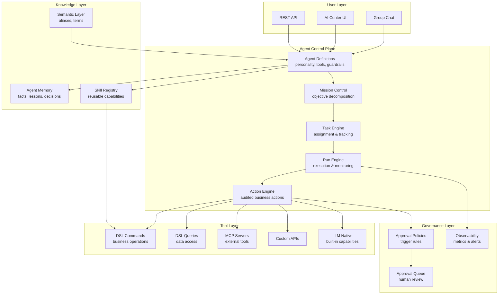
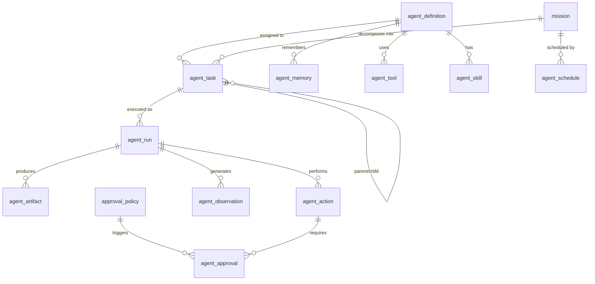
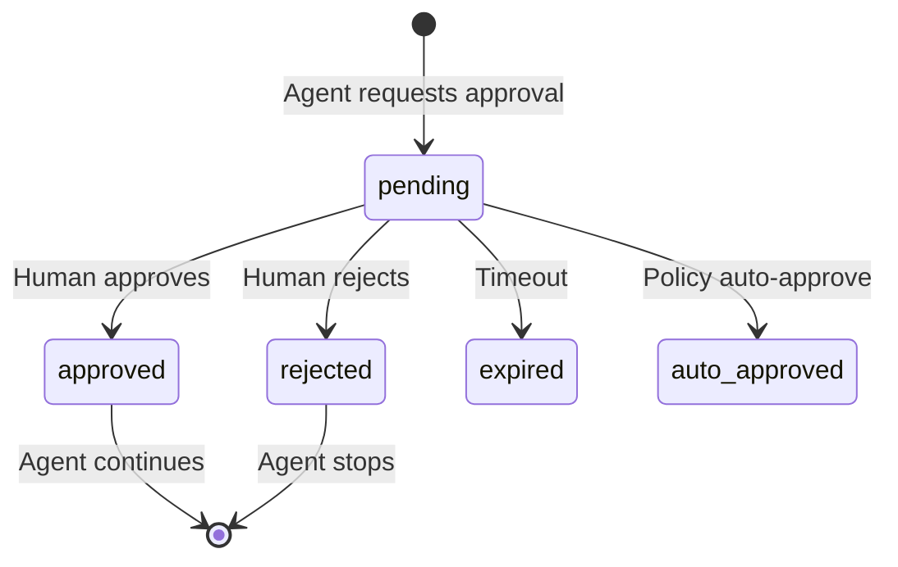
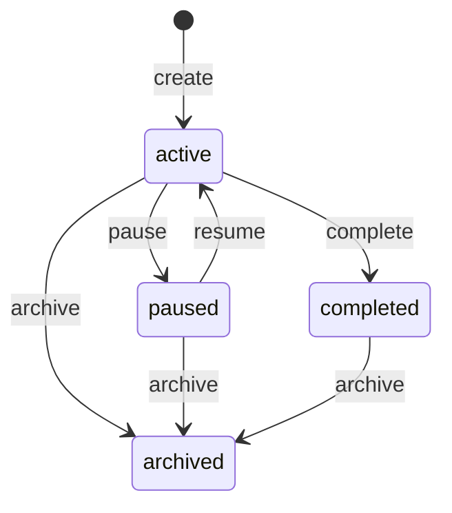
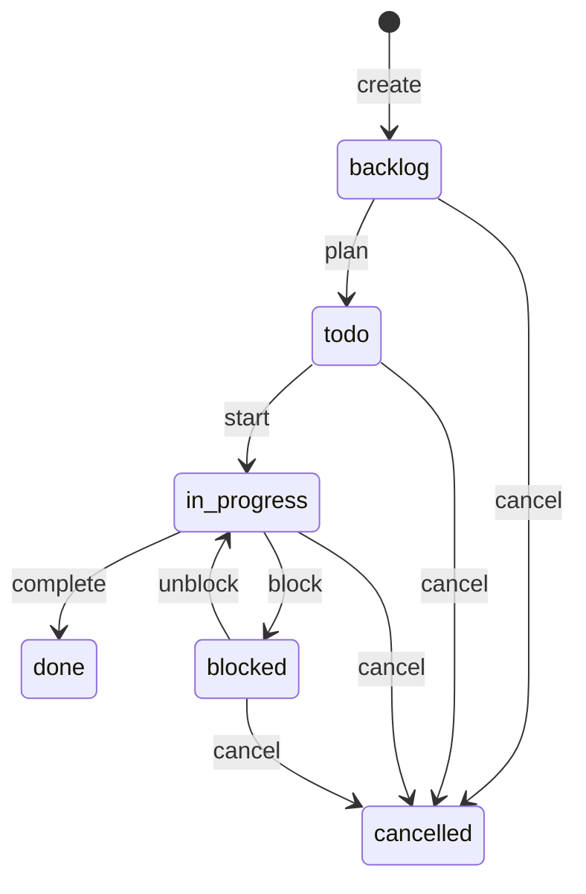

# AI Agent Platform

> Multi-agent orchestration, AI-assisted work, human-in-the-loop governance, and intelligent automation -- AuraBoot's Agent Control Plane (ACP) adds an AI-assisted operating layer to your business platform.

## Business Overview

### The Problem

Enterprises want to use AI agents but face three challenges:
1. **No orchestration** -- individual chatbots can't coordinate, share context, or decompose complex tasks
2. **No governance** -- AI agents making business decisions without human oversight is a non-starter
3. **No integration** -- AI tools exist in silos, disconnected from the actual business data and processes

### Who It's For

- **Business Leaders** who want AI employees that work alongside human teams
- **IT Teams** deploying and managing AI agents across the organization
- **Operations Managers** automating repetitive workflows with AI
- **Developers** building custom AI tools and integrations
- **Compliance Officers** ensuring AI actions are auditable and governed

### Key Capabilities

1. **Agent Definitions** -- configure AI agents with personality, expertise, tools, and guardrails
2. **Mission Control** -- decompose high-level business objectives into agent-executable tasks
3. **Multi-Model Support** -- Claude Opus/Sonnet/Haiku, GPT-4o, MiniMax, and custom models
4. **Tool Registry** -- DSL commands, DSL queries, custom APIs, MCP servers, and LLM-native tools
5. **Skill System** -- reusable skill packages (atomic, workflow, industry solution)
6. **Human-in-the-Loop** -- approval policies for sensitive actions with auto-escalation
7. **Agent Memory** -- persistent memory (facts, preferences, lessons, decisions) across sessions
8. **Execution Tracking** -- full audit trail of runs, token usage, costs, and artifacts
9. **Scheduling** -- cron, interval, event-triggered, and one-time agent task execution
10. **Observability** -- activity logs, metrics, cost tracking, error alerts
11. **AI Employees** -- pre-built agents that participate in group chat as team members
12. **Semantic Grounding** -- object aliases and semantic terms for natural language understanding
13. **MCP Server Registry** -- connect external MCP-compatible tool servers
14. **Action Engine** -- audited business action execution with risk-level classification
15. **Artifact Management** -- track agent outputs (documents, code, reports, data, images, emails)

### Plugin Architecture

The AI Agent Platform consists of two plugins:

```json
// Agent Control Plane -- the infrastructure
{
  "pluginId": "com.auraboot.agent-control-plane",
  "namespace": "acp",
  "version": "1.0.0",
  "pluginType": "config",
  "dependencies": []
}

// AI Employees -- pre-built agent team
{
  "code": "ai-employees",
  "version": "1.0.0",
  "description": "Pre-built AI employees for group chat collaboration"
}
```

---

## Architecture

### Agent Control Plane (ACP)



---

## Data Model

The ACP defines **16 models** spanning agent configuration, execution, governance, and knowledge:

### Core Models

| Model | Category | Purpose |
|-------|----------|---------|
| `agent_definition` | master | Agent configuration: personality, model, tools, guardrails |
| `mission` | entity | High-level business objectives |
| `agent_task` | entity | Individual tasks assigned to agents or humans |
| `agent_run` | transaction | Execution records with token/cost tracking |
| `agent_artifact` | entity | Outputs produced by agent runs |

### Governance Models

| Model | Category | Purpose |
|-------|----------|---------|
| `approval_policy` | master | Rules for when agent actions need human approval |
| `agent_approval` | document | Approval requests pending human review |
| `agent_action` | transaction | Audited business action trail |
| `agent_observation` | transaction | System metrics, costs, and alerts |

### Knowledge Models

| Model | Category | Purpose |
|-------|----------|---------|
| `agent_memory` | master | Persistent agent memory (facts, preferences, lessons) |
| `agent_tool` | master | Tool definitions (DSL commands, APIs, MCP servers) |
| `agent_skill` | master | Reusable skill packages |
| `object_alias` | master | Natural language aliases for business objects |
| `semantic_term` | master | Semantic terms for grounding |

### Infrastructure Models

| Model | Category | Purpose |
|-------|----------|---------|
| `agent_schedule` | master | Scheduled/triggered task execution |
| `mcp_server` | master | External MCP server registry |

### Entity Relationships



---

## Agent Types

The platform supports three agent types, configured via the `acp_agent_type` dictionary:

### Autonomous Agent

Operates independently, executing tasks without continuous human guidance. Best for well-defined, repeatable workflows.

```json
{ "value": "autonomous", "label": "Autonomous Agent" }
```

**Use cases:** Scheduled report generation, data monitoring, automated responses

### Copilot Agent

Works alongside a human user, providing suggestions and executing tasks on request. The human remains in control.

```json
{ "value": "copilot", "label": "Copilot" }
```

**Use cases:** Data analysis assistance, document drafting, code review

### Reactive Agent

Responds to events and triggers (webhooks, schedule, data changes) without a persistent conversation.

```json
{ "value": "reactive", "label": "Reactive Agent" }
```

**Use cases:** Alert handling, data pipeline processing, notification routing

---

## Tool System

### Tool Types

Agents access business capabilities through a typed tool registry:

```json
{
  "acp_tool_type": [
    { "value": "dsl_command", "label": "DSL Command" },
    { "value": "dsl_query", "label": "DSL Query" },
    { "value": "dsl_datasource", "label": "DSL DataSource" },
    { "value": "custom_api", "label": "Custom API" },
    { "value": "mcp_server", "label": "MCP Server" },
    { "value": "llm_native", "label": "LLM Native" }
  ]
}
```

### Tool Risk Levels

Every tool is classified by risk level, which determines whether human approval is needed:

```json
{
  "acp_risk_level": [
    { "value": "low", "label": "Low", "color": "#52c41a" },
    { "value": "medium", "label": "Medium", "color": "#faad14" },
    { "value": "high", "label": "High", "color": "#fa8c16" },
    { "value": "critical", "label": "Critical", "color": "#ff4d4f" }
  ]
}
```

### Tool Registration

```json
{
  "code": "acp:create_agent_tool",
  "type": "create",
  "modelCode": "agent_tool",
  "inputFields": [
    "tool_code", "tool_type", "tool_name", "tool_description",
    "source_type", "source_code", "api_method", "api_path",
    "input_schema", "output_schema",
    "requires_approval", "risk_level", "tool_status"
  ]
}
```

### MCP Server Integration

External tools can be connected via the Model Context Protocol:

```json
{
  "code": "acp:create_mcp_server",
  "type": "create",
  "modelCode": "mcp_server",
  "inputFields": [
    "server_name", "server_url", "transport_type",
    "auth_type", "auth_config", "status"
  ]
}
```

---

## AI Employee Configuration

The `ai-employees` plugin provides four pre-built AI team members:

### AuraBot -- The Coordinator

```json
{
  "agentCode": "aurabot_conductor",
  "name": "AuraBot",
  "employeeRole": "AI Coordinator",
  "model": "claude-sonnet-4-6",
  "autoReplyMode": "always",
  "soulProfile": {
    "personality": "Helpful, concise, collaborative",
    "expertise": "Task routing, summarization, general Q&A",
    "communication": "Professional but friendly, keeps responses brief",
    "boundaries": "Delegates specialized tasks rather than attempting them directly",
    "goals": "Ensure every user request is handled by the most capable agent"
  }
}
```

### Dex -- The Data Expert

```json
{
  "agentCode": "dex",
  "name": "Dex",
  "employeeRole": "Data Expert",
  "model": "claude-sonnet-4-6",
  "autoReplyMode": "mention",
  "tools": "platform_execute_sql",
  "soulProfile": {
    "personality": "Precise, analytical, detail-oriented",
    "expertise": "SQL queries, data analysis, visualization, statistics",
    "communication": "Shows data first, explains second. Uses tables and charts."
  }
}
```

### Sage -- The Business Analyst

```json
{
  "agentCode": "sage",
  "name": "Sage",
  "employeeRole": "Business Analyst",
  "model": "claude-sonnet-4-6",
  "autoReplyMode": "mention",
  "tools": "platform_execute_sql",
  "soulProfile": {
    "personality": "Strategic, insightful, forward-thinking",
    "expertise": "Business analysis, sales forecasting, market trends, KPI tracking",
    "communication": "Structured reports with executive summaries and key takeaways"
  }
}
```

### Aria -- The Writing Assistant

```json
{
  "agentCode": "aria",
  "name": "Aria",
  "employeeRole": "Writing Assistant",
  "model": "claude-sonnet-4-6",
  "autoReplyMode": "mention",
  "soulProfile": {
    "personality": "Creative, articulate, detail-conscious",
    "expertise": "Report writing, email drafting, summarization, editing",
    "communication": "Well-structured, clear prose with appropriate tone"
  }
}
```

### How AI Employees Work

1. **Group Chat Integration** -- AI employees appear as participants in group chats
2. **Mention-Based Activation** -- @mention an agent to delegate a task (except AuraBot, which always listens)
3. **Tool Access** -- each agent has specific tools (e.g., Dex can run SQL queries)
4. **Soul Profile** -- personality, expertise, communication style, boundaries, and goals shape behavior
5. **Tenant Scoped** -- agents are visible to all users within a tenant

---

## Multi-LLM Support

The platform supports multiple AI model providers through the `acp_ai_model` dictionary:

| Model | Provider | Best For |
|-------|----------|----------|
| `claude-opus-4-6` | Anthropic | Complex reasoning, long documents |
| `claude-sonnet-4-6` | Anthropic | General purpose, balanced speed/quality |
| `claude-haiku-4-5` | Anthropic | Fast responses, simple tasks |
| `gpt-4o` | OpenAI | Multi-modal, image understanding |
| `MiniMax-Text-01` | MiniMax | Chinese language tasks |
| `abab6.5-chat` | MiniMax | Chinese language tasks |
| `custom` | Any | Bring your own model endpoint |

Each agent definition specifies its model independently, allowing cost optimization per use case.

---

## Governance & Approval

### Approval Policies

Define rules for when agent actions require human approval:

```json
{
  "code": "acp:create_approval_policy",
  "inputFields": [
    "policy_name", "description",
    "trigger_rules",      // conditions that trigger approval
    "approver_rules",     // who can approve
    "auto_approve",       // bypass for low-risk actions
    "timeout_hours",      // auto-escalation
    "timeout_action",     // "approve" or "reject" on timeout
    "policy_status"
  ]
}
```

### Approval Types

```json
{
  "acp_approval_type": [
    { "value": "tool_call", "label": "Tool Call" },
    { "value": "data_change", "label": "Data Change" },
    { "value": "external_api", "label": "External API" },
    { "value": "cost_threshold", "label": "Cost Threshold" },
    { "value": "sensitive_action", "label": "Sensitive Action" }
  ]
}
```

### Approval Workflow



### Mission Lifecycle



### Task Lifecycle



---

## Skill System

Skills are reusable capability packages for agents, organized in three levels:

```json
{
  "acp_skill_level": [
    { "value": "atomic", "label": "Atomic Tool", "color": "#3B82F6" },
    { "value": "workflow", "label": "Workflow Skill", "color": "#8B5CF6" },
    { "value": "solution", "label": "Industry Solution", "color": "#F59E0B" }
  ]
}
```

### Skill Categories

| Category | Examples |
|----------|---------|
| Communication | Email drafting, notification sending, chat responses |
| Data | SQL queries, data analysis, report generation |
| Automation | Workflow execution, data transformation, scheduling |
| Analysis | Business intelligence, trend detection, anomaly alerts |
| Integration | API calls, webhook handling, file processing |
| Custom | Tenant-specific skills |

### Skill Registration

```json
{
  "code": "acp:create_agent_skill",
  "inputFields": [
    "skill_code", "skill_name", "skill_description",
    "skill_level",          // atomic | workflow | solution
    "skill_category",       // communication | data | automation | ...
    "skill_icon",
    "skill_tools",          // JSON array of tool references
    "prompt_template",      // skill-specific system prompt
    "skill_input_schema",   // JSON Schema for skill inputs
    "skill_version",
    "skill_status",         // active | draft | deprecated
    "is_builtin"
  ]
}
```

---

## Getting Started

### 1. Install the Plugins

```bash
# Agent Control Plane (infrastructure)
aura plugin publish plugins/agent-control-plane --yes

# AI Employees (pre-built team)
aura plugin publish plugins/ai-employees --yes
```

### 2. Verify Installation

```bash
aura dsl show agent_definition
aura dsl show mission
aura dsl show agent_task
aura dsl show agent_tool
```

### 3. Create a Custom Agent

```bash
aura exec acp:create_agent_definition \
  --set agent_code="support_bot" \
  --set name="Support Bot" \
  --set agent_type="copilot" \
  --set model="claude-sonnet-4-6" \
  --set system_prompt="You are a customer support assistant..." \
  --set personality="Patient, empathetic, solution-oriented" \
  --set expertise="Customer support, FAQ, ticket routing"
```

### 4. Register a Tool

```bash
aura exec acp:create_agent_tool \
  --set tool_code="query_orders" \
  --set tool_type="dsl_query" \
  --set tool_name="Query Sales Orders" \
  --set tool_description="Search and filter sales orders" \
  --set source_type="dsl" \
  --set source_code="sales_order" \
  --set risk_level="low" \
  --set tool_status="active"
```

### 5. Create a Mission

```bash
aura exec acp:create_mission \
  --set title="Weekly Sales Report" \
  --set description="Generate and distribute weekly sales analysis" \
  --set priority="medium" \
  --set mission_status="active"
```

### 6. Access the AI Center

Navigate to the **AI Center** in the sidebar to see your agents, missions, and run history.

---

## Extension Points

### Creating Custom AI Employees

Add new agent definitions to the `ai-employees/resources/agent-definitions.json` file:

```json
{
  "agentCode": "finance_analyst",
  "name": "Finley",
  "description": "Financial analyst -- P&L, cash flow, budget variance",
  "enrollAsEmployee": true,
  "employeeRole": "Finance Analyst",
  "model": "claude-sonnet-4-6",
  "tools": "platform_execute_sql",
  "soulProfile": {
    "personality": "Precise, conservative, thorough",
    "expertise": "Financial analysis, budgeting, forecasting"
  }
}
```

### Building Custom Tools

1. **DSL Command tools** -- any published DSL command becomes a tool automatically
2. **Custom API tools** -- register REST endpoints with input/output schemas
3. **MCP Server tools** -- connect external MCP-compatible servers
4. **Workflow skills** -- compose multiple tools into a reusable workflow

### Custom Approval Policies

Create policies that match your organization's governance requirements:

- Amount-based: approve if cost > $1,000
- Action-based: approve all DELETE operations
- Model-based: approve when using expensive models
- Time-based: auto-approve during business hours

### Agent Memory Integration

Agents accumulate knowledge through six memory types:

| Type | Purpose | Example |
|------|---------|---------|
| fact | Known truths | "Q4 revenue was $2.3M" |
| preference | User/org preferences | "Reports should use metric units" |
| lesson | Learned from experience | "Large BOM imports timeout after 30s" |
| context | Session context | "Currently reviewing Q1 procurement" |
| decision | Key decisions made | "Approved vendor switch to CompanyX" |
| summary | Condensed knowledge | "Top 3 customers by revenue: A, B, C" |

---

## FAQ

**Q: Can agents access any data in the system?**
A: No. Agents are limited to the tools explicitly assigned to them. A support agent with only "query_orders" tool cannot access HR data. The `allowedOperations` field (e.g., `["query"]` for read-only) further restricts what agents can do.

**Q: How is cost tracked?**
A: Every `agent_run` record captures `input_tokens`, `output_tokens`, `total_cost`, and `duration_ms`. The observability system aggregates these into per-agent and per-mission cost dashboards.

**Q: Can I run agents on-premise?**
A: Yes. The Agent Control Plane runs entirely within your AuraBoot instance. You configure which LLM providers to use -- including self-hosted models via the "custom" model option.

**Q: What happens when an approval times out?**
A: The `timeout_action` field on the approval policy determines the behavior: either `approve` (auto-approve after timeout) or `reject` (auto-reject). The `timeout_hours` field sets the deadline.

**Q: Can agents collaborate with each other?**
A: Yes. The AuraBot coordinator agent can delegate tasks to specialist agents using the `transfer_to_agent` tool. In group chat, multiple agents can respond to the same thread based on their expertise.

**Q: How do I monitor agent behavior?**
A: The `agent_observation` model captures five types of data: activity logs, metrics, cost events, errors, and alerts. Each observation has a severity level (info/warn/error/critical). The AI Center Dashboard provides real-time monitoring.

**Q: Is there rate limiting?**
A: Yes. Approval policies can enforce cost thresholds per agent, per mission, or per time period. The `estimated_cost` and `max_retries` fields on tasks provide budget guardrails.
