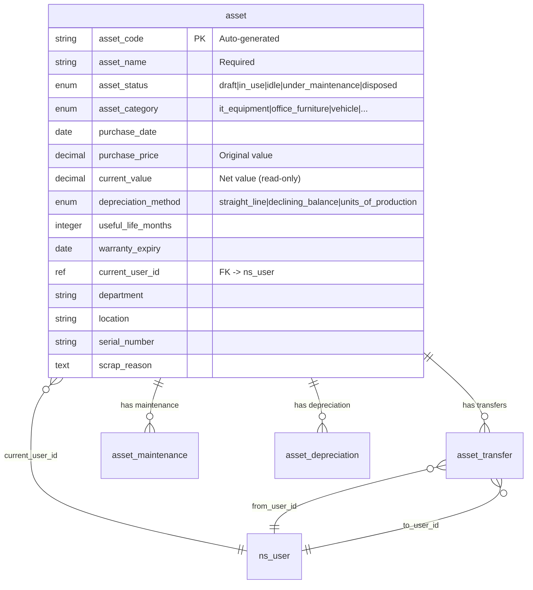
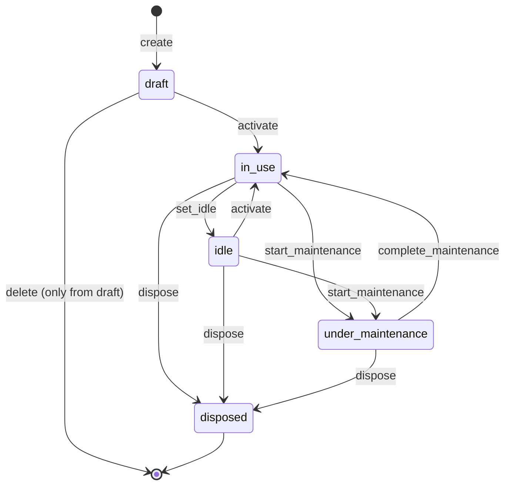
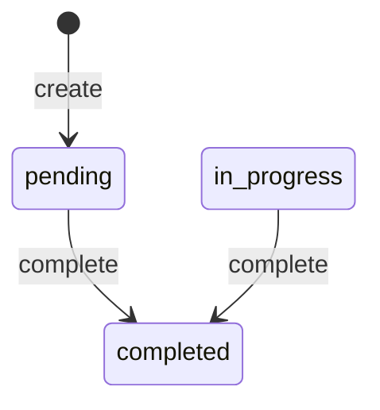

# Asset Management

> Equipment tracking, maintenance scheduling, lifecycle management, and depreciation -- all configured through AuraBoot's DSL plugin system with zero custom code.

## Business Overview

### The Problem

Organizations of every size struggle with fixed asset management. Spreadsheets lose track of equipment, maintenance gets missed, depreciation calculations are manual and error-prone, and nobody knows who has what. The result: wasted capital, surprise breakdowns, audit failures, and frustrated finance teams.

### Who It's For

- **IT Managers** tracking laptops, servers, and network equipment
- **Facilities Teams** managing office furniture, HVAC, and building assets
- **Finance Departments** running depreciation schedules and audit reports
- **Operations Managers** coordinating equipment maintenance across locations
- **Asset Keepers** handling day-to-day check-in/check-out and transfers

### Key Capabilities

1. **Complete Asset Register** -- centralized ledger of all fixed assets with auto-generated codes
2. **Multi-Category Support** -- IT equipment, office furniture, vehicles, machinery, buildings, and custom categories
3. **Full Lifecycle State Machine** -- draft, in-use, idle, under maintenance, disposed with enforced transitions
4. **Depreciation Engine** -- straight-line, declining balance, and units-of-production methods
5. **Maintenance Scheduling** -- routine, repair, overhaul, and inspection tracking with cost history
6. **Asset Transfers** -- assign, return, transfer, and borrow with complete audit trail
7. **User Assignment** -- track current custodian with reference to the user directory
8. **Department & Location Tracking** -- filter assets by organizational unit and physical location
9. **Warranty Management** -- track expiry dates and get visibility on out-of-warranty assets
10. **Financial Reporting** -- original value, net value, accumulated depreciation per asset
11. **Dashboard with KPIs** -- total assets, utilization rates, maintenance costs, category distribution
12. **Approval Workflows** -- BPMN-based purchase approval with amount-based routing
13. **Role-Based Access** -- four distinct roles from read-only user to full administrator
14. **Search & Filter** -- full-text search on asset name, code, serial number, department, location
15. **Data Export** -- all list views support export to Excel/CSV
16. **Audit Trail** -- every state transition and transfer is recorded with timestamp and user

### Plugin Identity

```json
{
  "pluginId": "com.auraboot.asset-management",
  "namespace": "asset",
  "version": "2.0.0",
  "pluginType": "config",
  "dependencies": []
}
```

This is a **standalone plugin** with no external dependencies -- it can be installed on any AuraBoot instance.

---

## Data Model

The plugin defines four interconnected models:

```
asset (Fixed Asset)                 [master]
  |-- asset_transfer               [transaction]  -- ownership/custody changes
  |-- asset_maintenance            [transaction]  -- repair and service records
  |-- asset_depreciation           [transaction]  -- periodic depreciation entries
```

### Model Definitions

```json
[
  {
    "code": "asset",
    "displayName:en": "Fixed Asset",
    "modelType": "entity",
    "modelCategory": "master",
    "extension": {
      "icon": "Package",
      "titleField": "asset_name",
      "subtitleField": "asset_code"
    }
  },
  {
    "code": "asset_transfer",
    "displayName:en": "Asset Transfer",
    "modelType": "entity",
    "modelCategory": "transaction",
    "extension": { "icon": "ArrowRight" }
  },
  {
    "code": "asset_maintenance",
    "displayName:en": "Asset Maintenance",
    "modelType": "entity",
    "modelCategory": "transaction",
    "extension": { "icon": "Wrench" }
  },
  {
    "code": "asset_depreciation",
    "displayName:en": "Asset Depreciation",
    "modelType": "entity",
    "modelCategory": "transaction",
    "extension": { "icon": "TrendingDown" }
  }
]
```

### Entity-Relationship Diagram



---

## Fields Deep Dive

### Asset Fields

| Field | Type | Required | Searchable | Notes |
|-------|------|----------|------------|-------|
| `asset_code` | string(50) | Yes | Yes | Auto-generated, read-only |
| `asset_name` | string(200) | Yes | Yes | Primary display field |
| `asset_status` | enum | Yes | Yes | State machine field (see Commands) |
| `asset_category` | enum | Yes | Yes | Dict: `asset_category` |
| `asset_description` | text(2000) | No | No | Textarea component |
| `purchase_date` | date | No | No | Sortable |
| `purchase_price` | decimal(14,2) | No | No | Suffix: "元" |
| `current_value` | decimal(14,2) | No | No | Read-only, computed |
| `depreciation_method` | enum | No | No | Dict: `depreciation_method` |
| `useful_life_months` | integer | No | No | Min: 1 |
| `warranty_expiry` | date | No | No | Sortable |
| `current_user_id` | reference | No | Yes | FK -> ns_user |
| `department` | string(200) | No | Yes | Filterable |
| `location` | string(200) | No | Yes | |
| `serial_number` | string(100) | No | Yes | |
| `scrap_reason` | text(500) | No | No | Required when disposing |

### Transfer Fields

| Field | Type | Required | Notes |
|-------|------|----------|-------|
| `asset_id` | reference | Yes | FK -> asset |
| `transfer_type` | enum | Yes | assign/return/transfer/borrow |
| `transfer_date` | datetime | Yes | |
| `from_user_id` | reference | No | FK -> ns_user |
| `to_user_id` | reference | No | FK -> ns_user |
| `transfer_reason` | text(500) | No | |

### Maintenance Fields

| Field | Type | Required | Notes |
|-------|------|----------|-------|
| `asset_id` | reference | Yes | FK -> asset |
| `maintenance_type` | enum | Yes | routine/repair/overhaul/inspection |
| `maintenance_date` | date | Yes | Sortable |
| `maintenance_cost` | decimal(14,2) | No | Suffix: "元" |
| `maintenance_description` | text(1000) | No | |
| `maintenance_status` | enum | Yes | pending/in_progress/completed |
| `next_maintenance_date` | date | No | |

### Depreciation Fields

| Field | Type | Required | Notes |
|-------|------|----------|-------|
| `asset_id` | reference | Yes | FK -> asset |
| `depreciation_period` | string(10) | Yes | Format: 2024-01 |
| `depreciation_amount` | decimal(14,2) | Yes | This period's charge |
| `accumulated_depreciation` | decimal(14,2) | No | Running total (read-only) |
| `net_value_after` | decimal(14,2) | No | Remaining value (read-only) |

### Data Dictionaries

```json
{
  "asset_status": ["draft", "in_use", "under_maintenance", "idle", "disposed"],
  "asset_category": ["it_equipment", "office_furniture", "vehicle", "machinery", "building", "other"],
  "transfer_type": ["assign", "return", "transfer", "borrow"],
  "depreciation_method": ["straight_line", "declining_balance", "units_of_production"],
  "maintenance_type": ["routine", "repair", "overhaul", "inspection"],
  "maintenance_status": ["pending", "in_progress", "completed"]
}
```

---

## Commands & Business Logic

### Asset State Machine



### Asset Commands

| Command | Type | From States | To State | Notes |
|---------|------|-------------|----------|-------|
| `asset:create` | create | -- | draft | Auto-generates asset_code |
| `asset:update` | update | -- | -- | Edit any field |
| `asset:delete` | delete | draft | -- | Only draft assets can be deleted |
| `asset:activate` | state_transition | idle, draft | in_use | Put asset into service |
| `asset:set_idle` | state_transition | in_use | idle | Remove from active use |
| `asset:start_maintenance` | state_transition | in_use, idle | under_maintenance | Send for repair |
| `asset:complete_maintenance` | state_transition | under_maintenance | in_use | Return to service |
| `asset:dispose` | state_transition | in_use, idle, under_maintenance | disposed | Requires scrap_reason |

#### Disposal Command Detail

The `asset:dispose` command requires the user to provide a `scrap_reason` via an input schema:

```json
{
  "code": "asset:dispose",
  "actionType": "state_transition",
  "stateField": "asset_status",
  "fromStates": ["in_use", "idle", "under_maintenance"],
  "toState": "disposed",
  "inputFields": ["scrap_reason"],
  "inputSchema": {
    "type": "object",
    "properties": {
      "scrap_reason": {
        "type": "string",
        "description": "Scrap reason",
        "minLength": 1
      }
    },
    "required": ["scrap_reason"]
  },
  "uiConfig": {
    "icon": "Trash",
    "style": "danger",
    "confirmMessage": "Confirm dispose? This action cannot be reversed."
  }
}
```

### Maintenance State Machine



### Transfer, Maintenance & Depreciation Commands

Each sub-model has standard CRUD commands (`create`, `update`, `delete`). The maintenance model additionally has:

- `asset_maintenance:complete` -- state transition from pending/in_progress to completed

---

## Pages & User Interface

### Menu Structure

```
Asset Management (icon: Package)
  ├── Asset Dashboard      /asset/dashboard
  ├── Asset Register       /asset/list
  ├── Transfer History     /asset/transfers
  ├── Maintenance Records  /asset/maintenance
  └── Depreciation Records /asset/depreciation
```

### Dashboard Page

The dashboard uses a **grid layout** (12 columns) with stat cards, charts, and a pending tasks table:

```json
{
  "pageKey": "asset_dashboard",
  "kind": "dashboard",
  "layout": { "type": "grid", "cols": 12 },
  "blocks": [
    {
      "id": "kpi_total",
      "blockType": "stat-card",
      "layout": { "colSpan": 2 },
      "title": { "en": "Total Assets" },
      "dataSource": { "type": "namedQuery", "queryCode": "asset_kpi_summary" },
      "valueField": "total_count",
      "icon": "Package",
      "color": "#1677ff"
    },
    {
      "id": "kpi_in_use",
      "blockType": "stat-card",
      "layout": { "colSpan": 2 },
      "title": { "en": "In Use" },
      "valueField": "in_use_count",
      "icon": "CheckCircle",
      "color": "#52c41a"
    },
    {
      "id": "kpi_idle",
      "blockType": "stat-card",
      "layout": { "colSpan": 2 },
      "title": { "en": "Idle" },
      "valueField": "idle_count",
      "icon": "PauseCircle"
    },
    {
      "id": "kpi_maintenance",
      "blockType": "stat-card",
      "layout": { "colSpan": 2 },
      "title": { "en": "Under Maintenance" },
      "valueField": "maintenance_count",
      "icon": "Wrench",
      "color": "#faad14"
    },
    {
      "id": "kpi_original_value",
      "blockType": "stat-card",
      "layout": { "colSpan": 2 },
      "title": { "en": "Total Original Value" },
      "valueField": "total_original_value",
      "format": "currency"
    },
    {
      "id": "kpi_net_value",
      "blockType": "stat-card",
      "layout": { "colSpan": 2 },
      "title": { "en": "Total Net Value" },
      "valueField": "total_net_value",
      "format": "currency"
    },
    {
      "id": "chart_by_category",
      "blockType": "chart",
      "layout": { "colSpan": 6, "rowSpan": 2 },
      "title": { "en": "Assets by Category" },
      "dataSource": { "type": "namedQuery", "queryCode": "asset_by_category" },
      "chartConfig": { "type": "pie", "nameField": "category", "valueField": "count" }
    },
    {
      "id": "chart_by_status",
      "blockType": "chart",
      "layout": { "colSpan": 6, "rowSpan": 2 },
      "title": { "en": "Assets by Status" },
      "dataSource": { "type": "namedQuery", "queryCode": "asset_by_status" },
      "chartConfig": { "type": "bar", "xField": "status", "yField": "count" }
    },
    {
      "id": "chart_maintenance_cost",
      "blockType": "chart",
      "layout": { "colSpan": 12, "rowSpan": 2 },
      "title": { "en": "Monthly Maintenance Cost (Last 12 Months)" },
      "chartConfig": { "type": "line", "xField": "month", "yField": "total_cost" }
    }
  ]
}
```

### Approval Workflow

The plugin includes a BPMN process for asset purchase approval:

```
Start -> Manager Approval -> Amount Check (gateway)
  |-- Amount >= 10,000 -> Director Approval -> End
  |-- Amount < 10,000  -> End (auto-approved)
```

---

## Permissions & Roles

### Permissions (18 total)

| Code | Action | Resource |
|------|--------|----------|
| `asset:view` | read | asset |
| `asset:create` | create | asset |
| `asset:update` | update | asset |
| `asset:delete` | delete | asset |
| `asset:dispose` | execute | asset:dispose command |
| `asset:transfer:view` | read | asset_transfer |
| `asset:transfer:create` | create | asset_transfer |
| `asset:transfer:update` | update | asset_transfer |
| `asset:transfer:delete` | delete | asset_transfer |
| `asset:maintenance:view` | read | asset_maintenance |
| `asset:maintenance:create` | create | asset_maintenance |
| `asset:maintenance:update` | update | asset_maintenance |
| `asset:maintenance:delete` | delete | asset_maintenance |
| `asset:depreciation:view` | read | asset_depreciation |
| `asset:depreciation:create` | create | asset_depreciation |
| `asset:depreciation:update` | update | asset_depreciation |
| `asset:depreciation:delete` | delete | asset_depreciation |
| `asset:admin` | admin | asset (full module admin) |

### Roles (4 tiers)

```json
[
  {
    "code": "asset_user",
    "name": "Asset User",
    "description": "Read-only access to asset register and records",
    "permissions": ["asset:view", "asset:transfer:view", "asset:maintenance:view", "asset:depreciation:view"]
  },
  {
    "code": "asset_keeper",
    "name": "Asset Keeper",
    "description": "Register, transfer, and maintain assets",
    "permissions": ["asset:view", "asset:create", "asset:update",
                    "asset:transfer:*", "asset:maintenance:view/create/update",
                    "asset:depreciation:view"]
  },
  {
    "code": "asset_manager",
    "name": "Asset Manager",
    "description": "Full CRUD including disposal and depreciation",
    "permissions": ["(all permissions except asset:admin)"]
  },
  {
    "code": "asset_admin",
    "name": "Asset Administrator",
    "description": "Full module control including admin operations",
    "permissions": ["(all 18 permissions)"]
  }
]
```

---

## Getting Started

### 1. Install the Plugin

```bash
aura plugin publish plugins/asset-management --yes
```

### 2. Verify Installation

```bash
aura dsl show asset
aura dsl show asset_transfer
aura dsl show asset_maintenance
aura dsl show asset_depreciation
```

### 3. Create Your First Asset

```bash
aura exec asset:create \
  --set asset_name="MacBook Pro 16-inch" \
  --set asset_category="it_equipment" \
  --set purchase_price:decimal=12999.00 \
  --set purchase_date="2024-01-15" \
  --set serial_number="C02XG0XXXXXX" \
  --set department="Engineering" \
  --set location="Building A, Floor 3" \
  --set depreciation_method="straight_line" \
  --set useful_life_months:int=36
```

### 4. Activate It

```bash
aura exec asset:activate --target <asset_pid>
```

### 5. Open the Dashboard

Navigate to **Asset Management > Asset Dashboard** in the sidebar menu, or go to `/asset/dashboard`.

---

## Extension Points

### Adding Custom Asset Categories

Edit the `asset_category` dictionary in `config/dicts.json` to add industry-specific categories:

```json
{
  "value": "laboratory_equipment",
  "label:en": "Laboratory Equipment",
  "sortNo": 10
}
```

### Adding Fields via Binding Rules

The plugin includes a `bindingRules.json` file that supports extending models with additional fields from other plugins.

### Custom Depreciation Logic

For complex depreciation rules (e.g., tax-specific accelerated depreciation), create a backend plugin that implements a custom command runner and overrides the `asset_depreciation:create` command.

### Integration with Other Plugins

- **Procurement** -- link assets to purchase orders via the `purchase_date` and `purchase_price` fields
- **Finance** -- export depreciation records to the general ledger
- **Maintenance** -- integrate with the standalone maintenance plugin for work order management

---

## FAQ

**Q: Can I delete an asset that is in use?**
A: No. Only assets in `draft` status can be deleted. In-use assets must be disposed (which requires a scrap reason) or set to idle first.

**Q: How is `current_value` calculated?**
A: The `current_value` field is read-only and computed as `purchase_price - accumulated_depreciation`. Each depreciation record updates this value.

**Q: Can I customize the approval workflow thresholds?**
A: Yes. Edit the `processes.json` file to change the gateway condition expression (currently `${purchase_price >= 10000}`).

**Q: Does this plugin support barcode/QR code scanning?**
A: The `asset_code` and `serial_number` fields are searchable and can be used with any barcode scanning integration. The mobile app supports deep links to asset detail pages.

**Q: Can I track assets across multiple locations?**
A: Yes. The `location` field is a free-text searchable field. For more structured location management, consider creating a location model and converting the field to a reference type.

**Q: What happens when I dispose an asset?**
A: The `asset:dispose` command transitions the asset to `disposed` status (irreversible), requires a `scrap_reason`, and displays a danger-styled confirmation dialog. The asset remains visible in the register for audit purposes but cannot be modified further.
