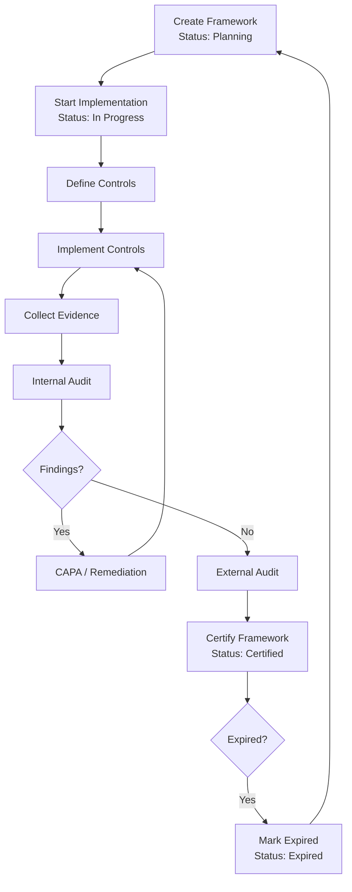
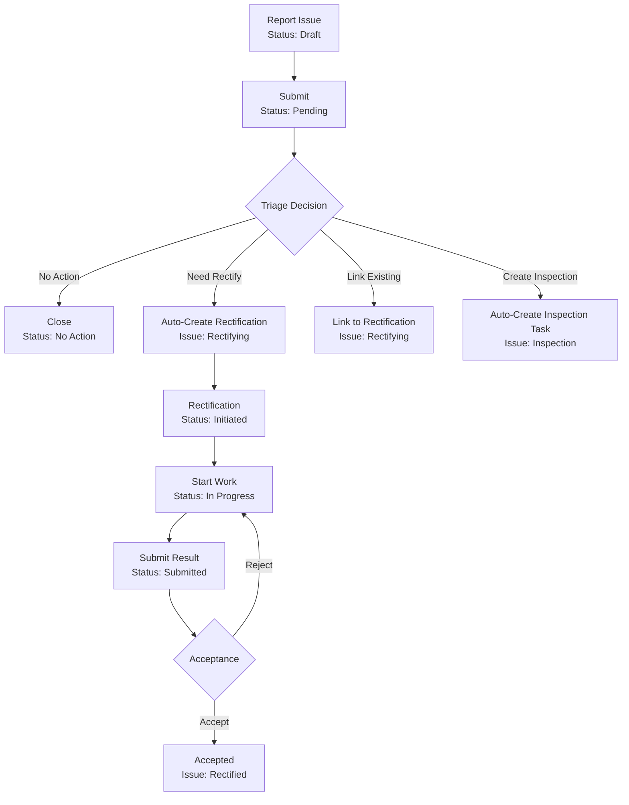
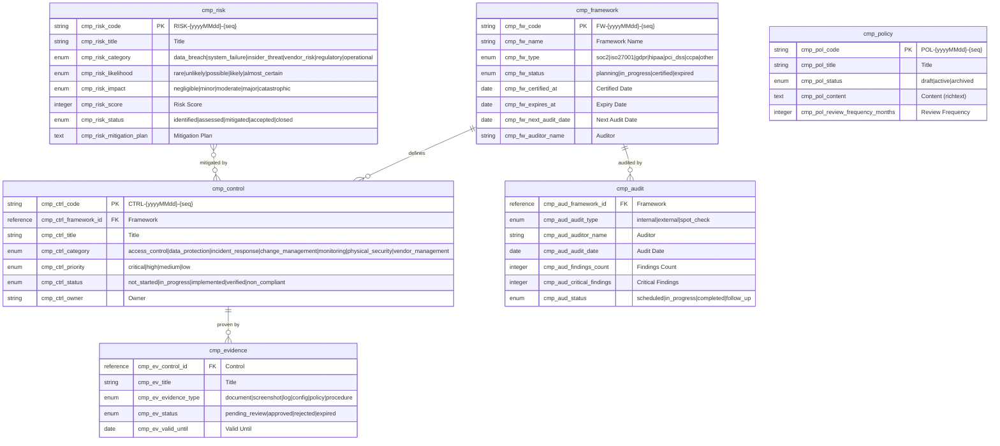
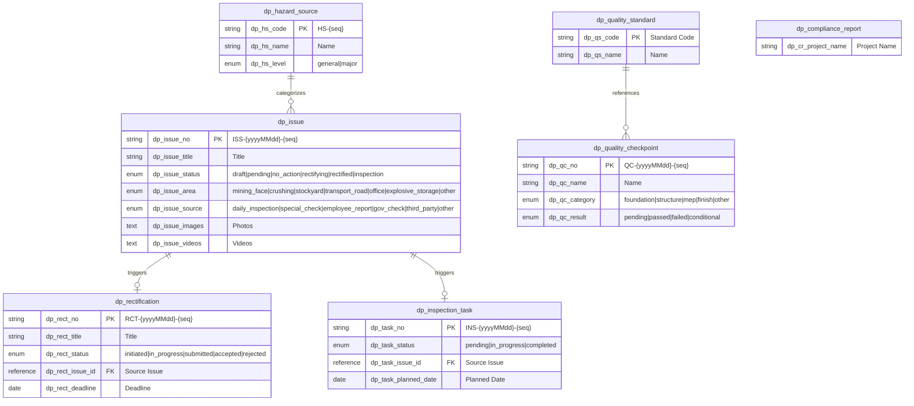
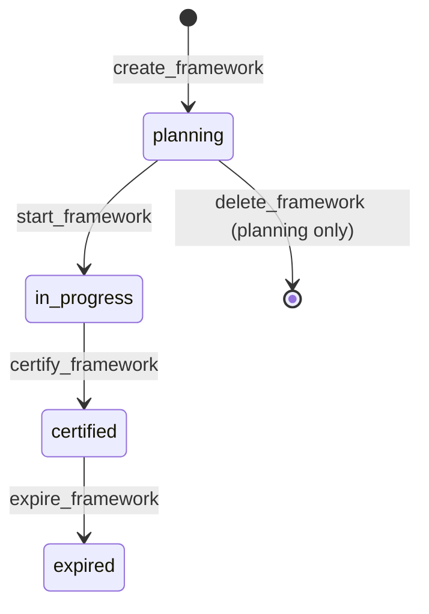
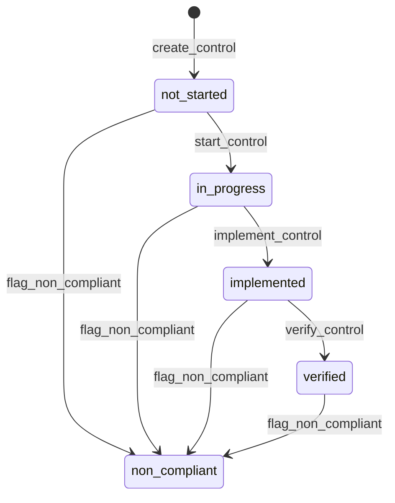
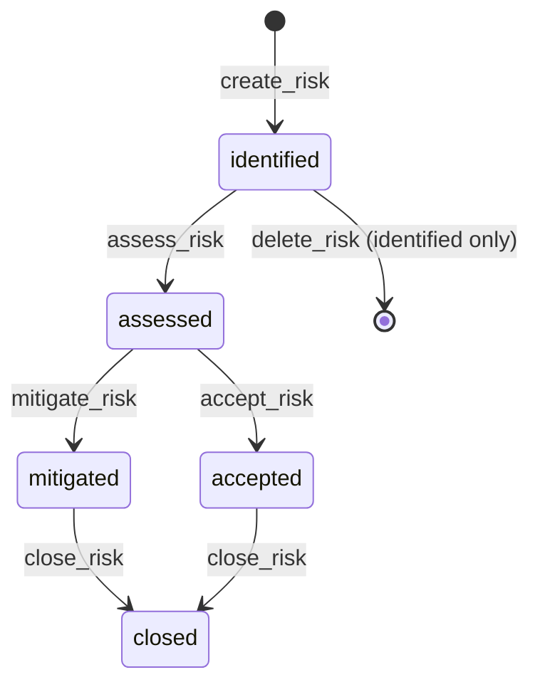

# Compliance & Risk Management

> Regulatory compliance frameworks (SOC 2, ISO 27001, GDPR, HIPAA), control measures, risk assessments, audit tracking, evidence management, policy lifecycle, and dual prevention mechanisms -- built entirely through AuraBoot's JSON DSL configuration.

This use case combines two AuraBoot plugins that work together:

| Plugin | ID | Namespace | Focus |
|--------|-----|-----------|-------|
| **Compliance** | `com.auraboot.compliance` | `cmp` | Regulatory frameworks, controls, risks, audits, evidence, policies |
| **Dual Prevention** | `com.auraboot.dual-prevention` | `dp` | Hazard inspection, triage, rectification, quality checkpoints |

---

## Business Overview

### The Problem

Organizations face a growing web of regulatory requirements -- SOC 2 for SaaS companies, ISO 27001 for information security, GDPR for data privacy, HIPAA for healthcare, PCI DSS for payment processing. Simultaneously, operational environments (construction sites, factories, mines) require continuous hazard inspection and rectification to prevent safety incidents. Without a unified system, compliance gaps go undetected, audit evidence scatters across email and shared drives, risks remain unassessed, and safety inspections produce no follow-through.

### Who It's For

- **Compliance Officers** -- manage framework implementations, track control coverage, prepare for audits
- **Internal Auditors** -- conduct audits, collect evidence, track findings
- **Risk Managers** -- maintain risk registers, assess likelihood/impact, plan mitigations
- **Safety Managers** -- triage hazards, assign rectification, verify closure
- **Site Inspectors** -- report issues, conduct inspections, document findings
- **Policy Authors** -- draft, review, and publish organizational policies

### Key Capabilities

**Compliance Plugin (13 capabilities):**
1. **Framework Management** -- track SOC 2, ISO 27001, GDPR, HIPAA, PCI DSS, CCPA certifications with status lifecycle
2. **Control Measures** -- define and track controls linked to frameworks with categories (access control, data protection, incident response, etc.)
3. **Control Status Tracking** -- not started -> in progress -> implemented -> verified, with non-compliant flagging
4. **Risk Register** -- maintain a risk register with categories (data breach, system failure, insider threat, vendor risk, regulatory, operational)
5. **Risk Assessment** -- 5x5 likelihood/impact matrix with risk scoring
6. **Risk Lifecycle** -- identified -> assessed -> mitigated/accepted -> closed
7. **Audit Management** -- schedule, execute, and complete internal/external audits and spot checks
8. **Audit Finding Tracking** -- total findings count and critical findings per audit
9. **Evidence Collection** -- gather compliance evidence (documents, screenshots, logs, configs) with approval workflow
10. **Evidence Validity Tracking** -- track evidence expiration dates and renewal needs
11. **Policy Management** -- draft, publish, and archive policies with version control and review cycles
12. **Policy Content** -- rich text policy content with approval workflow
13. **Compliance Dashboard** -- KPIs including control coverage, risk matrix, upcoming audits

**Dual Prevention Plugin (15 capabilities):**
14. **Issue Reporting** -- report safety hazards with photos, videos, area, and source classification
15. **Issue Triage** -- assess issues and decide: no action, create rectification, link existing, or create inspection
16. **Smart Side Effects** -- triage decisions auto-create rectification orders or inspection tasks
17. **Rectification Lifecycle** -- initiated -> in progress -> submitted -> accepted/rejected
18. **Acceptance Workflow** -- rectification results require explicit acceptance with auto-update of source issue
19. **Inspection Task Management** -- create, assign, start, and complete inspection tasks
20. **Hazard Source Database** -- maintain a registry of known hazard sources with categories and severity levels
21. **Quality Checkpoints** -- construction quality inspection with pass/fail/conditional results
22. **Quality Standards Library** -- reference library of quality standards for inspection criteria
23. **Compliance Reports** -- aggregated reports per project: checkpoint pass rate, inspection completion, issue rectification rate
24. **Safety Dashboard** -- real-time safety KPIs and trend visualization
25. **Hazard Factor Classification** -- unsafe human behavior, equipment state, environment, management deficiency
26. **Area-based Tracking** -- track issues by physical area (mining face, crushing, stockyard, transport road, etc.)
27. **Photo/Video Evidence** -- attach up to 9 images and 3 videos per issue report
28. **Auto-generated Codes** -- ISS-{date}-{seq}, RCT-{date}-{seq}, INS-{date}-{seq}, QC-{date}-{seq}

### Compliance Framework Workflow



### Dual Prevention Workflow



---

## Data Model

### Compliance Plugin ER Diagram



### Dual Prevention Plugin ER Diagram



### Models Summary

**Compliance Plugin (6 models):**

| Model | Code | Description |
|-------|------|-------------|
| Compliance Framework | `cmp_framework` | SOC2, ISO27001, GDPR, HIPAA, PCI DSS, CCPA tracking |
| Control | `cmp_control` | Control measures linked to frameworks |
| Risk | `cmp_risk` | Risk register with likelihood/impact assessment |
| Audit | `cmp_audit` | Internal/external audit records |
| Evidence | `cmp_evidence` | Compliance evidence with approval workflow |
| Policy | `cmp_policy` | Policy documents with versioning and review cycles |

**Dual Prevention Plugin (7 models):**

| Model | Code | Description |
|-------|------|-------------|
| Issue | `dp_issue` | Hazard/safety issue reports |
| Rectification | `dp_rectification` | Rectification task records |
| Inspection Task | `dp_inspection_task` | Inspection task assignments |
| Hazard Source | `dp_hazard_source` | Hazard source database |
| Quality Checkpoint | `dp_quality_checkpoint` | Construction quality inspections |
| Quality Standard | `dp_quality_standard` | Quality standard reference library |
| Compliance Report | `dp_compliance_report` | Aggregated compliance metrics (view model) |

---

## Fields Deep Dive

### Framework Fields

| Field Code | Label | Type | Required | Notes |
|-----------|-------|------|----------|-------|
| `cmp_fw_code` | Framework Code | string | Yes | Auto-generated: `FW-{yyyyMMdd}-{seq}` |
| `cmp_fw_name` | Framework Name | string | Yes | Max 200 chars, searchable |
| `cmp_fw_type` | Framework Type | enum | Yes | Dict: `cmp_framework_type` |
| `cmp_fw_status` | Status | enum | No | Auto-set to `planning` |
| `cmp_fw_certified_at` | Certified Date | date | No | Set during certification |
| `cmp_fw_expires_at` | Expiry Date | date | No | Sortable |
| `cmp_fw_next_audit_date` | Next Audit Date | date | No | Sortable |
| `cmp_fw_auditor_name` | Auditor | string | No | Auditing body name |
| `cmp_fw_certificate_url` | Certificate URL | string | No | Link to certificate |

### Risk Assessment Fields

| Field Code | Label | Type | Dict | Notes |
|-----------|-------|------|------|-------|
| `cmp_risk_code` | Risk Code | string | -- | Auto-generated: `RISK-{yyyyMMdd}-{seq}` |
| `cmp_risk_title` | Title | string | -- | Required, searchable |
| `cmp_risk_category` | Category | enum | `cmp_risk_category` | data_breach, system_failure, insider_threat, vendor_risk, regulatory, operational |
| `cmp_risk_likelihood` | Likelihood | enum | `cmp_risk_likelihood` | rare, unlikely, possible, likely, almost_certain |
| `cmp_risk_impact` | Impact | enum | `cmp_risk_impact` | negligible, minor, moderate, major, catastrophic |
| `cmp_risk_score` | Risk Score | integer | -- | Calculated from likelihood x impact |
| `cmp_risk_status` | Status | enum | `cmp_risk_status` | identified, assessed, mitigated, accepted, closed |
| `cmp_risk_mitigation_plan` | Mitigation Plan | text | -- | Detailed mitigation strategy |
| `cmp_risk_owner` | Owner | string | -- | Responsible person |

### Issue Reporting Fields (Dual Prevention)

| Field Code | Label | Type | Notes |
|-----------|-------|------|-------|
| `dp_issue_no` | Issue No. | string | Auto-generated: `ISS-{yyyyMMdd}-{seq}`, read-only |
| `dp_issue_title` | Title | string | Required, max 200 chars |
| `dp_issue_content` | Content | text | Required, max 2000 chars, multiline |
| `dp_issue_status` | Status | enum | draft/pending/no_action/rectifying/rectified/inspection |
| `dp_issue_area` | Area | enum | mining_face/crushing/stockyard/transport_road/office/explosive_storage/other |
| `dp_issue_source` | Source | enum | daily_inspection/special_check/employee_report/gov_check/third_party/other |
| `dp_issue_images` | Photos | text | Up to 9 images, image upload widget |
| `dp_issue_videos` | Videos | text | Up to 3 videos, video upload widget |
| `dp_triage_decision` | Triage Decision | enum | no_action/need_rectify/link_existing/create_inspection |
| `dp_hazard_level` | Hazard Level | enum | general/major |
| `dp_hazard_factor` | Hazard Factor | enum | human_behavior/equipment_state/environment/management |

---

## Commands & Business Logic

### Compliance Framework Lifecycle



### Control Lifecycle



### Risk Lifecycle



### Issue Triage with Side Effects (Real JSON)

The triage command is the most sophisticated command in the dual prevention plugin, featuring conditional state transitions and automatic side effects:

```json
{
  "code": "dp:triage_issue",
  "displayName:en": "Triage Issue",
  "type": "update",
  "modelCode": "dp_issue",
  "inputFields": [
    "dp_triage_decision", "dp_hazard_level", "dp_hazard_factor",
    "dp_rectify_area", "dp_rectify_dept", "dp_linked_rect_id", "dp_triage_remark"
  ],
  "stateField": "dp_issue_status",
  "fromStates": ["pending"],
  "stateTransitionRules": [
    { "guard": "#dp_triage_decision == 'no_action'", "toState": "no_action" },
    { "guard": "#dp_triage_decision == 'need_rectify'", "toState": "rectifying" },
    { "guard": "#dp_triage_decision == 'link_existing'", "toState": "rectifying" },
    { "guard": "#dp_triage_decision == 'create_inspection'", "toState": "inspection" }
  ],
  "sideEffects": [
    {
      "condition": "#dp_triage_decision == 'need_rectify'",
      "actions": [
        {
          "type": "create_record",
          "modelCode": "dp_rectification",
          "fields": {
            "dp_rect_issue_id": "${recordId}",
            "dp_rect_title": "${dp_issue_title}",
            "dp_rect_status": "initiated"
          }
        }
      ]
    },
    {
      "condition": "#dp_triage_decision == 'create_inspection'",
      "actions": [
        {
          "type": "create_record",
          "modelCode": "dp_inspection_task",
          "fields": {
            "dp_task_issue_id": "${recordId}",
            "dp_task_area": "${dp_issue_area}",
            "dp_task_status": "pending"
          }
        }
      ]
    }
  ],
  "permissions": ["DP.issue.triage"]
}
```

### Rectification Acceptance with Cross-Record Update (Real JSON)

When rectification is accepted, the source issue is automatically updated to "rectified":

```json
{
  "code": "dp:accept_rectification",
  "displayName:en": "Accept Rectification",
  "type": "state_transition",
  "modelCode": "dp_rectification",
  "stateField": "dp_rect_status",
  "fromStates": ["submitted"],
  "toState": "accepted",
  "autoSetFields": {
    "dp_rect_accept_time": { "strategy": "current_datetime" }
  },
  "sideEffects": [
    {
      "condition": "true",
      "actions": [
        {
          "type": "update_record",
          "modelCode": "dp_issue",
          "recordIdField": "dp_rect_issue_id",
          "fields": { "dp_issue_status": "rectified" }
        }
      ]
    }
  ],
  "permissions": ["DP.rectification.accept"]
}
```

### Complete Command Summary

**Compliance Plugin (30+ commands):**

| Command | Code | Type | Model |
|---------|------|------|-------|
| Create Framework | `cmp:create_framework` | create | `cmp_framework` |
| Start Framework | `cmp:start_framework` | state_transition | `cmp_framework` |
| Certify Framework | `cmp:certify_framework` | state_transition | `cmp_framework` |
| Expire Framework | `cmp:expire_framework` | state_transition | `cmp_framework` |
| Create Control | `cmp:create_control` | create | `cmp_control` |
| Start Control | `cmp:start_control` | state_transition | `cmp_control` |
| Implement Control | `cmp:implement_control` | state_transition | `cmp_control` |
| Verify Control | `cmp:verify_control` | state_transition | `cmp_control` |
| Flag Non-Compliant | `cmp:flag_non_compliant` | state_transition | `cmp_control` |
| Create Risk | `cmp:create_risk` | create | `cmp_risk` |
| Assess Risk | `cmp:assess_risk` | state_transition | `cmp_risk` |
| Mitigate Risk | `cmp:mitigate_risk` | state_transition | `cmp_risk` |
| Accept Risk | `cmp:accept_risk` | state_transition | `cmp_risk` |
| Close Risk | `cmp:close_risk` | state_transition | `cmp_risk` |
| Create Audit | `cmp:create_audit` | create | `cmp_audit` |
| Start Audit | `cmp:start_audit` | state_transition | `cmp_audit` |
| Complete Audit | `cmp:complete_audit` | state_transition | `cmp_audit` |
| Follow Up Audit | `cmp:followup_audit` | state_transition | `cmp_audit` |
| Create Evidence | `cmp:create_evidence` | create | `cmp_evidence` |
| Approve Evidence | `cmp:approve_evidence` | state_transition | `cmp_evidence` |
| Reject Evidence | `cmp:reject_evidence` | state_transition | `cmp_evidence` |
| Create Policy | `cmp:create_policy` | create | `cmp_policy` |
| Activate Policy | `cmp:activate_policy` | state_transition | `cmp_policy` |
| Archive Policy | `cmp:archive_policy` | state_transition | `cmp_policy` |

**Dual Prevention Plugin (20+ commands):**

| Command | Code | Type | Model |
|---------|------|------|-------|
| Create Issue | `dp:create_issue` | create | `dp_issue` |
| Submit Issue | `dp:submit_issue` | state_transition | `dp_issue` |
| Triage Issue | `dp:triage_issue` | update (conditional) | `dp_issue` |
| Create Rectification | `dp:create_rectification` | create | `dp_rectification` |
| Start Rectification | `dp:start_rectification` | state_transition | `dp_rectification` |
| Submit Rectification | `dp:submit_rectification` | state_transition | `dp_rectification` |
| Accept Rectification | `dp:accept_rectification` | state_transition | `dp_rectification` |
| Reject Rectification | `dp:reject_rectification` | state_transition | `dp_rectification` |
| Create Inspection Task | `dp:create_inspection_task` | create | `dp_inspection_task` |
| Start Inspection | `dp:start_inspection` | state_transition | `dp_inspection_task` |
| Complete Inspection | `dp:complete_inspection` | state_transition | `dp_inspection_task` |
| Create Hazard Source | `dp:create_hazard_source` | create | `dp_hazard_source` |
| Create Checkpoint | `dp:create_checkpoint` | create | `dp_quality_checkpoint` |
| Pass Checkpoint | `dp:pass_checkpoint` | state_transition | `dp_quality_checkpoint` |
| Fail Checkpoint | `dp:fail_checkpoint` | state_transition | `dp_quality_checkpoint` |
| Conditional Pass | `dp:conditional_pass` | state_transition | `dp_quality_checkpoint` |
| Create Standard | `dp:create_standard` | create | `dp_quality_standard` |

---

## Pages & User Interface

### Compliance Menu Structure

| Menu | Icon | Path | Page Key |
|------|------|------|----------|
| Compliance (directory) | IconShieldCheck | -- | -- |
| Dashboard | IconDashboard | `/compliance/dashboard` | `cmp_dashboard` |
| Frameworks | IconShieldCheck | `/p/cmp_framework` | `cmp_framework_list` |
| Controls | IconSettings | `/p/cmp_control` | `cmp_control_list` |
| Risks | IconAlertTriangle | `/p/cmp_risk` | `cmp_risk_list` |
| Audits | IconClipboardCheck | `/p/cmp_audit` | `cmp_audit_list` |
| Evidence | IconFileCheck | `/p/cmp_evidence` | `cmp_evidence_list` |
| Policies | IconBookOpen | `/p/cmp_policy` | `cmp_policy_list` |

### Dual Prevention Menu Structure

| Menu | Icon | Path | Page Key |
|------|------|------|----------|
| Dual Prevention (directory) | Shield | `/dual-prevention` | -- |
| Dashboard | LayoutDashboard | `/dual-prevention/dashboard` | `dp_dashboard` |
| Issue Management | AlertTriangle | `/dual-prevention/issues` | `dp_issue_list` |
| Rectification | CheckCircle | `/dual-prevention/rectifications` | `dp_rectification_list` |
| Inspections | Search | `/dual-prevention/inspections` | `dp_inspection_task_list` |
| Hazard Sources | Database | `/dual-prevention/hazards` | `dp_hazard_source_list` |
| Quality Checkpoints | ClipboardCheck | `/dual-prevention/quality-checkpoints` | `dp_quality_checkpoint_list` |
| Quality Standards | BookOpen | `/dual-prevention/quality-standards` | `dp_quality_standard_list` |
| Compliance Report | FileCheck | `/dual-prevention/compliance-report` | `dp_compliance_report_list` |

### Compliance Dashboard Page

The compliance dashboard (`cmp_dashboard`) is a `dashboard` kind page that displays:
- Control coverage by framework (how many controls are verified vs total)
- Risk matrix heatmap (likelihood vs impact)
- Upcoming audits timeline
- KPI summary cards (total frameworks, active controls, open risks, pending evidence)

### Page Kinds Used

| Page | Kind | Models |
|------|------|--------|
| `cmp_framework_list` | list | `cmp_framework` |
| `cmp_framework_form` | form | `cmp_framework` |
| `cmp_framework_detail` | detail | `cmp_framework` |
| `cmp_control_list` | list | `cmp_control` |
| `cmp_control_form` | form | `cmp_control` |
| `cmp_control_detail` | detail | `cmp_control` |
| `cmp_risk_list` | list | `cmp_risk` |
| `cmp_risk_form` | form | `cmp_risk` |
| `cmp_audit_list` | list | `cmp_audit` |
| `cmp_audit_form` | form | `cmp_audit` |
| `cmp_evidence_list` | list | `cmp_evidence` |
| `cmp_evidence_form` | form | `cmp_evidence` |
| `cmp_policy_list` | list | `cmp_policy` |
| `cmp_policy_form` | form | `cmp_policy` |
| `cmp_dashboard` | dashboard | multiple |

---

## Permissions & Roles

### Compliance Permissions (12 Permissions)

| Code | Name | Type |
|------|------|------|
| `cmp.framework.manage` | Framework Management | operation |
| `cmp.framework.read` | View Frameworks | data |
| `cmp.control.manage` | Control Management | operation |
| `cmp.control.read` | View Controls | data |
| `cmp.risk.manage` | Risk Management | operation |
| `cmp.risk.read` | View Risks | data |
| `cmp.audit.manage` | Audit Management | operation |
| `cmp.audit.read` | View Audits | data |
| `cmp.evidence.manage` | Evidence Management | operation |
| `cmp.evidence.read` | View Evidence | data |
| `cmp.policy.manage` | Policy Management | operation |
| `cmp.policy.read` | View Policies | data |

### Dual Prevention Permissions (13 Permissions)

| Code | Name | Type |
|------|------|------|
| `dp.issue.manage` | Issue Management | operation |
| `dp.issue.read` | Issue Read | data |
| `dp.issue.triage` | Issue Triage | operation |
| `dp.rectification.manage` | Rectification Management | operation |
| `dp.rectification.read` | Rectification Read | data |
| `dp.rectification.accept` | Rectification Acceptance | operation |
| `dp.inspection.manage` | Inspection Management | operation |
| `dp.inspection.read` | Inspection Read | data |
| `dp.hazard.manage` | Hazard Source Management | operation |
| `dp.hazard.read` | Hazard Source Read | data |
| `dp.quality.manage` | Quality Management | operation |
| `dp.quality.read` | Quality Read | data |
| `dp.compliance.read` | Compliance Report Read | data |

### Roles

**Compliance Roles:**

| Role | Code | Access Level |
|------|------|-------------|
| Compliance Administrator | `cmp_admin` | Full access to all modules |
| Compliance Auditor | `cmp_auditor` | Read all + manage audits and evidence |
| Compliance Viewer | `cmp_viewer` | Read-only access |

**Dual Prevention Roles:**

| Role | Code | Access Level |
|------|------|-------------|
| Issue Reporter | `dp_reporter` | Create and submit issues |
| Safety Manager | `dp_safety_manager` | Triage, rectification, inspection management |
| Rectification Responsible | `dp_rectifier` | Execute rectification tasks |

---

## Getting Started

### 1. Install Both Plugins

```bash
aura plugin publish plugins/compliance --yes
aura plugin publish plugins/dual-prevention --yes
```

### 2. Create a Compliance Framework

```bash
aura exec cmp:create_framework \
  --set cmp_fw_name="ISO 27001:2022" \
  --set cmp_fw_type="iso27001" \
  --set cmp_fw_version="2022" \
  --set cmp_fw_auditor_name="BSI Group"
```

### 3. Add Controls

```bash
aura exec cmp:create_control \
  --set cmp_ctrl_framework_id="<frameworkPid>" \
  --set cmp_ctrl_title="Multi-factor Authentication" \
  --set cmp_ctrl_category="access_control" \
  --set cmp_ctrl_priority="critical" \
  --set cmp_ctrl_owner="Security Team Lead"
```

### 4. Assess a Risk

```bash
aura exec cmp:create_risk \
  --set cmp_risk_title="Unauthorized access to production database" \
  --set cmp_risk_category="data_breach" \
  --set cmp_risk_likelihood="possible" \
  --set cmp_risk_impact="major" \
  --set cmp_risk_score:int=15 \
  --set cmp_risk_owner="CISO"
```

### 5. Report a Safety Issue (Dual Prevention)

```bash
aura exec dp:create_issue \
  --set dp_issue_title="Loose guardrail on transport road section B" \
  --set dp_issue_content="The guardrail at KM 2.3 on transport road B is loose and leaning outward. Risk of vehicle going off-road." \
  --set dp_issue_area="transport_road" \
  --set dp_issue_source="daily_inspection"
```

### 6. Complete the Issue Lifecycle

```bash
# Submit for triage
aura exec dp:submit_issue --target <issuePid>

# Triage: create rectification
aura exec dp:triage_issue --target <issuePid> \
  --set dp_triage_decision="need_rectify" \
  --set dp_hazard_level="general" \
  --set dp_hazard_factor="equipment_state"

# The rectification order is auto-created. Find it:
aura query dp_rectification --filter "dp_rect_issue_id=<issuePid>"
```

---

## Extension Points

### Framework Templates

Pre-populate controls when creating a new framework. For example, importing SOC 2 could auto-create the Trust Services Criteria controls (CC1-CC9, A1, C1, P1, PI1).

### Risk Scoring Automation

The `cmp_risk_score` field can be auto-calculated from likelihood x impact using automation rules. Map the 5x5 matrix to numeric scores (1-25) for quantitative risk ranking.

### Evidence Auto-Collection

Integrate with monitoring tools (AWS Config, Azure Policy, Datadog) to automatically collect compliance evidence and attach it to controls via the `cmp:create_evidence` command.

### BPM Integration

Connect the dual prevention triage workflow to AuraBoot's BPM engine for multi-level approval chains on major hazard rectifications.

### Mobile Inspection

The dual prevention issue reporting supports photo and video uploads, making it ideal for mobile field inspection. The `dp_issue_images` and `dp_issue_videos` fields accept camera input on mobile devices.

### Cross-Plugin Linking

Link compliance audit findings to quality management CAPAs (`qc_capa`) for unified corrective action tracking across both compliance and quality domains.

---

## FAQ

**Q: Can the compliance and dual prevention plugins work independently?**
A: Yes. They have no dependency on each other. The compliance plugin focuses on regulatory frameworks (SOC 2, ISO 27001, etc.) while dual prevention focuses on operational safety. They complement each other but can be installed separately.

**Q: How does the risk likelihood/impact matrix work?**
A: Both likelihood and impact use a 5-level scale. The `cmp_risk_score` field stores the composite score. The compliance dashboard renders this as a heatmap for visual risk prioritization.

**Q: What happens when a triage decision creates a rectification?**
A: The `dp:triage_issue` command has a `sideEffects` configuration that automatically creates a `dp_rectification` record when the decision is `need_rectify`. The issue status transitions to `rectifying` and the rectification links back to the issue via `dp_rect_issue_id`.

**Q: Can rectification be rejected and redone?**
A: Yes. The `dp:reject_rectification` command transitions the status from `submitted` back to `in_progress`, allowing the responsible party to rework and resubmit.

**Q: How are quality checkpoints different from quality management inspections?**
A: Quality checkpoints (dual prevention plugin) are designed for construction-site quality inspections with pass/fail/conditional results and category-based classification (foundation, structure, MEP, finish). Quality management inspections (quality plugin) are designed for manufacturing with AQL sampling, SPC, and traceability.

**Q: How does evidence expiration work?**
A: Each evidence record has a `cmp_ev_valid_until` date. When evidence expires, it can be transitioned to `expired` status via `cmp:expire_evidence`. Dashboard alerts can be configured to notify teams before evidence expires.

**Q: Can I delete records that have been acted upon?**
A: Deletion is restricted by preconditions. Frameworks can only be deleted in `planning` status, controls in `not_started`, risks in `identified`, audits in `scheduled`, evidence in `pending_review` or `rejected`, and policies in `draft`. This preserves audit trails for records that have progressed through their lifecycle.
