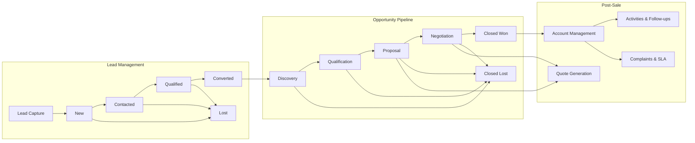
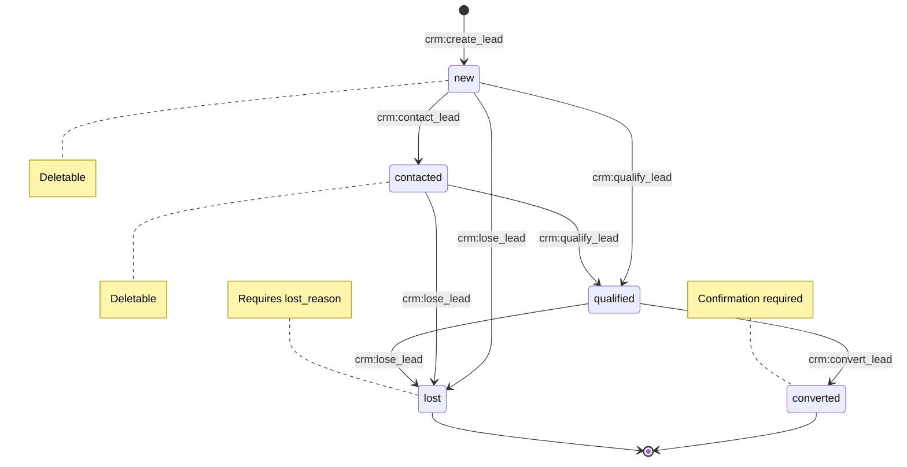
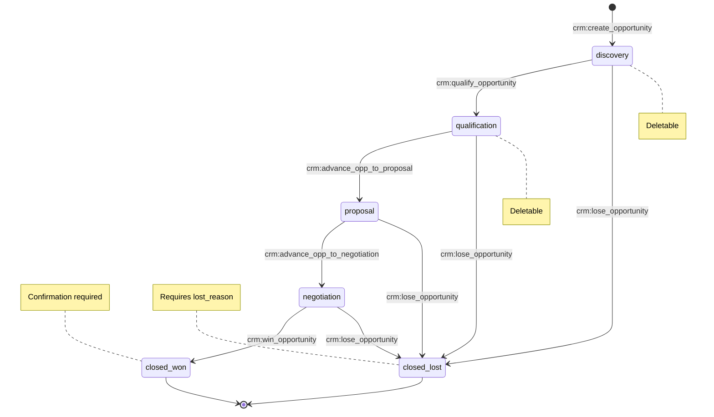
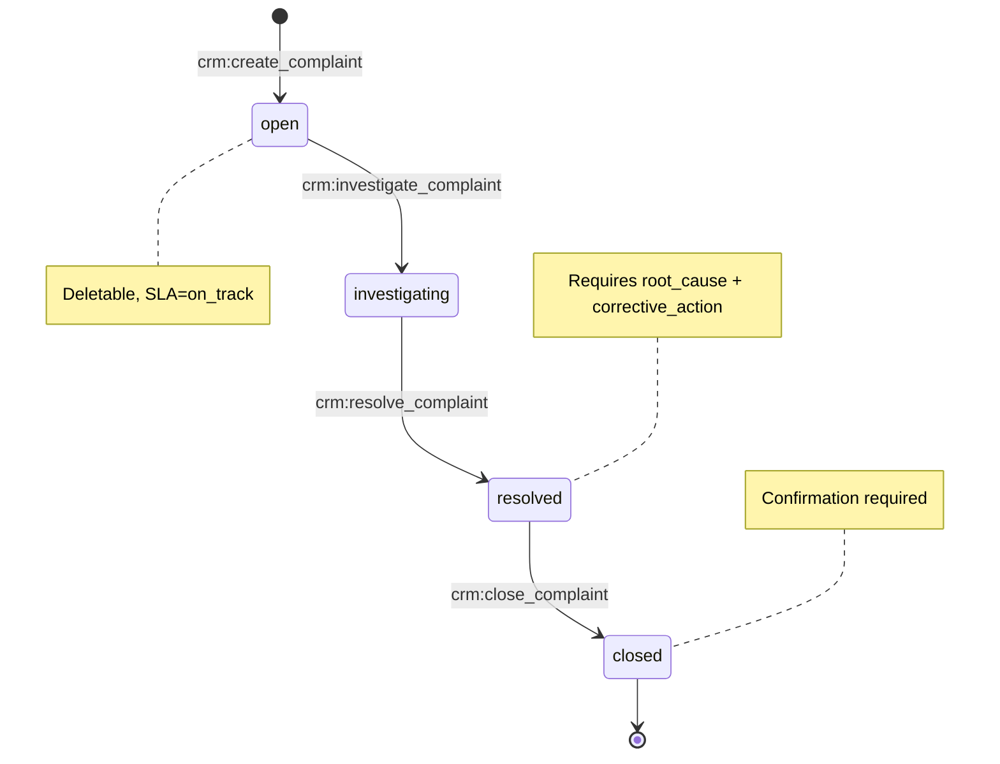

# Customer Relationship Management (CRM)

> Complete CRM solution: leads, opportunities, accounts, contacts, activities, quotes, campaigns, complaints, SLA tracking, and email management -- all built through JSON DSL configuration.

## Business Overview

### Problem

Sales teams struggle with fragmented tools: spreadsheets for leads, email for follow-ups, separate systems for quotes and complaints. Data silos lead to lost opportunities, poor customer visibility, and zero accountability.

### Target Users

- **Sales Representatives** -- manage leads, opportunities, and customer relationships
- **Sales Managers** -- forecast revenue, monitor pipeline health, and allocate resources
- **Service Agents** -- handle customer complaints with SLA tracking
- **Marketing Teams** -- run campaigns, track lead sources, and measure ROI

### Key Capabilities

- Lead capture from 10+ sources (web forms, email, social media, exhibitions, webhooks)
- Lead scoring with AI-powered evaluation
- Lead qualification lifecycle: New -> Contacted -> Qualified -> Converted / Lost
- Opportunity pipeline: Discovery -> Qualification -> Proposal -> Negotiation -> Won/Lost
- Account 360-degree view with contacts, opportunities, activities, and complaints
- Multi-currency support with exchange rate tracking
- Quote generation linked to opportunities with line-item pricing
- Unified activity tracking: tasks, calls, emails, meetings, notes, visits
- Activity association graph linking activities to any CRM object
- Customer complaint management with SLA policies and breach tracking
- Marketing campaign management with member tracking and performance metrics
- Email templates and email log tracking
- Dashboard with KPI cards, pipeline charts, trend analysis, and win/loss ratios
- Field-level permission control on sensitive data (phone, email, amounts)
- Role-based access: CRM Admin, Sales Rep, Service Agent
- Full bilingual support (English / Chinese)

### Workflow Diagram



## Data Model

### Entity Relationship Diagram

```mermaid
erDiagram
    crm_account ||--o{ crm_contact : "has contacts"
    crm_account ||--o{ crm_opportunity : "has opportunities"
    crm_account ||--o{ crm_complaint : "has complaints"
    crm_lead ||--o| crm_opportunity : "converts to"
    crm_opportunity ||--o{ crm_opportunity_line : "has line items"
    crm_opportunity ||--o{ crm_opp_contact : "has contacts"
    crm_opportunity ||--o{ crm_quote : "has quotes"
    crm_contact ||--o{ crm_opp_contact : "linked via"
    crm_quote ||--o{ crm_quote_line : "has line items"
    crm_activity ||--o{ crm_activity_relation : "linked to objects"
    crm_campaign ||--o{ crm_campaign_member : "has members"
    crm_campaign ||--o{ crm_campaign_metric : "has metrics"
    crm_complaint }o--|| crm_sla_policy : "governed by"
    crm_complaint ||--o{ crm_sla_breach : "may breach"
    crm_email_template ||--o{ crm_email_log : "used in"

    crm_account {
        string crm_acc_code PK "ACC-{date}-{seq}"
        string crm_acc_name "required"
        string crm_acc_industry
        string crm_acc_website
        string crm_acc_phone
        text crm_acc_address
        enum crm_acc_rating "A/B/C/D"
        enum crm_acc_status "active/inactive"
        string crm_acc_owner
    }

    crm_lead {
        string crm_lead_code PK "LEAD-{date}-{seq}"
        string crm_lead_company "required"
        string crm_lead_contact_name "required"
        string crm_lead_contact_phone
        string crm_lead_contact_email
        enum crm_lead_source "exhibition/website/..."
        integer crm_lead_score
        enum crm_lead_status "new/contacted/qualified/converted/lost"
        text crm_lead_requirement
        string crm_lead_assigned_to
    }

    crm_opportunity {
        string crm_opp_code PK "OPP-{date}-{seq}"
        string crm_opp_name "required"
        reference crm_opp_account_id "-> crm_account"
        reference crm_opp_lead_id "-> crm_lead"
        enum crm_opp_stage "discovery/.../closed_won/closed_lost"
        money crm_opp_expected_amount
        string crm_opp_currency_code
        decimal crm_opp_exchange_rate
        datetime crm_opp_expected_close_date
        decimal crm_opp_probability
        string crm_opp_owner
    }

    crm_contact {
        reference crm_ct_account_id "-> crm_account (required)"
        string crm_ct_name "required"
        string crm_ct_title
        string crm_ct_email
        string crm_ct_phone
        string crm_ct_mobile
        boolean crm_ct_is_primary
    }

    crm_activity {
        enum crm_act_type "task/call/email/meeting/note/visit"
        string crm_act_subject "required"
        text crm_act_content "richtext"
        datetime crm_act_date "required"
        string crm_act_owner
        json crm_act_ext "JSONB virtual fields"
    }

    crm_complaint {
        string crm_cmp_code PK "CMP-{date}-{seq}"
        reference crm_cmp_account_id "-> crm_account"
        enum crm_cmp_type "product/service/delivery/billing/other"
        enum crm_cmp_severity
        enum crm_cmp_status "open/investigating/resolved/closed"
        reference crm_cmp_sla_policy_id "-> crm_sla_policy"
    }

    crm_quote {
        string crm_qt_code PK
        reference crm_qt_opportunity_id "-> crm_opportunity"
        reference crm_qt_account_id "-> crm_account"
        enum crm_qt_status "draft/reviewed/sent/accepted/rejected/expired"
    }

    crm_campaign {
        string crm_cpn_code PK
        string crm_cpn_name
        enum crm_cpn_status
        string crm_cpn_owner
    }

    crm_sla_policy {
        string crm_sla_name
        string crm_sla_priority_level
    }

    crm_opportunity_line {
        string crm_ol_product_name
        integer crm_ol_quantity
        decimal crm_ol_unit_price
        decimal crm_ol_discount
        decimal crm_ol_amount
    }

    crm_opp_contact {
        reference crm_oc_opportunity_id "-> crm_opportunity"
        reference crm_oc_contact_id "-> crm_contact"
        string crm_oc_role
        boolean crm_oc_is_primary
    }

    crm_activity_relation {
        reference crm_ar_activity_id "-> crm_activity"
        string crm_ar_object_type "account/contact/opportunity/..."
        string crm_ar_object_id
        string crm_ar_role
    }

    crm_quote_line {
        string crm_ql_product_name
        decimal crm_ql_unit_price
        decimal crm_ql_amount
    }

    crm_campaign_member {
        string crm_cm_member_name
    }

    crm_campaign_metric {
        date crm_cmet_metric_date
    }

    crm_sla_breach {
        string crm_sb_breach_type
    }

    crm_email_template {
        string crm_et_name
        string crm_et_category
    }

    crm_email_log {
        string crm_el_subject
        string crm_el_status
    }
```



### Models Reference

| Model | Code | Category | Description | Icon |
|-------|------|----------|-------------|------|
| Account | `crm_account` | master | Customer company (Graph Root) | Building |
| Contact | `crm_contact` | master | Contact person linked to an account | User |
| Lead | `crm_lead` | entity | Sales lead before qualification | Radar |
| Opportunity | `crm_opportunity` | entity | Sales opportunity with pipeline stages | TrendingUp |
| Opportunity Line | `crm_opportunity_line` | entity | Product/service line items within an opportunity | List |
| Opportunity Contact | `crm_opp_contact` | reference | Opportunity-Contact junction (M:N) | Link |
| Activity | `crm_activity` | entity | Unified activity: Task, Call, Email, Meeting, Note, Visit | Activity |
| Activity Relation | `crm_activity_relation` | reference | Activity Association Graph edge | GitBranch |
| Complaint | `crm_complaint` | document | Customer complaint / service ticket | AlertTriangle |
| Quote | `crm_quote` | document | Sales quotation linked to opportunity | FileText |
| Quote Line | `crm_quote_line` | entity | Line items within a quote | List |
| Campaign | `crm_campaign` | master | Marketing campaign for lead generation | Megaphone |
| Campaign Member | `crm_campaign_member` | reference | Links campaign to leads/contacts | UserPlus |
| Campaign Metric | `crm_campaign_metric` | transaction | Campaign performance metrics | BarChart2 |
| Email Template | `crm_email_template` | master | Reusable email templates for outreach | Mail |
| Email Log | `crm_email_log` | transaction | Log of sent/received CRM emails | MailOpen |
| SLA Policy | `crm_sla_policy` | master | SLA rules for complaint response times | Clock |
| SLA Breach | `crm_sla_breach` | transaction | SLA breach log for violations | AlertOctagon |

### Models Configuration

```json
[
  {
    "code": "crm_account",
    "displayName:zh-CN": "客户",
    "displayName:en": "Account",
    "description": "CRM customer company (Graph Root)",
    "modelType": "entity",
    "modelCategory": "master",
    "extension": {
      "icon": "Building",
      "category": "crm",
      "titleField": "crm_acc_name",
      "subtitleField": "crm_acc_code",
      "dataScope": {
        "ownerField": "crm_acc_owner",
        "departmentField": null
      }
    }
  },
  {
    "code": "crm_lead",
    "displayName:zh-CN": "线索",
    "displayName:en": "Lead",
    "description": "Sales lead before qualification",
    "modelType": "entity",
    "modelCategory": "entity",
    "extension": {
      "icon": "Radar",
      "category": "crm",
      "titleField": "crm_lead_company",
      "subtitleField": "crm_lead_code",
      "dataScope": {
        "ownerField": "crm_lead_assigned_to",
        "departmentField": null
      }
    }
  },
  {
    "code": "crm_opportunity",
    "displayName:zh-CN": "商机",
    "displayName:en": "Opportunity",
    "description": "Sales opportunity with pipeline stages",
    "modelType": "entity",
    "modelCategory": "entity",
    "extension": {
      "icon": "TrendingUp",
      "category": "crm",
      "titleField": "crm_opp_name",
      "subtitleField": "crm_opp_code",
      "dataScope": {
        "ownerField": "crm_opp_owner",
        "departmentField": null
      }
    }
  },
  {
    "code": "crm_activity",
    "displayName:zh-CN": "活动",
    "displayName:en": "Activity",
    "description": "Unified activity: Task, Call, Email, Meeting, Note, Visit",
    "modelType": "entity",
    "modelCategory": "entity",
    "extension": {
      "icon": "Activity",
      "category": "crm",
      "titleField": "crm_act_subject",
      "subtitleField": "crm_act_type",
      "dataScope": {
        "ownerField": "crm_act_owner",
        "departmentField": null
      }
    }
  },
  {
    "code": "crm_complaint",
    "displayName:zh-CN": "投诉",
    "displayName:en": "Complaint",
    "description": "Customer complaint / service ticket",
    "modelType": "entity",
    "modelCategory": "document",
    "extension": {
      "icon": "AlertTriangle",
      "category": "crm",
      "titleField": "crm_cmp_code",
      "subtitleField": "crm_cmp_status"
    }
  },
  {
    "code": "crm_quote",
    "displayName:zh-CN": "报价单",
    "displayName:en": "Quote",
    "description": "Sales quotation linked to opportunity",
    "modelType": "entity",
    "modelCategory": "document",
    "extension": {
      "icon": "FileText",
      "category": "crm",
      "titleField": "crm_qt_code",
      "subtitleField": "crm_qt_status",
      "dataScope": {
        "ownerField": "crm_qt_owner",
        "departmentField": null
      }
    }
  }
]
```

## Fields Deep Dive

### Account Fields

| Field Code | Label | Data Type | Required | Searchable | Sortable | Notes |
|-----------|-------|-----------|----------|------------|----------|-------|
| `crm_acc_code` | Account Code | string | Yes | Yes | Yes | Auto-generated: `ACC-{yyyyMMdd}-{seq}` |
| `crm_acc_name` | Account Name | string | Yes | Yes | Yes | Max 200 chars |
| `crm_acc_industry` | Industry | string | No | Yes | No | Max 100 chars |
| `crm_acc_website` | Website | string | No | No | No | |
| `crm_acc_phone` | Phone | string | No | No | No | Field-level permission: view restricted to admin/sales_manager/sales_rep |
| `crm_acc_address` | Address | text | No | No | No | |
| `crm_acc_rating` | Rating | enum | No | Yes | No | Dict: `crm_account_rating` (A/B/C/D) |
| `crm_acc_owner` | Owner | string | No | No | No | Auto-set to current user on create |
| `crm_acc_status` | Status | enum | No | Yes | No | Dict: `crm_account_status` (active/inactive) |
| `crm_acc_remark` | Remark | text | No | No | No | |

### Lead Fields

| Field Code | Label | Data Type | Required | Notes |
|-----------|-------|-----------|----------|-------|
| `crm_lead_code` | Lead Code | string | Yes | Auto-generated: `LEAD-{yyyyMMdd}-{seq}` |
| `crm_lead_company` | Company Name | string | Yes | Searchable, sortable |
| `crm_lead_contact_name` | Contact Name | string | Yes | Searchable |
| `crm_lead_contact_phone` | Contact Phone | string | No | Field-level permission restricted |
| `crm_lead_contact_email` | Contact Email | string | No | Field-level permission restricted |
| `crm_lead_source` | Lead Source | enum | No | Dict: `crm_lead_source` (exhibition/website/referral/...) |
| `crm_lead_score` | Score | integer | No | Sortable, used by AI scoring |
| `crm_lead_status` | Status | enum | No | Dict: `crm_lead_status` (new/contacted/qualified/converted/lost) |
| `crm_lead_requirement` | Requirement | text | No | |
| `crm_lead_campaign` | Campaign | string | No | |
| `crm_lead_assigned_to` | Assigned To | string | No | Owner field for data scope |
| `crm_lead_lost_reason` | Lost Reason | text | No | Required when marking as lost |

### Opportunity Fields

| Field Code | Label | Data Type | Required | Notes |
|-----------|-------|-----------|----------|-------|
| `crm_opp_code` | Opportunity Code | string | Yes | Auto-generated: `OPP-{yyyyMMdd}-{seq}` |
| `crm_opp_name` | Opportunity Name | string | Yes | Searchable, sortable |
| `crm_opp_account_id` | Account | reference | No | References `crm_account`, displays `crm_acc_name` |
| `crm_opp_lead_id` | Source Lead | reference | No | References `crm_lead` |
| `crm_opp_stage` | Stage | enum | No | Dict: `crm_opp_stage`, default: `discovery` |
| `crm_opp_currency_code` | Currency | string | No | 3-char ISO code |
| `crm_opp_exchange_rate` | Exchange Rate | decimal(18,8) | No | Read-only, auto-populated |
| `crm_opp_expected_amount` | Expected Amount | money | No | Field-level permission restricted |
| `crm_opp_expected_amount_base` | Expected Amount (Base) | decimal(14,2) | No | Read-only, auto-calculated |
| `crm_opp_expected_close_date` | Expected Close Date | datetime | No | Sortable |
| `crm_opp_probability` | Probability (%) | decimal | No | |
| `crm_opp_owner` | Owner | string | No | Data scope owner field |
| `crm_opp_notes` | Notes | text | No | |
| `crm_opp_lost_reason` | Lost Reason | text | No | Input required on lose transition |

### Activity Fields (with JSONB Virtual Fields)

The Activity model demonstrates AuraBoot's JSONB virtual field capability. Type-specific fields (task status, call direction, meeting location) are stored in a single `crm_act_ext` JSON column but appear as independent fields in the UI:

| Field Code | Label | Data Type | Storage | Notes |
|-----------|-------|-----------|---------|-------|
| `crm_act_type` | Activity Type | enum | Column | task/call/email/meeting/note/visit |
| `crm_act_subject` | Subject | string | Column | Required, searchable |
| `crm_act_content` | Content | text | Column | Rendered as rich text editor |
| `crm_act_date` | Activity Date | datetime | Column | Required, sortable |
| `crm_act_ext` | Extension Data | json | Column | Host JSONB column |
| `crm_act_status` | Task Status | enum | JSONB `crm_act_ext.status` | open/in_progress/completed/cancelled |
| `crm_act_priority` | Priority | enum | JSONB `crm_act_ext.priority` | low/medium/high/urgent |
| `crm_act_due_date` | Due Date | date | JSONB `crm_act_ext.dueDate` | For tasks |
| `crm_act_assignee` | Assignee | string | JSONB `crm_act_ext.assignee` | For tasks |
| `crm_act_duration` | Duration (min) | integer | JSONB `crm_act_ext.duration` | For calls/meetings |
| `crm_act_direction` | Call Direction | enum | JSONB `crm_act_ext.direction` | inbound/outbound |
| `crm_act_location` | Location | string | JSONB `crm_act_ext.location` | For meetings/visits |
| `crm_act_start_time` | Start Time | datetime | JSONB `crm_act_ext.startTime` | For meetings |
| `crm_act_end_time` | End Time | datetime | JSONB `crm_act_ext.endTime` | For meetings |

JSONB virtual field configuration example:

```json
{
  "code": "crm_act_status",
  "displayName:en": "Task Status",
  "dataType": "enum",
  "dictCode": "crm_task_status",
  "extension": {
    "jsonbColumn": "crm_act_ext",
    "jsonbPath": "status"
  }
}
```

### Enum/Dictionary Definitions

| Dict Code | Name | Values |
|-----------|------|--------|
| `crm_account_status` | Account Status | `active` (green), `inactive` (gray) |
| `crm_account_rating` | Account Rating | `A` - Key Account, `B` - Important, `C` - Normal, `D` - Low Priority |
| `crm_lead_status` | Lead Status | `new`, `contacted`, `qualified`, `converted`, `lost` |
| `crm_lead_source` | Lead Source | `exhibition`, `website`, `referral`, `cold_call`, `social_media`, `web_form`, `email_inbound`, `wechat_work`, `facebook_ads`, `generic_webhook`, `other` |
| `crm_opp_stage` | Opportunity Stage | `discovery`, `qualification`, `proposal`, `negotiation`, `closed_won`, `closed_lost` |
| `crm_activity_type` | Activity Type | `task`, `call`, `email`, `meeting`, `note`, `visit` |
| `crm_activity_source` | Activity Source | `manual`, `email_sync`, `calendar_sync`, `api`, `automation` |
| `crm_task_status` | Task Status | `open`, `in_progress`, `completed`, `cancelled` |
| `crm_task_priority` | Task Priority | `low`, `medium`, `high`, `urgent` |
| `crm_complaint_status` | Complaint Status | `open`, `investigating`, `resolved`, `closed` |
| `crm_complaint_type` | Complaint Type | `product`, `service`, `delivery`, `billing`, `other` |

## Commands & Business Logic

### Command Map

| Command Code | Type | Model | Description |
|-------------|------|-------|-------------|
| `crm:create_account` | create | crm_account | Auto-generates code, sets owner to current user, status=active |
| `crm:update_account` | update | crm_account | Edit all account fields |
| `crm:delete_account` | delete | crm_account | With confirmation dialog |
| `crm:create_lead` | create | crm_lead | Auto-generates code, status=new |
| `crm:update_lead` | update | crm_lead | Edit all lead fields |
| `crm:contact_lead` | state_transition | crm_lead | new -> contacted |
| `crm:qualify_lead` | state_transition | crm_lead | new/contacted -> qualified |
| `crm:convert_lead` | state_transition | crm_lead | qualified -> converted (with confirmation) |
| `crm:lose_lead` | state_transition | crm_lead | any active -> lost (requires lost_reason) |
| `crm:delete_lead` | delete | crm_lead | Only when status IN [new, contacted] |
| `crm:create_opportunity` | create | crm_opportunity | Auto-generates code, stage=discovery |
| `crm:update_opportunity` | update | crm_opportunity | Edit opportunity fields |
| `crm:qualify_opportunity` | state_transition | crm_opportunity | discovery -> qualification |
| `crm:advance_opp_to_proposal` | state_transition | crm_opportunity | qualification -> proposal |
| `crm:advance_opp_to_negotiation` | state_transition | crm_opportunity | proposal -> negotiation |
| `crm:win_opportunity` | state_transition | crm_opportunity | negotiation -> closed_won (with confirmation) |
| `crm:lose_opportunity` | state_transition | crm_opportunity | any active -> closed_lost (requires lost_reason) |
| `crm:delete_opportunity` | delete | crm_opportunity | Only when stage IN [discovery, qualification] |
| `crm:create_complaint` | create | crm_complaint | Auto-generates code, status=open, sla_status=on_track |
| `crm:investigate_complaint` | state_transition | crm_complaint | open -> investigating |
| `crm:resolve_complaint` | state_transition | crm_complaint | investigating -> resolved (requires root_cause, corrective_action) |
| `crm:close_complaint` | state_transition | crm_complaint | resolved -> closed (with confirmation) |
| `crm:delete_complaint` | delete | crm_complaint | Only when status = open |

### Lead State Machine



### Opportunity State Machine



### Complaint State Machine



### Transition Rules

| From State | To State | Command | Preconditions | Input Required |
|-----------|----------|---------|---------------|----------------|
| discovery | qualification | `crm:qualify_opportunity` | -- | -- |
| qualification | proposal | `crm:advance_opp_to_proposal` | -- | -- |
| proposal | negotiation | `crm:advance_opp_to_negotiation` | -- | -- |
| negotiation | closed_won | `crm:win_opportunity` | -- | Confirmation |
| discovery/qualification/proposal/negotiation | closed_lost | `crm:lose_opportunity` | -- | `crm_opp_lost_reason` + Confirmation |
| -- | -- | `crm:delete_opportunity` | stage IN [discovery, qualification] | Confirmation |

### Auto-Set Fields

Commands can auto-populate fields on record creation:

```json
{
  "autoSetFields": {
    "crm_opp_code": {
      "strategy": "auto_generate",
      "pattern": "OPP-{yyyyMMdd}-{seq}"
    },
    "crm_opp_stage": {
      "strategy": "fixed_value",
      "value": "discovery"
    }
  }
}
```

Supported strategies:
- `auto_generate` -- sequential code with date pattern
- `fixed_value` -- constant initial value
- `current_username` -- set to the authenticated user

### Create Account Command (Complete JSON)

```json
{
  "code": "crm:create_account",
  "displayName:zh-CN": "新建客户",
  "displayName:en": "Create Account",
  "type": "create",
  "modelCode": "crm_account",
  "inputFields": [
    "crm_acc_name", "crm_acc_industry", "crm_acc_website",
    "crm_acc_phone", "crm_acc_address", "crm_acc_rating", "crm_acc_remark"
  ],
  "autoSetFields": {
    "crm_acc_code": { "strategy": "auto_generate", "pattern": "ACC-{yyyyMMdd}-{seq}" },
    "crm_acc_owner": { "strategy": "current_username" },
    "crm_acc_status": { "strategy": "fixed_value", "value": "active" }
  },
  "permissions": ["CRM.account.manage"],
  "agent_hint": "Create a new crm account record. Key inputs: name, industry, website, phone, address. Auto-generated: code, owner, status.",
  "cmd_risk_level": "L1"
}
```

### AI Agent Hints

Every command includes an `agent_hint` field that enables LLM-powered automation. The AI agent uses these hints to understand command semantics:

```json
{
  "agent_hint": "Transition crm opportunity stage from NEGOTIATION to CLOSED_WON.",
  "cmd_risk_level": "L1"
}
```

Risk levels: `L0` (read-only), `L1` (safe mutation), `L4` (destructive/irreversible).

## Pages & User Interface

### Page Inventory

| Page Key | Kind | Model | Description |
|----------|------|-------|-------------|
| `crm_dashboard` | dashboard | crm_opportunity | CRM overview with KPI cards, charts, and recent data |
| `crm_sales_forecast` | dashboard | crm_opportunity | Sales forecast and pipeline analysis |
| `crm_account_list` | list | crm_account | Account list with status tabs |
| `crm_account_form` | form | crm_account | Account create/edit form |
| `crm_account_detail` | detail | crm_account | Account detail with contacts, opportunities |
| `crm_account_360` | detail | crm_account | Account 360-degree view |
| `crm_lead_list` | list | crm_lead | Lead list with status tabs and AI scoring |
| `crm_lead_form` | form | crm_lead | Lead create/edit form |
| `crm_lead_detail` | detail | crm_lead | Lead detail view |
| `crm_lead_conversion` | form | crm_lead | Lead-to-opportunity conversion form |
| `crm_opportunity_list` | list | crm_opportunity | Opportunity list with stage tabs |
| `crm_opportunity_form` | form | crm_opportunity | Opportunity create/edit form |
| `crm_opportunity_detail` | detail | crm_opportunity | Opportunity detail with line items, contacts, quotes, activities |
| `crm_pipeline_board` | list | crm_opportunity | Kanban board view of pipeline |
| `crm_contact_list` | list | crm_contact | Contact list |
| `crm_contact_form` | form | crm_contact | Contact create/edit form |
| `crm_contact_detail` | detail | crm_contact | Contact detail view |
| `crm_activity_list` | list | crm_activity | Activity list |
| `crm_activity_form` | form | crm_activity | Activity create/edit form |
| `crm_activity_detail` | detail | crm_activity | Activity detail view |
| `crm_my_tasks_list` | list | crm_activity | My tasks (filtered to current user) |
| `crm_quote_list` | list | crm_quote | Quote list |
| `crm_quote_form` | form | crm_quote | Quote create/edit form |
| `crm_quote_detail` | detail | crm_quote | Quote detail with line items |
| `crm_complaint_list` | list | crm_complaint | Complaint list with status tabs |
| `crm_complaint_form` | form | crm_complaint | Complaint create/edit form |
| `crm_complaint_detail` | detail | crm_complaint | Complaint detail with SLA info |
| `crm_campaign_list` | list | crm_campaign | Campaign list |
| `crm_campaign_form` | form | crm_campaign | Campaign create/edit form |
| `crm_campaign_detail` | detail | crm_campaign | Campaign detail with members and metrics |
| `crm_email_template_list` | list | crm_email_template | Email template list |
| `crm_email_template_form` | form | crm_email_template | Template create/edit form |
| `crm_email_log_list` | list | crm_email_log | Email log list |
| `crm_sla_policy_list` | list | crm_sla_policy | SLA policy list |
| `crm_sla_policy_form` | form | crm_sla_policy | SLA policy create/edit form |
| `crm_sla_policy_detail` | detail | crm_sla_policy | SLA policy detail |
| `crm_sla_breach_list` | list | crm_sla_breach | SLA breach log |

### List Page Configuration (Opportunity)

List pages use the V2 flat block format with `tabs`, `toolbar`, and `table` blocks:

```json
{
  "pageKey": "crm_opportunity_list",
  "name:en": "Opportunities",
  "modelCode": "crm_opportunity",
  "kind": "list",
  "schemaVersion": 2,
  "layout": { "type": "grid", "cols": 12 },
  "blocks": [
    {
      "id": "crm_opp_tabs",
      "blockType": "tabs",
      "tabs": [
        { "key": "all", "label": { "en": "All", "zh-CN": "全部" }, "filter": null },
        { "key": "qualification", "label": { "en": "Qualification" },
          "filter": { "field": "crm_opp_stage", "value": "qualification", "operator": "EQ" } },
        { "key": "proposal", "label": { "en": "Proposal" },
          "filter": { "field": "crm_opp_stage", "value": "proposal", "operator": "EQ" } },
        { "key": "negotiation", "label": { "en": "Negotiation" },
          "filter": { "field": "crm_opp_stage", "value": "negotiation", "operator": "EQ" } },
        { "key": "closed_won", "label": { "en": "Won" },
          "filter": { "field": "crm_opp_stage", "value": "closed_won", "operator": "EQ" } },
        { "key": "closed_lost", "label": { "en": "Lost" },
          "filter": { "field": "crm_opp_stage", "value": "closed_lost", "operator": "EQ" } }
      ]
    },
    {
      "id": "crm_opp_toolbar",
      "blockType": "toolbar",
      "buttons": [{
        "code": "create", "primary": true,
        "permissionCode": "CRM.opportunity.manage",
        "action": { "type": "navigate", "to": "crm_opportunity_form", "command": "crm:create_opportunity" }
      }]
    },
    {
      "id": "crm_opp_table",
      "blockType": "table",
      "columns": [
        { "field": "crm_opp_code", "width": 150, "sortable": true },
        { "field": "crm_opp_name", "width": 200, "sortable": true },
        { "field": "crm_opp_account_id", "width": 180 },
        { "field": "crm_opp_stage", "width": 120, "renderType": "tag", "dictCode": "crm_opp_stage", "editable": true },
        { "field": "crm_opp_expected_amount", "width": 140, "sortable": true, "editable": true },
        { "field": "crm_opp_expected_close_date", "width": 140, "valueType": "date", "editable": true },
        { "field": "crm_opp_probability", "width": 100, "editable": true },
        { "field": "crm_opp_owner", "width": 120, "editable": true },
        {
          "field": "actions", "isActionColumn": true,
          "buttons": [
            { "code": "view", "action": { "type": "navigate", "to": "crm_opportunity_detail" } },
            { "code": "edit", "permissionCode": "CRM.opportunity.manage",
              "action": { "type": "navigate", "to": "crm_opportunity_form" } },
            { "code": "delete", "danger": true, "permissionCode": "CRM.opportunity.manage",
              "confirm": "delete.confirm",
              "action": { "type": "command", "command": "crm:delete_opportunity" } }
          ]
        }
      ],
      "searchFields": ["crm_opp_name", "crm_opp_code"],
      "defaultSort": { "field": "created_at", "order": "desc" }
    }
  ],
  "extension": { "enableMultiView": true }
}
```

Key features:
- **Status tabs** filter the table by opportunity stage
- **Inline editing** on stage, amount, close date, probability, and owner columns
- **Permission-gated actions** -- edit and delete require `CRM.opportunity.manage`
- **Multi-view** support (list/kanban toggle)

### Form Page Configuration (Opportunity)

```json
{
  "pageKey": "crm_opportunity_form",
  "name:en": "Opportunity Form",
  "modelCode": "crm_opportunity",
  "kind": "form",
  "schemaVersion": 2,
  "layout": { "type": "grid", "cols": 12, "gap": 16 },
  "blocks": [
    {
      "id": "basic",
      "blockType": "form-section",
      "title": { "en-US": "Opportunity Information" },
      "fields": [
        { "field": "crm_opp_name", "colSpan": 6 },
        { "field": "crm_opp_account_id", "colSpan": 6 },
        { "field": "crm_opp_lead_id", "colSpan": 6 },
        { "field": "crm_opp_expected_amount", "colSpan": 6 },
        { "field": "crm_opp_currency_code", "colSpan": 6 },
        { "field": "crm_opp_expected_close_date", "colSpan": 6 },
        { "field": "crm_opp_probability", "colSpan": 6 },
        { "field": "crm_opp_owner", "colSpan": 6 },
        { "field": "crm_opp_notes", "colSpan": 12 }
      ]
    },
    {
      "id": "buttons",
      "blockType": "form-buttons",
      "buttons": [
        { "code": "submit", "primary": true,
          "action": { "type": "command", "command": "crm:update_opportunity" } },
        { "code": "cancel" }
      ]
    }
  ]
}
```

### Detail Page with Tabs (Opportunity)

The opportunity detail page demonstrates tabbed sub-tables with three different data-fetching modes:

```json
{
  "pageKey": "crm_opportunity_detail",
  "name:en": "Opportunity Detail",
  "modelCode": "crm_opportunity",
  "kind": "detail",
  "schemaVersion": 2,
  "layout": { "type": "stack" },
  "blocks": [
    {
      "id": "crm_opportunity_tabs",
      "blockType": "tabs",
      "tabs": [
        {
          "key": "overview",
          "label": { "en-US": "Overview" },
          "blocks": [{
            "id": "section_basic",
            "blockType": "form-section",
            "title": { "en-US": "Opportunity Information" },
            "columns": 2,
            "fields": [
              { "field": "crm_opp_code", "readOnly": true },
              { "field": "crm_opp_name", "readOnly": true },
              { "field": "crm_opp_account_id", "readOnly": true },
              { "field": "crm_opp_stage", "readOnly": true },
              { "field": "crm_opp_expected_amount", "readOnly": true },
              { "field": "crm_opp_currency_code", "readOnly": true },
              { "field": "crm_opp_exchange_rate", "readOnly": true },
              { "field": "crm_opp_expected_amount_base", "readOnly": true },
              { "field": "crm_opp_expected_close_date", "readOnly": true },
              { "field": "crm_opp_probability", "readOnly": true },
              { "field": "crm_opp_owner", "readOnly": true },
              { "field": "crm_opp_notes", "span": 2, "readOnly": true }
            ]
          }]
        },
        {
          "key": "line_items",
          "label": { "en-US": "Line Items" },
          "blocks": [{
            "id": "block_line_items",
            "blockType": "sub-table",
            "subTable": {
              "childModel": "crm_opportunity_line",
              "parentField": "crm_ol_opportunity_id",
              "readOnly": false,
              "columns": [
                { "field": "crm_ol_product_name", "width": 200 },
                { "field": "crm_ol_quantity", "width": 100 },
                { "field": "crm_ol_unit_price", "width": 120 },
                { "field": "crm_ol_discount", "width": 100 },
                { "field": "crm_ol_amount", "width": 120 }
              ],
              "summary": {
                "fields": [{
                  "field": "crm_ol_amount",
                  "aggregation": "sum",
                  "label": { "en-US": "Total" }
                }]
              }
            }
          }]
        },
        {
          "key": "activities",
          "label": { "en-US": "Activities" },
          "blocks": [{
            "id": "block_activities",
            "blockType": "sub-table",
            "subTable": {
              "dataSource": {
                "type": "api",
                "url": "/api/datasource/list",
                "params": {
                  "datasourceId": "nq:crm_activities_by_object",
                  "objectType": "opportunity",
                  "objectId": "${recordId}"
                }
              },
              "readOnly": true,
              "columns": [
                { "field": "crm_act_type", "width": 100, "renderType": "tag" },
                { "field": "crm_act_subject", "width": 200 },
                { "field": "crm_act_date", "width": 160 },
                { "field": "crm_act_owner", "width": 120 }
              ]
            }
          }]
        }
      ]
    },
    {
      "id": "crm_opp_detail_toolbar",
      "blockType": "toolbar",
      "buttons": [
        { "code": "edit", "icon": "Edit", "action": { "type": "navigate", "to": "crm_opportunity_form" } },
        { "code": "qualify", "action": { "type": "state_transition", "command": "crm:qualify_opportunity" } },
        { "code": "advance_proposal", "action": { "type": "command", "command": "crm:advance_opp_to_proposal" } },
        { "code": "advance_negotiation", "action": { "type": "command", "command": "crm:advance_opp_to_negotiation" } },
        { "code": "win", "primary": true, "action": { "type": "state_transition", "command": "crm:win_opportunity" } },
        { "code": "lose", "danger": true, "action": { "type": "state_transition", "command": "crm:lose_opportunity" } },
        {
          "code": "generate_quote", "icon": "FileText",
          "visibleWhen": "['proposal','negotiation','closed_won'].includes(record.crm_opp_stage)",
          "action": { "type": "navigate", "to": "/p/crm-quote/new?dv.crm_qt_opportunity_id={pid}" }
        }
      ]
    }
  ]
}
```

Sub-table data modes demonstrated:
1. **foreignKey direct query** -- Line Items use `childModel` + `parentField`
2. **dataSource API** -- Activities use a Named Query via `/api/datasource/list`
3. **read-only reference** -- Quotes tab shows related quotes without edit capability

### Dashboard Configuration

The CRM dashboard demonstrates all dashboard block types:

```json
{
  "pageKey": "crm_dashboard",
  "name:en": "CRM Dashboard",
  "kind": "dashboard",
  "schemaVersion": 2,
  "layout": { "type": "grid", "cols": 12, "gap": 16 },
  "blocks": [
    {
      "id": "block_kpi_cards",
      "blockType": "stat-card",
      "layout": { "colSpan": 12 },
      "dataSource": {
        "type": "api",
        "url": "/api/datasource/list",
        "params": { "datasourceId": "nq:crm_dashboard_kpi", "format": "records", "maxItems": "1" }
      },
      "cards": [
        { "field": "new_leads", "label": { "en": "New Leads" }, "icon": "IconRadar", "color": "#3b82f6" },
        { "field": "open_opportunities", "label": { "en": "Open Opportunities" }, "icon": "IconTrendingUp", "color": "#f59e0b" },
        { "field": "pipeline_value", "label": { "en": "Pipeline Value" }, "icon": "IconCurrencyDollar", "color": "#10b981", "format": "currency" },
        { "field": "won_revenue", "label": { "en": "Won Revenue" }, "icon": "IconTrophy", "color": "#8b5cf6", "format": "currency" },
        { "field": "active_accounts", "label": { "en": "Active Accounts" }, "icon": "IconBuilding", "color": "#06b6d4" },
        { "field": "pending_complaints", "label": { "en": "Pending Complaints" }, "icon": "IconAlertTriangle", "color": "#ef4444" }
      ]
    },
    {
      "id": "chart_opp_pipeline",
      "blockType": "chart",
      "chartType": "bar",
      "layout": { "colSpan": 6 },
      "title": { "en": "Opportunity Pipeline" },
      "chartConfig": {
        "orientation": "horizontal",
        "dataSource": {
          "type": "namedQuery",
          "queryCode": "crm_opportunity_pipeline_stats",
          "dimensions": ["stage"],
          "metrics": [{ "field": "count", "aggregation": "sum" }]
        }
      }
    },
    {
      "id": "chart_lead_source",
      "blockType": "chart",
      "chartType": "pie",
      "layout": { "colSpan": 6 },
      "title": { "en": "Lead Source Distribution" },
      "chartConfig": {
        "dataSource": {
          "type": "namedQuery",
          "queryCode": "crm_lead_source_distribution",
          "dimensions": ["label"],
          "metrics": [{ "field": "value", "aggregation": "sum" }]
        }
      }
    },
    {
      "id": "chart_opp_monthly_trend",
      "blockType": "chart",
      "chartType": "line",
      "layout": { "colSpan": 6 },
      "title": { "en": "Opportunity Monthly Trend" },
      "chartConfig": {
        "smooth": true, "areaStyle": true,
        "dataSource": {
          "type": "namedQuery",
          "queryCode": "crm_opportunity_monthly_trend",
          "dimensions": ["month"],
          "metrics": [
            { "field": "count", "aggregation": "sum" },
            { "field": "total_amount", "aggregation": "sum" }
          ]
        }
      }
    },
    {
      "id": "chart_win_loss",
      "blockType": "chart",
      "chartType": "bar",
      "layout": { "colSpan": 6 },
      "title": { "en": "Win/Loss Ratio" }
    }
  ]
}
```

Dashboard block types used:
- `stat-card` -- KPI metric cards with icons and currency formatting
- `chart` (bar) -- Pipeline distribution with horizontal bars
- `chart` (pie) -- Lead source distribution
- `chart` (line) -- Monthly trend with area fill
- `table` -- Recent opportunities, leads, activities, and pending quotes

## Permissions & Roles

### Role Definitions

| Role Code | Name | Description | Key Permissions |
|-----------|------|-------------|-----------------|
| `crm_admin` | CRM Administrator | Full access to all CRM modules | All 36 CRM permissions |
| `crm_sales` | Sales Representative | Manage accounts, contacts, leads, opportunities, and activities | account/contact/lead/opportunity/activity manage + read, merge_queue |
| `crm_service` | Service Agent | Manage complaints and activities, view accounts and contacts | account/contact read, complaint/activity/sla manage + read |

### Permission Codes

| Code | Type | Description |
|------|------|-------------|
| `crm.account.manage` | operation | Create, edit, delete accounts |
| `crm.account.read` | data | View account data |
| `crm.contact.manage` | operation | Create, edit, delete contacts |
| `crm.contact.read` | data | View contact data |
| `crm.lead.manage` | operation | Manage lead lifecycle |
| `crm.lead.read` | data | View leads |
| `crm.opportunity.manage` | operation | Manage opportunity pipeline |
| `crm.opportunity.read` | data | View opportunities |
| `crm.activity.manage` | operation | Create and manage activities |
| `crm.activity.read` | data | View activities |
| `crm.complaint.manage` | operation | Handle complaints |
| `crm.complaint.read` | data | View complaints |
| `crm.campaign.manage` | operation | Manage campaigns |
| `crm.campaign.read` | data | View campaigns |
| `crm.sla.manage` | operation | Configure SLA policies |
| `crm.sla.read` | data | View SLA data |
| `crm.email_template.manage` | operation | Manage email templates |
| `crm.email.send` | operation | Send emails |
| `crm.email.read` | data | View email inbox |
| `crm.email.sequence` | operation | Manage email sequences |
| `crm.email.settings` | operation | Configure email accounts |
| `crm.inbound_channel.read/create/update/delete` | mixed | Manage inbound channels |
| `crm.web_form.read/create/update/delete` | mixed | Manage web forms |
| `crm.merge_queue.read/update` | mixed | Process lead merge queue |
| `crm.calendar_sync.read/create/delete` | mixed | Manage calendar integrations |

### Menu Structure

```
CRM (crm_root)
  +-- Dashboard (/crm/dashboard)
  +-- Sales Forecast (/crm/sales-forecast)
  +-- Accounts (/p/crm_account)
  +-- Contacts (/p/crm_contact)
  +-- Leads (/p/crm_lead)
  +-- Opportunities (/p/crm_opportunity)
  +-- Quotes (/p/crm_quote)
  +-- My Tasks (/p/crm_my_tasks)
  +-- Activities (/p/crm_activity)
  +-- Complaints (/p/crm_complaint)
  +-- Campaigns (/p/crm_campaign)
  +-- Service Desk
  |     +-- SLA Policies (/p/crm_sla_policy)
  |     +-- SLA Breaches (/p/crm_sla_breach)
  +-- Email Management
  |     +-- Email Templates (/p/crm_email_template)
  |     +-- Email Logs (/p/crm_email_log)
  +-- Lead Merge Queue (/crm/merge-queue)
  +-- Email [web only]
  |     +-- Inbox (/email)
  |     +-- Compose (/email/compose)
  |     +-- Sequences (/email-sequence)
  |     +-- Email Settings (/email/settings)
  +-- Settings
        +-- Inbound Channels
        +-- Web Forms
        +-- Calendar Integration
```

## Internationalization

The CRM plugin follows AuraBoot's three-layer i18n pattern. All user-visible text is internationalized with `zh-CN` and `en-US` support.

### i18n Key Pattern

```
model.<modelCode>._meta.label          -- Model display name
model.<modelCode>.<fieldCode>.label    -- Field label
command.<commandCode>.label            -- Command display name
dict.<dictCode>.<value>.label          -- Enum value label
page.<pageKey>.title                   -- Page title
```

### Example i18n Entries

```json
[
  { "key": "model.crm_account._meta.label", "zh-CN": "客户", "en-US": "Account" },
  { "key": "model.crm_account.crm_acc_code.label", "zh-CN": "客户编号", "en-US": "Account Code" },
  { "key": "model.crm_account.crm_acc_name.label", "zh-CN": "客户名称", "en-US": "Account Name" },
  { "key": "model.crm_opportunity._meta.label", "zh-CN": "商机", "en-US": "Opportunity" },
  { "key": "model.crm_opportunity.crm_opp_stage.label", "zh-CN": "商机阶段", "en-US": "Stage" },
  { "key": "model.crm_activity._meta.label", "zh-CN": "活动", "en-US": "Activity" },
  { "key": "model.crm_activity.crm_act_type.label", "zh-CN": "活动类型", "en-US": "Activity Type" }
]
```

Page titles, tab labels, chart titles, and stat card labels all use inline `LocalizedText` objects:

```json
{
  "title": { "zh-CN": "商机管道分布", "en": "Opportunity Pipeline" }
}
```

## Getting Started

### 1. Install AuraBoot

Follow the [AuraBoot installation guide](../../README.md) to set up the platform.

### 2. Import the CRM Plugin

```bash
# Using the AuraBoot CLI (recommended)
aura plugin publish plugins/crm --yes

# Verify the plugin is installed
aura status
```

### 3. Verify Installation

After import, verify that all resources are created:

- **18 models** should appear in the model registry
- **37 pages** should be accessible via the CRM menu
- **36 permission codes** should be available for role assignment
- **3 roles** (crm_admin, crm_sales, crm_service) should be assignable

### 4. Seed Demo Data

```bash
# Create sample accounts
aura exec crm:create_account --set crm_acc_name="Acme Corporation" --set crm_acc_industry="Technology"
aura exec crm:create_account --set crm_acc_name="Global Trading Co." --set crm_acc_industry="Trading"

# Create a lead
aura exec crm:create_lead --set crm_lead_company="New Prospect Inc." \
  --set crm_lead_contact_name="John Doe" \
  --set crm_lead_contact_email="john@prospect.com" \
  --set crm_lead_source="website"

# Create an opportunity
aura exec crm:create_opportunity --set crm_opp_name="Enterprise Deal Q2" \
  --set crm_opp_expected_amount:decimal=50000 \
  --set crm_opp_expected_close_date="2026-06-30"
```

### 5. Explore the UI

Navigate to the CRM menu in the sidebar:

1. **Dashboard** -- See KPI cards and pipeline charts
2. **Leads** -- View the lead list, try creating and qualifying a lead
3. **Opportunities** -- Create opportunities, advance through pipeline stages
4. **Accounts** -- View the 360-degree customer view with contacts and activities

## Extension Points

The CRM plugin can be extended in several ways without modifying the core plugin:

### Add Custom Fields

Create a supplementary plugin that adds fields to CRM models:

```json
{
  "code": "crm_acc_custom_region",
  "displayName:en": "Sales Region",
  "dataType": "enum",
  "dictCode": "custom_sales_region"
}
```

### Add Automation Rules

Use AuraBoot's automation engine to trigger actions on CRM events:

- Auto-assign leads based on source or region
- Send notification when opportunity reaches negotiation stage
- Escalate complaints approaching SLA breach
- Auto-create follow-up tasks after meetings

### Add Named Queries

Create custom SQL queries for specialized dashboards:

```json
{
  "code": "crm_sales_by_region",
  "fromSql": "SELECT region, SUM(amount) FROM mt_crm_opportunity WHERE stage = 'closed_won' GROUP BY region"
}
```

### Add Inbound Channels

Configure lead capture from external sources:

- Web forms with field mapping
- Email inbound parsing
- WeChat Work integration
- Webhook receivers for third-party systems

### Override Pages

Create custom page configurations that override default layouts by using the same `pageKey` in a higher-priority plugin.

## FAQ

**Q: Can I use the CRM without the enterprise edition?**
A: The CRM plugin requires AuraBoot Enterprise for the full feature set. The open-source core provides the DSL engine, command execution, and page rendering -- the CRM plugin provides the business configuration on top.

**Q: How does multi-currency work?**
A: Opportunities store both a transaction currency (`crm_opp_currency_code`) and a base currency equivalent (`crm_opp_expected_amount_base`). Exchange rates are tracked via `crm_opp_exchange_rate` and linked to the finance module's exchange rate table.

**Q: How does the Activity Association Graph work?**
A: Activities are not directly linked to a single parent. Instead, the `crm_activity_relation` junction table creates a graph where one activity can be linked to multiple CRM objects (accounts, contacts, opportunities) with a role label. Named queries traverse this graph to build timelines.

**Q: Can I add custom activity types?**
A: Yes. Add entries to the `crm_activity_type` dictionary. The JSONB virtual field architecture means type-specific fields are stored in `crm_act_ext` without schema changes.

**Q: How does lead scoring work?**
A: The lead list includes an AI scoring button that calls `/api/crm/ai/score-leads`. This endpoint uses the configured LLM provider to evaluate leads based on company profile, engagement history, and requirement fit, then updates the `crm_lead_score` field.

**Q: How are SLA breaches tracked?**
A: When a complaint is created with an SLA policy, the system monitors response and resolution times against the policy thresholds. Breaches are automatically recorded in `crm_sla_breach` with the breach type (response/resolution) and timing details.
