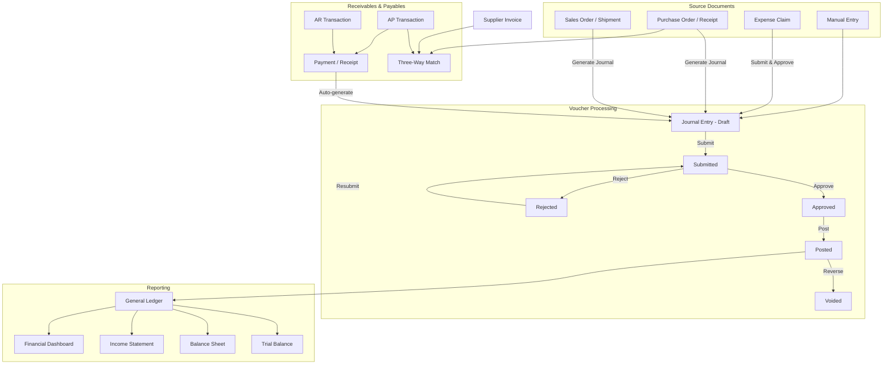
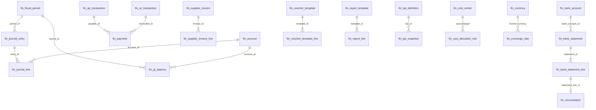
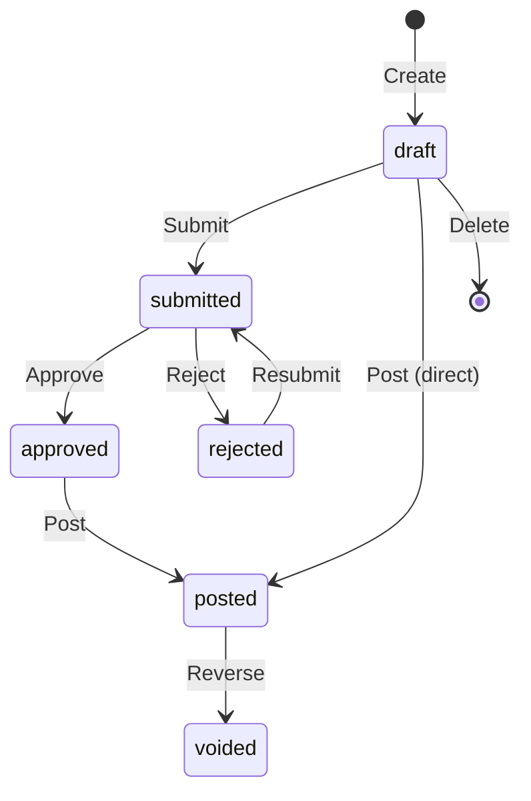

# Financial Management

> Invoicing, accounts payable/receivable, payments, bank reconciliation, cost accounting, and tax compliance -- built entirely with AuraBoot DSL configuration.

## Business Overview

### The Problem

Growing businesses face fragmented financial operations: spreadsheets for journal entries, separate tools for invoicing, manual bank reconciliation, and disconnected expense tracking. This leads to delayed month-end closes, reconciliation errors, and poor cash flow visibility.

### Target Users

| Role | Responsibilities |
|------|-----------------|
| **CFO / Finance Director** | Financial dashboards, KPI monitoring, period management |
| **Accountant** | Journal entries, GL balances, trial balance, financial reports |
| **AP Specialist** | Supplier invoices, three-way matching, payment processing |
| **AR Specialist** | Customer invoicing, receivables tracking, collection |
| **Expense Administrator** | Expense claim review and approval |
| **Cost Accountant** | Cost center management, standard costing, variance analysis |

### Core Capabilities

1. **Chart of Accounts** -- Hierarchical account structure with 5 account types (asset, liability, equity, revenue, expense)
2. **Journal Entries** -- Double-entry bookkeeping with approval workflow (draft -> submitted -> approved -> posted)
3. **General Ledger** -- Period-based GL balances with debit/credit tracking in base currency
4. **Fiscal Period Management** -- Monthly periods with open/soft-close/hard-close/locked lifecycle
5. **Accounts Receivable** -- Customer receivables from sales shipments with aging analysis
6. **Accounts Payable** -- Vendor payables from purchase receipts with aging analysis
7. **Supplier Invoices** -- Invoice capture with line items linked to purchase orders
8. **Three-Way Matching** -- PO vs receipt vs invoice matching with tolerance and hold resolution
9. **Payments** -- Payment/receipt recording linked to AR/AP with automatic journal generation
10. **Expense Claims** -- Employee reimbursement workflow (draft -> pending -> approved -> paid)
11. **Bank Accounts** -- Bank account master data with balance tracking
12. **Bank Reconciliation** -- Statement import, line matching, and reconciliation
13. **Multi-Currency** -- Currency master, exchange rates, and automatic base-currency conversion
14. **Cost Centers** -- Cost center definitions with department and rate tracking
15. **Cost Elements** -- Material, labor, overhead, and depreciation cost categories
16. **Cost Allocation Rules** -- Rules for distributing costs between cost centers
17. **Standard Costing** -- Standard cost cards per item with material/labor/overhead breakdown
18. **Cost Variance Analysis** -- Standard vs actual comparison with variance percentage
19. **Financial Reports** -- Trial balance, balance sheet, income statement generation
20. **Report Templates** -- Configurable report templates with formula-based line items
21. **Voucher Templates** -- Event-driven auto-generation rules for journal entries
22. **KPI Definitions** -- Financial KPI tracking with formula types and targets
23. **Financial Dashboard** -- Real-time KPI cards, AR/AP aging charts, revenue/expense trends
24. **Period Restatement** -- Adjustments to closed periods with audit trail
25. **Tax Compliance** -- VAT rates, e-invoicing, and tax bureau submission (separate plugin)

### Workflow Overview



---

## Data Model

### ER Diagram



### Models Summary

| Model Code | Display Name | Category | Description |
|-----------|-------------|----------|-------------|
| `fin_account` | Chart of Account | master | Hierarchical chart of accounts for general ledger |
| `fin_fiscal_period` | Fiscal Period | master | Monthly accounting periods with status lifecycle |
| `fin_journal_entry` | Journal Entry | document | Double-entry journal vouchers with approval workflow |
| `fin_journal_line` | Journal Line | entity | Individual debit/credit lines within a journal entry |
| `fin_gl_balance` | GL Balance | transaction | General ledger balances aggregated by period |
| `fin_ar_transaction` | AR Transaction | transaction | Accounts receivable from sales or manual invoices |
| `fin_ap_transaction` | AP Transaction | transaction | Accounts payable from purchases or manual invoices |
| `fin_payment` | Payment | document | Payment/receipt records linked to AR/AP |
| `fin_expense_claim` | Expense Claim | document | Employee expense reimbursement claims |
| `fin_supplier_invoice` | Supplier Invoice | document | Supplier invoice headers linked to POs |
| `fin_supplier_invoice_line` | Invoice Line | entity | Supplier invoice line items |
| `fin_three_way_match` | Three-Way Match | reference | PO vs receipt vs invoice matching |
| `fin_bank_account` | Bank Account | master | Bank account master data |
| `fin_bank_statement` | Bank Statement | document | Imported bank statements for reconciliation |
| `fin_bank_statement_line` | Bank Statement Line | entity | Individual transaction lines in statements |
| `fin_reconciliation` | Reconciliation | reference | Links statement lines to matched entries |
| `fin_currency` | Currency | master | ISO 4217 currency master data |
| `fin_exchange_rate` | Exchange Rate | master | Currency exchange rate history |
| `fin_cost_center` | Cost Center | master | Cost center definitions |
| `fin_cost_element` | Cost Element | master | Cost element types (material, labor, overhead) |
| `fin_cost_allocation_rule` | Cost Allocation Rule | master | Cost distribution rules between centers |
| `fin_standard_cost` | Standard Cost Card | document | Standard cost per item per period |
| `fin_cost_variance` | Cost Variance | transaction | Standard vs actual cost comparisons |
| `fin_voucher_template` | Voucher Template | master | Event-driven auto-generation rules |
| `fin_voucher_template_line` | Template Line | entity | Template line items with formulas |
| `fin_report_template` | Report Template | master | Financial report template definitions |
| `fin_report_line` | Report Line | entity | Template line items with account mappings |
| `fin_financial_report` | Financial Report | document | Generated financial statements |
| `fin_restatement` | Restatement | document | Period adjustment records |
| `fin_kpi_definition` | KPI Definition | master | Financial KPI indicators |
| `fin_kpi_snapshot` | KPI Snapshot | transaction | Historical KPI measurements |

### Model Definition (Real DSL)

```json
[
  {
    "code": "fin_journal_entry",
    "displayName:zh-CN": "会计凭证",
    "displayName:en": "Journal Entry",
    "description": "Accounting journal entries (vouchers), header record",
    "modelType": "entity",
    "modelCategory": "document",
    "extension": {
      "icon": "FileText",
      "category": "finance",
      "titleField": "fin_je_entry_no",
      "subtitleField": "fin_je_status"
    }
  },
  {
    "code": "fin_journal_line",
    "displayName:zh-CN": "凭证行",
    "displayName:en": "Journal Line",
    "description": "Individual debit/credit lines within a journal entry",
    "modelType": "entity",
    "modelCategory": "entity",
    "extension": {
      "icon": "List",
      "category": "finance",
      "parentModel": "fin_journal_entry",
      "parentField": "fin_jl_entry_id",
      "titleField": "fin_jl_line_no"
    }
  },
  {
    "code": "fin_ar_transaction",
    "displayName:zh-CN": "应收款",
    "displayName:en": "AR Transaction",
    "description": "Accounts receivable transactions from sales shipments or manual invoices",
    "modelType": "entity",
    "modelCategory": "transaction",
    "extension": {
      "icon": "ArrowDownLeft",
      "category": "finance",
      "titleField": "fin_art_invoice_no",
      "subtitleField": "fin_art_status"
    }
  },
  {
    "code": "fin_three_way_match",
    "displayName:zh-CN": "三单匹配",
    "displayName:en": "Three-Way Match",
    "description": "Three-way matching between PO, receipt, and supplier invoice for payment verification",
    "modelType": "entity",
    "modelCategory": "reference",
    "extension": {
      "icon": "GitMerge",
      "category": "finance",
      "titleField": "fin_twm_code",
      "subtitleField": "fin_twm_status"
    }
  }
]
```

---

## Fields Deep Dive

### Journal Entry Fields

| Field Code | Type | Required | Editable | Description |
|-----------|------|----------|----------|-------------|
| `fin_je_entry_no` | TEXT | No (auto) | No | Auto-generated: `JE-{yyyyMMdd}-{seq}` |
| `fin_je_entry_date` | DATE | Yes | Yes | Voucher date |
| `fin_je_period_id` | REFERENCE | Yes | Yes | Link to fiscal period |
| `fin_je_source_type` | ENUM | No | Yes | `manual` / `sales` / `purchase` / `inventory` / `restatement` |
| `fin_je_memo` | TEXT | No | Yes | Voucher memo/description |
| `fin_je_status` | ENUM | No | No | `draft` / `submitted` / `approved` / `rejected` / `posted` / `voided` |
| `fin_je_total_debit` | DECIMAL | No | No | Sum of debit lines (auto-calculated) |
| `fin_je_total_credit` | DECIMAL | No | No | Sum of credit lines (auto-calculated) |
| `fin_je_currency_code` | TEXT | No | Yes | Transaction currency |
| `fin_je_exchange_rate` | DECIMAL | No | No | Exchange rate at time of entry |
| `fin_je_base_currency_code` | TEXT | No | No | Base currency for reporting |
| `fin_je_total_debit_base` | DECIMAL | No | No | Debit total in base currency |
| `fin_je_total_credit_base` | DECIMAL | No | No | Credit total in base currency |
| `fin_je_submitted_by` | TEXT | No | No | User who submitted |
| `fin_je_submitted_at` | DATETIME | No | No | Submission timestamp |
| `fin_je_approved_by` | TEXT | No | No | Approver |
| `fin_je_approved_at` | DATETIME | No | No | Approval timestamp |
| `fin_je_posted_by` | TEXT | No | No | User who posted |
| `fin_je_posted_at` | DATETIME | No | No | Posting timestamp |
| `fin_je_rejection_reason` | TEXT | No | No | Reason for rejection |

### Account Fields

| Field Code | Type | Description |
|-----------|------|-------------|
| `fin_acc_code` | TEXT | Account code (hierarchical, e.g. `1001.01`) |
| `fin_acc_name` | TEXT | Account name |
| `fin_acc_type` | ENUM | `asset` / `liability` / `equity` / `revenue` / `expense` |
| `fin_acc_level` | INTEGER | Hierarchy level (1=top) |
| `fin_acc_parent_id` | REFERENCE | Parent account |
| `fin_acc_is_detail` | BOOLEAN | Whether it is a detail (leaf) account |
| `fin_acc_balance_direction` | ENUM | `debit` / `credit` |
| `fin_acc_status` | ENUM | `active` / `frozen` / `disabled` |

### Key Enumerations (Dictionaries)

**Account Type** (`fin_account_type`):
```json
[
  { "value": "asset",     "label:en": "Asset",     "color": "#1890ff" },
  { "value": "liability", "label:en": "Liability", "color": "#fa8c16" },
  { "value": "equity",    "label:en": "Equity",    "color": "#722ed1" },
  { "value": "revenue",   "label:en": "Revenue",   "color": "#52c41a" },
  { "value": "expense",   "label:en": "Expense",   "color": "#f5222d" }
]
```

**Journal Status** (`fin_journal_status`):
```json
[
  { "value": "draft",     "label:en": "Draft",     "color": "#d9d9d9" },
  { "value": "submitted", "label:en": "Submitted", "color": "#1890ff" },
  { "value": "approved",  "label:en": "Approved",  "color": "#13c2c2" },
  { "value": "rejected",  "label:en": "Rejected",  "color": "#f5222d" },
  { "value": "posted",    "label:en": "Posted",    "color": "#52c41a" },
  { "value": "voided",    "label:en": "Voided",    "color": "#8c8c8c" }
]
```

**Expense Status** (`fin_exp_status`):
```json
[
  { "value": "draft",    "label:en": "Draft",    "color": "#d9d9d9" },
  { "value": "pending",  "label:en": "Pending",  "color": "#1890ff" },
  { "value": "approved", "label:en": "Approved", "color": "#52c41a" },
  { "value": "rejected", "label:en": "Rejected", "color": "#f5222d" },
  { "value": "paid",     "label:en": "Paid",     "color": "#722ed1" }
]
```

---

## Commands & Business Logic

### Journal Entry State Machine



### Command Definitions (Real DSL)

**Create Journal Entry:**

```json
{
  "code": "fin:create_journal_entry",
  "displayName:en": "Create Journal Entry",
  "type": "create",
  "modelCode": "fin_journal_entry",
  "inputFields": [
    "fin_je_entry_date",
    "fin_je_period_id",
    "fin_je_source_type",
    "fin_je_memo"
  ],
  "autoSetFields": {
    "fin_je_entry_no": {
      "strategy": "auto_generate",
      "pattern": "JE-{yyyyMMdd}-{seq}"
    },
    "fin_je_status": {
      "strategy": "fixed_value",
      "value": "draft"
    }
  },
  "permissions": ["FIN.financial.manage"]
}
```

**Submit for Approval:**

```json
{
  "code": "fin:submit_journal_entry",
  "displayName:en": "Submit for Approval",
  "type": "state_transition",
  "modelCode": "fin_journal_entry",
  "stateField": "fin_je_status",
  "fromStates": ["draft", "rejected"],
  "toState": "submitted",
  "permissions": ["FIN.financial.manage"],
  "extension": {
    "confirmMessage:en": "Submit this entry for approval?"
  }
}
```

**Approve:**

```json
{
  "code": "fin:approve_journal_entry",
  "displayName:en": "Approve Journal Entry",
  "type": "state_transition",
  "modelCode": "fin_journal_entry",
  "stateField": "fin_je_status",
  "fromStates": ["submitted"],
  "toState": "approved",
  "permissions": ["FIN.financial.admin"],
  "extension": {
    "confirmMessage:en": "Approve this journal entry?"
  }
}
```

**Post (with handler validation):**

```json
{
  "code": "fin:post_journal_entry",
  "displayName:en": "Post Journal Entry",
  "type": "state_transition",
  "modelCode": "fin_journal_entry",
  "stateField": "fin_je_status",
  "fromStates": ["draft", "approved"],
  "toState": "posted",
  "handler": "fin:post_journal_entry",
  "permissions": ["FIN.financial.manage"],
  "extension": {
    "confirmMessage:en": "Post this entry? It cannot be modified after posting"
  }
}
```

The `handler` field triggers server-side validation that ensures debit = credit balance before posting and updates GL balances.

**Create Expense Claim:**

```json
{
  "code": "fin:create_expense_claim",
  "displayName:en": "Create Expense Claim",
  "type": "create",
  "modelCode": "fin_expense_claim",
  "inputFields": [
    "fin_exp_title",
    "fin_exp_type",
    "fin_exp_amount",
    "fin_exp_date",
    "fin_exp_description",
    "fin_exp_attachment",
    "fin_exp_department_id",
    "fin_exp_remark"
  ],
  "autoSetFields": {
    "fin_exp_code": {
      "strategy": "auto_generate",
      "pattern": "EXP-{yyyyMMdd}-{seq}"
    },
    "fin_exp_status": {
      "strategy": "fixed_value",
      "value": "draft"
    }
  },
  "permissions": ["FIN.expense.manage"]
}
```

### All Commands by Module

| Module | Command | Type | Description |
|--------|---------|------|-------------|
| **GL** | `fin:create_journal_entry` | create | New journal entry |
| | `fin:update_journal_entry` | update | Edit draft entry |
| | `fin:delete_journal_entry` | delete | Delete draft entry |
| | `fin:submit_journal_entry` | state_transition | draft/rejected -> submitted |
| | `fin:approve_journal_entry` | state_transition | submitted -> approved |
| | `fin:reject_journal_entry` | state_transition | submitted -> rejected |
| | `fin:post_journal_entry` | state_transition | draft/approved -> posted |
| | `fin:reverse_journal_entry` | state_transition | posted -> voided |
| | `fin:void_journal_entry` | state_transition | Void entry |
| | `fin:create_journal_line` | create | Add line to entry |
| | `fin:delete_journal_line` | delete | Remove line |
| **Accounts** | `fin:create_account` | create | New account |
| | `fin:update_account` | update | Edit account |
| | `fin:delete_account` | delete | Delete account |
| | `fin:init_chart_of_accounts` | command | Initialize standard chart |
| **Periods** | `fin:create_fiscal_period` | create | New period |
| | `fin:open_period` | state_transition | Open a period |
| | `fin:close_period` | state_transition | Close a period |
| **AR/AP** | `fin:create_ar_transaction` | create | New receivable |
| | `fin:create_ap_transaction` | create | New payable |
| | `fin:create_ar_from_shipment` | command | Auto-create from shipment |
| | `fin:create_ap_from_receipt` | command | Auto-create from receipt |
| | `fin:write_off_ar` | command | Write off receivable |
| | `fin:write_off_ap` | command | Write off payable |
| **Payments** | `fac:create_payment` | create | Record payment |
| | `fac:record_payment` | command | Record payment with journal |
| **Expenses** | `fin:create_expense_claim` | create | New expense claim |
| | `fin:submit_expense_claim` | state_transition | Submit for approval |
| | `fin:pay_expense_claim` | state_transition | Mark as paid |
| **Three-Way** | `fin:create_three_way_match` | create | New match record |
| | `fin:approve_three_way_match` | state_transition | Approve match |
| | `fin:resolve_match_hold` | command | Resolve hold |
| **Supplier Invoice** | `fin:create_supplier_invoice` | create | New supplier invoice |
| | `fin:submit_supplier_invoice` | state_transition | Submit |
| | `fin:approve_supplier_invoice` | state_transition | Approve |
| | `fin:reject_supplier_invoice` | state_transition | Reject |
| | `fin:pay_supplier_invoice` | command | Pay invoice |
| **Bank** | `fin:create_bank_account` | create | New bank account |
| | `fin:activate_bank_account` | state_transition | Activate |
| | `fin:create_bank_statement` | create | New statement |
| | `fin:import_bank_statement` | command | Import statement file |
| | `fin:match_statement_line` | command | Match line to entry |
| | `fin:reconcile_bank_statement` | command | Run reconciliation |
| | `fin:close_bank_statement` | state_transition | Close statement |
| **Reports** | `fin:generate_trial_balance` | command | Generate trial balance |
| | `fin:generate_balance_sheet` | command | Generate balance sheet |
| | `fin:generate_income_statement` | command | Generate income statement |
| | `fin:generate_executive_summary` | command | Generate executive summary |
| **Auto-Journal** | `fin:generate_journal_from_sales` | command | Auto-generate from sales |
| | `fin:generate_journal_from_purchase` | command | Auto-generate from purchases |
| **GL Recalc** | `fin:recalculate_gl` | command | Recalculate GL balances |
| | `fin:create_gl_balance` | create | Create GL balance record |

---

## Pages & User Interface

### Page Inventory

| Page Key | Kind | Model | Description |
|----------|------|-------|-------------|
| `fin_financial_dashboard` | dashboard | fin_journal_entry | Financial overview with KPI cards, charts, tables |
| `fin_account_list` | list | fin_account | Chart of accounts management |
| `fin_account_form` | form | fin_account | Account create/edit |
| `fin_journal_entry_list` | list | fin_journal_entry | Journal entries with approval workflow |
| `fin_journal_entry_form` | form | fin_journal_entry | Entry form with journal lines sub-table |
| `fin_journal_entry_detail` | detail | fin_journal_entry | Entry detail with lines |
| `fin_gl_balance_list` | list | fin_gl_balance | General ledger query |
| `fin_fiscal_period_list` | list | fin_fiscal_period | Fiscal period management |
| `fin_ar_transaction_list` | list | fin_ar_transaction | Accounts receivable |
| `fin_ap_transaction_list` | list | fin_ap_transaction | Accounts payable |
| `fin_payment_list` | list | fin_payment | Payments list |
| `fin_expense_claim_list` | list | fin_expense_claim | Expense claims |
| `fin_supplier_invoice_list` | list | fin_supplier_invoice | Supplier invoices |
| `fin_three_way_match_list` | list | fin_three_way_match | Three-way matching |
| `fin_bank_account_list` | list | fin_bank_account | Bank accounts |
| `fin_bank_statement_list` | list | fin_bank_statement | Bank statements |
| `fin_reconciliation_list` | list | fin_reconciliation | Reconciliation records |
| `fin_currency_list` | list | fin_currency | Currency management |
| `fin_exchange_rate_list` | list | fin_exchange_rate | Exchange rates |
| `fin_cost_center_list` | list | fin_cost_center | Cost centers |
| `fin_cost_element_list` | list | fin_cost_element | Cost elements |
| `fin_cost_allocation_rule_list` | list | fin_cost_allocation_rule | Allocation rules |
| `fin_standard_cost_list` | list | fin_standard_cost | Standard cost cards |
| `fin_cost_variance_list` | list | fin_cost_variance | Cost variance analysis |
| `fin_voucher_template_list` | list | fin_voucher_template | Voucher templates |
| `fin_report_template_list` | list | fin_report_template | Report templates |
| `fin_financial_report_list` | list | fin_financial_report | Generated reports |
| `fin_restatement_list` | list | fin_restatement | Period restatements |
| `fin_kpi_definition_list` | list | fin_kpi_definition | KPI definitions |
| `fin_kpi_snapshot_list` | list | fin_kpi_snapshot | KPI snapshots |

### Financial Dashboard (Real DSL)

The dashboard uses `stat-card`, `chart`, and `table` blocks powered by named queries:

```json
{
  "pageKey": "fin_financial_dashboard",
  "kind": "dashboard",
  "schemaVersion": 2,
  "layout": { "type": "grid", "cols": 12, "gap": 16 },
  "blocks": [
    {
      "id": "block_revenue_expense_kpi",
      "blockType": "stat-card",
      "layout": { "colSpan": 12 },
      "title": { "en": "Revenue & Expense Overview" },
      "dataSource": {
        "type": "api",
        "url": "/api/datasource/list",
        "params": {
          "datasourceId": "nq:fin_revenue_expense_kpi",
          "format": "records",
          "maxItems": "1"
        }
      },
      "cards": [
        { "field": "total_revenue", "label": { "en": "Total Revenue" }, "icon": "IconTrendingUp", "color": "#10b981", "format": "currency" },
        { "field": "total_expenses", "label": { "en": "Total Expenses" }, "icon": "IconTrendingDown", "color": "#ef4444", "format": "currency" },
        { "field": "net_income", "label": { "en": "Net Income" }, "icon": "IconScale", "color": "#8b5cf6", "format": "currency" },
        { "field": "net_cash_flow", "label": { "en": "Net Cash Flow" }, "icon": "IconCash", "color": "#06b6d4", "format": "currency" }
      ]
    },
    {
      "id": "chart_revenue_expense_trend",
      "blockType": "chart",
      "chartType": "line",
      "layout": { "colSpan": 6 },
      "title": { "en": "Revenue vs Expense Trend" },
      "chartConfig": {
        "smooth": true,
        "areaStyle": true,
        "dataSource": {
          "type": "namedQuery",
          "queryCode": "fin_monthly_revenue_expense",
          "dimensions": ["month"],
          "metrics": [
            { "field": "revenue", "aggregation": "sum" },
            { "field": "expense", "aggregation": "sum" },
            { "field": "net_income", "aggregation": "sum" }
          ]
        }
      }
    },
    {
      "id": "chart_ar_aging",
      "blockType": "chart",
      "chartType": "bar",
      "layout": { "colSpan": 6 },
      "title": { "en": "AR Aging Analysis" },
      "chartConfig": {
        "orientation": "horizontal",
        "dataSource": {
          "type": "namedQuery",
          "queryCode": "fin_ar_aging",
          "dimensions": ["aging_bucket"],
          "metrics": [{ "field": "total_balance", "aggregation": "sum" }]
        }
      }
    }
  ]
}
```

### Journal Entry List (Real DSL)

Demonstrates a list page with toolbar buttons, conditional row actions, and status-based visibility:

```json
{
  "pageKey": "fin_journal_entry_list",
  "kind": "list",
  "modelCode": "fin_journal_entry",
  "schemaVersion": 2,
  "layout": { "type": "grid", "cols": 12 },
  "blocks": [
    {
      "id": "block_journal_entry_toolbar",
      "blockType": "form-buttons",
      "buttons": [
        {
          "code": "create",
          "primary": true,
          "icon": "Plus",
          "action": { "type": "navigate", "to": "fin_journal_entry_form", "command": "fin:create_journal_entry" }
        },
        {
          "code": "gen_sales",
          "icon": "FileOutput",
          "action": { "type": "command", "command": "fin:generate_journal_from_sales" }
        }
      ]
    },
    {
      "id": "block_journal_entry_table",
      "blockType": "table",
      "defaultSort": { "field": "created_at", "order": "desc" },
      "searchFields": ["fin_je_entry_no", "fin_je_status", "fin_je_source_type"],
      "table": {
        "columns": [
          { "field": "fin_je_entry_no", "width": 150, "fixed": "left" },
          { "field": "fin_je_entry_date", "width": 120 },
          { "field": "fin_je_source_type", "width": 110, "renderType": "tag", "dictCode": "fin_journal_source" },
          { "field": "fin_je_total_debit", "width": 120, "align": "right" },
          { "field": "fin_je_total_credit", "width": 120, "align": "right" },
          { "field": "fin_je_status", "width": 100, "renderType": "tag", "dictCode": "fin_journal_status" },
          {
            "field": "actions",
            "isActionColumn": true,
            "buttons": [
              {
                "code": "submit",
                "icon": "Send",
                "visibleWhen": "row.fin_je_status === 'draft' || row.fin_je_status === 'rejected'",
                "action": { "type": "command", "command": "fin:submit_journal_entry" }
              },
              {
                "code": "approve",
                "icon": "CheckCircle",
                "visibleWhen": "row.fin_je_status === 'submitted'",
                "action": { "type": "command", "command": "fin:approve_journal_entry" }
              },
              {
                "code": "post",
                "icon": "BookCheck",
                "visibleWhen": "row.fin_je_status === 'approved'",
                "action": { "type": "command", "command": "fin:post_journal_entry" }
              },
              {
                "code": "delete",
                "icon": "Trash2",
                "danger": true,
                "visibleWhen": "row.fin_je_status === 'draft'",
                "confirm": "delete.confirm",
                "action": { "type": "command", "command": "fin:delete_journal_entry" }
              }
            ]
          }
        ]
      }
    }
  ]
}
```

### Journal Entry Form with Sub-Table (Real DSL)

Shows how the form includes an editable sub-table for journal lines:

```json
{
  "pageKey": "fin_journal_entry_form",
  "kind": "form",
  "modelCode": "fin_journal_entry",
  "schemaVersion": 2,
  "layout": { "type": "grid", "cols": 12, "gap": 12 },
  "blocks": [
    {
      "id": "block_journal_entry_basic",
      "blockType": "form-section",
      "title": { "en": "Entry Info" },
      "columns": 2,
      "fields": [
        { "field": "fin_je_entry_no", "layout": { "colSpan": 6 } },
        { "field": "fin_je_entry_date", "layout": { "colSpan": 6 } },
        { "field": "fin_je_period_id", "layout": { "colSpan": 6 } },
        { "field": "fin_je_source_type", "layout": { "colSpan": 6 } },
        { "field": "fin_je_memo", "layout": { "colSpan": 12 } },
        { "field": "fin_je_total_debit", "layout": { "colSpan": 6 } },
        { "field": "fin_je_total_credit", "layout": { "colSpan": 6 } }
      ]
    },
    {
      "id": "block_journal_lines",
      "blockType": "sub-table",
      "title": { "en": "Journal Lines" },
      "subTable": {
        "childModel": "fin_journal_line",
        "parentField": "fin_jl_entry_id",
        "readOnly": false,
        "commands": {
          "create": "fin:create_journal_line",
          "delete": "fin:delete_journal_line"
        },
        "columns": [
          { "field": "fin_jl_line_no", "width": 80 },
          { "field": "fin_jl_account_id", "width": 200 },
          { "field": "fin_jl_debit", "width": 120, "align": "right" },
          { "field": "fin_jl_credit", "width": 120, "align": "right" },
          { "field": "fin_jl_memo", "width": 200 }
        ]
      }
    },
    {
      "id": "block_journal_entry_actions",
      "blockType": "form-buttons",
      "buttons": [
        { "code": "save", "primary": true, "action": { "type": "command", "command": "fin:create_journal_entry" } },
        { "code": "cancel", "action": { "type": "builtin", "name": "back" } }
      ]
    }
  ]
}
```

---

## Permissions & Roles

### Permission Codes

| Code | Scope | Description |
|------|-------|-------------|
| `fin.financial.read` | operation | View financial data, GL, and reports |
| `fin.financial.manage` | operation | Create/edit journal entries, post entries |
| `fin.financial.admin` | operation | Close/open periods, approve entries, restate |
| `fin.financial.report` | operation | Generate trial balance, balance sheet, income statement |
| `fin.financial.restate` | operation | Apply restatements to closed periods |
| `fin.dashboard.financial` | operation | View financial dashboard |
| `fin.expense.read` | data | View expense claims |
| `fin.expense.manage` | operation | Create, edit, submit expense claims |
| `fin.cost.read` | data | View cost centers, elements, allocation rules |
| `fin.cost.manage` | operation | Create, edit cost accounting records |
| `fin.currency.read` | data | View currencies and exchange rates |
| `fin.currency.manage` | operation | Manage currencies and exchange rates |
| `fin.supplier_invoice.read` | data | View supplier invoices |
| `fin.supplier_invoice.manage` | operation | Manage supplier invoices |
| `fin.bank_recon.read` | data | View bank accounts, statements |
| `fin.bank_recon.manage` | operation | Manage bank reconciliation |
| `fin.template.read` | data | View voucher templates |
| `fin.template.manage` | operation | Create, edit voucher templates |
| `fin.payment.read` | data | View payments |
| `fin.payment.manage` | operation | Record payments and receipts |
| `fin.bi.read` | data | View dashboards, KPI definitions |
| `fin.bi.manage` | operation | Manage KPI definitions and snapshots |

### Roles (Real DSL)

```json
[
  {
    "code": "fin_admin",
    "name:en": "ERP Administrator",
    "description": "Full access to all Finance modules",
    "permissions": [
      "fin.financial.three_way_match",
      "fin.financial.three_way_match.read",
      "fin.cost.read",
      "fin.cost.manage"
    ]
  },
  {
    "code": "fin_finance",
    "name:en": "Finance Specialist",
    "description": "Manage financial operations: credit memos, three-way match, AR/AP, cost accounting",
    "permissions": [
      "fin.financial.manage",
      "fin.financial.read",
      "fin.financial.three_way_match",
      "fin.financial.three_way_match.read",
      "fin.cost.read",
      "fin.cost.manage",
      "fin.financial.report"
    ]
  }
]
```

---

## Internationalization

All labels use the three-tier i18n resolution system. Examples from the i18n configuration:

```json
[
  { "key": "model.fin_journal_entry._meta.label", "zh-CN": "会计凭证", "en-US": "Journal Entry" },
  { "key": "model.fin_ar_transaction._meta.label", "zh-CN": "应收款", "en-US": "AR Transaction" },
  { "key": "menu.fin_account_menu.label", "zh-CN": "科目管理", "en-US": "Chart of Accounts" },
  { "key": "menu.fin_journal_entry_menu.label", "zh-CN": "凭证管理", "en-US": "Journal Entries" },
  { "key": "menu.fin_gl_balance_menu.label", "zh-CN": "总账查询", "en-US": "General Ledger" }
]
```

Field labels and dictionary items all carry both `zh-CN` and `en` translations, resolved automatically by the platform.

---

## Workflows

### Journal Entry Approval

1. **Accountant** creates a journal entry (auto-generated number, draft status)
2. Adds debit/credit lines via the sub-table editor
3. Clicks **Submit** -- entry moves to `submitted`
4. **Finance Admin** reviews and clicks **Approve** or **Reject** (with reason)
5. If approved, accountant clicks **Post** -- handler validates debit = credit balance, updates GL
6. Posted entries can be **Reversed** by admin (creates voiding entry)

### Expense Claim Workflow

1. **Employee** creates expense claim with title, type, amount, date, attachments
2. Submits for approval -- status moves to `pending`
3. **Expense Admin** approves or rejects
4. Once approved, finance marks as `paid`

### Three-Way Matching

1. **Purchase Order** is received -- receipt recorded
2. **Supplier Invoice** arrives -- captured with line items
3. System creates **Three-Way Match** record comparing PO amount, receipt amount, invoice amount
4. If within tolerance -- auto-approved
5. If variance exceeds tolerance -- placed on **hold** for manual resolution
6. Finance resolves hold or approves the match
7. Approved match triggers AP transaction creation

### Bank Reconciliation

1. **Bank statement** imported (manual or file upload)
2. System creates statement line items
3. Lines are **matched** to journal entries (manual or auto-match)
4. Unmatched lines flagged for review
5. Statement **closed** once all lines reconciled

---

## Getting Started

### 1. Install the Plugin

```bash
aura plugin publish plugins/finance --yes
```

### 2. Install Tax Compliance (Optional)

```bash
aura plugin publish plugins/tax-compliance --yes
```

### 3. Initialize Chart of Accounts

```bash
aura exec fin:init_chart_of_accounts
```

### 4. Create Fiscal Periods

```bash
aura exec fin:create_fiscal_period \
  --set fin_fp_name="2026-01" \
  --set fin_fp_year:int=2026 \
  --set fin_fp_period:int=1 \
  --set fin_fp_start_date="2026-01-01" \
  --set fin_fp_end_date="2026-01-31"
```

### 5. Set Up Currencies

```bash
aura exec fin:create_currency \
  --set fin_cur_code="USD" \
  --set fin_cur_name="US Dollar" \
  --set fin_cur_symbol="$" \
  --set fin_cur_decimal_places:int=2 \
  --set fin_cur_is_base:bool=true
```

### 6. Create Your First Journal Entry

```bash
aura exec fin:create_journal_entry \
  --set fin_je_entry_date="2026-01-15" \
  --set fin_je_period_id="<period_pid>" \
  --set fin_je_source_type="manual" \
  --set fin_je_memo="Opening balances"
```

---

## Extension Points

### Custom Voucher Templates

Create event-driven auto-generation rules. When a sales order is shipped, the voucher template automatically generates the correct journal entry:

```json
{
  "code": "fin_voucher_template",
  "extension": {
    "icon": "FileCode",
    "category": "finance",
    "titleField": "fin_vt_name",
    "subtitleField": "fin_vt_code"
  }
}
```

Template lines define account codes, debit/credit direction, and amount expressions evaluated at runtime.

### Named Queries for Dashboard

The dashboard is powered by named queries (SQL executed server-side with tenant isolation):

```json
{
  "code": "fin_ar_aging",
  "title:en": "AR Aging Analysis",
  "fromSql": "SELECT CASE WHEN CURRENT_DATE - fin_art_due_date::date <= 30 THEN '0-30' WHEN ... END AS aging_bucket, SUM(fin_art_balance_base::numeric) AS total_balance FROM mt_fin_ar_transaction WHERE fin_art_status IN ('open','partial','overdue') AND tenant_id = #{params.tenantId} GROUP BY aging_bucket"
}
```

### Tax Compliance Integration

The `tax-compliance` plugin adds:

- **VAT Rate** master data with effective date ranges
- **E-Invoice** management with Golden Tax integration
- **Tax Submission Log** audit trail for bureau API calls
- **Tax Configuration** for company USCC, bureau endpoints

---

## FAQ

**Q: How does multi-currency work?**
Each journal entry can specify a transaction currency. The exchange rate is looked up from `fin_exchange_rate` and all amounts are automatically converted to base currency (`_base` suffix fields) for reporting.

**Q: Can I generate journal entries automatically from sales/purchases?**
Yes. Use the `fin:generate_journal_from_sales` and `fin:generate_journal_from_purchase` commands, or configure voucher templates for event-driven auto-generation.

**Q: How does the posting handler validate entries?**
The `fin:post_journal_entry` command has a `handler` that runs server-side Java logic. It verifies that total debit equals total credit across all journal lines before allowing the status transition.

**Q: Can closed periods be adjusted?**
Yes, through the Restatement feature. Create a restatement record linked to a closed period, and the `fin:apply_restatement` command generates adjustment journal entries.

**Q: How does three-way matching work with tolerances?**
The match record compares PO amount, receipt amount, and invoice amount. If the price variance or quantity variance is within the configured tolerance percentage, the match auto-approves. Otherwise it goes to `hold` status for manual resolution.
