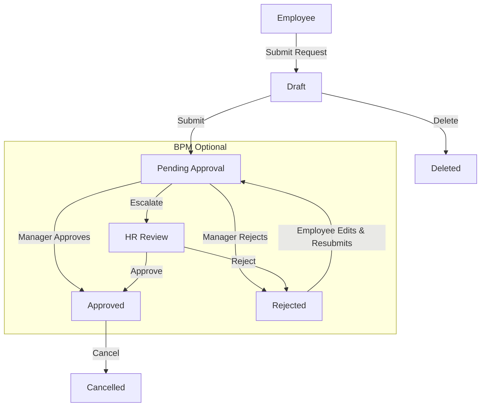
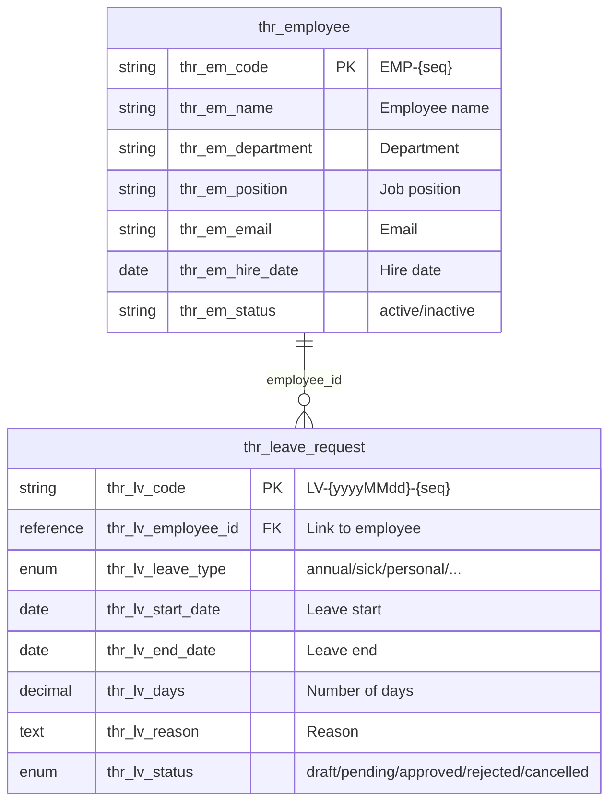
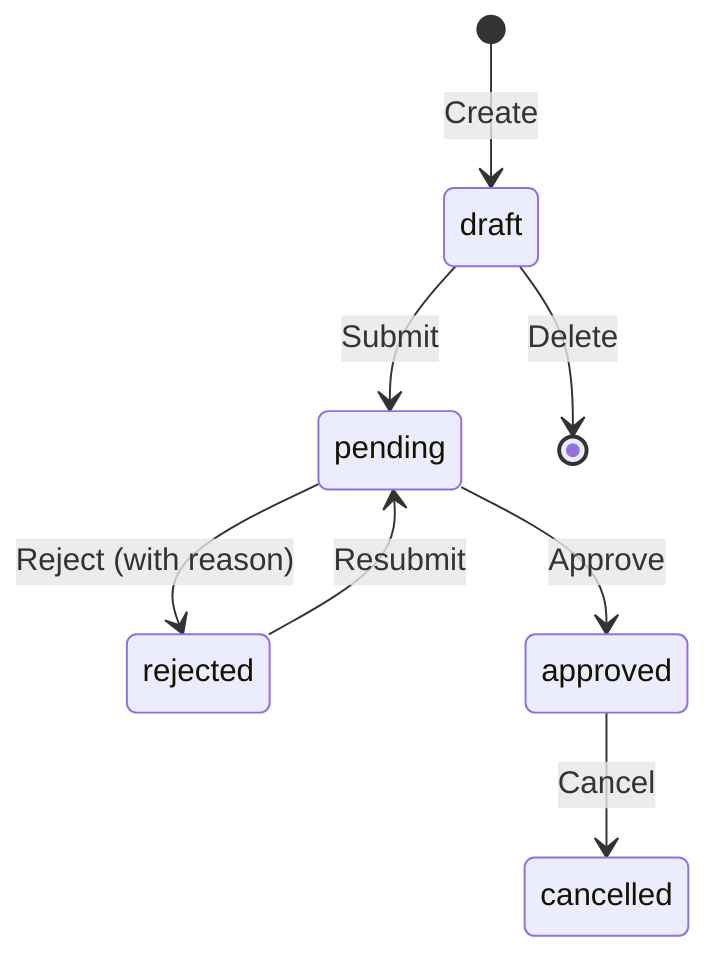

# HR Leave Management

> Employee leave requests, multi-level approvals, balance tracking, and BPM workflow integration -- built with AuraBoot DSL configuration and the "HR Essentials" template.

## Business Overview

### The Problem

Managing employee leave with spreadsheets and email chains creates chaos: managers lose track of requests, HR has no audit trail, employees wait days for a simple approval, and nobody has real-time visibility into team availability.

### Target Users

| Role | Responsibilities |
|------|-----------------|
| **Employee** | Submit leave requests, check request status, cancel pending requests |
| **Manager** | Review and approve/reject team leave requests |
| **HR Administrator** | View all leave requests, manage employee records, configure leave policies |
| **Department Head** | Monitor team availability, approve escalated requests |

### Core Capabilities

1. **Employee Directory** -- Master records with department, position, hire date, and status tracking
2. **Leave Request Submission** -- Form-based leave request with type, dates, days, and reason
3. **Multi-Type Leave** -- Annual, sick, personal, maternity, bereavement, and custom leave types
4. **State Machine Workflow** -- Draft -> Pending -> Approved/Rejected with full audit trail
5. **Manager Approval** -- One-click approve/reject with confirmation dialogs
6. **Rejection Reasons** -- Required reason field on rejection for transparency
7. **Edit Before Approval** -- Modify pending requests (dates, days, reason)
8. **Request Cancellation** -- Cancel approved requests before the leave date
9. **Tab-Based Filtering** -- Quick views by status (All, Pending, Approved, Rejected)
10. **Auto-Generated Codes** -- Leave codes follow `LV-{yyyyMMdd}-{seq}` pattern
11. **Reference Field Linking** -- Leave requests link to employee records via reference picker
12. **BPM Integration** -- Connectable to BPMN approval processes for multi-level approval chains
13. **E2E Test Gold Standard** -- Full 14-dimension test coverage serving as project reference
14. **Date Validation** -- Start date must precede end date; days must be positive
15. **i18n Support** -- Full bilingual labels (English/Chinese) across all fields and pages

### Workflow Overview



---

## Data Model

### ER Diagram



### Models

| Model Code | Display Name | Category | Description |
|-----------|-------------|----------|-------------|
| `thr_employee` | Employee | master | Employee master records with department, position, and status |
| `thr_leave_request` | Leave Request | document | Leave request with approval workflow and status tracking |

### Model Definition (Inferred from Template)

```json
[
  {
    "code": "thr_employee",
    "displayName:zh-CN": "员工",
    "displayName:en": "Employee",
    "description": "Employee master records for HR management",
    "modelType": "entity",
    "modelCategory": "master",
    "extension": {
      "icon": "Users",
      "category": "hr",
      "titleField": "thr_em_name",
      "subtitleField": "thr_em_code"
    }
  },
  {
    "code": "thr_leave_request",
    "displayName:zh-CN": "请假申请",
    "displayName:en": "Leave Request",
    "description": "Employee leave request with approval workflow",
    "modelType": "entity",
    "modelCategory": "document",
    "extension": {
      "icon": "CalendarOff",
      "category": "hr",
      "titleField": "thr_lv_code",
      "subtitleField": "thr_lv_status"
    }
  }
]
```

---

## Fields Deep Dive

### Employee Fields (`thr_employee`)

| Field Code | Type | Required | Description |
|-----------|------|----------|-------------|
| `thr_em_code` | TEXT | Auto | Employee code, auto-generated: `EMP-{seq}` |
| `thr_em_name` | TEXT | Yes | Full name |
| `thr_em_department` | ENUM | Yes | Department (engineering, sales, hr, finance, etc.) |
| `thr_em_position` | TEXT | No | Job title/position |
| `thr_em_email` | TEXT | No | Work email address |
| `thr_em_hire_date` | DATE | Yes | Date of hire |
| `thr_em_status` | ENUM | No (auto) | `active` / `inactive` |

### Leave Request Fields (`thr_leave_request`)

| Field Code | Type | Required | Editable | Description |
|-----------|------|----------|----------|-------------|
| `thr_lv_code` | TEXT | No (auto) | No | Auto-generated: `LV-{yyyyMMdd}-{seq}` |
| `thr_lv_employee_id` | REFERENCE | Yes | Yes | Link to `thr_employee` (renders as Select/ComboBox with search) |
| `thr_lv_leave_type` | ENUM | Yes | Yes | Leave type (renders as Select dropdown) |
| `thr_lv_start_date` | DATE | Yes | Yes | First day of leave (renders as DatePicker) |
| `thr_lv_end_date` | DATE | Yes | Yes | Last day of leave (renders as DatePicker) |
| `thr_lv_days` | DECIMAL | Yes | Yes | Number of leave days |
| `thr_lv_reason` | TEXT | No | Yes | Reason for leave (multiline textarea) |
| `thr_lv_status` | ENUM | No (auto) | No | Current status in the state machine |

### Leave Type Enumeration

| Value | English | Chinese |
|-------|---------|---------|
| `annual` | Annual Leave | 年假 |
| `sick` | Sick Leave | 病假 |
| `personal` | Personal Leave | 事假 |
| `maternity` | Maternity Leave | 产假 |
| `bereavement` | Bereavement Leave | 丧假 |

### Leave Request Status

| Value | English | Chinese | Color |
|-------|---------|---------|-------|
| `draft` | Draft | 草稿 | gray |
| `pending` | Pending Approval | 待审批 | blue |
| `approved` | Approved | 已批准 | green |
| `rejected` | Rejected | 已驳回 | red |
| `cancelled` | Cancelled | 已取消 | gray |

---

## Commands & Business Logic

### Leave Request State Machine



This state machine is defined as a **StateGraph** DSL resource:

```json
{
  "code": "leave_request_flow",
  "displayName": "Leave Request Flow",
  "description": "Leave request state machine",
  "modelCode": "thr_leave_request",
  "stateField": "thr_lv_status",
  "nodes": [
    { "code": "draft", "type": "initial", "displayName": "Draft" },
    { "code": "pending", "type": "normal", "displayName": "Pending Approval" },
    { "code": "approved", "type": "terminal", "displayName": "Approved" },
    { "code": "rejected", "type": "terminal", "displayName": "Rejected" },
    { "code": "cancelled", "type": "terminal", "displayName": "Cancelled" }
  ],
  "transitions": [
    { "from": "draft", "to": "pending", "triggerCommand": "thr:submit_leave_request" },
    { "from": "rejected", "to": "pending", "triggerCommand": "thr:submit_leave_request" },
    { "from": "pending", "to": "approved", "triggerCommand": "thr:approve_leave_request" },
    {
      "from": "pending",
      "to": "rejected",
      "triggerCommand": "thr:reject_leave_request",
      "guard": "#payload['reason'] != null"
    },
    { "from": "approved", "to": "cancelled", "triggerCommand": "thr:cancel_leave_request" }
  ]
}
```

### Command Definitions

**Create Employee:**

```json
{
  "code": "thr:create_employee",
  "displayName:en": "Create Employee",
  "type": "create",
  "modelCode": "thr_employee",
  "inputFields": [
    "thr_em_name",
    "thr_em_department",
    "thr_em_position",
    "thr_em_email",
    "thr_em_hire_date"
  ],
  "autoSetFields": {
    "thr_em_code": {
      "strategy": "auto_generate",
      "pattern": "EMP-{seq}"
    },
    "thr_em_status": {
      "strategy": "fixed_value",
      "value": "active"
    }
  }
}
```

**Create Leave Request:**

```json
{
  "code": "thr:create_leave_request",
  "displayName:en": "Create Leave Request",
  "type": "create",
  "modelCode": "thr_leave_request",
  "inputFields": [
    "thr_lv_employee_id",
    "thr_lv_leave_type",
    "thr_lv_start_date",
    "thr_lv_end_date",
    "thr_lv_days",
    "thr_lv_reason"
  ],
  "autoSetFields": {
    "thr_lv_code": {
      "strategy": "auto_generate",
      "pattern": "LV-{yyyyMMdd}-{seq}"
    },
    "thr_lv_status": {
      "strategy": "fixed_value",
      "value": "pending"
    }
  }
}
```

**Approve Leave Request:**

```json
{
  "code": "thr:approve_leave_request",
  "displayName:en": "Approve Leave Request",
  "type": "state_transition",
  "modelCode": "thr_leave_request",
  "stateField": "thr_lv_status",
  "fromStates": ["pending"],
  "toState": "approved",
  "extension": {
    "confirmMessage:en": "Approve this leave request?",
    "confirmMessage:zh-CN": "确认批准此请假申请？"
  }
}
```

**Reject Leave Request:**

```json
{
  "code": "thr:reject_leave_request",
  "displayName:en": "Reject Leave Request",
  "type": "state_transition",
  "modelCode": "thr_leave_request",
  "stateField": "thr_lv_status",
  "fromStates": ["pending"],
  "toState": "rejected",
  "extension": {
    "confirmMessage:en": "Reject this leave request?",
    "confirmMessage:zh-CN": "确认驳回此请假申请？"
  }
}
```

### All Commands

| Command | Type | Description |
|---------|------|-------------|
| `thr:create_employee` | create | New employee record |
| `thr:update_employee` | update | Edit employee details |
| `thr:delete_employee` | delete | Remove employee |
| `thr:create_leave_request` | create | New leave request (auto: code + status=pending) |
| `thr:update_leave_request` | update | Edit pending request |
| `thr:delete_leave_request` | delete | Delete draft request |
| `thr:submit_leave_request` | state_transition | draft/rejected -> pending |
| `thr:approve_leave_request` | state_transition | pending -> approved |
| `thr:reject_leave_request` | state_transition | pending -> rejected |
| `thr:cancel_leave_request` | state_transition | approved -> cancelled |

---

## Pages & User Interface

### Page Inventory

| Page Key | Kind | Model | Description |
|----------|------|-------|-------------|
| `thr_employee_list` | list | thr_employee | Employee directory with search and status filter |
| `thr_employee_form` | form | thr_employee | Employee create/edit form |
| `thr_leave_request_list` | list | thr_leave_request | Leave requests with status tabs |
| `thr_leave_request_form` | form | thr_leave_request | Leave request submission form |
| `thr_leave_request_detail` | detail | thr_leave_request | Request detail with action buttons |

### Leave Request List Page (Inferred Structure)

The list page features status tab filtering, a create button, and conditional row actions:

```json
{
  "pageKey": "thr_leave_request_list",
  "kind": "list",
  "modelCode": "thr_leave_request",
  "schemaVersion": 2,
  "layout": { "type": "grid", "cols": 12 },
  "blocks": [
    {
      "id": "block_toolbar",
      "blockType": "form-buttons",
      "layout": { "colSpan": 12 },
      "buttons": [
        {
          "code": "create",
          "primary": true,
          "icon": "Plus",
          "label": "create",
          "action": {
            "type": "navigate",
            "to": "thr_leave_request_form",
            "command": "thr:create_leave_request"
          }
        }
      ]
    },
    {
      "id": "block_tabs",
      "blockType": "tabs",
      "layout": { "colSpan": 12 },
      "tabs": [
        { "code": "all", "label": { "en": "All", "zh-CN": "全部" } },
        { "code": "pending", "label": { "en": "Pending", "zh-CN": "待审批" }, "filter": { "field": "thr_lv_status", "value": "pending" } },
        { "code": "approved", "label": { "en": "Approved", "zh-CN": "已批准" }, "filter": { "field": "thr_lv_status", "value": "approved" } },
        { "code": "rejected", "label": { "en": "Rejected", "zh-CN": "已驳回" }, "filter": { "field": "thr_lv_status", "value": "rejected" } }
      ]
    },
    {
      "id": "block_table",
      "blockType": "table",
      "layout": { "colSpan": 12 },
      "defaultSort": { "field": "created_at", "order": "desc" },
      "searchFields": ["thr_lv_code", "thr_lv_status"],
      "table": {
        "columns": [
          { "field": "thr_lv_code", "width": 160, "fixed": "left" },
          { "field": "thr_lv_employee_id", "width": 150 },
          { "field": "thr_lv_leave_type", "width": 120, "renderType": "tag" },
          { "field": "thr_lv_start_date", "width": 120 },
          { "field": "thr_lv_end_date", "width": 120 },
          { "field": "thr_lv_days", "width": 80, "align": "right" },
          { "field": "thr_lv_status", "width": 110, "renderType": "tag" },
          {
            "field": "actions",
            "isActionColumn": true,
            "buttons": [
              {
                "code": "view",
                "icon": "Eye",
                "action": { "type": "navigate", "to": "thr_leave_request_detail" }
              },
              {
                "code": "edit",
                "icon": "Edit",
                "visibleWhen": "row.thr_lv_status === 'draft' || row.thr_lv_status === 'rejected'",
                "action": { "type": "navigate", "to": "thr_leave_request_form", "command": "thr:update_leave_request" }
              },
              {
                "code": "approve",
                "icon": "CheckCircle",
                "visibleWhen": "row.thr_lv_status === 'pending'",
                "action": { "type": "command", "command": "thr:approve_leave_request" }
              },
              {
                "code": "reject",
                "icon": "XCircle",
                "danger": true,
                "visibleWhen": "row.thr_lv_status === 'pending'",
                "action": { "type": "command", "command": "thr:reject_leave_request" }
              },
              {
                "code": "delete",
                "icon": "Trash2",
                "danger": true,
                "visibleWhen": "row.thr_lv_status === 'draft'",
                "confirm": "delete.confirm",
                "action": { "type": "command", "command": "thr:delete_leave_request" }
              }
            ]
          }
        ]
      }
    }
  ],
  "title": { "en": "Leave Requests", "zh-CN": "请假申请" }
}
```

### Leave Request Form Page

```json
{
  "pageKey": "thr_leave_request_form",
  "kind": "form",
  "modelCode": "thr_leave_request",
  "schemaVersion": 2,
  "layout": { "type": "grid", "cols": 12, "gap": 12 },
  "blocks": [
    {
      "id": "block_leave_info",
      "blockType": "form-section",
      "title": { "en": "Leave Information", "zh-CN": "请假信息" },
      "columns": 2,
      "fields": [
        { "field": "thr_lv_code", "layout": { "colSpan": 6 } },
        { "field": "thr_lv_employee_id", "layout": { "colSpan": 6 } },
        { "field": "thr_lv_leave_type", "layout": { "colSpan": 6 } },
        { "field": "thr_lv_days", "layout": { "colSpan": 6 } },
        { "field": "thr_lv_start_date", "layout": { "colSpan": 6 } },
        { "field": "thr_lv_end_date", "layout": { "colSpan": 6 } },
        { "field": "thr_lv_reason", "layout": { "colSpan": 12 } }
      ]
    },
    {
      "id": "block_actions",
      "blockType": "form-buttons",
      "buttons": [
        { "code": "save", "primary": true, "label": "save", "action": { "type": "command", "command": "thr:create_leave_request" } },
        { "code": "cancel", "label": "cancel", "action": { "type": "builtin", "name": "back" } }
      ]
    }
  ],
  "title": { "en": "Leave Request", "zh-CN": "请假申请" }
}
```

### Form Field Component Types

The platform automatically selects the correct UI component based on field type. This is verified in E2E tests:

| Field | Type | Rendered Component | E2E Assertion |
|-------|------|-------------------|---------------|
| `thr_lv_employee_id` | REFERENCE | Select/ComboBox with search | `.ant-select, [role="combobox"]` visible |
| `thr_lv_leave_type` | ENUM | Select dropdown | `.ant-select, select, [role="combobox"]` visible |
| `thr_lv_start_date` | DATE | DatePicker | `.ant-picker, input[type="date"]` visible |
| `thr_lv_end_date` | DATE | DatePicker | `.ant-picker, input[type="date"]` visible |
| `thr_lv_days` | DECIMAL | Number input | Standard `input` |
| `thr_lv_reason` | TEXT | Textarea (multiline) | `textarea` or `input` |

---

## Permissions & Roles

### Recommended Permission Structure

| Code | Scope | Description |
|------|-------|-------------|
| `hr.employee.read` | data | View employee records |
| `hr.employee.manage` | operation | Create, edit, delete employees |
| `hr.leave.read` | data | View leave requests |
| `hr.leave.submit` | operation | Submit own leave requests |
| `hr.leave.approve` | operation | Approve/reject leave requests |
| `hr.leave.admin` | operation | Full leave management (cancel, delete any) |

### Role Mapping

| Role | Permissions | Typical User |
|------|------------|--------------|
| **Employee** | `hr.leave.read`, `hr.leave.submit` | All employees |
| **Manager** | Employee + `hr.leave.approve` | Team leads, department heads |
| **HR Admin** | Manager + `hr.employee.manage`, `hr.leave.admin` | HR department staff |

### Menu Structure

```json
[
  {
    "code": "thr_root",
    "name:en": "HR Management",
    "name:zh-CN": "人事管理",
    "path": "/hr",
    "icon": "Users",
    "type": 0,
    "orderNo": 400
  },
  {
    "code": "thr_employee_menu",
    "name:en": "Employees",
    "name:zh-CN": "员工",
    "path": "/hr/employees",
    "icon": "Users",
    "type": 1,
    "parentCode": "thr_root",
    "orderNo": 1,
    "pageKey": "thr_employee_list"
  },
  {
    "code": "thr_leave_request_menu",
    "name:en": "Leave Requests",
    "name:zh-CN": "请假申请",
    "path": "/hr/leave-requests",
    "icon": "CalendarOff",
    "type": 1,
    "parentCode": "thr_root",
    "orderNo": 2,
    "pageKey": "thr_leave_request_list"
  }
]
```

---

## Workflows

### Standard Leave Request Flow

1. **Employee** navigates to HR Management > Leave Requests via sidebar menu
2. Clicks **Create** button in toolbar
3. Fills the form:
   - Selects employee (reference picker with search)
   - Chooses leave type (annual, sick, personal, etc.)
   - Sets start date and end date (date pickers)
   - Enters number of days
   - Optionally adds a reason
4. Clicks **Submit** -- record created with auto-generated code `LV-{yyyyMMdd}-{seq}`
5. Request appears in list under **Pending** tab

### Manager Approval

1. **Manager** opens Leave Requests list, clicks **Pending** tab
2. Sees pending requests from team members
3. Clicks **Approve** button on the row (or opens detail page)
4. Confirmation dialog: "Approve this leave request?"
5. On confirm, status transitions to **Approved**
6. Record moves from Pending tab to Approved tab
7. Approve button disappears from the record (state machine enforces valid transitions)

### Rejection with Resubmission

1. **Manager** clicks **Reject** on a pending request
2. System prompts for rejection reason (guard: `#payload['reason'] != null`)
3. Status transitions to **Rejected**
4. **Employee** can edit the rejected request (modify dates, reason)
5. Employee resubmits -- status returns to **Pending**

### BPM Multi-Level Approval (Optional)

For organizations requiring multi-level approval, the leave request can be connected to a BPMN process:

```json
{
  "formRef": "thr_leave_request_form",
  "formBindings": {
    "leave_type": "thr_lv_leave_type",
    "leave_days": "thr_lv_days"
  },
  "fieldPermissions": {
    "thr_lv_code": "readonly",
    "thr_lv_status": "hidden"
  }
}
```

The BPM form integration renders DSL form fields within the approval task, with field-level permissions (readonly code, hidden status). This is verified in the BPM E2E tests which assert that:
- DSL form fields render with correct labels
- Field permissions are enforced (readonly fields disabled, hidden fields not visible)
- Business data echoes correctly (e.g., leave type = "annual", days = 3)

---

## Getting Started

### 1. Install the HR Essentials Template

The template is available from the AuraBoot Template Gallery. Install via the admin UI:

1. Navigate to **Platform Settings > Templates**
2. Find **HR Essentials** in the catalog
3. Click **Install** -- this imports:
   - 2 models (`thr_employee`, `thr_leave_request`)
   - ~12 commands (CRUD + state transitions)
   - List, form, and detail pages
   - Menu entries under "HR Management"
   - i18n translations

Or import the plugin directly:

```bash
aura plugin publish plugins/hr-essentials --yes
```

### 2. Create Your First Employee

```bash
aura exec thr:create_employee \
  --set thr_em_name="Jane Smith" \
  --set thr_em_department="engineering" \
  --set thr_em_hire_date="2025-03-15"
```

### 3. Submit a Leave Request

```bash
aura exec thr:create_leave_request \
  --set thr_lv_employee_id="<employee_pid>" \
  --set thr_lv_leave_type="annual" \
  --set thr_lv_start_date="2026-05-01" \
  --set thr_lv_end_date="2026-05-03" \
  --set thr_lv_days:int=3 \
  --set thr_lv_reason="Family vacation"
```

### 4. Approve the Request

```bash
aura exec thr:approve_leave_request --target <leave_request_pid>
```

---

## Extension Points

### Custom Leave Types

Add new leave types by extending the dictionary:

```json
{
  "code": "thr_leave_type",
  "items": [
    { "value": "study", "label:en": "Study Leave", "label:zh-CN": "学习假" },
    { "value": "marriage", "label:en": "Marriage Leave", "label:zh-CN": "婚假" }
  ]
}
```

### Leave Balance Tracking

Extend the model with balance fields:

| Extension Field | Type | Description |
|----------------|------|-------------|
| `thr_lv_balance_before` | DECIMAL | Available balance before request |
| `thr_lv_balance_after` | DECIMAL | Balance after deduction |
| `thr_em_annual_quota` | DECIMAL | Annual leave quota on employee |

A command handler can enforce balance checks: reject requests that exceed the remaining quota.

### BPM Process Connection

Connect leave requests to a BPMN process for multi-level approval:

1. Design a BPMN process with user tasks for Manager and HR
2. Configure the start event to trigger on `thr:submit_leave_request`
3. Map form fields to process variables via `formBindings`
4. Set field permissions per approval step (managers see readonly code, HR sees full form)

### Notification Integration

Use AuraBoot's webhook/automation system to send notifications:
- Email to manager when a request is submitted
- Email to employee when a request is approved/rejected
- Slack/Teams notification for pending approvals

---

## E2E Testing Reference

The leave request lifecycle test (`thr-leave-request-lifecycle.spec.ts`) is the **gold standard E2E test** for this project. It covers all 14 testing dimensions:

| Dimension | Test Case | What It Verifies |
|-----------|-----------|-----------------|
| D1 Menu Navigation | LV-001 | Sidebar click to leave request list (not `page.goto`) |
| D2 List Rendering | LV-001 | Table visible, column headers rendered, tab bar exists |
| D3 Tab Filtering | LV-005, LV-007 | Pending/Approved tabs filter correctly; approved record leaves Pending tab |
| D4 Full Form Create | LV-002 | All fields filled (employee, type, dates, days, reason) |
| D5 Component Types | LV-002 | Reference=ComboBox, Enum=Select, Date=DatePicker |
| D6 Create Verification | LV-002 | New record in list with `LV-{yyyyMMdd}-{seq}` code |
| D7 Detail Page | LV-003 | Code, status, type, days, reason all visible with correct values |
| D8 Edit + Re-display | LV-004 | Change days 3->5, save, reopen, verify days=5 |
| D9 State Transitions | LV-006, LV-008 | Approve -> status shows "Approved"; Reject -> shows "Rejected" |
| D10 Invalid Transitions | LV-006 | Approve button gone/disabled after approval |
| D11 Delete | LV-010 | Confirm dialog -> record disappears from list |
| D12 Form Validation | LV-011 | Empty form submit -> error message visible |
| D13 Search | LV-012 | Keyword search filters results correctly |
| D14 Toast Feedback | LV-002, LV-006 | Every mutation shows success feedback |

### Key E2E Patterns from the Gold Standard

**Navigation helper (MUST use sidebar menu):**

```typescript
async function navigateToLeaveRequestList(page: Page): Promise<void> {
  await page.goto('/dashboards', { waitUntil: 'domcontentloaded' });
  const nav = page.locator('nav');
  const rootBtn = nav.getByRole('button', { name: /人事管理|HR/i }).first();
  await rootBtn.evaluate((el: HTMLElement) => el.click());

  const leafLink = nav.locator('a[href*="thr-leave-request"]').first();
  const listResponsePromise = page.waitForResponse(
    (r) => r.url().includes('/api/dynamic/thr_leave_request') &&
           r.url().includes('list') && r.status() === 200,
    { timeout: 20_000 },
  );
  await leafLink.evaluate((el: HTMLElement) => el.click());
  await listResponsePromise;
}
```

**State transition with confirmation dialog:**

```typescript
const commandResponsePromise = page.waitForResponse(
  (r) => r.url().includes('/api/meta/commands/execute/') &&
         r.request().method().toLowerCase() === 'post' &&
         r.status() === 200,
  { timeout: 20_000 },
);
await approveBtn.click();

// Handle optional confirmation dialog
const confirmDialog = page.locator('[role="alertdialog"]');
if (await confirmDialog.isVisible({ timeout: 2_000 }).catch(() => false)) {
  const okBtn = confirmDialog.locator('button').filter({ hasText: /确定|OK/i }).first();
  await okBtn.click();
}

const commandResp = await commandResponsePromise;
const body = await commandResp.json();
expect(String(body?.code)).toBe('0');
```

**Edit + re-display verification:**

```typescript
// Modify days to 5
await daysInput.fill('5');
await btn.click();
await commandResponsePromise;

// Navigate back and verify
await navigateToLeaveRequestDetail(page, code, pid);
const updatedDays = await page.locator('main').first()
  .getByText(/^5$|^5\.0$/).first()
  .isVisible({ timeout: 5_000 });
expect(updatedDays, 'Days should display as 5 after edit').toBeTruthy();
```

---

## FAQ

**Q: Is the HR Essentials template a plugin or a built-in feature?**
It is a template plugin available from the AuraBoot Template Gallery. It uses the standard plugin import mechanism and creates standard DSL resources (models, fields, commands, pages). No custom code is required.

**Q: Can I modify the leave request workflow after installation?**
Yes. All resources are standard DSL configurations. You can add new fields, modify commands, change page layouts, and reconfigure the state machine through the Page Designer and DSL editors.

**Q: How does the state machine prevent invalid transitions?**
The `state_transition` command type enforces `fromStates` validation. If a record is in `approved` status, the `approve_leave_request` command (which requires `fromStates: ["pending"]`) will fail. The UI hides buttons for invalid transitions using `visibleWhen` expressions.

**Q: Can I connect this to a BPMN approval process?**
Yes. The BPM integration is verified in E2E tests (`bpm-form-integration.spec.ts`). You configure a `formRef` pointing to the leave request form, map fields via `formBindings`, and set `fieldPermissions` per approval step.

**Q: How does the reference field (employee picker) work?**
The `thr_lv_employee_id` field is typed as REFERENCE with `referenceModel: thr_employee`. The platform automatically renders a ComboBox with search capability. Typing in the search box triggers an API call to `/api/dynamic/thr_employee` filtered by the input text.

**Q: Can employees only see their own leave requests?**
Data-level filtering can be configured through AuraBoot's permission system. Set up data scope rules so employees see only records where `thr_lv_employee_id` matches their linked employee record, while managers see all records in their department.
