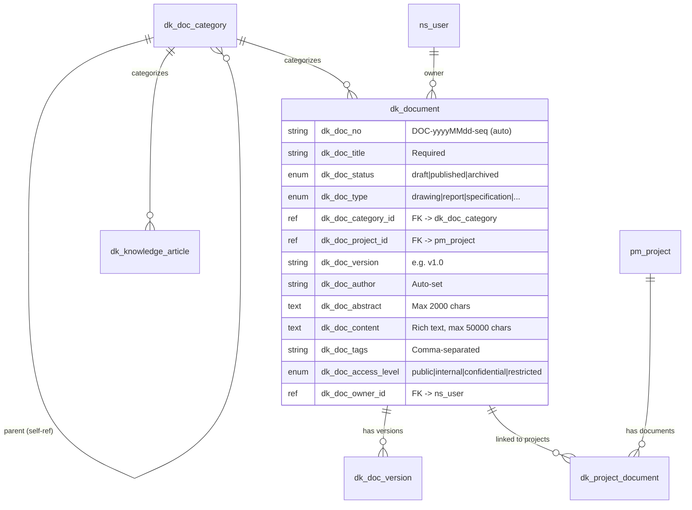
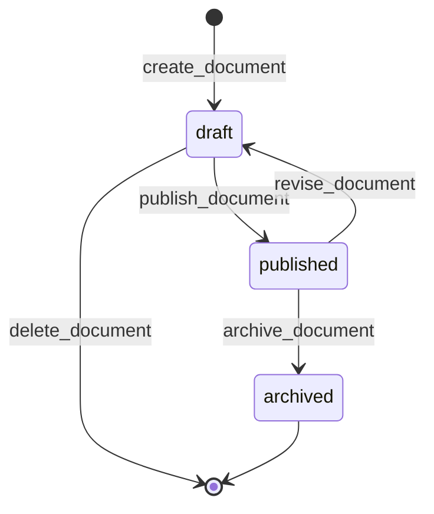

# Knowledge Base & Document Management

> Document management, categorization, version history, knowledge articles, and project-document association -- built entirely on AuraBoot's DSL configuration system.

## Business Overview

### The Problem

Enterprise knowledge is scattered across email threads, chat messages, shared drives, and individual laptops. When someone leaves, their knowledge leaves with them. Teams waste hours searching for documents that should be at their fingertips. Version confusion leads to decisions based on outdated information.

### Who It's For

- **Project Managers** organizing deliverables and tracking document versions
- **Technical Writers** authoring and publishing knowledge articles
- **Team Leads** building a searchable knowledge base for their team
- **Quality Managers** maintaining controlled documents (specifications, SOPs, compliance records)
- **All Employees** finding answers without asking the same question twice

### Key Capabilities

1. **Document Lifecycle** -- draft, publish, archive with controlled state transitions
2. **Knowledge Articles** -- standalone knowledge base entries with their own lifecycle
3. **Version History** -- full version tracking with content snapshots and change summaries
4. **Category Tree** -- hierarchical document classification with self-referencing parent categories
5. **Rich Text Editing** -- TipTap-based rich text editor for document content (up to 50,000 characters)
6. **Project Association** -- many-to-many linking between documents and projects
7. **Access Control** -- four levels: public, internal, confidential, restricted
8. **Document Types** -- drawings, reports, specifications, meeting minutes, contracts, and more
9. **Auto-Generated Numbers** -- DOC-yyyyMMdd-seq for documents, KA-yyyyMMdd-seq for articles
10. **Tag System** -- comma-separated tags for cross-cutting classification
11. **Revision Workflow** -- published documents can be sent back to draft for re-editing
12. **Dashboard** -- document statistics, category distribution, recent activity
13. **Full-Text Search** -- search across titles, tags, and document content
14. **Role-Based Access** -- reader, contributor, publisher, and admin roles
15. **Multi-Language** -- full i18n support for all labels and UI text

### Plugin Identity

```json
{
  "pluginId": "com.auraboot.doc-knowledge",
  "namespace": "dk",
  "version": "1.0.0",
  "pluginType": "config",
  "dependencies": ["com.auraboot.project-management"]
}
```

This plugin depends on the **Project Management** plugin for the `pm_project` model reference.

---

## Data Model

```
dk_doc_category (Category Tree)     [master]
dk_document (Document)              [entity]
  |-- dk_doc_version                [entity]  -- version history
dk_knowledge_article                [entity]  -- standalone KB articles
dk_project_document                 [reference] -- project <-> document M:N
```

### Model Definitions

```json
[
  {
    "code": "dk_document",
    "displayName:en": "Document",
    "modelType": "entity",
    "extension": {
      "icon": "FileText",
      "titleField": "dk_doc_title"
    }
  },
  {
    "code": "dk_doc_category",
    "displayName:en": "Document Category",
    "modelType": "entity",
    "modelCategory": "master",
    "extension": {
      "icon": "FolderTree",
      "titleField": "dk_cat_name"
    }
  },
  {
    "code": "dk_doc_version",
    "displayName:en": "Document Version",
    "modelType": "entity",
    "parentModel": "dk_document",
    "parentField": "dk_ver_document_id",
    "extension": {
      "icon": "GitBranch",
      "titleField": "dk_ver_number"
    }
  },
  {
    "code": "dk_knowledge_article",
    "displayName:en": "Knowledge Article",
    "modelType": "entity",
    "extension": {
      "icon": "BookOpen",
      "titleField": "dk_ka_title"
    }
  },
  {
    "code": "dk_project_document",
    "displayName:en": "Project Document",
    "modelType": "entity",
    "modelCategory": "reference",
    "extension": { "icon": "Link" }
  }
]
```

### Entity-Relationship Diagram



---

## Fields Deep Dive

### Document Fields

| Field | Type | Required | Special |
|-------|------|----------|---------|
| `dk_doc_no` | string(30) | No | Auto-generated DOC-{yyyyMMdd}-{seq}, read-only |
| `dk_doc_title` | string(300) | Yes | Primary search field |
| `dk_doc_project_id` | reference | No | FK -> pm_project |
| `dk_doc_category_id` | reference | No | FK -> dk_doc_category |
| `dk_doc_type` | enum | No | Dict: dk_doc_type |
| `dk_doc_version` | string(20) | No | Manual version string (e.g., "v1.0") |
| `dk_doc_author` | string(100) | No | Auto-set to current user, read-only |
| `dk_doc_abstract` | text(2000) | No | Multiline textarea |
| `dk_doc_content` | text(50000) | No | **Rich text editor** (TipTap) |
| `dk_doc_tags` | string(500) | No | Comma-separated tags |
| `dk_doc_status` | enum | Yes | draft/published/archived |
| `dk_doc_access_level` | enum | No | Default: "internal" |
| `dk_doc_owner_id` | reference | No | FK -> ns_user, read-only |

### Category Fields

| Field | Type | Required | Notes |
|-------|------|----------|-------|
| `dk_cat_name` | string(100) | Yes | Category display name |
| `dk_cat_code` | string(50) | No | Unique category code |
| `dk_cat_parent_id` | reference | No | Self-referencing FK for tree structure |
| `dk_cat_description` | text(1000) | No | |
| `dk_cat_sort_order` | integer | No | Display ordering |

### Version Fields

| Field | Type | Required | Notes |
|-------|------|----------|-------|
| `dk_ver_document_id` | reference | Yes | FK -> dk_document |
| `dk_ver_number` | string(20) | Yes | Version string (e.g., "v1.1") |
| `dk_ver_change_summary` | text(2000) | No | What changed in this version |
| `dk_ver_content_snapshot` | text(50000) | No | Frozen content at this version |
| `dk_ver_created_by` | string(100) | No | Auto-set, read-only |

### Knowledge Article Fields

| Field | Type | Required | Notes |
|-------|------|----------|-------|
| `dk_ka_no` | string(30) | No | Auto-generated KA-{yyyyMMdd}-{seq} |
| `dk_ka_title` | string(300) | Yes | |
| `dk_ka_category_id` | reference | No | FK -> dk_doc_category |
| `dk_ka_content` | text(50000) | Yes | Article body |
| `dk_ka_tags` | string(500) | No | Comma-separated |
| `dk_ka_author` | string(100) | No | Auto-set, read-only |
| `dk_ka_status` | enum | Yes | draft/published/archived |

### Data Dictionaries

| Dict Code | Values |
|-----------|--------|
| `dk_doc_type` | drawing, report, specification, meeting_minutes, contract, other |
| `dk_doc_status` | draft (gray), published (green), archived (gray) |
| `dk_article_status` | draft, published, archived |
| `dk_access_level` | public (green), internal (blue), confidential (yellow), restricted (red) |

---

## Commands & Business Logic

### Document Lifecycle



### Document Commands

| Command | Type | From | To | Notes |
|---------|------|------|----|-------|
| `dk:create_document` | create | -- | draft | Auto-sets doc_no, status, author, owner |
| `dk:update_document` | update | draft | -- | Only editable in draft |
| `dk:delete_document` | delete | draft | -- | Only deletable in draft |
| `dk:publish_document` | state_transition | draft | published | Confirmation required |
| `dk:archive_document` | state_transition | published | archived | Removed from active list |
| `dk:revise_document` | state_transition | published | draft | Returns to draft for re-editing |

#### Create Document Auto-Set Fields

```json
{
  "autoSetFields": {
    "dk_doc_no": { "strategy": "auto_generate", "pattern": "DOC-{yyyyMMdd}-{seq}" },
    "dk_doc_status": { "strategy": "fixed_value", "value": "draft" },
    "dk_doc_author": { "strategy": "current_username" },
    "dk_doc_owner_id": { "strategy": "current_username" }
  }
}
```

### Knowledge Article Lifecycle

Mirrors the document lifecycle with its own state field:

| Command | Type | From | To |
|---------|------|------|----|
| `dk:create_article` | create | -- | draft |
| `dk:update_article` | update | draft | -- |
| `dk:delete_article` | delete | draft | -- |
| `dk:publish_article` | state_transition | draft | published |
| `dk:archive_article` | state_transition | published | archived |

### Category & Version Commands

| Command | Type | Notes |
|---------|------|-------|
| `dk:create_category` | create | Includes parent_id for tree structure |
| `dk:update_category` | update | |
| `dk:delete_category` | delete | |
| `dk:create_version` | create | Auto-sets created_by |
| `dk:delete_version` | delete | |

### Project-Document Association

| Command | Type | Notes |
|---------|------|-------|
| `dk:link_document` | create | Links a document to a project |
| `dk:unlink_document` | delete | Removes the association |

---

## Pages & User Interface

### Menu Structure

```
Documents & Knowledge (icon: BookOpen)
  ├── Dashboard              /doc-knowledge/dashboard
  ├── Documents              /doc-knowledge/documents
  ├── Categories             /doc-knowledge/categories
  ├── Version History        /doc-knowledge/versions
  ├── Knowledge Articles     /doc-knowledge/articles
  └── Project Documents      /doc-knowledge/project-docs
```

### Document List Page

The document list features **status tabs** for lifecycle filtering:

```json
{
  "pageKey": "dk_document_list",
  "kind": "list",
  "layout": { "type": "grid", "cols": 12 },
  "blocks": [
    {
      "id": "block_dk_document_tabs",
      "blockType": "tabs",
      "tabs": [
        { "key": "all", "label": { "en-US": "All" }, "filter": null },
        { "key": "draft", "label": { "en-US": "Draft" },
          "filter": { "field": "dk_doc_status", "operator": "EQ", "value": "draft" } },
        { "key": "published", "label": { "en-US": "Published" },
          "filter": { "field": "dk_doc_status", "operator": "EQ", "value": "published" } },
        { "key": "archived", "label": { "en-US": "Archived" },
          "filter": { "field": "dk_doc_status", "operator": "EQ", "value": "archived" } }
      ]
    },
    {
      "id": "block_dk_document_toolbar",
      "blockType": "toolbar",
      "buttons": [{
        "code": "create",
        "primary": true,
        "icon": "Plus",
        "action": { "type": "navigate", "to": "dk_document_form", "command": "dk:create_document" }
      }]
    },
    {
      "id": "block_dk_document_table",
      "blockType": "table",
      "columns": [
        { "field": "dk_doc_no", "width": 170, "fixed": "left" },
        { "field": "dk_doc_title", "width": 240, "ellipsis": true },
        { "field": "dk_doc_status", "width": 100 },
        { "field": "dk_doc_type", "width": 110 },
        { "field": "dk_doc_category_id", "width": 130 },
        { "field": "dk_doc_version", "width": 80 },
        { "field": "dk_doc_author", "width": 100 },
        { "field": "dk_doc_tags", "width": 160, "ellipsis": true },
        { "field": "dk_doc_access_level", "width": 100 }
      ],
      "rowActions": [
        {
          "code": "publish",
          "icon": "Send",
          "visibleWhen": "row.dk_doc_status === 'draft'",
          "action": { "type": "command", "command": "dk:publish_document" }
        },
        {
          "code": "archive",
          "icon": "Archive",
          "visibleWhen": "row.dk_doc_status === 'published'",
          "action": { "type": "command", "command": "dk:archive_document" }
        }
      ]
    }
  ]
}
```

---

## AI Integration

### RAG Pipeline (Planned)

The Document & Knowledge Base plugin is designed to serve as the **content store** for AuraBoot's AI capabilities:

1. **Document Ingestion** -- published documents and articles are automatically indexed
2. **Vector Embeddings** -- content is chunked and embedded using the configured LLM provider
3. **Semantic Search** -- users can search using natural language queries
4. **AI-Assisted Answers** -- the AuraBot AI assistant can reference knowledge articles when answering questions
5. **Context-Aware Responses** -- access level filtering ensures AI only references documents the user is authorized to see

### Integration Points

- The `dk_doc_content` field (rich text, up to 50,000 characters) is the primary content source for RAG indexing
- The `dk_doc_tags` and `dk_doc_category_id` fields provide structured metadata for filtering
- The `dk_doc_access_level` field (public/internal/confidential/restricted) is used for access control in AI retrieval
- Knowledge articles (`dk_knowledge_article`) serve as curated, high-quality RAG sources

---

## Getting Started

### 1. Install Prerequisites

```bash
aura plugin publish plugins/project-management --yes
```

### 2. Install the Plugin

```bash
aura plugin publish plugins/doc-knowledge --yes
```

### 3. Create a Category Tree

```bash
# Create top-level category
aura exec dk:create_category \
  --set dk_cat_name="Engineering" \
  --set dk_cat_code="ENG" \
  --set dk_cat_sort_order:int=1

# Create sub-category
aura exec dk:create_category \
  --set dk_cat_name="Design Documents" \
  --set dk_cat_code="ENG-DESIGN" \
  --set dk_cat_parent_id="<parent_pid>" \
  --set dk_cat_sort_order:int=1
```

### 4. Create and Publish a Document

```bash
# Create
aura exec dk:create_document \
  --set dk_doc_title="API Design Specification v1.0" \
  --set dk_doc_type="specification" \
  --set dk_doc_access_level="internal" \
  --set dk_doc_tags="api,design,v1"

# Publish
aura exec dk:publish_document --target <doc_pid>
```

### 5. Create a Knowledge Article

```bash
aura exec dk:create_article \
  --set dk_ka_title="How to Set Up Development Environment" \
  --set dk_ka_content="Step 1: Install Node.js..."  \
  --set dk_ka_tags="onboarding,setup,development"
```

---

## Extension Points

### Custom Document Types

Add industry-specific document types by extending the `dk_doc_type` dictionary:

```json
{ "value": "sop", "label:en": "Standard Operating Procedure", "sortNo": 10 }
```

### Additional Access Levels

The `dk_access_level` dictionary can be extended for organizations with more granular security requirements.

### Integration with Other Plugins

- **Project Management** -- documents are linked to projects via `dk_project_document`
- **Quality** -- link SOPs and work instructions to quality inspection records
- **Compliance** -- use the access level system for controlled document distribution
- **AI Agent Platform** -- knowledge articles feed the RAG pipeline for intelligent Q&A

### Custom Rich Text Extensions

The `dk_doc_content` field uses the `renderComponent: "richtext"` extension, which renders AuraBoot's built-in TipTap editor. Custom toolbar extensions can be added through the frontend plugin system.

---

## FAQ

**Q: Can I edit a published document?**
A: Not directly. Use the `dk:revise_document` command to send it back to draft status, make your changes, then re-publish. This preserves the audit trail.

**Q: Is there automatic versioning?**
A: Versions are created explicitly via `dk:create_version`. Each version captures a `dk_ver_content_snapshot` of the document content at that point in time. This gives you full control over what constitutes a "version."

**Q: How does the category tree work?**
A: Categories use a self-referencing `dk_cat_parent_id` field. Set it to null for top-level categories, or reference another category's ID to create nested hierarchies of any depth.

**Q: Can I attach files to documents?**
A: The current version stores content as rich text in the database. File attachments can be added by extending the model with an attachment field or integrating with the platform's file storage service.

**Q: What is the maximum document size?**
A: Document content (`dk_doc_content`) supports up to 50,000 characters of rich HTML text. For larger documents, consider breaking them into sections or using the version system to track major revisions.

**Q: How is access control enforced?**
A: The `dk_doc_access_level` field (public/internal/confidential/restricted) is stored per document. Enforcement is handled through the permission system -- combine access levels with role-based permissions for fine-grained control.
