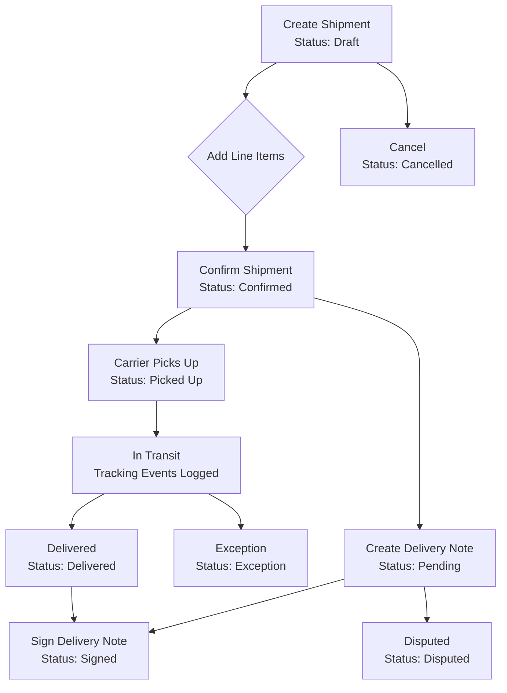
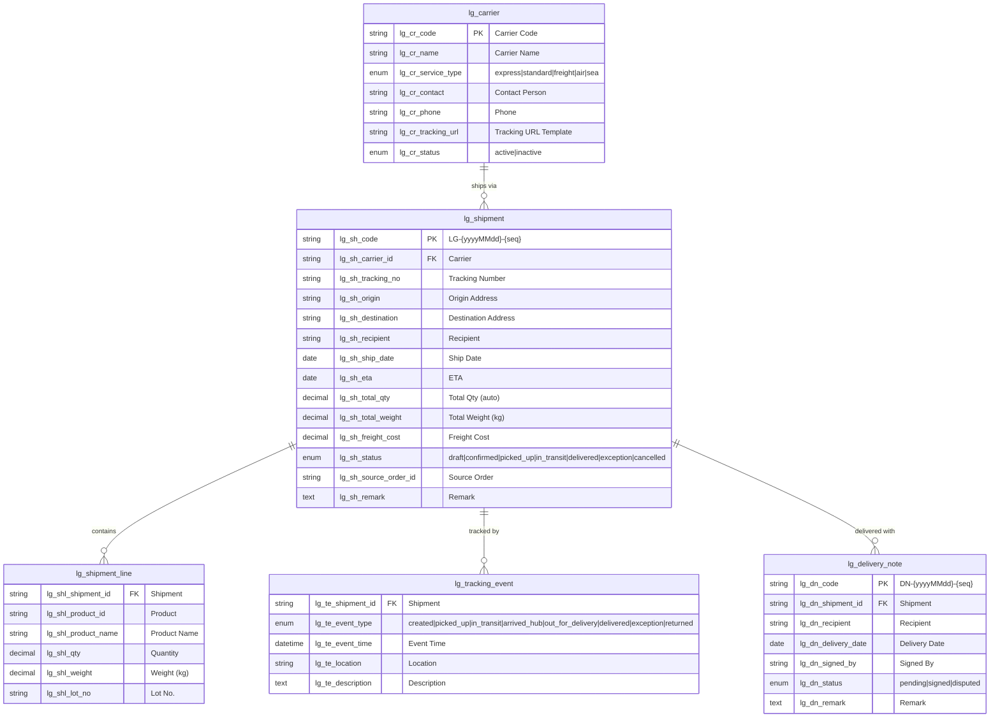
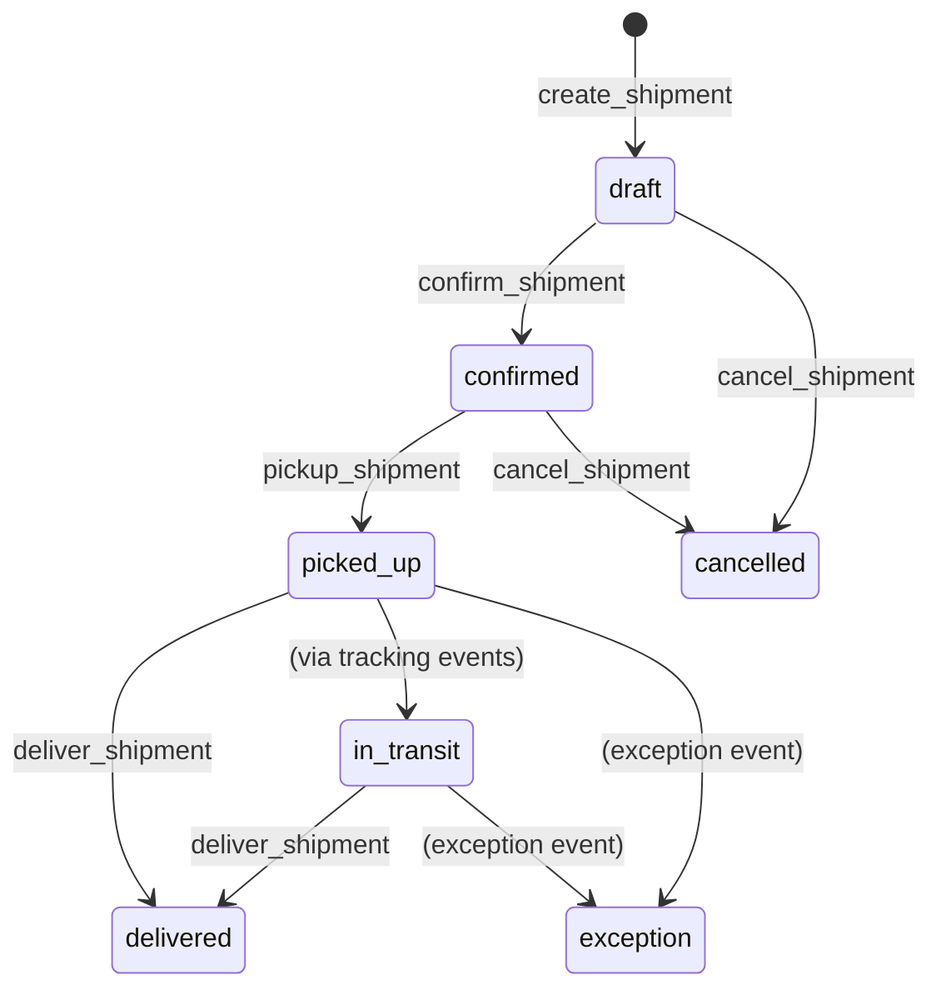

# Logistics & Shipping Management

> Shipment tracking, carrier management, delivery scheduling, and route optimization -- built entirely through AuraBoot's JSON DSL configuration.

**Plugin ID:** `com.auraboot.logistics`
**Namespace:** `lg`
**Dependencies:** Product Catalog, Inventory, Org Management

---

## Business Overview

### The Problem

Logistics teams juggle spreadsheets, phone calls, and disconnected systems to track shipments from warehouse to customer. Without a unified system, shipments get lost, delivery dates slip, freight costs balloon, and customers receive no visibility into their orders.

### Who It's For

- **Logistics Coordinators** -- manage shipments, assign carriers, track deliveries end-to-end
- **Warehouse Managers** -- create shipments from pick-and-pack operations
- **Customer Service** -- provide real-time shipment status to customers
- **Finance Teams** -- reconcile freight costs against carrier invoices

### Key Capabilities

1. **Carrier Master Data** -- maintain a registry of carriers with service types, contact info, and tracking URL templates
2. **Shipment Creation** -- create outbound shipments with auto-generated codes (`LG-{yyyyMMdd}-{seq}`)
3. **Multi-line Shipments** -- attach product line items with quantities, weights, and lot numbers
4. **Shipment State Machine** -- full lifecycle: Draft -> Confirmed -> Picked Up -> In Transit -> Delivered
5. **Carrier Assignment** -- link shipments to carriers with tracking numbers
6. **Real-time Tracking Events** -- log milestones: created, picked up, in transit, arrived hub, out for delivery, delivered, exception, returned
7. **Delivery Note Generation** -- create proof-of-delivery documents with auto-generated codes (`DN-{yyyyMMdd}-{seq}`)
8. **Delivery Confirmation** -- capture recipient signature and delivery date
9. **Freight Cost Tracking** -- record freight costs per shipment for financial reconciliation
10. **Source Order Linkage** -- trace shipments back to originating sales or purchase orders
11. **Weight & Quantity Totals** -- automatic aggregation from shipment lines to header
12. **Exception Handling** -- flag shipments with delivery exceptions
13. **Cancellation Workflow** -- cancel shipments that are no longer needed
14. **Multi-service Support** -- express, standard, freight, air, and sea shipping
15. **ETA Tracking** -- estimated time of arrival with date-based sorting
16. **Bilingual Interface** -- full English and Chinese i18n support

### Workflow



---

## Data Model

### ER Diagram



### Models Summary

| Model | Code | Category | Description |
|-------|------|----------|-------------|
| Carrier | `lg_carrier` | Master | Logistics carrier / freight company master data |
| Shipment | `lg_shipment` | Document | Outbound shipment with carrier, tracking, and delivery workflow |
| Shipment Line | `lg_shipment_line` | Entity | Line items within a shipment |
| Tracking Event | `lg_tracking_event` | Transaction | Shipment tracking milestones |
| Delivery Note | `lg_delivery_note` | Document | Proof of delivery document with recipient confirmation |

### Model Configuration (Real JSON)

```json
[
  {
    "code": "lg_carrier",
    "displayName:en": "Carrier",
    "modelType": "entity",
    "modelCategory": "master",
    "extension": {
      "icon": "Building2",
      "category": "logistics",
      "titleField": "lg_cr_name",
      "subtitleField": "lg_cr_code"
    }
  },
  {
    "code": "lg_shipment",
    "displayName:en": "Shipment",
    "modelType": "entity",
    "modelCategory": "document",
    "extension": {
      "icon": "Truck",
      "category": "logistics",
      "titleField": "lg_sh_code",
      "subtitleField": "lg_sh_status",
      "documentConfig": {
        "lineModel": "lg_shipment_line",
        "lineForeignKey": "lg_shl_shipment_id",
        "codeField": "lg_sh_code",
        "codePattern": "LG-{yyyyMMdd}-{seq}",
        "statusField": "lg_sh_status",
        "totalFields": [
          { "parentField": "lg_sh_total_qty", "childField": "lg_shl_qty" }
        ],
        "stateMachine": "full"
      }
    }
  },
  {
    "code": "lg_delivery_note",
    "displayName:en": "Delivery Note",
    "modelType": "entity",
    "modelCategory": "document",
    "extension": {
      "icon": "FileCheck",
      "category": "logistics",
      "titleField": "lg_dn_code",
      "subtitleField": "lg_dn_status",
      "documentConfig": {
        "codeField": "lg_dn_code",
        "codePattern": "DN-{yyyyMMdd}-{seq}",
        "statusField": "lg_dn_status",
        "stateMachine": "simple"
      }
    }
  }
]
```

---

## Fields Deep Dive

### Carrier Fields

| Field Code | Label | Type | Required | Searchable | Notes |
|-----------|-------|------|----------|------------|-------|
| `lg_cr_code` | Carrier Code | string | Yes | Yes | Max 50 chars |
| `lg_cr_name` | Carrier Name | string | Yes | Yes | Max 200 chars |
| `lg_cr_service_type` | Service Type | enum | No | Yes | Dict: `lg_service_type` |
| `lg_cr_contact` | Contact Person | string | No | No | Max 100 chars |
| `lg_cr_phone` | Phone | string | No | No | Max 30 chars |
| `lg_cr_tracking_url` | Tracking URL Template | string | No | No | Max 500 chars |
| `lg_cr_status` | Status | enum | No | Yes | Dict: `lg_carrier_status`, default: `active` |

### Shipment Fields

| Field Code | Label | Type | Required | Editable | Notes |
|-----------|-------|------|----------|----------|-------|
| `lg_sh_code` | Shipment Code | string | Yes | No | Auto-generated, read-only |
| `lg_sh_carrier_id` | Carrier | string | No | Yes | Reference to carrier |
| `lg_sh_tracking_no` | Tracking Number | string | No | Yes | Carrier's tracking number |
| `lg_sh_origin` | Origin Address | string | No | Yes | Max 500 chars |
| `lg_sh_destination` | Destination | string | Yes | Yes | Max 500 chars |
| `lg_sh_recipient` | Recipient | string | No | Yes | Searchable |
| `lg_sh_ship_date` | Ship Date | date | No | Yes | Sortable |
| `lg_sh_eta` | ETA | date | No | Yes | Sortable |
| `lg_sh_total_qty` | Total Qty | decimal | No | No | Auto-calculated from lines |
| `lg_sh_total_weight` | Total Weight (kg) | decimal | No | Yes | Min: 0 |
| `lg_sh_freight_cost` | Freight Cost | decimal | No | Yes | Min: 0 |
| `lg_sh_status` | Status | enum | No | No | Dict: `lg_shipment_status` |
| `lg_sh_source_order_id` | Source Order | string | No | Yes | Searchable |
| `lg_sh_remark` | Remark | text | No | Yes | Free text |

### Dictionaries

**Shipment Status** (`lg_shipment_status`):
| Value | Label | Color |
|-------|-------|-------|
| `draft` | Draft | Gray |
| `confirmed` | Confirmed | Green |
| `picked_up` | Picked Up | Blue |
| `in_transit` | In Transit | Blue |
| `delivered` | Delivered | Blue |
| `exception` | Exception | Blue |
| `cancelled` | Cancelled | Red |

**Service Type** (`lg_service_type`):
| Value | Label |
|-------|-------|
| `express` | Express |
| `standard` | Standard |
| `freight` | Freight |
| `air` | Air |
| `sea` | Sea |

**Tracking Event Type** (`lg_tracking_event_type`):
| Value | Label |
|-------|-------|
| `created` | Created |
| `picked_up` | Picked Up |
| `in_transit` | In Transit |
| `arrived_hub` | Arrived Hub |
| `out_for_delivery` | Out for Delivery |
| `delivered` | Delivered |
| `exception` | Exception |
| `returned` | Returned |

---

## Commands & Business Logic

### Command Summary

| Command | Code | Type | Model | Description |
|---------|------|------|-------|-------------|
| Create Shipment | `lg:create_shipment` | create | `lg_shipment` | Auto-generates code, sets status=draft |
| Update Shipment | `lg:update_shipment` | update | `lg_shipment` | Edit shipment details |
| Confirm Shipment | `lg:confirm_shipment` | update | `lg_shipment` | Draft -> Confirmed |
| Pick Up Shipment | `lg:pickup_shipment` | update | `lg_shipment` | Confirmed -> Picked Up, requires tracking number |
| Mark Delivered | `lg:deliver_shipment` | update | `lg_shipment` | Picked Up/In Transit -> Delivered |
| Cancel Shipment | `lg:cancel_shipment` | update | `lg_shipment` | Any -> Cancelled |
| Create Carrier | `lg:create_carrier` | create | `lg_carrier` | Auto-sets status=active |
| Update Carrier | `lg:update_carrier` | update | `lg_carrier` | Edit carrier details |
| Delete Carrier | `lg:delete_carrier` | delete | `lg_carrier` | Remove carrier |
| Create Delivery Note | `lg:create_delivery_note` | create | `lg_delivery_note` | Auto-generates code, status=pending |
| Sign Delivery Note | `lg:sign_delivery_note` | update | `lg_delivery_note` | Pending -> Signed |
| Create Tracking Event | `lg:create_tracking_event` | create | `lg_tracking_event` | Log tracking milestone |

### Shipment State Machine



### Create Shipment Command (Real JSON)

```json
{
  "code": "lg:create_shipment",
  "displayName:en": "Create Shipment",
  "type": "create",
  "modelCode": "lg_shipment",
  "inputFields": [
    "lg_sh_carrier_id", "lg_sh_tracking_no", "lg_sh_origin",
    "lg_sh_destination", "lg_sh_recipient", "lg_sh_ship_date",
    "lg_sh_eta", "lg_sh_total_weight", "lg_sh_freight_cost",
    "lg_sh_source_order_id", "lg_sh_remark"
  ],
  "autoSetFields": {
    "lg_sh_code": { "strategy": "auto_generate", "pattern": "LG-{yyyyMMdd}-{seq}" },
    "lg_sh_status": { "strategy": "fixed_value", "value": "draft" },
    "lg_sh_total_qty": { "strategy": "fixed_value", "value": "0" }
  },
  "permissions": ["LG.logistics.manage"]
}
```

### Pick Up Shipment Command (Real JSON)

```json
{
  "code": "lg:pickup_shipment",
  "displayName:en": "Pick Up Shipment",
  "type": "update",
  "modelCode": "lg_shipment",
  "inputFields": ["lg_sh_tracking_no"],
  "autoSetFields": {
    "lg_sh_status": { "strategy": "fixed_value", "value": "picked_up" }
  },
  "permissions": ["LG.logistics.execute"]
}
```

---

## Pages & User Interface

### Menu Structure

| Menu | Icon | Path | Page Key |
|------|------|------|----------|
| Logistics (directory) | Truck | `/logistics` | -- |
| Shipments | Truck | `/logistics/shipments` | `lg_shipment_list` |
| Carriers | Building2 | `/logistics/carriers` | `lg_carrier_list` |
| Tracking | MapPin | `/logistics/tracking` | `lg_tracking_event_list` |
| Delivery Notes | FileCheck | `/logistics/delivery-notes` | `lg_delivery_note_list` |

### Shipment List Page (Real JSON)

```json
{
  "pageKey": "lg_shipment_list",
  "name:en": "Shipments",
  "modelCode": "lg_shipment",
  "kind": "list",
  "schemaVersion": 2,
  "blocks": [
    {
      "id": "block_sh_toolbar",
      "blockType": "form-buttons",
      "buttons": [
        {
          "code": "create",
          "primary": true,
          "icon": "Plus",
          "permissionCode": "LG.logistics.manage",
          "action": { "type": "navigate", "to": "lg_shipment_form", "command": "lg:create_shipment" }
        }
      ]
    },
    {
      "id": "block_sh_table",
      "blockType": "table",
      "defaultSort": { "field": "created_at", "order": "desc" },
      "searchFields": ["lg_sh_code", "lg_sh_tracking_no", "lg_sh_recipient", "lg_sh_status"],
      "table": {
        "columns": [
          { "field": "lg_sh_code", "width": 150 },
          { "field": "lg_sh_carrier_id", "width": 120 },
          { "field": "lg_sh_tracking_no", "width": 150 },
          { "field": "lg_sh_destination", "width": 200 },
          { "field": "lg_sh_recipient", "width": 100 },
          { "field": "lg_sh_ship_date", "width": 120 },
          { "field": "lg_sh_eta", "width": 120 },
          { "field": "lg_sh_status", "width": 120, "renderType": "tag", "dictCode": "lg_shipment_status" },
          {
            "field": "actions",
            "isActionColumn": true,
            "buttons": [
              {
                "code": "edit",
                "visibleWhen": "row.lg_sh_status === 'draft'",
                "action": { "type": "navigate", "to": "lg_shipment_form", "command": "lg:update_shipment" }
              },
              {
                "code": "confirm",
                "visibleWhen": "row.lg_sh_status === 'draft'",
                "action": { "type": "command", "command": "lg:confirm_shipment" }
              },
              {
                "code": "pickup",
                "visibleWhen": "row.lg_sh_status === 'confirmed'",
                "action": { "type": "command", "command": "lg:pickup_shipment" }
              },
              {
                "code": "deliver",
                "visibleWhen": "row.lg_sh_status === 'in_transit' || row.lg_sh_status === 'picked_up'",
                "action": { "type": "command", "command": "lg:deliver_shipment" }
              }
            ]
          }
        ]
      }
    }
  ]
}
```

### Shipment Form Page (Real JSON)

```json
{
  "pageKey": "lg_shipment_form",
  "name:en": "Shipment Form",
  "modelCode": "lg_shipment",
  "kind": "form",
  "schemaVersion": 2,
  "layout": { "type": "grid", "cols": 12, "gap": 12 },
  "blocks": [
    {
      "id": "block_sh_basic",
      "blockType": "form-section",
      "title": { "en": "Shipment Information" },
      "columns": 2,
      "fields": [
        { "field": "lg_sh_carrier_id", "layout": { "colSpan": 6 } },
        { "field": "lg_sh_tracking_no", "layout": { "colSpan": 6 } },
        { "field": "lg_sh_origin", "layout": { "colSpan": 12 } },
        { "field": "lg_sh_destination", "layout": { "colSpan": 12 } },
        { "field": "lg_sh_recipient", "layout": { "colSpan": 6 } },
        { "field": "lg_sh_source_order_id", "layout": { "colSpan": 6 } },
        { "field": "lg_sh_ship_date", "layout": { "colSpan": 6 } },
        { "field": "lg_sh_eta", "layout": { "colSpan": 6 } },
        { "field": "lg_sh_total_weight", "layout": { "colSpan": 6 } },
        { "field": "lg_sh_freight_cost", "layout": { "colSpan": 6 } },
        { "field": "lg_sh_remark", "layout": { "colSpan": 12 } }
      ]
    }
  ]
}
```

---

## Permissions & Roles

### Permissions

| Code | Name | Type | Description |
|------|------|------|-------------|
| `lg.logistics.manage` | Logistics Management | operation | Create, edit, delete shipments, carriers, delivery notes |
| `lg.logistics.read` | Logistics View | data | View shipments, carriers, tracking events, delivery notes |
| `lg.logistics.execute` | Logistics Execution | operation | Pick up, deliver shipments, log tracking events, sign delivery notes |
| `lg.dashboard.logistics` | Logistics Dashboard | operation | View logistics dashboard |

### Roles

| Role | Code | Permissions |
|------|------|-------------|
| Logistics Coordinator | `lg_logistics_coordinator` | manage, read, execute, dashboard |

---

## Internationalization

All labels support dual-language (English / Chinese) through AuraBoot's i18n system:

```json
[
  { "key": "model.lg_shipment._meta.label", "en-US": "Shipment", "zh-CN": "物流发货单" },
  { "key": "field.lg_sh_code.label", "en-US": "Shipment Code", "zh-CN": "发货单号" },
  { "key": "field.lg_sh_tracking_no.label", "en-US": "Tracking Number", "zh-CN": "运单号" },
  { "key": "command.lg:create_shipment.label", "en-US": "Create Shipment", "zh-CN": "新建发货单" },
  { "key": "command.lg:confirm_shipment.label", "en-US": "Confirm Shipment", "zh-CN": "确认发货" },
  { "key": "command.lg:deliver_shipment.label", "en-US": "Mark Delivered", "zh-CN": "签收" }
]
```

---

## Getting Started

### 1. Install the Plugin

```bash
aura plugin publish plugins/logistics --yes
```

### 2. Verify Installation

```bash
aura dsl show lg_shipment
aura dsl show lg_carrier
```

### 3. Create a Carrier

```bash
aura exec lg:create_carrier \
  --set lg_cr_code="SF-EXPRESS" \
  --set lg_cr_name="SF Express" \
  --set lg_cr_service_type="express" \
  --set lg_cr_contact="John Zhang" \
  --set lg_cr_phone="+86-400-111-1111"
```

### 4. Create a Shipment

```bash
aura exec lg:create_shipment \
  --set lg_sh_destination="123 Main St, Shanghai" \
  --set lg_sh_recipient="Jane Li" \
  --set lg_sh_ship_date="2026-04-15" \
  --set lg_sh_eta="2026-04-18" \
  --set lg_sh_total_weight:decimal=25.5 \
  --set lg_sh_freight_cost:decimal=150.00
```

### 5. Progress Through the Lifecycle

```bash
# Confirm the shipment
aura exec lg:confirm_shipment --target <shipmentPid>

# Carrier picks up
aura exec lg:pickup_shipment --target <shipmentPid> --set lg_sh_tracking_no="SF1234567890"

# Mark as delivered
aura exec lg:deliver_shipment --target <shipmentPid>
```

---

## Extension Points

### Custom Tracking Integration

The `lg_cr_tracking_url` field on carriers supports URL templates. You can build custom tracking pages that resolve `{trackingNo}` from the shipment's `lg_sh_tracking_no` field.

### Source Order Linkage

The `lg_sh_source_order_id` field links shipments to any upstream document (sales orders, purchase orders, transfer orders). Extend with automation rules to auto-create shipments when orders are confirmed.

### Weight Aggregation

The `documentConfig.totalFields` configuration automatically sums `lg_shl_qty` from shipment lines into `lg_sh_total_qty` on the shipment header. Add additional total fields by extending the model configuration.

### Webhook Integration

Configure webhooks on shipment status changes to notify external systems (WMS, TMS, customer portals) when shipments reach key milestones.

---

## FAQ

**Q: Can I track shipments from multiple carriers on one order?**
A: Each shipment is linked to one carrier. For multi-carrier scenarios, create separate shipments per carrier and link them to the same source order via `lg_sh_source_order_id`.

**Q: How are tracking events related to shipment status?**
A: Tracking events (`lg_tracking_event`) are informational logs. Status transitions on the shipment itself are driven by explicit commands (`lg:confirm_shipment`, `lg:pickup_shipment`, `lg:deliver_shipment`).

**Q: Can delivery notes be created without a shipment?**
A: The `lg_dn_shipment_id` field is not strictly required at the database level, but the standard workflow links every delivery note to a shipment.

**Q: How do I handle partial deliveries?**
A: Create multiple delivery notes against the same shipment, each covering a subset of line items. The shipment remains in its current status until all items are delivered.

**Q: What happens when I cancel a shipment?**
A: The `lg:cancel_shipment` command sets the status to `cancelled`. Existing tracking events are preserved for audit trail. Delivery notes linked to cancelled shipments should be manually reviewed.
