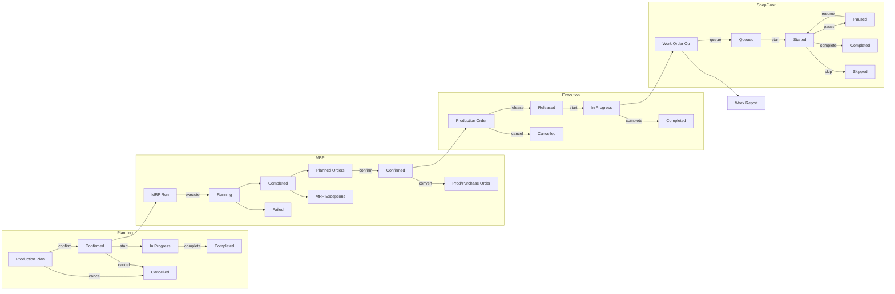
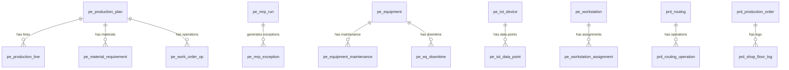

# Manufacturing Management

> Production planning, BOM management, work orders, MRP, APS scheduling, MES execution, equipment maintenance, and shop floor control -- built entirely from DSL configuration.

AuraBoot ships two complementary manufacturing plugins that together cover the full spectrum from basic production order tracking to advanced PCBA manufacturing with MRP, APS, and MES capabilities.

| Plugin | ID | Namespace | Scope |
|--------|----|-----------|-------|
| **Production** | `com.auraboot.production` | `prd` | Work centers, routings, production orders, shop floor logs |
| **PCBA Manufacturing** | `com.auraboot.pcba-manufacturing` | `pe_mfg` | Production plans, MRP, APS scheduling, MES operations, equipment, IoT, workstations |

Both plugins depend on `com.auraboot.product-catalog`, `com.auraboot.inventory`, and `com.auraboot.org-management`.

---

## Business Overview

### The Problem

Manufacturers need to coordinate planning, material procurement, production scheduling, shop floor execution, equipment maintenance, and quality tracking -- often across multiple product lines and work centers. Without a unified system, planning lives in spreadsheets, shop floor status is reported verbally, and material shortages are discovered too late.

### Target Users

| Role | Activities |
|------|-----------|
| Production Planner | Create production plans/orders, run MRP, review planned orders |
| Shop Floor Supervisor | Start/complete work orders, log output and scrap, manage workstations |
| MES Operator | Execute operations step-by-step, report work, handle exceptions |
| Maintenance Engineer | Schedule equipment maintenance, track spare parts, log downtime |
| Production Manager | Monitor dashboards, review KPIs (yield, OEE, overdue orders) |

### Key Capabilities

1. **Work Center Management** -- Define machines, assembly lines, testing stations with capacity and cost rates
2. **Routing Definition** -- Multi-step operation sequences with setup/run times per work center
3. **Production Order Lifecycle** -- Planned -> Released -> In Progress -> Completed/Cancelled with auto-generated codes
4. **Shop Floor Logging** -- Start, stop, output, scrap, downtime, and changeover event tracking
5. **Production Plan with BOM** -- Plans linked to product BOM with planned/actual quantities
6. **Material Requirements Planning (MRP)** -- Automated MRP runs that expand BOMs, calculate net requirements, and generate planned orders
7. **MRP Exception Management** -- Past-due, shortage, and long lead-time warnings with resolution tracking
8. **Planned Order Processing** -- Confirm, convert to purchase/production orders, or cancel MRP suggestions
9. **APS Scheduling** -- Advanced Planning & Scheduling with resource calendars, capacity constraints, and published schedules
10. **MES Operation Execution** -- Work order operations with queue/start/pause/resume/complete/skip lifecycle
11. **Work Reporting** -- Operator work reports tied to specific operations
12. **Equipment Master Data** -- Equipment registry with type, manufacturer, serial number, next maintenance date
13. **Equipment Maintenance** -- Scheduled and unscheduled maintenance records with cost tracking
14. **Spare Parts Management** -- Equipment spare parts inventory with supplier and location info
15. **Equipment Downtime Tracking** -- Planned/unplanned downtime logging with duration calculation
16. **Workstation Management** -- Workstation-to-resource-to-production-line binding for MES execution
17. **Workstation Assignment** -- Operator-to-workstation assignment by shift and time period
18. **Operation Exception Handling** -- Report and resolve downtime, material shortage, and quality issues
19. **Production Versioning** -- Link products to specific BOM + routing combinations with validity periods
20. **IoT Device Integration** -- Register sensors, PLCs, gateways with protocol and connectivity info
21. **IoT Data Points** -- Define measurement points with thresholds, units, and collection intervals
22. **Production Dashboard** -- KPI cards, daily output trends, defect pareto, equipment downtime analysis
23. **Wave Management** -- Batch grouping for material picking operations

### Workflow



---

## Data Model

### ER Diagram



### Models -- Production Plugin (`prd`)

| Model Code | Display Name | Category | Description |
|------------|-------------|----------|-------------|
| `prd_work_center` | Work Center | master | Work center with type (machine/manual/assembly/testing), capacity, cost rate |
| `prd_routing` | Routing | master | Manufacturing routing defining operation sequence for a product |
| `prd_routing_operation` | Routing Operation | entity | Individual operation step within a routing (child of `prd_routing`) |
| `prd_production_order` | Production Order | document | Production order with full status workflow and auto-generated code |
| `prd_shop_floor_log` | Shop Floor Log | transaction | Activity log: start, stop, output, scrap, downtime, changeover events |

### Models -- PCBA Manufacturing Plugin (`pe_mfg`)

| Model Code | Display Name | Category | Description |
|------------|-------------|----------|-------------|
| `pe_production_plan` | Production Plan | document | Plan with BOM reference, quantity, and status workflow |
| `pe_production_line` | Production Line | entity | Plan output line items (child of `pe_production_plan`) |
| `pe_material_requirement` | Material Requirement | entity | MRP-expanded material requirements (child of plan) |
| `pe_mrp_run` | MRP Run | transaction | MRP execution records with parameters and results |
| `pe_planned_order` | Planned Order | document | MRP-generated planned purchase or production orders |
| `pe_mrp_exception` | MRP Exception | transaction | Past-due, shortage, long lead-time warnings |
| `pe_resource` | Production Resource | master | Machines, lines, workers for APS scheduling |
| `pe_resource_calendar` | Resource Calendar | master | Availability by date and shift |
| `pe_schedule_result` | Schedule Result | transaction | APS output: assigned resource, time slots, strategy |
| `pe_operation` | Operation | entity | Operation steps within a routing (child of `pe_routing`) |
| `pe_work_order_op` | Work Order Operation | entity | Work order operation instances tracking execution |
| `pe_work_report` | Work Report | transaction | Work reporting records for operation tracking |
| `pe_equipment` | Equipment | master | Production equipment master data |
| `pe_equipment_maintenance` | Maintenance Record | transaction | Equipment maintenance and calibration records |
| `pe_spare_part` | Spare Part | master | Equipment spare parts inventory |
| `pe_eq_downtime` | Equipment Downtime | transaction | Start/end time, duration, type, linked maintenance |
| `pe_workstation` | Workstation | master | Binds resource, production line, operation type for MES |
| `pe_workstation_assignment` | Workstation Assignment | transaction | Operator-shift-time assignment |
| `pe_operation_exception` | Operation Exception | transaction | Downtime, material shortage, quality issue tracking |
| `pe_wave` | Wave | document | Batch grouping for picking operations |
| `pe_production_version` | Production Version | master | Product-BOM-routing link with validity period |
| `pe_iot_device` | IoT Device | master | Sensor, PLC, gateway, camera registration |
| `pe_iot_data_point` | IoT Data Point | entity | Measurement code, type, unit, threshold, collection interval |

### Model JSON Example -- Production Order

```json
{
  "code": "prd_production_order",
  "displayName:zh-CN": "生产工单",
  "displayName:en": "Production Order",
  "description": "Production order with status workflow: PLANNED -> RELEASED -> in_progress -> completed",
  "modelType": "entity",
  "modelCategory": "document",
  "extension": {
    "icon": "Hammer",
    "category": "production",
    "titleField": "prd_po_code",
    "subtitleField": "prd_po_status",
    "documentConfig": {
      "codeField": "prd_po_code",
      "codePattern": "PO-{yyyyMMdd}-{seq}",
      "statusField": "prd_po_status",
      "stateMachine": "full"
    }
  }
}
```

---

## Fields Deep Dive

### Production Order Fields (`prd_production_order`)

| Field Code | Label (EN) | Label (ZH) | Type | Notes |
|-----------|-----------|-----------|------|-------|
| `prd_po_code` | Order Code | 工单编号 | STRING | Auto-generated: `PO-{yyyyMMdd}-{seq}` |
| `prd_po_product_id` | Product | 产品 | REFERENCE | Reference to product catalog |
| `prd_po_product_name` | Product Name | 产品名称 | STRING | Denormalized product name |
| `prd_po_routing_id` | Routing | 工艺路线 | REFERENCE | Reference to `prd_routing` |
| `prd_po_qty_planned` | Planned Qty | 计划数量 | NUMBER | Target production quantity |
| `prd_po_qty_completed` | Completed Qty | 完工数量 | NUMBER | Auto-initialized to 0 |
| `prd_po_qty_scrap` | Scrap Qty | 报废数量 | NUMBER | Auto-initialized to 0 |
| `prd_po_status` | Status | 状态 | ENUM | `planned`/`released`/`in_progress`/`completed`/`closed`/`cancelled` |
| `prd_po_priority` | Priority | 优先级 | ENUM | `low`/`normal`/`high`/`urgent` |
| `prd_po_planned_start` | Planned Start | 计划开始日期 | DATE | |
| `prd_po_planned_end` | Planned End | 计划完成日期 | DATE | |
| `prd_po_actual_start` | Actual Start | 实际开始 | DATETIME | Set when production starts |
| `prd_po_actual_end` | Actual End | 实际完成 | DATETIME | Set when production completes |
| `prd_po_work_center_id` | Work Center | 工作中心 | REFERENCE | Reference to `prd_work_center` |
| `prd_po_sales_order_id` | Sales Order | 销售订单 | REFERENCE | Optional link to source sales order |
| `prd_po_remark` | Remark | 备注 | TEXT | |

### Work Center Fields (`prd_work_center`)

| Field Code | Label (EN) | Type | Notes |
|-----------|-----------|------|-------|
| `prd_wc_code` | Work Center Code | STRING | Auto-generated: `WC-{yyyyMMdd}-{seq}` |
| `prd_wc_name` | Name | STRING | |
| `prd_wc_type` | Type | ENUM | `machine`/`manual`/`assembly`/`testing` |
| `prd_wc_capacity` | Capacity (pcs/hr) | NUMBER | |
| `prd_wc_cost_rate` | Cost Rate (per hr) | DECIMAL | |
| `prd_wc_location` | Location | STRING | Physical location description |
| `prd_wc_status` | Status | ENUM | `active`/`maintenance`/`inactive` |

### Routing Operation Fields (`prd_routing_operation`)

| Field Code | Label (EN) | Type | Notes |
|-----------|-----------|------|-------|
| `prd_rop_seq` | Sequence | NUMBER | Operation order within routing |
| `prd_rop_name` | Operation Name | STRING | |
| `prd_rop_routing_id` | Routing | REFERENCE | Parent routing |
| `prd_rop_work_center_id` | Work Center | REFERENCE | |
| `prd_rop_setup_time` | Setup Time | NUMBER | Minutes |
| `prd_rop_run_time` | Run Time | NUMBER | Minutes per unit |
| `prd_rop_description` | Description | TEXT | |

### Shop Floor Log Fields (`prd_shop_floor_log`)

| Field Code | Label (EN) | Type | Notes |
|-----------|-----------|------|-------|
| `prd_sfl_order_id` | Production Order | REFERENCE | |
| `prd_sfl_work_center_id` | Work Center | REFERENCE | |
| `prd_sfl_event_type` | Event Type | ENUM | `start`/`stop`/`output`/`scrap`/`downtime`/`changeover` |
| `prd_sfl_operator` | Operator | STRING | |
| `prd_sfl_qty_output` | Output Qty | NUMBER | |
| `prd_sfl_qty_scrap` | Scrap Qty | NUMBER | |
| `prd_sfl_start_time` | Start Time | DATETIME | |
| `prd_sfl_end_time` | End Time | DATETIME | |
| `prd_sfl_downtime_min` | Downtime (min) | NUMBER | |
| `prd_sfl_remark` | Remark | TEXT | |

### Enumerations

**Production Order Status** (`prd_order_status`):

| Value | EN Label | Color |
|-------|---------|-------|
| `planned` | Planned | `#d9d9d9` |
| `released` | Released | `#1890ff` |
| `in_progress` | In Progress | `#fa8c16` |
| `completed` | Completed | `#52c41a` |
| `closed` | Closed | `#8c8c8c` |
| `cancelled` | Cancelled | `#ff4d4f` |

**Production Plan Status** (`pe_production_status`):

| Value | EN Label | Color |
|-------|---------|-------|
| `draft` | Draft | `#d9d9d9` |
| `confirmed` | Confirmed | `#1890ff` |
| `in_progress` | In Progress | `#fa8c16` |
| `completed` | Completed | `#52c41a` |
| `cancelled` | Cancelled | `#ff4d4f` |

**MRP Run Status** (`pe_mrp_status`):

| Value | EN Label |
|-------|---------|
| `draft` | Draft |
| `running` | Running |
| `completed` | Completed |
| `failed` | Failed |

**Work Center Type** (`prd_work_center_type`):

| Value | EN Label |
|-------|---------|
| `machine` | Machine |
| `manual` | Manual |
| `assembly` | Assembly |
| `testing` | Testing |

**Priority** (`prd_priority`):

| Value | EN Label | Color |
|-------|---------|-------|
| `low` | Low | `#d9d9d9` |
| `normal` | Normal | `#1890ff` |
| `high` | High | `#fa8c16` |
| `urgent` | Urgent | `#ff4d4f` |

**Shop Floor Event Type** (`prd_sfl_event_type`):

| Value | EN Label |
|-------|---------|
| `start` | Start |
| `stop` | Stop |
| `output` | Output |
| `scrap` | Scrap |
| `downtime` | Downtime |
| `changeover` | Changeover |

---

## Commands & Business Logic

### Production Plugin Commands

| Command Code | Type | Model | Description |
|-------------|------|-------|-------------|
| `prd:create_production_order` | create | `prd_production_order` | Create order with auto-code `PO-{yyyyMMdd}-{seq}`, status=`planned` |
| `prd:update_production_order` | update | `prd_production_order` | Edit order details |
| `prd:release_production_order` | update | `prd_production_order` | Transition: `planned` -> `released` |
| `prd:start_production_order` | update | `prd_production_order` | Transition: `released` -> `in_progress`, captures actual start |
| `prd:complete_production_order` | update | `prd_production_order` | Transition: `in_progress` -> `completed`, captures qty and actual end |
| `prd:cancel_production_order` | update | `prd_production_order` | Transition to `cancelled` |
| `prd:create_routing` | create | `prd_routing` | Create routing with auto-code `RT-{yyyyMMdd}-{seq}`, status=`draft` |
| `prd:update_routing` | update | `prd_routing` | Edit routing details |
| `prd:activate_routing` | update | `prd_routing` | Transition: `draft` -> `active` |
| `prd:create_work_center` | create | `prd_work_center` | Create with auto-code `WC-{yyyyMMdd}-{seq}`, status=`active` |
| `prd:update_work_center` | update | `prd_work_center` | Edit work center |
| `prd:delete_work_center` | delete | `prd_work_center` | Delete work center |
| `prd:create_shop_floor_log` | create | `prd_shop_floor_log` | Log shop floor activity |
| `prd:update_shop_floor_log` | update | `prd_shop_floor_log` | Edit log entry |

### PCBA Manufacturing Commands (Key)

| Command Code | Type | Description |
|-------------|------|-------------|
| `pe:create_production_plan` | create | Create plan with auto-code `PP-{yyyyMMdd}-{seq}`, status=`draft` |
| `pe:confirm_production` | state_transition | `draft` -> `confirmed`. **Java handler expands BOM into material requirements.** |
| `pe:start_production` | state_transition | `confirmed` -> `in_progress`. **Java handler auto-creates material picking outbound.** |
| `pe:complete_production` | state_transition | `in_progress` -> `completed`. **Java handler auto-creates finished goods inbound receipt.** |
| `pe:cancel_production` | state_transition | Cancel plan (from draft or confirmed) |
| `pe:execute_mrp` | state_transition | `draft` -> `running`. **Java handler runs MRP calculation.** |
| `pe:create_planned_order` | create | Create MRP planned order |
| `pe:confirm_planned_order` | state_transition | Confirm planned order |
| `pe:convert_planned_order` | state_transition | Convert to purchase or production order |
| `pe:create_equipment` | create | Register equipment |
| `pe:create_eq_maintenance` | create | Schedule maintenance |
| `pe:start_eq_maintenance` | state_transition | Start maintenance work |
| `pe:complete_eq_maintenance` | state_transition | Complete maintenance |
| `pe:create_iot_device` | create | Register IoT device |
| `pe:assign_workstation` | action | Assign operator to workstation |
| `pe:report_exception` | create | Report operation exception |
| `pe:resolve_exception` | update | Resolve operation exception |

### Production Order State Machine

```json
{
  "code": "prd:create_production_order",
  "type": "create",
  "modelCode": "prd_production_order",
  "inputFields": [
    "prd_po_product_id", "prd_po_product_name", "prd_po_routing_id",
    "prd_po_qty_planned", "prd_po_priority", "prd_po_planned_start",
    "prd_po_planned_end", "prd_po_work_center_id", "prd_po_sales_order_id",
    "prd_po_remark"
  ],
  "autoSetFields": {
    "prd_po_code": { "strategy": "auto_generate", "pattern": "PO-{yyyyMMdd}-{seq}" },
    "prd_po_status": { "strategy": "fixed_value", "value": "planned" },
    "prd_po_qty_completed": { "strategy": "fixed_value", "value": "0" },
    "prd_po_qty_scrap": { "strategy": "fixed_value", "value": "0" }
  }
}
```

```
planned --[release]--> released --[start]--> in_progress --[complete]--> completed
  |                                              |
  +---[cancel]---> cancelled                     +---[close]---> closed
```

### Production Plan State Machine (with Java handlers)

```
draft --[confirm]--> confirmed --[start]--> in_progress --[complete]--> completed
  |                     |
  +----[cancel]---------+---> cancelled
```

**Handler side effects:**
- `confirm`: Expands BOM into `pe_material_requirement` child records
- `start`: Auto-creates material picking outbound (`inv_outbound`) for required materials
- `complete`: Auto-creates finished goods inbound receipt (`inv_inbound`)

### Confirm Production Command (with Handler)

```json
{
  "code": "pe:confirm_production",
  "type": "state_transition",
  "modelCode": "pe_production_plan",
  "stateField": "pe_pp_status",
  "fromStates": ["draft"],
  "toState": "confirmed",
  "handler": "pe:confirm_production",
  "extension": {
    "confirmMessage:en": "Confirm this plan? Material requirements will be calculated."
  }
}
```

---

## Pages & User Interface

### Production Plugin Pages

#### Production Order List (`prd_production_order_list`)

List page with toolbar, searchable table, and inline status transition actions:

```json
{
  "pageKey": "prd_production_order_list",
  "modelCode": "prd_production_order",
  "kind": "list",
  "schemaVersion": 2,
  "blocks": [
    {
      "id": "block_po_toolbar",
      "blockType": "form-buttons",
      "buttons": [
        {
          "code": "create",
          "primary": true,
          "icon": "Plus",
          "permissionCode": "PRD.production.manage",
          "action": {
            "type": "navigate",
            "to": "prd_production_order_form",
            "command": "prd:create_production_order"
          }
        }
      ]
    },
    {
      "id": "block_po_table",
      "blockType": "table",
      "defaultSort": { "field": "created_at", "order": "desc" },
      "searchFields": ["prd_po_code", "prd_po_product_name", "prd_po_status", "prd_po_priority"],
      "table": {
        "columns": [
          { "field": "prd_po_code", "width": 150 },
          { "field": "prd_po_product_name", "width": 150 },
          { "field": "prd_po_qty_planned", "width": 100, "align": "right" },
          { "field": "prd_po_qty_completed", "width": 100, "align": "right" },
          { "field": "prd_po_status", "width": 120, "renderType": "tag", "dictCode": "prd_order_status" },
          { "field": "prd_po_priority", "width": 100, "renderType": "tag", "dictCode": "prd_priority" },
          { "field": "prd_po_planned_start", "width": 120 },
          { "field": "prd_po_planned_end", "width": 120 },
          {
            "field": "actions",
            "isActionColumn": true,
            "buttons": [
              {
                "code": "release",
                "icon": "Send",
                "visibleWhen": "row.prd_po_status === 'planned'",
                "action": { "type": "command", "command": "prd:release_production_order" }
              },
              {
                "code": "start",
                "icon": "Play",
                "visibleWhen": "row.prd_po_status === 'released'",
                "action": { "type": "command", "command": "prd:start_production_order" }
              },
              {
                "code": "complete",
                "icon": "CheckCircle",
                "visibleWhen": "row.prd_po_status === 'in_progress'",
                "action": { "type": "command", "command": "prd:complete_production_order" }
              }
            ]
          }
        ]
      }
    }
  ]
}
```

#### Routing Form (`prd_routing_form`)

Form with sub-table for routing operations:

```json
{
  "pageKey": "prd_routing_form",
  "modelCode": "prd_routing",
  "kind": "form",
  "blocks": [
    {
      "id": "block_rt_basic",
      "blockType": "form-section",
      "title": { "en": "Basic Information" },
      "columns": 2,
      "fields": [
        { "field": "prd_rt_name", "layout": { "colSpan": 6 } },
        { "field": "prd_rt_product_id", "layout": { "colSpan": 6 } },
        { "field": "prd_rt_version", "layout": { "colSpan": 6 } },
        { "field": "prd_rt_description", "layout": { "colSpan": 12 } }
      ]
    },
    {
      "id": "block_rt_operations",
      "blockType": "sub-table",
      "title": { "en": "Operations" },
      "modelCode": "prd_routing_operation",
      "foreignKey": "prd_rop_routing_id",
      "columns": [
        { "field": "prd_rop_seq", "width": 80 },
        { "field": "prd_rop_name", "width": 200 },
        { "field": "prd_rop_work_center_id", "width": 150 },
        { "field": "prd_rop_setup_time", "width": 120, "align": "right" },
        { "field": "prd_rop_run_time", "width": 120, "align": "right" }
      ]
    }
  ]
}
```

### PCBA Manufacturing Pages

#### Production Plan List with Status Tabs (`pe_production_plan_list`)

```json
{
  "pageKey": "pe_production_plan_list",
  "modelCode": "pe_production_plan",
  "kind": "list",
  "blocks": [
    {
      "id": "block_pp_tabs",
      "blockType": "tabs",
      "tabs": [
        { "key": "all", "label": { "en": "All" }, "filter": null },
        { "key": "draft", "label": { "en": "Draft" }, "filter": { "field": "pe_pp_status", "operator": "EQ", "value": "draft" } },
        { "key": "confirmed", "label": { "en": "Confirmed" }, "filter": { "field": "pe_pp_status", "operator": "EQ", "value": "confirmed" } },
        { "key": "in_progress", "label": { "en": "In Progress" }, "filter": { "field": "pe_pp_status", "operator": "EQ", "value": "in_progress" } },
        { "key": "completed", "label": { "en": "Completed" }, "filter": { "field": "pe_pp_status", "operator": "EQ", "value": "completed" } }
      ]
    }
  ]
}
```

Row-level actions use `visibleWhen` expressions to show context-appropriate buttons:

```json
{
  "code": "start",
  "icon": "Play",
  "visibleWhen": "row.pe_pp_status === 'confirmed'",
  "action": { "type": "command", "command": "pe:start_production" }
}
```

#### Production Dashboard (`pe_production_dashboard`)

A dashboard page with KPI cards, charts, and operational tables:

```json
{
  "pageKey": "pe_production_dashboard",
  "kind": "dashboard",
  "blocks": [
    { "id": "block_kpi_active_plans", "blockType": "stat-card", "valueField": "active_plans", "icon": "ClipboardList", "color": "#3B82F6" },
    { "id": "block_kpi_active_wo", "blockType": "stat-card", "valueField": "active_work_orders", "icon": "Wrench", "color": "#10B981" },
    { "id": "block_kpi_yield", "blockType": "stat-card", "valueField": "overall_yield_rate", "suffix": "%", "icon": "TrendingUp", "color": "#8B5CF6" },
    { "id": "block_kpi_overdue", "blockType": "stat-card", "valueField": "overdue_plans", "icon": "AlertTriangle", "color": "#EF4444" },
    { "id": "block_daily_output", "blockType": "chart", "chartType": "line", "layout": { "colSpan": 8 } },
    { "id": "block_wo_status", "blockType": "chart", "chartType": "pie", "layout": { "colSpan": 4 } },
    { "id": "block_defect_pareto", "blockType": "chart", "chartType": "bar", "layout": { "colSpan": 6 } },
    { "id": "block_equipment_downtime", "blockType": "chart", "chartType": "bar", "layout": { "colSpan": 6 } },
    { "id": "block_mrp_suggestions", "blockType": "table", "layout": { "colSpan": 6 } },
    { "id": "block_overdue_orders", "blockType": "table", "layout": { "colSpan": 6 } }
  ]
}
```

### Complete Page Inventory

**Production Plugin (8 pages):**

| Page Key | Kind | Model |
|----------|------|-------|
| `prd_production_order_list` | list | `prd_production_order` |
| `prd_production_order_form` | form | `prd_production_order` |
| `prd_work_center_list` | list | `prd_work_center` |
| `prd_work_center_form` | form | `prd_work_center` |
| `prd_routing_list` | list | `prd_routing` |
| `prd_routing_form` | form | `prd_routing` |
| `prd_shop_floor_log_list` | list | `prd_shop_floor_log` |
| `prd_shop_floor_log_form` | form | `prd_shop_floor_log` |

**PCBA Manufacturing Plugin (40 pages):**

| Page Key | Kind | Model |
|----------|------|-------|
| `pe_production_plan_list` | list | `pe_production_plan` |
| `pe_production_plan_form` | form | `pe_production_plan` |
| `pe_production_plan_detail` | detail | `pe_production_plan` |
| `pe_production_dashboard` | dashboard | `pe_production_plan` |
| `pe_mrp_run_list` | list | `pe_mrp_run` |
| `pe_mrp_run_form` | form | `pe_mrp_run` |
| `pe_mrp_dashboard` | dashboard | `pe_mrp_run` |
| `pe_mrp_exception_list` | list | `pe_mrp_exception` |
| `pe_planned_order_list` | list | `pe_planned_order` |
| `pe_planned_order_form` | form | `pe_planned_order` |
| `pe_resource_list` | list | `pe_resource` |
| `pe_resource_form` | form | `pe_resource` |
| `pe_resource_calendar_list` | list | `pe_resource_calendar` |
| `pe_resource_calendar_form` | form | `pe_resource_calendar` |
| `pe_schedule_result_list` | list | `pe_schedule_result` |
| `pe_schedule_result_form` | form | `pe_schedule_result` |
| `pe_work_order_op_list` | list | `pe_work_order_op` |
| `pe_work_order_op_form` | form | `pe_work_order_op` |
| `pe_work_report_list` | list | `pe_work_report` |
| `pe_work_report_form` | form | `pe_work_report` |
| `pe_equipment_list` | list | `pe_equipment` |
| `pe_equipment_form` | form | `pe_equipment` |
| `pe_spare_part_list` | list | `pe_spare_part` |
| `pe_spare_part_form` | form | `pe_spare_part` |
| `pe_eq_downtime_list` | list | `pe_eq_downtime` |
| `pe_eq_downtime_form` | form | `pe_eq_downtime` |
| `pe_workstation_list` | list | `pe_workstation` |
| `pe_workstation_form` | form | `pe_workstation` |
| `pe_workstation_assignment_list` | list | `pe_workstation_assignment` |
| `pe_workstation_assignment_form` | form | `pe_workstation_assignment` |
| `pe_operation_exception_list` | list | `pe_operation_exception` |
| `pe_operation_exception_form` | form | `pe_operation_exception` |
| `pe_wave_list` | list | `pe_wave` |
| `pe_wave_form` | form | `pe_wave` |
| `pe_production_version_list` | list | `pe_production_version` |
| `pe_production_version_form` | form | `pe_production_version` |
| `pe_iot_device_list` | list | `pe_iot_device` |
| `pe_iot_device_form` | form | `pe_iot_device` |
| `pe_iot_data_point_list` | list | `pe_iot_data_point` |
| `pe_iot_data_point_form` | form | `pe_iot_data_point` |
| `pe_shop_floor_dashboard` | dashboard | -- |

---

## Permissions & Roles

### Production Plugin Permissions

| Permission Code | Name | Type | Description |
|----------------|------|------|-------------|
| `prd.production.manage` | Production Management | operation | Create, edit, delete production orders, work centers, routings |
| `prd.production.read` | Production View | data | View production orders, work centers, routings, shop floor logs |
| `prd.production.execute` | Production Execution | operation | Start/complete production orders, log shop floor activities |
| `prd.dashboard.production` | Production Dashboard | operation | View production dashboard |

### PCBA Manufacturing Permissions

| Permission Code | Name | Type |
|----------------|------|------|
| `pe.production.manage` | Production Management | operation |
| `pe.production.read` | Production View | data |
| `pe.mrp.manage` | MRP Management | operation |
| `pe.mrp.read` | MRP View | data |
| `pe.resource.manage` | Resource Management | operation |
| `pe.resource.read` | Resource View | data |
| `pe.aps.manage` | APS Scheduling Management | operation |
| `pe.aps.read` | APS Scheduling View | data |
| `pe.mes.manage` | MES Manufacturing Management | operation |
| `pe.mes.read` | MES Manufacturing View | data |
| `pe.equipment.manage` | Equipment Management | operation |
| `pe.equipment.read` | Equipment View | data |
| `pe.spare_part.manage` | Spare Part Management | operation |
| `pe.spare_part.read` | Spare Part View | data |
| `pe.workstation.manage` | Workstation Management | operation |
| `pe.workstation_assignment.manage` | Workstation Assignment Management | operation |
| `pe.operation_exception.manage` | Operation Exception Management | operation |
| `pe.shop_floor.view` | Shop Floor Dashboard View | data |
| `pe.planned_order.manage` | Planned Order Management | operation |
| `pe.mrp_exception.manage` | MRP Exception Management | operation |
| `pe.mrp_dashboard.view` | MRP Dashboard View | data |
| `pe.production.version` | Production Version Management | operation |
| `pe.production.version.read` | Production Version View | data |
| `pe.outsource.manage` | Outsource Management | operation |
| `pe.outsource.read` | Outsource View | data |
| `pe.ecm.manage` | ECM Management | operation |
| `pe.ecm.read` | ECM View | data |

### Roles

```json
[
  {
    "code": "prd_production_planner",
    "name:en": "Production Planner",
    "permissions": [
      "prd.production.manage",
      "prd.production.read",
      "prd.production.execute",
      "prd.dashboard.production"
    ]
  }
]
```

Default bootstrap assigns all permissions (`"*"`) to `tenant_admin`.

---

## Internationalization

All labels are internationalized via the AuraBoot three-layer i18n system. Examples from the production plugin:

```json
[
  { "key": "model.prd_production_order._meta.label", "zh-CN": "生产工单", "en-US": "Production Order" },
  { "key": "field.prd_po_code.label", "zh-CN": "工单编号", "en-US": "Order Code" },
  { "key": "field.prd_po_qty_planned.label", "zh-CN": "计划数量", "en-US": "Planned Qty" },
  { "key": "field.prd_po_status.label", "zh-CN": "状态", "en-US": "Status" },
  { "key": "command.prd:create_production_order.label", "zh-CN": "新建生产工单", "en-US": "Create Production Order" },
  { "key": "command.prd:release_production_order.label", "zh-CN": "下达生产工单", "en-US": "Release Production Order" },
  { "key": "command.prd:start_production_order.label", "zh-CN": "开始生产", "en-US": "Start Production" },
  { "key": "command.prd:complete_production_order.label", "zh-CN": "完工", "en-US": "Complete Production" }
]
```

---

## Workflows

### Production Plan Confirmation with BOM Expansion

When a production plan is confirmed via `pe:confirm_production`:

1. Validates plan has required fields (product, BOM, quantity)
2. Java handler `pe:confirm_production` triggers BOM explosion
3. Each BOM component generates a `pe_material_requirement` child record
4. Material requirements show required vs. available quantities and shortage
5. Status transitions from `draft` to `confirmed`

### Production Start with Auto Material Issue

When production starts via `pe:start_production`:

1. Java handler `pe:start_production` fires
2. Automatically creates an `inv_outbound` (warehouse issue) for material picking
3. Issue lines match the material requirements from BOM expansion
4. Status transitions from `confirmed` to `in_progress`

### Production Completion with Auto Goods Receipt

When production completes via `pe:complete_production`:

1. Java handler `pe:complete_production` fires
2. Automatically creates an `inv_inbound` (warehouse receipt) for finished goods
3. Actual quantity is recorded against planned quantity
4. Status transitions from `in_progress` to `completed`

### MRP Planning Cycle

1. Create MRP Run with scope and horizon parameters
2. Execute MRP (`pe:execute_mrp`) -- Java handler calculates:
   - Gross requirements from confirmed production plans
   - Net requirements after subtracting available inventory
   - Generates `pe_planned_order` records (purchase or production)
   - Generates `pe_mrp_exception` records for anomalies
3. Review planned orders and exceptions on MRP Dashboard
4. Confirm planned orders -> Convert to actual purchase or production orders
5. Resolve or acknowledge exceptions

---

## Getting Started

### Prerequisites

- AuraBoot platform running (`http://localhost:6443`)
- Plugins installed: `product-catalog`, `org-management`, `inventory`

### Install the Production Plugin

```bash
# Basic production management
aura plugin publish plugins/production --yes

# Full PCBA manufacturing (includes MRP, APS, MES, equipment)
aura plugin publish plugins/pcba-manufacturing --yes
```

### Create Sample Data

```bash
# Create a work center
aura exec prd:create_work_center \
  --set prd_wc_name="SMT Line 1" \
  --set prd_wc_type="machine" \
  --set prd_wc_capacity:int=200 \
  --set prd_wc_cost_rate:int=50 \
  --set prd_wc_location="Building A, Floor 2"

# Create a routing
aura exec prd:create_routing \
  --set prd_rt_name="PCB Assembly Route" \
  --set prd_rt_version="1.0"

# Create a production order
aura exec prd:create_production_order \
  --set prd_po_product_name="PCB Assembly Unit" \
  --set prd_po_qty_planned:int=1000 \
  --set prd_po_priority="high" \
  --set prd_po_planned_start="2026-04-15" \
  --set prd_po_planned_end="2026-04-25"
```

### Explore

1. Navigate to **Production > Production Orders** in the sidebar
2. Create a production order and walk through the lifecycle: Release -> Start -> Complete
3. Check **Production > Shop Floor Logs** to see activity tracking
4. View the **Production Dashboard** for KPIs and analytics

---

## Extension Points

### Custom Java Handlers

The PCBA Manufacturing plugin uses Java handlers for complex business logic:

- `pe:confirm_production` -- BOM expansion into material requirements
- `pe:start_production` -- Auto-create material issue outbound
- `pe:complete_production` -- Auto-create finished goods receipt
- `pe:execute_mrp` -- MRP net requirement calculation
- `pe:confirm_stock_transfer` -- Move inventory between warehouses

### Adding Custom Operations

Add new routing operation types by extending the `prd_routing_operation` model with custom fields via a dependent plugin.

### IoT Integration

Register IoT devices and data points, then integrate with external MQTT/OPC-UA systems via the IoT device protocol configuration (`pe_iotd_protocol`: mqtt, opcua, modbus, http).

### Dashboard Customization

Add custom named queries and reference them in dashboard `stat-card` or `chart` blocks to create new KPI visualizations.

---

## FAQ

**Q: What is the difference between the `production` and `pcba-manufacturing` plugins?**

A: The `production` plugin provides basic production order management (work centers, routings, orders, shop floor logs). The `pcba-manufacturing` plugin adds advanced capabilities: MRP, APS scheduling, MES execution, equipment management, IoT integration, and production versioning. You can use either independently, or both together.

**Q: How does the production plan auto-generate warehouse documents?**

A: The PCBA Manufacturing plugin uses Java handlers attached to state transitions. When you start production, the handler creates an outbound issue for materials. When you complete production, it creates an inbound receipt for finished goods. Both link back to the production plan.

**Q: Can I customize the MRP calculation logic?**

A: The MRP execution is handled by the `pe:execute_mrp` Java handler in the backend plugin JAR. You can extend or override this handler by creating a custom PF4J plugin that provides an alternative implementation.

**Q: How do I track equipment OEE (Overall Equipment Effectiveness)?**

A: Combine data from `pe_equipment_maintenance` (planned downtime), `pe_eq_downtime` (unplanned downtime), and `pe_work_report` (output and quality). The Production Dashboard includes yield rate and equipment downtime charts that contribute to OEE calculation.

**Q: How are production versions used?**

A: A `pe_production_version` links a product to a specific BOM and routing combination with a validity date range. When creating production plans, you select a production version to determine which BOM to explode and which routing to follow. Versions can be activated or deactivated.
