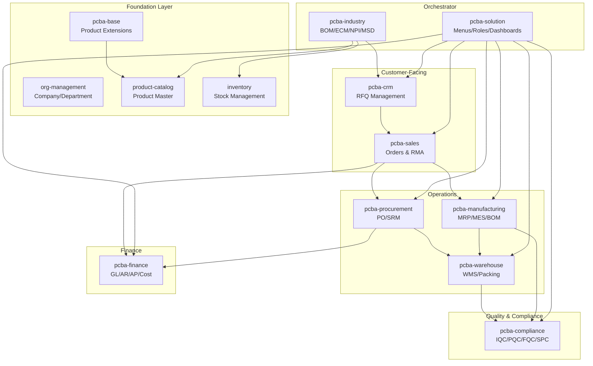
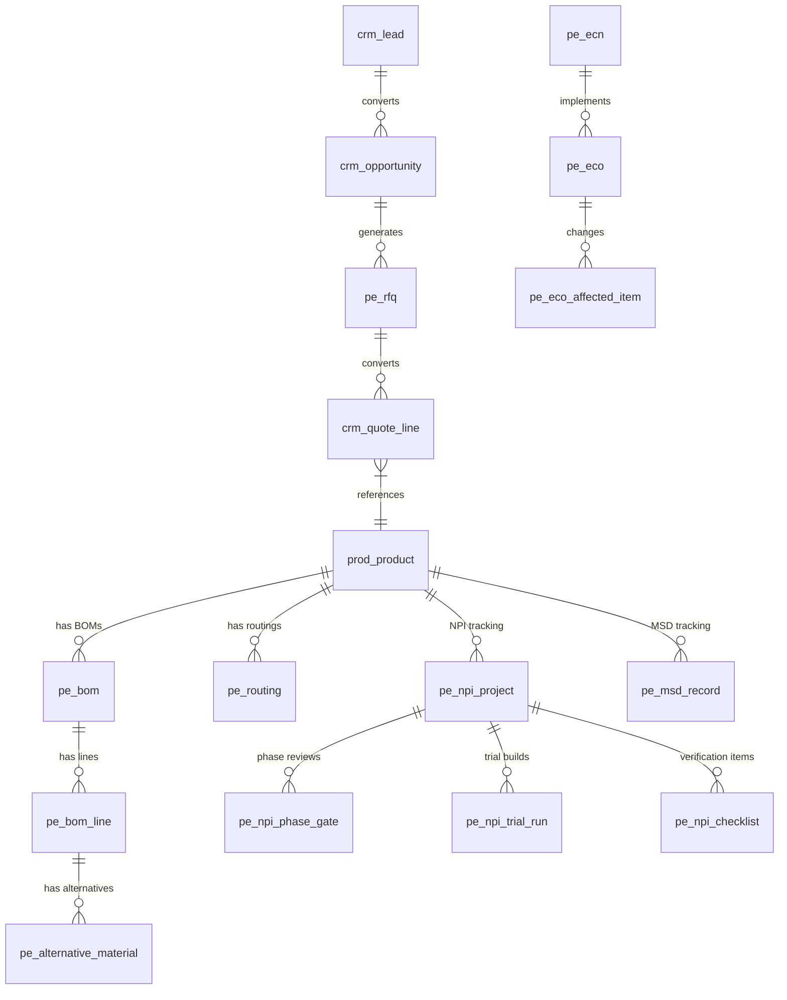

# PCBA Industry Solution

> Complete printed circuit board assembly management: from customer inquiry to finished goods shipment. A cross-plugin industry solution demonstrating how AuraBoot plugins compose into a full ERP system.

## Business Overview

### The PCBA Industry Challenge

PCBA (Printed Circuit Board Assembly) manufacturing is one of the most complex discrete manufacturing industries. A single product can have hundreds of components, each with strict moisture sensitivity, traceability, and compliance requirements. The supply chain involves global component sourcing, and customers demand rapid turnaround with zero-defect quality.

**Common pain points:**

- **Fragmented systems** -- CRM, quoting, procurement, production, and shipping live in separate tools
- **BOM complexity** -- multi-level BOMs with alternative materials, frequent engineering changes
- **Traceability** -- IPC/JEDEC compliance requires lot-level tracing from incoming material to shipped product
- **Quality gates** -- IQC, PQC, FQC inspections at every stage, with SPC monitoring
- **Moisture management** -- IPC/JEDEC J-STD-033 mandates tracking of MSD (Moisture Sensitive Devices)
- **NPI lifecycle** -- new products go through EVT/DVT/PVT trial runs before mass production

### End-to-End Value Chain

```
Customer Inquiry → RFQ → Quotation → Sales Order → BOM/Engineering
→ MRP/Procurement → Incoming QC → Production → In-Process QC
→ Final QC → Packing → Shipping → Invoicing
```

### Who It's For

- **Electronics Contract Manufacturers (EMS/CM)** running PCBA assembly lines
- **OEMs** with in-house PCBA production
- **Component Distributors** managing BOMs and procurement
- **Quality Engineers** enforcing IPC standards
- **Production Planners** running MRP and scheduling

---

## Solution Architecture

### How 10 Plugins Compose Together



---

## Plugin Inventory

| Plugin | Namespace | Version | Type | Purpose |
|--------|-----------|---------|------|---------|
| **pcba-base** | `pcba` | 1.0.0 | config | PCBA-specific field extensions on product catalog (lot policy, MOQ, lead time, MSL level, trace level) |
| **pcba-crm** | `pe_crm` | 2.0.0 | config | RFQ management with Gerber/BOM requirements, industry-specific opportunity fields |
| **pcba-sales** | `pe_sl` | 1.0.0 | config+backend | CRM-to-sales conversion, order fulfillment, RMA (Return Material Authorization) |
| **pcba-procurement** | `pe_po` | 1.0.0 | config+backend | Purchase orders, goods receipt, supplier management, 3-way match |
| **pcba-manufacturing** | `pe_mfg` | 1.0.0 | config+backend | MRP, production planning, APS/MES, outsourcing, equipment, BOM management |
| **pcba-compliance** | `pe_qc` | 1.0.0 | config+backend | IQC/PQC/FQC inspections, SPC, NCR/CAPA, rework, IPC compliance |
| **pcba-finance** | `pe_fin` | 1.0.0 | config+backend | General ledger, journals, financial periods, cost management, BI/KPI |
| **pcba-warehouse** | `pe_wh` | 1.0.0 | config+backend | WMS, stock operations, picking/wave, lot tracing, packing |
| **pcba-industry** | `pcba` | 1.0.0 | config | BOM, routing, ECN/ECO, NPI projects, MSD tracking, alternative materials |
| **pcba-solution** | `pcba_sol` | 1.1.0 | solution+backend | Orchestrator: cross-module menus, roles, dashboards, approval handlers |

### Plugin Types

- **config** -- pure DSL configuration (models, fields, commands, pages)
- **config+backend** -- DSL configuration + Java backend plugin (PF4J JAR)
- **solution** -- orchestrator that aggregates sub-plugins with cross-cutting concerns

---

## End-to-End Workflow

### 1. Customer Inquiry & RFQ

**Plugin: pcba-crm**

A customer sends an inquiry with Gerber files and a BOM. The sales team creates an RFQ (Request for Quotation):

```json
{
  "code": "pe_rfq",
  "displayName:en": "RFQ",
  "description": "Request for Quotation with PCBA-specific requirements: Gerber, BOM, quality class, traceability",
  "modelType": "entity",
  "modelCategory": "document",
  "extension": {
    "icon": "FileQuestion",
    "titleField": "pe_rfq_product_model",
    "subtitleField": "pe_rfq_code"
  }
}
```

RFQ state machine: `draft → submitted → clarification → finalized → converted | cancelled`

Key RFQ commands:
- `pe_crm:create_rfq` -- create from scratch or convert from CRM opportunity
- `pe_crm:convert_opp_to_rfq` -- auto-populate from CRM opportunity data
- `pe_crm:convert_rfq_to_quotation` -- generate sales quotation from finalized RFQ
- `pe_crm:clarify_rfq` -- send back for technical clarification
- `pe_crm:finalize_rfq` -- lock engineering requirements

The CRM extension also adds industry-specific fields to standard CRM models (accounts, opportunities, quote lines) through the binding system.

### 2. Engineering & BOM

**Plugin: pcba-industry**

Once the RFQ is finalized, engineers create the Bill of Materials:

```json
{
  "code": "pe_bom",
  "displayName:en": "BOM",
  "description": "Bill of Materials header with product reference and version",
  "modelCategory": "master",
  "extension": {
    "icon": "Layers",
    "titleField": "pe_bom_name",
    "subtitleField": "pe_bom_code"
  }
}
```

**BOM Lines** detail each component:

```json
{
  "code": "pe_bom_line",
  "displayName:en": "BOM Line",
  "description": "BOM material line items (child of pe_bom)",
  "extension": {
    "parentModel": "pe_bom",
    "parentField": "pe_bom_line_bom_id"
  }
}
```

**Alternative Materials** handle supply chain flexibility:

```json
{
  "code": "pe_alternative_material",
  "displayName:en": "Alternative Material",
  "description": "BOM line alternative/substitute materials for PCBA manufacturing"
}
```

**Engineering Change Management** (ECN/ECO):

```json
{
  "code": "pe_ecn",
  "displayName:en": "Engineering Change Notice",
  "description": "ECN with approval workflow"
},
{
  "code": "pe_eco",
  "displayName:en": "Engineering Change Order",
  "description": "ECO with BOM change implementation"
},
{
  "code": "pe_eco_affected_item",
  "displayName:en": "ECO Affected Item",
  "description": "ECO affected BOM items: add, remove, replace, modify"
}
```

**Process Routing** defines manufacturing steps:

```json
{
  "code": "pe_routing",
  "displayName:en": "Routing",
  "description": "Process routing definition for products"
}
```

### 3. NPI (New Product Introduction)

**Plugin: pcba-industry**

New products follow a phased introduction process:

```json
{
  "code": "pe_npi_project",
  "displayName:en": "NPI Project",
  "description": "Tracks product from design through mass production"
},
{
  "code": "pe_npi_phase_gate",
  "displayName:en": "Phase Gate Review",
  "description": "Approval checkpoints between NPI phases"
},
{
  "code": "pe_npi_trial_run",
  "displayName:en": "Trial Production Run",
  "description": "EVT/DVT/PVT build tracking with yield and defect data"
},
{
  "code": "pe_npi_checklist",
  "displayName:en": "NPI Checklist",
  "description": "Design, component, process, quality, compliance verification"
}
```

NPI phases: `concept → design → prototype (EVT) → validation (DVT) → pilot (PVT) → mass_production`

### 4. Procurement

**Plugin: pcba-procurement**

Once the BOM is finalized, MRP generates purchase requisitions:

- Purchase order creation from MRP demand
- Goods receipt with lot tracking
- Supplier relationship management (SRM)
- Three-way match (PO vs. receipt vs. invoice)

**Dependencies:** procurement, inventory, finance

### 5. Incoming Quality (IQC)

**Plugin: pcba-compliance**

Every incoming material batch is inspected:

- IQC inspection with AQL sampling plans
- SPC (Statistical Process Control) monitoring
- NCR (Non-Conformance Report) for rejected materials
- CAPA (Corrective and Preventive Action) tracking

### 6. Warehouse & MSD Management

**Plugin: pcba-warehouse + pcba-industry**

Materials are stored with full traceability:

```json
{
  "code": "pe_msd_record",
  "displayName:en": "MSD Record",
  "description": "Moisture Sensitive Device tracking: seal/open/bake lifecycle per IPC/JEDEC J-STD-033"
}
```

Warehouse operations: receiving, put-away, picking, wave planning, packing, shipping.

### 7. Manufacturing

**Plugin: pcba-manufacturing**

Production execution:

- MRP run: demand calculation from sales orders
- Production order creation
- Work order scheduling (APS)
- Shop floor execution (MES)
- Outsource management for specialized processes (e.g., selective soldering)
- Equipment maintenance tracking

### 8. In-Process & Final Quality

**Plugin: pcba-compliance**

- PQC (Process Quality Control) at each routing step
- FQC (Final Quality Control) before packing
- SPC charts for critical parameters
- Rework management for defective units
- IPC compliance documentation

### 9. Shipping & Invoicing

**Plugins: pcba-warehouse + pcba-sales + pcba-finance**

- Pick, pack, ship with lot-traced labels
- Delivery note generation
- Invoice creation (AR)
- Credit memo handling for RMAs
- Financial period closing

---

## Data Model Overview

### Cross-Plugin Entity Map



---

## Key Integration Points

### How Plugins Reference Each Other's Models

| Source Plugin | Target Plugin | Integration |
|--------------|---------------|-------------|
| pcba-crm | crm | Adds PCBA fields to `crm_account`, `crm_opportunity`, `crm_quote_line` via bindings |
| pcba-crm | product-catalog | RFQ references `prod_product` for product model |
| pcba-base | product-catalog | Adds fields (lot_policy, MOQ, lead_time, MSL_level, trace_level) to `prod_product` |
| pcba-industry | product-catalog | BOM, routing, NPI all reference `prod_product` |
| pcba-industry | inventory | MSD records track inventory lots |
| pcba-sales | crm, sales, inventory | Order fulfillment bridges CRM opportunities to sales orders |
| pcba-procurement | procurement, inventory, finance | PO-to-receipt-to-payment flow |
| pcba-manufacturing | product-catalog, inventory | Production consumes BOM materials from inventory |
| pcba-compliance | quality, inventory, product-catalog | Quality inspections reference products and inventory lots |
| pcba-finance | finance, sales, procurement | Financial postings from sales and procurement transactions |
| pcba-warehouse | product-catalog, inventory | WMS operations on product lots |
| pcba-solution | (all above) | Cross-module menus, roles, dashboards |

### The Binding System

The `pcba-base` plugin demonstrates a useful pattern -- adding industry-specific fields to generic models without modifying the original plugin:

```
pcba-base/config/fields/
  pe_prd_lead_time_days.json   -- adds "Lead Time (Days)" to prod_product
  pe_prd_lot_policy.json       -- adds "Lot Policy" to prod_product
  pe_prd_moq.json              -- adds "MOQ" to prod_product
  pe_prod_msl_level.json       -- adds "MSL Level" to prod_product
  pe_prod_trace_level.json     -- adds "Trace Level" to prod_product

pcba-base/config/bindings/
  prod_product.json            -- binds all five fields to prod_product model
```

This means the generic `product-catalog` plugin remains clean, while `pcba-base` layers on PCBA-specific attributes.

---

## Roles & Permissions

The solution plugin defines **8 specialized roles**:

```json
[
  {
    "code": "pe_admin",
    "name": "ERP Administrator",
    "description": "Full access to all PCBA ERP modules"
  },
  {
    "code": "pe_warehouse",
    "name": "Warehouse Keeper",
    "description": "Warehouse inbound/outbound and inventory"
  },
  {
    "code": "pe_sales",
    "name": "Sales Representative",
    "description": "Sales orders, CRM pipeline, products, inventory (read)"
  },
  {
    "code": "pe_purchaser",
    "name": "Purchaser",
    "description": "Purchase orders, products, inventory (read)"
  },
  {
    "code": "pe_production",
    "name": "Production Manager",
    "description": "Production plans, BOM, outsourcing"
  },
  {
    "code": "pe_crm",
    "name": "CRM Specialist",
    "description": "Leads, opportunities, RFQs, quotations"
  },
  {
    "code": "pe_quality_engineer",
    "name": "Quality Engineer",
    "description": "IQC/PQC/FQC, SPC, NCR/CAPA, rework, MSD"
  },
  {
    "code": "pe_finance",
    "name": "Finance Specialist",
    "description": "Credit memos, three-way match, AR/AP"
  }
]
```

### Menu Structure

```
PCBA ERP (icon: Cpu)
  ├── Dashboards
  │   ├── Sales Dashboard
  │   └── Production Dashboard
  └── BI Center (Reports)
```

Additional menus are provided by each sub-plugin (CRM, Sales, Procurement, etc.) and nested under the PCBA ERP root.

---

## Getting Started

### Installation Order Matters

The plugins must be installed in dependency order. The `pcba-solution` orchestrator depends on all other plugins being present.

```bash
# 1. Foundation plugins (if not already installed)
aura plugin publish plugins/org-management --yes
aura plugin publish plugins/product-catalog --yes
aura plugin publish plugins/inventory --yes
aura plugin publish plugins/finance --yes
aura plugin publish plugins/quality --yes
aura plugin publish plugins/procurement --yes
aura plugin publish plugins/sales --yes
aura plugin publish plugins/crm --yes

# 2. PCBA base extensions
aura plugin publish plugins/pcba-base --yes

# 3. PCBA domain plugins (order matters for backend dependencies)
aura plugin publish plugins/pcba-industry --yes
aura plugin publish plugins/pcba-crm --yes
aura plugin publish plugins/pcba-sales --yes
aura plugin publish plugins/pcba-procurement --yes
aura plugin publish plugins/pcba-manufacturing --yes
aura plugin publish plugins/pcba-compliance --yes
aura plugin publish plugins/pcba-finance --yes
aura plugin publish plugins/pcba-warehouse --yes

# 4. Solution orchestrator (must be last)
aura plugin publish plugins/pcba-solution --yes
```

### Quick Verification

```bash
# Check all models are published
aura dsl show pe_rfq
aura dsl show pe_bom
aura dsl show pe_ecn
aura dsl show pe_npi_project
aura dsl show pe_msd_record

# Verify menus
# Navigate to PCBA ERP in the sidebar
```

---

## Extension Points

### Adding Custom Product Attributes

Follow the `pcba-base` pattern: create new field JSON files, then create a binding JSON that attaches them to the target model. No code changes needed.

### Custom Quality Inspection Templates

The pcba-compliance plugin supports configurable inspection plans. Add new inspection types by extending the quality dictionaries.

### Custom Dashboard Widgets

The solution's dashboard pages use named queries for data. Add new KPI cards or charts by:
1. Creating a named query in `config/named-queries.json`
2. Adding a `stat-card` or `chart` block to the dashboard page definition

### Industry-Specific Compliance

For regulations beyond IPC (e.g., automotive IATF 16949, aerospace AS9100), create a new compliance plugin that follows the same binding pattern as `pcba-compliance`.

### ERP Integration

The backend plugins expose REST APIs that can integrate with external systems:
- EDI (Electronic Data Interchange) for customer PO import
- Supplier portals for PO acknowledgment
- Shipping carrier APIs for tracking numbers

---

## FAQ

**Q: Do I need to install all 10 plugins?**
A: No. The solution is modular. For example, a company that only does contract manufacturing (no direct sales) could skip `pcba-crm` and `pcba-sales`. However, `pcba-solution` expects all plugins to be present for the unified menu and role system.

**Q: Can I use this for non-PCBA electronics manufacturing?**
A: Yes. The models are general enough for most discrete electronics manufacturing (cable assemblies, box builds, etc.). The PCBA-specific features (MSD tracking, IPC compliance) can be ignored if not needed.

**Q: How does the BOM alternative material system work?**
A: Each BOM line can have multiple `pe_alternative_material` records. During MRP, if the primary component is unavailable, the system can suggest alternatives. The priority and approval status of alternatives are configurable.

**Q: What is the MSD tracking for?**
A: IPC/JEDEC J-STD-033 requires tracking moisture-sensitive components. The `pe_msd_record` model tracks the seal/open/bake lifecycle: when a bag is opened, the floor life countdown starts. If exceeded, the component must be baked before use.

**Q: How does ECN/ECO flow work?**
A: An ECN (Engineering Change Notice) documents the need for change and goes through approval. Once approved, an ECO (Engineering Change Order) is created with specific affected items (add/remove/replace/modify BOM lines). The ECO implements the actual changes.

**Q: Can I run MRP across multiple warehouses?**
A: Yes. The pcba-manufacturing plugin integrates with the inventory system which supports multiple warehouse locations. MRP considers available stock across all locations when calculating demand.

**Q: What databases are supported?**
A: AuraBoot runs on PostgreSQL. All PCBA plugins use the platform's dynamic table system, so no additional database setup is required beyond the standard AuraBoot installation.
