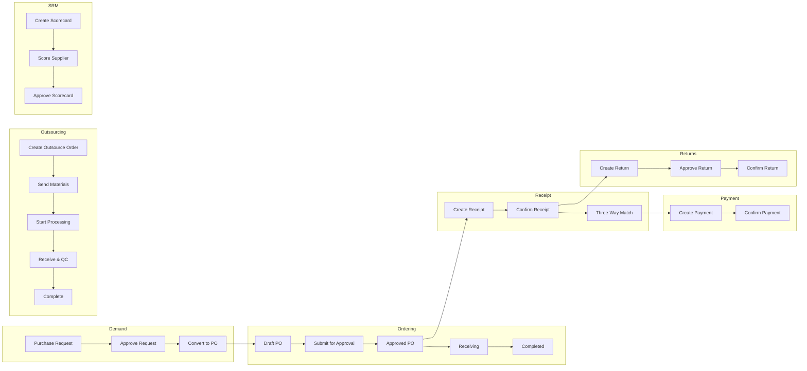
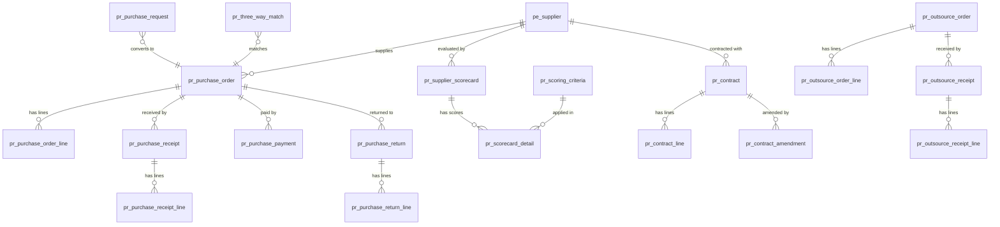
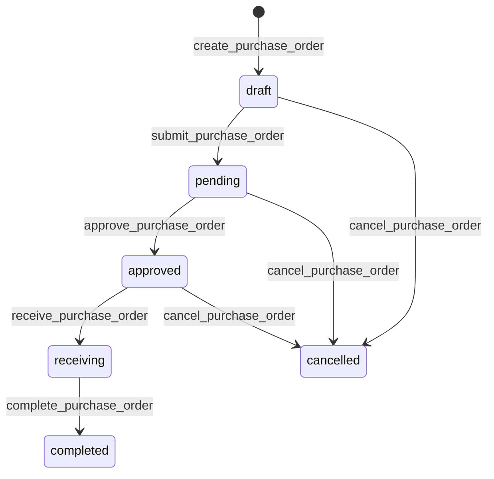
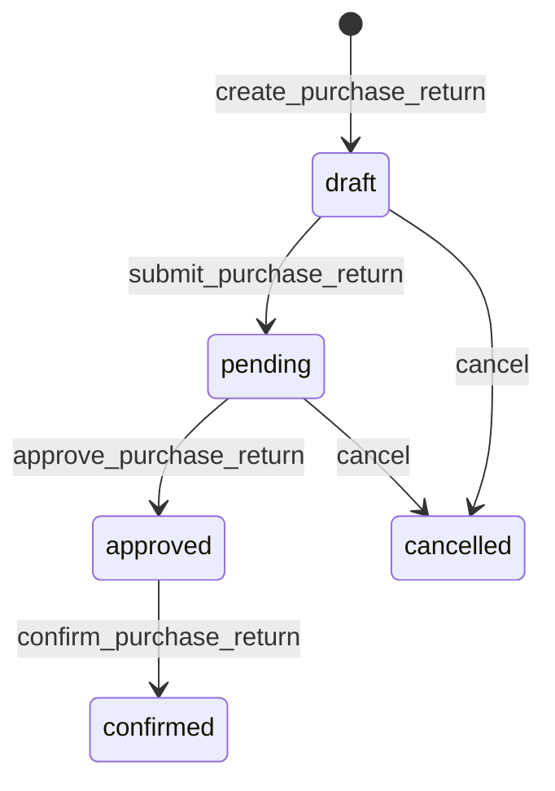
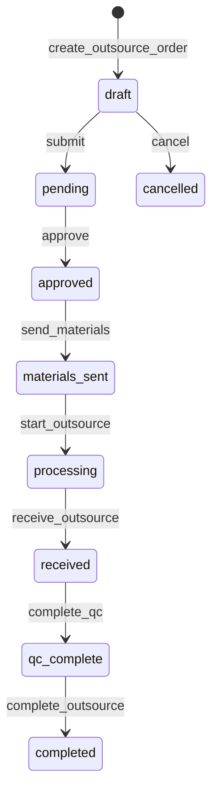
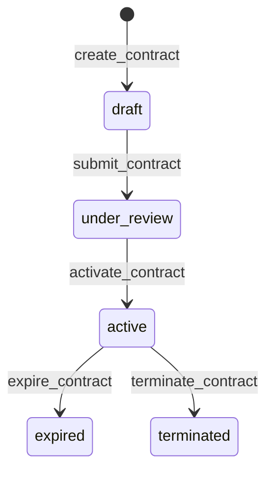

# Procurement Management

> Purchase orders, supplier management, receipts, returns, outsourcing, three-way matching, supplier scorecards, contract lifecycle, and spend analysis -- all driven by DSL configuration.

## Business Overview

### Problem Statement

Manufacturing companies often need procurement workflows that go beyond basic purchase orders: supplier relationship management, outsource order tracking, three-way matching (PO vs. receipt vs. invoice), supplier performance scoring, contract lifecycle management, and spend analytics. AuraBoot's Procurement plugin models these areas through DSL configuration and state machine-driven workflows, with code hooks available where project-specific behavior is needed.

### Target Users

| Role | Responsibilities |
|------|-----------------|
| **Purchaser** | Create POs, manage supplier orders, track deliveries |
| **Procurement Manager** | Approve orders, manage contracts, review spend |
| **Production Manager** | Manage outsource orders, track contract manufacturing |
| **Warehouse Operator** | Process purchase receipts, verify delivered goods |
| **Finance Specialist** | Handle payments, three-way matching, AP reconciliation |
| **ERP Administrator** | Full access to all procurement modules |

### Key Capabilities

1. **Purchase Request Management** -- Demand aggregation from production, inventory, or manual requests
2. **Purchase Order Lifecycle** -- Full state machine: Draft -> Pending -> Approved -> Receiving -> Completed
3. **Request-to-PO Conversion** -- Convert approved purchase requests directly to purchase orders
4. **Purchase Receipt Tracking** -- Goods receipt with warehouse assignment and line-level verification
5. **Purchase Returns** -- Return defective goods with approval workflow and fault tracking
6. **Purchase Payments** -- Payment tracking with multiple methods (bank transfer, check, credit card, cash)
7. **Outsource Order Management** -- Contract manufacturing: material send-out, processing, receipt with QC
8. **Outsource Receipt with QC** -- Quality inspection workflow for outsourced goods
9. **Supplier Master Data** -- Comprehensive supplier profiles with category, payment terms, rating
10. **Three-Way Matching** -- Automated PO vs. receipt vs. invoice matching with variance flagging
11. **Supplier Scorecards** -- Multi-dimension supplier performance evaluation with weighted scoring
12. **Scoring Criteria Management** -- Configurable evaluation criteria with categories and weights
13. **Procurement Contracts** -- Full contract lifecycle: draft -> review -> active -> amend -> expire/terminate
14. **Contract Amendments** -- Formal change tracking with approval history
15. **Spend Categories** -- Hierarchical spend classification for procurement analytics
16. **Spend Analysis Dashboard** -- Visual spend breakdowns, trends, and supplier concentration
17. **Procurement Dashboard** -- Real-time KPIs: total spend, active orders, receipt rate, overdue alerts
18. **Multi-Currency Support** -- Automatic exchange rate conversion on all financial documents
19. **Auto-Generated Codes** -- Pattern-based codes: PO-{yyyyMMdd}-{seq}, PR-{yyyyMMdd}-{seq}

### End-to-End Workflow



## Data Model

### Entity Relationship Diagram



### Models Overview

| Model Code | Display Name | Category | Description |
|------------|-------------|----------|-------------|
| `pe_supplier` | Supplier | master | Supplier master data with category, status, payment terms |
| `pr_purchase_request` | Purchase Request | document | Demand aggregation from production/inventory |
| `pr_purchase_order` | Purchase Order | document | Core procurement document with full lifecycle |
| `pr_purchase_order_line` | PO Line | entity | Order line items (child of PO) |
| `pr_purchase_receipt` | Purchase Receipt | document | Goods receipt linked to PO |
| `pr_purchase_receipt_line` | Receipt Line | entity | Receipt line items (child) |
| `pr_purchase_payment` | Purchase Payment | transaction | Payment record linked to PO |
| `pr_purchase_return` | Purchase Return | document | Return order with approval workflow |
| `pr_purchase_return_line` | Return Line | entity | Return line items (child) |
| `pr_outsource_order` | Outsource Order | document | Contract manufacturing order |
| `pr_outsource_order_line` | Outsource Line | entity | Materials sent for outsourcing (child) |
| `pr_outsource_receipt` | Outsource Receipt | document | Receipt of outsourced goods with QC |
| `pr_outsource_receipt_line` | Outsource Receipt Line | entity | QC results per item (child) |
| `pr_three_way_match` | Three-Way Match | reference | PO vs. receipt vs. invoice matching |
| `pr_supplier_scorecard` | Supplier Scorecard | document | Periodic supplier performance evaluation |
| `pr_scorecard_detail` | Scorecard Detail | entity | Individual criteria scores (child) |
| `pr_scoring_criteria` | Scoring Criteria | master | Configurable evaluation criteria |
| `pr_contract` | Procurement Contract | document | Supplier contract with lifecycle management |
| `pr_contract_line` | Contract Line | entity | Contract line items (child) |
| `pr_contract_amendment` | Contract Amendment | entity | Amendment history tracking (child) |
| `pr_spend_category` | Spend Category | master | Hierarchical spend classification |

### Purchase Order Model (Complete JSON)

```json
{
  "code": "pr_purchase_order",
  "displayName:en": "Purchase Order",
  "description": "Purchase order with supplier info, status workflow, and line items",
  "modelType": "entity",
  "modelCategory": "document",
  "extension": {
    "icon": "Truck",
    "category": "procurement",
    "titleField": "pr_po_code",
    "subtitleField": "pr_po_supplier"
  }
}
```

### Supplier Model

```json
{
  "code": "pe_supplier",
  "displayName:en": "Supplier",
  "description": "Supplier master data for purchase orders",
  "modelType": "entity",
  "modelCategory": "master",
  "extension": {
    "icon": "Building2",
    "category": "pcba-erp",
    "titleField": "pe_supplier_name",
    "subtitleField": "pe_supplier_code"
  }
}
```

### Procurement Contract Model

```json
{
  "code": "pr_contract",
  "displayName:en": "Procurement Contract",
  "description": "Procurement contract with supplier, lifecycle management, and renewal tracking",
  "modelType": "entity",
  "modelCategory": "document",
  "extension": {
    "icon": "FileText",
    "category": "procurement",
    "titleField": "pr_ct_code",
    "subtitleField": "pr_ct_supplier_id"
  }
}
```

### Three-Way Match Model

```json
{
  "code": "pr_three_way_match",
  "displayName:en": "Three-Way Match",
  "description": "Three-way match result linking PO line, receipt line, and supplier invoice line for discrepancy tracking",
  "modelType": "entity",
  "modelCategory": "reference",
  "extension": {
    "icon": "GitMerge",
    "category": "procurement",
    "titleField": "pr_twm_po_id",
    "subtitleField": "pr_twm_match_status"
  }
}
```

## Fields Deep Dive

### Purchase Order Fields

| Field Code | Purpose | Type |
|-----------|---------|------|
| `pr_po_code` | Auto-generated PO number (PO-{yyyyMMdd}-{seq}) | TEXT |
| `pr_po_supplier` | Supplier reference | REFERENCE |
| `pr_po_date` | Order date | DATE |
| `pr_po_arrival_date` | Expected arrival date | DATE |
| `pr_po_status` | Order status (pe_order_status dict) | ENUM |
| `pr_po_payment_status` | Payment status (pe_payment_status dict) | ENUM |
| `pr_po_total_qty` | Total quantity (auto-summed) | DECIMAL |
| `pr_po_total_amount` | Total amount in transaction currency | DECIMAL |
| `pr_po_total_amount_base` | Total amount in base currency | DECIMAL |
| `pr_po_currency_code` | Transaction currency | ENUM |
| `pr_po_base_currency_code` | Base/reporting currency | ENUM |
| `pr_po_exchange_rate` | Exchange rate at order time | DECIMAL |
| `pr_po_remark` | Notes | TEXTAREA |

### Purchase Order Line Fields

| Field Code | Purpose | Type |
|-----------|---------|------|
| `pr_pol_order_id` | Parent PO reference | REFERENCE |
| `pr_pol_product_id` | Product/material reference | REFERENCE |
| `pr_pol_qty` | Ordered quantity | DECIMAL |
| `pr_pol_price` | Unit price | DECIMAL |
| `pr_pol_amount` | Line amount (qty x price) | DECIMAL |
| `pr_pol_received_qty` | Received quantity tracker | DECIMAL |

### Outsource Order Fields

| Field Code | Purpose | Type |
|-----------|---------|------|
| `pr_oso_code` | Outsource order number | TEXT |
| `pr_oso_supplier_id` | Outsource supplier reference | REFERENCE |
| `pr_oso_status` | Order lifecycle status | ENUM |
| `pr_oso_type` | Outsource type (SMT, assembly, testing, rework) | ENUM |
| `pr_oso_total_amount` | Total processing cost | DECIMAL |

### Contract Fields

| Field Code | Purpose | Type |
|-----------|---------|------|
| `pr_ct_code` | Contract number | TEXT |
| `pr_ct_supplier_id` | Contracted supplier | REFERENCE |
| `pr_ct_status` | Contract status | ENUM |
| `pr_ct_start_date` | Contract start date | DATE |
| `pr_ct_end_date` | Contract end date | DATE |
| `pr_ct_total_value` | Total contract value | DECIMAL |
| `pr_ct_renewal_type` | Renewal terms | ENUM |

### Supplier Scorecard Fields

| Field Code | Purpose | Type |
|-----------|---------|------|
| `pr_sc_code` | Scorecard number | TEXT |
| `pr_sc_supplier_id` | Evaluated supplier | REFERENCE |
| `pr_sc_period` | Evaluation period | TEXT |
| `pr_sc_total_score` | Calculated total score | DECIMAL |
| `pr_sc_rating` | Overall rating grade | ENUM |
| `pr_sc_status` | Scorecard status (draft/submitted/approved) | ENUM |

### Status Enumerations

**Order Status (`pe_order_status`)**:

| Value | Label | Color |
|-------|-------|-------|
| `draft` | Draft | gray |
| `pending` | Pending Approval | blue |
| `approved` | Approved | green |
| `delivering` | Delivering | orange |
| `receiving` | Receiving | orange |
| `completed` | Completed | green |
| `cancelled` | Cancelled | red |

**Confirm Status (`pe_confirm_status`)** -- used for receipts, payments, returns:

| Value | Label | Color |
|-------|-------|-------|
| `draft` | Draft | gray |
| `confirmed` | Confirmed | green |
| `cancelled` | Cancelled | red |

**Return Status (`pe_return_status`)**:

| Value | Label | Color |
|-------|-------|-------|
| `draft` | Draft | gray |
| `pending` | Pending Approval | blue |
| `approved` | Approved | green |
| `confirmed` | Confirmed (goods returned) | green |
| `cancelled` | Cancelled | red |

**Supplier Category (`pe_supplier_category`)**:

| Value | Label |
|-------|-------|
| `raw_material` | Raw Material |
| `component` | Component |
| `service` | Service |
| `outsourcing` | Outsourcing |

**Payment Terms**:

`cod` (Cash on Delivery), `net15`, `net30`, `net60`, `net90`

**Payment Methods (`pe_payment_method`)**:

`bank_transfer`, `cash`, `check`, `credit_card`, `other`

## Commands & Business Logic

The Procurement plugin defines **84 commands** across all models. Here are the key commands:

### Purchase Request Commands

| Command | Type | Description |
|---------|------|-------------|
| `pr:create_purchase_request` | create | Create purchase request |
| `pr:update_purchase_request` | update | Edit request |
| `pr:process_purchase_request` | state_transition | Process/approve request |
| `pr:complete_purchase_request` | state_transition | Mark request fulfilled |
| `pr:cancel_purchase_request` | state_transition | Cancel request |
| `pr:convert_request_to_po` | action | Convert approved request to PO |

### Purchase Order Commands

| Command | Type | Description |
|---------|------|-------------|
| `pr:create_purchase_order` | create | Create PO, auto-code PO-{yyyyMMdd}-{seq}, status=draft |
| `pr:update_purchase_order` | update | Edit draft PO |
| `pr:submit_purchase_order` | state_transition | Draft -> Pending |
| `pr:approve_purchase_order` | state_transition | Pending -> Approved |
| `pr:receive_purchase_order` | state_transition | Approved -> Receiving |
| `pr:complete_purchase_order` | state_transition | Receiving -> Completed |
| `pr:cancel_purchase_order` | state_transition | Draft/Pending/Approved -> Cancelled |
| `pr:delete_purchase_order` | delete | Delete draft PO only |
| `pr:add_po_line` | create | Add PO line item |
| `pr:delete_po_line` | delete | Remove PO line item |

### Receipt Commands

| Command | Type | Description |
|---------|------|-------------|
| `pr:create_purchase_receipt` | create | Create receipt linked to PO |
| `pr:update_purchase_receipt` | update | Edit draft receipt |
| `pr:confirm_purchase_receipt` | state_transition | Draft -> Confirmed |
| `pr:cancel_purchase_receipt` | state_transition | Draft -> Cancelled |
| `pr:add_rcpt_line` | create | Add receipt line |
| `pr:delete_rcpt_line` | delete | Remove receipt line |

### Return Commands

| Command | Type | Description |
|---------|------|-------------|
| `pr:create_purchase_return` | create | Create purchase return |
| `pr:submit_purchase_return` | state_transition | Draft -> Pending |
| `pr:approve_purchase_return` | state_transition | Pending -> Approved |
| `pr:confirm_purchase_return` | state_transition | Approved -> Confirmed |
| `pr:cancel_purchase_return` | state_transition | -> Cancelled |

### Payment Commands

| Command | Type | Description |
|---------|------|-------------|
| `pr:create_purchase_payment` | create | Create payment record |
| `pr:confirm_purchase_payment` | state_transition | Draft -> Confirmed |
| `pr:cancel_purchase_payment` | state_transition | Draft -> Cancelled |

### Outsource Commands

| Command | Type | Description |
|---------|------|-------------|
| `pr:create_outsource_order` | create | Create outsource order |
| `pr:submit_outsource_order` | state_transition | Submit for approval |
| `pr:approve_outsource_order` | state_transition | Approve outsource order |
| `pr:send_materials` | state_transition | Send materials to supplier |
| `pr:start_outsource` | state_transition | Start processing |
| `pr:receive_outsource` | state_transition | Receive finished goods |
| `pr:complete_outsource_qc` | state_transition | Complete QC inspection |
| `pr:complete_outsource` | state_transition | Complete outsource order |
| `pr:cancel_outsource_order` | state_transition | Cancel outsource order |

### Three-Way Match Commands

| Command | Type | Description |
|---------|------|-------------|
| `pr:create_three_way_match` | create | Create match record |
| `pr:match_three_way` | action | Execute matching logic |
| `pr:flag_variance` | state_transition | Flag discrepancy |
| `pr:resolve_three_way_match` | state_transition | Resolve flagged variance |

### Supplier Scorecard Commands

| Command | Type | Description |
|---------|------|-------------|
| `pr:create_scorecard` | create | Create new scorecard |
| `pr:update_scorecard` | update | Edit scorecard |
| `pr:submit_scorecard` | state_transition | Submit for approval |
| `pr:approve_scorecard` | state_transition | Approve scorecard |
| `pr:add_scorecard_detail` | create | Add criteria score |

### Contract Commands

| Command | Type | Description |
|---------|------|-------------|
| `pr:create_contract` | create | Create procurement contract |
| `pr:update_contract` | update | Edit draft contract |
| `pr:submit_contract` | state_transition | Submit for review |
| `pr:activate_contract` | state_transition | Under Review -> Active |
| `pr:expire_contract` | state_transition | Active -> Expired |
| `pr:terminate_contract` | state_transition | Active -> Terminated |
| `pr:add_amendment` | create | Add contract amendment |
| `pr:add_contract_line` | create | Add contract line item |

### State Machines

#### Purchase Order State Machine



#### Purchase Return State Machine



#### Outsource Order State Machine



#### Contract State Machine



### Create Purchase Order Command (Complete JSON)

```json
{
  "code": "pr:create_purchase_order",
  "displayName:en": "Create Purchase Order",
  "description": "Create a purchase order with auto-generated code and draft status",
  "type": "create",
  "modelCode": "pr_purchase_order",
  "inputFields": [
    "pr_po_supplier",
    "pr_po_date",
    "pr_po_arrival_date"
  ],
  "autoSetFields": {
    "pr_po_code": {
      "strategy": "auto_generate",
      "pattern": "PO-{yyyyMMdd}-{seq}"
    },
    "pr_po_status": {
      "strategy": "fixed_value",
      "value": "draft"
    }
  },
  "permissions": ["PR.purchase.manage"],
  "cmd_risk_level": "L1"
}
```

### Approve Purchase Order Command (Complete JSON)

```json
{
  "code": "pr:approve_purchase_order",
  "displayName:en": "Approve Order",
  "description": "Approve purchase order: pending -> approved",
  "type": "state_transition",
  "modelCode": "pr_purchase_order",
  "stateField": "pr_po_status",
  "fromStates": ["pending"],
  "toState": "approved",
  "permissions": ["PR.purchase.manage"],
  "extension": {
    "confirmMessage:en": "Approve this order?"
  },
  "cmd_risk_level": "L1"
}
```

### Activate Contract Command (Complete JSON)

```json
{
  "code": "pr:activate_contract",
  "displayName:en": "Activate Contract",
  "description": "Activate an approved contract: UNDER_REVIEW -> active",
  "type": "state_transition",
  "modelCode": "pr_contract",
  "stateField": "pr_ct_status",
  "fromStates": ["under_review"],
  "toState": "active",
  "permissions": ["PR.contract.manage"],
  "extension": {
    "confirmMessage:en": "Activate this contract?"
  },
  "cmd_risk_level": "L1"
}
```

## Pages & User Interface

The Procurement plugin ships with **38 page configurations**:

### Page Inventory

| Page Key | Kind | Model | Description |
|----------|------|-------|-------------|
| `proc_dashboard` | dashboard | pr_purchase_order | Procurement KPI dashboard |
| `pr_purchase_request_list` | list | pr_purchase_request | Purchase request list |
| `pr_purchase_request_form` | form | pr_purchase_request | Request form |
| `pr_purchase_request_detail` | detail | pr_purchase_request | Request detail |
| `pr_purchase_order_list` | list | pr_purchase_order | PO list with status tabs |
| `pr_purchase_order_form` | form | pr_purchase_order | PO form with line items |
| `pr_purchase_order_detail` | detail | pr_purchase_order | PO detail with workflow |
| `pr_purchase_receipt_list` | list | pr_purchase_receipt | Receipt list |
| `pr_purchase_receipt_form` | form | pr_purchase_receipt | Receipt form |
| `pr_purchase_receipt_detail` | detail | pr_purchase_receipt | Receipt detail |
| `pr_purchase_payment_list` | list | pr_purchase_payment | Payment list |
| `pr_purchase_payment_form` | form | pr_purchase_payment | Payment form |
| `pr_purchase_payment_detail` | detail | pr_purchase_payment | Payment detail |
| `pr_purchase_return_list` | list | pr_purchase_return | Return list |
| `pr_purchase_return_form` | form | pr_purchase_return | Return form |
| `pr_purchase_return_detail` | detail | pr_purchase_return | Return detail |
| `pr_outsource_order_list` | list | pr_outsource_order | Outsource order list |
| `pr_outsource_order_form` | form | pr_outsource_order | Outsource form |
| `pr_outsource_order_detail` | detail | pr_outsource_order | Outsource detail |
| `pr_outsource_receipt_list` | list | pr_outsource_receipt | Outsource receipt list |
| `pr_outsource_receipt_form` | form | pr_outsource_receipt | Outsource receipt form |
| `pr_outsource_receipt_detail` | detail | pr_outsource_receipt | Outsource receipt detail |
| `pe_supplier_list` | list | pe_supplier | Supplier master list |
| `pe_supplier_form` | form | pe_supplier | Supplier form |
| `pr_three_way_match_list` | list | pr_three_way_match | Match list |
| `pr_three_way_match_form` | form | pr_three_way_match | Match form |
| `pr_three_way_match_detail` | detail | pr_three_way_match | Match detail |
| `pr_supplier_scorecard_list` | list | pr_supplier_scorecard | Scorecard list |
| `pr_supplier_scorecard_form` | form | pr_supplier_scorecard | Scorecard form |
| `pr_supplier_scorecard_detail` | detail | pr_supplier_scorecard | Scorecard detail |
| `pr_scoring_criteria_list` | list | pr_scoring_criteria | Criteria list |
| `pr_scoring_criteria_form` | form | pr_scoring_criteria | Criteria form |
| `pr_contract_list` | list | pr_contract | Contract list |
| `pr_contract_form` | form | pr_contract | Contract form |
| `pr_contract_detail` | detail | pr_contract | Contract detail |
| `pr_spend_analysis_dashboard` | dashboard | -- | Spend analytics dashboard |
| `pr_spend_category_list` | list | pr_spend_category | Category list |
| `pr_spend_category_form` | form | pr_spend_category | Category form |

### Purchase Order List Page (Complete JSON)

```json
{
  "pageKey": "pr_purchase_order_list",
  "name:en": "Purchase Management",
  "modelCode": "pr_purchase_order",
  "kind": "list",
  "schemaVersion": 2,
  "layout": { "type": "grid", "cols": 12 },
  "blocks": [
    {
      "id": "block_po_tabs",
      "blockType": "tabs",
      "layout": { "colSpan": 12, "rowSpan": 1 },
      "tabs": [
        { "key": "all", "label": { "en": "All" }, "filter": null },
        { "key": "draft", "label": { "en": "Draft" },
          "filter": { "field": "pr_po_status", "operator": "EQ", "value": "draft" } },
        { "key": "pending", "label": { "en": "Pending" },
          "filter": { "field": "pr_po_status", "operator": "EQ", "value": "pending" } },
        { "key": "approved", "label": { "en": "Approved" },
          "filter": { "field": "pr_po_status", "operator": "EQ", "value": "approved" } },
        { "key": "receiving", "label": { "en": "Receiving" },
          "filter": { "field": "pr_po_status", "operator": "EQ", "value": "receiving" } },
        { "key": "completed", "label": { "en": "Completed" },
          "filter": { "field": "pr_po_status", "operator": "EQ", "value": "completed" } }
      ]
    },
    {
      "id": "block_po_toolbar",
      "blockType": "form-buttons",
      "layout": { "colSpan": 12, "rowSpan": 1 },
      "buttons": [
        {
          "code": "create", "primary": true, "icon": "Plus",
          "permissionCode": "PR.purchase.manage",
          "action": { "type": "navigate", "to": "pr_purchase_order_form", "command": "pr:create_purchase_order" }
        }
      ]
    },
    {
      "id": "block_po_table",
      "blockType": "table",
      "layout": { "colSpan": 12, "rowSpan": 1 },
      "defaultSort": { "field": "created_at", "order": "desc" },
      "searchFields": ["pr_po_code", "pr_po_supplier", "pr_po_status"],
      "table": {
        "columns": [
          { "field": "pr_po_code", "width": 160, "fixed": "left" },
          { "field": "pr_po_supplier", "width": 180 },
          { "field": "pr_po_date", "width": 120 },
          { "field": "pr_po_arrival_date", "width": 120 },
          { "field": "pr_po_total_qty", "width": 100, "align": "right" },
          { "field": "pr_po_total_amount", "width": 130, "align": "right" },
          { "field": "pr_po_status", "width": 100, "renderType": "tag", "dictCode": "pe_order_status" },
          { "field": "pr_po_payment_status", "width": 110, "renderType": "tag", "dictCode": "pe_payment_status" },
          {
            "field": "actions", "isActionColumn": true,
            "buttons": [
              { "code": "detail", "icon": "Eye",
                "action": { "type": "navigate", "to": "pr_purchase_order_detail" } },
              { "code": "edit", "icon": "Edit",
                "visibleWhen": "row.pr_po_status === 'draft'",
                "action": { "type": "navigate", "to": "pr_purchase_order_form" } },
              { "code": "submit", "icon": "Send",
                "visibleWhen": "row.pr_po_status === 'draft'",
                "action": { "type": "command", "command": "pr:submit_purchase_order" } },
              { "code": "approve", "icon": "CheckCircle",
                "visibleWhen": "row.pr_po_status === 'pending'",
                "action": { "type": "command", "command": "pr:approve_purchase_order" } },
              { "code": "receive", "icon": "PackageCheck",
                "visibleWhen": "row.pr_po_status === 'approved'",
                "action": { "type": "command", "command": "pr:receive_purchase_order" } },
              { "code": "complete", "icon": "CheckSquare",
                "visibleWhen": "row.pr_po_status === 'receiving'",
                "action": { "type": "command", "command": "pr:complete_purchase_order" } },
              { "code": "cancel", "icon": "XCircle", "danger": true,
                "visibleWhen": "['draft','pending','approved'].includes(row.pr_po_status)",
                "action": { "type": "command", "command": "pr:cancel_purchase_order" } },
              { "code": "delete", "icon": "Trash2", "danger": true,
                "visibleWhen": "row.pr_po_status === 'draft'",
                "confirm": "delete.confirm",
                "action": { "type": "command", "command": "pr:delete_purchase_order" } }
            ]
          }
        ]
      }
    }
  ]
}
```

### Purchase Order Form Page (Complete JSON)

```json
{
  "pageKey": "pr_purchase_order_form",
  "name:en": "Purchase Order Form",
  "modelCode": "pr_purchase_order",
  "kind": "form",
  "schemaVersion": 2,
  "layout": { "type": "grid", "cols": 12, "gap": 12 },
  "blocks": [
    {
      "id": "block_po_basic",
      "blockType": "form-section",
      "title": { "en": "Basic Information" },
      "layout": { "colSpan": 12, "rowSpan": 1 },
      "columns": 2,
      "fields": [
        { "field": "pr_po_supplier", "layout": { "colSpan": 6 } },
        { "field": "pr_po_date", "layout": { "colSpan": 6 } },
        { "field": "pr_po_arrival_date", "layout": { "colSpan": 6 } },
        { "field": "pr_po_remark", "layout": { "colSpan": 12 } }
      ]
    },
    {
      "id": "block_po_lines",
      "blockType": "sub-table",
      "title": { "en": "PO Lines" },
      "layout": { "colSpan": 12, "rowSpan": 1 },
      "subTable": {
        "childModel": "pr_purchase_order_line",
        "parentField": "pr_pol_order_id",
        "readOnly": false,
        "commands": {
          "create": "pr:add_po_line",
          "delete": "pr:delete_po_line"
        },
        "columns": [
          { "field": "pr_pol_product_id", "width": 250 },
          { "field": "pr_pol_qty", "width": 120, "align": "right" },
          { "field": "pr_pol_price", "width": 120, "align": "right" },
          { "field": "pr_pol_amount", "width": 130, "align": "right" }
        ]
      }
    },
    {
      "id": "block_po_footer",
      "blockType": "form-buttons",
      "buttons": [
        { "code": "save", "primary": true, "action": { "type": "command", "command": "pr:create_purchase_order" } },
        { "code": "cancel", "action": { "type": "builtin", "name": "back" } }
      ]
    }
  ]
}
```

### Procurement Dashboard (Complete JSON)

```json
{
  "pageKey": "proc_dashboard",
  "name:en": "Procurement Dashboard",
  "modelCode": "pr_purchase_order",
  "kind": "dashboard",
  "schemaVersion": 2,
  "layout": { "type": "grid", "cols": 12, "gap": 16 },
  "blocks": [
    {
      "id": "block_kpi_cards",
      "blockType": "stat-card",
      "dataSource": {
        "type": "api",
        "url": "/api/datasource/list",
        "params": { "datasourceId": "nq:proc_dashboard_kpi", "format": "records", "maxItems": "1" }
      },
      "cards": [
        { "field": "total_spend", "label": { "en": "Total Spend" }, "icon": "IconCurrencyDollar", "color": "#10b981", "format": "currency" },
        { "field": "pending_requests", "label": { "en": "Pending Requests" }, "icon": "IconClipboardList", "color": "#f59e0b" },
        { "field": "active_orders", "label": { "en": "Active Orders" }, "icon": "IconTruck", "color": "#3b82f6" },
        { "field": "receipt_rate", "label": { "en": "Receipt Rate(%)" }, "icon": "IconPackageCheck", "color": "#8b5cf6", "format": "percentage" },
        { "field": "return_rate", "label": { "en": "Return Rate(%)" }, "icon": "IconRotateCw", "color": "#ef4444", "format": "percentage" },
        { "field": "supplier_count", "label": { "en": "Active Suppliers" }, "icon": "IconBuilding", "color": "#06b6d4" }
      ]
    },
    {
      "id": "chart_spend_trend",
      "blockType": "chart", "chartType": "line",
      "layout": { "colSpan": 6 },
      "title": { "en": "Monthly Spend Trend" },
      "chartConfig": { "smooth": true, "areaStyle": true,
        "dataSource": { "type": "namedQuery", "queryCode": "proc_spend_monthly_trend" } }
    },
    {
      "id": "chart_order_status",
      "blockType": "chart", "chartType": "pie",
      "layout": { "colSpan": 6 },
      "title": { "en": "Order Status Distribution" },
      "chartConfig": { "dataSource": { "type": "namedQuery", "queryCode": "proc_order_status_stats" } }
    },
    {
      "id": "chart_top_suppliers",
      "blockType": "chart", "chartType": "bar",
      "layout": { "colSpan": 6 },
      "title": { "en": "Top 10 Suppliers by Amount" },
      "chartConfig": { "orientation": "horizontal",
        "dataSource": { "type": "namedQuery", "queryCode": "proc_top_suppliers" } }
    },
    {
      "id": "chart_lead_time",
      "blockType": "chart", "chartType": "line",
      "layout": { "colSpan": 6 },
      "title": { "en": "Lead Time Trend (Days)" },
      "chartConfig": { "smooth": true,
        "dataSource": { "type": "namedQuery", "queryCode": "proc_lead_time_analysis" } }
    },
    {
      "id": "block_overdue_deliveries",
      "blockType": "table",
      "layout": { "colSpan": 6 },
      "title": { "en": "Overdue Deliveries" },
      "dataSource": { "type": "api",
        "params": { "datasourceId": "nq:proc_overdue_deliveries", "maxItems": "20" } },
      "table": {
        "columns": [
          { "field": "pr_po_code", "width": 140 },
          { "field": "pr_po_supplier", "width": 140, "renderType": "reference" },
          { "field": "pr_po_arrival_date", "width": 110 },
          { "field": "overdue_days", "width": 80, "align": "right" },
          { "field": "pr_po_status", "width": 100, "renderType": "tag", "dictCode": "pe_order_status" }
        ]
      }
    },
    {
      "id": "block_pending_requests",
      "blockType": "table",
      "layout": { "colSpan": 6 },
      "title": { "en": "Pending Purchase Requests" },
      "dataSource": { "type": "api",
        "params": { "datasourceId": "nq:proc_pending_requests", "maxItems": "20" } }
    },
    {
      "id": "block_recent_orders",
      "blockType": "table",
      "modelCode": "pr_purchase_order",
      "layout": { "colSpan": 6 },
      "title": { "en": "Recent Purchase Orders" },
      "defaultSort": { "field": "created_at", "order": "desc" }
    },
    {
      "id": "block_top_materials",
      "blockType": "table",
      "layout": { "colSpan": 6 },
      "title": { "en": "Top 10 Materials by Qty" },
      "dataSource": { "type": "api",
        "params": { "datasourceId": "nq:proc_top_materials", "maxItems": "10" } }
    }
  ]
}
```

### Named Queries for Dashboard

The dashboard is powered by SQL-based named queries:

```json
{
  "code": "proc_dashboard_kpi",
  "title:en": "Procurement Dashboard KPI",
  "description": "Overall procurement KPIs: total spend, pending PRs, active POs, receipt rate, return rate, supplier count",
  "fromSql": "SELECT ... AS total_spend, ... AS pending_requests, ... AS active_orders, ... AS receipt_rate, ... AS return_rate, ... AS supplier_count"
}
```

```json
{
  "code": "proc_spend_monthly_trend",
  "title:en": "Monthly Spend Trend",
  "fromSql": "SELECT TO_CHAR(pr_po_date, 'YYYY-MM') AS month, COALESCE(SUM(pr_po_total_amount_base), 0) AS total_amount, COUNT(*) AS order_count FROM mt_pr_purchase_order WHERE ... GROUP BY ... ORDER BY month ASC"
}
```

Additional named queries: `proc_order_status_stats`, `proc_top_suppliers`, `proc_lead_time_analysis`, `proc_overdue_deliveries`, `proc_pending_requests`, `proc_top_materials`.

## Permissions & Roles

### Permission Matrix

| Code | Name | Type | Scope |
|------|------|------|-------|
| `pe.company.read` | Supplier View | data | View supplier master data |
| `pe.company.manage` | Supplier Management | operation | Create, edit, delete suppliers |
| `pr.purchase.manage` | Purchase Management | operation | Full PO lifecycle management |
| `pr.purchase.read` | Purchase View | data | View POs, receipts, payments |
| `pr.outsource.manage` | Outsource Management | operation | Manage outsource orders and receipts |
| `pr.outsource.read` | Outsource View | data | View outsource records |
| `pr.three_way_match.manage` | Three-Way Match Management | operation | Create, match, flag, resolve |
| `pr.three_way_match.read` | Three-Way Match View | data | View match records |
| `pr.scorecard.manage` | Scorecard Management | operation | Create, score, approve scorecards |
| `pr.scorecard.read` | Scorecard View | data | View scorecards and criteria |
| `pr.contract.manage` | Contract Management | operation | Full contract lifecycle |
| `pr.contract.read` | Contract View | data | View contracts |
| `pr.spend.manage` | Spend Category Management | operation | Manage spend classifications |
| `pr.spend.read` | Spend Analysis View | data | View spend dashboards |

### Pre-configured Roles

| Role Code | Name | Permissions |
|-----------|------|-------------|
| `pr_admin` | ERP Administrator | All procurement permissions |
| `pr_purchaser` | Purchaser | Purchase manage/read, scorecard manage/read, contract read, spend read |
| `pr_production` | Production Manager | Outsource manage/read |
| `pr_finance` | Finance Specialist | Purchase read only |

## Internationalization

Complete bilingual (English / Chinese) support through AuraBoot's i18n system:

- All 21 models have `displayName:zh-CN` and `displayName:en`
- All menu items have `name:zh-CN` and `name:en`
- All dictionary values have `label:zh-CN` and `label:en`
- All page titles and block headers use `LocalizedText` objects
- Field labels auto-derived through three-layer i18n resolution

## Workflows

### Procure-to-Pay Workflow

1. **Demand**: Purchase request created (from production planning, inventory reorder, or manual)
2. **Sourcing**: Request processed/approved, optionally converted to PO
3. **Ordering**: PO created with supplier, line items, expected dates
4. **Approval**: PO submitted for review and approved by procurement manager
5. **Receipt**: Goods received at warehouse, receipt confirmed
6. **Matching**: Three-way match executed (PO line vs. receipt vs. supplier invoice)
7. **Payment**: Payment record created and confirmed
8. **Completion**: PO marked as completed when fully received and paid

### Outsource Manufacturing Workflow

1. **Order Creation**: Outsource order created specifying supplier, type (SMT/assembly/testing/rework), and materials
2. **Approval**: Order submitted and approved
3. **Material Send-Out**: Raw materials shipped to outsource supplier
4. **Processing**: Supplier processes materials (status tracked)
5. **Receipt with QC**: Finished goods received back, quality inspection performed
6. **QC Completion**: QC results recorded per line item (pass/fail/conditional)
7. **Order Completion**: Outsource order finalized

### Supplier Evaluation Workflow

1. **Criteria Setup**: Define evaluation criteria with categories (quality, delivery, price, service) and weights
2. **Scorecard Creation**: Create periodic scorecard for a supplier
3. **Scoring**: Evaluators score each criterion (0-100 scale)
4. **Score Calculation**: Weighted total calculated automatically
5. **Approval**: Scorecard submitted for management approval
6. **Rating**: Supplier rating updated based on approved scorecard

### Contract Lifecycle

1. **Drafting**: Create contract with supplier, terms, line items, dates
2. **Review**: Submit for internal review
3. **Activation**: Activate approved contract (becomes binding)
4. **Amendments**: Track changes via amendment records (price updates, term extensions)
5. **Expiration/Termination**: Contract expires naturally or is terminated early

## Automation Rules

- **Auto-Code Generation**: PO codes (PO-{yyyyMMdd}-{seq}), receipt codes, return codes auto-generated on creation
- **Status Initialization**: All new documents default to `draft` status
- **Multi-Currency Conversion**: Currency conversion binding rules on PO creation (same pattern as Sales)
- **Total Aggregation**: PO totals auto-calculated from line items
- **Three-Way Matching**: Automated comparison of PO quantities/amounts vs. receipt quantities vs. invoice amounts, with automatic variance flagging

## Getting Started

### Prerequisites

The Procurement plugin depends on:

- `com.auraboot.product-catalog` -- Product/material master data
- `com.auraboot.crm` -- Supplier base data structures
- `com.auraboot.inventory` -- Warehouse and stock management
- `com.auraboot.finance` -- Exchange rates and financial foundation

### Installation

```bash
# Install the Procurement plugin
aura plugin publish plugins/procurement --yes

# Verify installation
aura status
```

### Explore the Module

1. Navigate to **Procurement** in the sidebar menu
2. Open the **Dashboard** for KPI overview (total spend, active orders, overdue alerts)
3. Go to **Procurement > Suppliers** to set up supplier master data
4. Go to **Procurement > Purchase Orders** to create your first PO
5. Check **Supplier Relations > Supplier Scorecards** for performance tracking
6. Visit **Contracts > Procurement Contracts** for contract management
7. Open **Spend Analysis > Spend Dashboard** for spend analytics

### Create Sample Data

```bash
# Create a supplier
aura exec pe:create_supplier \
  --set pe_supplier_name="ACME Components" \
  --set pe_supplier_code="SUP-001" \
  --set pe_supplier_category="component"

# Create a purchase order
aura exec pr:create_purchase_order \
  --set pr_po_supplier="<supplier_pid>" \
  --set pr_po_date="2026-04-11" \
  --set pr_po_arrival_date="2026-04-25"

# Submit and approve
aura exec pr:submit_purchase_order --target <po_pid>
aura exec pr:approve_purchase_order --target <po_pid>

# Create a receipt
aura exec pr:create_purchase_receipt \
  --set pr_rcpt_po_id="<po_pid>" \
  --set pr_rcpt_date="2026-04-20"
```

### Related Plugins

For extended procurement capabilities, consider these complementary plugins:

| Plugin | Purpose |
|--------|---------|
| `indirect-procurement` | Indirect spend: catalog purchasing, expense reports, purchase requests with approval |
| `source-to-pay` | Strategic sourcing: sourcing events, bidding, spend analytics, supplier contracts |

## Extension Points

1. **Custom Approval Rules**: Add binding rules for multi-level approval based on PO amount thresholds
2. **Supplier Portal Integration**: Extend with webhook bindings for supplier self-service
3. **Quality Integration**: Link outsource QC results to the quality management plugin
4. **Budget Control**: Add budget checking handlers on PO approval commands
5. **Named Queries**: Create custom spend analytics by adding named queries
6. **Saved Views**: Configure kanban boards, calendar views for delivery tracking
7. **Three-Way Match Extensions**: Customize variance tolerance thresholds via binding rules

## FAQ

**Q: How does three-way matching work?**
A: The `pr:match_three_way` command compares PO line quantities/prices against receipt line quantities and supplier invoice amounts. Discrepancies are flagged via `pr:flag_variance` and resolved through `pr:resolve_three_way_match`.

**Q: Can I track outsource manufacturing separately?**
A: Yes. The plugin has dedicated outsource order and outsource receipt models with their own state machines, including material send-out tracking, processing status, and QC inspection.

**Q: How do supplier scorecards work?**
A: Define scoring criteria with categories and weights, then create periodic scorecards. Each criterion is scored 0-100 and the weighted total is calculated. Scorecards go through a submission/approval workflow.

**Q: Can I manage procurement contracts?**
A: Yes. The contract module supports full lifecycle management (draft -> review -> active -> expire/terminate) with line items for pricing commitments and amendment tracking for changes.

**Q: How do I set up spend analysis?**
A: First define spend categories (hierarchical classification), then the spend analysis dashboard automatically aggregates data from purchase orders grouped by category, supplier, and time period.

**Q: What's the difference between this and indirect-procurement?**
A: The `procurement` plugin handles direct procurement (materials for production). The `indirect-procurement` plugin handles indirect spend (office supplies, services, travel) with catalog-based purchasing and expense reports.

**Q: How are purchase requests converted to POs?**
A: Use the `pr:convert_request_to_po` command on an approved purchase request. The system creates a new PO pre-populated with the request's product, quantity, and preferred supplier.
