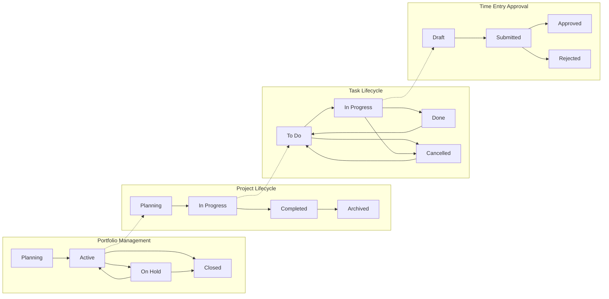
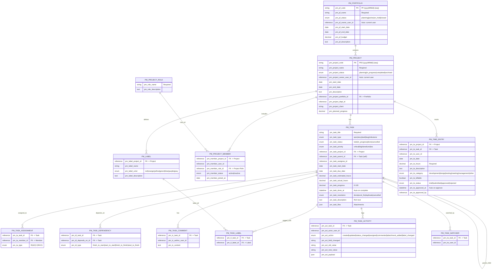
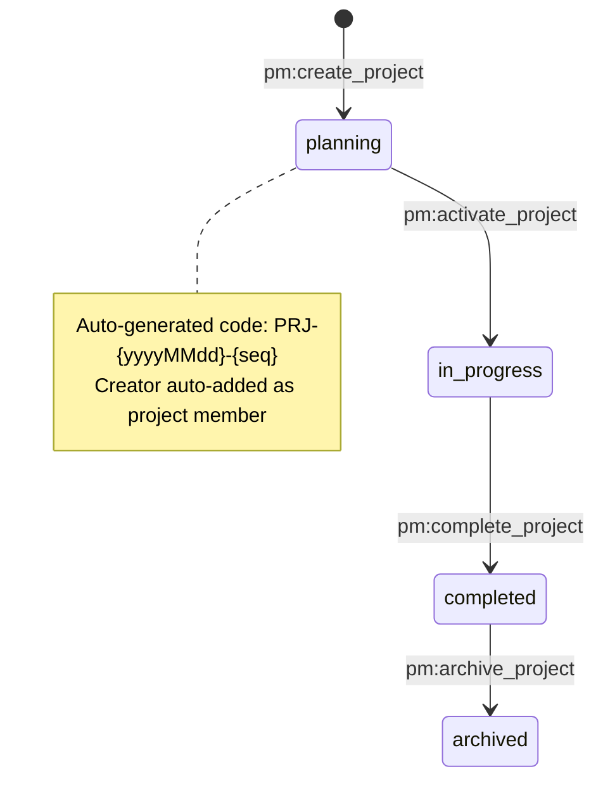
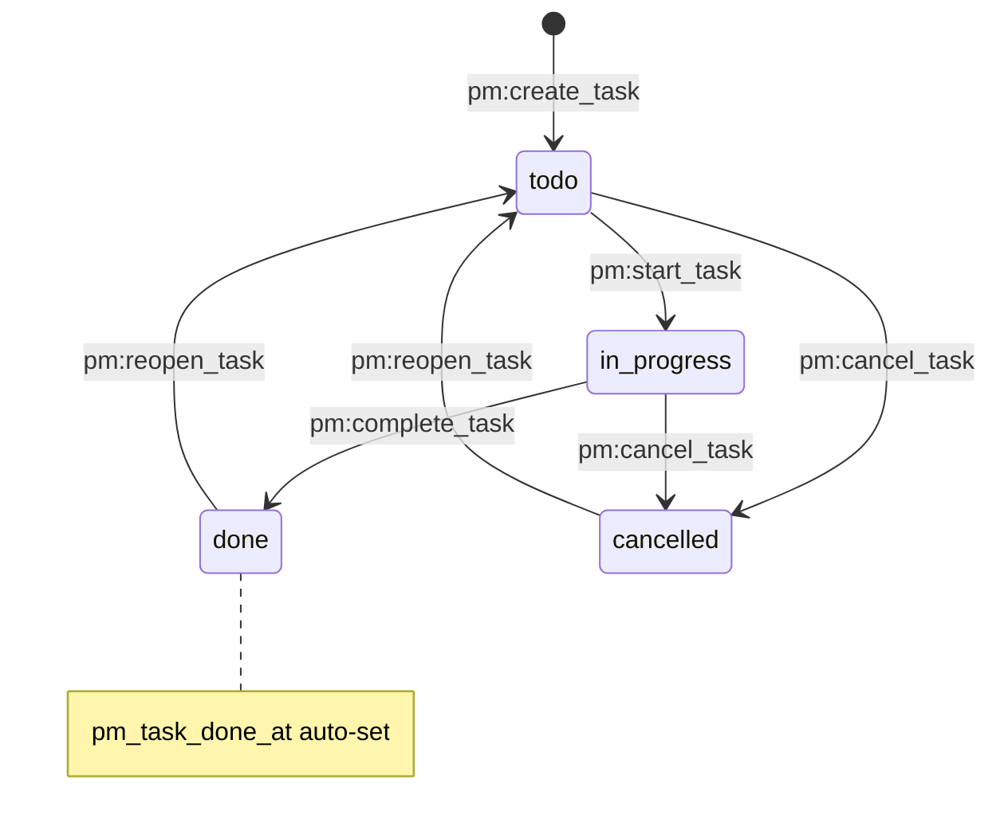
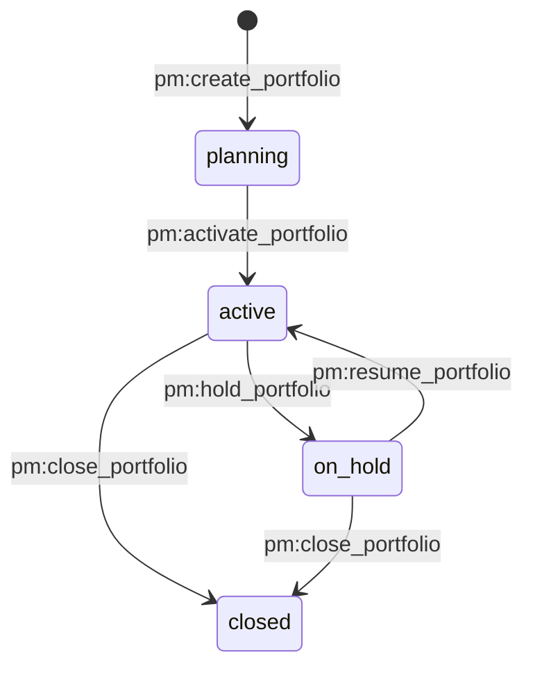
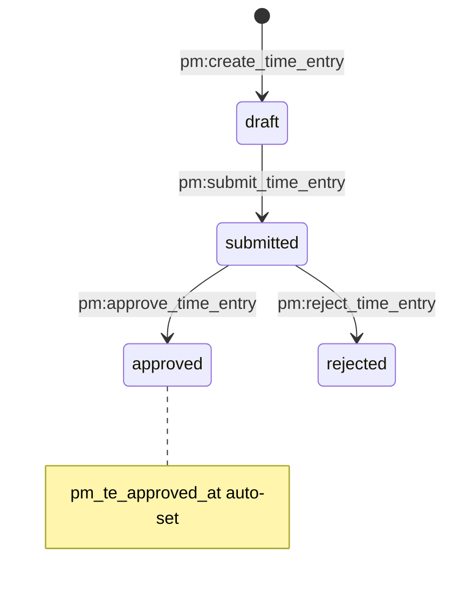
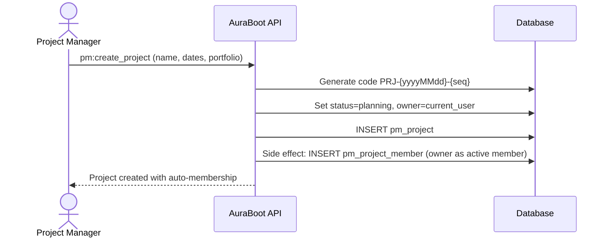
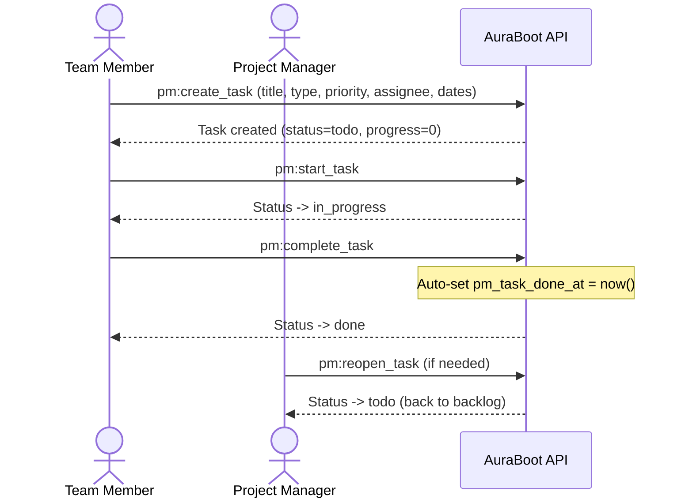
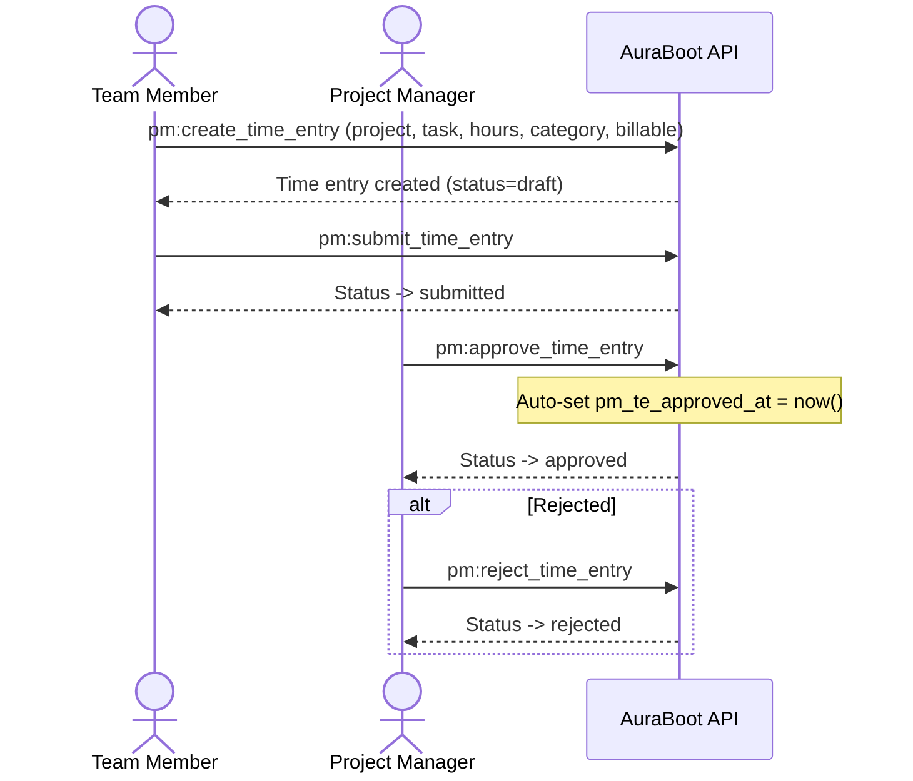

# Project Management

> End-to-end project management: portfolios, projects, tasks, team members, time tracking, labels, dependencies, activity feeds, and executive dashboards -- all built through JSON DSL configuration.

## Business Overview

### Problem

Project teams rely on disconnected tools -- spreadsheets for task tracking, email for status updates, separate systems for time sheets and resource planning. Information is scattered across channels, making it impossible to get a single view of project health. Managers cannot see overdue tasks in real time, resource utilization is guesswork, and time-entry approval is a manual chore.

### Target Users

- **Project Managers** -- plan projects, assign resources, track progress, approve timesheets
- **Team Members** -- manage daily tasks, log time entries, collaborate with comments
- **Portfolio Managers** -- oversee multiple projects, monitor budgets, assess cross-project health
- **Executives** -- view KPI dashboards, identify bottlenecks, make data-driven resourcing decisions
- **PMO (Project Management Office)** -- standardize project roles, enforce governance, audit time entries

### Key Capabilities

- Portfolio management with lifecycle control: Planning -> Active -> On Hold -> Closed
- Project creation with auto-generated codes (`PRJ-{yyyyMMdd}-{seq}`) and auto-assigned owner membership
- Full project lifecycle: Planning -> In Progress -> Completed -> Archived
- Five task types: Epic, Story, Task, Bug, Milestone
- Task lifecycle with 4 statuses: To Do -> In Progress -> Done / Cancelled (with Reopen)
- Four-level task priority: Critical, High, Medium, Low
- Hierarchical tasks (parent-child) with sub-task ordering
- RACI-based task assignment: Responsible, Accountable, Consulted, Informed
- Task dependencies with 4 relationship types: FS, SS, FF, SF
- Color-coded labels for custom task categorization
- Task watchers for notification subscriptions
- Rich-text task descriptions with file attachments
- Task activity feed: created, updated, status_changed, assigned, commented, attachment_added, label_changed
- Time entry tracking with 6 categories: Development, Design, Testing, Meeting, Management, Other
- Billable vs. non-billable time classification
- Time entry approval workflow: Draft -> Submitted -> Approved / Rejected
- Executive dashboard with 6 KPI cards, trend charts, status distributions, and resource utilization
- Project health overview table with completion rate and overdue counts
- Overdue task monitoring with days-overdue calculation
- Named queries for My Tasks, My Watching, My Participating, Monthly Trends
- Three predefined roles: Project Manager, Project Member, Project Viewer
- 13 granular permissions covering portfolios, projects, tasks, members, master data, and timesheets
- Full bilingual support (English / Chinese)

### Workflow Diagram



---

## Data Model

### ER Diagram



### Models Reference

| Model Code | Display Name | Category | Icon | Parent Model | Title Field |
|---|---|---|---|---|---|
| `pm_portfolio` | Portfolio | entity | Briefcase | -- | `pm_pf_name` |
| `pm_project` | Project | entity | FolderKanban | -- | `pm_project_name` |
| `pm_project_role` | Project Role | master | Shield | -- | `pm_role_name` |
| `pm_project_member` | Project Member | reference | UserPlus | `pm_project` | `pm_member_user_id` |
| `pm_task` | Task | entity | CheckSquare | `pm_project` | `pm_task_title` |
| `pm_task_assignment` | Task Assignment | reference | UserCheck | `pm_task` | `pm_ta_member_id` |
| `pm_task_dependency` | Task Dependency | reference | Link | `pm_task` | `pm_td_depends_on_id` |
| `pm_task_comment` | Task Comment | entity | MessageSquare | `pm_task` | `pm_tc_content` |
| `pm_label` | Label | master | Tag | `pm_project` | `pm_label_name` |
| `pm_task_label` | Task Label | reference | Tags | `pm_task` | `pm_tl_label_id` |
| `pm_task_activity` | Task Activity | transaction | Activity | `pm_task` | `pm_act_action` |
| `pm_task_watcher` | Task Watcher | reference | Eye | `pm_task` | `pm_tw_user_id` |
| `pm_time_entry` | Time Entry | transaction | Clock | `pm_project` | `pm_te_date` |

### Complete models.json

```json
[
  {
    "code": "pm_portfolio",
    "displayName:zh-CN": "项目集",
    "displayName:en": "Portfolio",
    "modelType": "entity",
    "modelCategory": "entity",
    "extension": {
      "icon": "Briefcase",
      "category": "project-management",
      "titleField": "pm_pf_name"
    }
  },
  {
    "code": "pm_project",
    "displayName:zh-CN": "项目",
    "displayName:en": "Project",
    "modelType": "entity",
    "modelCategory": "entity",
    "extension": {
      "icon": "FolderKanban",
      "category": "project-management",
      "titleField": "pm_project_name"
    }
  },
  {
    "code": "pm_project_role",
    "displayName:zh-CN": "项目角色",
    "displayName:en": "Project Role",
    "modelType": "entity",
    "modelCategory": "master",
    "extension": {
      "icon": "Shield",
      "category": "project-management",
      "titleField": "pm_role_name"
    }
  },
  {
    "code": "pm_project_member",
    "displayName:zh-CN": "项目成员",
    "displayName:en": "Project Member",
    "modelType": "entity",
    "modelCategory": "reference",
    "extension": {
      "icon": "UserPlus",
      "category": "project-management",
      "titleField": "pm_member_user_id",
      "parentModel": "pm_project",
      "parentField": "pm_member_project_id"
    }
  },
  {
    "code": "pm_task",
    "displayName:zh-CN": "任务",
    "displayName:en": "Task",
    "modelType": "entity",
    "modelCategory": "entity",
    "extension": {
      "icon": "CheckSquare",
      "category": "project-management",
      "titleField": "pm_task_title",
      "parentModel": "pm_project",
      "parentField": "pm_task_project_id"
    }
  },
  {
    "code": "pm_task_assignment",
    "displayName:zh-CN": "任务分配",
    "displayName:en": "Task Assignment",
    "modelType": "entity",
    "modelCategory": "reference",
    "extension": {
      "icon": "UserCheck",
      "category": "project-management",
      "titleField": "pm_ta_member_id",
      "parentModel": "pm_task",
      "parentField": "pm_ta_task_id"
    }
  },
  {
    "code": "pm_task_dependency",
    "displayName:zh-CN": "任务依赖",
    "displayName:en": "Task Dependency",
    "modelType": "entity",
    "modelCategory": "reference",
    "extension": {
      "icon": "Link",
      "category": "project-management",
      "titleField": "pm_td_depends_on_id",
      "parentModel": "pm_task",
      "parentField": "pm_td_task_id"
    }
  },
  {
    "code": "pm_task_comment",
    "displayName:zh-CN": "任务评论",
    "displayName:en": "Task Comment",
    "modelType": "entity",
    "modelCategory": "entity",
    "extension": {
      "icon": "MessageSquare",
      "category": "project-management",
      "titleField": "pm_tc_content",
      "parentModel": "pm_task",
      "parentField": "pm_tc_task_id"
    }
  },
  {
    "code": "pm_label",
    "displayName:zh-CN": "标签",
    "displayName:en": "Label",
    "modelType": "entity",
    "modelCategory": "master",
    "extension": {
      "icon": "Tag",
      "category": "project-management",
      "titleField": "pm_label_name",
      "parentModel": "pm_project",
      "parentField": "pm_label_project_id"
    }
  },
  {
    "code": "pm_task_label",
    "displayName:zh-CN": "任务标签",
    "displayName:en": "Task Label",
    "modelType": "entity",
    "modelCategory": "reference",
    "extension": {
      "icon": "Tags",
      "category": "project-management",
      "titleField": "pm_tl_label_id",
      "parentModel": "pm_task",
      "parentField": "pm_tl_task_id"
    }
  },
  {
    "code": "pm_task_activity",
    "displayName:zh-CN": "任务动态",
    "displayName:en": "Task Activity",
    "modelType": "entity",
    "modelCategory": "transaction",
    "extension": {
      "icon": "Activity",
      "category": "project-management",
      "titleField": "pm_act_action",
      "parentModel": "pm_task",
      "parentField": "pm_act_task_id"
    }
  },
  {
    "code": "pm_task_watcher",
    "displayName:zh-CN": "任务关注者",
    "displayName:en": "Task Watcher",
    "modelType": "entity",
    "modelCategory": "reference",
    "extension": {
      "icon": "Eye",
      "category": "project-management",
      "titleField": "pm_tw_user_id",
      "parentModel": "pm_task",
      "parentField": "pm_tw_task_id"
    }
  },
  {
    "code": "pm_time_entry",
    "displayName:zh-CN": "工时记录",
    "displayName:en": "Time Entry",
    "modelType": "entity",
    "modelCategory": "transaction",
    "extension": {
      "icon": "Clock",
      "category": "project-management",
      "titleField": "pm_te_date",
      "subtitleField": "pm_te_hours",
      "parentModel": "pm_project",
      "parentField": "pm_te_project_id"
    }
  }
]
```

---

## Fields Deep Dive

### Project Fields (`pm_project`)

| Field Code | Display Name | Data Type | Required | Searchable | Notes |
|---|---|---|---|---|---|
| `pm_project_code` | Project Code | string(50) | No | Yes | Auto-generated: `PRJ-{yyyyMMdd}-{seq}` |
| `pm_project_name` | Project Name | string(200) | Yes | Yes | Sortable |
| `pm_project_status` | Project Status | enum | Yes | Yes | Dict: `pm_project_status` |
| `pm_project_owner_user_id` | Project Owner | reference | No | No | Auto-set to current user on create |
| `pm_start_date` | Planned Start | date | No | No | Sortable |
| `pm_end_date` | Planned End | date | No | No | Sortable |
| `pm_description` | Description | text | No | No | -- |
| `pm_project_dept_id` | Department | reference | No | Yes | -- |
| `pm_project_client` | Client | string | No | Yes | Sortable |
| `pm_planned_progress` | Planned Progress | decimal | No | No | Sortable |
| `pm_project_portfolio_id` | Portfolio | reference | No | Yes | FK -> `pm_portfolio.pm_pf_name` |

### Task Fields (`pm_task`)

| Field Code | Display Name | Data Type | Required | Notes |
|---|---|---|---|---|
| `pm_task_project_id` | Project | reference | Yes | FK -> `pm_project.pm_project_name` |
| `pm_task_parent_id` | Parent Task | reference | No | Self-reference for sub-tasks |
| `pm_task_type` | Task Type | enum | Yes | Dict: `pm_task_type`, default: `task` |
| `pm_task_title` | Task Title | string(500) | Yes | Searchable, sortable |
| `pm_task_description` | Description | text(5000) | No | Rich text (`renderComponent: richtext`) |
| `pm_task_status` | Task Status | enum | Yes | Dict: `pm_task_status`, default: `todo` |
| `pm_task_priority` | Priority | enum | No | Dict: `pm_task_priority` |
| `pm_task_assignee_id` | Assignee | reference | No | -- |
| `pm_task_start_date` | Start Date | date | No | Sortable |
| `pm_task_due_date` | Due Date | date | No | Sortable |
| `pm_task_estimated_hours` | Estimated Hours | decimal | No | -- |
| `pm_task_actual_hours` | Actual Hours | decimal | No | -- |
| `pm_task_progress` | Progress | decimal(5,2) | No | Range: 0-100, default: 0 |
| `pm_task_sort_key` | Sort Order | integer | No | Hidden, for drag ordering |
| `pm_task_done_at` | Completed At | datetime | No | Auto-set on complete, read-only |
| `pm_task_resolution` | Resolution | enum | No | Dict: `pm_resolution` |
| `pm_task_parent_sort_key` | Sub-task Sort | integer | No | Hidden |
| `pm_task_files` | Attachments | json | No | File upload |

### Time Entry Fields (`pm_time_entry`)

| Field Code | Display Name | Data Type | Required | Notes |
|---|---|---|---|---|
| `pm_te_project_id` | Project | reference | No | FK -> Project |
| `pm_te_task_id` | Task | reference | No | FK -> Task |
| `pm_te_user_id` | User | reference | No | -- |
| `pm_te_date` | Date | date | No | -- |
| `pm_te_hours` | Hours | decimal | Yes | Min: 0 |
| `pm_te_description` | Description | text | No | -- |
| `pm_te_category` | Category | enum | No | Dict: `pm_time_category` |
| `pm_te_billable` | Billable | boolean | No | Default: false |
| `pm_te_status` | Status | enum | No | Dict: `pm_time_entry_status` |
| `pm_te_approved_at` | Approved At | datetime | No | Auto-set on approve |
| `pm_te_approved_by` | Approved By | reference | No | -- |

### Enum / Dictionary Definitions

#### `pm_project_status` -- Project Status

| Value | English | Color |
|---|---|---|
| `planning` | Planning | #1890ff (blue) |
| `in_progress` | In Progress | #52c41a (green) |
| `completed` | Completed | #722ed1 (purple) |
| `archived` | Archived | #d9d9d9 (gray) |

#### `pm_task_type` -- Task Type

| Value | English | Color |
|---|---|---|
| `epic` | Epic | #722ed1 |
| `story` | Story | #1890ff |
| `task` | Task | #52c41a |
| `bug` | Bug | #f5222d |
| `milestone` | Milestone | #fa8c16 |

#### `pm_task_status` -- Task Status

| Value | English | Color |
|---|---|---|
| `todo` | To Do | #d9d9d9 (gray) |
| `in_progress` | In Progress | #1890ff (green) |
| `done` | Done | #52c41a (green) |
| `cancelled` | Cancelled | #ff4d4f (red) |

#### `pm_task_priority` -- Task Priority

| Value | English | Color |
|---|---|---|
| `critical` | Critical | #f5222d (red) |
| `high` | High | #fa541c (red) |
| `medium` | Medium | #faad14 (orange) |
| `low` | Low | #d9d9d9 (blue) |

#### `pm_raci_type` -- RACI Assignment Type

| Value | English | Color |
|---|---|---|
| `R` | Responsible | #f5222d |
| `A` | Accountable | #fa8c16 |
| `C` | Consulted | #1890ff |
| `I` | Informed | #d9d9d9 |

#### `pm_dependency_type` -- Task Dependency Type

| Value | English |
|---|---|
| `finish_to_start` | Finish to Start (most common) |
| `start_to_start` | Start to Start |
| `finish_to_finish` | Finish to Finish |
| `start_to_finish` | Start to Finish |

#### `pm_portfolio_status` -- Portfolio Status

| Value | English | Color |
|---|---|---|
| `planning` | Planning | #1890ff (blue) |
| `active` | Active | #52c41a (green) |
| `on_hold` | On Hold | #faad14 (gray) |
| `closed` | Closed | #d9d9d9 (green) |

#### `pm_time_category` -- Time Entry Category

| Value | English |
|---|---|
| `development` | Development |
| `design` | Design |
| `testing` | Testing |
| `meeting` | Meeting |
| `management` | Management |
| `other` | Other |

#### `pm_time_entry_status` -- Time Entry Status

| Value | English | Color |
|---|---|---|
| `draft` | Draft | #d9d9d9 (gray) |
| `submitted` | Submitted | #1890ff (blue) |
| `approved` | Approved | #52c41a (green) |
| `rejected` | Rejected | #ff4d4f (red) |

#### `pm_resolution` -- Task Resolution

| Value | English | Color |
|---|---|---|
| `done` | Done | #52c41a (green) |
| `wont_fix` | Won't Fix | #d9d9d9 |
| `duplicate` | Duplicate | #faad14 |
| `cancelled` | Cancelled | #ff4d4f (red) |

#### `pm_label_color` -- Label Colors

Seven standard colors: `red`, `orange`, `yellow`, `green`, `blue`, `purple`, `gray`.

#### `pm_activity_action` -- Activity Action Types

Seven action types: `created`, `updated`, `status_changed`, `assigned`, `commented`, `attachment_added`, `label_changed`.

---

## Commands & Business Logic

### Command Map

| Command Code | Display Name | Type | Model | Permission |
|---|---|---|---|---|
| `pm:create_portfolio` | Create Portfolio | create | `pm_portfolio` | PM.portfolio.manage |
| `pm:update_portfolio` | Update Portfolio | update | `pm_portfolio` | PM.portfolio.manage |
| `pm:delete_portfolio` | Delete Portfolio | delete | `pm_portfolio` | PM.portfolio.manage |
| `pm:activate_portfolio` | Activate Portfolio | state_transition | `pm_portfolio` | PM.portfolio.manage |
| `pm:hold_portfolio` | Hold Portfolio | state_transition | `pm_portfolio` | PM.portfolio.manage |
| `pm:resume_portfolio` | Resume Portfolio | state_transition | `pm_portfolio` | PM.portfolio.manage |
| `pm:close_portfolio` | Close Portfolio | state_transition | `pm_portfolio` | PM.portfolio.manage |
| `pm:create_project` | Create Project | create | `pm_project` | PM.project.manage |
| `pm:update_project` | Update Project | update | `pm_project` | PM.project.manage |
| `pm:delete_project` | Delete Project | delete | `pm_project` | PM.project.manage |
| `pm:activate_project` | Activate Project | state_transition | `pm_project` | PM.project.manage |
| `pm:complete_project` | Complete Project | state_transition | `pm_project` | PM.project.manage |
| `pm:archive_project` | Archive Project | state_transition | `pm_project` | PM.project.manage |
| `pm:create_task` | Create Task | create | `pm_task` | PM.task.manage |
| `pm:update_task` | Update Task | update | `pm_task` | PM.task.manage |
| `pm:delete_task` | Delete Task | delete | `pm_task` | PM.task.manage |
| `pm:start_task` | Start Task | state_transition | `pm_task` | PM.task.manage |
| `pm:complete_task` | Complete Task | state_transition | `pm_task` | PM.task.manage |
| `pm:cancel_task` | Cancel Task | state_transition | `pm_task` | PM.task.manage |
| `pm:reopen_task` | Reopen Task | state_transition | `pm_task` | PM.project.manage |
| `pm:add_member` | Add Member | create | `pm_project_member` | PM.member.manage |
| `pm:update_member` | Update Member | update | `pm_project_member` | PM.member.manage |
| `pm:remove_member` | Remove Member | delete | `pm_project_member` | PM.member.manage |
| `pm:create_task_assignment` | Create Assignment | create | `pm_task_assignment` | PM.task.manage |
| `pm:update_task_assignment` | Update Assignment | update | `pm_task_assignment` | PM.task.manage |
| `pm:delete_task_assignment` | Delete Assignment | delete | `pm_task_assignment` | PM.task.manage |
| `pm:create_task_dependency` | Create Dependency | create | `pm_task_dependency` | PM.task.manage |
| `pm:delete_task_dependency` | Delete Dependency | delete | `pm_task_dependency` | PM.task.manage |
| `pm:create_task_comment` | Create Comment | create | `pm_task_comment` | PM.task.manage |
| `pm:update_task_comment` | Update Comment | update | `pm_task_comment` | PM.task.manage |
| `pm:delete_task_comment` | Delete Comment | delete | `pm_task_comment` | PM.task.manage |
| `pm:create_label` | Create Label | create | `pm_label` | PM.project.manage |
| `pm:update_label` | Update Label | update | `pm_label` | PM.project.manage |
| `pm:delete_label` | Delete Label | delete | `pm_label` | PM.project.manage |
| `pm:add_label` | Add Label to Task | create | `pm_task_label` | PM.task.manage |
| `pm:remove_label` | Remove Label from Task | delete | `pm_task_label` | PM.task.manage |
| `pm:watch` | Watch Task | create | `pm_task_watcher` | PM.task.read |
| `pm:unwatch` | Unwatch Task | delete | `pm_task_watcher` | PM.task.read |
| `pm:create_project_role` | Create Role | create | `pm_project_role` | PM.masterdata.manage |
| `pm:update_project_role` | Update Role | update | `pm_project_role` | PM.masterdata.manage |
| `pm:delete_project_role` | Delete Role | delete | `pm_project_role` | PM.masterdata.manage |
| `pm:create_time_entry` | Create Time Entry | create | `pm_time_entry` | PM.timesheet.manage |
| `pm:update_time_entry` | Update Time Entry | update | `pm_time_entry` | PM.timesheet.manage |
| `pm:delete_time_entry` | Delete Time Entry | delete | `pm_time_entry` | PM.timesheet.manage |
| `pm:submit_time_entry` | Submit Time Entry | state_transition | `pm_time_entry` | PM.timesheet.manage |
| `pm:approve_time_entry` | Approve Time Entry | state_transition | `pm_time_entry` | PM.timesheet.approve |
| `pm:reject_time_entry` | Reject Time Entry | state_transition | `pm_time_entry` | PM.timesheet.approve |

### Project State Machine



**Transition Table:**

| From State | To State | Command | Confirm Required |
|---|---|---|---|
| (new) | `planning` | `pm:create_project` | No |
| `planning` | `in_progress` | `pm:activate_project` | Yes |
| `in_progress` | `completed` | `pm:complete_project` | Yes |
| `completed` | `archived` | `pm:archive_project` | Yes |

### Task State Machine



**Transition Table:**

| From State | To State | Command | Confirm | Auto-Set Fields |
|---|---|---|---|---|
| (new) | `todo` | `pm:create_task` | No | `pm_task_progress = 0` |
| `todo` | `in_progress` | `pm:start_task` | No | -- |
| `in_progress` | `done` | `pm:complete_task` | No | `pm_task_done_at = now()` |
| `todo`, `in_progress` | `cancelled` | `pm:cancel_task` | Yes | -- |
| `done`, `cancelled` | `todo` | `pm:reopen_task` | Yes | -- |

### Portfolio State Machine



**Transition Table:**

| From State | To State | Command | Confirm |
|---|---|---|---|
| (new) | `planning` | `pm:create_portfolio` | No |
| `planning` | `active` | `pm:activate_portfolio` | Yes |
| `active` | `on_hold` | `pm:hold_portfolio` | Yes |
| `on_hold` | `active` | `pm:resume_portfolio` | Yes |
| `active`, `on_hold` | `closed` | `pm:close_portfolio` | Yes |

### Time Entry State Machine



### Key Command Configuration: Create Project

```json
{
  "code": "pm:create_project",
  "displayName:en": "Create Project",
  "type": "create",
  "modelCode": "pm_project",
  "inputFields": [
    "pm_project_name",
    "pm_start_date",
    "pm_end_date",
    "pm_description",
    "pm_project_dept_id",
    "pm_project_client",
    "pm_planned_progress",
    "pm_project_portfolio_id"
  ],
  "autoSetFields": {
    "pm_project_code": {
      "strategy": "auto_generate",
      "pattern": "PRJ-{yyyyMMdd}-{seq}"
    },
    "pm_project_status": {
      "strategy": "fixed_value",
      "value": "planning"
    },
    "pm_project_owner_user_id": {
      "strategy": "current_user_pid"
    }
  },
  "sideEffects": [
    {
      "condition": "true",
      "actions": [
        {
          "type": "create_record",
          "modelCode": "pm_project_member",
          "fields": {
            "pm_member_project_id": "${recordId}",
            "pm_member_user_id": "${pm_project_owner_user_id}",
            "pm_member_status": "active"
          }
        }
      ]
    }
  ],
  "permissions": ["PM.project.manage"]
}
```

Key behaviors:
- **Auto-generated code**: `PRJ-20260411-001` format ensures globally unique project identifiers
- **Auto-assigned owner**: The creating user is automatically set as `pm_project_owner_user_id`
- **Side effect**: A `pm_project_member` record is automatically created, adding the creator as an active project member

### Key Command Configuration: Create Task

```json
{
  "code": "pm:create_task",
  "displayName:en": "Create Task",
  "type": "create",
  "modelCode": "pm_task",
  "inputFields": [
    "pm_task_project_id",
    "pm_task_parent_id",
    "pm_task_type",
    "pm_task_title",
    "pm_task_description",
    "pm_task_priority",
    "pm_task_assignee_id",
    "pm_task_start_date",
    "pm_task_due_date",
    "pm_task_estimated_hours",
    "pm_task_files"
  ],
  "autoSetFields": {
    "pm_task_status": {
      "strategy": "fixed_value",
      "value": "todo"
    },
    "pm_task_progress": {
      "strategy": "fixed_value",
      "value": 0
    }
  },
  "permissions": ["PM.task.manage"]
}
```

---

## Pages & User Interface

### Page Inventory

| Page Key | Kind | Model | Description |
|---|---|---|---|
| `pm_dashboard` | dashboard | `pm_project` | Executive dashboard with KPIs, charts, and health tables |
| `pm_project_list` | list | `pm_project` | Project list with status tabs |
| `pm_project_form` | form | `pm_project` | Project create/edit form |
| `pm_project_detail` | detail | `pm_project` | Project information with lifecycle actions |
| `pm_portfolio_list` | list | `pm_portfolio` | Portfolio list with status tabs |
| `pm_portfolio_form` | form | `pm_portfolio` | Portfolio create/edit form |
| `pm_portfolio_detail` | detail | `pm_portfolio` | Portfolio detail with projects sub-table |
| `pm_task_list` | list | `pm_task` | Task list with type/status/priority columns |
| `pm_task_form` | form | `pm_task` | Multi-section task form with rich text and attachments |
| `pm_task_detail` | detail | `pm_task` | Task detail with all fields and action toolbar |
| `pm_project_role_list` | list | `pm_project_role` | Master data: project role list |
| `pm_project_role_form` | form | `pm_project_role` | Master data: role create/edit |
| `pm_project_role_detail` | detail | `pm_project_role` | Master data: role detail |
| `pm_time_entry_list` | list | `pm_time_entry` | Time entry list with search and approval actions |
| `pm_time_entry_form` | form | `pm_time_entry` | Time entry create/edit form |

### Project List Page

The project list page (`pm_project_list`) features status-based tab filtering, a create toolbar, and a data table with inline actions.

```json
{
  "pageKey": "pm_project_list",
  "modelCode": "pm_project",
  "kind": "list",
  "schemaVersion": 2,
  "layout": { "type": "grid", "cols": 12 },
  "blocks": [
    {
      "id": "pm_project_tabs",
      "blockType": "tabs",
      "tabs": [
        { "key": "all", "label": { "en": "All" }, "filter": null },
        { "key": "planning", "label": { "en": "Planning" },
          "filter": { "field": "pm_project_status", "value": "planning", "operator": "EQ" } },
        { "key": "in_progress", "label": { "en": "In Progress" },
          "filter": { "field": "pm_project_status", "value": "in_progress", "operator": "EQ" } },
        { "key": "completed", "label": { "en": "Completed" },
          "filter": { "field": "pm_project_status", "value": "completed", "operator": "EQ" } },
        { "key": "archived", "label": { "en": "Archived" },
          "filter": { "field": "pm_project_status", "value": "archived", "operator": "EQ" } }
      ]
    },
    {
      "id": "pm_project_toolbar",
      "blockType": "toolbar",
      "buttons": [
        {
          "code": "create",
          "primary": true,
          "permissionCode": "PM.project.manage",
          "action": { "type": "navigate", "to": "pm_project_form", "command": "pm:create_project" }
        }
      ]
    },
    {
      "id": "pm_project_table",
      "blockType": "table",
      "columns": [
        { "field": "pm_project_code", "width": 120 },
        { "field": "pm_project_name", "width": 200 },
        { "field": "pm_project_status", "width": 120, "dictCode": "pm_project_status", "renderType": "tag" },
        { "field": "pm_start_date", "width": 130 },
        { "field": "pm_end_date", "width": 130 },
        {
          "field": "actions", "isActionColumn": true,
          "buttons": [
            { "code": "edit", "icon": "Edit", "action": { "type": "navigate", "to": "pm_project_form" } },
            { "code": "delete", "icon": "Trash2", "danger": true,
              "confirm": "delete.confirm", "action": { "type": "command", "command": "pm:delete_project" } }
          ]
        }
      ],
      "searchFields": ["pm_project_name", "pm_project_code", "pm_project_status"],
      "defaultSort": { "field": "created_at", "order": "desc" }
    }
  ]
}
```

### Task Form Page

The task form uses multiple `form-section` blocks to group fields logically: basic info, description (rich text), and attachments.

```json
{
  "pageKey": "pm_task_form",
  "modelCode": "pm_task",
  "kind": "form",
  "schemaVersion": 2,
  "layout": { "type": "grid", "cols": 12, "gap": 12 },
  "blocks": [
    {
      "id": "pm_task_basic",
      "blockType": "form-section",
      "title": { "en": "Basic Information" },
      "columns": 2,
      "fields": [
        { "field": "pm_task_title", "layout": { "colSpan": 12 } },
        { "field": "pm_task_type", "layout": { "colSpan": 6 } },
        { "field": "pm_task_priority", "layout": { "colSpan": 6 } },
        { "field": "pm_task_assignee_id", "layout": { "colSpan": 6 } },
        { "field": "pm_task_parent_id", "layout": { "colSpan": 6 } },
        { "field": "pm_task_start_date", "layout": { "colSpan": 6 } },
        { "field": "pm_task_due_date", "layout": { "colSpan": 6 } },
        { "field": "pm_task_estimated_hours", "layout": { "colSpan": 6 } }
      ]
    },
    {
      "id": "pm_task_description",
      "blockType": "form-section",
      "title": { "en": "Description" },
      "columns": 1,
      "fields": [
        { "field": "pm_task_description", "layout": { "colSpan": 12 } }
      ]
    },
    {
      "id": "pm_task_attachments",
      "blockType": "form-section",
      "title": { "en": "Attachments" },
      "columns": 1,
      "fields": [
        { "field": "pm_task_files", "layout": { "colSpan": 12 } }
      ]
    },
    {
      "id": "pm_task_buttons",
      "blockType": "form-buttons",
      "buttons": [
        { "code": "save", "primary": true, "action": { "type": "command", "command": "pm:create_task" } },
        { "code": "cancel", "action": { "type": "builtin", "name": "back" } }
      ]
    }
  ]
}
```

### Dashboard Page

The PM Dashboard (`pm_dashboard`) provides an executive-level overview with six visualization blocks powered by named queries:

| Block | Type | Data Source | Description |
|---|---|---|---|
| Key Metrics | `stat-card` | `nq:pm_dashboard_kpi` | 6 KPI cards: Total Projects, Active, Completed, Total Tasks, Overdue Tasks, Total Hours |
| Monthly Task Trend | `chart` (line) | `nq:pm_monthly_task_trend` | Created vs. completed tasks by month |
| Project Status Distribution | `chart` (pie) | `nq:pm_project_status_distribution` | Pie chart of project statuses |
| Task Status Distribution | `chart` (pie) | `nq:pm_task_status_distribution` | Pie chart of task statuses |
| Resource Utilization | `chart` (bar, horizontal) | `nq:pm_resource_utilization` | Total hours vs. billable hours per user (last 3 months) |
| Project Health Overview | `table` | `nq:pm_project_health_overview` | Table with project name, status, task count, progress%, overdue count, health status |
| Overdue Tasks | `table` | `nq:pm_overdue_tasks` | Task name, project, priority, due date, days overdue |

### Named Queries

The plugin includes 12 named queries for dashboards and personal views:

| Query Code | Purpose |
|---|---|
| `pm_dashboard_kpi` | Aggregate KPIs: project counts, task stats, total/billable hours |
| `pm_monthly_task_trend` | Monthly created vs. completed task counts |
| `pm_project_status_distribution` | Project count by status |
| `pm_task_status_distribution` | Task count by status |
| `pm_resource_utilization` | Per-user total and billable hours (last 3 months) |
| `pm_project_health_overview` | Per-project health: task count, progress, overdue, health score |
| `pm_project_task_stats` | Task statistics for a specific project |
| `pm_project_task_type_distribution` | Task type distribution for a specific project |
| `pm_overdue_tasks` | List of overdue tasks with days-overdue calculation |
| `pm_my_tasks` | Tasks assigned to the current user |
| `pm_my_watching` | Tasks the current user is watching |
| `pm_my_participating` | Projects the current user participates in |

---

## Permissions & Roles

### Permission Definitions

| Code | Display Name | Resource Type | Action |
|---|---|---|---|
| `pm.portfolio.read` | View Portfolios | data | read |
| `pm.portfolio.manage` | Manage Portfolios | operation | manage |
| `pm.project.read` | View Projects | data | read |
| `pm.project.manage` | Manage Projects | operation | manage |
| `pm.task.read` | View Tasks | data | read |
| `pm.task.manage` | Manage Tasks | operation | manage |
| `pm.member.self_leave` | Leave Project | operation | self_leave |
| `pm.member.manage` | Manage Members | operation | manage |
| `pm.masterdata.read` | View Master Data | data | read |
| `pm.masterdata.manage` | Manage Master Data | operation | manage |
| `pm.timesheet.read` | View Time Entries | data | read |
| `pm.timesheet.manage` | Manage Time Entries | operation | manage |
| `pm.timesheet.approve` | Approve Time Entries | operation | approve |

### Role Definitions

| Role Code | Display Name | Permissions |
|---|---|---|
| `pm_manager` | Project Manager | All 13 permissions (full access including approval) |
| `pm_member` | Project Member | Read portfolios/projects, manage tasks/timesheets, view master data, leave projects |
| `pm_viewer` | Project Viewer | Read-only across all entities, can leave projects |

**Permission Matrix:**

| Permission | Manager | Member | Viewer |
|---|---|---|---|
| Portfolio read | Yes | Yes | Yes |
| Portfolio manage | Yes | -- | -- |
| Project read | Yes | Yes | Yes |
| Project manage | Yes | -- | -- |
| Task read | Yes | Yes | Yes |
| Task manage | Yes | Yes | -- |
| Member manage | Yes | -- | -- |
| Member self-leave | Yes | Yes | Yes |
| Master data read | Yes | Yes | Yes |
| Master data manage | Yes | -- | -- |
| Timesheet read | Yes | Yes | Yes |
| Timesheet manage | Yes | Yes | -- |
| Timesheet approve | Yes | -- | -- |

---

## Internationalization

The plugin ships with full bilingual support. All user-facing strings are defined in `i18n.json` using the standard AuraBoot three-layer resolution pattern:

```json
{"key": "model.pm_project._meta.label", "zh-CN": "项目", "en-US": "Project"},
{"key": "field.pm_project_name.label", "zh-CN": "项目名称", "en-US": "Project Name"},
{"key": "field.pm_task_status.label", "zh-CN": "任务状态", "en-US": "Task Status"},
{"key": "field.pm_task_priority.label", "zh-CN": "优先级", "en-US": "Priority"},
{"key": "menu.pm_root.label", "zh-CN": "项目管理", "en-US": "Project Management"},
{"key": "dict.pm_project_status.IN_PROGRESS", "zh-CN": "进行中", "en-US": "In Progress"},
{"key": "dict.pm_task_type.EPIC", "zh-CN": "史诗", "en-US": "Epic"}
```

Coverage includes:
- **13 model labels** -- all entities bilingual
- **50+ field labels** -- every field has both zh-CN and en-US translations
- **8 menu labels** -- sidebar navigation items
- **10 permission labels** -- for the admin permission management UI
- **13 dictionary labels** -- all enum dictionaries with per-value translations
- **Command display names** -- every command has bilingual names

---

## Workflows

### Project Creation and Member Auto-Registration



### Task Lifecycle



### Time Entry Approval



---

## Menu Structure

```
Project Management (pm_root)
  +-- PM Dashboard (pm_dashboard)
  +-- Projects (pm_projects) -> /p/pm_project_list
  +-- Portfolios (pm_portfolios) -> /p/pm_portfolio_list
  +-- My Tasks (pm_my_tasks)
  +-- Time Entries (pm_time_entries) -> pm_time_entry_list
  +-- Master Data (pm_master_data)
      +-- Project Roles (pm_project_roles) -> /p/pm_project_role_list
```

---

## Getting Started

### 1. Install the Plugin

```bash
aura plugin publish plugins/project-management --yes
```

### 2. Verify Installation

```bash
# Check all 13 models are registered
aura dsl show pm_project
aura dsl show pm_task

# Verify menu appears in sidebar
aura status
```

### 3. Seed Sample Data

```bash
# Create a portfolio
aura exec pm:create_portfolio \
  --set pm_pf_name="Q2 2026 Digital Transformation" \
  --set pm_pf_description="Enterprise-wide digital initiatives"

# Create a project
aura exec pm:create_project \
  --set pm_project_name="Website Redesign" \
  --set pm_start_date="2026-04-15" \
  --set pm_end_date="2026-07-31" \
  --set pm_description="Complete overhaul of corporate website"

# Activate the project
aura exec pm:activate_project --target <project_pid>

# Create tasks
aura exec pm:create_task \
  --set pm_task_project_id="<project_pid>" \
  --set pm_task_title="Design mockups" \
  --set pm_task_type="task" \
  --set pm_task_priority="high" \
  --set pm_task_due_date="2026-05-01" \
  --set pm_task_estimated_hours:int=40

# Start a task
aura exec pm:start_task --target <task_pid>

# Log time
aura exec pm:create_time_entry \
  --set pm_te_project_id="<project_pid>" \
  --set pm_te_task_id="<task_pid>" \
  --set pm_te_date="2026-04-15" \
  --set pm_te_hours:int=8 \
  --set pm_te_category="design" \
  --set pm_te_billable:bool=true
```

### 4. Explore the UI

1. Open the sidebar and navigate to **Project Management**
2. Start with the **PM Dashboard** for the executive overview
3. Go to **Projects** to see the project list with status tabs
4. Click into a project to view details, then navigate to tasks
5. Try the full lifecycle: create a project -> activate -> create tasks -> start -> complete -> archive

---

## Extension Points

### Adding Custom Task Types

Add new values to the `pm_task_type` dictionary in `dicts.json`:

```json
{
  "value": "research",
  "label:zh-CN": "调研",
  "label:en": "Research",
  "sortNo": 6,
  "color": "#13c2c2"
}
```

### Adding Custom Time Categories

Extend `pm_time_category` with domain-specific categories:

```json
{
  "value": "client_meeting",
  "label:zh-CN": "客户会议",
  "label:en": "Client Meeting",
  "sortNo": 7,
  "color": "#eb2f96"
}
```

### Custom Named Queries

Create new named queries in `config/named-queries/` for specialized reports:
- Per-project burndown data
- Sprint velocity tracking
- Team workload distribution

### Adding New Dashboard Widgets

Add new blocks to `pm_dashboard.json` referencing custom named queries. Supported block types: `stat-card`, `chart` (line, bar, pie), `table`.

### Custom Label Colors

Extend `pm_label_color` dictionary for additional categorization colors.

### Integration with Other Plugins

- **CRM**: Link projects to CRM accounts/opportunities via reference fields
- **Finance**: Connect time entries to billing/invoicing workflows
- **Procurement**: Associate procurement requests with project budgets

---

## FAQ

### How are project codes generated?

Project codes follow the pattern `PRJ-{yyyyMMdd}-{seq}` (e.g., `PRJ-20260411-001`). Portfolio codes use `PF-{yyyyMMdd}-{seq}`. Both are auto-generated by the `auto_generate` strategy in the create command and cannot be manually set.

### Can tasks have sub-tasks?

Yes. The `pm_task_parent_id` field is a self-reference that enables hierarchical task structures. Any task can be a parent, and the `pm_task_parent_sort_key` field controls sub-task ordering.

### What happens when I create a project?

Three things happen automatically:
1. A unique project code is generated
2. The current user is set as the project owner
3. A `pm_project_member` record is created, adding the creator as an active member (side effect)

### How does the RACI model work?

Task assignments use the `pm_task_assignment` model with a `pm_ta_type` field that maps to RACI roles:
- **R** (Responsible) -- does the work
- **A** (Accountable) -- approves/signs off
- **C** (Consulted) -- provides input
- **I** (Informed) -- kept in the loop

### Can archived projects be reopened?

No. The project state machine is strictly linear: Planning -> In Progress -> Completed -> Archived. There is no reverse transition from Archived. However, tasks within a project can be reopened (Done/Cancelled -> To Do).

### How does time entry approval work?

Time entries follow a 3-step approval workflow: Draft -> Submitted -> Approved/Rejected. Team members create entries in Draft status, submit them for review, and project managers with the `pm.timesheet.approve` permission can approve or reject. Approved entries auto-record the approval timestamp.

### What are the 4 dependency types?

Task dependencies support standard project scheduling relationships:
- **Finish to Start (FS)**: Task B starts after Task A finishes (most common)
- **Start to Start (SS)**: Tasks start simultaneously
- **Finish to Finish (FF)**: Tasks finish simultaneously
- **Start to Finish (SF)**: Task B finishes when Task A starts (rare)

### How does the dashboard calculate "overdue tasks"?

The `pm_dashboard_kpi` named query counts tasks where `pm_task_status IN ('todo', 'in_progress') AND pm_task_due_date < CURRENT_DATE`. Archived projects are excluded from all dashboard calculations.
