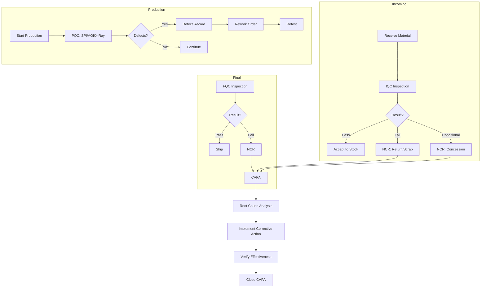
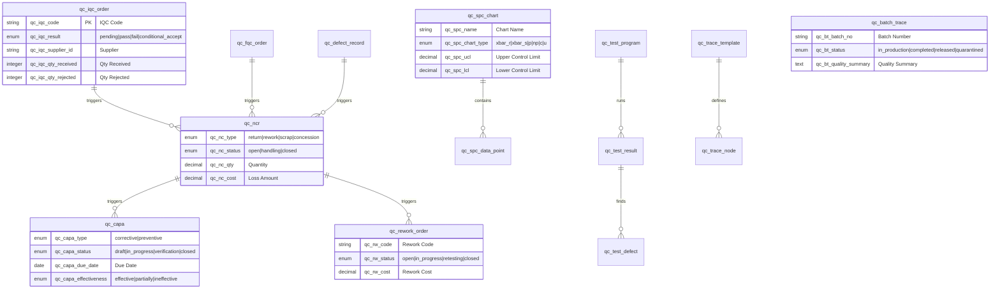
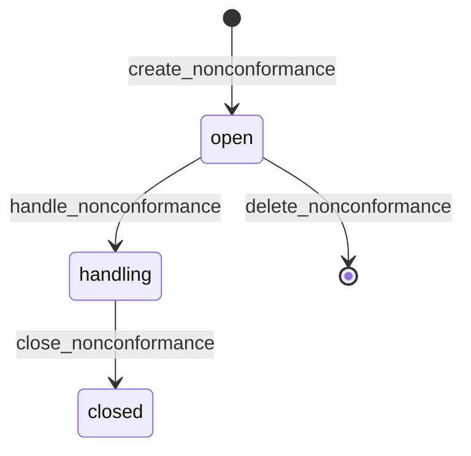
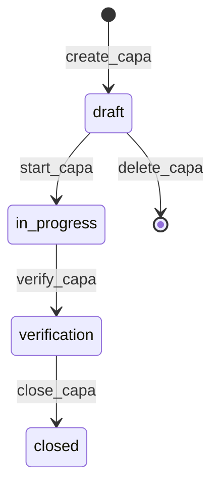
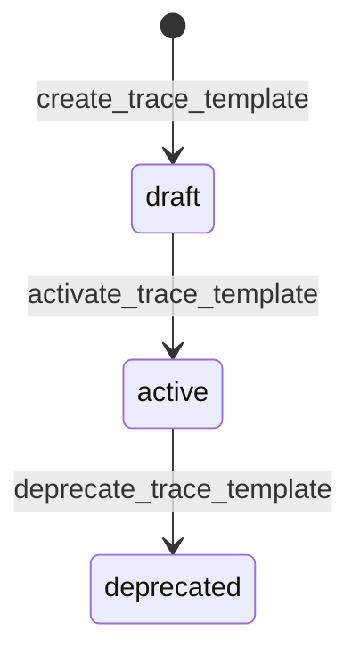

# Quality Management

> Inspections (IQC/PQC/FQC), non-conformance reports (NCR), corrective actions (CAPA), SPC control charts, rework orders, batch traceability, and quality cost tracking -- built entirely through AuraBoot's JSON DSL configuration.

**Plugin ID:** `com.auraboot.quality`
**Namespace:** `qc`
**Dependencies:** Product Catalog, Inventory, Org Management

---

## Business Overview

### The Problem

Manufacturing and process industries face a constant battle with quality. Incoming materials may not meet spec, production processes drift, defects slip through, and when they do, the cost of poor quality compounds -- scrap, rework, customer returns, and regulatory penalties. Without a unified quality system, root causes remain unidentified and corrective actions are never closed.

### Who It's For

- **Quality Engineers** -- manage inspections, analyze defects, maintain SPC charts
- **Production Supervisors** -- record process QC results, trigger rework orders
- **Compliance Teams** -- track CAPA activities, maintain traceability records
- **Management** -- monitor quality KPIs, track quality costs

### Key Capabilities

1. **Incoming Quality Control (IQC)** -- inspect incoming materials with AQL sampling, pass/fail/conditional accept
2. **Process Quality Control (PQC)** -- SPI, AOI, X-Ray, visual, and functional test records during production
3. **Final Quality Control (FQC)** -- final product inspection with batch-level pass rates
4. **Defect Record Tracking** -- log defects with type, location, root cause, and corrective action
5. **Non-Conformance Reports (NCR)** -- handle non-conforming material: return, rework, scrap, or concession
6. **CAPA Management** -- corrective and preventive actions with full lifecycle tracking
7. **SPC Control Charts** -- statistical process control with X-bar, R, P, NP, C, U chart types
8. **Batch Traceability** -- IPC-1782 traceability with configurable levels (L1-L4)
9. **Traceability Templates** -- define data requirements per product: lot, serial, component SN, process data
10. **Trace Nodes** -- build traceability trees linking products, assemblies, components, and processes
11. **Test Program Management** -- define test programs for AOI, ICT, FCT, X-Ray, Flying Probe, Burn-In
12. **Test Result Recording** -- capture pass/fail results with measurements, duration, and operator info
13. **Test Defect Tracking** -- defects found during testing with component reference and rework status
14. **Rework Order Management** -- track rework/repair lifecycle from NCR/defect to retest
15. **Quality Cost Tracking** -- prevention, appraisal, internal failure, and external failure costs
16. **Quality Dashboard** -- real-time KPIs and visual analytics
17. **Named Queries** -- pre-built data views for dashboard analytics
18. **Saved Views** -- user-configurable list filters and column layouts

### Workflow



---

## Data Model

### ER Diagram



### Models Summary (16 Models)

| Model | Code | Category | Icon | Description |
|-------|------|----------|------|-------------|
| IQC Order | `qc_iqc_order` | Document | ShieldCheck | Incoming quality control inspection |
| Process QC Record | `qc_pqc_record` | Transaction | ScanSearch | SPI, AOI, X-Ray inspection records |
| FQC Order | `qc_fqc_order` | Document | BadgeCheck | Final quality control inspection |
| Defect Record | `qc_defect_record` | Document | Bug | Defect tracking and root cause analysis |
| Batch Trace | `qc_batch_trace` | Transaction | Fingerprint | Batch traceability records |
| Nonconformance | `qc_ncr` | Document | AlertTriangle | Non-conforming material handling |
| SPC Control Chart | `qc_spc_chart` | Master | LineChart | Statistical process control charts |
| SPC Data Point | `qc_spc_data_point` | Entity | Dot | Individual SPC measurements |
| CAPA | `qc_capa` | Document | ClipboardCheck | Corrective and preventive actions |
| Quality Cost | `qc_quality_cost` | Transaction | Coins | Quality cost tracking (PAF model) |
| Test Program | `qc_test_program` | Master | FlaskConical | Test program definitions |
| Test Result | `qc_test_result` | Transaction | ClipboardCheck | Individual test results |
| Test Defect | `qc_test_defect` | Entity | Bug | Defects found during testing |
| Traceability Template | `qc_trace_template` | Master | ShieldCheck | IPC-1782 traceability templates |
| Trace Node | `qc_trace_node` | Entity | Network | Traceability tree nodes |
| Rework Order | `qc_rework_order` | Document | Wrench | Rework/repair lifecycle tracking |

---

## Fields Deep Dive

### IQC Order Fields (Key Fields)

| Field Code | Label | Type | Dict | Notes |
|-----------|-------|------|------|-------|
| `qc_iqc_code` | IQC Code | string | -- | Auto-generated |
| `qc_iqc_receipt_id` | Receipt | string | -- | Incoming receipt reference |
| `qc_iqc_supplier_id` | Supplier | string | -- | Supplier reference |
| `qc_iqc_material_id` | Material | string | -- | Material reference |
| `qc_iqc_qty_received` | Qty Received | integer | -- | Total received quantity |
| `qc_iqc_qty_inspected` | Qty Inspected | integer | -- | Sample size |
| `qc_iqc_qty_accepted` | Qty Accepted | integer | -- | Passed quantity |
| `qc_iqc_qty_rejected` | Qty Rejected | integer | -- | Failed quantity |
| `qc_iqc_aql_level` | AQL Level | string | -- | Acceptable Quality Level |
| `qc_iqc_result` | Result | enum | `qc_qc_result` | pending/pass/fail/conditional_accept |
| `qc_iqc_inspector` | Inspector | string | -- | Inspector name |

### Key Dictionaries

**QC Result** (`qc_qc_result`):
| Value | Label | Color |
|-------|-------|-------|
| `pending` | Pending | Gray |
| `pass` | Pass | Green |
| `fail` | Fail | Red |
| `conditional_accept` | Conditional Accept | Orange |

**NCR Type** (`qc_nc_type`):
| Value | Label |
|-------|-------|
| `return` | Return to Supplier |
| `rework` | Rework |
| `scrap` | Scrap |
| `concession` | Concession |

**CAPA Status** (`qc_capa_status`):
| Value | Label | Color |
|-------|-------|-------|
| `draft` | Draft | Gray |
| `in_progress` | In Progress | Blue |
| `verification` | Verification | Orange |
| `closed` | Closed | Green |

**SPC Chart Type** (`qc_spc_chart_type`):
| Value | Label |
|-------|-------|
| `xbar_r` | X-bar & R |
| `xbar_s` | X-bar & S |
| `p` | P Chart |
| `np` | NP Chart |
| `c` | C Chart |
| `u` | U Chart |

**Rework Status** (`qc_rework_status`):
| Value | Label |
|-------|-------|
| `open` | Open |
| `in_progress` | In Progress |
| `retesting` | Retesting |
| `closed` | Closed |

---

## Commands & Business Logic

### NCR Lifecycle



| Command | Code | Type | Description |
|---------|------|------|-------------|
| Create NCR | `qc:create_nonconformance` | create | Open new NCR, auto-sets status=open |
| Update NCR | `qc:update_nonconformance` | update | Edit NCR details |
| Handle NCR | `qc:handle_nonconformance` | state_transition | Open -> Handling |
| Close NCR | `qc:close_nonconformance` | state_transition | Handling -> Closed |
| Delete NCR | `qc:delete_nonconformance` | delete | Remove NCR (open status only) |

### CAPA Lifecycle



| Command | Code | Type | Description |
|---------|------|------|-------------|
| Create CAPA | `qc:create_capa` | create | Auto-sets status=draft |
| Start CAPA | `qc:start_capa` | state_transition | Draft -> In Progress |
| Verify CAPA | `qc:verify_capa` | state_transition | In Progress -> Verification |
| Close CAPA | `qc:close_capa` | state_transition | Verification -> Closed |
| Delete CAPA | `qc:delete_capa` | delete | Remove CAPA (draft status only) |

### Traceability Template Lifecycle



### IQC Inspection

```json
{
  "code": "qc:create_iqc_order",
  "displayName:en": "Create IQC Order",
  "type": "create",
  "modelCode": "qc_iqc_order",
  "inputFields": [
    "qc_iqc_receipt_id", "qc_iqc_supplier_id", "qc_iqc_material_id",
    "qc_iqc_material_name", "qc_iqc_qty_received", "qc_iqc_qty_inspected",
    "qc_iqc_qty_accepted", "qc_iqc_qty_rejected", "qc_iqc_aql_level",
    "qc_iqc_inspector", "qc_iqc_date", "qc_iqc_remark"
  ],
  "autoSetFields": {
    "qc_iqc_code": { "strategy": "auto_generate", "pattern": "IQC-{yyyyMMdd}-{seq}" },
    "qc_iqc_result": { "strategy": "fixed_value", "value": "pending" }
  },
  "permissions": ["QC.quality.manage"]
}
```

---

## Pages & User Interface

### Menu Structure (15 Pages)

| Menu | Icon | Path | Page Key |
|------|------|------|----------|
| Quality (directory) | ShieldCheck | `/quality` | -- |
| Quality Dashboard | LayoutDashboard | `/quality/quality-dashboard` | `qc_quality_dashboard` |
| IQC | ShieldCheck | `/quality/iqc` | `qc_iqc_order_list` |
| Process QC | ScanSearch | `/quality/pqc` | `qc_pqc_record_list` |
| FQC | BadgeCheck | `/quality/fqc` | `qc_fqc_order_list` |
| Defects | Bug | `/quality/defects` | `qc_defect_record_list` |
| Batch Trace | Fingerprint | `/quality/batch-trace` | `qc_batch_trace_list` |
| Nonconformance | AlertTriangle | `/quality/nonconformance` | `qc_ncr_list` |
| SPC Charts | LineChart | `/quality/spc` | `qc_spc_chart_list` |
| CAPA | ClipboardCheck | `/quality/capa` | `qc_capa_list` |
| Quality Cost | Coins | `/quality/quality-cost` | `qc_quality_cost_list` |
| Trace Templates | ShieldCheck | `/quality/trace-templates` | `qc_trace_template_list` |
| Rework Orders | Wrench | `/quality/rework-orders` | `qc_rework_order_list` |
| Test Programs | FlaskConical | `/quality/test-programs` | `qc_test_program_list` |
| Test Results | ClipboardCheck | `/quality/test-results` | `qc_test_result_list` |

### NCR List Page (Real JSON)

```json
{
  "pageKey": "qc_ncr_list",
  "name:en": "Nonconformance Management",
  "modelCode": "qc_ncr",
  "kind": "list",
  "schemaVersion": 2,
  "blocks": [
    {
      "id": "block_nc_toolbar",
      "blockType": "form-buttons",
      "buttons": [
        {
          "code": "create",
          "primary": true,
          "icon": "Plus",
          "permissionCode": "QC.quality.manage",
          "action": { "type": "navigate", "to": "qc_ncr_form", "command": "qc:create_nonconformance" }
        }
      ]
    },
    {
      "id": "block_nc_table",
      "blockType": "table",
      "defaultSort": { "field": "created_at", "order": "desc" },
      "searchFields": ["qc_nc_type", "qc_nc_source_type", "qc_nc_status"],
      "table": {
        "columns": [
          { "field": "qc_nc_type", "width": 120, "renderType": "tag", "dictCode": "qc_nc_type" },
          { "field": "qc_nc_source_type", "width": 120, "renderType": "tag" },
          { "field": "qc_nc_product_id", "width": 200 },
          { "field": "qc_nc_qty", "width": 100, "align": "right" },
          { "field": "qc_nc_status", "width": 100, "renderType": "tag", "dictCode": "qc_nc_status" },
          { "field": "qc_nc_cost", "width": 120, "align": "right" },
          {
            "field": "actions",
            "isActionColumn": true,
            "buttons": [
              { "code": "edit", "action": { "type": "navigate", "to": "qc_ncr_form" } },
              { "code": "handle", "action": { "type": "command", "command": "qc:handle_nonconformance" } },
              { "code": "close", "action": { "type": "command", "command": "qc:close_nonconformance" } },
              { "code": "delete", "danger": true, "confirm": "delete.confirm", "action": { "type": "command", "command": "qc:delete_nonconformance" } }
            ]
          }
        ]
      }
    }
  ]
}
```

### CAPA List Page (Real JSON)

```json
{
  "pageKey": "qc_capa_list",
  "name:en": "CAPA Management",
  "modelCode": "qc_capa",
  "kind": "list",
  "schemaVersion": 2,
  "blocks": [
    {
      "id": "block_capa_toolbar",
      "blockType": "form-buttons",
      "buttons": [
        {
          "code": "create",
          "primary": true,
          "icon": "Plus",
          "permissionCode": "QC.quality.capa",
          "action": { "type": "navigate", "to": "qc_capa_form", "command": "qc:create_capa" }
        }
      ]
    },
    {
      "id": "block_capa_table",
      "blockType": "table",
      "searchFields": ["qc_capa_type", "qc_capa_source_type", "qc_capa_status"],
      "table": {
        "columns": [
          { "field": "qc_capa_type", "width": 120, "renderType": "tag", "dictCode": "qc_capa_type" },
          { "field": "qc_capa_source_type", "width": 120, "renderType": "tag" },
          { "field": "qc_capa_description", "width": 250 },
          { "field": "qc_capa_status", "width": 100, "renderType": "tag", "dictCode": "qc_capa_status" },
          { "field": "qc_capa_responsible_id", "width": 120 },
          { "field": "qc_capa_due_date", "width": 110 },
          { "field": "qc_capa_effectiveness", "width": 100, "renderType": "tag" },
          {
            "field": "actions",
            "isActionColumn": true,
            "buttons": [
              { "code": "edit", "action": { "type": "navigate", "to": "qc_capa_form" } },
              { "code": "start", "action": { "type": "command", "command": "qc:start_capa" } },
              { "code": "verify", "action": { "type": "command", "command": "qc:verify_capa" } },
              { "code": "close", "action": { "type": "command", "command": "qc:close_capa" } },
              { "code": "delete", "danger": true, "action": { "type": "command", "command": "qc:delete_capa" } }
            ]
          }
        ]
      }
    }
  ]
}
```

---

## Permissions & Roles

### Permissions (10 Permissions)

| Code | Name | Type |
|------|------|------|
| `qc.quality.manage` | Quality Management | operation |
| `qc.quality.read` | Quality View | data |
| `qc.quality.spc` | SPC Management | operation |
| `qc.quality.capa` | CAPA Management | operation |
| `qc.quality.cost` | Quality Cost | operation |
| `qc.dashboard.quality` | Quality Dashboard | operation |
| `qc.test.manage` | Test Data Management | operation |
| `qc.test.read` | Test Data View | data |
| `qc.quality.rework` | Rework Management | operation |
| `qc.quality.rework.read` | Rework View | data |

### Roles

| Role | Code | Permissions |
|------|------|-------------|
| Quality Engineer | `qc_quality_engineer` | All 10 permissions |

---

## Getting Started

### 1. Install the Plugin

```bash
aura plugin publish plugins/quality --yes
```

### 2. Create an IQC Inspection

```bash
aura exec qc:create_iqc_order \
  --set qc_iqc_supplier_id="SUP-001" \
  --set qc_iqc_material_name="Resistor 10K" \
  --set qc_iqc_qty_received:int=1000 \
  --set qc_iqc_qty_inspected:int=80 \
  --set qc_iqc_qty_accepted:int=78 \
  --set qc_iqc_qty_rejected:int=2 \
  --set qc_iqc_aql_level="1.0" \
  --set qc_iqc_inspector="Zhang Wei"
```

### 3. Open a CAPA

```bash
aura exec qc:create_capa \
  --set qc_capa_type="corrective" \
  --set qc_capa_description="Resistor supplier quality degradation - 3 consecutive IQC failures" \
  --set qc_capa_due_date="2026-05-01"
```

### 4. Progress CAPA Through Lifecycle

```bash
aura exec qc:start_capa --target <capaPid>
aura exec qc:verify_capa --target <capaPid>
aura exec qc:close_capa --target <capaPid>
```

---

## Extension Points

### SPC Integration

The SPC Control Chart model (`qc_spc_chart`) stores control limits (UCL/CL/LCL) and links to data points. Extend with custom dashboard widgets to render real-time control charts with out-of-control point detection.

### IPC-1782 Traceability

Traceability Templates (`qc_trace_template`) define per-product data requirements at four levels:
- **L1**: Lot-level traceability
- **L2**: L1 + serial number tracking
- **L3**: L2 + component serial numbers
- **L4**: L3 + full process data

### Quality Cost Analysis

Quality costs follow the PAF (Prevention-Appraisal-Failure) model through the `qc_quality_cost` model. Use named queries and dashboard widgets to visualize cost trends and identify improvement opportunities.

### Test Program Automation

Test Programs (`qc_test_program`) define reusable test configurations. Link them to work orders and automatically record results through API integration with test equipment (AOI, ICT, FCT machines).

---

## FAQ

**Q: What inspection types are supported?**
A: Three levels -- IQC (incoming materials), PQC (in-process: SPI, AOI, X-Ray, visual, functional), and FQC (final product). Each has its own model with type-specific fields.

**Q: How does the NCR workflow connect to CAPA?**
A: NCRs handle the immediate disposition (return, rework, scrap, concession). CAPAs address the root cause to prevent recurrence. Create a CAPA from any NCR to establish the linkage.

**Q: Can I integrate SPC with real-time production data?**
A: Yes. Use the `qc:create_spc_data_point` command via API to push measurements from production equipment. The data points link to SPC charts for control limit analysis.

**Q: How does batch traceability work?**
A: Define a Traceability Template per product specifying data requirements. During production, Trace Nodes build a tree linking finished goods back through assemblies, components, and lot numbers. The `qc_batch_trace` model captures the quality summary per batch.

**Q: What is the quality cost model?**
A: It follows the PAF (Prevention-Appraisal-Failure) framework with cost types: prevention, appraisal, internal_failure, external_failure. Each cost entry links to a period and optionally to specific NCRs or CAPAs.
