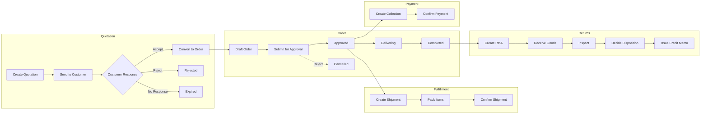
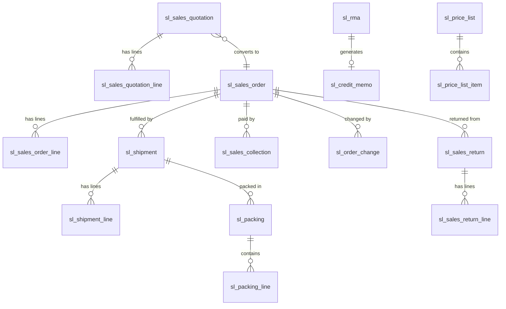
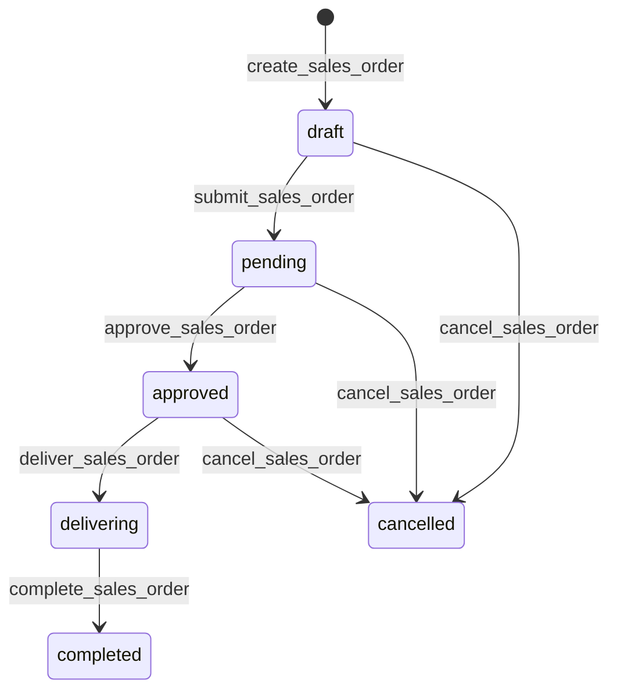
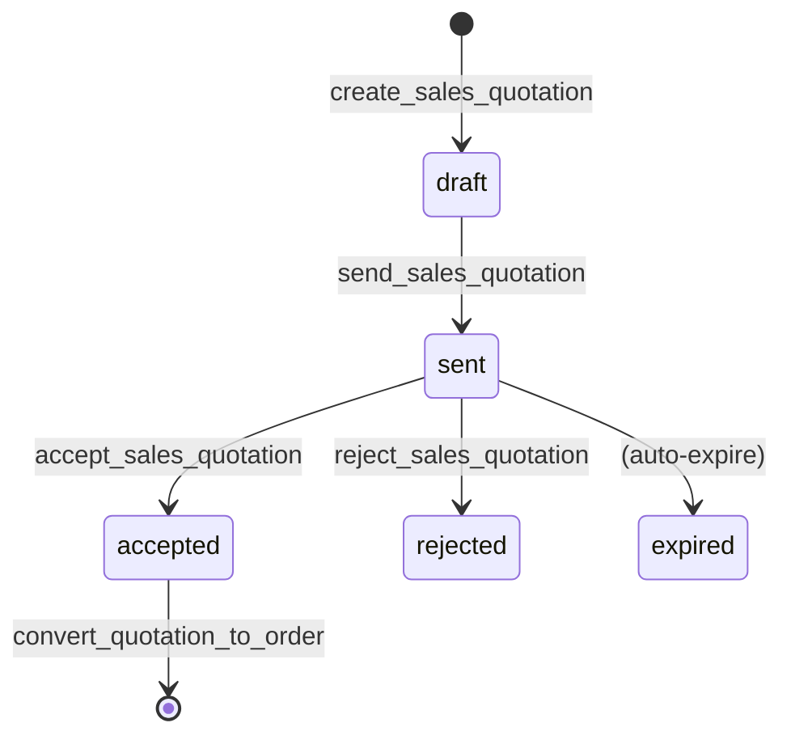
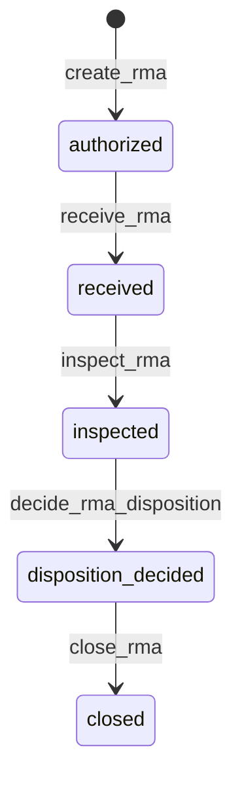
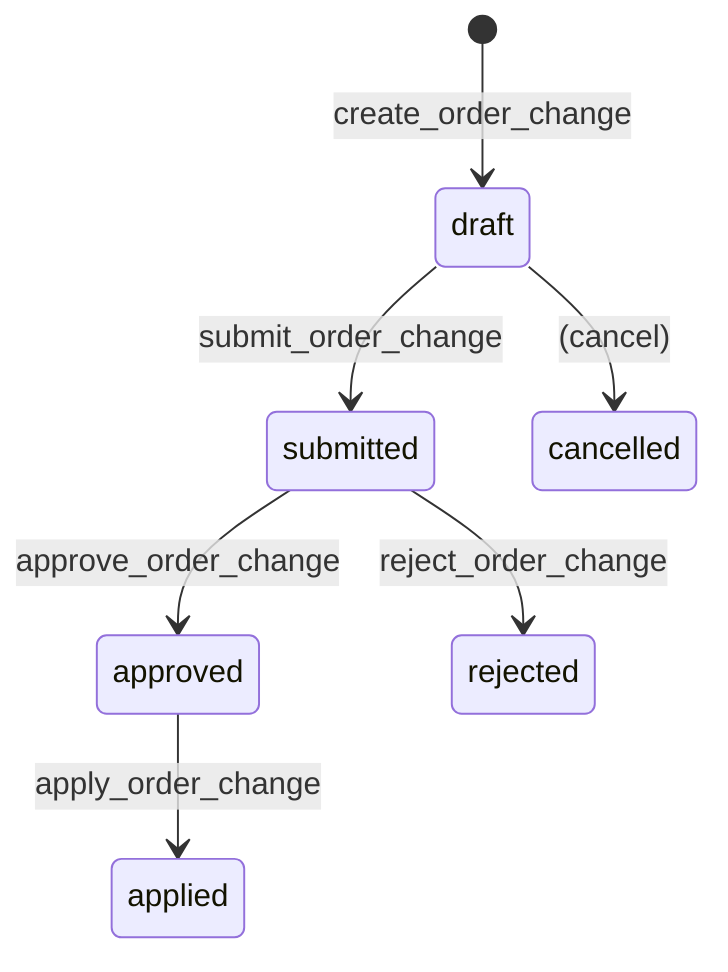

# Sales Management

> Sales pipeline, quoting, orders, shipments, returns, credit memos, RMA, pricing, and revenue tracking -- mostly driven by declarative DSL configuration.

## Business Overview

### Problem Statement

Manufacturing and distribution companies need an integrated sales management system that handles the complete order-to-cash lifecycle: from initial quotation through order fulfillment, shipment tracking, payment collection, and post-sale returns/RMA processing. Traditional ERP sales modules are rigid and require heavy customization. AuraBoot's Sales plugin delivers a fully configurable, state-machine-driven sales operation with multi-currency support, automated code generation, and real-time dashboards.

### Target Users

| Role | Responsibilities |
|------|-----------------|
| **Sales Representative** | Create quotations, manage orders, track deliveries |
| **Sales Manager** | Approve orders, monitor pipeline, review KPIs |
| **Warehouse Keeper** | Process shipments, manage packing |
| **Finance Specialist** | Handle collections, credit memos, AR reconciliation |
| **CRM Specialist** | Manage customer relationships, quotation pipeline |
| **ERP Administrator** | Full access to all sales modules |

### Key Capabilities

1. **Sales Quotation Management** -- Create, send, track, accept/reject quotations with revision control
2. **Quotation-to-Order Conversion** -- Single-step conversion from accepted quotation to sales order
3. **Sales Order Lifecycle** -- Full state machine: Draft -> Pending -> Approved -> Delivering -> Completed
4. **Multi-Currency Support** -- Automatic exchange rate conversion with base currency tracking
5. **Document Line Items** -- Parent-child document model with auto-calculated totals
6. **Auto-Generated Codes** -- Pattern-based code generation (SO-{yyyyMMdd}-{seq}, SQ-{yyyyMMdd}-{seq})
7. **Shipment Management** -- Warehouse-based shipment tracking linked to sales orders
8. **Packing Management** -- Nested container support (carton/pallet) with serial number tracking
9. **Payment Collection** -- Multi-method collection tracking with payment status aggregation
10. **Sales Returns** -- Return processing with fault attribution and inspection workflow
11. **RMA Processing** -- Full Return Merchandise Authorization with inspection, disposition, and credit memo linkage
12. **Credit Memos** -- Financial credit documents linked to RMA with approval workflow
13. **Order Change Requests** -- Formal change management with impact assessment and approval
14. **Price List Management** -- Effective-dated price lists with currency, priority, and quantity tiers
15. **Discount Rules** -- Percentage, fixed amount, and tiered discount configurations
16. **Sales Dashboard** -- Real-time KPIs, trend charts, top customers/products, delivery performance
17. **Kanban Board** -- Visual order board grouped by status with drag-and-drop
18. **ATP Calculation** -- Available-to-Promise date calculation for delivery planning
19. **Compliance Checking** -- Automated compliance validation on orders

### End-to-End Workflow



## Data Model

### Entity Relationship Diagram



### Models Overview

| Model Code | Display Name | Category | Description |
|------------|-------------|----------|-------------|
| `sl_sales_quotation` | Sales Quotation | document | Quote with line items, revision control, validity period |
| `sl_sales_quotation_line` | Quotation Line | entity | Line items of a quotation (child) |
| `sl_sales_order` | Sales Order | document | Core sales document with full lifecycle management |
| `sl_sales_order_line` | Sales Order Line | entity | Order line items with product, qty, price, amount |
| `sl_shipment` | Shipment | document | Shipment fulfillment linked to sales order |
| `sl_shipment_line` | Shipment Line | entity | Shipment line items (child) |
| `sl_sales_collection` | Sales Collection | transaction | Payment collection record |
| `sl_sales_return` | Sales Return | document | Return order with inspection and fault tracking |
| `sl_sales_return_line` | Sales Return Line | entity | Return line items (child) |
| `sl_order_change` | Order Change Request | document | Formal order modification with approval |
| `sl_rma` | RMA | document | Return Merchandise Authorization with disposition |
| `sl_credit_memo` | Credit Memo | document | Financial credit document linked to RMA |
| `sl_packing` | Packing | document | Packing/boxing record with nested containers |
| `sl_packing_line` | Packing Line | entity | Individual items packed (child) |
| `sl_price_list` | Price List | master | Price list with effective dates and currency |
| `sl_price_list_item` | Price List Item | entity | Per-product pricing within a price list |
| `sl_discount_rule` | Discount Rule | master | Configurable discount with type and conditions |

### Sales Order Model (Complete JSON)

```json
{
  "code": "sl_sales_order",
  "displayName:zh-CN": "销售订单",
  "displayName:en": "Sales Order",
  "description": "Sales order with customer info, status workflow, and line items",
  "modelType": "entity",
  "modelCategory": "document",
  "extension": {
    "icon": "ShoppingCart",
    "category": "sales",
    "titleField": "sl_so_code",
    "subtitleField": "sl_so_account_id",
    "documentConfig": {
      "lineModel": "sl_sales_order_line",
      "lineForeignKey": "sl_sol_order_id",
      "codeField": "sl_so_code",
      "codePattern": "SO-{yyyyMMdd}-{seq}",
      "statusField": "sl_so_status",
      "totalFields": [
        { "parentField": "sl_so_total_amount", "childField": "sl_sol_amount" }
      ],
      "lineQtyField": "sl_sol_qty",
      "linePriceField": "sl_sol_price",
      "lineAmountField": "sl_sol_amount",
      "stateMachine": "full"
    }
  }
}
```

### Sales Quotation Model

```json
{
  "code": "sl_sales_quotation",
  "displayName:en": "Sales Quotation",
  "modelType": "entity",
  "modelCategory": "document",
  "extension": {
    "icon": "FileText",
    "category": "sales",
    "titleField": "sl_sq_code",
    "subtitleField": "sl_sq_account_id",
    "documentConfig": {
      "lineModel": "sl_sales_quotation_line",
      "lineForeignKey": "sl_sql_quotation_id",
      "codeField": "sl_sq_code",
      "codePattern": "SQ-{yyyyMMdd}-{seq}",
      "statusField": "sl_sq_status",
      "totalFields": [
        { "parentField": "sl_sq_total_amount", "childField": "sl_sql_amount" }
      ],
      "stateMachine": "standard"
    }
  }
}
```

## Fields Deep Dive

### Sales Order Fields

| Field Code | Purpose | Type |
|-----------|---------|------|
| `sl_so_code` | Auto-generated order number (SO-{yyyyMMdd}-{seq}) | TEXT |
| `sl_so_account_id` | Customer reference | REFERENCE |
| `sl_so_date` | Order date | DATE |
| `sl_so_delivery_date` | Expected delivery date | DATE |
| `sl_so_atp_date` | Available-to-Promise date | DATE |
| `sl_so_status` | Order status (pe_order_status dict) | ENUM |
| `sl_so_payment_status` | Payment status (pe_payment_status dict) | ENUM |
| `sl_so_total_qty` | Total quantity (auto-summed) | DECIMAL |
| `sl_so_total_amount` | Total amount in transaction currency | DECIMAL |
| `sl_so_total_amount_base` | Total amount in base currency | DECIMAL |
| `sl_so_currency_code` | Transaction currency | ENUM |
| `sl_so_base_currency_code` | Base/reporting currency | ENUM |
| `sl_so_exchange_rate` | Exchange rate at order time | DECIMAL |
| `sl_so_exchange_rate_id` | Exchange rate record reference | REFERENCE |
| `sl_so_source_quote_id` | Source quotation reference | REFERENCE |
| `sl_so_trace_level` | Product traceability level (IPC class) | ENUM |
| `sl_so_hold_reason` | Reason for order hold | TEXT |
| `sl_so_remark` | Notes | TEXTAREA |
| `sl_so_attachment` | File attachments | FILE |

### Sales Order Line Fields

| Field Code | Purpose | Type |
|-----------|---------|------|
| `sl_sol_order_id` | Parent order reference | REFERENCE |
| `sl_sol_product_id` | Product reference | REFERENCE |
| `sl_sol_qty` | Ordered quantity | DECIMAL |
| `sl_sol_price` | Unit price (transaction currency) | DECIMAL |
| `sl_sol_price_base` | Unit price (base currency) | DECIMAL |
| `sl_sol_amount` | Line amount (qty x price) | DECIMAL |
| `sl_sol_amount_base` | Line amount in base currency | DECIMAL |
| `sl_sol_shipped_qty` | Shipped quantity tracker | DECIMAL |
| `sl_sol_remark` | Line notes | TEXT |

### Quotation-Specific Fields

| Field Code | Purpose | Type |
|-----------|---------|------|
| `sl_sq_contact_id` | Customer contact reference | REFERENCE |
| `sl_sq_valid_until` | Quotation expiry date | DATE |
| `sl_sq_revision` | Revision number | INTEGER |
| `sl_sq_discount_pct` | Overall discount percentage | DECIMAL |
| `sl_sq_margin_pct` | Margin percentage | DECIMAL |
| `sl_sq_payment_terms` | Payment terms (pe_payment_terms dict) | ENUM |
| `sl_sq_quality_class` | Quality/IPC class | ENUM |
| `sl_sq_source_rfq_id` | Source RFQ reference | REFERENCE |
| `sl_sq_trace_level` | Traceability level | ENUM |

### RMA Fields

| Field Code | Purpose | Type |
|-----------|---------|------|
| `sl_rma_code` | RMA number | TEXT |
| `sl_rma_customer_id` | Customer reference | REFERENCE |
| `sl_rma_so_id` | Source sales order | REFERENCE |
| `sl_rma_shipment_id` | Related shipment | REFERENCE |
| `sl_rma_status` | RMA lifecycle status | ENUM |
| `sl_rma_reason_code` | Return reason (defective/wrong_item/damaged/doa/other) | ENUM |
| `sl_rma_disposition` | Disposition decision (repair/replace/refund/scrap) | ENUM |
| `sl_rma_fault_attribution` | Fault attribution (customer/logistics/manufacturing/supplier/design) | ENUM |
| `sl_rma_quantity` | Return quantity | DECIMAL |
| `sl_rma_serial_no` | Serial number for tracking | TEXT |
| `sl_rma_inspection_result` | Inspection findings | TEXTAREA |
| `sl_rma_repair_notes` | Repair details | TEXTAREA |
| `sl_rma_authorized_amount` | Authorized refund amount | DECIMAL |
| `sl_rma_credit_memo_id` | Linked credit memo | REFERENCE |

### Status Enumerations

**Order Status (`pe_order_status`)**:

| Value | Label | Color |
|-------|-------|-------|
| `draft` | Draft | gray |
| `pending` | Pending Approval | blue |
| `approved` | Approved | green |
| `delivering` | Delivering | orange |
| `receiving` | Receiving | orange |
| `completed` | Completed | green |
| `cancelled` | Cancelled | red |

**Quotation Status (`pe_quotation_status`)**:

| Value | Label | Color |
|-------|-------|-------|
| `draft` | Draft | gray |
| `sent` | Sent | blue |
| `accepted` | Accepted | green |
| `rejected` | Rejected | red |
| `expired` | Expired | orange |

**RMA Status (`sl_rma_status`)**:

| Value | Label | Color |
|-------|-------|-------|
| `authorized` | Authorized | blue |
| `received` | Received | yellow |
| `inspected` | Inspected | purple |
| `disposition_decided` | Disposition Decided | orange |
| `closed` | Closed | green |

**Credit Memo Status (`sl_cm_status`)**:

| Value | Label | Color |
|-------|-------|-------|
| `draft` | Draft | gray |
| `approved` | Approved | green |
| `applied` | Applied (offset against AR) | purple |
| `cancelled` | Cancelled | red |

**Payment Status (`pe_payment_status`)**:

| Value | Label |
|-------|-------|
| `not_paid` | Not Paid |
| `partial` | Partial Payment |
| `fully_paid` | Fully Paid |

**Currency (`sl_currency`)**:

`cny`, `usd`, `eur`, `gbp`, `jpy`

**Discount Type (`sl_discount_type`)**:

`percentage`, `fixed_amount`, `tiered`

**RMA Reason (`sl_rma_reason`)**:

`defective`, `wrong_item`, `damaged`, `doa`, `other`

**RMA Disposition (`sl_rma_disposition`)**:

`repair`, `replace`, `refund`, `scrap`

**Fault Attribution (`pe_fault_attribution`)**:

`customer`, `logistics`, `manufacturing`, `supplier`, `design`

**Payment Terms (`pe_payment_terms`)**:

`net_30`, `net_60`, `net_90`, `prepaid`, `cod`

## Commands & Business Logic

### Command Map

The Sales plugin defines **82 commands** across all models. Here are the key commands organized by function:

#### Sales Quotation Commands

| Command | Type | Description |
|---------|------|-------------|
| `sl:create_sales_quotation` | create | Create quotation with auto-code SQ-{yyyyMMdd}-{seq} |
| `sl:update_sales_quotation` | update | Edit draft quotation |
| `sl:send_sales_quotation` | state_transition | Draft -> Sent |
| `sl:accept_sales_quotation` | state_transition | Sent -> Accepted |
| `sl:reject_sales_quotation` | state_transition | Sent -> Rejected |
| `sl:convert_quotation_to_order` | action | Convert accepted quotation to sales order |
| `sl:create_quotation_from_rfq` | action | Create quotation from CRM RFQ |
| `sl:submit_quotation_approval` | state_transition | Submit for internal approval |
| `sl:delete_sales_quotation` | delete | Delete draft quotation |
| `sl:add_sq_line` | create | Add quotation line item |
| `sl:update_sq_line` | update | Update line item |
| `sl:delete_sq_line` | delete | Remove line item |

#### Sales Order Commands

| Command | Type | Description |
|---------|------|-------------|
| `sl:create_sales_order` | create | Create order, auto-code SO-{yyyyMMdd}-{seq}, status=draft |
| `sl:update_sales_order` | update | Edit draft order |
| `sl:submit_sales_order` | state_transition | Draft -> Pending |
| `sl:approve_sales_order` | state_transition | Pending -> Approved (checks credit limit) |
| `sl:deliver_sales_order` | state_transition | Approved -> Delivering |
| `sl:complete_sales_order` | state_transition | Delivering -> Completed |
| `sl:cancel_sales_order` | state_transition | Draft/Pending/Approved -> Cancelled |
| `sl:delete_sales_order` | delete | Delete draft order only |
| `sl:calculate_atp` | action | Calculate Available-to-Promise date |
| `sl:check_compliance` | action | Run compliance checks |
| `sl:add_so_line` | create | Add order line item |
| `sl:delete_so_line` | delete | Remove order line item |

#### Shipment Commands

| Command | Type | Description |
|---------|------|-------------|
| `sl:create_shipment` | create | Create shipment, code SH-{yyyyMMdd}-{seq} |
| `sl:update_shipment` | update | Edit draft shipment |
| `sl:confirm_shipment` | state_transition | Draft -> Confirmed |
| `sl:cancel_shipment` | state_transition | Draft -> Cancelled |
| `sl:delete_shipment` | delete | Delete draft shipment |

#### RMA Commands

| Command | Type | Description |
|---------|------|-------------|
| `sl:create_rma` | create | Create RMA request |
| `sl:create_rma_from_complaint` | action | Create RMA from customer complaint |
| `sl:receive_rma` | state_transition | Authorized -> Received |
| `sl:inspect_rma` | state_transition | Received -> Inspected |
| `sl:decide_rma_disposition` | state_transition | Inspected -> Disposition Decided |
| `sl:close_rma` | state_transition | Disposition Decided -> Closed |
| `sl:delete_rma` | delete | Delete RMA |

#### Credit Memo Commands

| Command | Type | Description |
|---------|------|-------------|
| `sl:create_credit_memo` | create | Create credit memo |
| `sl:approve_credit_memo` | state_transition | Draft -> Approved |
| `sl:apply_credit_memo` | state_transition | Approved -> Applied |
| `sl:cancel_credit_memo` | state_transition | Draft/Approved -> Cancelled |

#### Price List & Discount Commands

| Command | Type | Description |
|---------|------|-------------|
| `sl:create_price_list` | create | Create price list |
| `sl:activate_price_list` | state_transition | Draft -> Active |
| `sl:deactivate_price_list` | state_transition | Active -> Inactive |
| `sl:archive_price_list` | state_transition | Inactive -> Archived |
| `sl:create_discount_rule` | create | Create discount rule |
| `sl:activate_discount_rule` | state_transition | Draft -> Active |
| `sl:deactivate_discount_rule` | state_transition | Active -> Inactive |
| `sl:archive_discount_rule` | state_transition | Inactive -> Archived |

### State Machines

#### Sales Order State Machine



#### Quotation State Machine



#### RMA State Machine



#### Order Change Request State Machine



### Create Sales Order Command (Complete JSON)

```json
{
  "code": "sl:create_sales_order",
  "displayName:en": "Create Sales Order",
  "description": "Create a sales order with auto-generated code and draft status",
  "type": "create",
  "modelCode": "sl_sales_order",
  "inputFields": [
    "sl_so_account_id",
    "sl_so_date",
    "sl_so_delivery_date"
  ],
  "autoSetFields": {
    "sl_so_code": {
      "strategy": "auto_generate",
      "pattern": "SO-{yyyyMMdd}-{seq}"
    },
    "sl_so_status": {
      "strategy": "fixed_value",
      "value": "draft"
    }
  },
  "permissions": ["SL.sales.manage"],
  "agent_hint": "Create a new sl sales order record. Key inputs: account_id, date, delivery_date. Auto-generated: code, status.",
  "cmd_risk_level": "L1"
}
```

### Approve Sales Order Command (Complete JSON)

```json
{
  "code": "sl:approve_sales_order",
  "displayName:en": "Approve Order",
  "description": "Approve sales order: pending -> approved. Handler checks customer credit limit.",
  "type": "state_transition",
  "modelCode": "sl_sales_order",
  "stateField": "sl_so_status",
  "fromStates": ["pending"],
  "toState": "approved",
  "handler": "sl:approve_sales_order",
  "permissions": ["SL.sales.manage"],
  "extension": {
    "confirmMessage:en": "Approve this order?"
  },
  "cmd_risk_level": "L1"
}
```

### Binding Rules (Currency Conversion)

The plugin uses `bindingRules` to automatically handle multi-currency conversion on document creation:

```json
{
  "commandCode": "sl:create_sales_order",
  "ruleType": "handler",
  "handlerClass": "currencyConversionHandler",
  "config": {
    "mode": "header",
    "currencyField": "sl_so_currency_code",
    "rateField": "sl_so_exchange_rate",
    "rateIdField": "sl_so_exchange_rate_id",
    "baseCurrencyField": "sl_so_base_currency_code",
    "amountFields": ["sl_so_total_amount"]
  },
  "sequence": 50,
  "enabled": true
}
```

This binding is applied to all document-creating commands (quotations, orders, returns, collections, credit memos) to ensure consistent base-currency amount calculation.

## Pages & User Interface

The Sales plugin ships with **33 page configurations** covering every model:

### Page Inventory

| Page Key | Kind | Model | Description |
|----------|------|-------|-------------|
| `sales_dashboard` | dashboard | sl_sales_order | Sales KPI dashboard |
| `sl_sales_quotation_list` | list | sl_sales_quotation | Quotation list with status tabs |
| `sl_sales_quotation_form` | form | sl_sales_quotation | Quotation creation/edit form |
| `sl_sales_quotation_detail` | detail | sl_sales_quotation | Quotation detail view |
| `sl_sales_order_list` | list | sl_sales_order | Order list with status tabs |
| `sl_sales_order_form` | form | sl_sales_order | Order creation/edit form |
| `sl_sales_order_detail` | detail | sl_sales_order | Order detail with workflow actions |
| `sl_shipment_list` | list | sl_shipment | Shipment list |
| `sl_shipment_form` | form | sl_shipment | Shipment form |
| `sl_shipment_detail` | detail | sl_shipment | Shipment detail |
| `sl_sales_collection_list` | list | sl_sales_collection | Collection list |
| `sl_sales_collection_form` | form | sl_sales_collection | Collection form |
| `sl_sales_collection_detail` | detail | sl_sales_collection | Collection detail |
| `sl_sales_return_list` | list | sl_sales_return | Return list |
| `sl_sales_return_form` | form | sl_sales_return | Return form |
| `sl_sales_return_detail` | detail | sl_sales_return | Return detail |
| `sl_order_change_list` | list | sl_order_change | Change request list |
| `sl_order_change_form` | form | sl_order_change | Change request form |
| `sl_rma_list` | list | sl_rma | RMA list |
| `sl_rma_form` | form | sl_rma | RMA form |
| `sl_rma_detail` | detail | sl_rma | RMA detail |
| `sl_credit_memo_list` | list | sl_credit_memo | Credit memo list |
| `sl_credit_memo_form` | form | sl_credit_memo | Credit memo form |
| `sl_credit_memo_detail` | detail | sl_credit_memo | Credit memo detail |
| `sl_packing_list` | list | sl_packing | Packing list |
| `sl_packing_form` | form | sl_packing | Packing form |
| `sl_packing_detail` | detail | sl_packing | Packing detail |
| `sl_price_list_list` | list | sl_price_list | Price list management |
| `sl_price_list_form` | form | sl_price_list | Price list form |
| `sl_price_list_detail` | detail | sl_price_list | Price list detail |
| `sl_discount_rule_list` | list | sl_discount_rule | Discount rule list |
| `sl_discount_rule_form` | form | sl_discount_rule | Discount rule form |
| `sl_discount_rule_detail` | detail | sl_discount_rule | Discount rule detail |

### Sales Order List Page (Complete JSON)

```json
{
  "pageKey": "sl_sales_order_list",
  "name:en": "Sales Management",
  "modelCode": "sl_sales_order",
  "kind": "list",
  "schemaVersion": 2,
  "layout": { "type": "grid", "cols": 12 },
  "blocks": [
    {
      "id": "block_so_tabs",
      "blockType": "tabs",
      "layout": { "colSpan": 12, "rowSpan": 1 },
      "tabs": [
        { "key": "all", "label": { "en": "All" }, "filter": null },
        { "key": "draft", "label": { "en": "Draft" },
          "filter": { "field": "sl_so_status", "operator": "EQ", "value": "draft" } },
        { "key": "pending", "label": { "en": "Pending" },
          "filter": { "field": "sl_so_status", "operator": "EQ", "value": "pending" } },
        { "key": "approved", "label": { "en": "Approved" },
          "filter": { "field": "sl_so_status", "operator": "EQ", "value": "approved" } },
        { "key": "delivering", "label": { "en": "Delivering" },
          "filter": { "field": "sl_so_status", "operator": "EQ", "value": "delivering" } },
        { "key": "completed", "label": { "en": "Completed" },
          "filter": { "field": "sl_so_status", "operator": "EQ", "value": "completed" } }
      ]
    },
    {
      "id": "block_so_toolbar",
      "blockType": "form-buttons",
      "layout": { "colSpan": 12, "rowSpan": 1 },
      "buttons": [
        {
          "code": "create",
          "primary": true,
          "icon": "Plus",
          "permissionCode": "SL.sales.manage",
          "action": { "type": "navigate", "to": "sl_sales_order_form", "command": "sl:create_sales_order" }
        }
      ]
    },
    {
      "id": "block_so_table",
      "blockType": "table",
      "layout": { "colSpan": 12, "rowSpan": 1 },
      "defaultSort": { "field": "created_at", "order": "desc" },
      "searchFields": ["sl_so_code", "sl_so_account_id", "sl_so_status"],
      "table": {
        "columns": [
          { "field": "sl_so_code", "width": 160, "fixed": "left" },
          { "field": "sl_so_account_id", "width": 180 },
          { "field": "sl_so_date", "width": 120 },
          { "field": "sl_so_delivery_date", "width": 120 },
          { "field": "sl_so_total_qty", "width": 100, "align": "right" },
          { "field": "sl_so_total_amount", "width": 130, "align": "right" },
          { "field": "sl_so_status", "width": 100, "renderType": "tag", "dictCode": "pe_order_status" },
          { "field": "sl_so_payment_status", "width": 110, "renderType": "tag", "dictCode": "pe_payment_status" },
          {
            "field": "actions",
            "isActionColumn": true,
            "buttons": [
              { "code": "detail", "icon": "Eye", "action": { "type": "navigate", "to": "sl_sales_order_detail" } },
              { "code": "edit", "icon": "Edit", "visibleWhen": "row.sl_so_status === 'draft'",
                "action": { "type": "navigate", "to": "sl_sales_order_form" } },
              { "code": "submit", "icon": "Send", "visibleWhen": "row.sl_so_status === 'draft'",
                "action": { "type": "command", "command": "sl:submit_sales_order" } },
              { "code": "approve", "icon": "CheckCircle", "visibleWhen": "row.sl_so_status === 'pending'",
                "action": { "type": "command", "command": "sl:approve_sales_order" } },
              { "code": "deliver", "icon": "Truck", "visibleWhen": "row.sl_so_status === 'approved'",
                "action": { "type": "command", "command": "sl:deliver_sales_order" } },
              { "code": "complete", "icon": "CheckSquare", "visibleWhen": "row.sl_so_status === 'delivering'",
                "action": { "type": "command", "command": "sl:complete_sales_order" } },
              { "code": "cancel", "icon": "XCircle", "danger": true,
                "visibleWhen": "['draft','pending','approved'].includes(row.sl_so_status)",
                "action": { "type": "command", "command": "sl:cancel_sales_order" } },
              { "code": "delete", "icon": "Trash2", "danger": true,
                "visibleWhen": "row.sl_so_status === 'draft'", "confirm": "delete.confirm",
                "action": { "type": "command", "command": "sl:delete_sales_order" } }
            ]
          }
        ]
      }
    }
  ]
}
```

### Sales Order Form Page (Complete JSON)

```json
{
  "pageKey": "sl_sales_order_form",
  "name:en": "Sales Order Form",
  "modelCode": "sl_sales_order",
  "kind": "form",
  "schemaVersion": 2,
  "layout": { "type": "grid", "cols": 12, "gap": 12 },
  "blocks": [
    {
      "id": "block_so_basic",
      "blockType": "form-section",
      "title": { "en": "Basic Information" },
      "layout": { "colSpan": 12, "rowSpan": 1 },
      "columns": 2,
      "fields": [
        { "field": "sl_so_account_id", "layout": { "colSpan": 6 } },
        { "field": "sl_so_date", "layout": { "colSpan": 6 } },
        { "field": "sl_so_delivery_date", "layout": { "colSpan": 6 } },
        { "field": "sl_so_remark", "layout": { "colSpan": 12 } }
      ]
    },
    {
      "id": "block_so_lines",
      "blockType": "sub-table",
      "title": { "en": "Order Lines" },
      "layout": { "colSpan": 12, "rowSpan": 1 },
      "subTable": {
        "childModel": "sl_sales_order_line",
        "parentField": "sl_sol_order_id",
        "readOnly": false,
        "commands": { "create": "sl:add_so_line", "delete": "sl:delete_so_line" },
        "columns": [
          { "field": "sl_sol_product_id", "width": 250 },
          { "field": "sl_sol_qty", "width": 120, "align": "right" },
          { "field": "sl_sol_price", "width": 120, "align": "right" },
          { "field": "sl_sol_amount", "width": 130, "align": "right" }
        ]
      }
    },
    {
      "id": "block_so_footer",
      "blockType": "form-buttons",
      "buttons": [
        { "code": "save", "primary": true, "action": { "type": "command", "command": "sl:create_sales_order" } },
        { "code": "cancel", "action": { "type": "builtin", "name": "back" } }
      ]
    }
  ]
}
```

### Sales Dashboard (Complete JSON)

The dashboard page combines stat cards, charts, and data tables:

```json
{
  "pageKey": "sales_dashboard",
  "name:en": "Sales Dashboard",
  "modelCode": "sl_sales_order",
  "kind": "dashboard",
  "schemaVersion": 2,
  "layout": { "type": "grid", "cols": 12, "gap": 16 },
  "blocks": [
    {
      "id": "block_kpi_cards",
      "blockType": "stat-card",
      "dataSource": {
        "type": "api",
        "url": "/api/datasource/list",
        "params": { "datasourceId": "nq:sales_dashboard_kpi", "format": "records", "maxItems": "1" }
      },
      "cards": [
        { "field": "month_orders", "label": { "en": "Monthly Orders" }, "icon": "IconShoppingCart", "color": "#3b82f6" },
        { "field": "total_order_amount", "label": { "en": "Total Order Amount" }, "icon": "IconCurrencyDollar", "color": "#10b981", "format": "currency" },
        { "field": "shipment_rate", "label": { "en": "Shipment Rate(%)" }, "icon": "IconTruck", "color": "#f59e0b", "format": "percent" },
        { "field": "return_rate", "label": { "en": "Return Rate(%)" }, "icon": "IconRotateCcw", "color": "#ef4444", "format": "percent" },
        { "field": "collection_amount", "label": { "en": "Collected Amount" }, "icon": "IconWallet", "color": "#8b5cf6", "format": "currency" },
        { "field": "quotation_count", "label": { "en": "Quotations" }, "icon": "IconFileText", "color": "#06b6d4" }
      ]
    },
    {
      "id": "chart_order_monthly_trend",
      "blockType": "chart",
      "chartType": "line",
      "layout": { "colSpan": 6 },
      "title": { "en": "Order Monthly Trend" },
      "chartConfig": { "smooth": true, "areaStyle": true,
        "dataSource": { "type": "namedQuery", "queryCode": "sales_order_monthly_trend" } }
    },
    {
      "id": "chart_order_status",
      "blockType": "chart",
      "chartType": "pie",
      "layout": { "colSpan": 6 },
      "title": { "en": "Order Status Distribution" },
      "chartConfig": { "dataSource": { "type": "namedQuery", "queryCode": "sales_order_status_stats" } }
    },
    {
      "id": "chart_top_customers",
      "blockType": "chart",
      "chartType": "bar",
      "layout": { "colSpan": 6 },
      "title": { "en": "Top 10 Customers (by Amount)" },
      "chartConfig": { "orientation": "horizontal",
        "dataSource": { "type": "namedQuery", "queryCode": "sales_top_customers" } }
    },
    {
      "id": "chart_top_products",
      "blockType": "chart",
      "chartType": "bar",
      "layout": { "colSpan": 6 },
      "title": { "en": "Top 10 Products (by Quantity)" },
      "chartConfig": { "orientation": "horizontal",
        "dataSource": { "type": "namedQuery", "queryCode": "sales_top_products" } }
    },
    {
      "id": "chart_delivery_performance",
      "blockType": "chart",
      "chartType": "line",
      "layout": { "colSpan": 6 },
      "title": { "en": "Delivery On-Time Rate Trend" }
    },
    {
      "id": "chart_return_analysis",
      "blockType": "chart",
      "chartType": "pie",
      "layout": { "colSpan": 6 },
      "title": { "en": "Return Reason Analysis" }
    },
    {
      "id": "block_pending_orders",
      "blockType": "table",
      "layout": { "colSpan": 6 },
      "title": { "en": "Pending Orders" },
      "dataSource": { "type": "api", "params": { "datasourceId": "nq:sales_pending_orders" } }
    },
    {
      "id": "block_recent_orders",
      "blockType": "table",
      "modelCode": "sl_sales_order",
      "layout": { "colSpan": 6 },
      "title": { "en": "Recent Orders" },
      "defaultSort": { "field": "created_at", "order": "desc" }
    }
  ]
}
```

### Saved Views

The plugin includes a pre-configured Kanban board view:

```json
{
  "name": "Order Board",
  "description": "Sales order kanban board grouped by order status",
  "modelCode": "sl_sales_order",
  "viewType": "kanban",
  "viewConfig": {
    "groupByField": "sl_so_status",
    "titleField": "sl_so_code",
    "descriptionField": "sl_so_total_amount",
    "cardFields": [
      { "field": "sl_so_account_id", "label": "Customer", "type": "text" },
      { "field": "sl_so_total_amount", "label": "Total Amount", "type": "number" },
      { "field": "sl_so_delivery_date", "label": "Delivery Date", "type": "date" }
    ],
    "kanbanAggregations": [
      { "field": "sl_so_total_amount", "function": "sum", "label": "Total Value" },
      { "field": null, "function": "count", "label": "Count" }
    ],
    "draggable": true,
    "showCount": true,
    "showAggregations": true
  }
}
```

## Permissions & Roles

### Permission Matrix

| Code | Name | Type | Scope |
|------|------|------|-------|
| `sl.sales.manage` | Sales Management | operation | Create, edit, delete orders and manage workflow |
| `sl.sales.read` | Sales View | data | View orders and details |
| `sl.rma.manage` | RMA Management | operation | Manage RMA requests and dispositions |
| `sl.rma.read` | RMA View | data | View RMA records |
| `sl.financial.credit_memo` | Credit Memo Management | operation | Create, approve, apply credit memos |
| `sl.financial.credit_memo.read` | Credit Memo View | data | View credit memos |
| `sl.packing` | Packing Management | operation | Manage packing records |
| `sl.packing.read` | Packing View | data | View packing records |
| `sl.price_list.manage` | Price List & Discount Management | operation | Manage price lists and discount rules |
| `sl.price_list.read` | Price List & Discount View | data | View pricing data |

### Pre-configured Roles

| Role Code | Name | Permissions |
|-----------|------|-------------|
| `sl_admin` | ERP Administrator | All sales permissions |
| `sl_sales` | Sales Representative | `sl.sales.manage`, `sl.sales.read` |
| `sl_crm` | CRM Specialist | `sl.sales.manage`, `sl.sales.read` |
| `sl_warehouse` | Warehouse Keeper | `sl.packing`, `sl.packing.read` |
| `sl_finance` | Finance Specialist | `sl.financial.credit_memo`, `sl.financial.credit_memo.read`, `sl.rma.read`, `sl.sales.read` |

## Internationalization

The plugin provides complete bilingual (English / Chinese) support through the i18n system. Every model, field, menu, command, and dictionary value has both `zh-CN` and `en-US` translations:

```json
[
  { "key": "model.sl_sales_order._meta.label", "zh-CN": "销售订单", "en-US": "Sales Order" },
  { "key": "model.sl_sales_quotation._meta.label", "zh-CN": "销售报价", "en-US": "Sales Quotation" },
  { "key": "model.sl_shipment._meta.label", "zh-CN": "发货单", "en-US": "Shipment" },
  { "key": "model.sl_sales_collection._meta.label", "zh-CN": "收款记录", "en-US": "Sales Collection" },
  { "key": "menu.sl_sales_orders.label", "zh-CN": "销售管理", "en-US": "Sales Management" },
  { "key": "menu.sl_sales_quotations.label", "zh-CN": "销售报价", "en-US": "Sales Quotations" },
  { "key": "menu.sl_shipments.label", "zh-CN": "发货管理", "en-US": "Shipments" },
  { "key": "menu.sl_sales_collections.label", "zh-CN": "收款管理", "en-US": "Collections" }
]
```

Field labels are auto-derived through AuraBoot's three-layer i18n resolution mechanism (model -> field -> action), so explicit field-level entries are only needed for overrides.

## Workflows

### Quote-to-Cash Workflow

1. **Quotation Phase**: Sales rep creates quotation (from RFQ or manually) -> adds line items with product/qty/price -> sends to customer
2. **Negotiation**: Customer accepts, rejects, or lets it expire. Revision tracking allows re-quoting.
3. **Order Conversion**: Accepted quotation converts to sales order with one command (`sl:convert_quotation_to_order`)
4. **Approval**: Order submitted for review -> manager approves (credit limit check via handler)
5. **Fulfillment**: Shipment created from approved order -> items packed -> shipment confirmed
6. **Payment**: Collection records created -> confirmed when payment received -> order payment status auto-updates
7. **Completion**: When all items shipped and paid, order moves to Completed

### Return & RMA Workflow

1. **RMA Authorization**: Customer initiates return -> RMA created (from complaint or manually)
2. **Goods Receipt**: Returned goods received at warehouse
3. **Inspection**: Quality team inspects returned items, records findings
4. **Disposition Decision**: Manager decides: repair, replace, refund, or scrap
5. **Credit Processing**: If refund -> credit memo created -> approved -> applied against AR
6. **Closure**: RMA closed after disposition completed

### Order Change Management

1. **Change Request**: Customer requests modification (quantity, delivery date, product, price, cancel line, add line)
2. **Impact Assessment**: System calculates cost impact, old vs new values recorded
3. **Approval**: Change request submitted for manager approval
4. **Application**: Approved change applied to the original order
5. **Rejection**: Rejected changes can be cancelled or revised

## Automation Rules

The Sales plugin leverages binding rules for automated business logic:

- **Currency Conversion**: All document-creating commands automatically trigger the `currencyConversionHandler` which looks up the current exchange rate and populates base-currency amount fields
- **Auto-Code Generation**: Document codes (SO-{yyyyMMdd}-{seq}, SQ-{yyyyMMdd}-{seq}, SH-{yyyyMMdd}-{seq}) are auto-generated on creation
- **Total Aggregation**: Document totals (sl_so_total_amount, sl_so_total_qty) are automatically calculated from line item amounts via `documentConfig.totalFields`
- **Status Initialization**: All new documents start in `draft` status via `autoSetFields`

## Getting Started

### Prerequisites

The Sales plugin depends on these plugins (install them first):

- `com.auraboot.product-catalog` -- Product master data
- `com.auraboot.crm` -- Customer/account data
- `com.auraboot.inventory` -- Warehouse and stock data
- `com.auraboot.finance` -- Exchange rates and financial foundation

### Installation

```bash
# Install the Sales plugin
aura plugin publish plugins/sales --yes

# Verify installation
aura status
```

### Explore the Module

1. Navigate to **Sales** in the sidebar menu
2. Open the **Sales Dashboard** to see KPI overview
3. Go to **Sales > Sales Quotations** to create your first quotation
4. Go to **Sales > Sales Orders** to manage orders
5. Use the **Kanban view** (switch via saved views) for visual order management

### Create Sample Data

```bash
# Create a sales order via CLI
aura exec sl:create_sales_order \
  --set sl_so_account_id="<customer_pid>" \
  --set sl_so_date="2026-04-11" \
  --set sl_so_delivery_date="2026-04-25"

# Submit for approval
aura exec sl:submit_sales_order --target <order_pid>

# Approve the order
aura exec sl:approve_sales_order --target <order_pid>
```

## Extension Points

The Sales plugin can be extended in several ways:

1. **Custom Handlers**: Add binding rules with custom handler classes for business logic (e.g., credit limit checks, inventory reservation)
2. **Additional Fields**: Add custom fields to any model via the field binding system
3. **Named Queries**: Create new dashboard widgets by adding named queries
4. **Saved Views**: Configure additional list/kanban/calendar views
5. **Automation**: Hook into command lifecycle via binding rules (pre/post handlers)
6. **Cross-Plugin Integration**: Reference sales data from other plugins (e.g., finance for invoicing, logistics for shipping)

## FAQ

**Q: How does multi-currency work?**
A: Each document has transaction currency (`sl_so_currency_code`) and base currency fields. The `currencyConversionHandler` binding rule automatically looks up the exchange rate and populates base-currency amounts on document creation/update.

**Q: Can I customize the code generation pattern?**
A: Yes, modify the `codePattern` in the model's `documentConfig.codePattern` field. Supported tokens: `{yyyy}`, `{MM}`, `{dd}`, `{yyyyMMdd}`, `{seq}`.

**Q: How are document totals calculated?**
A: Via `documentConfig.totalFields` -- the platform automatically sums child line amounts to the parent total field when lines are added, updated, or deleted.

**Q: Can I add approval workflows?**
A: Yes. The state machine transitions already enforce the approval flow. You can add BPM process integration by configuring process bindings on the `sl:approve_sales_order` command.

**Q: How do I link a quotation to an order?**
A: Use the `sl:convert_quotation_to_order` command on an accepted quotation. The `sl_so_source_quote_id` field on the resulting order references the original quotation.

**Q: What permissions are needed for the Finance team?**
A: Assign the `sl_finance` role which grants credit memo management, RMA view, and sales read access.
