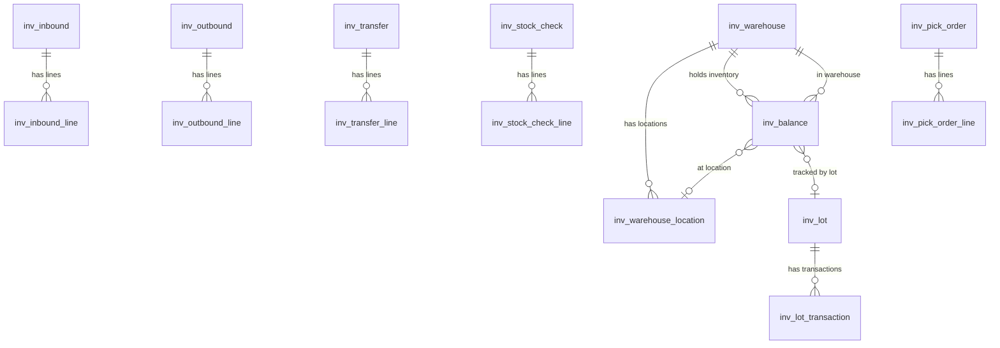

# Warehouse & Inventory Management

> Inventory tracking, receiving, shipping, stock transfers, stock counts, lot/serial number traceability, pick order management, inventory holds/allocations, and a real-time analytics dashboard -- all built from DSL configuration with zero custom code.

**Plugin:** `com.auraboot.inventory` | **Namespace:** `inv` | **Version:** 1.0.0

Dependencies: `com.auraboot.product-catalog`, `com.auraboot.org-management`

---

## Business Overview

### The Problem

Organizations managing physical goods need to track what they have, where it is, and how it moves. Without a unified warehouse management system, inventory counts drift from reality, material shortages halt production, shipments go to wrong locations, and lot traceability for recalls is impossible.

### Target Users

| Role | Activities |
|------|-----------|
| Warehouse Keeper | Receive goods, issue materials, manage locations, execute stock counts |
| Inventory Manager | Monitor stock levels, approve transfers, analyze aging and turnover |
| Picker/Packer | Execute pick orders, scan lot/serial numbers |
| Production Manager | Reserve materials for production, view available inventory |
| Purchaser | Check stock levels before ordering, view low-stock alerts |
| Sales Representative | Check product availability, view reserved quantities |
| Quality Engineer | Place inventory on hold for QC, quarantine lots |

### Key Capabilities

1. **Warehouse Master Data** -- Define warehouses by type (raw material, finished goods, semi-finished, general) with address and status
2. **Location Management** -- Hierarchical storage locations with type (shelving, pallet rack, bulk storage, quarantine, staging), zone, and capacity
3. **Inbound (Receiving)** -- Warehouse receipts with line items, auto-generated codes, draft/confirmed lifecycle
4. **Outbound (Shipping/Issue)** -- Warehouse issues with line items, multiple types (sales, production pick, return, outsource)
5. **Inventory Balance** -- Real-time stock levels per product per warehouse with quantity, available, reserved, and safety stock
6. **Stock Transfers** -- Inter-warehouse transfers with approval workflow (draft -> pending -> approved -> confirmed)
7. **Stock Counts (Cycle Counts)** -- Physical inventory checks with system vs. actual quantity comparison
8. **Lot/Serial Number Tracking** -- Batch and serial number lifecycle (active -> quarantine -> expired -> scrapped)
9. **Lot Transaction History** -- Complete movement log per lot: in, out, transfer, adjust
10. **Pick Order Management** -- Pick orders with line-level tracking (pending -> in progress -> completed)
11. **Inventory Hold/Allocation** -- Three-state inventory: available, allocated (for orders), on-hold (QC, damage)
12. **Low Stock Alerts** -- Automatic detection of items below safety stock threshold
13. **Inventory Dashboard** -- KPI cards, stock value by warehouse, movement trends, aging analysis, turnover rates
14. **Kanban Board View** -- Inbound receipts displayed as a kanban board grouped by status
15. **Moving Average Cost** -- Track average cost per product for inventory valuation
16. **Multiple Inbound Types** -- Purchase receipt, production receipt, return receipt, outsource receipt, other
17. **Multiple Outbound Types** -- Sales issue, production pick, return issue, outsource issue, other
18. **Auto-putaway** -- Automated location assignment for received goods
19. **Wave Picking** -- Group pick orders from multiple outbound orders

### Workflow

```mermaid
graph TB
    subgraph Inbound
        WI_D[Receipt Draft] -->|confirm| WI_C[Receipt Confirmed]
        WI_C -->|handler| BAL_UP[Balance Updated +]
    end

    subgraph Outbound
        WO_D[Issue Draft] -->|confirm| WO_C[Issue Confirmed]
        WO_C -->|handler| BAL_DOWN[Balance Updated -]
    end

    subgraph Transfer
        ST_D[Transfer Draft] -->|submit| ST_P[Pending Approval]
        ST_P -->|approve| ST_A[Approved]
        ST_A -->|confirm| ST_C[Confirmed]
        ST_D -->|cancel| ST_X[Cancelled]
        ST_P -->|cancel| ST_X
    end

    subgraph StockCheck
        SC_D[Check Draft] -->|submit| SC_P[Pending]
        SC_P -->|confirm| SC_C[Confirmed]
        SC_D -->|cancel| SC_X[Cancelled]
    end

    subgraph Picking
        PK_P[Pick Pending] -->|start| PK_IP[In Progress]
        PK_IP -->|complete| PK_C[Completed]
        PK_P -->|cancel| PK_X[Cancelled]
    end

    subgraph LotLifecycle
        LOT_A[Active] -->|quarantine| LOT_Q[Quarantine]
        LOT_A -->|expire| LOT_E[Expired]
        LOT_Q -->|scrap| LOT_S[Scrapped]
        LOT_A -->|scrap| LOT_S
    end
```



---

## Data Model

### ER Diagram



### Models

| Model Code | Display Name | Category | Description |
|------------|-------------|----------|-------------|
| `inv_warehouse` | Warehouse | master | Warehouse master data with type, address, status, pick strategy, lot/SN tracking flags |
| `inv_warehouse_location` | Warehouse Location | master | Storage location within a warehouse with type, zone, capacity, priority |
| `inv_inbound` | Warehouse Receipt | document | Inbound receipt header with auto-generated code (`WI-{yyyyMMdd}-{seq}`) |
| `inv_inbound_line` | Receipt Line | entity | Receipt line item: product, qty, price, amount, location, lot code |
| `inv_outbound` | Warehouse Issue | document | Outbound issue header with auto-generated code |
| `inv_outbound_line` | Issue Line | entity | Issue line item: product, qty, price, amount, location, lot |
| `inv_transfer` | Stock Transfer | document | Transfer header with from/to warehouses, approval workflow |
| `inv_transfer_line` | Stock Transfer Line | entity | Transfer line: product, qty, from/to locations, lot |
| `inv_stock_check` | Stock Check | document | Inventory count header with warehouse and date |
| `inv_stock_check_line` | Stock Check Line | entity | Count line: product, system qty, actual qty, difference, location |
| `inv_lot` | Lot / Serial Number | master | Batch or serial number tracking with expiry, manufacture date, supplier |
| `inv_lot_transaction` | Lot Transaction | transaction | Movement log: in, out, transfer, adjust with timestamps and references |
| `inv_pick_order` | Pick Order | document | Pick order with assignment, source type, wave reference |
| `inv_pick_order_line` | Pick Line | entity | Individual pick line: product, required/picked qty, from/to location, status |
| `inv_inventory_hold` | Inventory Hold/Allocation | transaction | Three-state management: allocate, hold, release_allocation, release_hold |
| `inv_balance` | Inventory | transaction | Current stock per product: qty, available, reserved, safety stock, average cost, amount |

### Model JSON -- Warehouse Receipt

```json
{
  "code": "inv_inbound",
  "displayName:zh-CN": "入库单",
  "displayName:en": "Warehouse Receipt",
  "description": "Warehouse inbound receipt with line items",
  "modelType": "entity",
  "modelCategory": "document",
  "extension": {
    "icon": "PackagePlus",
    "category": "inventory",
    "titleField": "inv_in_code",
    "subtitleField": "inv_in_type"
  }
}
```

### Model JSON -- Inventory Balance

```json
{
  "code": "inv_balance",
  "displayName:zh-CN": "库存",
  "displayName:en": "Inventory",
  "description": "Current stock levels per product, maintained by warehouse confirm handlers",
  "modelType": "entity",
  "modelCategory": "transaction",
  "extension": {
    "icon": "Warehouse",
    "category": "inventory",
    "titleField": "inv_bal_product_name",
    "subtitleField": "inv_bal_spec"
  }
}
```

---

## Fields Deep Dive

### Warehouse Fields (`inv_warehouse`)

| Field Code | Label (EN) | Type | Notes |
|-----------|-----------|------|-------|
| `inv_warehouse_code` | Warehouse Code | STRING | Auto-generated: `WH-{yyyyMMdd}-{seq}` |
| `inv_warehouse_name` | Warehouse Name | STRING | Required |
| `inv_warehouse_type` | Warehouse Type | ENUM | `raw_material`/`finished`/`semi_finished`/`general` |
| `inv_warehouse_address` | Address | STRING | |
| `inv_warehouse_status` | Status | ENUM | `enabled`/`disabled` |
| `inv_wh_lot_tracking` | Lot Tracking | BOOLEAN | Enable batch tracking |
| `inv_wh_sn_tracking` | SN Tracking | BOOLEAN | Enable serial number tracking |
| `inv_wh_pick_strategy` | Pick Strategy | ENUM | `fifo`/`lifo`/`fefo`/`location_priority`/`full_case_first` |

### Warehouse Location Fields (`inv_warehouse_location`)

| Field Code | Label (EN) | Type | Notes |
|-----------|-----------|------|-------|
| `inv_wl_code` | Location Code | STRING | |
| `inv_wl_name` | Location Name | STRING | |
| `inv_wl_warehouse_id` | Warehouse | REFERENCE | Parent warehouse |
| `inv_wl_status` | Status | ENUM | `enabled`/`disabled` |
| `inv_loc_type` | Location Type | ENUM | `shelving`/`pallet_rack`/`bulk_storage`/`quarantine`/`staging` |
| `inv_loc_zone_type` | Zone Type | ENUM | `receiving`/`storage`/`picking`/`packing`/`shipping` |
| `inv_loc_capacity` | Capacity | NUMBER | |
| `inv_loc_priority` | Priority | NUMBER | For pick strategy |
| `inv_loc_parent_id` | Parent Location | REFERENCE | Hierarchical locations |
| `inv_loc_address` | Address | STRING | |

### Inbound Receipt Fields (`inv_inbound`)

| Field Code | Label (EN) | Type | Notes |
|-----------|-----------|------|-------|
| `inv_in_code` | Receipt Code | STRING | Auto-generated: `WI-{yyyyMMdd}-{seq}` |
| `inv_in_type` | Inbound Type | ENUM | `purchase_in`/`production_in`/`return_in`/`outsource_in`/`other` |
| `inv_in_date` | Receipt Date | DATE | |
| `inv_in_source_no` | Source No. | STRING | PO number, production order, etc. |
| `inv_in_warehouse_id` | Warehouse | REFERENCE | Target warehouse |
| `inv_in_total_amount` | Total Amount | DECIMAL | Calculated from lines |
| `inv_in_status` | Status | ENUM | `draft`/`confirmed` |

### Inbound Line Fields (`inv_inbound_line`)

| Field Code | Label (EN) | Type | Notes |
|-----------|-----------|------|-------|
| `inv_in_line_receipt_id` | Receipt | REFERENCE | Parent receipt |
| `inv_in_line_product_id` | Product | REFERENCE | Product catalog reference |
| `inv_in_line_qty` | Quantity | NUMBER | Required |
| `inv_in_line_price` | Unit Price | DECIMAL | |
| `inv_in_line_amount` | Amount | DECIMAL | Calculated: qty * price |
| `inv_in_line_location_id` | Location | REFERENCE | Target storage location |
| `inv_in_line_lot_code` | Lot Code | STRING | |

### Inventory Balance Fields (`inv_balance`)

| Field Code | Label (EN) | Type | Notes |
|-----------|-----------|------|-------|
| `inv_bal_product_id` | Product | REFERENCE | |
| `inv_bal_product_name` | Product Name | STRING | Denormalized |
| `inv_bal_spec` | Specification | STRING | |
| `inv_bal_unit` | Unit | STRING | |
| `inv_bal_warehouse_id` | Warehouse | REFERENCE | |
| `inv_bal_location_id` | Location | REFERENCE | |
| `inv_bal_lot_id` | Lot | REFERENCE | |
| `inv_bal_qty` | Stock Quantity | NUMBER | Total physical quantity |
| `inv_bal_available_qty` | Available Qty | NUMBER | = qty - reserved_qty |
| `inv_bal_reserved_qty` | Reserved Qty | NUMBER | Allocated to orders |
| `inv_bal_safety_stock` | Safety Stock | NUMBER | Low stock threshold |
| `inv_bal_avg_cost` | Avg Cost | DECIMAL | Moving average cost |
| `inv_bal_amount` | Stock Amount | DECIMAL | = qty * avg_cost |

### Stock Transfer Fields (`inv_transfer`)

| Field Code | Label (EN) | Type | Notes |
|-----------|-----------|------|-------|
| `inv_st_code` | Transfer Code | STRING | Auto-generated: `ST-{yyyyMMdd}-{seq}` |
| `inv_st_date` | Transfer Date | DATE | |
| `inv_st_from_warehouse` | From Warehouse | REFERENCE | Source warehouse |
| `inv_st_to_warehouse` | To Warehouse | REFERENCE | Destination warehouse |
| `inv_st_total_qty` | Total Qty | NUMBER | Sum of line quantities |
| `inv_st_status` | Status | ENUM | `draft`/`pending`/`approved`/`confirmed`/`cancelled` |
| `inv_st_remark` | Remark | TEXT | |

### Lot Fields (`inv_lot`)

| Field Code | Label (EN) | Type | Notes |
|-----------|-----------|------|-------|
| `inv_lot_code` | Lot Code | STRING | |
| `inv_lot_type` | Lot Type | ENUM | `batch`/`serial` |
| `inv_lot_product_id` | Product | REFERENCE | |
| `inv_lot_status` | Status | ENUM | `active`/`quarantine`/`expired`/`scrapped` |
| `inv_lot_expiry_date` | Expiry Date | DATE | For FEFO picking |
| `inv_lot_manufacture_date` | Manufacture Date | DATE | |
| `inv_lot_supplier_id` | Supplier | REFERENCE | |
| `inv_lot_source_type` | Source | ENUM | `purchase`/`production`/`transfer` |
| `inv_lot_source_no` | Source No. | STRING | |

### Inventory Hold Fields (`inv_inventory_hold`)

| Field Code | Label (EN) | Type | Notes |
|-----------|-----------|------|-------|
| `inv_ih_product_id` | Product | REFERENCE | |
| `inv_ih_warehouse_id` | Warehouse | REFERENCE | |
| `inv_ih_location_code` | Location | STRING | |
| `inv_ih_lot_no` | Lot No. | STRING | |
| `inv_ih_serial_no` | Serial No. | STRING | |
| `inv_ih_quantity` | Quantity | NUMBER | |
| `inv_ih_action_type` | Action | ENUM | `allocate`/`hold`/`release_allocation`/`release_hold` |
| `inv_ih_reason_code` | Reason | ENUM | `qc_hold`/`damage`/`customer_dispute`/`production_reserve`/`order_allocation`/`other` |
| `inv_ih_reference_type` | Reference Type | ENUM | `sales_order`/`production_order`/`qc_report`/`rma` |
| `inv_ih_reference_no` | Reference No. | STRING | |
| `inv_ih_status` | Status | ENUM | `active`/`released`/`expired` |
| `inv_ih_notes` | Notes | TEXT | |

### Pick Order Fields (`inv_pick_order`)

| Field Code | Label (EN) | Type | Notes |
|-----------|-----------|------|-------|
| `inv_pick_code` | Pick Code | STRING | Auto-generated: `PK-{yyyyMMdd}-{seq}` |
| `inv_pick_status` | Status | ENUM | `pending`/`in_progress`/`completed`/`cancelled` |
| `inv_pick_wave_id` | Wave | REFERENCE | Optional wave grouping |
| `inv_pick_source_type` | Source Type | STRING | |
| `inv_pick_source_id` | Source | REFERENCE | |
| `inv_pick_warehouse_id` | Warehouse | REFERENCE | |
| `inv_pick_assigned_to` | Assigned To | REFERENCE | Picker assignment |
| `inv_pick_total_lines` | Total Lines | NUMBER | |
| `inv_pick_completed_lines` | Completed Lines | NUMBER | |
| `inv_pick_start_time` | Start Time | DATETIME | |
| `inv_pick_end_time` | End Time | DATETIME | |

### Enumerations

**Warehouse Type** (`inv_warehouse_type`):

| Value | EN Label |
|-------|---------|
| `raw_material` | Raw Material |
| `finished` | Finished Goods |
| `semi_finished` | Semi-finished |
| `general` | General |

**Inbound Type** (`pe_in_type`):

| Value | EN Label |
|-------|---------|
| `purchase_in` | Purchase Receipt |
| `production_in` | Production Receipt |
| `return_in` | Return Receipt |
| `outsource_in` | Outsource Receipt |
| `other` | Other Receipt |

**Outbound Type** (`pe_out_type`):

| Value | EN Label |
|-------|---------|
| `sales_out` | Sales Issue |
| `production_pick` | Production Issue |
| `return_out` | Return Issue |
| `outsource_out` | Outsource Issue |
| `other` | Other Issue |

**Transfer Status** (`inv_transfer_status`):

| Value | EN Label | Color |
|-------|---------|-------|
| `draft` | Draft | `#d9d9d9` |
| `pending` | Pending Approval | `#1890ff` |
| `approved` | Approved | `#52c41a` |
| `confirmed` | Confirmed | `#13c2c2` |
| `cancelled` | Cancelled | `#ff4d4f` |

**Stock Check Status** (`pe_check_status`):

| Value | EN Label | Color |
|-------|---------|-------|
| `draft` | Draft | `#d9d9d9` |
| `pending` | Pending Confirmation | `#1890ff` |
| `confirmed` | Confirmed | `#52c41a` |
| `cancelled` | Cancelled | `#ff4d4f` |

**Pick Strategy** (`inv_pick_strategy`):

| Value | EN Label | Description |
|-------|---------|-------------|
| `fifo` | FIFO | First In, First Out |
| `lifo` | LIFO | Last In, First Out |
| `fefo` | FEFO | First Expired, First Out |
| `location_priority` | Location Priority | Pick from highest priority location |
| `full_case_first` | Full Case First | Prefer full cases over broken |

**Lot Status** (`inv_lot_status`):

| Value | EN Label | Color |
|-------|---------|-------|
| `active` | Active | `#52c41a` |
| `quarantine` | Quarantine | `#faad14` |
| `expired` | Expired | `#ff4d4f` |
| `scrapped` | Scrapped | `#8c8c8c` |

**Location Type** (`pe_location_type`):

| Value | EN Label |
|-------|---------|
| `shelving` | Shelving |
| `pallet_rack` | Pallet Rack |
| `bulk_storage` | Bulk Storage |
| `quarantine` | Quarantine |
| `staging` | Staging |

**Zone Type** (`pe_zone_type`):

| Value | EN Label |
|-------|---------|
| `receiving` | Receiving |
| `storage` | Storage |
| `picking` | Picking |
| `packing` | Packing |
| `shipping` | Shipping |

**Inventory Hold Action Type** (`inv_ih_action_type`):

| Value | EN Label | Color |
|-------|---------|-------|
| `allocate` | Allocate | `#1890ff` |
| `hold` | Hold | `#faad14` |
| `release_allocation` | Release Allocation | `#52c41a` |
| `release_hold` | Release Hold | `#52c41a` |

**Hold Reason** (`inv_ih_reason`):

| Value | EN Label |
|-------|---------|
| `qc_hold` | QC Hold |
| `damage` | Damage |
| `customer_dispute` | Customer Dispute |
| `production_reserve` | Production Reserve |
| `order_allocation` | Order Allocation |
| `other` | Other |

---

## Commands & Business Logic

### Complete Command Map

| Command Code | Type | Model | Description |
|-------------|------|-------|-------------|
| `pe:create_warehouse` | create | `inv_warehouse` | Auto-code `WH-{yyyyMMdd}-{seq}`, status=`enabled` |
| `inv:update_warehouse` | update | `inv_warehouse` | |
| `inv:delete_warehouse` | delete | `inv_warehouse` | |
| `inv:create_warehouse_location` | create | `inv_warehouse_location` | |
| `inv:update_warehouse_location` | update | `inv_warehouse_location` | |
| `inv:delete_warehouse_location` | delete | `inv_warehouse_location` | |
| `pe:create_warehouse_in` | create | `inv_inbound` | Auto-code `WI-{yyyyMMdd}-{seq}`, status=`draft` |
| `inv:update_warehouse_in` | update | `inv_inbound` | Only while draft |
| `pe:confirm_warehouse_in` | state_transition | `inv_inbound` | `draft` -> `confirmed`. **Java handler updates inventory balance.** |
| `inv:delete_warehouse_in` | delete | `inv_inbound` | Only while draft |
| `pe:add_wh_in_line` | create | `inv_inbound_line` | Add receipt line |
| `inv:delete_wh_in_line` | delete | `inv_inbound_line` | Remove receipt line |
| `inv:create_warehouse_out` | create | `inv_outbound` | Auto-code, status=`draft` |
| `inv:update_warehouse_out` | update | `inv_outbound` | |
| `pe:confirm_warehouse_out` | state_transition | `inv_outbound` | `draft` -> `confirmed`. **Java handler decreases inventory.** |
| `inv:delete_warehouse_out` | delete | `inv_outbound` | |
| `pe:create_stock_transfer` | create | `inv_transfer` | Auto-code `ST-{yyyyMMdd}-{seq}`, status=`draft` |
| `pe:submit_stock_transfer` | state_transition | `inv_transfer` | `draft` -> `pending` |
| `pe:approve_stock_transfer` | state_transition | `inv_transfer` | `pending` -> `approved` |
| `pe:confirm_stock_transfer` | state_transition | `inv_transfer` | `approved` -> `confirmed`. **Java handler moves inventory.** |
| `inv:cancel_stock_transfer` | state_transition | `inv_transfer` | Cancel transfer |
| `pe:create_stock_check` | create | `inv_stock_check` | Auto-code `SC-{yyyyMMdd}-{seq}`, status=`draft` |
| `inv:submit_stock_check` | state_transition | `inv_stock_check` | `draft` -> `pending` |
| `inv:confirm_stock_check` | state_transition | `inv_stock_check` | `pending` -> `confirmed` |
| `inv:cancel_stock_check` | state_transition | `inv_stock_check` | Cancel stock check |
| `inv:create_lot` | create | `inv_lot` | Create lot/serial number |
| `inv:quarantine_lot` | action | `inv_lot` | Quarantine a lot |
| `inv:scrap_lot` | action | `inv_lot` | Scrap a lot |
| `inv:trace_lot` | action | `inv_lot` | Trace lot movements |
| `pe:create_pick_order` | create | `inv_pick_order` | Auto-code `PK-{yyyyMMdd}-{seq}`, status=`pending` |
| `inv:start_pick` | state_transition | `inv_pick_order` | `pending` -> `in_progress` |
| `inv:complete_pick_order` | state_transition | `inv_pick_order` | Complete all lines |
| `inv:complete_pick_line` | update | `inv_pick_order_line` | Complete individual pick line |
| `inv:cancel_pick_order` | state_transition | `inv_pick_order` | Cancel pick order |
| `pe:hold_inventory` | action | `inv_inventory_hold` | **Java handler validates available qty, moves to on_hold.** |
| `inv:allocate_inventory` | action | `inv_inventory_hold` | Allocate inventory for an order |
| `inv:release_hold` | action | `inv_inventory_hold` | Release hold back to available |
| `inv:release_allocation` | action | `inv_inventory_hold` | Release allocation back to available |
| `inv:auto_putaway` | action | -- | Automated location assignment |
| `inv:generate_pick_order` | action | -- | Generate pick from outbound |

### Receipt Confirmation (State Transition with Handler)

```json
{
  "code": "pe:confirm_warehouse_in",
  "displayName:en": "Confirm Receipt",
  "description": "Confirm receipt: draft -> confirmed. Java handler updates inventory per line.",
  "type": "state_transition",
  "modelCode": "inv_inbound",
  "stateField": "inv_in_status",
  "fromStates": ["draft"],
  "toState": "confirmed",
  "handler": "pe:confirm_warehouse_in",
  "validation": {
    "rules": [
      {
        "type": "has_children",
        "childModel": "inv_inbound_line",
        "parentField": "inv_in_line_receipt_id",
        "minCount": 1,
        "message:en": "At least one line item is required before confirmation"
      }
    ]
  },
  "extension": {
    "confirmMessage:en": "Confirm receipt? Cannot be modified after confirmation."
  }
}
```

### Stock Transfer Approval Workflow

```
draft --[submit]--> pending --[approve]--> approved --[confirm]--> confirmed
  |                    |
  +----[cancel]--------+---> cancelled
```

```json
{
  "code": "pe:submit_stock_transfer",
  "type": "state_transition",
  "modelCode": "inv_transfer",
  "stateField": "inv_st_status",
  "fromStates": ["draft"],
  "toState": "pending",
  "validation": {
    "rules": [
      {
        "type": "has_children",
        "childModel": "inv_transfer_line",
        "parentField": "inv_st_line_transfer_id",
        "minCount": 1,
        "message:en": "At least one line item is required before submission"
      }
    ]
  }
}
```

### Inventory Hold Command

```json
{
  "code": "pe:hold_inventory",
  "displayName:en": "Hold Inventory",
  "description": "Place inventory on hold (available -> on_hold). Handler validates available quantity.",
  "type": "action",
  "modelCode": "inv_inventory_hold",
  "handler": "pe:hold_inventory",
  "inputFields": [
    "inv_ih_product_id", "inv_ih_warehouse_id", "inv_ih_location_code",
    "inv_ih_lot_no", "inv_ih_serial_no", "inv_ih_quantity",
    "inv_ih_reason_code", "inv_ih_reference_type", "inv_ih_reference_no",
    "inv_ih_notes"
  ],
  "extension": {
    "confirmMessage:en": "Hold inventory? Stock will be unavailable."
  }
}
```

---

## Pages & User Interface

### Menu Structure

```
Inventory (root)
  +-- Inventory Dashboard
  +-- Warehouse (group)
       +-- Warehouse Management
       +-- Location Management
       +-- Inbound Management
       +-- Outbound Management
       +-- Inventory (balance query)
       +-- Stock Transfer
       +-- Stock Check
       +-- Inventory Hold/Allocation
       +-- Pick Orders
       +-- Lot/SN Tracking
```

### Inventory Dashboard (`inv_inventory_dashboard`)

A comprehensive dashboard with 11 blocks:

```json
{
  "pageKey": "inv_inventory_dashboard",
  "kind": "dashboard",
  "schemaVersion": 2,
  "layout": { "type": "grid", "cols": 12, "gap": 16 },
  "blocks": [
    {
      "id": "block_kpi_cards",
      "blockType": "stat-card",
      "layout": { "colSpan": 12 },
      "dataSource": {
        "type": "api",
        "url": "/api/datasource/list",
        "params": { "datasourceId": "nq:inv_dashboard_kpi", "format": "records", "maxItems": "1" }
      },
      "cards": [
        { "field": "total_skus", "label": { "en": "Total SKUs" }, "icon": "IconPackage", "color": "#3b82f6" },
        { "field": "total_value", "label": { "en": "Total Value" }, "icon": "IconCurrencyDollar", "color": "#10b981", "format": "currency" },
        { "field": "pending_inbound", "label": { "en": "Pending Inbound" }, "icon": "IconPackagePlus", "color": "#f59e0b" },
        { "field": "pending_outbound", "label": { "en": "Pending Outbound" }, "icon": "IconPackageMinus", "color": "#8b5cf6" },
        { "field": "low_stock_alerts", "label": { "en": "Low Stock Alerts" }, "icon": "IconAlertTriangle", "color": "#ef4444" },
        { "field": "active_warehouses", "label": { "en": "Active Warehouses" }, "icon": "IconBuilding", "color": "#06b6d4" }
      ]
    },
    { "id": "chart_movement_trend", "blockType": "chart", "chartType": "line", "layout": { "colSpan": 6 },
      "title": { "en": "Inbound/Outbound Monthly Trend" } },
    { "id": "chart_value_by_warehouse", "blockType": "chart", "chartType": "bar", "layout": { "colSpan": 6 },
      "title": { "en": "Stock Value by Warehouse" } },
    { "id": "chart_aging_analysis", "blockType": "chart", "chartType": "pie", "layout": { "colSpan": 6 },
      "title": { "en": "Stock Aging Analysis" } },
    { "id": "chart_turnover_by_warehouse", "blockType": "chart", "chartType": "bar", "layout": { "colSpan": 6 },
      "title": { "en": "Turnover by Warehouse" } },
    { "id": "block_stock_level", "blockType": "table", "layout": { "colSpan": 12 },
      "title": { "en": "Stock Level Overview" } },
    { "id": "block_low_stock_alerts", "blockType": "table", "layout": { "colSpan": 6 },
      "title": { "en": "Low Stock Alerts" } },
    { "id": "block_top_items_by_value", "blockType": "table", "layout": { "colSpan": 6 },
      "title": { "en": "Top Items by Value" } },
    { "id": "block_recent_checks", "blockType": "table", "layout": { "colSpan": 6 },
      "title": { "en": "Recent Stock Checks" } },
    { "id": "block_pending_transfers", "blockType": "table", "layout": { "colSpan": 6 },
      "title": { "en": "Pending Transfers" } }
  ]
}
```

### Named Queries Powering the Dashboard

The dashboard uses 10 named queries with real SQL:

| Query Code | Description |
|-----------|-------------|
| `inv_dashboard_kpi` | SKU count, total value, pending inbound/outbound, low stock alerts, warehouse count |
| `inv_stock_value_by_warehouse` | Inventory value grouped by warehouse |
| `inv_movement_monthly_trend` | Monthly inbound/outbound counts over 12 months |
| `inv_top_items_by_value` | Top 15 items by stock value for ABC analysis |
| `inv_turnover_by_warehouse` | Turnover ratio (outbound count / balance count) |
| `inv_low_stock_alerts` | Items where qty < safety stock |
| `inv_aging_analysis` | Stock aging buckets: 0-30, 31-60, 61-90, 91-180, 180+ days |
| `inv_inbound_outbound_stats` | Document counts by status |
| `inv_recent_adjustments` | Recent stock check records |
| `inv_transfer_pending` | Pending transfer orders |
| `inv_stock_level` | Full stock level by product with warehouse breakdown |

### Inbound List with Status Tabs (`inv_inbound_list`)

```json
{
  "pageKey": "inv_inbound_list",
  "modelCode": "inv_inbound",
  "kind": "list",
  "blocks": [
    {
      "id": "block_wh_in_tabs",
      "blockType": "tabs",
      "tabs": [
        { "key": "all", "label": { "en": "All" }, "filter": null },
        { "key": "draft", "label": { "en": "Draft" }, "filter": { "field": "inv_in_status", "operator": "EQ", "value": "draft" } },
        { "key": "confirmed", "label": { "en": "Confirmed" }, "filter": { "field": "inv_in_status", "operator": "EQ", "value": "confirmed" } }
      ]
    },
    {
      "id": "block_wh_in_table",
      "blockType": "table",
      "defaultSort": { "field": "created_at", "order": "desc" },
      "table": {
        "columns": [
          { "field": "inv_in_code", "width": 160, "fixed": "left" },
          { "field": "inv_in_warehouse_id", "width": 150 },
          { "field": "inv_in_type", "width": 120, "renderType": "tag", "dictCode": "pe_in_type" },
          { "field": "inv_in_date", "width": 120 },
          { "field": "inv_in_source_no", "width": 150 },
          { "field": "inv_in_total_amount", "width": 130, "align": "right" },
          { "field": "inv_in_status", "width": 100, "renderType": "tag", "dictCode": "inv_warehouse_status" },
          {
            "field": "actions",
            "isActionColumn": true,
            "buttons": [
              { "code": "detail", "icon": "Eye", "action": { "type": "navigate", "to": "inv_inbound_detail" } },
              { "code": "edit", "icon": "Edit", "visibleWhen": "row.inv_in_status === 'draft'",
                "action": { "type": "navigate", "to": "inv_inbound_form", "command": "pe:update_warehouse_in" } },
              { "code": "confirm", "icon": "CheckCircle", "visibleWhen": "row.inv_in_status === 'draft'",
                "action": { "type": "command", "command": "pe:confirm_warehouse_in" } },
              { "code": "delete", "icon": "Trash2", "danger": true, "visibleWhen": "row.inv_in_status === 'draft'",
                "confirm": "delete.confirm", "action": { "type": "command", "command": "pe:delete_warehouse_in" } }
            ]
          }
        ]
      }
    }
  ]
}
```

### Receipt Form with Sub-Table (`inv_inbound_form`)

```json
{
  "pageKey": "inv_inbound_form",
  "modelCode": "inv_inbound",
  "kind": "form",
  "blocks": [
    {
      "id": "block_wh_in_basic",
      "blockType": "form-section",
      "title": { "en": "Basic Information" },
      "columns": 2,
      "fields": [
        { "field": "inv_in_type", "layout": { "colSpan": 6 } },
        { "field": "inv_in_date", "layout": { "colSpan": 6 } },
        { "field": "inv_in_source_no", "layout": { "colSpan": 6 } },
        { "field": "inv_in_warehouse_id", "layout": { "colSpan": 6 } }
      ]
    },
    {
      "id": "block_wh_in_lines",
      "blockType": "sub-table",
      "title": { "en": "Receipt Lines" },
      "subTable": {
        "childModel": "inv_inbound_line",
        "parentField": "inv_in_line_receipt_id",
        "readOnly": false,
        "commands": {
          "create": "pe:add_wh_in_line",
          "delete": "pe:delete_wh_in_line"
        },
        "summary": {
          "fields": [{ "field": "inv_in_line_amount", "aggregation": "sum" }]
        },
        "columns": [
          { "field": "inv_in_line_product_id", "width": 250, "editable": true, "required": true },
          { "field": "inv_in_line_qty", "width": 120, "align": "right", "editable": true, "required": true },
          { "field": "inv_in_line_price", "width": 120, "align": "right", "editable": true },
          { "field": "inv_in_line_amount", "width": 130, "align": "right", "editable": false }
        ]
      }
    }
  ]
}
```

### Warehouse List (`inv_warehouse_list`)

```json
{
  "pageKey": "inv_warehouse_list",
  "modelCode": "inv_warehouse",
  "kind": "list",
  "blocks": [
    {
      "id": "block_warehouse_table",
      "blockType": "table",
      "searchFields": ["inv_warehouse_name", "inv_warehouse_code", "inv_warehouse_type", "inv_warehouse_status"],
      "table": {
        "columns": [
          { "field": "inv_warehouse_code", "width": 150, "fixed": "left" },
          { "field": "inv_warehouse_name", "width": 200 },
          { "field": "inv_warehouse_type", "width": 120, "renderType": "tag", "dictCode": "inv_warehouse_type" },
          { "field": "inv_warehouse_address", "width": 250 },
          { "field": "inv_warehouse_status", "width": 100, "renderType": "tag", "dictCode": "pe_enable_status" }
        ]
      }
    }
  ]
}
```

### Kanban Board (Saved View)

```json
{
  "name": "Inbound Board",
  "modelCode": "inv_inbound",
  "pageKey": "inv-inbound",
  "scope": "global",
  "viewType": "kanban",
  "viewConfig": {
    "groupByField": "inv_in_status",
    "titleField": "inv_in_code",
    "descriptionField": "inv_in_total_amount",
    "cardFields": [
      { "field": "inv_in_type", "label": "Inbound Type", "type": "tag" },
      { "field": "inv_in_warehouse_id", "label": "Warehouse", "type": "text" },
      { "field": "inv_in_total_amount", "label": "Total Amount", "type": "number" }
    ],
    "kanbanAggregations": [
      { "field": "inv_in_total_amount", "function": "sum", "label": "Total Value" },
      { "field": null, "function": "count", "label": "Count" }
    ],
    "draggable": true,
    "showCount": true,
    "showAggregations": true
  }
}
```

### Complete Page Inventory (34 pages)

| Page Key | Kind | Model |
|----------|------|-------|
| `inv_inventory_dashboard` | dashboard | `inv_balance` |
| `inv_wms_dashboard` | dashboard | -- |
| `inv_warehouse_list` | list | `inv_warehouse` |
| `inv_warehouse_form` | form | `inv_warehouse` |
| `inv_warehouse_detail` | detail | `inv_warehouse` |
| `inv_warehouse_location_list` | list | `inv_warehouse_location` |
| `inv_warehouse_location_form` | form | `inv_warehouse_location` |
| `inv_inbound_list` | list | `inv_inbound` |
| `inv_inbound_form` | form | `inv_inbound` |
| `inv_inbound_detail` | detail | `inv_inbound` |
| `inv_outbound_list` | list | `inv_outbound` |
| `inv_outbound_form` | form | `inv_outbound` |
| `inv_outbound_detail` | detail | `inv_outbound` |
| `inv_inventory_list` | list | `inv_balance` |
| `inv_transfer_list` | list | `inv_transfer` |
| `inv_transfer_form` | form | `inv_transfer` |
| `inv_transfer_detail` | detail | `inv_transfer` |
| `inv_stock_check_list` | list | `inv_stock_check` |
| `inv_stock_check_form` | form | `inv_stock_check` |
| `inv_stock_check_detail` | detail | `inv_stock_check` |
| `inv_lot_list` | list | `inv_lot` |
| `inv_lot_form` | form | `inv_lot` |
| `inv_lot_detail` | detail | `inv_lot` |
| `inv_movement_list` | list | `inv_lot_transaction` |
| `inv_pick_order_list` | list | `inv_pick_order` |
| `inv_pick_order_form` | form | `inv_pick_order` |
| `inv_pick_order_detail` | detail | `inv_pick_order` |
| `inv_inventory_hold_list` | list | `inv_inventory_hold` |
| `inv_inventory_hold_form` | form | `inv_inventory_hold` |

---

## Permissions & Roles

### Permissions

| Permission Code | Name | Type | Description |
|----------------|------|------|-------------|
| `inv.warehouse.manage` | Warehouse Management | operation | Create, edit, delete warehouse receipts and issues |
| `inv.warehouse.read` | Warehouse View | data | View warehouse receipts, issues, and inventory |
| `inv.pick.manage` | Pick & Wave Management | operation | Create, release, manage waves and pick orders |
| `inv.pick.read` | Pick & Wave View | data | View waves and pick orders |
| `inv.lot.manage` | Lot/SN Management | operation | Create, quarantine, scrap lots and serial numbers |
| `inv.lot.read` | Lot/SN View | data | View lot and serial number tracking |
| `inv.inventory_hold.manage` | Inventory Hold/Allocation Management | operation | Create, edit, release holds and allocations |
| `inv.inventory_hold.read` | Inventory Hold/Allocation View | data | View hold and allocation records |

### Roles

```json
[
  {
    "code": "inv_admin",
    "name:en": "ERP Administrator",
    "description": "Full access to all Inventory modules",
    "permissions": ["inv.warehouse.manage", "inv.warehouse.read"]
  },
  {
    "code": "inv_warehouse",
    "name:en": "Warehouse Keeper",
    "description": "Manage warehouse inbound/outbound and view inventory, products",
    "permissions": ["inv.warehouse.manage", "inv.warehouse.read"]
  },
  {
    "code": "inv_sales",
    "name:en": "Sales Representative",
    "description": "View products and inventory",
    "permissions": ["inv.warehouse.read"]
  },
  {
    "code": "inv_purchaser",
    "name:en": "Purchaser",
    "description": "View products and inventory",
    "permissions": ["inv.warehouse.read"]
  },
  {
    "code": "inv_production",
    "name:en": "Production Manager",
    "description": "View products, BOM, and inventory",
    "permissions": ["inv.warehouse.read"]
  },
  {
    "code": "inv_quality_engineer",
    "name:en": "Quality Engineer",
    "description": "Manage quality inspections, rework orders, NCR, SPC, CAPA",
    "permissions": []
  }
]
```

Default bootstrap assigns all permissions (`"*"`) to `tenant_admin`.

---

## Internationalization

All labels follow AuraBoot's three-layer i18n system:

```json
[
  { "key": "model.inv_inbound._meta.label", "zh-CN": "入库单", "en-US": "Warehouse Receipt" },
  { "key": "model.inv_outbound._meta.label", "zh-CN": "出库单", "en-US": "Warehouse Issue" },
  { "key": "model.inv_transfer._meta.label", "zh-CN": "调拨单", "en-US": "Stock Transfer" },
  { "key": "model.inv_stock_check._meta.label", "zh-CN": "盘点单", "en-US": "Stock Check" },
  { "key": "model.inv_balance._meta.label", "zh-CN": "库存", "en-US": "Inventory" },
  { "key": "model.inv_warehouse._meta.label", "zh-CN": "仓库", "en-US": "Warehouse" },
  { "key": "model.inv_warehouse_location._meta.label", "zh-CN": "库位", "en-US": "Warehouse Location" },
  { "key": "field.inv_bal_qty.label", "zh-CN": "库存数量", "en-US": "Stock Quantity" },
  { "key": "field.inv_bal_available_qty.label", "zh-CN": "可用数量", "en-US": "Available" },
  { "key": "field.inv_bal_safety_stock.label", "zh-CN": "安全库存", "en-US": "Safety Stock" },
  { "key": "field.inv_bal_avg_cost.label", "zh-CN": "移动平均成本", "en-US": "Avg Cost" },
  { "key": "field.inv_warehouse_name.label", "zh-CN": "仓库名称", "en-US": "Warehouse Name" },
  { "key": "field.inv_st_from_warehouse.label", "zh-CN": "调出仓库", "en-US": "From Warehouse" },
  { "key": "field.inv_st_to_warehouse.label", "zh-CN": "调入仓库", "en-US": "To Warehouse" },
  { "key": "menu.inv_inventory_dashboard.label", "zh-CN": "库存看板", "en-US": "Inventory Dashboard" },
  { "key": "dashboard.inv.block.low_stock", "zh-CN": "低库存预警", "en-US": "Low Stock Alerts" },
  { "key": "dashboard.inv.block.movement_trend", "zh-CN": "出入库月度趋势", "en-US": "Inbound/Outbound Monthly Trend" },
  { "key": "dashboard.inv.block.aging_analysis", "zh-CN": "库龄分析", "en-US": "Stock Aging Analysis" },
  { "key": "dashboard.inv.block.turnover", "zh-CN": "各仓库周转率", "en-US": "Turnover by Warehouse" }
]
```

---

## Getting Started

### Prerequisites

- AuraBoot platform running (`http://localhost:6443`)
- Required plugins: `product-catalog`, `org-management`

### Install

```bash
aura plugin publish plugins/inventory --yes
```

### Create a Warehouse

```bash
aura exec pe:create_warehouse \
  --set inv_warehouse_name="Main Warehouse" \
  --set inv_warehouse_type="general" \
  --set inv_warehouse_address="Building B, Industrial Park"
```

### Create a Receipt and Confirm

```bash
# Create receipt header
aura exec pe:create_warehouse_in \
  --set inv_in_type="purchase_in" \
  --set inv_in_date="2026-04-11" \
  --set inv_in_source_no="PO-20260410-001"

# Add line items (via UI or API with receipt ID)
# Then confirm to update inventory
```

### Create a Stock Transfer

```bash
aura exec pe:create_stock_transfer \
  --set inv_st_date="2026-04-11" \
  --set inv_st_remark="Rebalance inventory"
```

### Explore

1. Navigate to **Inventory > Inventory Dashboard** for the KPI overview
2. Go to **Inventory > Warehouse > Warehouse Management** to see/create warehouses
3. Create an inbound receipt under **Inbound Management**, add line items, then confirm
4. Check **Inventory** (balance query) to verify stock was updated
5. Try the kanban board view on the inbound list (switch to "Inbound Board" saved view)

---

## Extension Points

### Java Handlers for Inventory Updates

Key state transitions use Java handlers for atomic inventory updates:

- `pe:confirm_warehouse_in` -- Increases `inv_balance` per receipt line
- `pe:confirm_warehouse_out` -- Decreases `inv_balance` per issue line
- `pe:confirm_stock_transfer` -- Decreases source warehouse, increases destination warehouse
- `pe:hold_inventory` -- Validates available quantity, creates hold record, adjusts `available_qty`

### Custom Named Queries

Add business-specific analytics by creating new named queries in `config/named-queries.json` and referencing them in dashboard `chart` or `table` blocks.

### Pick Strategy Extension

The warehouse `inv_wh_pick_strategy` field supports 5 built-in strategies (FIFO, LIFO, FEFO, Location Priority, Full Case First). Custom strategies can be implemented via a Java handler override.

### Integration with Manufacturing

When the Manufacturing plugin is installed, production plan state transitions automatically create:
- Material picking outbound (`inv_outbound`) when production starts
- Finished goods inbound (`inv_inbound`) when production completes

This cross-plugin integration happens via shared Java handlers.

### Lot Traceability

The lot transaction system (`inv_lot_transaction`) provides full traceability:
- Forward trace: Where did this lot go?
- Backward trace: Where did this lot come from?

Use `inv:trace_lot` command or query `inv_lot_transaction` with lot ID filters.

---

## FAQ

**Q: How does inventory update when I confirm a receipt?**

A: The `pe:confirm_warehouse_in` command is a `state_transition` type with a Java handler. When the status changes from `draft` to `confirmed`, the handler iterates through each `inv_inbound_line` and upserts the corresponding `inv_balance` record, increasing quantities and recalculating moving average cost.

**Q: What happens if I confirm an outbound with insufficient stock?**

A: The Java handler for `pe:confirm_warehouse_out` validates available quantities before processing. If any line item exceeds available stock, the transition is rejected with an error message.

**Q: How does the three-state inventory model work?**

A: Each `inv_balance` record tracks three quantities:
- `inv_bal_qty` -- Total physical quantity
- `inv_bal_available_qty` -- Quantity available for new orders (= qty - reserved)
- `inv_bal_reserved_qty` -- Quantity reserved by allocations/holds

The `pe:hold_inventory` and `inv:allocate_inventory` commands move quantities between these states.

**Q: Can I track serial numbers?**

A: Yes. Set `inv_wh_sn_tracking = true` on the warehouse. Create lots with `inv_lot_type = "serial"`. Each serial number is a unique lot record. The lot transaction system tracks every movement.

**Q: What pick strategies are available?**

A: Five strategies configured per warehouse via `inv_wh_pick_strategy`:
- **FIFO** -- Pick oldest stock first (by receipt date)
- **LIFO** -- Pick newest stock first
- **FEFO** -- Pick items closest to expiry first (requires lot expiry date)
- **Location Priority** -- Pick from highest-priority locations first
- **Full Case First** -- Prefer full cases/pallets to minimize handling

**Q: How does the stock count (cycle count) process work?**

A: Create a stock check -> Add line items with expected system quantities -> Counters record actual quantities -> System calculates differences -> Submit for review -> Confirm to adjust inventory records. The `inv_sc_line_diff_qty` field shows the variance per item.

**Q: Can transfers be auto-approved?**

A: The default workflow requires manual approval (`draft -> pending -> approved -> confirmed`). To skip approval, you could create a custom command that transitions directly from `draft` to `approved`, or modify the transfer commands to remove the `pending` state.
